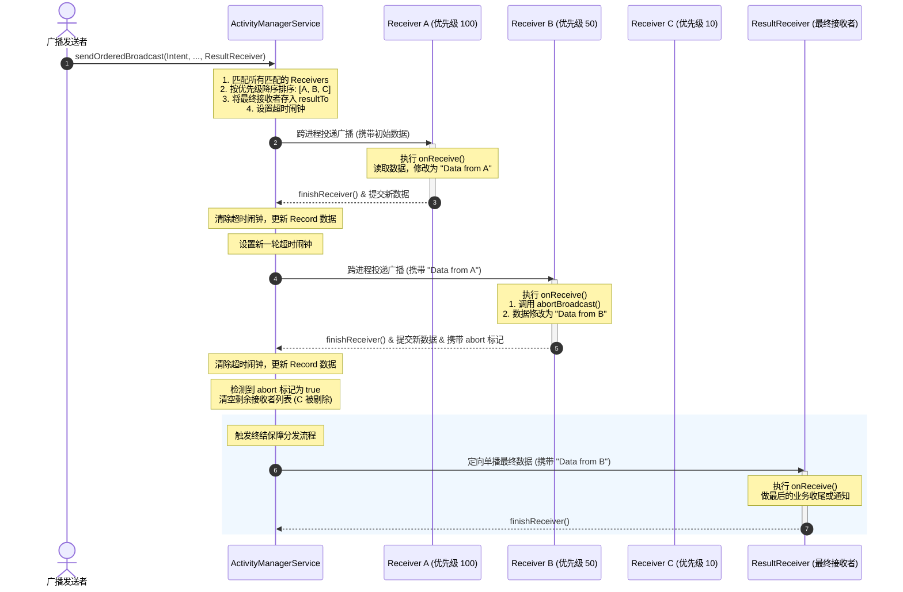

# 5.1.2.3.3 有序广播

在 Android 系统的组件通信机制中，广播（Broadcast）扮演着极其重要的角色。通常，我们使用的普通广播（Normal Broadcast，即无序广播）是一种完全异步的单向通信模式，其发送者不关心接收者的处理进度和结果。然而，在某些特定业务场景中——例如短信拦截、安全防护拦截或跨应用链式业务数据传递——我们需要对广播的接收顺序、数据修改以及分发终止进行精准控制。为此，Android 提供了**有序广播（Ordered Broadcast）**机制。

有序广播提供了一种基于优先级过滤、链式修改和物理拦截的高级异步/同步混合通信模式。本文将从底层设计、分发路由、数据流转、终结保障机制以及历史安全变更等维度，深度剖析 Android 有序广播的运行机理。

---

## 1. 有序广播与无序广播的深度对比

在深入有序广播的物理实现之前，我们需要厘清它与普通无序广播在核心架构和运行特性上的本质区别。

| 对比维度 | 无序广播 (Normal Broadcast) | 有序广播 (Ordered Broadcast) |
| :--- | :--- | :--- |
| **分发时序** | 异步并行。所有匹配的接收器（Receivers）几乎在同一时间收到广播，分发顺序不确定。 | 同步串行。所有接收器根据特定的优先级规则排队，由 AMS 依次向各个接收器投递。 |
| **拦截能力** | 不可拦截。一旦广播发出，系统会尽力保证所有匹配的接收器均能执行 `onReceive()`，中途无法阻断。 | 可被拦截。任何接收器在执行时均可通过调用 `abortBroadcast()` 终止当前广播向后传递。 |
| **数据流动** | 接收器之间彼此孤立。无法通过广播媒介将前一个接收器的处理结果或数据传给下一个接收器。 | 支持双向流转。接收器可以通过 Result 接口读取前置接收器传来的数据，并修改后传给后置接收器。 |
| **最终接收者** | 不支持。发送时无法指定一个无论如何都会收到广播并汇总结果的终结接收器。 | 支持。通过 `sendOrderedBroadcast()` 传入一个最终接收器，即使广播被拦截也会被激活。 |
| **执行效率与瓶颈**| 效率极高。不受单个接收器阻塞的影响，但容易在瞬时产生多进程拉起，造成内存压力。 | 效率低。每个接收器的执行时间都会累加，前置接收器的卡顿或阻塞会直接导致后续接收器延迟甚至 ANR。 |
| **适用场景** | 状态通知、大范围的异步事件发布（如网络状态变化、电量变化、开机广播等）。 | 需要链式处理、权限过滤、拦截防御或强制回调的复杂业务（如早期的短信拦截、安全审核等）。 |

通过上表可以看出，有序广播的核心优势在于**控制力**（顺序控制、拦截控制、数据控制），而其代价则是**系统吞吐量和运行效率的下降**。

---

## 2. 链式分发与优先级控制机制

有序广播的核心特性是其按照接收者的优先级（Priority）降序进行串行分发。这一机制的实现涉及 `android:priority` 的属性声明、AMS 内部的接收者合并与排序算法，以及同优先级下的决议规则。

### 2.1 android:priority 的声明与取值范围

无论是通过静态方式（AndroidManifest.xml）还是动态方式（代码注册）声明的 `BroadcastReceiver`，都可以通过指定 `priority` 值来表明其在分发链中的权重。

* **静态注册（AndroidManifest.xml）**：
  在 `<intent-filter>` 节点中声明 `android:priority` 属性：
  ```xml
  <receiver android:name=".HighPriorityReceiver" android:exported="true">
      <intent-filter android:priority="1000">
          <action android:name="com.example.action.ORDERED_TEST" />
      </intent-filter>
  </receiver>
  ```

* **动态注册（Java/Kotlin 代码）**：
  在构建 `IntentFilter` 时，调用 `setPriority(int priority)` 方法：
  ```kotlin
  val filter = IntentFilter("com.example.action.ORDERED_TEST").apply {
      priority = 1000
  }
  registerReceiver(myReceiver, filter)
  ```

* **优先级取值范围的底层定义**：
  在 Android 的官方开发文档中，应用层推荐的优先级取值范围通常在 `IntentFilter.SYSTEM_LOW_PRIORITY`（`-1000`）至 `IntentFilter.SYSTEM_HIGH_PRIORITY`（`1000`）之间。
  然而，在系统源码层面（`IntentFilter.java` 中），`priority` 的物理存储类型是 `int`，这意味着其绝对取值范围是 `[-2147483648, 2147483647]`（即 `Integer.MIN_VALUE` 到 `Integer.MAX_VALUE`）。
  为了确保应用能够优先于一切普通第三方应用捕获广播，系统的某些核心组件（如系统电话、系统短信、核心安全服务）常会将其接收器的优先级设为 `1000` 以上，甚至设为 `Integer.MAX_VALUE`。对于非系统应用，如果声明了超过 `1000` 的优先级，在某些定制系统或高版本 Android 中可能会被系统自动截断或重置为 `1000`，但在原生 Android 底层代码中，依然是直接按照整数的数值进行降序比对。

### 2.2 AMS 内部的接收者搜集与排序算法

当应用层调用 `sendOrderedBroadcast(Intent, ...)` 时，请求会通过 Binder IPC 跨进程传输至系统进程的 `ActivityManagerService`（简称 AMS）。AMS 内部的排序与路由流程如下：

1. **搜集匹配的接收者**：
   AMS 不会事先维护一个全局有序的广播接收者列表。相反，每当一条有序广播发出时，AMS 会实时通过 `PackageManagerService`（PMS）查询所有与该 Intent 匹配的静态注册接收者（解析为 `ResolveInfo` 对象），并从内存中的动态注册接收者映射表（`ReceiverList`）中过滤出匹配的动态接收者（解析为 `BroadcastFilter` 对象）。

2. **合并与统一类型转化**：
   AMS 将搜集到的静态接收者与动态接收者合并到一个统一的 `List<Object>` 集合中。在内部数据结构上，静态接收者代表着尚未启动或已在后台运行的组件信息，而动态接收者代表着当前活跃的 Binder 客户端连接。

3. **执行排序**：
   AMS 会对该列表执行排序操作。其排序比较器（Comparator）底层依据的是每个接收者在 `IntentFilter` 中声明的 `priority` 值。排序使用的是标准的降序排序：**优先级数值越大，排序越靠前，分发时序越早。**

4. **同优先级决议规则**：
   当遇到多个接收器声明了完全相同的 `priority` 值时，系统将遵循以下决议策略：
   * **动态注册优先于静态注册**：如果一个动态接收器和一个静态接收器优先级相同，AMS 倾向于先将广播投递给动态接收器。这是因为动态接收器所在的进程必然已经处于运行状态，无需经历冷启动的开销，可以更快地完成投递循环。
   * **同类接收器按注册/扫描顺序决定**：如果是两个静态接收器优先级相同，则按照 PMS 在解析 `AndroidManifest.xml` 时的先后顺序（通常为文件中的物理顺序或包名排序）进行投递；如果是两个动态接收器优先级相同，则按照它们在内存中注册的先后时间顺序进行投递。

---

## 3. AMS 物理排队流程与超时机制

有序广播在 AMS 中并非直接通过线程池多线程分发，而是被置于严格的串行物理队列中进行调度。这一设计主要是为了支持数据的链式传递和广播的物理拦截。

### 3.1 广播队列的分类

AMS 内部持有两个核心的广播队列实例（`BroadcastQueue`）：
- **前台广播队列（Foreground Broadcast Queue）**：如果在发送广播的 Intent 中添加了 `Intent.FLAG_RECEIVER_FOREGROUND` 标志，广播将被放入前台队列。该队列拥有极高的 CPU 调度优先级，并且超时时间较短。
- **后台广播队列（Background Broadcast Queue）**：默认情况下，未添加前台标志的广播均会被放入后台队列，按部就班地进行串行处理。

### 3.2 串行投递的物理循环（`processNextBroadcast`）

当一条有序广播被加入到 `BroadcastQueue` 的 `mOrderedBroadcasts` 列表中后，AMS 将通过核心调度方法 `processNextBroadcast(boolean)` 开启串行分发：

1. **取出 Record 并锁定当前接收者**：
   AMS 从队列头部取出当前待处理的 `BroadcastRecord`。该 Record 中保存了前面已经排好序的接收者列表（包含静态接收者和动态接收者），并持有一个名为 `nextReceiver` 的整数索引，用来标记当前应该向哪一个接收者投递广播。

2. **进程状态检查与冷启动**：
   AMS 获取列表中 `nextReceiver` 位置的接收者信息：
   * 如果该接收者是**动态注册**的，AMS 可以直接通过其保存在内存中的 Binder 引用（`IIntentReceiver`）跨进程调用目标进程的 `performReceive` 方法。
   * 如果该接收者是**静态注册**的，AMS 会先检查该接收者所在的进程是否已经在运行。如果进程未启动，AMS 将暂时中断广播的分发流程，调用 `startProcessLocked` 启动该目标进程。在目标进程完成初始化、绑定 Application 且向 AMS 回传就绪信息后，分发流程才会继续。

3. **设置超时闹钟（ANR 预防）**：
   由于有序广播是串行且同步等待的，若某个接收者在 `onReceive()` 中执行了耗时操作或发生了死锁，整个广播队列都将处于停滞状态。
   为了防止这种灾难性的后果，AMS 在每次将广播投递给某个接收者之前，都会调用系统定时器设置一个**超时闹钟（Broadcast Timeout Timer）**：
   * **前台队列超时限制**：通常为 **10 秒**。
   * **后台队列超时限制**：通常为 **60 秒**。

4. **主线程执行与 Binder 回调**：
   目标进程收到投递消息后，会将广播任务分发到其主线程（UI 线程）的 Looper 队列中。主线程取出任务，实例化 `BroadcastReceiver`，并回调其 `onReceive(Context, Intent)` 方法。
   * **同步模式**：默认情况下，`onReceive()` 在主线程中同步执行。执行完毕后，系统会自动调用 `finishReceiver`。
   * **异步模式**：如果在 `onReceive()` 中调用了 `goAsync()`，接收者可以在子线程中继续处理，但必须在超时限制内手动调用 `PendingResult.finish()`。

5. **回传 AMS 与清除闹钟**：
   当接收器执行完毕（无论是同步结束还是异步调用 `finish()`），都会通过 Binder 调用 AMS 的 `finishReceiver` 接口。
   AMS 收到回调后，第一件事就是**取消当前设置的超时闹钟**。接着，它会检查是否有拦截或数据更新的标记，递增 `nextReceiver` 的值，并再次触发 `processNextBroadcast` 开启下一轮分发。

### 3.3 广播 ANR 的触发与恢复

如果目标接收器在设定的超时时间（如前台 10 秒）内没有回传 `finishReceiver`，AMS 内部的超时闹钟就会被激活。此时系统将执行以下紧急恢复逻辑：
1. **抛出 ANR 异常**：在系统日志中打印 `Timeout of broadcast BroadcastRecord{...}`，并弹出 ANR 对话框（如果前台应用受影响）。
2. **强制终结当前接收器**：AMS 判定当前接收器已经失去响应，会强行将其从当前的执行状态中剥离。
3. **强行跳过并继续**：AMS 不会取消整条广播的发送，而是会强制将 `nextReceiver` 递增，调用 `processNextBroadcast()` 继续向队列中的下一个接收者投递广播，以此避免整个系统的广播子系统陷入永久瘫痪。

---

## 4. 广播的截断与数据传递原理

有序广播不仅仅是有序分发，它还允许接收者在传递链条中进行两项关键操作：**拦截广播（截断）**和**修改/传递数据**。这两个功能在底层的实现并非直接在进程间传递内存，而是通过 AMS 作为“数据中转站”和“状态记录器”实现的。

### 4.1 数据双向传递的物理设计

在有序广播的生命周期内，结果数据并不是像接力棒一样由前一个接收器进程直接发送给下一个接收器进程。相反，所有的数据都集中保存在系统进程的 `BroadcastRecord` 中，它在内部维护了三个关键状态变量：
* `int resultCode`：结果码（如 Activity 的 `RESULT_OK` / `RESULT_CANCELED`，或自定义的状态码）。
* `String resultData`：结果字符串数据。
* `Bundle resultExtras`：携带的额外数据包（Bundle 容器）。

#### 底层流转流程：

1. **下发读取（AMS -> Receiver）**：
   当 AMS 准备分发广播给接收器 $N$ 时，会将 `BroadcastRecord` 中当前的 `resultCode`、`resultData` 和 `resultExtras` 打包进 Binder 传输的数据结构中，发送给接收器 $N$ 所在的进程。
   目标进程在反射调用 `onReceive()` 之前，会提取这三个变量，并在内部构造一个 `BroadcastReceiver.PendingResult` 对象。接收者通过以下方法从本地的 `PendingResult` 中读取前置节点传来的数据：
   ```kotlin
   override fun onReceive(context: Context, intent: Intent) {
       val code = resultCode // 对应 getResultCode()
       val data = resultData // 对应 getResultData()
       // parameter makeMap 为 true 时，如果当前不存在 Bundle 则会自动创建空 Map
       val extras = getResultExtras(false) 
   }
   ```

2. **本地修改与状态缓存**：
   在 `onReceive()` 中，接收者可以调用 API 修改结果：
   ```kotlin
   setResultCode(200)
   setResultData("Data modified by HighPriorityReceiver")
   // 也可以使用快捷的一体化方法：
   // setResult(200, "Data modified", newBundle)
   
   val bundle = getResultExtras(true).apply {
       putString("key_token", "secure_token_123")
   }
   setResultExtras(bundle)
   ```
   **注意**：这些 `setResult` 系列方法并没有立即发起跨进程通信，它们只是修改了当前进程中 `PendingResult` 对象的成员变量。

3. **同步推回（Receiver -> AMS）**：
   当 `onReceive()` 执行结束，进程底层调用 Binder 回调 `ActivityManagerService.finishReceiver()` 时，会将 `PendingResult` 中最新的 `resultCode`、`resultData`、`resultExtras` 作为 Binder 参数一同回传给 AMS。
   AMS 接收到回调后，会将回传的值同步改写到 `BroadcastRecord` 对应的物理字段中。

4. **下一代接收（AMS -> Receiver $N+1$）**：
   当 AMS 进入下一个接收器 $N+1$ 的分发循环时，它会取出刚刚被改写的 `BroadcastRecord` 数据，再次打包发送给接收器 $N+1$。由此实现了数据的链式传递。

### 4.2 abortBroadcast() 的生效机理与阻断路由

`abortBroadcast()` 方法允许接收器彻底截断广播，阻止后续的接收器接收到该广播。

* **本地置位**：
  当接收器在 `onReceive()` 中调用 `abortBroadcast()` 时，在底层仅仅是把本地 `PendingResult` 结构中的 `mAborted` 布尔标志位置为 `true`。
  ```java
  // BroadcastReceiver.java 源码片段示意
  public final void abortBroadcast() {
      checkSynchronousHint(); // 检查物理上是否是有序广播，若为无序广播则直接抛出异常
      mPendingResult.mAborted = true;
  }
  ```

* **Binder 回传**：
  在 `finishReceiver` 跨进程调用中，这个 `mAborted` 标志位会被打包回传给 AMS。

* **物理路由阻断**：
  AMS 收到 `finishReceiver` 消息后，其内部的 `BroadcastQueue` 会立即读取回传的 `mAborted` 标志：
  ```java
  // AMS BroadcastQueue 内部逻辑物理阻断伪代码
  if (record.mAborted) {
      // 如果检测到拦截标志为 true，直接清空接收者列表，或者将索引指向末尾
      record.receivers.clear(); 
      // 从而使得下一次 processNextBroadcast 时，判定队列已处理完毕，物理上阻断后续分发
  }
  ```
  通过直接清除 `BroadcastRecord` 中尚未处理的接收器列表，AMS 从物理上阻断了向后续任何接收器投递广播的可能。

---

## 5. 最终保证：ResultReceiver 的执行机制

在链式分发和拦截机制下，存在一个明显的缺陷：如果广播发送者非常关心广播的最终执行状态，或者需要收集所有接收器处理完后的最终汇总数据，一旦中间某一个高优先级的接收器调用了 `abortBroadcast()` 截断了广播，或者某个接收器所在的进程发生异常退出、执行超时，广播发送者就再也无法收到任何结果回调。

为了解决这一痛点，Android 设计了**最终接收者（ResultReceiver，在系统源码中常称为 `resultTo`）**保障机制。

### 5.1 sendOrderedBroadcast 的参数详解

要使用终结保障机制，发送者必须调用重载的 `sendOrderedBroadcast` 方法：

```kotlin
context.sendOrderedBroadcast(
    intent,                  // 意图
    null,                    // 接收权限限制（String）
    resultReceiver,          // 最终接收者（BroadcastReceiver）
    null,                    // 运行 resultReceiver 的 Handler 线程（为 null 则在发送者的主线程）
    Activity.RESULT_OK,      // 初始结果码
    "Initial Data",          // 初始结果数据
    null                     // 初始附加 Bundle
)
```

在这个 API 中，`resultReceiver` 就是我们指定的最终接收者。它拥有一个极其霸道的特权：**无论广播在中间分发链条中经历了解锁、修改、超时还是被彻底拦截（`abortBroadcast`），它都保证一定会被执行，且是最后一个执行。**

### 5.2 终结回调保障的系统底层原理

我们来探究 AMS 底层是如何确保 `resultReceiver` 被无条件激活的：

1. **特别的 `resultTo` 引用保存**：
   在 AMS 内部，当发送有序广播时，传入的 `resultReceiver` 被包装成一个 Binder 客户端代理对象（类型为 `IIntentReceiver`），并专门保存在 `BroadcastRecord` 的 `resultTo` 成员变量中。
   需要强调的是，**这个 `resultTo` 不会被放入待排序的接收者列表（`receivers` 列表）中**，它是独立存储的。

2. **流程收尾时的强制分发**：
   在 `BroadcastQueue.processNextBroadcast` 的逻辑中，当遇到以下几种情况时，系统会判定当前有序广播的“串行分发链”已经结束：
   * 情况 A：`nextReceiver` 索引已经达到 `receivers` 列表的末尾（所有接收器正常处理完毕）。
   * 情况 B：由于某个接收器调用了 `abortBroadcast()`，`receivers` 列表被清空。
   * 情况 C：某个接收器执行发生超时 ANR，被系统强制剥离。

   此时，AMS 会调用 `performReceiveLocked` 方法来进行最后的收尾清理。在收尾逻辑中，系统会执行如下判断：
   ```java
   // BroadcastQueue.java 源码核心逻辑示意
   if (record.resultTo != null) {
       // 无论中途发生了什么，只要 resultTo 不为 null，就直接进行定向分发
       performReceiveLocked(
           record.callerApp, 
           record.resultTo, // 最终接收者的 Binder 引用
           new Intent(record.intent), 
           record.resultCode, 
           record.resultData,
           record.resultExtras, 
           false, 
           false, 
           record.userId
       );
       // 投递完成后清空，防止二次投递
       record.resultTo = null;
   }
   ```

3. **直接单播投递与线程回调**：
   由于这一步是 AMS 直接通过 Binder 强行投递给 `resultTo`，它**完全绕过了接收者列表的排序、遍历和拦截检测**。这类似于一次精准的定向单播推送。因此，即便前面所有的接收器都把广播拦截了，最新修改后的 `resultCode`、`resultData`、`resultExtras` 依然能安全地送达 `resultReceiver` 中。
   这形成了一个天然的异步回调闭环：发送者发起广播，其他接收器串行处理并可能拦截，最终在发送者的 `resultReceiver` 收到统一的汇总数据。这种机制使得广播非常像一个跨进程的 `Promise` 或异步任务链。

---

## 6. 有序广播时序控制与拦截物理机制

为了更直观地展示在 AMS 介入下，有序广播如何进行按优先级分发、中间拦截、以及最终 ResultReceiver 激活的完整流程，以下绘制了详细的时序图：



---

## 7. 典型实战场景与历史局限性

在 Android 的历史发展演进中，有序广播最著名的实战场景莫过于**短信过滤与安全防护拦截**。然而，这一设计也伴随着系统安全模型的演进而发生了历史性转变。

### 7.1 系统短信拦截的历史设计（Android 4.4 之前）

在 Android 4.4 之前，当手机接收到新的短消息时，系统底层的短信服务会向全系统广播一条有序广播：
- **广播 Action**：`android.provider.Telephony.SMS_RECEIVED`（常简称为 `SMS_RECEIVED`）。

由于该广播是有序广播，市面上的第三方安全管家类应用（如 360安全卫士、腾讯手机管家等）通常会采用如下策略来实现短信过滤与骚扰拦截：
1. **抢占高优先级**：在 `AndroidManifest.xml` 中将短信接收器的优先级设置为 `android:priority="2147483647"`（即 `Integer.MAX_VALUE`）。
2. **分析与决策**：当有新短信到来时，安全软件的接收器会最先被 AMS 唤醒。在 `onReceive()` 中，利用 `SmsMessage` 类解析出短信的发件人号码和文本内容，并通过敏感词库或黑名单进行匹配。
3. **静默拦截**：如果判定为垃圾短信，安全软件会直接调用 `abortBroadcast()`，并可能将该短信内容悄悄写入自己应用内部的私有数据库中（供用户在安全软件内查看拦截记录）。
4. **阻断分发**：因为广播被拦截，AMS 清空了后续列表，系统默认的短信应用（如系统自带的“信息”App）根本不会收到这条广播，也就不会将短信写入系统的公共短信数据库，用户手机更不会弹出收到短信的震动和声音提示。这在当时被认为是一种极为高效的拦截技术。

### 7.2 安全隐患与 Android 4.4 的历史性收紧

上述利用有序广播拦截短信的机制，在解决骚扰短信问题的同时，带来了巨大的系统级安全隐患：
* **验证码窃取风险**：恶意软件可以静默注册极高优先级的短信广播接收器。当银行发送扣款短信、验证码短信时，恶意软件在后台悄悄拦截（`abortBroadcast()`），并将短信转发给攻击者服务器，而用户由于系统短信 App 被阻断，完全不知道自己收到过验证码，这导致了大量的财产损失案。
* **优先级恶性竞争**：各大安全应用为了保证自己是最先收到短信的，开始在优先级数值上进行恶性竞争，甚至通过动态注册等手段打压静态接收者，导致系统广播分发逻辑混乱，严重影响手机功耗和运行稳定性。

为了彻底根治这一安全漏洞，Google 在 **[Android 4.4（API 19 / 20）](../../../../../../AndroidVersionChangeLog.md#android-44api-19--20)** 中对短信机制进行了颠覆性的调整：
1. **默认短信应用限制**：系统引入了“默认短信应用（Default SMS App）”的全局配置。只有被用户在系统设置中明确配置为默认短信应用的角色，才具有向系统公共短信数据库写数据、删除数据的权限。
2. **默认短信应用的配置契约**：
   要成为默认短信应用，应用必须注册并声明四个特定的组件契约，以便系统判定其具备短信收发和展示能力：
   * 静态注册一个接收 `SMS_DELIVER_ACTION` (`android.provider.Telephony.SMS_DELIVER`) 的广播接收器。
   * 静态注册一个接收 `WAP_PUSH_DELIVER_ACTION` (`android.provider.Telephony.WAP_PUSH_DELIVER`) 的广播接收器。
   * 注册一个可以响应发送短信 Intent（如 `android.intent.action.SENDTO` 且 schema 为 `smsto:`）的发送 Activity。
   * 包含一个处理短信快速发送的后台服务（Service）。
3. **有序广播专用化**：系统新增的 `android.provider.Telephony.SMS_DELIVER` 广播，是一个专门投递给**默认短信应用**的有序广播。非默认短信应用绝对无法接收到该广播，更无从拦截。
4. **接收广播无序化**：原有的 `android.provider.Telephony.SMS_RECEIVED` 广播虽然依然会向所有声明了接收权限的应用广播，但**该广播被彻底改为了无序广播**。普通的第三方应用即便声明了极高优先级并调用 `abortBroadcast()`，也无法阻止默认短信应用接收和写入短信。

这一变化虽然极大保护了用户的隐私安全，但也直接导致了当时所有第三方安全软件的短信拦截功能失效，安全软件不得不引导用户将其设置为“默认短信应用”来保留拦截功能。

---

## 8. 有序广播的现代局限性与设计避坑指南

随着 Android 系统向着功耗控制、运行效率和隐私安全方向持续演进，有序广播在现代应用开发中的生存空间正在被大幅压缩。在实际项目架构中，除非是特定的系统定制开发，否则应尽量避免使用有序广播。

### 8.1 核心性能缺陷

1. **ANR 易发性**：
   有序广播的分发是串行且同步等待的。如果广播分发链条上有 5 个接收器，每个接收器耗时 2 秒，那么最后一个接收器收到广播时已经过去了 10 秒。在进程冷启动、Binder 跨进程调用和主线程排队等多重因素叠加下，极其容易引发 ANR 异常。

2. **系统资源消耗大**：
   为了向静态接收器投递有序广播，系统可能需要在极短时间内连续拉起多个处于关闭状态的后台进程。这种频繁的进程冷启动（Fork 进程与虚拟机初始化）会引起剧烈的 CPU 抖动和内存页面置换，导致手机瞬间卡顿。

### 8.2 Android 8.0 隐式广播限制的毁灭性打击

从 Android 8.0（API 26）开始，为了优化后台功耗，系统对隐式广播（即没有明确指定 Component 目标类名的广播）做出了极其严格的静态注册限制。绝大多数隐式广播无法再通过 `AndroidManifest.xml` 进行静态注册接收。
由于有序广播多用于跨应用、松耦合的广播通知，隐式广播限制直接导致了**跨进程的静态注册有序广播基本失效**。开发人员如果仍要使用有序广播，必须明确指定目标应用的包名和类名（显式广播），但这又违背了广播机制“解耦通信”的设计初衷。

### 8.3 现代开发替代方案

在现代 Android 应用架构中，对于不同的组件通信需求，应当采用更为高效和安全的替代方案：

* **应用内部事件传递**：
  如果仅仅是应用内不同组件需要进行有序、有结果反馈的通信，不应该使用重量级的广播。推荐使用：
  * **Kotlin 协程 Flow**：通过 `SharedFlow` 或 `StateFlow` 实现响应式事件流。
  * **LiveData / ViewModel**：用于 UI 层与数据层的状态感知和分发。
  * **单例事件总线（EventBus）**：如果确实需要解耦，可以使用轻量级的应用内发布-订阅总线。
  * **LocalBroadcastManager（本地广播）**：虽然已被官方废弃，但其原理是利用主线程 Handler 进行消息分发，不涉及任何 IPC 跨进程操作，性能远高于普通广播。

* **跨进程有序事务处理**：
  如果需要跨进程进行有返回结果的、安全且可控的调用，应当使用 **AIDL（Android Interface Definition Language）** 结合 Binder 回调。AIDL 提供了更高级别的类型安全、同步/异步控制、精确的超时管理（借助 `RemoteCallbackList`），并且避免了广播系统繁琐的过滤和排序开销。

* **后台任务调度**：
  对于过去依赖静态广播唤醒进程执行后台任务的场景，现代开发中必须切换至 **WorkManager** 或 **JobScheduler**。它们是由系统统一调度的后台任务管理器，会在系统资源充足、网络就绪或充电时合并执行，远比使用广播去强行唤醒进程更加克制和省电。
