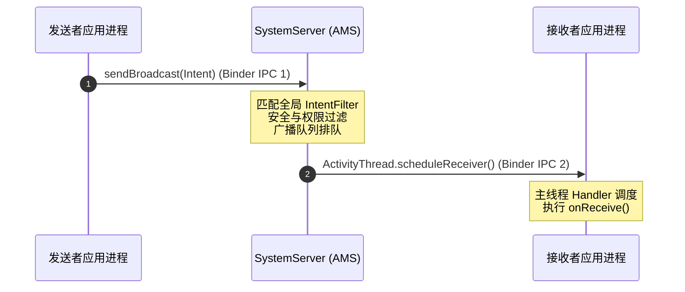
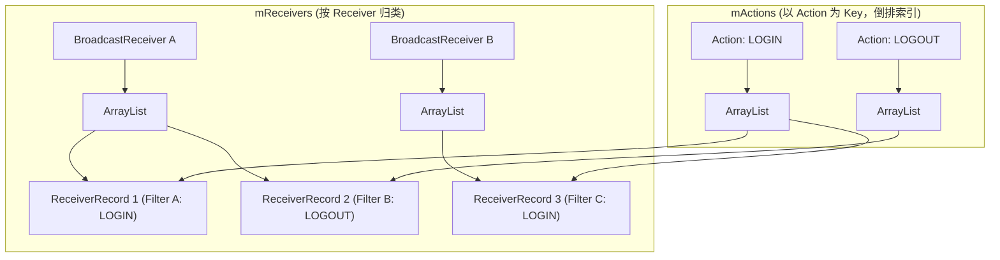
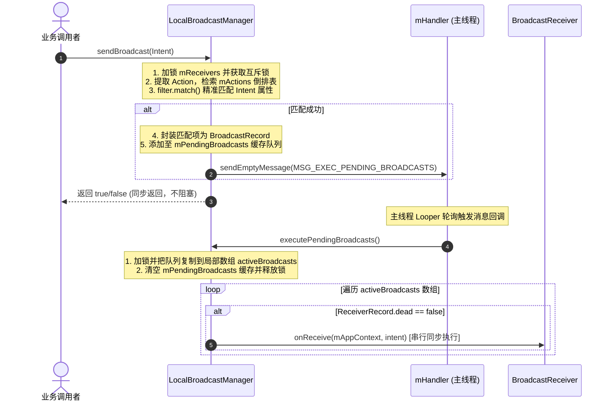

# 5.1.2.3.4 本地广播

本地广播（`LocalBroadcastManager`）是 Android 社区在早期单应用进程内解决组件间安全、高效数据通信的重要机制。虽然随着 Android 系统的演进与现代响应式编程架构的兴起，它在 Android 13（API 33）正式宣告弃用，但其基于“观察者模式 + Handler 消息队列”的轻量化架构设计，依然是应用内高并发通信与进程隔离设计的经典案例。

本篇文章将系统性地深入解密本地广播的核心运行机制、源码架构、性能与安全优势，探讨其弃用的技术背景，并对比当下主流的现代替代方案。

---

## 一、 为什么引入本地广播：机制与性能/安全红利

在传统的 Android 开发中，若需要在不同组件（如 Activity、Service、BroadcastReceiver）之间传递数据，最直观的方式是使用系统的全局广播（Global Broadcast）。然而，全局广播是跨进程的系统级通信机制。如果仅仅是在同一个应用进程内部进行通信，使用全局广播就无异于“大炮打蚊子”，不仅面临显著的性能开销，还会引入严重的安全隐患。

为此，Google 在早期 Support Library 中引入了 `LocalBroadcastManager`，在应用进程内部实现了轻量级的发布-订阅模式。

### 1. 跨进程与单进程：跨越式的性能优势

要理解本地广播的性能优势，我们首先需要对比全局广播与本地广播在流转链路上的本质差异。

#### 全局广播的流转路径（跨进程 IPC）
全局广播是基于 Android 系统的 IPC（Inter-Process Communication，进程间通信）机制实现的，其运行链路极其冗长：
1. **发送端发起**：发送者调用 `sendBroadcast(Intent)`。
2. **首次跨进程**：应用进程通过 `Binder IPC` 将 Intent 及相关参数打包，发送至系统进程 `SystemServer` 里的 `ActivityManagerService`（简称 AMS）。
3. **AMS 解析与检索**：AMS 在全局广播队列（`BroadcastQueue`）中排队，然后检索系统内所有注册了匹配 `IntentFilter` 的广播接收器（包括静态注册与动态注册的接收器）。
4. **安全校验与锁竞争**：AMS 内部涉及对全局进程状态、权限校验以及复杂的锁竞争（通常需要持有 AMS 级别的全局锁），这在高负载情况下会引起严重的锁等待。
5. **再次跨进程**：对于每个匹配的接收器，AMS 通过 `Binder IPC` 回调接收器所在应用进程的 `ApplicationThread`。
6. **线程调度与执行**：目标进程收到通知后，将其投递到主线程的 `Handler` 消息队列中，在下一次 Looper 循环时回调 `BroadcastReceiver.onReceive()`。

在上述流转路径中，**两次跨进程 Binder 通信、多次内存拷贝、序列化/反序列化、系统级锁竞争以及进程调度**带来了极高的系统开销。在高频或大数据量传输场景下，会引发明显的 CPU 波动，甚至导致调用端进程和系统进程因 Binder 线程耗尽或主线程卡顿而发生 Jank（掉帧）乃至 ANR。



#### 本地广播的流转路径（单进程内回调）
相比之下，本地广播完全限制在**单个应用进程的内存空间内**，其本质是一个经过封装的**观察者模式**与 **Handler 机制**的结合体：
1. **纯内存匹配**：`LocalBroadcastManager` 内部维护了两个用于存储接收者和过滤器的 `HashMap`。当调用 `sendBroadcast` 时，它直接在当前进程的内存中遍历这两个 Map，进行 `IntentFilter` 的逻辑匹配。
2. **同进程异步调度**：匹配成功后，直接通过绑定的主线程 `Handler` 投递一个内部消息。
3. **本地回调**：主线程 Looper 轮询到该消息时，直接同步回调 `BroadcastReceiver.onReceive()`。

整个过程**没有任何 Binder 调用，没有任何跨进程通信，也不涉及系统级服务的锁竞争**。其运行效率与普通的 Java/Kotlin 方法回调 and 内存对象操作处于同一量级。实验表明，本地广播的执行耗时比全局广播低了 2 到 3 个数量级，极大提升了应用内的通信性能。

### 2. 物理级隔离：绝对的安全性

全局广播的开放性使其极易受到外部攻击，开发者如果未对广播的导出状态（`exported`）或权限进行精细化控制，将面临严重的双向安全威胁：
* **敏感数据泄露（发送方风险）**：应用发送的全局广播可以被系统内任何注册了相同 Action 的恶意应用截获，从而导致敏感的业务数据外泄。
* **恶意事件注入与越权漏洞（接收方风险）**：应用内暴露的广播接收器可能会接收到外部恶意应用伪造的 `Intent`，从而触发非预期的业务流程，造成越权、数据篡改甚至是拒绝服务攻击（Denial of Service）。

`LocalBroadcastManager` 提供的本地广播机制从物理上彻底杜绝了上述风险：
* 它不需要也不通过 Android 系统的 `Binder` 和 `SystemServer` 传递消息。
* 所有的接收者注册信息只保存在当前进程的私有内存中。
* 外部应用进程无法通过任何手段获取或向 `LocalBroadcastManager` 发送广播。

这种**单进程边界隔离**天生免疫了来自外部进程的监听、劫持和伪造注入，为应用内组件通信提供了绝对安全的运行环境。

---

## 二、 源码底层实现剖析

`LocalBroadcastManager` 的源码设计非常简洁而优雅，它没有依赖任何 Framework 层的复杂服务，纯粹基于标准 Java/Android 集合和 Handler 构建。下面我们对它的底层数据结构、单例模式、注册、注销和发送机制进行逐一剖析。

### 1. 核心数据结构与单例构建

为了实现高效的事件匹配与跨线程调度，`LocalBroadcastManager` 在内部设计了两个互补的核心 Map 以及对应的包装实体类：

```java
// 核心 Map 1：以 BroadcastReceiver 为键，保存该接收器注册的所有 IntentFilter（包装在 ReceiverRecord 中）
// 主要用于快速定位并注销指定的接收器
private final HashMap<BroadcastReceiver, ArrayList<ReceiverRecord>> mReceivers = new HashMap<>();

// 核心 Map 2：以 Action 字符串为键，保存所有注册了该 Action 的接收器列表
// 类似于倒排索引，主要用于在 sendBroadcast 时快速根据 Action 匹配出符合条件的接收器，避免全局遍历
private final HashMap<String, ArrayList<ReceiverRecord>> mActions = new HashMap<>();

// 待处理的广播队列，保存了已经匹配成功但尚未在主线程回调的广播任务
private final ArrayList<BroadcastRecord> mPendingBroadcasts = new ArrayList<>();
```

#### 双核心 Map 的倒排索引设计原理
* **为什么需要两个 Map 结构？**
  * **按 Receiver 归类的 `mReceivers`**：当外部调用 `unregisterReceiver(receiver)` 时，我们需要知道该 receiver 注册了哪些 action。如果没有 `mReceivers`，我们就必须遍历整个 `mActions` Map 中的所有 Action，再遍历每个 Action 对应的 `ArrayList<ReceiverRecord>`，这会带来 $O(N)$（$N$ 为注册总记录数）的时间复杂度。而有了 `mReceivers`，我们只需以 $O(1)$ 的开销找到该 receiver 对应的所有 `ReceiverRecord`，然后顺藤剥瓜，只针对这些记录中包含的 Action 去 `mActions` 对应的 List 中删除，注销性能大大提升。
  * **以 Action 为 Key 的 `mActions`**：当发送广播时，`Intent` 中带有特定的 `Action`。如果不使用 `mActions` 倒排索引，就必须遍历 `mReceivers` 中的每一个 Receiver 的所有 Filter 来做匹配，效率非常低下。引入 `mActions` 后，可以通过 Action 快速检索出候选的 `ReceiverRecord` 列表，将匹配范围缩减到仅关注该 Action 的订阅者，极大地提高了发送广播时的匹配效率。

下图展示了 `mReceivers` 与 `mActions` 之间的映射与共享关系：



#### 单例构建
`LocalBroadcastManager` 采用了带有锁同步的单例模式，并在构造方法中绑定了主线程的 `Looper`，用于后续将广播回调调度回主线程执行：

```java
private static final Object mLock = new Object();
private static LocalBroadcastManager mInstance;

public static LocalBroadcastManager getInstance(Context context) {
    synchronized (mLock) {
        if (mInstance == null) {
            // 强制转换为 ApplicationContext，防止持有 Activity 导致 Context 内存泄漏
            mInstance = new LocalBroadcastManager(context.getApplicationContext());
        }
        return mInstance;
    }
}

private LocalBroadcastManager(Context context) {
    mAppContext = context;
    // 绑定主线程 Looper，创建处理待分发广播的 Handler
    mHandler = new Handler(context.getMainLooper()) {
        @Override
        public void handleMessage(Message msg) {
            switch (msg.what) {
                case MSG_EXEC_PENDING_BROADCASTS:
                    executePendingBroadcasts();
                    break;
                default:
                    super.handleMessage(msg);
            }
        }
    };
}
```

其内部包含两个核心包装类：
* **`ReceiverRecord`**：表示一次注册记录，包含 `IntentFilter`、`BroadcastReceiver` 引用，以及一个 `dead` 标记（在注销时会被置为 `true`，以防止在待分发队列中被重复回调）。
* **`BroadcastRecord`**：表示一个即将被分发的广播任务，包含发送的 `Intent` 实例以及该广播匹配成功的所有 `ReceiverRecord` 列表。

### 2. 动态注册逻辑剖析 (`registerReceiver`)

当开发者调用 `registerReceiver` 时，底层的主要任务就是将 Receiver 记录维护到 `mReceivers` 和 `mActions` 两个 Map 中。由于涉及多线程并发修改，整个方法被 `synchronized (mReceivers)` 所包裹，以保证线程安全：

```java
public void registerReceiver(BroadcastReceiver receiver, IntentFilter filter) {
    synchronized (mReceivers) {
        // 1. 创建注册记录实例
        ReceiverRecord entry = new ReceiverRecord(filter, receiver);
        
        // 2. 更新 mReceivers 映射表
        ArrayList<ReceiverRecord> filters = mReceivers.get(receiver);
        if (filters == null) {
            filters = new ArrayList<>(1);
            mReceivers.put(receiver, filters);
        }
        filters.add(entry);
        
        // 3. 更新 mActions 映射表（倒排索引）
        for (int i = 0; i < filter.countActions(); i++) {
            String action = filter.getAction(i);
            ArrayList<ReceiverRecord> entries = mActions.get(action);
            if (entries == null) {
                entries = new ArrayList<>(1);
                mActions.put(action, entries);
            }
            entries.add(entry);
        }
    }
}
```

* **设计精妙之处**：
  每次注册时，通过遍历 `filter` 的所有 Action，把同一个 `ReceiverRecord` 实例存放到 `mActions` 对应 Action 的 List 中。这样设计让数据在两个 Map 中实现了共享，既方便了通过 Receiver 对象注销，又优化了广播匹配的检索速度。

### 3. 动态注销逻辑剖析 (`unregisterReceiver`)

注销流程是注册的逆过程，核心在于将 Receiver 对应的所有引用从两个映射表中干净地移除，并将对应的 `ReceiverRecord` 标记为 `dead`：

```java
public void unregisterReceiver(BroadcastReceiver receiver) {
    synchronized (mReceivers) {
        // 1. 从 mReceivers 移除该 Receiver 对应的所有 Filter 列表
        final ArrayList<ReceiverRecord> filters = mReceivers.remove(receiver);
        if (filters == null) {
            return;
        }
        
        // 2. 遍历该 Receiver 关联的所有记录
        for (int i = filters.size() - 1; i >= 0; i--) {
            final ReceiverRecord filter = filters.get(i);
            filter.dead = true; // 关键：置为 dead，即使该记录已在 mPendingBroadcasts 中，后续分发时也会被忽略
            
            // 3. 遍历 Filter 下的所有 Action，从 mActions 的列表中移除该 ReceiverRecord
            for (int j = 0; j < filter.filter.countActions(); j++) {
                final String action = filter.filter.getAction(j);
                final ArrayList<ReceiverRecord> entries = mActions.get(action);
                if (entries != null) {
                    for (int k = entries.size() - 1; k >= 0; k--) {
                        final ReceiverRecord entry = entries.get(k);
                        if (entry.receiver == receiver) {
                            entries.remove(k);
                        }
                    }
                    // 如果该 Action 下没有任何接收者了，从 mActions 中清除该 Action 的 Key
                    if (entries.size() <= 0) {
                        mActions.remove(action);
                    }
                }
            }
        }
    }
}
```

* **`dead` 标记的作用与“延迟防御”思想**：
  当调用 `unregisterReceiver` 时，我们并不只是把 `ReceiverRecord` 从 Map 中移除，还会将其 `dead` 属性置为 `true`。这是因为 `sendBroadcast` 是通过 `Handler` 进行异步分发的。当 `sendBroadcast` 匹配出符合条件的 Receiver 列表并封装为 `BroadcastRecord` 放入 `mPendingBroadcasts` 队列中后，如果此时主线程的消息队列中还在排队，此时应用又调用了 `unregisterReceiver` 注销了接收器，那么如果没有 `dead` 标记，当 `Handler` 收到消息执行 `executePendingBroadcasts` 时，它依然会回调已经注销的 `Receiver` 的 `onReceive`，这会导致非预期的行为甚至是内存泄露与崩溃。因此，`dead` 标记在此处起到了延迟防御的作用。

### 4. 广播发送与异步分发闭环 (`sendBroadcast` 与 `executePendingBroadcasts`)

`sendBroadcast` 是本地广播的核心，它分为“匹配筛选”与“异步分发”两个主要阶段。

#### 阶段一：匹配筛选
当调用 `sendBroadcast(Intent)` 时，方法会在 `mReceivers` 锁的同步块中执行检索匹配：

```java
public boolean sendBroadcast(Intent intent) {
    synchronized (mReceivers) {
        final String action = intent.getAction();
        final String type = intent.resolveTypeIfNeeded(mAppContext.getContentResolver());
        final Uri data = intent.getData();
        final String scheme = intent.getScheme();
        final Set<String> categories = intent.getCategories();

        // 1. 通过 Action 从倒排索引 mActions 中快速拿到候选的接收者列表
        ArrayList<ReceiverRecord> entries = mActions.get(intent.getAction());
        if (entries != null) {
            ArrayList<ReceiverRecord> receivers = null;
            // 2. 遍历候选列表，进行详细的 IntentFilter 匹配
            for (int i = 0; i < entries.size(); i++) {
                ReceiverRecord receiver = entries.get(i);
                
                // 3. 过滤条件匹配：Action, Type, Scheme, Data, Categories
                int match = receiver.filter.match(action, type, scheme, data, categories, "LocalBroadcastManager");
                if (match >= 0) {
                    if (receivers == null) {
                        receivers = new ArrayList<>();
                    }
                    receivers.add(receiver);
                }
            }

            // 4. 如果找到了至少一个匹配的接收者，将其封装为待执行记录
            if (receivers != null) {
                mPendingBroadcasts.add(new BroadcastRecord(intent, receivers));
                // 5. 检查 Handler 消息队列，避免重复发送处理消息
                if (!mHandler.hasMessages(MSG_EXEC_PENDING_BROADCASTS)) {
                    mHandler.sendEmptyMessage(MSG_EXEC_PENDING_BROADCASTS);
                }
                return true; // 匹配成功
            }
        }
    }
    return false; // 无匹配接收者
}
```

#### 阶段二：Handler 调度与“降低锁粒度”执行
当主线程 Looper 轮询并执行 `MSG_EXEC_PENDING_BROADCASTS` 消息时，会回调 `executePendingBroadcasts()`。在此方法中，本地广播采用了一种非常经典的**降低锁粒度**的技巧：

```java
void executePendingBroadcasts() {
    while (true) {
        BroadcastRecord[] activeBroadcasts = null;
        synchronized (mReceivers) {
            final int N = mPendingBroadcasts.size();
            if (N <= 0) {
                return;
            }
            activeBroadcasts = new BroadcastRecord[N];
            // 将待执行列表拷贝到局部数组中
            mPendingBroadcasts.toArray(activeBroadcasts);
            // 立即清空原待执行列表，释放锁，降低锁粒度
            mPendingBroadcasts.clear();
        }
        // 在无锁环境下，遍历并串行回调接收者
        for (int i = 0; i < activeBroadcasts.length; i++) {
            BroadcastRecord br = activeBroadcasts[i];
            final int numReceivers = br.receivers.size();
            for (int j = 0; j < numReceivers; j++) {
                final ReceiverRecord rec = br.receivers.get(j);
                // 检查 dead 标志。如果该接收器在排队期间被注销了，则不予执行
                if (!rec.dead) {
                    rec.receiver.onReceive(mAppContext, br.intent);
                }
            }
        }
    }
}
```

* **为什么要“克隆并清空”队列以降低锁粒度？**
  `executePendingBroadcasts` 仅在拷贝队列和清空队列时加锁。真正调用 `onReceive` 时是在锁同步块外面进行的。
  因为 `onReceive` 是用户的业务逻辑，其执行耗时是完全不可控的。如果带着 `mReceivers` 锁去执行 `onReceive`，一旦某个接收器的 `onReceive` 耗时较长（比如由于数据库操作或复杂计算），那么其他线程在此时调用 `registerReceiver`、`unregisterReceiver` 甚至在其他线程调用 `sendBroadcast`，都将被同步锁挂起挂死。通过在复制并清空队列后立即释放锁，可以在保证状态安全的同时，将并发冲突降到最低，避免了长耗时业务回调占用 Map 锁导致其他线程阻塞。

本地广播分发的完整闭环序列图如下：



### 5. 同步广播发送机制 (`sendBroadcastSync`)

除了标准的异步分发之外，`LocalBroadcastManager` 还提供了一个同步广播接口：`sendBroadcastSync(Intent intent)`。

它在匹配出接收者并将其加入 `mPendingBroadcasts` 缓存队列后，不会通过 `Handler` 投递延迟消息，而是**立即在当前调用线程**中直接调用 `executePendingBroadcasts()`。这意味着：
* 调用者线程会被阻塞，直到所有匹配的 `onReceive()` 方法全部执行完毕。
* 如果在子线程中调用 `sendBroadcastSync`，接收者的 `onReceive` 会直接在**该子线程中同步执行**，而不是在主线程。这与标准广播（`onReceive` 必须运行在主线程）的认知完全不同。在使用同步发送时，必须对线程安全和死锁风险保持高度警惕。

---

## 三、 弃用背景与时代落幕

自 Android 13（API 33）起，Google 官方正式将 `LocalBroadcastManager` 标记为 `@Deprecated`（废弃），并建议开发者尽快迁移到其他通信机制上。这背后有着深刻的架构演进和底层设计的必然选择。

有关 Android 13 版本的其他重大变更和 API 升级日志，可阅读根目录的 [AndroidVersionChangeLog.md](../../../../../../AndroidVersionChangeLog.md)。

### 1. 生命周期管理缺失：内存泄漏的温床

本地广播最大的架构弊端在于其对**组件生命周期的漠视**。
* `LocalBroadcastManager` 内部维护的是静态单例，这意味着其生命周期等同于整个 Application 进程。
* 当开发者在 Activity 或 Fragment 的 `onCreate` / `onStart` 中通过动态注册来订阅本地广播时，必须牢记在对应的 `onDestroy` / `onStop` 中显式地调用 `unregisterReceiver`。
* 一旦开发者由于疏忽或由于异常流程提前退出导致未执行注销，单例中持有的 `ReceiverRecord` 就会一直保留。而该 `Receiver` 往往隐式持有 Activity/Fragment 的强引用，从而导致严重的**内存泄漏**。

现代 Android 倡导“生命周期感知（Lifecycle-Aware）”的设计哲学（如 Jetpack Lifecycle 架构），组件应该能根据生命周期状态自动订阅与取消订阅。本地广播显然不符合这一现代设计趋势。

### 2. 类型不安全与运行时崩溃风险

本地广播在传递数据时强依赖 `Intent` 及其携带的 `Bundle`。
* **String Key 的灾难**：所有的入参和出参都通过硬编码的字符串作为 Key 来存取，不仅没有编译期的语法检查，在大型项目或多人协同开发中，极易因拼写失误导致取值为空。
* **类型强转风险**：从 Bundle 中获取数据需要进行类型的向下强转（如 `getIntExtra`、`getSerializableExtra`），若发送端和接收端的类型定义在演进中发生变更，极易引发运行时的 `ClassCastException`。

### 3. 系统级安全机制日趋完善

引入本地广播的初衷之一是提供进程内的绝对安全性。而在 Android 13 时代，全局广播的安全机制得到了极大的增强。
* Android 13 要求在动态注册广播接收器时，必须显式指定 `RECEIVER_EXPORTED`（允许外部应用发送广播给它）或 `RECEIVER_NOT_EXPORTED`（限制仅能接收应用自身或系统发送的广播）标志。
* 系统本身从底层强化了进程隔离安全限制，使得即使使用系统广播，只要正确配置 `RECEIVER_NOT_EXPORTED`，也能达到与本地广播相媲美的安全级别。这从侧面淡化了本地广播在安全层面的独占优势。

### 4. 响应式编程与单向数据流的兴起

随着 Kotlin 协程、Flow 以及 Jetpack 架构的普及，Android 应用的架构模式从早期的“基于事件驱动的多对多网状通信”转向了更加可控的“单向数据流（UDF, Unidirectional Data Flow）”。
基于广播的全局总线由于其**高度解耦**的特性，容易导致事件来源不可追溯、执行链路混乱、难以调试，被逐渐视为一种容易引入设计缺陷的“反模式”。

---

## 四、 现代替代方案深度对比

在废弃 `LocalBroadcastManager` 后，Android 生态提供了多种更契合现代开发模式的替代方案。

### 方案一：Kotlin 协程中的 `SharedFlow` / `StateFlow`

对于完全使用 Kotlin 构建的现代项目，基于协程的 `MutableSharedFlow`（共享热流）是本地广播的最佳替代者。

#### 实现示例：自定义应用内事件总线
```kotlin
import kotlinx.coroutines.flow.MutableSharedFlow
import kotlinx.coroutines.flow.asSharedFlow

/**
 * 应用全局事件定义（类型安全，支持密封类分支匹配）
 */
sealed class AppEvent {
    data class UserLoginSuccess(val userId: String, val token: String) : AppEvent()
    object UserLogout : AppEvent()
    data class NetworkStateChanged(val isConnected: Boolean) : AppEvent()
}

/**
 * 基于 SharedFlow 构建的高性能、类型安全事件总线
 */
object AppEventBus {
    // 设置缓冲区大小，防止高频事件发送时发生阻塞或丢失
    private val _events = MutableSharedFlow<AppEvent>(
        replay = 0,               // 新订阅者不会接收到历史旧事件（非粘性）
        extraBufferCapacity = 64  // 额外缓冲区大小
    )
    val events = _events.asSharedFlow()

    /**
     * 发送事件（支持协程挂起或非挂起的 tryEmit）
     */
    suspend fun post(event: AppEvent) {
        _events.emit(event)
    }

    fun tryPost(event: AppEvent): Boolean {
        return _events.tryEmit(event)
    }
}
```

#### 订阅端消费（生命周期感知）：
```kotlin
import android.os.Bundle
import androidx.appcompat.app.AppCompatActivity
import androidx.lifecycle.Lifecycle
import androidx.lifecycle.lifecycleScope
import androidx.lifecycle.repeatOnLifecycle
import kotlinx.coroutines.launch

class MainActivity : AppCompatActivity() {
    override fun onCreate(savedInstanceState: Bundle?) {
        super.onCreate(savedInstanceState)
        setContentView(R.layout.activity_main)

        // 绑定 Activity 的生命周期，自动订阅与注销，防内存泄漏
        lifecycleScope.launch {
            // repeatOnLifecycle 会在 STARTED 时启动协程收集流，在 STOPPED 时自动取消收集
            repeatOnLifecycle(Lifecycle.State.STARTED) {
                AppEventBus.events.collect { event ->
                    when (event) {
                        is AppEvent.UserLoginSuccess -> {
                            // 编译期保证 userId 和 token 类型安全，无需手动向下强转
                            updateUserUi(event.userId)
                        }
                        is AppEvent.UserLogout -> {
                            clearUserUi()
                        }
                        is AppEvent.NetworkStateChanged -> {
                            showNetworkBanner(event.isConnected)
                        }
                    }
                }
            }
        }
    }

    private fun updateUserUi(userId: String) {}
    private fun clearUserUi() {}
    private fun showNetworkBanner(isConnected: Boolean) {}
}
```

* **防泄漏与背压策略分析**：
  * **防泄漏原理**：`repeatOnLifecycle` 是生命周期感知的，它会在 UI 不可见（`STOPPED`）时自动销毁收集流的协程，从而避免了内存泄露及不必要的后台运算开销。
  * **背压支持**：`MutableSharedFlow` 提供了 `extraBufferCapacity` 缓冲区参数与 `onBufferOverflow` 背压策略，允许在高频事件发送且收集者来不及处理时控制是挂起还是丢弃最老/最新的事件，比本地广播死板的 Handler 队列更为灵活。

### 方案二：基于 Jetpack `LiveData` 的单例事件总线 (LiveDataBus)

在仍在使用 Java 编写或者需要与现有 `LiveData` 生态深度契合的项目中，使用 `LiveData` 来封装事件总线是十分普遍的选择。

#### 实现原理与缺陷规避
`LiveData` 本身是为“状态绑定”设计的，新注册的观察者会自动收到最新的状态值（称为**粘性事件**）。而在事件通知场景中（如弹窗通知、跳转页面），我们通常希望事件是**非粘性**的（仅消费注册之后发出的事件）。

我们可以通过重写 `Observer` 并自定义包装类来解决这个问题：

```java
import androidx.annotation.NonNull;
import androidx.lifecycle.LifecycleOwner;
import androidx.lifecycle.LiveData;
import androidx.lifecycle.MutableLiveData;
import androidx.lifecycle.Observer;
import java.util.HashMap;
import java.util.Map;

/**
 * 简易版非粘性 LiveDataBus 实现
 */
public class LiveDataBus {
    private final Map<String, BusMutableLiveData<Object>> bus;

    private LiveDataBus() {
        bus = new HashMap<>();
    }

    private static class SingletonHolder {
        private static final LiveDataBus DEFAULT_BUS = new LiveDataBus();
    }

    public static LiveDataBus get() {
        return SingletonHolder.DEFAULT_BUS;
    }

    public synchronized <T> BusMutableLiveData<T> with(String key, Class<T> type) {
        if (!bus.containsKey(key)) {
            bus.put(key, new BusMutableLiveData<>());
        }
        return (BusMutableLiveData<T>) bus.get(key);
    }

    public static class BusMutableLiveData<T> extends MutableLiveData<T> {
        @Override
        public void observe(@NonNull LifecycleOwner owner, @NonNull Observer<? super T> observer) {
            super.observe(owner, new SafeObserver<>(observer, this));
        }

        private static class SafeObserver<T> implements Observer<T> {
            private final Observer<? super T> realObserver;
            private final BusMutableLiveData<T> liveData;
            private boolean preventPost = false;

            public SafeObserver(Observer<? super T> realObserver, BusMutableLiveData<T> liveData) {
                this.realObserver = realObserver;
                this.liveData = liveData;
                // 在注册观察者时，如果 LiveData 已经有值了，则将该观察者标记为防粘性拦截状态
                this.preventPost = liveData.getValue() != null;
            }

            @Override
            public void onChanged(T t) {
                if (preventPost) {
                    preventPost = false; // 拦截首次粘性分发，后续恢复正常分发
                    return;
                }
                realObserver.onChanged(t);
            }
        }
    }
}
```

* **拦截原理分析**：
  `LiveData` 底层通过每次发生变更时递增内部版本号 `mVersion`，而 `SafeObserver` 在初始化时检测 `liveData.getValue()`，如果是先发出的事件，`preventPost` 为 `true`，首次 `onChanged` 回调时将其拦截并将标识置为 `false`，从而完美避免了粘性分发问题。

### 方案三：传统的第三方订阅总线 EventBus

`EventBus`（如 GreenRobot EventBus）是一个高度成熟的应用内事件发布-订阅框架。

#### 特点
* **极度简化的解耦**：发送事件仅需 `EventBus.getDefault().post(event)`，订阅只需在方法上打上 `@Subscribe` 注解。
* **APT 编译期索引优化**：EventBus 早期采用反射解析，存在较大开销。现在通常配置注解处理器（Annotation Processor），在编译期生成订阅关系索引类，大幅优化了运行时的解析性能。
* **致命弊端**：
  * 依然需要手动执行 `register` 与 `unregister`，如果生命周期处理不当仍存在内存泄漏风险。
  * 逻辑隐蔽性过高：由于完全去除了显式的调用链路，当项目规模极大时，追踪事件究竟被哪些订阅者消费会变得异常艰难，破坏了代码的可读性与可维护性。

---

## 五、 各通信方案对比矩阵

为方便架构设计与选型，下表对本文提到的几种应用内组件通信方案进行了全方位的对比：

| 对比维度 | LocalBroadcastManager (已废弃) | Kotlin SharedFlow / StateFlow (推荐) | LiveData / LiveDataBus | EventBus |
| :--- | :--- | :--- | :--- | :--- |
| **生命周期感知** | ❌ 必须手动注销，极易泄露 |  基于协程 Scope 联动，可自动安全取消订阅 |  原生支持 LifecycleOwner，自动安全管理生命周期 | ❌ 必须手动注销，极易泄露 |
| **类型安全** | ❌ 依赖 Bundle String Key，运行时强转 |  编译期类型安全，可结合 Kotlin 密封类（Sealed Class） | ⚠️ 泛型强约束，但如果使用单一 Map 映射总线，也存在强转开销 |  编译期类型安全，按事件类 Class 区分订阅 |
| **性能开销** | ⚠️ 中等（涉及 Filter 精准匹配及 Handler 队列开销） |  极低（协程管道纯内存轮询，轻量级挂起） |  极低（基于简单观察者列表遍历，纯内存调用） |  极低（反射解析有首次开销，但运行时查找快速） |
| **粘性事件支持** | ❌ 不支持 |  支持设定 replay 参数自定义粘性大小 |  默认强支持（需要手动反射或包装来规避） |  支持通过 postSticky 开启 |
| **外部库依赖** | 原生 androidx.localbroadcastmanager 库 | Kotlin 协程官方标准库（主流项目标配） | androidx.lifecycle 官方标准库 | 需要引入第三方 jar 依赖 |
| **使用复杂度** | 复杂（需要定义 Intent、硬编码 Action、注册多行代码） | 极简（声明 Flow 并 collect 即可） | 简单（常规使用）/ 中等（封装非粘性 Bus） | 简单（注解机制，对新手友好） |
| **事件链路追溯** | 困难（Action 隐式关联） | 简单（IDE 可直接跳转 Flow 的引用 and 定义处） | 中等（可通过实例引用查找，但总线式依然较难） | 极难（纯解耦，跳转完全断裂） |

### 架构选型建议

1. **全新 Kotlin 架构项目**：一律推荐使用 `SharedFlow` 或 `StateFlow`，这是目前业界最符合现代生命周期管理、类型安全且性能最好的方案。
2. **存量 MVVM（Java/Kotlin 混合）项目**：若项目中已重度依赖 Jetpack 组件，可优先采用封装后的 `LiveDataBus` 方案。
3. **老旧遗留系统或跨平台过渡项目**：若要规避全局广播的严重性能损耗，可使用 `LocalBroadcastManager`，但必须在 `onDestroy` / `onStop` 等生命周期方法中严格执行 `unregisterReceiver` 注销逻辑。
