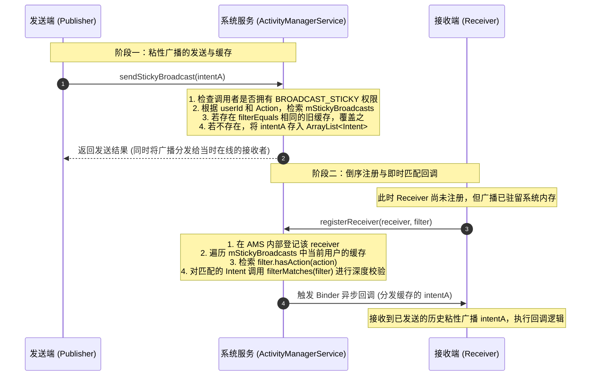

# 5.1.2.3.5 粘性广播

## 1. 导言：即时状态事件与粘性广播的兴衰

在 Android 系统的早期设计中，四大组件之一的广播接收器（`BroadcastReceiver`）承担了系统与应用间、应用与应用间极其重要的异步通信职责。根据分发机制与生命周期的不同，广播可以分为普通广播（Normal Broadcast）、有序广播（Ordered Broadcast）以及本文的核心主题——**粘性广播（Sticky Broadcast）**。

### 1.1 广播机制的物理模型与生命周期
普通的广播分发遵循“即时分发，分发完即焚”的物理模型。当发送端通过 `sendBroadcast()` 发送一个 Intent 后，系统服务 ActivityManagerService（AMS）会根据当前的注册表，将该广播即时分发给所有活跃的接收者。分发流程一旦结束，该广播所占用的生命周期和数据在系统进程中便会立即被销毁、回收。如果某个接收者在广播发送的时刻处于未注册或不活跃状态，它将永远错过这次广播。

### 1.2 什么是粘性广播（Sticky Broadcast）
粘性广播则是为了打破这种“时效性限制”而设计的特殊广播形式。它的核心特征在于：**发送后持久驻留系统内存**。
当发送端通过 `sendStickyBroadcast()` 发送一个粘性广播后，AMS 不仅会像普通广播一样即时分发给当前已注册的接收者，还会将该广播的 Intent 深度拷贝并缓存在系统进程（`SystemServer`）的内存中。这使得该广播具有了“粘性”。即使某个接收者在广播发送之后才进行注册，在它注册的瞬间，AMS 也会检索缓存并立即向该接收者分发最新的粘性广播。

### 1.3 粘性广播的诞生初衷与历史局限
在 Android 早期（Android 5.0 之前），粘性广播主要用于解决“即时状态事件”的传递问题。诸如设备的电池电量（`Intent.ACTION_BATTERY_CHANGED`）、Wi-Fi 连接状态（`WifiManager.NETWORK_STATE_CHANGED_ACTION`）、耳机插拔状态（`Intent.ACTION_HEADSET_PLUG`）等。这些状态是持续存在的，新启动的应用程序必须在初始化时立即知晓这些状态，而不能被动地等待下一次状态改变。

然而，粘性广播在提供便利的同时，由于其“全局共享、缺乏安全鉴权、系统常驻内存”的底层设计，带来了极其严重的系统级安全缺陷与内存泄露隐患。最终，在 2014 年发布的 Android 5.0（API 级别 21）中，Google 官方正式宣布废弃粘性广播（相关历史记录可参见根目录的 [AndroidVersionChangeLog.md](../../../../../../AndroidVersionChangeLog.md)），并推荐开发者使用更为安全的替代方案。

---

## 2. 粘性广播的底层物理机制与 AMS 缓存设计

要理解粘性广播的核心特征，必须深入分析系统服务 ActivityManagerService（AMS）在底层的缓存设计与“倒序分发”的物理流向。

### 2.1 发送阶段：sendStickyBroadcast 及其物理含义
当应用层调用 `Context.sendStickyBroadcast(Intent)` 时，其底层通过 Binder 跨进程通信（IPC）机制向 AMS 发起请求。AMS 收到请求后，会首先进行权限校验，然后将该粘性广播存入一个特定的系统级缓存容器中。这个过程是“持久化”的，除非显式调用 `removeStickyBroadcast()`，否则该广播数据会一直保存在 `SystemServer` 进程的内存空间内。

### 2.2 AMS 内部的核心数据结构：mStickyBroadcasts 深度剖析
在 AMS 内部，所有的粘性广播都统一缓存在一个名为 `mStickyBroadcasts` 的成员变量中。为了实现多用户（Multi-user）环境下的隔离，系统对该容器进行了分层设计。其在源码中的具体定义如下：

```java
// 位于 ActivityManagerService.java 内部
final SparseArray<ArrayMap<String, ArrayList<Intent>>> mStickyBroadcasts =
        new SparseArray<ArrayMap<String, ArrayList<Intent>>>();
```

我们可以将这个三层嵌套的数据结构拆解为以下逻辑：

1. **第一层：`SparseArray<...>`（以 `userId` 为 Key）**  
   Android 系统支持多用户机制。为了防止不同用户之间的数据发生越权泄露，AMS 使用 `SparseArray` 容器，以用户的 `userId` 作为键值进行第一层隔离。每个用户只能访问和维护属于自己空间内的粘性广播。
   
2. **第二层：`ArrayMap<String, ArrayList<Intent>>`（以广播 `Action` 为 Key）**  
   对于特定用户的粘性广播集合，AMS 使用 `ArrayMap` 进行管理。它的键（Key）是广播的动作标识——`Action` 字符串（例如 `Intent.ACTION_BATTERY_CHANGED`）。这使得系统能够以 $O(\log N)$ 的时间复杂度快速检索特定 Action 的广播。

3. **第三层：`ArrayList<Intent>`（存储具体 Intent 列表）**  
   为什么一个 Action 对应的不是单个 `Intent`，而是一个 `ArrayList<Intent>`？  
   因为在 Android 的 Intent 匹配规则中，即使 Action 相同，如果两个 Intent 的 Data Scheme、MimeType 或 Category 不同，它们依然被视为不同的广播类型。AMS 在对新发送的粘性广播进行去重和更新时，其底层的判断依据是：

   ```java
   // 遍历现有列表，进行 filterEquals 比较
   int N = list.size();
   int i;
   for (i = 0; i < N; i++) {
       Intent cur = list.get(i);
       if (intent.filterEquals(cur)) {
           // 若 filterEquals 匹配成功，说明两者的 Action、Data、Type、Category、Component 均等价
           // 使用最新的 Intent（包含新的 Extras）覆盖缓存中的旧 Intent
           list.set(i, new Intent(intent));
           break;
       }
   }
   if (i >= N) {
       // 若遍历结束未找到 filterEquals 等价的 Intent，则作为新的粘性广播加入列表
       list.add(new Intent(intent));
   }
   ```

   **重要结论**：`intent.filterEquals()` 的比较是不包含 Extras 数据字典的。这意味着，如果仅仅是 Extras 中的参数发生了改变（例如电量从 98% 变为了 97%），新发送的 Intent 会直接覆盖并更新原有的缓存，从而保证 `mStickyBroadcasts` 中永远只保留该过滤规则下的**最新状态**。

### 2.3 倒序物理分发时序（先发送，后注册）
正是基于 `mStickyBroadcasts` 的常驻缓存，粘性广播才得以实现“倒序分发”的特殊物理流。当应用调用 `registerReceiver` 注册一个接收者时，AMS 会在注册的物理流程中插入一个“检索并分发粘性广播”的子阶段。

具体流程如下：
1. 客户端发起 `registerReceiver(IIntentReceiver caller, IntentFilter filter, ...)` 跨进程调用。
2. AMS 在注册该 Receiver 后，会利用传入的 `IntentFilter` 去匹配 `mStickyBroadcasts`。
3. AMS 首先根据当前调用进程的 `userId` 锁定对应的 `ArrayMap`。
4. 遍历 `ArrayMap` 中与 `IntentFilter` 包含的 Action 匹配的键。
5. 针对每个匹配的 Action 列表，调用 `intent.filterMatches(filter)` 校验 Data、Type 等细节。如果匹配成功，则将该缓存的 Intent 加入待回调列表。
6. AMS 通过 Binder 回调，将匹配到的历史粘性广播 Intent 立即分发给刚刚完成注册的 Receiver。

### 2.4 Mermaid 物理时序流展示

下面的时序图直观地展示了粘性广播发送后数据在 AMS 的缓存过程，以及 Receiver 注册时 AMS 从缓存读取并立即回调的倒序物理流：



### 2.5 经典黑科技：无 Receiver 状态拉取（registerReceiver 传入 null）
在粘性广播的底层实现中，还隐藏着一个经典的设计。当应用层调用 `registerReceiver` 时，如果传入的 `BroadcastReceiver` 参数为 `null`（即 `context.registerReceiver(null, filter)`），AMS 在处理注册请求时，会**跳过**在系统内登记 Receiver 的步骤，但**不会跳过**对 `mStickyBroadcasts` 的检索匹配。

AMS 会将检索到的匹配粘性广播 Intent 直接作为 `registerReceiver` 的方法返回值返回给客户端。这意味着：
* 开发者可以通过 `registerReceiver(null, filter)` 在**零监听器开销**的前提下，瞬间拉取到系统当前最新的粘性状态数据。
* 这种方式不会在 AMS 内部创建任何 Receiver 记录，完全避免了因忘记注销 Receiver 而导致的 Context 内存泄漏，成为了获取系统电量、网络类型等常驻状态的“黄金通道”。

---

## 3. 致命缺陷与废弃背景（API 21 弃用）

虽然粘性广播解决了即时状态的倒序分发问题，但其系统级共享的设计给 Android 生态带来了无法妥协的安全、隐私以及稳定性灾难。在 Android 5.0 (API 21) 之后，该机制被标记为 `@Deprecated`，禁止在现代开发中继续使用。

### 3.1 缺陷一：全局共享带来的安全与隐私泄漏
粘性广播在设计之初，其底层数据是全局暴露在 `SystemServer` 进程中的。在早期的 Android 系统中，只要应用声明了相关 Action 的监听，便可以在任意时刻通过注册广播或者直接通过 `registerReceiver(null, ...)` 的方式，无门槛地读取到最近一次发送的粘性广播。

这导致了极其严重的隐私泄漏：
* **敏感状态窃取**：系统广播如 Wi-Fi 状态、蓝牙状态、耳机状态等，都包含了设备硬件的即时信息，恶意 App 可以无感知地在后台频繁拉取，用于分析用户的使用习惯、进行定位或追踪。
* **业务数据裸奔**：许多早期开发者缺乏安全意识，直接利用自定义的粘性广播在进程间传递业务数据，如登录状态、SessionToken、甚至用户信息。这些敏感数据一经发送，就会在系统内存中“裸奔”，任何第三方应用均可轻易截获并读取。

### 3.2 缺陷二：缺乏校验机制与注入伪造攻击
由于普通的广播可以通过 `sendPermission` 或在 Receiver 侧声明 `android:permission` 来限制发送和接收的双方资格，但粘性广播在设计上对这种安全防线的支持极为脆弱。

* **普通权限形同虚设**：虽然发送粘性广播需要声明 `android.permission.BROADCAST_STICKY` 权限，但在 Android 5.0 之前，这只是一个 **Normal** 级别的普通权限，任何第三方应用只要在 `AndroidManifest.xml` 中声明，系统就会在安装时自动授予，根本无法拦截。
* **状态覆盖与伪造注入**：由于缺乏严格的发送方签名或 UID 校验，恶意应用可以自行构造一个与系统或目标应用一模一样的 Action，并通过 `sendStickyBroadcast()` 将其发送出去。由于去重机制，恶意的 Intent 会直接覆盖 AMS `mStickyBroadcasts` 中原有的合法状态。当合法的目标应用注册 Receiver 时，它接收到的将是恶意应用注入的伪造数据，从而可能引发业务逻辑劫持或拒绝服务攻击（DoS）。

### 3.3 缺陷三：SystemServer 进程级的常驻内存泄漏
普通广播的生命周期在分发结束后就完结了，AMS 中对应的临时数据会被垃圾回收。然而，粘性广播在 AMS 内部的生命周期是“系统生命周期级”的。

* **SystemServer 的内存负担**：AMS 运行在系统的核心进程 `SystemServer` 中，其内存资源极为宝贵。每一个粘性广播的 Intent 及其所携带的 Extras Bundle 附件，只要没有被显式地调用 `removeStickyBroadcast()` 移除，就会永远常驻在 `SystemServer` 内存中。
* **无意的内存泄漏**：在实际开发中，极少有开发者在状态失效或应用退出时，主动调用 `Context.removeStickyBroadcast()` 去清理 AMS 中的缓存。随着系统内安装的 App 增多、或某些 App 频繁发送不同 Data 的粘性广播，`mStickyBroadcasts` 容器会不断膨胀，甚至携带庞大的序列化对象，最终导致 `SystemServer` 进程发生内存溢出（OOM），引发整机卡顿、黑屏或系统服务重启。

### 3.4 废弃声明与版本兼容性关联
正是因为上述致命的底层设计缺陷，Android 5.0 (API 21) 彻底弃用了粘性广播相关的所有 API：
* `Context.sendStickyBroadcast(Intent)`
* `Context.sendStickyOrderedBroadcast(Intent, ...)`
* `Context.removeStickyBroadcast(Intent)`
* `Context.sendStickyBroadcastAsUser(Intent, ...)`

在系统兼容性演进中，针对这些废弃行为的调整以及历史版本的安全修复，均已记录于根目录的 [AndroidVersionChangeLog.md](../../../../../../AndroidVersionChangeLog.md)。在现代 Android 开发中，若强行调用上述方法，系统会输出警告，且在严苛模式（StrictMode）下会直接抛出运行期异常。

---

## 4. 经典应用分析：系统电量广播的特殊“绿卡”

尽管粘性广播已经被整体废弃，但许多 Android 开发者在面试或日常排查中会发现一个奇特的现象：**系统电量广播（`Intent.ACTION_BATTERY_CHANGED`）在现代 Android 系统中依然表现出明显的“粘性特征”**。

### 4.1 为什么 Intent.ACTION_BATTERY_CHANGED 依然保留粘性特性
电量信息是设备最基础、最核心的状态之一。系统内的各种组件（如 WorkManager 的约束条件、JobScheduler、多媒体播放器等）以及无数的第三方 App 均需要即时获取电量状态，以决定是否进行耗电任务。如果彻底移除电量广播的粘性特征，那么所有需要获取电量的应用都必须在系统后台常驻一个活跃的 Receiver，这会对系统功耗造成毁灭性的打击。

因此，为了性能与功耗的妥协，系统在底层依然将 `Intent.ACTION_BATTERY_CHANGED` 广播保留在了 AMS 的粘性缓存中。

### 4.2 系统级保护机制与权限隔离
为了解决电量粘性广播的安全缺陷，Android 框架层在 AMS 内部为系统级别的粘性广播套上了“安全护盾”：

1. **发送方强制校验**：  
   AMS 在处理发送广播的逻辑时，会对受保护的系统广播（Protected Broadcasts）进行签名和 UID 验证。任何非系统级 UID（如普通第三方 App）如果试图发送 `Intent.ACTION_BATTERY_CHANGED` 广播，AMS 均会予以拒绝，并抛出 `SecurityException`。这彻底根治了恶意注入伪造电量状态的风险。
   
2. **只读访问约束**：  
   第三方 App 只能通过注册只读的 `IntentFilter` 来读取电量广播，但绝对无法修改或移除 AMS 中的电量缓存。

因此，在现代开发中，**正确且安全的获取当前电量状态**的代码示例如下：

```kotlin
/**
 * 基于系统电量粘性特性的即时电量获取方案
 */
fun getDeviceBatteryStatus(context: Context): Pair<Int, Boolean>? {
    val filter = IntentFilter(Intent.ACTION_BATTERY_CHANGED)
    // 传入 null 作为 Receiver，直接从 AMS 的 mStickyBroadcasts 缓存中获取最新的 Intent
    val batteryStatus: Intent? = context.registerReceiver(null, filter)
    
    return batteryStatus?.let { intent ->
        // 获取当前电量
        val level = intent.getIntExtra(BatteryManager.EXTRA_LEVEL, -1)
        val scale = intent.getIntExtra(BatteryManager.EXTRA_SCALE, -1)
        val batteryPct = if (level >= 0 && scale > 0) {
            (level / scale.toFloat() * 100).toInt()
        } else {
            -1
        }
        
        // 获取是否正在充电
        val status = intent.getIntExtra(BatteryManager.EXTRA_STATUS, -1)
        val isCharging = status == BatteryManager.BATTERY_STATUS_CHARGING ||
                         status == BatteryManager.BATTERY_STATUS_FULL
                         
        Pair(batteryPct, isCharging)
    }
}
```

---

## 5. 现代开发中传递“即时粘性状态”的最佳实践

随着粘性广播被正式扫入历史垃圾堆，开发者需要采用更安全、高效且符合现代软件架构的模式来传递“即时粘性状态”。我们需要根据通信的边界（单进程内或跨进程间）选择最合适的方案。

### 5.1 单进程内粘性状态总线
若状态的生产者和消费者均位于同一个应用程序进程内部，四大组件的跨进程广播本就是一种性能上的浪费。现代 Android 开发中，单进程内的粘性状态传递通常有两种黄金解决方案。

#### 5.1.1 Kotlin StateFlow 的状态语义与热流机制
在基于协程的现代 Android 开发中，`kotlinx.coroutines.flow.StateFlow` 是替代粘性广播的绝对主力。

* **状态（State）语义**：`StateFlow` 的设计初衷就是为了表示“状态”。它始终维护并持有一个最新的 `value`。
* **天然的粘性订阅**：当有新的订阅者（`Collector`）开始收集（`collect`）该 `StateFlow` 时，它会**立即**接收到当前最新的值，然后持续监听后续的数值变化。
* **生命周期感知与防抖**：通过与 `repeatOnLifecycle` 结合使用，能够保证仅在界面活跃时接收状态，且具备防抖机制，极大节省了系统资源。

```kotlin
// 声明一个 StateFlow 状态中心
class DeviceStatusRepository {
    private val _networkStatus = MutableStateFlow<NetworkType>(NetworkType.UNKNOWN)
    val networkStatus: StateFlow<NetworkType> = _networkStatus.asStateFlow()
    
    fun updateNetworkStatus(newType: NetworkType) {
        _networkStatus.value = newType // 自动去重，只有状态改变时才会分发给订阅者
    }
}
```

对于不需要保留历史状态、仅传递一次性事件（如弹窗、路由导航）的场景，若使用 `StateFlow` 会因为其粘性导致状态重播。此时，正确的做法是使用 `MutableSharedFlow` 并将其 `replay` 参数设置为 `0`：

```kotlin
// replay = 0 意味着新订阅者在注册时不会收到历史事件，完全解除了粘性
val eventFlow = MutableSharedFlow<UiEvent>(replay = 0)
```

#### 5.1.2 Jetpack LiveData 的粘性原理深度解密（considerNotify 与版本管理）
在 MVVM 架构中，`LiveData` 常被用于连接 ViewModel 与 View 层。它同样也是一种**具有天然粘性**的观察者数据容器。

要理解 LiveData 的粘性，必须剖析其数据分发的核心方法 `considerNotify`。当 LiveData 的宿主生命周期重新激活（例如 Activity 从后台返回前台，状态从 `STARTED` 转换为 `RESUMED`），或者新注册观察者时，均会触发该方法：

```java
// 位于 android.arch.lifecycle.LiveData.java (或 androidx.lifecycle.LiveData)
private void considerNotify(ObserverWrapper observer) {
    if (!observer.mActive) {
        return;
    }
    // 校验宿主 Lifecycle 是否处于活跃状态 (STARTED/RESUMED)
    if (!observer.shouldBeActive()) {
        observer.activeStateChanged(false);
        return;
    }
    // 核心版本号校验
    if (observer.mLastVersion >= mVersion) {
        return;
    }
    // 对齐版本号并执行分发
    observer.mLastVersion = mVersion;
    observer.mObserver.onChanged((T) mData);
}
```

**版本控制机制解析**：
1. `LiveData` 内部维护着一个成员变量 `mVersion`，每当调用 `setValue` 或 `postValue` 更新数据时，`mVersion` 就会自增 `1`。
2. 每个 `Observer` 注册到 LiveData 时，都会被包装成一个 `ObserverWrapper`，并在其内部保存一个属于该观察者的 `mLastVersion` 状态标记，其初始值为 `-1`。
3. 当新注册观察者，或者宿主生命周期重新激活时，系统执行 `considerNotify(observer)`。
4. 由于新观察者的 `mLastVersion`（为 `-1`）必定小于 LiveData 当前的 `mVersion`（即使一次都没更新过，初始也是 `START_VERSION`），条件 `observer.mLastVersion >= mVersion` 不成立，因此代码会继续向下执行，调用 `onChanged`。
5. **结果**：观察者立即收到了缓存中的“旧数据”。这就是 LiveData 的粘性体现。

#### 5.1.3 LiveData 数据倒灌缺陷与“非粘性”UnPeekLiveData 避坑实现
在很多实际业务中，我们希望 LiveData 仅充当“事件发送器”而不需要它的“粘性特征”。

* **“数据倒灌”场景**：在共享 ViewModel 的多 Fragment 导航场景下，Fragment A 观察了一个用于控制弹窗的 LiveData。当 Fragment A 被销毁或切入后台，随后再次返回前台时，由于生命周期状态重新激活，`considerNotify` 会被再次触发。由于 `observer.mLastVersion` 滞后于 `mVersion`，之前的弹窗事件会被再次分发，导致已经看过的弹窗“死灰复燃”，这就是著名的**数据倒灌（粘性副作用）**缺陷。

为了解决这个问题，我们需要设计一个**非粘性**的 LiveData。业界经典的方案是借助“版本号对齐”思想，在注册观察者时强制将观察者的 `mLastVersion` 提升到与 LiveData 当前的 `mVersion` 一致，从而跳过首次注册时的粘性分发。

以下是无反射、高性能的 `UnPeekLiveData` 避坑实现代码：

```kotlin
import androidx.lifecycle.LifecycleOwner
import androidx.lifecycle.LiveData
import androidx.lifecycle.Observer

/**
 * 专为一次性事件设计的非粘性 LiveData (避免数据倒灌)
 * 核心原理：通过在 Observer 包装层拦截版本号，实现新订阅者仅接收注册后新发送的数据
 */
open class UnPeekLiveData<T> : LiveData<T>() {

    // 内部记录发送端的数据更新版本号，初始为 0
    private var currentVersion = 0

    override fun setValue(value: T) {
        currentVersion++
        super.setValue(value)
    }

    override fun observe(owner: LifecycleOwner, observer: Observer<in T>) {
        // 在观察者注册的瞬间，将其对应的版本号初始化为当前 LiveData 的 currentVersion
        val wrapper = ObserverWrapper(observer, currentVersion)
        super.observe(owner, wrapper)
    }

    override fun observeForever(observer: Observer<in T>) {
        val wrapper = ObserverWrapper(observer, currentVersion)
        super.observeForever(wrapper)
    }

    /**
     * 包装内部观察者，实现版本过滤拦截
     */
    private inner class ObserverWrapper(
        private val realObserver: Observer<in T>,
        private var lastVersion: Int
    ) : Observer<T> {

        override fun onChanged(value: T) {
            // 只有当 LiveData 的版本号大于观察者当前持有的版本号时，才认为有新数据产生
            // 若 lastVersion == currentVersion，说明是新注册或重新激活带来的旧数据，直接拦截
            if (currentVersion > lastVersion) {
                lastVersion = currentVersion
                realObserver.onChanged(value)
            }
        }
    }
}
```

### 5.2 跨进程（IPC）状态传递与通知的现代替代方案
如果状态需要在多个独立的应用进程之间、或者应用与系统常驻进程之间传递，我们不能使用单进程总线，而必须采用安全且符合规范的 IPC 架构。

#### 5.2.1 基于 Binder 的 Bound Service（绑定服务）双向回调设计
对于跨进程“即时状态查询与更新”的场景，官方首推的架构是基于 Binder 的绑定服务（Bound Service）与 AIDL 双向通信。

* **原理**：状态提供方作为一个 Service 运行，并在 `onBind` 中向客户端返回一个由 AIDL 描述的 Binder 接口。
* **粘性拉取与推流**：
  * **主动查询**：客户端在成功绑定 Service 后，可以直接调用 Binder 接口中的 `getCurrentStatus()` 瞬间获取当前最新的状态，实现与 `registerReceiver(null, ...)` 等价的功能。
  * **异步通知**：客户端可以通过 `registerCallback(IStatusCallback callback)` 在服务端挂载一个回调。当服务端的状态发生改变时，遍历回调列表，主动通知所有的客户端。
* **安全鉴权**：在 Service 端，可以通过 `Binder.getCallingUid()` 或 `Binder.getCallingPid()` 获取调用方的标识，进而通过 `PackageManager` 校验调用方包名、签名或自定义权限，具备极高的安全性。
* **无内存堆积风险**：Binder 接口中的数据仅在传输瞬间占用 IPC 内存通道（受限于单次事务的大小限制），服务端只需持有一个常规的数据变量即可，绝不会像 `mStickyBroadcasts` 那样造成 `SystemServer` 进程的内存泄漏。

```
【Bound Service 物理架构拓扑】
[ 客户端进程 ] --------------------( 绑定服务 / AIDL )-------------------> [ 服务端进程 ]
  ├── 1. 启动时绑定，获取 IService 接口                                        ├── 维护当前最新的全局状态变量
  ├── 2. 通过 IService.getCurrentStatus() [主动拉取状态]                       └── 状态变更时遍历 IStatusCallback
  └── 3. 注册 IStatusCallback 回调接口 <============================= [主动推送更新]
```

#### 5.2.2 基于 ContentProvider 与 ContentObserver 的通知与数据分离架构
如果状态数据具有强烈的“结构化”或“实体化”特征（例如媒体库更新、离线数据库状态等），使用 `ContentProvider` 是极佳的选择。

* **通知与数据分离原则**：
  * **数据拉取**：状态消费方通过 `ContentResolver.query()` 访问特定 Uri 的 `ContentProvider`，主动获取当前的最新状态。
  * **改变通知**：当状态发生变更时，状态提供方在 ContentProvider 端调用 `getContext().getContentResolver().notifyChange(uri, null)` 抛出变更信号。
  * **信号监听**：消费方通过注册 `ContentObserver` 监听该 Uri。一旦收到回调，表明数据已变，再通过 `query` 主动发起拉取。
* **多进程安全性**：ContentProvider 支持在 `AndroidManifest.xml` 中配置细粒度的 `readPermission` 和 `writePermission`，且支持基于 URI 的临时授权（Uri Permission），是跨进程分享安全数据的首选标准。

#### 5.2.3 显式广播配合主动状态拉取
如果必须使用广播作为通知媒介，为了避免隐私泄漏和状态注入：
1. **摒弃粘性广播**：发送方只发送**普通的、非粘性的显式广播**（Explicit Broadcast，通过 `setPackage()` 或指定 `Component` 限制仅分发给特定进程），或者声明了强权限约束（Signature 级别权限）的隐式广播。
2. **拉取模式（Pull Mode）替代推送模式（Push Mode）**：
   * 广播仅作为“通知信号”（如：`ACTION_DATA_CHANGED`），不携带任何实质性的 Extras 敏感数据。
   * 接收方进程在收到该广播后，在 `onReceive` 中启动后台服务，通过 IPC（如 Binder 接口或 ContentProvider）去主动向状态源拉取最新的状态数据。
   * 这种模式既保证了状态接收的即时性，又通过显式路由和 IPC 鉴权确保了数据分发的绝对安全。
