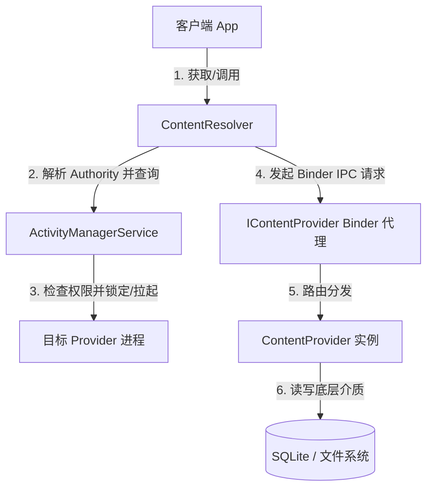
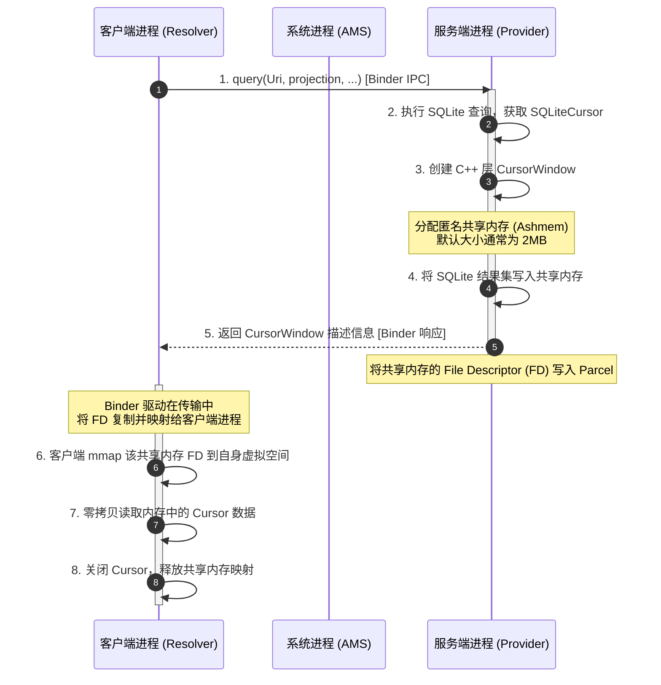

# 5.1.2.4.0 ContentProvider概述

ContentProvider（内容提供者）作为 Android 四大组件之一，是 Android 系统中实现**跨应用/跨进程安全数据共享**的标准机制。它为不同应用之间的数据交互定义了统一的接口规范，并在底层通过 Binder IPC 和共享内存实现了高效的传输链路。

本文将围绕 ContentProvider 的核心设计、底层架构哲学、关键实现机制、跨进程传输原理（Ashmem & CursorWindow）、以及在实际开发中的高频误区与安全最佳实践展开系统阐述。

---

## 1. 核心概念与定位

### 1.1 ContentProvider 的定义
在 Android 安全沙盒机制下，每个应用程序运行在独立的沙盒中，拥有唯一的 Linux UID，其私有数据（如 SQLite 数据库、SharedPreferences 文件、内部存储文件）默认无法被其他应用访问。
ContentProvider 提供了一种**受控的数据暴露通道**。它扮演着数据源的“看门人”角色，将底层多样化的存储介质（SQLite 数据库、本地文件、内存数据、网络数据等）抽象为类似于关系型数据库的二维表结构，并通过标准的 URI 定位资源，使其他应用能够以安全、规范的方式进行数据的增删改查。

### 1.2 统一的数据抽象与封装机制
ContentProvider 的核心设计理念之一是**媒介无关性**。无论底层存储是结构化的 SQLite，还是非结构化的文件，抑或是网络 API 或内存缓存，ContentProvider 都可以对外封装成统一的表状视图：
*   **数据库封装**：最常见的应用场景，将本地 SQLite 数据库中的表暴露给外部，这是 `ContactsProvider`、`MediaStore` 的典型做法。
*   **文件/媒体流封装**：通过重写 `openFile` 或 `openAssetFile` 方法，ContentProvider 可以向外部应用传输图片、音频、视频等大文件。著名的 `FileProvider` 就是这一封装的官方实现。
*   **网络与内存封装**：可以作为内存缓存的代理，或者在收到请求时动态从网络拉取数据，再组装成虚拟表返回给调用方。

### 1.3 核心数据结构与实体模型
在使用 ContentProvider 进行数据交互时，以下三个实体模型构成了基础数据链路：
1.  **Uri (通用资源标志符)**：用于唯一标识 ContentProvider 中的数据。在数据共享世界中，Uri 就如同 Web 服务的 URL，是定位资源的唯一物理地址。
2.  **Cursor (游标/数据集)**：ContentProvider 查询操作的核心返回对象。它是一个动态的数据读取窗口，提供了行与列的随机访问接口。
3.  **ContentValues (内容值对)**：用于封装单行插入或更新的数据载体，内部基于 `HashMap` 实现，键为列名，值为具体的数据类型。

---

## 2. 设计取舍与架构哲学

在 Android 系统架构的设计演进中，为什么需要单独设立 ContentProvider 组件，而不是直接使用更底层的进程间通信（IPC）机制（如 AIDL/Binder）或共享文件？这涉及到安全性、规范性、解耦程度以及生命周期托管等多重架构层面的取舍。

### 2.1 跨进程安全共享的痛点与解决方案
在多进程环境下，直接共享底层的 SQLite 数据库文件或原始文件会面临灾难性的技术问题：
*   **多进程并发冲突**：SQLite 虽然支持并发读取，但并不天然支持跨进程的安全并发写入，直接多进程读写极易导致数据库锁死或文件损坏。
*   **权限控制粒度粗糙**：如果直接通过文件权限（如旧版本 Android 的全局读写权限）共享文件，一旦授予，对方应用将获得对数据库或文件的完全控制权，无法做到表级、行级或临时性的细粒度权限控制。
*   **接口规范缺失**：每个应用如果都自定义一套 AIDL 接口来传输数据，会导致生态内应用间的数据交互极其混乱，无法形成标准化的数据共享生态。

ContentProvider 正是为了解决上述痛点而设计的：
1.  **单点写入与序列化**：ContentProvider 强制所有外部进程的读写请求汇总到数据宿主进程，由宿主进程统一调用 SQLite 驱动或文件系统，从而在物理上规避了跨进程多写冲突。
2.  **细粒度的权限沙箱**：支持在 `AndroidManifest.xml` 中配置读权限、写权限，甚至可以为特定 URI 授予临时访问权限，大幅收紧了隐私数据暴露面。

### 2.2 规范化与标准化接口
ContentProvider 规定了一套高度类似 SQL 的 CRUD 接口，并强制使用 URI 作为资源寻址协议。这种设计带来的优势是显而易见的：
*   **与 RESTful 理念契合**：将应用内的数据视为“资源”，通过统一的接口进行状态表征与传输，极易被开发者理解。
*   **系统组件深度整合**：Android 系统内的 `Loader`、`CursorAdapter` 等组件可以直接与 ContentResolver 绑定，实现从数据源到 UI 界面的平滑绑定。

### 2.3 屏蔽底层数据存储细节
ContentProvider 作为一层数据抽象代理，将“数据的定义与存储”同“数据的消费与使用”彻底解耦：
*   **屏蔽架构重构风险**：如果服务提供方决定将底层存储从 SQLite 切换到 Realm，或者引入加密数据库，调用方（客户端）无需修改任何代码，因为暴露的 URI 和 Cursor 接口没有发生任何改变。
*   **屏蔽数据库升级细节**：当提供方的数据库结构发生变更（如新增字段、拆分表）时，可以通过在 ContentProvider 内部进行字段映射或兼容处理，避免客户端因找不到字段而直接崩溃。

### 2.4 ContentResolver 与 ContentProvider 的协作解耦
在实际编码中，客户端并不直接与目标应用的 `ContentProvider` 实例打交道，而是通过自身 Context 提供的 `ContentResolver` 代理来发起请求。



这种“中间人”架构的设计取舍如下：
*   **屏蔽进程拉起与定位细节**：客户端无需关心目标 ContentProvider 所在的应用进程是否存活。当调用 `ContentResolver.query(uri, ...)` 时，系统（AMS）会自动解析 URI 中的 Authority，查找对应的 Provider 是否已注册。如果目标进程未运行，AMS 会自动将其拉起并初始化，随后将 Binder 代理返回给客户端的 ContentResolver。整个过程对客户端完全透明。
*   **集中式权限与策略审计**：所有的 ContentResolver 请求在跨进程之前，都会经过系统层的权限校验（如运行时权限审核），便于系统进行全局的安全策略收紧。

---

## 3. 实现机制与使用方式

### 3.1 核心 CRUD 接口方法详解
自定义一个 ContentProvider 必须继承 `android.content.ContentProvider` 类，并实现以下六个核心抽象方法：

```java
public class MyProvider extends ContentProvider {
    
    // 在 Provider 创建时调用，用于初始化底层数据存储（例如创建 DatabaseHelper）
    @Override
    public boolean onCreate() { ... }

    // 执行数据查询，返回包含结果集的 Cursor 对象
    @Override
    public Cursor query(Uri uri, String[] projection, String selection, 
                        String[] selectionArgs, String sortOrder) { ... }

    // 向 Provider 插入一条新数据，返回新插入数据的 URI
    @Override
    public Uri insert(Uri uri, ContentValues values) { ... }

    // 删除指定条件的数据，返回受影响的行数
    @Override
    public int delete(Uri uri, String selection, String[] selectionArgs) { ... }

    // 更新指定条件的数据，返回受影响的行数
    @Override
    public int update(Uri uri, ContentValues values, String selection, 
                      String[] selectionArgs) { ... }

    // 返回指定 URI 代表的 MIME 类型
    @Override
    public String getType(Uri uri) { ... }
}
```

*   **`onCreate()` 的执行时机**：该方法在应用启动时由主线程调用，应当保持极高的执行效率。
*   **CRUD 方法的返回值约定**：
    *   `insert` 成功后，按照规范必须返回新数据的完整 URI（包含新生成的自增 ID，例如 `content://authority/path/12`），并且通常需要调用 `ContentResolver.notifyChange(uri, ...)` 以通知观察者。
    *   `delete` 和 `update` 必须返回受影响的物理行数，这有助于调用方校验操作是否符合预期。

### 3.2 URI 模型解析与匹配
#### URI 的物理结构
ContentProvider 的 URI 必须遵循 Android 规定的标准格式：

$$\text{content://} + \text{authority} + \text{/path} + \text{/id}$$

*   **Scheme (协议声明)**：固定为 `content://`，代表此 URI 归属于 ContentProvider 组件寻址。
*   **Authority (授权域名)**：用于标识具体的 ContentProvider 实体。为了防止冲突，通常采用宿主应用的包名作为前缀（如 `com.example.app.provider`）。系统通过此字段路由到正确的进程。
*   **Path (资源路径)**：代表需要操作的数据表或资源目录名称（如 `users`、`files/images`）。
*   **ID (资源标识)**：可选，代表表中具体某一行数据的标识 ID（如 `1024`）。

#### UriMatcher 的匹配路由机制
为了在 `query`、`insert` 等方法中高效地识别传入的 URI 类型，Android 提供了 `UriMatcher` 辅助类。它内部基于字典树结构实现路径匹配：

```java
public class MyProvider extends ContentProvider {
    private static final int CODE_USER_DIR = 1;
    private static final int CODE_USER_ITEM = 2;
    private static final UriMatcher sUriMatcher = new UriMatcher(UriMatcher.NO_MATCH);

    static {
        // 匹配用户表目录：content://com.example.app.provider/users
        sUriMatcher.addURI("com.example.app.provider", "users", CODE_USER_DIR);
        // 匹配单条用户记录：content://com.example.app.provider/users/12
        sUriMatcher.addURI("com.example.app.provider", "users/#", CODE_USER_ITEM);
    }
}
```

#### MIME 类型规范 (`getType`)
`getType(Uri)` 方法用于返回对应 URI 的媒体类型（MIME）。Android 规定了专有的 MIME 前缀规范：
*   **单条记录 (Item)**：必须返回以 `vnd.android.cursor.item/` 开头的 MIME 类型。
    *   例如：`vnd.android.cursor.item/vnd.com.example.app.user`
*   **多条记录 (Directory)**：必须返回以 `vnd.android.cursor.dir/` 开头的 MIME 类型。
    *   例如：`vnd.android.cursor.dir/vnd.com.example.app.user`

当外部应用通过隐式 Intent 过滤数据类型时，系统会依赖 `getType` 返回的 MIME 类型进行匹配过滤。

### 3.3 跨进程传输机制：Binder IPC、匿名共享内存与 CursorWindow
ContentProvider 最具技术含量的部分在于其底层的跨进程数据传输机制。
标准的 Binder 进程间通信基于内核的 Binder 内存映射（`mmap`），在 Android 系统中，**每个进程的 Binder 事务缓冲区大小被硬性限制为 1MB 左右**（由所有正在并发进行的 Binder 事务共享）。
如果一个 `query` 请求返回的数据集包含数千行，或者某些字段存储了较大的 BLOB（二进制数据），通过普通的 Binder 序列化进行跨进程传输极易引发著名的 `TransactionTooLargeException` 异常。

为了解决这一硬性物理限制，Android 引入了**匿名共享内存（Ashmem / memfd）**和 **`CursorWindow`** 机制。

#### CursorWindow 的核心工作流
当客户端调用 `ContentResolver.query` 时，底层并不是通过 Binder 把整个数据集打包成 Parcel 传输，而是通过共享内存“直连通道”进行大块结构化数据的传输。其核心机制时序如下：



#### 底层核心步骤技术细节
1.  **共享内存创建**：在 Provider 进程中，`SQLiteCursor` 在填充数据时，会在 C++ 层实例化一个 `CursorWindow` 对象。该对象通过 `ashmem_create_region`（或较新 Android 版本中的 `memfd_create`）向 Linux 内核申请一块匿名共享内存。这块共享内存默认大小在不同 Android 版本中有所不同，但在主流版本上**默认为 2MB**。
2.  **双重地址映射 (Double Mapping)**：
    *   **写入侧**：Provider 进程将这块共享内存映射到自身的虚拟地址空间，调用 SQLite 接口将查询到的多行结构化数据直接写入该内存缓冲区。
    *   **传输侧**：当 IContentProvider 的 Binder 事务返回时，数据本身保留在共享内存中，而这块共享内存对应的**文件描述符 (File Descriptor, 简称 FD)** 被写入 Binder 的 Parcel 中。
    *   **转换侧**：Binder 驱动在内核空间检测到传递的数据包含 FD 时，会自动将该 FD 复制到客户端进程的 FD 表中，并在客户端进程建立新的内存映射（`mmap`）。
    *   **读取侧**：客户端的 `BulkCursorToCursorAdaptor` 拿到被 Binder 复制过来的 FD 后，映射出自身的虚拟内存地址。客户端的 Java 层操作 Cursor 时，底层直接通过 JNI 指针直接读取这块共享内存中的二进制数据。

#### CursorWindow 机制的架构优势与局限
*   **优势：零拷贝与突破 Binder 限制**：数据直接写入共享内存，客户端直接从共享内存读取，省去了“服务端内存 $\rightarrow$ 内核 Binder 缓冲区 $\rightarrow$ 客户端内存”的二次内存拷贝，且完全不受 1MB Binder 缓冲区的物理限制。
*   **局限与避坑指南**：
    *   **2MB 物理墙**：如果单次查询返回的数据总量超过了 `CursorWindow` 的容量上限（2MB），Provider 在写入时会发生截断，只写入前一部分数据。当客户端将游标滑动到未载入的行时，底层会再次触发 Binder 通信，命令 Provider 重新申请一个新的 `CursorWindow` 载入下一页数据。这被称为 **Cursor 分页加载**。
    *   **大 BLOB 导致的崩溃**：如果表中某一行单单一个字段（例如图片 BLOB）就超过了 2MB，`CursorWindow` 甚至连一行数据都无法装下，此时系统会抛出 `CursorWindowAllocationException` 或 `Row too big to fit into CursorWindow` 导致应用直接崩溃。
    *   **最佳实践**：**严禁在数据库表中存储大块二进制数据（如图片、音频）**。对于文件，数据库中应仅存储其物理路径，ContentProvider 应当通过重写 `openFile` 方法返回文件描述符 FD（通过 `ParcelFileDescriptor`），从而让系统利用底层管道直接传输文件流。

### 3.4 数据变更通知机制：ContentObserver 的订阅和通知原理
ContentProvider 内部集成了一套响应式的数据变更通知机制，核心由 `ContentObserver` 承担。

#### 工作流剖析
1.  **订阅端注册**：客户端通过 `ContentResolver` 注册观察者：
    ```java
    context.getContentResolver().registerContentObserver(
        Uri.parse("content://com.example.app.provider/users"),
        true, // true 代表支持前缀匹配（如子路径变更也会收到通知）
        myContentObserver
    );
    ```
    此操作会在系统进程的 `ContentService` 中建立一条 `Uri` 到 `IContentObserver`（Binder 代理对象）的映射路由表。
2.  **发布端通知**：当 Provider 进程执行了写操作（如 `insert` 或 `update`），在事务成功提交后，应当显式调用通知接口：
    ```java
    getContext().getContentResolver().notifyChange(uri, null);
    ```
3.  **系统分发**：系统进程的 `ContentService` 接收到 `notifyChange` 请求后，在注册表中检索匹配该 URI（及子路径）的所有客户端 Observer Binder 代理。
4.  **跨进程回调**：`ContentService` 通过 Binder IPC 回调客户端的 `onChange()` 方法。客户端的 `ContentObserver` 会在其关联的 `Handler` 线程（默认为注册时的线程）上执行刷新 UI 或同步数据的逻辑。

---

## 4. 常见误区与最佳实践

### 4.1 误区澄清：“ContentProvider 所有方法都运行在主线程”
这是一个非常经典的面试高频误区。开发者必须清晰区分 ContentProvider 各个生命周期方法运行的线程边界。

| 方法名 | 调用线程 | 线程性质 | 架构影响与应对 |
| :--- | :--- | :--- | :--- |
| **`onCreate()`** | **主线程 (UI Thread)** | 同步阻塞 | 该方法在应用启动时（`ActivityThread.handleBindApplication` 阶段）执行。此时 `Application.onCreate()` 甚至还未被执行。如果在 `onCreate()` 中进行耗时数据库创建、升级或同步 I/O，会直接**拖慢应用的冷启动速度**，严重时导致系统直接抛出 ANR。应当将数据库的实际开启（如 `getWritableDatabase()`）延迟到首次 CRUD 操作时进行（懒加载）。 |
| **`query()`** | **Binder 线程池** | 并发异步 | 运行在当前 Provider 进程的 Binder 线程池中（非 UI 线程）。这意味着如果外部有多个应用并发调用此 Provider，这些 CRUD 方法会**并发执行**。 |
| **`insert()`** | **Binder 线程池** | 并发异步 | 同上，必须保证方法内部的线程安全性。 |
| **`update()`** | **Binder 线程池** | 并发异步 | 同上。 |
| **`delete()`** | **Binder 线程池** | 并发异步 | 同上。 |
| **`getType()`** | **Binder 线程池** | 并发异步 | 同上。 |

#### 线程安全最佳实践
由于 CRUD 方法运行在 Binder 线程池中，如果你的 ContentProvider 底层操作的不是 SQLite（SQLite 驱动内部有互斥锁保障线程安全），而是自定义的内存集合、缓存文件，**你必须手动处理多线程并发安全问题**（如使用 `ReentrantLock`、`ConcurrentHashMap` 或 `synchronized` 关键字进行同步控制）。

### 4.2 安全加固：权限控制与临时授权
在现代 Android 隐私防范体系下，ContentProvider 是黑客跨进程数据窃取和组件劫持的重点攻击目标，必须对其进行严格的安全加固。

#### 4.2.1 `android:exported` 属性设定
自 **Android 12 (API 31)** 起（具体变更可查阅根目录 [AndroidVersionChangeLog.md](../../../../../../AndroidVersionChangeLog.md#android-12api-31)），如果应用的 ContentProvider 组件包含了 `<intent-filter>`，则**必须显式声明** `android:exported` 属性（`true` 或 `false`），否则编译打包时会直接报错。
*   **私有 Provider**：如果该数据仅在应用内部使用，务必将 `android:exported` 设置为 `false`。
*   **公开 Provider**：如果需要共享数据，设置为 `true`，但必须配合严格的权限拦截。

#### 4.2.2 读写权限分离控制
通过在 `AndroidManifest.xml` 中配置权限，可以对调用方实施门槛控制：
```xml
<provider
    android:name=".MyProvider"
    android:authorities="com.example.app.provider"
    android:exported="true"
    android:readPermission="com.example.app.permission.READ_DATA"
    android:writePermission="com.example.app.permission.WRITE_DATA" />
```
通过读写权限分离，外部应用可以只被允许查询数据（如读取通讯录），而被禁止修改数据，从而保证数据源的安全。

#### 4.2.3 临时 URI 授权机制 (Grant Uri Permissions)
在许多场景下，我们并不希望外部应用拥有对我们所有数据的全局读写权限，而仅仅是希望针对**某一次交互、某一个特定文件**授予临时访问权限。例如：调起系统相机拍照并将照片保存到我们应用的私有目录，或者将应用内的一份私有文档分享给第三方 PDF 阅读器查看。

如果给对方应用全局读写权限，会造成极大的安全隐患。Android 提供了**临时 URI 授权**来解决这一诉求：
1.  **声明支持临时授权**：在 `<provider>` 中配置 `android:grantUriPermissions="true"`（或者通过子标签 `<grant-uri-permission>` 细化允许临时授权的路径）。
2.  **使用 FileProvider 规避 FileUriExposedException**：自 **Android 7.0 (API 24)** 起（参考 [AndroidVersionChangeLog.md](../../../../../../AndroidVersionChangeLog.md#android-70--71api-24--25)），系统强行废弃了 `file://` 协议的直接跨进程共享。如果向外部 Intent 暴露 `file://` 的 Uri，系统会直接抛出 `FileUriExposedException` 导致应用崩溃。开发者必须使用 `FileProvider` 将文件路径映射为类似于 `content://com.example.app.fileprovider/shared/doc.pdf` 的安全 URI。
3.  **动态授予权限**：
    在调起第三方组件（如 Activity/Service）时，通过 Intent 传入该 Content URI，并加上临时授权标志位：
    ```java
    Intent intent = new Intent(Intent.ACTION_VIEW);
    Uri contentUri = FileProvider.getUriForFile(context, "com.example.app.fileprovider", myFile);
    intent.setDataAndType(contentUri, "application/pdf");
    // 关键：显式授予对方临时读取该 URI 的权限
    intent.addFlags(Intent.FLAG_GRANT_READ_URI_PERMISSION);
    context.startActivity(intent);
    ```
4.  **权限收回时机**：被授予临时权限的应用仅能在当前 Activity 的生命周期内（或者对应的任务栈生命周期内）访问该 URI 对应的文件。一旦该 Activity 销毁，临时授权自动失效。这种动态收窄安全域的策略是 Android 现代沙盒安全规范的核心基石。

### 4.3 SQL 注入风险防范
ContentProvider 底层若对接的是 SQLite，外部传入的 `selection` 和 `selectionArgs` 如果拼接不当，会引发严重的 SQL 注入攻击。

#### 漏洞代码示例
```java
// 错误做法：直接将外部不可信的 selection 字符串进行拼接
@Override
public Cursor query(Uri uri, String[] projection, String selection, 
                    String[] selectionArgs, String sortOrder) {
    SQLiteDatabase db = mDbHelper.getWritableDatabase();
    // 极其危险：如果 selection 传入了 "1=1) OR (1=1", 那么整张表的所有隐私数据都将被暴露
    String rawSql = "SELECT * FROM users WHERE (" + selection + ")";
    return db.rawQuery(rawSql, null);
}
```

#### 正确防御方案
必须使用 SQLite 提供的参数化占位符（即 `?`），将外部参数严格限制在 `selectionArgs` 中，不允许直接拼接到 SQL 骨架中：
```java
@Override
public Cursor query(Uri uri, String[] projection, String selection, 
                    String[] selectionArgs, String sortOrder) {
    SQLiteDatabase db = mDbHelper.getWritableDatabase();
    // 正确做法：利用数据库驱动的安全参数绑定
    return db.query("users", projection, selection, selectionArgs, null, null, sortOrder);
}
```

### 4.4 目录遍历漏洞 (Directory Traversal)
当自定义 ContentProvider 涉及到文件共享并重写了 `openFile` 方法时，必须警惕目录遍历漏洞。

#### 漏洞场景
如果直接拼接 URI 路径段来访问本地文件：
```java
@Override
public ParcelFileDescriptor openFile(Uri uri, String mode) throws FileNotFoundException {
    // 假设 URI 为：content://com.example.app.provider/../../data/system/users.xml
    File file = new File(mLocalFileDir, uri.getPath()); 
    // 危险：调用方可以通过相对路径回溯，突破 mLocalFileDir 限制，读取系统核心敏感文件
    return ParcelFileDescriptor.open(file, ParcelFileDescriptor.MODE_READ_ONLY);
}
```

#### 安全加固方案
必须对解析后的文件路径进行规范化（Canonicalization）校验，确保其物理存储路径完全限制在预设的共享文件夹子树中：
```java
@Override
public ParcelFileDescriptor openFile(Uri uri, String mode) throws FileNotFoundException {
    File file = new File(mLocalFileDir, uri.getPath());
    try {
        String canonicalPath = file.getCanonicalPath();
        String baseCanonicalPath = mLocalFileDir.getCanonicalPath();
        
        // 校验：文件真实路径必须以授权根目录开头，防止 ../ 越权遍历
        if (!canonicalPath.startsWith(baseCanonicalPath)) {
            throw new SecurityException("非法的文件访问路径！检测到越权遍历企图。");
        }
    } catch (IOException e) {
        throw new FileNotFoundException("路径解析失败");
    }
    return ParcelFileDescriptor.open(file, ParcelFileDescriptor.MODE_READ_ONLY);
}
```

---

## 5. 总结

ContentProvider 在 Android 四大组件中扮演着数据隔离与标准分发的重要角色。其核心价值在于提供统一的数据访问抽象接口，同时在系统层实现了细粒度的安全拦截。
在底层，它通过巧妙地结合 Binder IPC 与匿名共享内存（Ashmem/memfd）的 `CursorWindow` 设计，避开了普通 Binder 传输在大数据量下的拷贝开销与大小限制。
在实际工程实践中，开发者应杜绝“所有方法运行在主线程”的陈旧认识，警惕 `onCreate` 中的初始化阻塞，并配合 `android:exported`、读写权限控制、`FileProvider` 临时授权、参数化查询及规范化路径校验等手段，构建高安全性的跨进程数据共享通道。
