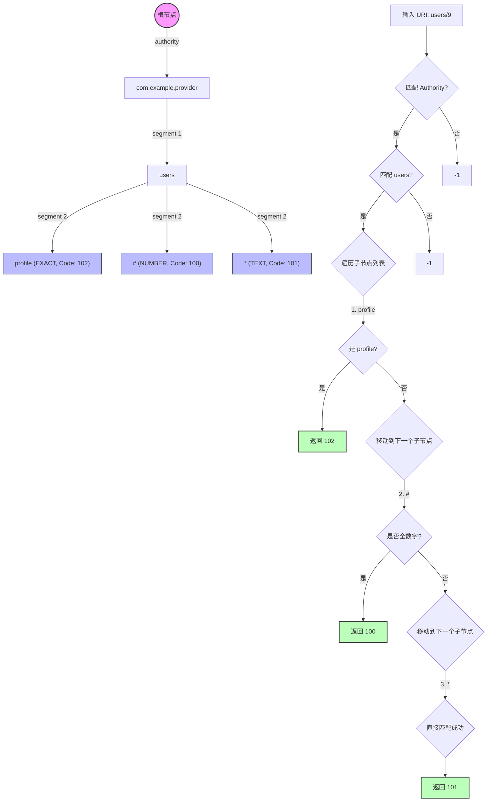

# 5.1.2.4.1 URI模型

## 导言
在 Android 操作系统中，跨进程通信（IPC）与数据共享是构建丰富应用生态的基石。虽然 Binder 机制从底层打通了进程间的高效通信，但在应用层，如何以一种标准化、解耦且安全的方式定位并操作其他应用的数据，是系统设计的一大挑战。为此，Android 引入了 `ContentProvider` 组件。

`ContentProvider` 的核心设计哲学是**“万物皆资源，资源皆 URI”**。URI（Uniform Resource Identifier，统一资源标识符）在 `ContentProvider` 体系中充当了数据格式解耦与对外统一资源寻址的“契约标尺”。无论底层数据是存储在 SQLite 数据库、SharedPreferences 文件、本地磁盘，还是来自于网络临时缓存，调用方（Client）都无需感知其物理实现细节，只需向系统提供一个标准的 URI 即可完成对数据的增、删、改、查等操作。

本篇文章将由浅入深地剖析 Android 中 `ContentProvider` URI 模型的深层设计。内容涵盖标准 URI 的格式解构与底层的进程寻址过程、匹配利器 `UriMatcher` 的字典树（Trie Tree）底层匹配机制及开发者极易踩入的匹配顺序陷阱、`ContentUris` 辅助类的底层工具方法与防御性编程、MIME 类型的映射契约，以及在现代 Android 版本演进中关于包可见性、临时授权和路径穿越漏洞（Path Traversal）的安全适配实践。

---

## 一、标准 URI 格式体系深度解构

在 `ContentProvider` 框架内，数据资源通过符合 RFC 2396 规范的 URI 进行全局唯一标识。一个标准的 ContentProvider URI 格式通常如下所示：

```
content://authority/path/id
```

### 1. 各核心字段的作用与规范

我们可以将该 URI 拆解为四个主要部分，每个部分在 Android 系统的寻址与解析过程中都承担着不同的职责：

#### (1) Scheme (协议头)
* **定义**：必须固定为 `content://`。
* **作用**：它是 Android 系统识别该 URI 为 `ContentProvider` 专属资源的标志。当客户端调用 `ContentResolver` 的方法（如 `query()`、`insert()` 等）时，系统会根据此 Scheme 将请求分发给 `ContentProvider` 的管理框架，而不是去分发给代表网络请求的 `http://` 或本地文件的 `file://`。

#### (2) Authority (授权域名/主机名)
* **定义**：用于唯一标识一个 `ContentProvider` 实例的字符串。
* **作用**：充当域名服务（DNS）在 Android 内部的角色。由于 Android 系统中运行着成百上千个应用，每个应用都可能暴露自己的数据，因此 Authority 必须在**全局设备内保持唯一性**。
* **寻址原理**：当客户端发起请求时，Android 系统的 `ActivityManagerService`（AMS）和 `PackageManagerService`（PMS）会通过该 Authority 在系统已注册的 Provider 列表中进行检索，从而精确定位到提供该数据的宿主应用（Host Application）及其所在的进程。
* **唯一性冲突处理**：开发者在应用的 `AndroidManifest.xml` 中通过 `<provider>` 标签的 `android:authorities` 属性向系统注册。如果两个应用在同一台设备上声明了相同的 Authority，后安装的应用会在安装阶段被 PMS 拒绝，并抛出 `INSTALL_FAILED_CONFLICTING_PROVIDER` 异常。因此，业界推荐使用包名作为前缀（例如 `com.example.app.provider`）来保证其全局唯一性。

#### (3) Path (路径段)
* **定义**：用以表示宿主应用内部特定的数据集或数据表的虚构路径。
* **作用**：用于在同一个 `ContentProvider` 内部对不同类型的资源进行分类。例如，一个应用可能既有用户表也有书籍表，那么可以通过路径 `users` 和 `books` 进行区分：
  * `content://com.example.app.provider/users`（定位到用户数据集）
  * `content://com.example.app.provider/books`（定位到书籍数据集）
* Path 可以是多级结构（如 `users/vip`），为组织复杂的层次化数据提供了极高的灵活性。

#### (4) ID (可选标识符)
* **定义**：跟在路径末尾的数值，代表数据集中某一具体记录的主键标识（通常对应 SQLite 表中的 `_id` 字段）。
* **作用**：精确定位到单个资源项。例如：
  * `content://com.example.app.provider/users/7` 代表 ID 为 7 的那一条具体的用户记录。
* 如果 URI 中不包含 ID，则默认代表对整个数据集（即整张表）进行批量操作。

---

### 2. 底层 Binder 寻址与进程启动机制

当客户端使用 `getContentResolver().query(uri, ...)` 时，系统底层是如何工作的？这是一个典型的跨进程 Binder 通信过程，其核心流程如下：

```
[客户端进程] 
    │ (发起 ContentResolver.query)
    ▼
[系统服务进程 (System Server: AMS/PMS)] ── (解析 URI 中的 Authority)
    │ 
    ├─► 若目标 Provider 所在进程未启动 ──► [启动目标进程并初始化 Provider]
    │ 
    ▼ (建立 Binder 连接，获取 IContentProvider 代理对象)
[目标 Provider 进程] ── (执行 query，从本地 SQLite/文件读取数据)
    │ 
    ▼ (通过 CursorWindow 共享内存跨进程传输结果)
[客户端进程] ── (解析并读取 Cursor 数据)
```

1. **Authority 提取与解析**：`ContentResolver` 提取 URI 中的 Authority 字段，通过 `ActivityManagerService`（AMS）查询目标 Provider 是否已经被拉起。
2. **PMS 静态匹配**：如果目标 Provider 未被拉起，AMS 会向 `PackageManagerService`（PMS）查询该 Authority 注册在哪个应用的哪个 `<provider>` 节点下。
3. **目标进程创建与启动**：如果该 Provider 的宿主进程尚未运行，AMS 会通过 Socket 通知 `Zygote` 进程孵化出目标应用的进程。在目标进程启动的初始化阶段，`ActivityThread` 会在其主线程（UI 线程）上调用 `installContentProviders()`，实例化该 `ContentProvider` 并回调其 `onCreate()` 生命周期函数。
4. **发布 Binder 代理**：目标应用进程将该 Provider 的 Binder 代理对象（实现 `IContentProvider` 接口）发布、注册到 AMS 中。
5. **建立连接与调用**：AMS 将该 Binder 代理对象返回给客户端进程。客户端的 `ContentResolver` 拿到此 Binder 代理后，通过 IPC 机制直接向目标进程的 `ContentProvider` 发起 `query()` 等事务调用，从而避开了后续每次操作都要经过 System Server 寻址的开销。
6. **共享内存数据传输**：为了防止大批量数据导致 Binder 事务缓冲区溢出（1MB 限制），底层通常使用 `CursorWindow`。`CursorWindow` 基于匿名共享内存（Ashmem）实现，服务端往共享内存中写数据，客户端从共享内存中读数据，从而实现了超大数据量的高效跨进程传输。

---

### 3. 动态查询参数 (Query Parameters) 的作用与安全

除了标准的 `scheme://authority/path/id` 之外，ContentProvider URI 还支持携带标准的 HTTP 动态查询参数，例如 `content://com.example.app.provider/users?limit=10&sort=desc`。

在底层，这些参数通过 `Uri.getQueryParameter("key")` 来解析。其核心用途包括：
* **分页与排序控制**：由于古老的 ContentProvider API 参数设计较为固定，某些场景下通过 URI 携带 `limit`、`offset` 或 `sort` 比在 `selectionArgs` 中传递参数更加直观。
* **行为指示标记**：例如传递 `?notify=false`，告知 `ContentProvider` 在完成 `insert()` 或 `update()` 后不要触发 `ContentObserver` 的数据变更通知，用以提升批量操作的写入性能。
* **安全防范**：在解析查询参数时，务必警惕 SQL 注入风险。如果将获取到的 `limit` 参数直接拼接进 SQL 查询语句中（如 `SELECT * FROM users LIMIT " + limit`），恶意应用完全可以通过构造 `limit=10; DROP TABLE users;` 进行注入攻击。因此，对 Query 里的动态参数必须进行严格的类型转换校验（如解析为 `Integer`），或使用占位符 `?` 进行参数化绑定。

---

## 二、MIME 类型 (MIME-Type) 映射契约

在 `ContentProvider` 架构中，重写 `getType(Uri uri)` 方法是不可或缺的契约要求。很多初学者只知道此方法用于返回一个字符串，但不理解其在 Android 系统中的深层机制。

### 1. MIME 类型在系统层的作用

MIME-Type（Multipurpose Internet Mail Extensions，多用途互联网邮件扩展类型）定义了数据的媒体类型。在 Android 系统中，它主要用于以下几个核心场景：

* **隐式 Intent 匹配**：当其他应用使用隐式 Intent 试图打开或分享某种数据时，系统不仅匹配 `action` 和 `category`，还会严格匹配 `data` 的 MIME-Type。例如，当客户端调用 `Intent.setData(uri)` 时，系统底层会隐式调用目标 Provider 的 `getType(uri)` 来探测该 URI 数据流的具体类型（如 `image/png`、`video/mp4`），进而精确筛选出能够处理该类型数据的 Activity 列表。
* **系统剪贴板 (ClipboardManager)**：向剪切板存放 `Uri` 时，读取方通过获取该 `Uri` 的 MIME-Type 来决定是否能够解析并显示该内容。
* **文件分享与沙盒穿透**：当应用通过 `FileProvider` 向外部暴露一个文件 URI 时，系统通过 `getType(uri)` 返回该文件的标准 MIME 类型，使得接收端（例如微信、QQ）可以预先准备好对应格式的渲染逻辑（如文本查看器或图片展示框架）。

---

### 2. 标准 MIME-Type 命名格式规范

Android 对 `ContentProvider` 返回的自定义 MIME-Type 做了强制性的规范要求，主要分为两类：

#### (1) 多条数据记录 (Directory/Cursor-dir)
如果传入的 URI 对应的是一个数据集（例如整张表，或者查询返回多行结果），则必须返回以 `vnd.android.cursor.dir/` 开头的字符串。
* **标准格式**：`vnd.android.cursor.dir/vnd.<authority>.<path>`
* **示例**：对于 `content://com.example.provider/users`，其 MIME 类型应定义为：
  `vnd.android.cursor.dir/vnd.com.example.provider.users`

#### (2) 单条数据记录 (Single Item/Cursor-item)
如果传入的 URI 对应的是单条具体数据（例如通过末尾拼接了数字 ID 查询单行），则必须返回以 `vnd.android.cursor.item/` 开头的字符串。
* **标准格式**：`vnd.android.cursor.item/vnd.<authority>.<path>`
* **示例**：对于 `content://com.example.provider/users/7`，其 MIME 类型应定义为：
  `vnd.android.cursor.item/vnd.com.example.provider.users`

> **原理解析**：`vnd` 意为 "Vendor"（服务商/厂商自定义）。Android 系统根据前缀 `vnd.android.cursor.dir` 还是 `vnd.android.cursor.item` 来判定此数据集的基数（Cardinality）。如果在 Intent 隐式匹配中，某些 Activity 声明只能处理单个联系人数据（item），而发送方传入的是联系人集合（dir），系统便能实现精确阻断，防止因数据格式不匹配导致崩溃。

---

## 三、URI 匹配利器：UriMatcher 底层原理与源码剖析

由于客户端会传入各种各样的 URI，在 `ContentProvider` 中，我们需要将这些格式各异的 URI 快速识别并路由到对应的数据库操作中。最简单直接的做法是对 URI 字符串进行多次 `String.startsWith()` 或正则表达式匹配，但这种操作性能极差且极难维护。为此，Android 官方提供了 `UriMatcher` 辅助类。

### 1. 底层数据结构：字典树 (Trie Tree) 的核心结构

`UriMatcher` 内部并没有使用复杂的正则表达式，而是使用了一棵**字典树（Trie 树）**来实现按路径分段（segment）的高效匹配。

我们直接分析 Android 源码中 `UriMatcher` 的核心定义与节点字段：

```java
public class UriMatcher {
    // 匹配类型的常量定义
    private static final int EXACT = 0;   // 精确匹配字符串
    private static final int NUMBER = 1;  // 通配符 '#'，匹配纯数字段
    private static final int TEXT = 2;    // 通配符 '*'，匹配任意非空文本段

    private int mCode;                    // 匹配成功时返回的开发者自定义匹配码（如 100, 101）
    private int mWhich;                   // 当前节点匹配类型（EXACT, NUMBER, TEXT）
    private String mText;                 // 当前节点要匹配的具体文本值（例如 "users"、"books"）
    private ArrayList<UriMatcher> mChildren; // 子节点集合
    
    // ... 
}
```

在 `UriMatcher` 中，根节点本身不承载任何实际匹配意义（其 `mText` 通常为空），每一个分支的下级节点都代表 URI 路径按 `/` 切割后的一个 segment。

---

### 2. Trie 树的构建过程：`addURI` 源码剖析

开发者在初始化 `UriMatcher` 时，通常会调用 `addURI(String authority, String path, int code)`。让我们来看其底层源码是如何递归往字典树中插入节点的：

```java
public void addURI(String authority, String path, int code) {
    if (code < 0) {
        throw new IllegalArgumentException("code " + code + " is invalid: must be >= 0");
    }
    String[] tokens = null;
    if (path != null) {
        String newPath = path;
        // 如果 path 头部带有 '/'，剥离之，保持 token 切分一致性
        if (path.length() > 1 && path.charAt(0) == '/') {
            newPath = path.substring(1);
        }
        tokens = newPath.split("/");
    }

    int numTokens = tokens != null ? tokens.length : 0;
    UriMatcher node = this; // 从根节点开始

    // 从 i = -1 开始，其中 i = -1 时对应的 token 是 authority
    for (int i = -1; i < numTokens; i++) {
        String token = i < 0 ? authority : tokens[i];
        ArrayList<UriMatcher> children = node.mChildren;
        int numChildren = children.size();
        UriMatcher child;
        int j;
        
        // 在当前节点的子节点列表中查找是否已经存在匹配该 token 的节点
        for (j = 0; j < numChildren; j++) {
            child = children.get(j);
            if (token.equals(child.mText)) {
                node = child; // 找到了，则直接复用该节点
                break;
            }
        }
        
        // 如果未找到，说明当前路径是一个新的分支，需要新建一个子节点并挂载
        if (j == numChildren) {
            child = new UriMatcher();
            child.mText = token;
            // 根据 token 是通配符还是普通文本，确定匹配模式
            if (token.equals("#")) {
                child.mWhich = NUMBER;
            } else if (token.equals("*")) {
                child.mWhich = TEXT;
            } else {
                child.mWhich = EXACT;
            }
            node.mChildren.add(child);
            node = child; // 将当前指针移到新建的子节点，供下一轮循环使用
        }
    }
    // 循环遍历结束后，叶子节点（即最后一个 segment 对应的节点）记录下最终匹配成功的匹配码 code
    node.mCode = code;
}
```

* **构建核心**：整个过程就是一个典型的 Trie 树深度遍历并按需建枝的过程。每一次的 `addURI` 都会将传入的路径降维解析为一段段的 tokens，并在树的合适层级新建或复用节点。

---

### 3. Trie 树的匹配机制：`match` 源码剖析

当客户端传来一个 `Uri` 时，`match(Uri uri)` 负责沿着字典树进行检索。我们直接来看其实现：

```java
public int match(Uri uri) {
    // 提取 URI 中的 path 列表（如 /users/7 会被提取为 ["users", "7"]）
    final List<String> pathSegments = uri.getPathSegments();
    final int li = pathSegments.size();

    UriMatcher node = this;

    // 边界情况处理：如果没有任何 path segment，且 authority 也为空
    if (li == 0 && uri.getAuthority() == null) {
        return this.mCode;
    }

    // 从 -1 遍历到 li-1，其中 i = -1 代表比对 authority 字段，后续比对各个 path segment
    for (int i = -1; i < li; i++) {
        String u = i < 0 ? uri.getAuthority() : pathSegments.get(i);
        ArrayList<UriMatcher> list = node.mChildren;
        if (list == null) {
            break;
        }
        node = null;
        int lj = list.size();
        
        // 遍历当前节点的所有子节点，查找是否有能和输入 token "u" 匹配的子节点
        for (int j = 0; j < lj; j++) {
            UriMatcher child = list.get(j);
            L: switch (child.mWhich) {
                case EXACT:
                    // 精确匹配：必须文本完全相等
                    if (child.mText.equals(u)) {
                        node = child;
                    }
                    break;
                case NUMBER:
                    // 数字通配符匹配：逐个字符校验是否全部为 0-9 的数字
                    int lk = u.length();
                    for (int k = 0; k < lk; k++) {
                        char c = u.charAt(k);
                        if (c < '0' || c > '9') {
                            break L; // 一旦发现非数字，跳出当前 switch，比对下一个子节点
                        }
                    }
                    node = child;
                    break;
                case TEXT:
                    // 文本通配符匹配：通吃，直接匹配成功
                    node = child;
                    break;
            }
            if (node != null) {
                break; // 只要匹配成功了当前层级的一个子节点，就直接跳出对 mChildren 的遍历！
            }
        }
        // 如果当前层级的 segment 没有匹配到任何子节点，说明匹配失败，返回 -1
        if (node == null) {
            return -1;
        }
    }
    // 匹配至最后一个路径 segment，返回该节点上存储的开发者匹配码 code
    return node.mCode;
}
```

---

### 4. 核心避坑指南：匹配顺序相关性陷阱

在上述 `match()` 源码中，隐藏着一个开发者极易忽略的**重大设计缺陷**：

```java
for (int j = 0; j < lj; j++) {
    // ... 匹配逻辑 ...
    if (node != null) {
        break; // 匹配到一个立刻终止本层遍历！
    }
}
```

在这个内循环中，`list.get(j)` 检索子节点的顺序就是**它们被 `addURI` 添加的顺序**。它是一个线性顺序比对，而不是在所有可能的匹配路径中挑选一个“最精确（精确度最高）”的路径！

#### (1) 陷阱重现
假设我们在初始化时写了以下代码：

```java
UriMatcher matcher = new UriMatcher(UriMatcher.NO_MATCH);
// 先注册了带有通配符的 URI (代号 101)
matcher.addURI("com.example.provider", "users/*", 101);
// 后注册了精确匹配特定路径的 URI (代号 102)
matcher.addURI("com.example.provider", "users/profile", 102);
```

现在我们传入一个 URI：`content://com.example.provider/users/profile`。
* 理论上：开发者期望能匹配到代号 `102`。
* 实际上：
  1. 第一个 token 是 `com.example.provider`，找到 Authority 节点。
  2. 第二个 token 是 `users`，找到 `users` 节点。
  3. 第三个 token 是 `profile`。此时 `users` 节点下的 `mChildren` 包含两个子节点：第一个是 `*`（来自 `addURI` 注册顺序的先后），第二个是 `profile`。
  4. 遍历开始，首先拿到第一个子节点 `*` (mWhich = TEXT)。根据源码，`TEXT` 类型的节点会无条件视作匹配成功，`node` 被赋值为 `*` 子节点，并立刻执行了 `break`，终止了对 `mChildren` 的后续遍历。
  5. 匹配提前结束，返回了匹配码 `101`，精确匹配的 `102` 永远被通配符拦截，形成了**死区代码**。

#### (2) 黄金法则 (避免被拦截)
> **必须保证：精确匹配的 URI，要先于包含通配符（`#` 或 `*`）的同级路径进行 `addURI` 注册。**
> 
> * 推荐实践：
>   ```java
>   // 1. 精确匹配写在前面
>   matcher.addURI("com.example.provider", "users/profile", 102);
>   // 2. 通配符等宽泛匹配写在后面
>   matcher.addURI("com.example.provider", "users/*", 101);
>   ```

---

### 5. Trie 匹配流转 Mermaid 图

下图直观展示了注册了 `users/profile`、`users/#`、`users/*` 后，输入不同的 URI 在 Trie 树中的节点流转逻辑：



* **图示流程解析**：
  * 当输入为 `users/profile` 时，在第一子节点 `profile` 处匹配成功，返回 `102`。
  * 当输入为 `users/9` 时，在第一子节点 `profile` 匹配失败，移到第二子节点 `#`，字符 `'9'` 全为数字，匹配成功，返回 `100`。
  * 当输入为 `users/abc` 时，在第二子节点 `#` 判定失败（字母 `a` 不是数字），移到第三子节点 `*`，匹配成功，返回 `101`。
  * 如果全部子节点遍历完毕都无法匹配，则返回 `-1`。

---

## 四、常用辅助工具：ContentUris 源码剖析

在处理 URI 时，拼装 ID 以及解析 ID 是极为频繁的操作。Android 为此提供了工具类 `android.content.ContentUris`。虽然这个工具类非常简单，但我们仍需从源码角度理解其边界与防御机制。

### 1. `withAppendedId(Uri contentUri, long id)`

该方法用于向一个已有的基础 URI 追加一个代表主键 ID 的路径段。其源码如下：

```java
public static Uri withAppendedId(Uri contentUri, long id) {
    return contentUri.buildUpon()
        .appendEncodedPath(String.valueOf(id))
        .build();
}
```

* **内部细节**：这里利用了 `Uri.Builder` 重新构建 URI。由于传入的是 `long` 类型的 `id`，所以在内部调用 `String.valueOf(id)` 转换为了字符串。
* **安全性**：由于 `id` 是强类型的 `long`，因此排除了通过此方法直接注入恶意字符串（如 SQL 注入代码段或路径穿越符 `../`）的可能。

---

### 2. `parseId(Uri contentUri)`

此方法用于从形如 `content://.../users/7` 的 URI 中，截取出末尾的数字 ID。其源码为：

```java
public static long parseId(Uri contentUri) {
    String last = contentUri.getLastPathSegment();
    if (last == null) {
        throw new UnsupportedOperationException("Failed to find catalogForId in " + contentUri);
    }
    return Long.parseLong(last);
}
```

* **底层的异常防御局限**：
  * 该方法非常脆弱。如果在调用 `parseId()` 之前，没有使用 `UriMatcher` 校验过传入的 URI，很容易触发崩溃。
  * 如果 URI 的最后一个 segment 不是数字（例如传入的是 `content://com.example/users/profile`），`Long.parseLong("profile")` 会直接抛出 `NumberFormatException` 异常，造成应用进程直接崩溃。
  * 如果 URI 没有包含任何 path（如 `content://com.example.provider`），`getLastPathSegment()` 将返回 `null`，这会使得方法直接抛出 `UnsupportedOperationException`。

* **开发防御最佳实践**：
  * **先校验，后取值**：永远不要对未经校验的 URI 直接调用 `ContentUris.parseId()`。正确的流程应该是在 `UriMatcher.match(uri)` 成功匹配为带有 `#` 的 Code 时，再执行 `parseId()`，以确保尾部必定是纯数字：
    ```java
    int matchCode = mUriMatcher.match(uri);
    switch (matchCode) {
        case USER_ITEM: // 对应注册的是 "users/#"
            try {
                long userId = ContentUris.parseId(uri);
                // 执行基于单条记录的 SQL 操作
            } catch (NumberFormatException | UnsupportedOperationException e) {
                // 安全日志审计，防止非法畸形 URI 攻击
                throw new IllegalArgumentException("Malformed URI: " + uri, e);
            }
            break;
        // ...
    }
    ```

---

## 五、Android 版本演进与安全性/兼容性适配

随着 Android 系统对用户隐私以及应用数据安全的红线逐步收紧，ContentProvider 的寻址与数据交互规则也经历了一系列重大变更。涉及系统版本变更的具体行为表现，可查阅根目录的 [AndroidVersionChangeLog.md](../../../../../AndroidVersionChangeLog.md)。

### 1. Android 11 (API 30) 包可见性约束适配

自 Android 11（API 30）起，系统引入了**包可见性（Package Visibility）**限制。这直接打破了传统通过 `content://` 自由跨进程访问数据的逻辑。

* **问题表现**：如果你的应用（客户端）想要调用另一个应用（服务端）的 `ContentProvider`，若未做任何适配，直接在代码中通过 `contentResolver.query(uri, ...)` 寻址，系统可能会抛出类似 `SecurityException`，或表现为无法发现目标 Authority。
* **原因分析**：在 API 30 之后，如果应用不能在系统中“看”到目标包名的应用，那么该 `Uri` 解析逻辑将直接被 PMS 拦截。
* **解决方案**：在客户端应用的 `AndroidManifest.xml` 中，显式添加 `<queries>` 标签。可以声明包名，也可以直接声明目标 Authority。
  * **通过指定 Authority 适配**：
    ```xml
    <manifest ...>
        <queries>
            <provider android:authorities="com.example.targetapp.provider" />
        </queries>
        ...
    </manifest>
    ```

---

### 2. 临时 URI 授权（Uri Permission Granting）

在跨进程数据共享（特别是涉及本地敏感文件，如拍照保存、导出文件）中，由于 Android 7.0 (API 24) 禁用了 `file://` 协议的安全穿透，`ContentProvider`（特别是 `FileProvider`）成为了文件流出应用的必经之路。

```
[源应用] ── (FileProvider.getUriForFile) ──► content://.../files/1
    │
    ├─► 附加 FLAG_GRANT_READ_URI_PERMISSION
    ▼
[Intent 隐式调用] ──► [目标应用] (无需声明 provider 读权限，可直接读取文件内容)
```

当向另一个应用暴露 `content://` URI 时，若不需要让对方申请静态的数据权限（静态权限通常在 Manifest 声明，范围过宽且用户体验差），可以使用**临时授权**。
* **使用方式**：
  ```java
  Intent intent = new Intent(Intent.ACTION_VIEW);
  Uri contentUri = FileProvider.getUriForFile(context, "com.example.fileprovider", myFile);
  intent.setDataAndType(contentUri, "image/jpeg");
  // 关键：授予读取权限
  intent.addFlags(Intent.FLAG_GRANT_READ_URI_PERMISSION);
  context.startActivity(intent);
  ```
* **工作机制与生命周期**：
  - 临时权限是一种基于 Binder 和 `Activity` 的栈式生命周期权限。
  - 当接收端 `Activity` 处于活动状态，或包含此 URI 的 `ClipData` 正在传输时，目标应用无需申请宿主 Provider 的静态权限即可读取数据。一旦相关的 Activity 或 Service 销毁，该临时 URI 授权也将随之被系统注销，从而精细控制了数据的访问时限。

---

### 3. 路径穿越漏洞 (Path Traversal) 安全漏洞防范

当 ContentProvider 重写了 `openFile(Uri uri, String mode)` 或 `openAssetFile(Uri uri, String mode)` 等方法，用以向调用方提供物理文件的直接输入/输出流时，极易面临**路径穿越漏洞（Path Traversal）**的威胁。

#### (1) 漏洞成因
如果开发者的 `openFile` 实现如下所示：
```java
@Override
public ParcelFileDescriptor openFile(Uri uri, String mode) throws FileNotFoundException {
    // 假设注册的路径为 files/*
    // 恶意客户端传入的 URI：content://com.example.provider/files/../../../../data/data/com.example.provider/databases/user.db
    String fileName = uri.getLastPathSegment(); // 如果未做充分校验
    File file = new File(getContext().getFilesDir(), fileName);
    return ParcelFileDescriptor.open(file, ParcelFileDescriptor.MODE_READ_ONLY);
}
```
* **危害**：恶意软件可以通过传入包含 `../` 相对路径字符的 URI，绕过应用原本设定的根目录限制，从而横向穿透到应用的沙盒内部，读取包括 `user.db` 数据库、SharedPreferences 文件或私有秘钥在内的绝密数据。

#### (2) 防御性方案
永远不要轻信客户端传入的 URI Path。在服务端必须对生成的文件绝对路径进行 Canonicalization（规范化）校验：

```java
@Override
public ParcelFileDescriptor openFile(Uri uri, String mode) throws FileNotFoundException {
    // 1. 确保 URI 匹配成功（如匹配码正确）
    if (mUriMatcher.match(uri) != FILE_MATCH_CODE) {
        throw new FileNotFoundException("Invalid URI: " + uri);
    }
    
    String fileName = uri.getLastPathSegment();
    if (fileName == null) {
        throw new FileNotFoundException("Missing file name segment");
    }
    
    // 2. 解码可能存在的 URL 编码（如 %2F 对应的 /）
    String decodedName = Uri.decode(fileName);
    
    File rootDir = getContext().getFilesDir();
    File file = new File(rootDir, decodedName);
    
    try {
        // 3. 核心安全校验：规范化文件路径比对
        String canonicalPath = file.getCanonicalPath();
        String canonicalRootDir = rootDir.getCanonicalPath();
        
        if (!canonicalPath.startsWith(canonicalRootDir)) {
            // 路径穿越越界，安全阻断
            throw new SecurityException("Security Exception: Path traversal attempt detected!");
        }
    } catch (IOException e) {
        throw new FileNotFoundException("Failed to resolve canonical path: " + e.getMessage());
    }
    
    return ParcelFileDescriptor.open(file, ParcelFileDescriptor.MODE_READ_ONLY);
}
```

* **解析**：通过 `file.getCanonicalPath()` 可以解析出消除了 `.`、`..` 和符号链接的绝对绝对路径，再利用 `startsWith` 校验它是否仍处于预期的 `canonicalRootDir` 范围内，从根本上锁死路径穿越攻击。

## 总结
ContentProvider 的 URI 模型看似简单，实则是 Android 组件化解耦与进程隔离设计的精髓之一。通过将字符串路径映射为 Trie 字典树的树状结构，`UriMatcher` 实现了近乎常数级别的高效匹配。在开发实践中，深刻理解匹配顺序的先后依赖关系，规范使用 MIME-Type 与 `ContentUris`，并针对 Android 11 包可见性、路径穿越漏洞做好完备的安全防护防御，才是构建高性能、高安全性的 Android 进程间通信体系的根本保障。
