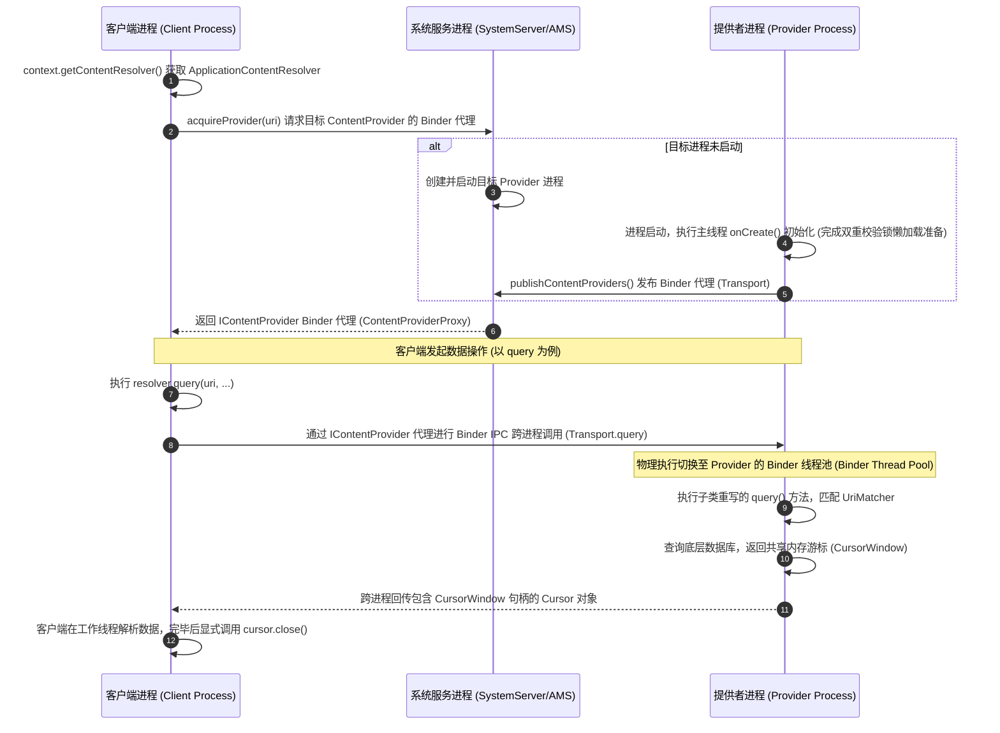

# 5.1.2.4.2 CRUD接口

## 导言
在 Android 系统的沙盒隔离机制下，每个应用程序运行在独立的 Linux UID 进程中，其私有的文件系统和 SQLite 数据库在物理上是绝对隔离的。这种进程级别的沙盒屏障保护了应用的数据安全，但同时也对应用之间的数据共享提出了极大的挑战。虽然普通的 IPC 机制（如 Binder/AIDL）能够解决跨进程的方法调用，但在传输海量结构化数据（如表格记录）时，如果针对每个业务表都定义一套特有的数据传输对象（DTO）和跨进程通信接口，不仅会导致接口冗余、开发繁琐，更难以提供标准化的底层映射和响应式的数据变更通知。

为此，Android 引入了统一的数据存取规范 —— `ContentProvider`（数据提供者）。而 `CRUD`（Create, Read, Update, Delete）接口正是这一组件对外暴露数据服务的核心物理窗口。它为应用提供了一套标准的、与底层具体存储介质（无论是 SQLite 数据库、SharedPreference 键值对、本地加密文件，还是远端网络接口）彻底解耦的、面向统一资源标识符（URI）的数据访问契约。数据提供者可以通过重写 CRUD 核心回调方法，对外部应用暴露精准控制的行级或列级数据，并可以在其中注入权限校验与安全过滤逻辑。本文将深入解密 ContentProvider 的六大核心回调方法重写实践、客户端 `ContentResolver` 的底层 Binder 工作流、`ContentObserver` 的响应式通知机制，以及利用批量与事务操作提升性能的底层优化机理。

---

## 六大核心回调重写实践与持久化映射

ContentProvider 的子类必须实现六个抽象方法：`onCreate()`、`insert()`、`query()`、`update()`、`delete()` 和 `getType()`。这些方法构成了数据持久化映射与路由的分发中枢。

### 1. onCreate() 的主线程加载约束与双重校验锁懒加载
当一个应用程序启动时，系统会通过 Zygote 分裂出应用进程。在 `ActivityThread.main()` 执行过程中，系统在主线程同步调用 `handleBindApplication()`。在此阶段，系统会率先解析当前应用声明的所有 ContentProvider 实例，并依次触发它们的 `onCreate()` 方法。
* **物理线程约束**：`onCreate()` 严格运行在应用的主线程（UI 线程）上，并且其执行时机甚至早于 `Application.onCreate()`。这意味着如果我们在 `onCreate()` 中执行任何高耗时的操作 —— 例如创建或升级 SQLite 数据库文件、解析超大型本地 XML 配置文件、进行网络拉取或执行大量的本地数据迁移 —— 都将直接阻塞整个应用进程的启动链路。在用户的直观感受上，应用会长时间卡死在启动白屏或黑屏界面，极易在启动阶段被 Android 系统的 Watchdog 判定为超时，进而触发 ANR（Application Not Responding）物理崩溃。
* **懒加载设计策略**：为了规避上述 ANR 风险，`onCreate()` 内部仅应进行最轻量级的成员变量赋值（如初始化 `UriMatcher` 路由实例等）。必须把真正耗时的数据库开库操作（如 `SQLiteOpenHelper.getWritableDatabase()`）延迟到客户端首次发起具体的 CRUD 操作时才真正执行。
* **多线程并发安全性分析**：由于具体的 CRUD 回调方法是由系统在并发的 Binder 线程池（Binder Thread Pool）中调用的，一旦采用延迟加载，就必须保证获取数据库 helper 实例的过程是线程安全的。我们通常采用双重校验锁（Double-Check Locking, DCL）机制来保证并发安全，或者依赖于 `SQLiteOpenHelper` 内部原生同步锁的初始化机制。

以下是实现双重校验锁懒加载与 CRUD 重写的标准类范式代码：

```java
public class MyContentProvider extends ContentProvider {

    private static final String AUTHORITY = "com.example.provider";
    private static final int CODE_USERS = 1;
    private static final int CODE_USER_ITEM = 2;
    private static final UriMatcher sUriMatcher = new UriMatcher(UriMatcher.NO_MATCH);

    static {
        sUriMatcher.addURI(AUTHORITY, "users", CODE_USERS);
        sUriMatcher.addURI(AUTHORITY, "users/#", CODE_USER_ITEM);
    }

    // 使用 volatile 保证多线程可见性与防止指令重排
    private volatile MyDatabaseHelper mDbHelper;

    @Override
    public boolean onCreate() {
        // onCreate 运行在主线程，仅做最轻量初始化，严禁在此处执行 SQLite 物理开库
        return true; 
    }

    // 双重校验锁（DCL）实现懒加载，确保 Binder 线程池并发访问时的安全性
    private MyDatabaseHelper getHelper() {
        if (mDbHelper == null) {
            synchronized (this) {
                if (mDbHelper == null) {
                    mDbHelper = new MyDatabaseHelper(getContext());
                }
            }
        }
        return mDbHelper;
    }

    @Override
    public Cursor query(Uri uri, String[] projection, String selection, String[] selectionArgs, String sortOrder) {
        MyDatabaseHelper helper = getHelper();
        SQLiteDatabase db = helper.getReadableDatabase();
        int match = sUriMatcher.match(uri);
        Cursor cursor;
        switch (match) {
            case CODE_USERS:
                cursor = db.query("users", projection, selection, selectionArgs, null, null, sortOrder);
                break;
            case CODE_USER_ITEM:
                String id = uri.getLastPathSegment();
                String itemSelection = "_id=?";
                String[] itemSelectionArgs = new String[]{id};
                if (selection != null && !selection.isEmpty()) {
                    itemSelection = itemSelection + " AND (" + selection + ")";
                    itemSelectionArgs = combineArgs(itemSelectionArgs, selectionArgs);
                }
                cursor = db.query("users", projection, itemSelection, itemSelectionArgs, null, null, sortOrder);
                break;
            default:
                throw new IllegalArgumentException("Unknown URI: " + uri);
        }
        
        // 绑定通知 URI，当此 URI 数据发生改变时，外部持有的 Cursor 能够感知并触发自愈刷新
        if (getContext() != null) {
            cursor.setNotificationUri(getContext().getContentResolver(), uri);
        }
        return cursor;
    }

    @Override
    public Uri insert(Uri uri, ContentValues values) {
        if (values == null) {
            throw new IllegalArgumentException("ContentValues cannot be null");
        }
        MyDatabaseHelper helper = getHelper();
        SQLiteDatabase db = helper.getWritableDatabase();
        int match = sUriMatcher.match(uri);
        long rowId;
        switch (match) {
            case CODE_USERS:
                rowId = db.insert("users", null, values);
                break;
            default:
                throw new IllegalArgumentException("Unsupported URI for insert: " + uri);
        }

        if (rowId > 0) {
            Uri newUri = ContentUris.withAppendedId(uri, rowId);
            // 成功插入后，显式向 ContentResolver 触发数据变更通知
            if (getContext() != null) {
                getContext().getContentResolver().notifyChange(newUri, null);
            }
            return newUri;
        }
        throw new SQLiteException("Failed to insert row into " + uri);
    }

    @Override
    public int update(Uri uri, ContentValues values, String selection, String[] selectionArgs) {
        MyDatabaseHelper helper = getHelper();
        SQLiteDatabase db = helper.getWritableDatabase();
        int match = sUriMatcher.match(uri);
        int rowsUpdated;
        switch (match) {
            case CODE_USERS:
                rowsUpdated = db.update("users", values, selection, selectionArgs);
                break;
            case CODE_USER_ITEM:
                String id = uri.getLastPathSegment();
                String itemSelection = "_id=?";
                String[] itemSelectionArgs = new String[]{id};
                if (selection != null && !selection.isEmpty()) {
                    itemSelection = itemSelection + " AND (" + selection + ")";
                    itemSelectionArgs = combineArgs(itemSelectionArgs, selectionArgs);
                }
                rowsUpdated = db.update("users", values, itemSelection, itemSelectionArgs);
                break;
            default:
                throw new IllegalArgumentException("Unknown URI: " + uri);
        }

        if (rowsUpdated > 0 && getContext() != null) {
            getContext().getContentResolver().notifyChange(uri, null);
        }
        return rowsUpdated;
    }

    @Override
    public int delete(Uri uri, String selection, String[] selectionArgs) {
        MyDatabaseHelper helper = getHelper();
        SQLiteDatabase db = helper.getWritableDatabase();
        int match = sUriMatcher.match(uri);
        int rowsDeleted;
        switch (match) {
            case CODE_USERS:
                rowsDeleted = db.delete("users", selection, selectionArgs);
                break;
            case CODE_USER_ITEM:
                String id = uri.getLastPathSegment();
                String itemSelection = "_id=?";
                String[] itemSelectionArgs = new String[]{id};
                if (selection != null && !selection.isEmpty()) {
                    itemSelection = itemSelection + " AND (" + selection + ")";
                    itemSelectionArgs = combineArgs(itemSelectionArgs, selectionArgs);
                }
                rowsDeleted = db.delete("users", itemSelection, itemSelectionArgs);
                break;
            default:
                throw new IllegalArgumentException("Unknown URI: " + uri);
        }

        if (rowsDeleted > 0 && getContext() != null) {
            getContext().getContentResolver().notifyChange(uri, null);
        }
        return rowsDeleted;
    }

    @Override
    public String getType(Uri uri) {
        int match = sUriMatcher.match(uri);
        switch (match) {
            case CODE_USERS:
                return "vnd.android.cursor.dir/vnd.com.example.provider.users";
            case CODE_USER_ITEM:
                return "vnd.android.cursor.item/vnd.com.example.provider.users";
            default:
                throw new IllegalArgumentException("Unsupported URI: " + uri);
        }
    }

    private String[] combineArgs(String[] first, String[] second) {
        if (second == null || second.length == 0) return first;
        String[] result = new String[first.length + second.length];
        System.arraycopy(first, 0, result, 0, first.length);
        System.arraycopy(second, 0, result, first.length, second.length);
        return result;
    }
}
```

### 2. insert() 的路由与安全返回
外部调用者通过传入目标 `Uri` 和封装了键值映射的 `ContentValues` 来执行插入。
* **物理路由**：内部利用 `UriMatcher`。其底层基于 Trie 前缀树匹配算法。在前缀树中，每个路径节点（如 `users`，或者代表通配符的 `#`、`*`）被抽象为一个树节点，`UriMatcher.match()` 通过深度优先或迭代算法在树中快速检索，最终映射到我们预先定义好的整数标识（如 `CODE_USERS`）。
* **物理写入与自增 ID 处理**：路由成功后，提取 `ContentValues` 中的字段值，执行底层数据库的 `db.insert()` 物理写盘。对于返回的底层数据库自增主键 `rowId`，必须使用 `ContentUris.withAppendedId(uri, rowId)` 拼接在新生成的 URI 尾部并返回。这使得调用端能够立刻知道该新插入行的具体资源物理路径。
* **安全边界控制**：严禁在插入失败或参数不合法时静默地返回 `null`，因为这极易导致客户端调用方发生空指针异常。针对空参数或非法的 URI，必须在 Provider 端显式抛出 `IllegalArgumentException`；针对底层的约束冲突，抛出 `SQLiteException`。

### 3. query() 接口与跨进程 CursorWindow 共享内存工作流
`query()` 接收的参数包括投影列（Projection）、选择条件（Selection）、参数绑定（SelectionArgs）和排序规则（SortOrder）。这些参数会被物理映射成底层 SQLite 的 `SELECT` 语句条件。
* **核心机理：基于 CursorWindow 的共享内存传输**：
  在 Android 的跨进程通信体系中，Binder 对传输的数据大小有严格的物理上限（通常为 1MB，由该进程的所有并发 IPC 共享）。如果查询的数据集包含成百上千行，直接将其序列化为普通的 Java 实体列表进行 Binder IPC 物理拷贝，会导致极为严重的内存抖动与物理瓶颈，甚至直接触发 Binder 溢出崩溃。
  为了解决这一痛点，Android 使用了**共享内存机制（Ashmem, Anonymous Shared Memory）**。当 Provider 执行物理查询并获得数据后，会创建一个物理载体 `CursorWindow`（默认大小通常为 2MB）。
  1. Provider 进程的 SQLite 引擎读取底层数据，并将这些二进制行数据（文本、数字、二进制 BLOB）顺序写入由操作系统内核分配的匿名共享内存块中。
  2. 写入完毕后，Provider 将此 `CursorWindow` 的 Binder 代理和文件描述符（FD, File Descriptor）封装在 `Cursor` 对象中，仅将该 FD 和 Binder 句柄通过 Binder 跨进程传递给客户端进程。
  3. 客户端进程接收到这个 Cursor 后，在自己的虚拟内存空间中，将该 FD 映射（mmap）到本地内存。当客户端调用 `cursor.moveToNext()`、`cursor.getString()` 等方法时，它是通过物理偏移量直接从该共享内存中读取数据，完全免去了数据的跨进程 Binder 二次物理拷贝，实现了极高的吞吐率。
* **CursorWindow 的限制与崩溃隐患**：由于 `CursorWindow` 的默认大小仅为 2MB，一旦单行数据（如在数据库中直接存储了大量的原图二进制 BLOB 或超长文本）超出了其可承载的最大容量，或者单条记录过大导致无法装入单个窗口，系统就会直接抛出 `CursorWindowAllocationException` 崩溃，或者导致数据读取发生物理截断。因此，在 ContentProvider 的设计中，绝对禁止将大文件（如高清图片、音视频文件）以二进制形式直接存入 SQLite 数据库。正确的架构设计是：在数据库中仅保留文件的相对或绝对路径，并在 ContentProvider 中重写 `openFile()` 或 `openAssetFile()` 接口，向客户端返回该文件的 `ParcelFileDescriptor`（PFD），从而实现大数据的管道式流传输。
* **连接与共享内存泄漏的危害**：客户端打开 `Cursor` 后，它实际上是跨进程持有了底层 SQLite 的游标连接以及操作系统分配的 Ashmem 句柄。如果客户端在使用完 Cursor 后没有在 `finally` 块中调用 `cursor.close()`，虽然 Java 端的垃圾回收器（GC）最终会将其回收，但 GC 的执行具有不可预测性。在 GC 触发前，底层的物理共享内存块、物理文件描述符以及 SQLite 数据库连接将一直被物理占用。这不仅会导致调用端进程发生文件描述符泄漏（FD Leak，当 FD 数量超过 Linux 的限制 1024 时，应用将崩溃），还会导致 ContentProvider 端数据库连接池耗尽，阻塞其他线程的数据写入，严重时甚至会导致整个系统发生 OOM 或卡死。

### 4. update() 与 delete() 的行数返回与参数防护
`update()` 与 `delete()` 均返回一个 `int` 类型的整数值，代表该操作在底层表中物理影响或修改的记录条数。
* **参数安全防护（防止 SQL 注入）**：因为 ContentProvider 面向全系统或跨应用公开，非常容易受到 SQL 注入攻击。在重写这两个方法时，必须禁止将外部传入的 selection 字符串与内部 SQL 直接拼接。必须强迫使用 `selectionArgs` 占位符进行参数绑定。例如：
  ```java
  // 错误且极度危险的做法：
  String where = "name = '" + selection + "'"; 
  // 正确的做法：
  String where = "name = ?";
  String[] selectionArgs = new String[]{ selection };
  ```
  参数化查询可以确保外部传入的数据仅被视为字面值，而不会被 SQLite 解析为可执行的 SQL 指令，从而从物理上杜绝了 SQL 注入攻击的风险。

### 5. getType() 的 MIME 协议与系统隐式 Intent 匹配原理
很多开发者在编写自定义 ContentProvider 时，习惯在 `getType()` 中直接返回 `null`。实际上，`getType()` 在 Android 的组件路由体系中扮演着举足轻重的角色。
* **MIME 类型的标准定义**：MIME 类型是用于标识数据格式的互联网标准。Android 强制规范了 ContentProvider 自定义 URI 对应的 MIME 类型格式：
  1. **集合类型（Directory）**：若 URI 对应的是多条记录（例如多本书、多个用户），MIME 必须以 `vnd.android.cursor.dir` 开头。标准格式为：`vnd.android.cursor.dir/vnd.<authority>.<path>`。
  2. **单项类型（Item）**：若 URI 对应的是单条记录（例如特定 ID 的书、特定 ID 的用户），MIME 必须以 `vnd.android.cursor.item` 开头。标准格式为：`vnd.android.cursor.item/vnd.<authority>.<path>`。
* **隐式 Intent 分发工作流**：当客户端发出一个隐式 Intent（例如：`Intent(Intent.ACTION_VIEW, uri)`）时，系统为了决定应该拉起哪一个 Activity 响应，会在内部向 PackageManager 询问对应的 MIME 类型。PackageManager 进而通过 Binder 调用该 `uri` 对应的 ContentProvider 的 `getType(uri)`。系统获取到 MIME 类型后，再比对系统中所有 Activity 在 `AndroidManifest.xml` 中声明的 `<intent-filter>` 中的 `<data android:mimeType="..." />`，从而精准分发。如果不重写或返回错误，隐式 Intent 将无法正确路由，导致组件启动失败。
* 此外，在 [Android 11 软件包可见性](../../../../../../AndroidVersionChangeLog.md) 的规则下，如果客户端未在其 Manifest 中通过 `<queries>` 声明目标 Authority，则 `getType` 的跨进程调用在底层将被直接拦截并返回 `null`，导致匹配失效。

---

## 客户端接口：ContentResolver 工作流与底层的 Binder 代理中转

客户端（如 Activity、Service 或后台任务）不能直接访问 ContentProvider 实例，必须通过 `ContentResolver` 作为中央代理进行调用。

### 1. 获取 ContentResolver 实例
我们通常在组件中使用 `context.getContentResolver()`。这里的 `context` 实际指向 `ContextImpl` 对象。在 `ContextImpl` 的初始化过程中，系统会创建 `ApplicationContentResolver` 的单例。`ApplicationContentResolver` 继承自 `ContentResolver` 抽象类，是客户端发起所有 CRUD 操作的物理入口。

### 2. 底层 Binder 交互与进程拉起工作流
当我们调用 `resolver.query(uri, ...)` 时，底层通过以下步骤进行跨进程 Binder 中转：
1. **提取 Authority**：ContentResolver 解析传入的 `Uri`，提取出 `authority`。
2. **检索本地缓存**：查询当前应用进程的 `ActivityThread` 中的 `mProviderMap` 缓存。如果已经缓存了目标 ContentProvider 的 Binder 代理，则直接复用；否则，发起 Binder IPC 请求，调往系统的核心服务进程 `ActivityManagerService (AMS)`。
3. **AMS 调度与拉起**：AMS 接收到请求后，在其维护的 `ProviderMap` 中查找该 Authority 对应的提供者。
   * 如果提供者所在的宿主进程**尚未启动**：AMS 会挂起客户端请求，并通过 Socket 触发 Zygote 孵化出目标进程。目标进程拉起后，在其主线程的初始化过程中，执行 `ContentProvider.onCreate()`，然后将底层的 `ContentProvider.Transport`（一个实现了 `IContentProvider` 接口的 Binder 本地对象）通过 `publishContentProviders` 接口注册回 AMS。
   * 如果进程**已启动**：AMS 直接获取宿主进程已经发布的 `IContentProvider` 的 Binder 代理（其底层实现为 `ContentProviderProxy`）。
4. **返回 Binder 代理**：AMS 将该 Binder 代理回传给客户端，客户端将其缓存至本地的 `mProviderMap`。
5. **执行跨进程 IPC**：客户端通过 Binder 代理 `ContentProviderProxy` 发起物理调用（例如 `query` 或 `insert`）。
6. **分发至 Binder 线程池**：宿主进程的 Binder 驱动接收到 IPC 请求，**唤醒宿主进程 Binder 线程池中的某个 Binder 线程（注意：不是主线程，所有的 CRUD 方法都是在多线程并发的 Binder 线程池中执行的）**，执行具体重写的方法，并将结果通过 Binder 管道序列化回传给客户端进程。



---

## 响应式数据自愈：ContentObserver 观察者机制

在跨应用或跨进程的分布式协作中，一方修改了数据，另一方如何实时、松耦合地感知数据变更并完成“数据自愈”？Android 设计了基于 URI 驱动的 `ContentObserver` 机制。

### 1. 客户端注册与子树监听
客户端通过 ContentResolver 注册观察者：
```java
context.getContentResolver().registerContentObserver(uri, notifyForDescendants, observer);
```
* **notifyForDescendants（子树监听）参数机理**：
  * 若为 `false`：精确匹配。仅当发送通知的 URI 与当前监听的 URI 字符完全一致时，才会触发回调。
  * 若为 `true`：通配监听。当监听 `content://authority/parent` 时，如果子节点 `content://authority/parent/child` 发生变化，观察者也会捕获到通知。这非常适合监听整张表的数据。
* **物理绑定**：客户端持有的 `ContentObserver` 内部含有一个 `IContentObserver.Stub` 的 Binder 本地对象。注册时，实际上传递给系统服务进程的是其 Binder 代理。

### 2. notifyChange() 发送数据广播的物理链路
当数据提供者进程在 `insert()`、`update()` 或 `delete()` 中成功修改物理数据后，必须在返回前显式调用以下方法：
```java
getContext().getContentResolver().notifyChange(uri, null);
```
其内部的物理分发链路如下：
1. **Provider -> ContentService**：调用会通过 Binder IPC 被发送到系统服务进程中的 `ContentService`。
2. **中心调度检索**：`ContentService` 是系统级的通知中心，在其维护的 `ObserverNode` 树中根据 URI 检索出匹配的所有 `IContentObserver` 代理（此处会结合 `notifyForDescendants` 进行前缀树匹配）。
3. **ContentService -> 客户端进程**：`ContentService` 遍历匹配到的代理，发起跨进程 Binder 回调，调用客户端的 `onChange()`。
4. **客户端 Handler 分发与自愈**：客户端的 Binder 线程接收到回调后，利用注册时传入的 `Handler` 将事件分发至指定线程（如主线程），执行重写的 `onChange(boolean selfChange, Uri uri)` 方法。
5. **UI 刷新或本地缓存刷新**：在 `onChange()` 回调中，客户端可以重新发起 `query()` 查询以拉取最新的物理数据，完成 UI 层的自愈刷新，而无需主动轮询。

---

## 批量与事务操作优化：提升跨进程原子性与 I/O 性能

在需要频繁、大量修改数据的场景下（例如云端联系人同步、离线地图同步），单次 CRUD 循环调用会导致灾难性的性能崩溃。

### 1. 频繁单次操作的性能痛点
1. **IPC 上下文切换与数据拷贝开销**：每次执行 `resolver.insert()`，都是一次完整的 Binder IPC 交互。这意味着 CPU 必须在用户态和内核态之间频繁切换，并进行参数和返回值的序列化、内存拷贝和反序列化。如果循环执行 1000 次插入，就意味着发生了 1000 次 Binder 阻碍式调用，耗费了大量的 CPU 周期。
2. **SQLite 隐式事务与物理磁盘刷盘（fsync）灾难**：SQLite 数据库在默认情况下处于“自动提交模式”（Auto-commit Mode）。如果不在代码中显式开启事务，SQLite 会将每一条 `insert` 或 `update` SQL 语句自动包装在一个独立的隐式事务中。在每次隐式事务提交时，为了确保数据的持久化安全，SQLite 必须物理触发操作系统的 `fsync()`，将数据页和写前日志（WAL）物理刷入闪存中。闪存的物理写入和寻道延迟非常高，频繁的 `fsync()` 会导致 I/O 阻塞，1000 次单条插入往往需要耗费数秒甚至数十秒的时间，甚至会加剧闪存寿命的损耗。

### 2. bulkInsert() 批量写入的物理优化
ContentProvider 基类的 `bulkInsert()` 默认实现仅是一个 `for` 循环调用 `insert()`，这并没有解决隐式事务频繁刷盘和频繁 IPC 的瓶颈（除非客户端是在同一个进程内直接访问，但即使同进程，隐式事务的频繁提交依然存在）。
在涉及多条数据连续插入的场景下，我们必须在 Provider 中重写 `bulkInsert()`，显式开启 SQLite 数据库物理事务：

```java
@Override
public int bulkInsert(Uri uri, ContentValues[] values) {
    if (values == null || values.length == 0) {
        return 0;
    }
    int match = sUriMatcher.match(uri);
    if (match != CODE_USERS) {
        return super.bulkInsert(uri, values);
    }
    
    MyDatabaseHelper helper = getHelper();
    SQLiteDatabase db = helper.getWritableDatabase();
    int numInserted = 0;
    
    // 显式开启 SQLite 事务，大幅提升批量写入性能
    db.beginTransaction();
    try {
        for (ContentValues value : values) {
            if (value == null) continue;
            long id = db.insert("users", null, value);
            if (id != -1) {
                numInserted++;
            }
        }
        // 标记事务执行成功
        db.setTransactionSuccessful();
    } finally {
        // 结束事务，如果未标记成功则自动物理回滚，保证原子性
        db.endTransaction();
    }
    
    // 批量操作完成后，仅发起一次 notifyChange，避免高频通知带来的系统性能抖动
    if (numInserted > 0 && getContext() != null) {
        getContext().getContentResolver().notifyChange(uri, null);
    }
    return numInserted;
}
```
**优化成效**：通过显式开启事务，所有的物理写盘（`fsync()`）合并为 1 次，所有的数据插入操作都在内存缓冲区（Cache）中瞬间完成。其执行效率可提升上百倍。

### 3. applyBatch() 事务与后向引用（Back-Reference）机制
`applyBatch()` 是 ContentProvider 实现复杂事务和高性能批量操作的终极武器。它通过 `ContentProviderOperation` 对象列表，将不同类型的操作（Insert、Update、Delete、Assert）打包成一个任务队列。

#### (1) IPC 传输合并与物理事务包裹
客户端将所有的 `ContentProviderOperation` 构建成一个 `ArrayList`，仅需发起 **一次** Binder 调用传输到 Provider 端。
在 Provider 端，我们需要重写 `applyBatch()`，使用物理数据库事务将其包裹：

```java
@Override
public ContentProviderResult[] applyBatch(ArrayList<ContentProviderOperation> operations) 
        throws OperationApplicationException {
    MyDatabaseHelper helper = getHelper();
    SQLiteDatabase db = helper.getWritableDatabase();
    
    // 开启物理数据库事务，提供 applyBatch 的原子性保证
    db.beginTransaction();
    try {
        int numOperations = operations.size();
        ContentProviderResult[] results = new ContentProviderResult[numOperations];
        for (int i = 0; i < numOperations; i++) {
            ContentProviderOperation operation = operations.get(i);
            // 执行操作，并自动根据 results 解析可能存在的后向引用
            results[i] = operation.apply(this, results, i);
        }
        db.setTransactionSuccessful();
        return results;
    } finally {
        db.endTransaction();
    }
}
```
如果在循环执行队列操作的过程中，任何一步操作抛出异常（如违反数据库唯一性约束、断言校验失败），`db.endTransaction()` 都会在 `finally` 块中执行回滚，保证这批操作要么全成功，要么全失败，从而维护了全局的物理强一致性。

#### (2) 后向引用（Back-Reference）的高级物理机制与工作流
在具有强外键依赖的数据库表设计中，后向引用是一个极其高级且不可或缺的特性。
- **典型场景**：在单个业务场景中，我们需要插入一个新的联系人 `RawContact`，获取其自增主键 ID，并利用此 ID 作为外键立刻向 `Data` 表中插入该联系人的多条电话号码和电子邮件数据。
- **常规操作的弊端**：客户端必须先执行一次 `insert(RawContact)`，等待 Binder 返回新生成的具体 URI，在客户端将其解析出 ID 后，再连续发起多次 Binder 调用向 `Data` 表中插入具体信息。这导致了多次 IPC 阻塞和多次隐式事务提交，且无法保证事务原子性（如果插入 Data 时崩溃，RawContact 将成为脏数据残留）。
- **后向引用的工作原理**：
  1. 客户端在构建 `ContentProviderOperation` 列表时，将插入 `RawContact` 的操作放在索引为 `0` 的位置：
     ```java
     ContentProviderOperation op1 = ContentProviderOperation.newInsert(RawContacts.CONTENT_URI)
         .withValue(RawContacts.ACCOUNT_NAME, "test_account")
         .build();
     ```
  2. 紧接着，构建插入 `Data` 表的操作，放在索引为 `1` 的位置，并使用 `.withValueBackReference()` 方法指定外键字段 `raw_contact_id` 引用索引为 `0` 的操作结果：
     ```java
     ContentProviderOperation op2 = ContentProviderOperation.newInsert(Data.CONTENT_URI)
         .withValueBackReference(Data.RAW_CONTACT_ID, 0) // 后向引用关键点
         .withValue(Data.MIMETYPE, Phone.CONTENT_ITEM_TYPE)
         .withValue(Phone.NUMBER, "13800138000")
         .build();
     ```
  3. 客户端将这些 Operation 打包通过一次 `applyBatch` 调用发送至 Provider 进程。
  4. **底层物理求值**：在 Provider 端顺序执行这些 Operation 时，当执行完索引为 `0` 的操作，系统会将其返回的结果（新插入的 URI，如 `content://.../raw_contacts/45`）封装在 `ContentProviderResult[0]` 中。当执行到索引为 `1` 的操作时，框架检测到其带有针对索引 `0` 的后向引用，就会在内部调用 `ContentProviderOperation.resolveValueBackReferences()` 方法，自动从 `ContentProviderResult[0]` 中提取出刚才新生成的自增 ID（如 `45`），并将该值动态赋给 `values` 中的 `raw_contact_id` 字段，随后再执行物理数据库插入。

这种巧妙的后向引用机制，将“读取新生成 ID”与“将其作为外键写入子表”的闭环逻辑完全收拢在 Provider 进程的单次 SQLite 事务中完成。它从根本上消除了客户端与服务端之间的网络和 IPC 往返开销，实现了**高吞吐、零冗余、强一致**的高性能持久化写入。
