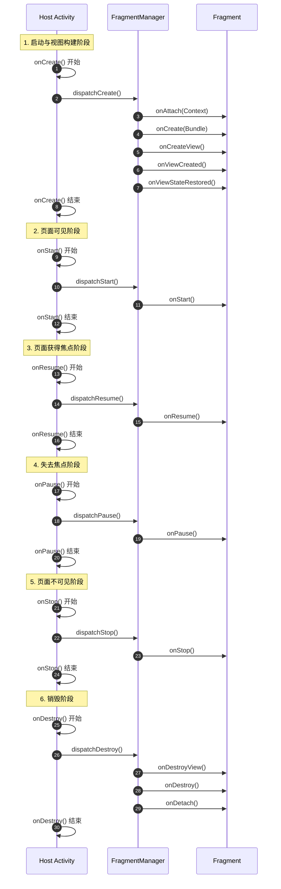
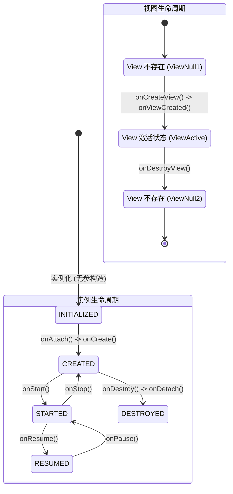

# 5.1.3.1 Fragment生命周期

## 1. 导言
Fragment（碎片）在 [Android 3.x（API 11 / 12 / 13）](../../../../../AndroidVersionChangeLog.md#android-3xapi-11--12--13) 中被引入，最初的目的是为了在大屏幕设备（如平板电脑）上支持更动态、更灵活的 UI 设计。然而，随着 Android 开发生态的演进，Fragment 已不再局限于平板适配，而是成为了现代 Android 界面模块化、多页面单 Activity 架构（Single Activity Architecture）以及导航组件（Navigation Component）的基础基石。

然而，Fragment 在带来组件化便利的同时，也带来了 Android 开发中最让人头疼的“复杂生命周期”问题。与只有单一生命周期的 Activity 不同，Fragment 拥有极其特殊的“双重生命周期”，且它必须寄生于宿主 Activity 之中。这两者生命周期回调的时序交织、状态同步、异常重建时的数据恢复，以及在 Jetpack 架构下面对 LiveData/Flow 时的生命周期对齐，不仅是面试中的常客，更是实际项目开发中内存泄漏、UI 重复刷新和应用崩溃的高发地带。本文将从底层运行机制出发，深度剖析 Fragment 生命周期的设计本质与实战避坑指南。

---

## 2. 双重生命周期设计解密

### 2.1 实例生命周期与视图生命周期的分离与本质区别
Fragment 之所以设计为“双重生命周期”，关键在于其**多变性**：它既可以扮演“有界面的 UI 模块”，也可以扮演“无界面的后台任务助手”（即 Headless Fragment）。此外，在多页面导航或回退栈（BackStack）的场景中，Fragment 可以在“界面已被销毁，但其实例仍然被保留以维持状态”的中间状态下存活。

- **Fragment 实例生命周期（Instance Lifecycle）**：
  代表 Fragment 这一 Java/Kotlin 对象的创建与销毁。它由 `onAttach()` 开始，到 `onDetach()` 结束。它对应的是 Fragment 在内存中的生命轨迹。只要 Fragment 还没有被它的宿主（Activity/Parent Fragment）从管理器中彻底移除，这个生命周期就一直在延续。
- **Fragment 视图生命周期（View Lifecycle）**：
  代表 Fragment 所渲染的 UI 视图（即 `View` 对象）的生死。它由 `onCreateView()` / `onViewCreated()` 开始，到 `onDestroyView()` 结束。

在什么场景下这两者会产生割裂？
最典型的是**回退栈（BackStack）**。假设我们有 Fragment A 和 Fragment B，它们都在同一个 `FragmentManager` 中管理。当我们在 Activity 中执行如下操作：
```kotlin
supportFragmentManager.beginTransaction()
    .replace(R.id.container, fragmentB)
    .addToBackStack(null)
    .commit()
```
此时，Fragment A 的视图将被销毁，触发 `onDestroyView()`。但是因为 `addToBackStack` 的存在，Fragment A 的实例并没有被销毁，它的实例生命周期依然存活在内存中（处于 `CREATED` 状态，而非 `DESTROYED`）。

当用户按下物理返回键时，Fragment A 被重新唤醒：它的实例直接复用，不需要重新走 `onAttach()` 和 `onCreate()`，而是直接从 `onCreateView()` 开始重新创建视图，并推进到 `onViewCreated()`、`onStart()` 等状态。如果将这两者混为一谈，就会写出导致泄漏或状态错乱的致命代码。

---

### 2.2 onDestroyView 内存泄漏大坑与 ViewBinding 防漏最佳实践
既然 Fragment 的视图生命周期可以先于实例生命周期结束，那么当视图被销毁（`onDestroyView`）而实例依然存活时，任何被 Fragment 实例所持有的 View 引用都将变成**脏引用（Stale Reference）**。

#### 2.2.1 内存泄漏机制深度剖析
在 Activity 中，View 的生命周期与 Activity 实例生命周期是一致的。但在 Fragment 中，如果你使用成员变量保存了 View 引用（例如 ViewBinding 或通过 `findViewById` 找到的控件）：
```kotlin
class DetailFragment : Fragment() {
    private lateinit var titleTextView: TextView // 强引用
    // ...
}
```
当 Fragment A 替换进入 BackStack，其 UI 视图已经从 Window 树中被移除，理应可以被垃圾回收器（GC）回收。然而，因为 Fragment 实例仍存活在宿主的 FragmentManager 中，并且其成员变量 `titleTextView` 牢牢持有着该 TextView 的强引用。由于 TextView 内部会持有着其父布局（ViewGroup）以至于整棵视图树的强引用，更致命的是，所有的 View 内部都持有着 `Context`（即宿主 Activity 的引用）。

这就导致了**整棵 View 树以及它们所关联的宿主 Activity 全部被泄漏在内存中**。这就是为什么很多 App 在进行页面切换后，内存占用呈阶梯式上升、久久不降的根本原因。

#### 2.2.2 ViewBinding 的防泄漏标准示范
官方为我们提供了一套严谨 of ViewBinding 使用范式，即使用可空 backing property 并在 `onDestroyView` 中置空：
```kotlin
class DetailFragment : Fragment(R.layout.fragment_detail) {
    // 1. 定义一个私有的可空备份属性
    private var _binding: FragmentDetailBinding? = null
    
    // 2. 提供一个只读属性，避免在使用时频繁写 ? 号
    // 仅在 onCreateView 至 onDestroyView 之间有效
    private val binding get() = _binding!!

    override fun onViewCreated(view: View, savedInstanceState: Bundle?) {
        super.onViewCreated(view, savedInstanceState)
        // 3. 在 onViewCreated 中进行绑定
        _binding = FragmentDetailBinding.bind(view)
        
        binding.titleTextView.text = "Hello Fragment"
    }

    override fun onDestroyView() {
        super.onDestroyView()
        // 4. 必须在 onDestroyView 中显式置为 null，解除对 View 树的强引用！
        _binding = null
    }
}
```
**深度解析**：为什么不能把 `binding` 定义为 `lateinit var binding: FragmentDetailBinding`？因为 `lateinit var` 在 Kotlin 中被编译为非空类型字段，且无法被手动重置为未初始化状态，我们无法将其设为 null。为了符合编译器的非空检查，同时又能在生命周期结束时安全地释放内存，必须使用一个支持可空的私有变量 `_binding`，配合一个自定义 getter `binding`，方能在安全性和代码编写的易用性之间取得完美平衡。

---

### 2.3 viewLifecycleOwner 的引入初衷与 LiveData 重复监听 Bug
在 Jetpack 架构普及初期，LiveData 几乎是 Android 页面通信的标准配置。我们在 Fragment 中观察 LiveData 时，经常会随手写出以下代码：
```kotlin
// 致命错误示范：传入 Fragment 实例本身
viewModel.data.observe(this, Observer { data ->
    // 更新 UI 控件
})
```
在这段代码中，我们传入了 `this`（也就是 Fragment 实例本身）作为 `LifecycleOwner`。

#### 2.3.1 LiveData 重复观察 Bug 原理
当 Fragment 被 `replace` 并且 `addToBackStack` 时，其 View 被销毁，但 Fragment 实例未销毁。当用户按物理返回键，Fragment 重新回到前台，它的 `onViewCreated` 再次被执行，从而再次执行了 `viewModel.data.observe(this, ...)`。

由于 `this`（Fragment 实例）始终是同一个，并且在整个 BackStack 期间它从未被销毁（它的 Lifecycle 状态最低也只是回退到 `CREATED`，而不是 `DESTROYED`），LiveData 会认为这是一个**全新的 Observer**（通常 Lambda 表达式在每次执行时都会生成一个新的匿名观察者实例），或者会因为生命周期未死亡而将其加入到活跃观察者列表中。

此时，LiveData 内部的观察者集合（`mObservers`）中就会叠加注册两个（或多个）Observer。当 ViewModel 中的数据再次发生改变时，同一个 LiveData 会向同一个页面分发两次（或多次）一模一样的数据，导致**多重回调触发**。如果回调中包含了统计埋点、网络请求或是弹窗逻辑，会导致严重的业务 Bug 甚至崩溃。

#### 2.3.2 viewLifecycleOwner 的工作机制
为了解决这一历史局限，官方在 Fragment 中引入了 `viewLifecycleOwner`（视图生命周期所有者）。它的核心设计逻辑是：
1. `viewLifecycleOwner` 拥有独立的 `Lifecycle` 实例，其生命周期与 Fragment 的 **View 视图生命周期** 完美对齐。
2. 当 `onCreateView()` 执行时，`viewLifecycleOwner` 被初始化并进入 `INITIALIZED` 状态；当 `onDestroyView()` 被调用时，`viewLifecycleOwner` 的生命周期被标记为 `DESTROYED`。
3. LiveData 在收到 `DESTROYED` 状态通知时，会自动反注册并移除该观察者，实现**自动清理**。

因此，当 Fragment 重新创建视图并再次执行 `onViewCreated` 时，使用的是一个新的 `viewLifecycleOwner` 实例，旧的已经被自动安全销毁，从而彻底根治了重复注册的顽疾。

> [!IMPORTANT]
> 在 Fragment 中，凡是**与 UI 控件更新相关**的 LiveData 或 Flow 观察注册，必须传入 `viewLifecycleOwner`，绝对不允许传入 `this`。

---

## 3. 宿主 Activity 与 Fragment 生命周期的绑定流程

Fragment 作为依附于 Activity 的组件，它的生命周期不能脱离 Activity 独立运行。`FragmentManager` 充当了状态分发器的角色，将 Activity 的生命周期事件层层投递给内部的每一个 Fragment。

### 3.1 协同生命周期状态流转（时序图与状态图）

#### 3.1.1 协同生命周期时序图
下图直观地展现 Activity 从启动到销毁的全生命周期流转，以及 Fragment 生命周期方法的穿插调用顺序：



#### 3.1.2 状态流转对照图
下面是 Fragment 的双重生命周期（实例生命周期与视图生命周期）在不同阶段的状态流转变化：



---

### 3.2 协同执行顺序深度剖析

#### 1. onAttach(Context context)
- **触发时机**：Fragment 与宿主 Activity 建立关联时最先触发。
- **职责定位**：在此方法中，Fragment 可以获取到宿主 Activity 的引用。在 [Android 6.0（API 23）](../../../../../AndroidVersionChangeLog.md#android-60api-23) 之后，原有的 `onAttach(Activity activity)` 被废弃，改为了 `onAttach(Context context)`，这是为了更好地支持多重宿主（例如 Fragment 挂载在另一个 Fragment 之下，或者非 Activity 的 Context 挂载）。
- **限制与安全**：在该方法被调用之前，`requireActivity()` 或 `requireContext()` 将会抛出 `IllegalStateException`。此时 Fragment 的状态变为 `ATTACHED`。

#### 2. onCreate(Bundle savedInstanceState)
- **触发时机**：Fragment 实例创建完成时触发。
- **职责定位**：用于初始化非 View 相关的持久性数据、配置信息，或者在需要进行跨配置恢复数据时，读取从 `savedInstanceState` 恢复的初始化参数。
- **限制**：此时视图尚未构建，任何依赖 `getView()` 的操作都是禁止的。

#### 3. onCreateView(LayoutInflater inflater, ViewGroup container, Bundle savedInstanceState)
- **触发时机**：Fragment 开始构建其 UI 视图树时触发。
- **职责定位**：inflate 并返回 Fragment 的根视图 View。如果在构造函数中传入了 `layoutId`（AndroidX Fragment 支持的构造函数布局注入），默认的 `onCreateView()` 实现会替我们自动 inflate，通常我们就不需要再覆写该方法。

#### 4. onViewCreated(View view, Bundle savedInstanceState)
- **触发时机**：根视图构建完毕且返回值不为 null 时立即触发。
- **职责定位**：最适合进行 ViewBinding 的绑定、控件属性初始化、各种点击监听事件挂载以及 LiveData / Flow 数据观察者的注册。
- **优势**：此时 `view` 绝对不为 null，比在 `onCreateView` 里做这些事要安全得多，也是官方极力推崇的入口。

#### 5. onActivityCreated(Bundle savedInstanceState) (已废弃)
- **废弃背景**：原本的设计意图是提示开发者“宿主 Activity 的 `onCreate()` 已经执行完毕”。但是在 Jetpack Lifecycles 框架下，这导致了生命周期概念的冗余，容易诱导开发者编写与视图初始化无关的残留代码。在 [Android 12（API 31）](../../../../../AndroidVersionChangeLog.md#android-12api-31) 中已被全面废弃。
- **现代替代**：与 Activity 初始化的协同逻辑，应使用 `DefaultLifecycleObserver` 观察宿主 Activity 的生命周期，或直接将数据初始化逻辑前置到 `onViewCreated()` 中。

#### 6. onStart() / onResume() / onPause() / onStop()
- 它们与 Activity 的同名方法基本是一一对应的。其核心意义在于控制 Fragment 的“可见性”与“交互活性”。
- 值得一提的是，Fragment 的 `onResume()` 只有在宿主 Activity 的 `onResume()` 执行完毕，并且 Fragment 本身对用户完全可见时，才会被 FragmentManager 驱动调用。

#### 7. onDestroyView()
- **重要分水岭**：Fragment 视图树销毁 the 起点。如果 Fragment 被放入 BackStack，在这里视图将会彻底从 Window 树中被剥离，所有 UI 控件的引用以及 ViewBinding 变量必须在这里切断与置空，以防引起前文提及的内存泄漏。

#### 8. onDestroy() 与 onDetach()
- `onDestroy()` 清理 Fragment 实例级别的状态。
- `onDetach()` 解除与 Activity 的绑定关系。在此之后，Fragment 恢复到 `INITIALIZED` 状态，不再与任何 Activity 关联，其内的 `getActivity()` 将返回 null。

---

### 3.3 FragmentManager 状态同步的底层运行机制
为什么 Fragment 的生命周期会如此丝滑地跟随 Activity 改变？
在底层，`Activity` 内部持有一个 `FragmentController`（它其实是 `FragmentManager` 的一个包装类）。当 Activity 执行 `onStart()` 时，它会调用 `mFragments.dispatchStart()`。而 `FragmentManager` 的 `dispatchStart()` 最终会遍历所有处于活跃状态的 Fragment，并调用 `moveToState()` 方法，将 Fragment 的状态标记逐步推进。

在 `FragmentManager` 内部，Fragment 的状态被定义为若干个常量（如 `INITIALIZING`、`ATTACHED`、`CREATED`、`VIEW_CREATED`、`STARTED`、`RESUMED`）。当 Activity 发生生命周期流转时，FragmentManager 就会像齿轮一样，将它管理的所有 Fragment 的状态向 Activity 推进：
```java
// FragmentManager.java 核心推进逻辑伪代码
void moveToState(Fragment f, int newState) {
    if (f.mState < newState) {
        switch (f.mState) {
            case Fragment.INITIALIZING:
                f.performAttach(); // 触发 onAttach()
            case Fragment.ATTACHED:
                f.performCreate(); // 触发 onCreate()
            case Fragment.CREATED:
                if (newState > Fragment.CREATED) {
                    f.performCreateView(); // 触发 onCreateView() / onViewCreated()
                }
            case Fragment.VIEW_CREATED:
                if (newState > Fragment.VIEW_CREATED) {
                    f.performStart(); // 触发 onStart()
                }
            case Fragment.STARTED:
                if (newState > Fragment.STARTED) {
                    f.performResume(); // 触发 onResume()
                }
        }
    } else if (f.mState > newState) {
        // 逆向回退状态，依次分发 pause, stop, destroyView, destroy, detach
    }
}
```
这种“通过宿主驱动 + 状态对齐（State Alignment）”的拉取模型，构成了整个 Fragment 框架的核心运作机制。

---

## 4. 异常销毁重建与无参反射构造机制

在实际生产环境中，由于配置更改（屏幕旋转、系统语言切换）或系统在后台因为内存不足强杀进程（Process Death），Fragment 往往需要经历“销毁 -> 自动重建”的洗礼。这一机制在给用户带来无缝体验的同时，也给开发者带来了极其严苛 of 编码要求。

### 4.1 为什么禁止使用带参构造函数？
在初学 Android 时，我们可能习惯于通过带参的构造函数向 Fragment 传递数据：
```kotlin
// 极其危险的代码示范
class DetailFragment(private val userId: String) : Fragment() {
    // ...
}
```
**严重后果**：这会导致应用在发生配置更改或后台重建时直接**崩溃（Crash）**。

#### 4.1.1 重建原理深度解密
当系统由于内存不足将应用进程强杀时，虽然应用死了，但系统服务（如 `ActivityManagerService`）仍然保存着该页面的任务栈信息（通过 `ActivityRecord`）。当用户重新点击该应用图标时，系统会尝试恢复 Activity。宿主 Activity 重建时，其持有的 `FragmentManager` 也会随之重建，并自动恢复它之前所托管的 Fragment。

`FragmentManager` 在恢复 Fragment 时，是通过内置的类加载器和反射机制重新生成 Fragment 实例的。其底层默认实现可以通过如下源码逻辑表示：
```java
// FragmentFactory.java 核心反射逻辑简化
public Fragment instantiate(@NonNull ClassLoader classLoader, @NonNull String className) {
    try {
        Class<? extends Fragment> cls = loadFragmentClass(classLoader, className);
        // 核心：通过反射调用的是无参构造函数！
        return cls.getConstructor().newInstance();
    } catch (java.lang.InstantiationException e) {
        throw new Fragment.InstantiationException("Unable to instantiate fragment " + className
                + ": make sure class name exists, is public, and has an empty constructor that is public", e);
    }
    // ...
}
```
从源码中可以清晰地看出，`FragmentManager` 只会反射调用 **无参数的默认构造函数**。
如果开发者覆写了构造函数，提供了一个带参构造函数，而**没有提供公共的无参构造函数**，反射调用就会直接抛出 `NoSuchMethodException`，进而封装为 `Fragment.InstantiationException` 导致 App 发生灾难性崩溃。
即使开发者同时提供了带参和无参两个构造函数，系统在重建时也只会调用无参的那一个，导致传入的参数（如 `userId`）完全丢失，后续业务逻辑因空指针而崩溃。

---

### 4.2 setArguments(Bundle) 的物理意义与底层序列化原理
既然构造函数传参行不通，那么官方推荐的 `setArguments(Bundle)` 为什么能在重建中安然无恙？

- **物理意义**：
  `setArguments` 并非简单的成员变量赋值。它将数据塞进了一个系统托管的 `Bundle` 中。这个 `Bundle` 的生命周期是越过了 Fragment 实例本身的，它是由 `FragmentManager` 甚至 Android 系统进程（通过 Binder）来做持久化备份的。
- **底层序列化机制**：
  当 Activity 即将面临销毁时（配置更改或即将被强杀），系统会触发 `onSaveInstanceState(Bundle outState)`。在这个过程中，`FragmentManager` 会被要求保存其内部的所有状态，它会调用 `saveAllState()`。
  
  `FragmentManager` 会遍历它管理的每一个活跃的 Fragment，并将它们的数据打包成一个 Serializable/Parcelable 的 `FragmentState` 对象。在 `FragmentState` 类的内部，有如下几个核心字段：
  ```java
  // FragmentState.java 源码核心字段示意
  final String mClassName;
  final String mWho;
  final boolean mFromLayout;
  // ...
  final Bundle mArguments; // 关键：setArguments 传入的 Bundle 在此被序列化保存！
  Bundle mSavedFragmentState; // 包含了 Fragment 内部 View 的状态以及 savedInstanceState
  ```
  `FragmentManager` 将所有的 `FragmentState` 放入一个列表，整体作为 `FragmentManagerState` 对象，最终被塞进宿主 Activity 的 `outState` 那个 Bundle 中，通过 Binder 事务通道跨进程安全地送往系统进程（ActivityManagerService）进行暂存。

#### 4.2.1 重建恢复流程
1. 系统进程将暂存的 Bundle 下发给新创建 feather Activity。
2. Activity 的 `FragmentManager` 从中解析出 `FragmentManagerState`。
3. 通过 `FragmentState` 里的 `mClassName`，反射调用无参构造函数，生成全新的 Fragment 实例。
4. **关键一步**：将保存下来的 `mArguments`（Bundle）直接重新赋值给新 Fragment 的 `mArguments` 成员变量。
5. 接着，Fragment 走正常的生命周期流程。在 `onCreate` 中，开发者通过 `requireArguments()` 即可安全地重新读取出之前存入的数据。

#### 4.2.2 标准传参代码示范
```kotlin
class DetailFragment : Fragment() {
    companion object {
        private const val KEY_USER_ID = "key_user_id"

        // 使用静态工厂方法封装实例化和传参过程
        fun newInstance(userId: String): DetailFragment {
            return DetailFragment().apply {
                arguments = Bundle().apply {
                    putString(KEY_USER_ID, userId)
                }
            }
        }
    }

    private lateinit var userId: String

    override fun onCreate(savedInstanceState: Bundle?) {
        super.onCreate(savedInstanceState)
        // 在 onCreate 中安全地提取参数，无论是否经历重建，它都不会丢失
        userId = requireArguments().getString(KEY_USER_ID) ?: ""
    }
}
```

---

### 4.3 setRetainInstance(true) 的历史角色与废弃缘由
在 Jetpack 生态形成前，`setRetainInstance(true)` 是解决“配置更改时数据丢失”的明星 API。

- **历史定位与原理**：
  当调用了 `setRetainInstance(true)` 后，一旦发生配置更改（如屏幕旋转），`FragmentManager` 在销毁 Activity 时，**不会销毁**该 Fragment 实例。它会跳过 Fragment 的 `onDestroy()`，直接解除绑定（`onDetach()`）。然后，当新 Activity 启动后，直接将这个**在内存中保留的 Fragment 实例**重新 attach 到新的 Activity 上。由于实例未变，Fragment 成员变量里的所有内存数据都得以完美保留。
- **为什么被淘汰？**：
  在 API 28 之后，官方开始将其标记为 Deprecated，并在后续版本中彻底不建议使用。主要原因有三：
  1. **能力残缺**：它只能应对“配置更改”，对于系统内存不足导致的“进程强杀（Process Death）”毫无招架之力（因为进程都死了，内存中的实例不可能保留）。
  2. **极易导致内存泄漏**：Retained Fragment 存活时间跨越了两个 Activity 实例。如果开发者在 Fragment 中直接或间接地（如通过匿名内部类、非静态 Handler、未解绑的 View）持有了前一个 Activity 的引用，就会导致前一个 Activity 无法被回收，发生严重的内存泄漏。
  3. **生命周期割裂**：它破坏了整个 Fragment 生命周期的正常流转，跳过 `onCreate` / `onDestroy` 使得数据初始化与释放逻辑变得异常错乱，极大地增加了工程维护的成本。

#### 4.3.1 现代化替代方案：ViewModel
Jetpack 的 `ViewModel` 完美取代了这一历史包袱。`ViewModel` 的生命周期被设计为跨越配置更改。其底层是通过 Activity 内部的 `ViewModelStore` 进行存储管理的。在配置更改时，Activity 会把 `ViewModelStore` 保留在非配置更改实例中，重建后将其交还给新的 Activity 实例。

相比 `setRetainInstance(true)`，`ViewModel` 不仅能完美隔离视图与数据，避免数据层直接持有 Activity 的引用从而根治内存泄漏，还能通过 `SavedStateHandle` 机制抵御系统进程强杀（Process Death），在安全性、统一性和维护性上实现了降维打击。

---

## 5. Jetpack Lifecycle 体系下双重 LifecycleOwner 的对齐逻辑

随着 Jetpack 的普及，Fragment 不仅自己是一个 `LifecycleOwner`，它内部的视图也通过 `viewLifecycleOwner` 开启了独立的 `LifecycleOwner` 观察通道。理清这两者的 Lifecycle 状态变化，是进行协程（Coroutines）与状态观测（StateFlow/SharedFlow/LiveData）开发的必修课。

### 5.1 双重 LifecycleOwner 状态对齐表
Fragment 本身（`getLifecycle()`）与视图（`getViewLifecycleOwner().getLifecycle()`）在不同生命周期节点上的 Lifecycle.State 状态变化如下：

| Fragment 生命周期回调 | Fragment 实例 Lifecycle.State | View (viewLifecycleOwner) Lifecycle.State | 备注 |
| :--- | :--- | :--- | :--- |
| `onAttach()` / `onCreate()` | **INITIALIZED** -> **CREATED** | *未初始化* (无法获取) | 此时无 View 视图 |
| `onCreateView()` | **CREATED** | **INITIALIZED** | 视图开始构建，viewLifecycleOwner 诞生 |
| `onViewCreated()` | **CREATED** | **INITIALIZED** | 推荐在此开始观察 LiveData / 收集 Flow |
| `onStart()` | **STARTED** | **STARTED** | 页面可见，观察者开始接收事件 |
| `onResume()` | **RESUMED** | **RESUMED** | 页面处于前台且可交互 |
| `onPause()` | **STARTED** | **STARTED** | 页面失去焦点 |
| `onStop()` | **CREATED** | **CREATED** | 页面不可见 |
| `onDestroyView()` | **CREATED** | **DESTROYED** | **关键**：View 相关的 Observer 在此全部自动解绑 |
| `onDestroy()` / `onDetach()` | **DESTROYED** | *已销毁* | 实例生命周期彻底终结 |

---

### 5.2 Lifecycle.State 对齐机制的设计哲学

#### 5.2.1 状态对齐的拉取机制
Fragment 实例 of Lifecycle 状态最高只能推进到与宿主 Activity 一致的状态。如果宿主 Activity 处于 `STARTED` 状态，那么即使 Fragment 已经走完了自己的 `onResume()` 回调，它的 Lifecycle.State 也只会被强行限制在 `STARTED`，直到宿主 Activity 推进到 `RESUMED` 时，它们才会同步上升。这种设计保证了组件之间生命周期的高度一致性。

#### 5.2.2 协程收集数据（Flow）的生命周期陷阱
在 Fragment 中使用 Kotlin 协程收集 Flow 数据时，如果写成如下代码：
```kotlin
// 危险代码示范：使用了错误的 Scope 和错误的 LifecycleOwner
lifecycleScope.launch {
    viewModel.uiState.collect { state ->
        binding.textView.text = state.name
    }
}
```
**两大致命缺陷**：
1. **生命周期不匹配导致空指针**：使用了 `lifecycleScope`，它绑定的是 **Fragment 实例生命周期**。这意味着即使 Fragment 进入了后台（View 已销毁，触发了 `onDestroyView`），这个协程依然在后台持续运行并收集 Flow 数据。一旦有数据更新，协程尝试访问 `binding.textView`，由于我们在 `onDestroyView` 中已经将 `_binding` 置为了 null，这会直接引发 **NullPointerException**。
2. **后台无用功**：页面不可见时，后台依然在活跃地运行协程去收集 Flow，这属于严重的系统资源浪费。

#### 5.2.3 标准正确的写法
```kotlin
// 正确写法：绑定视图生命周期，且具备状态感知能力
viewLifecycleOwner.lifecycleScope.launch {
    viewLifecycleOwner.repeatOnLifecycle(Lifecycle.State.STARTED) {
        viewModel.uiState.collect { state ->
            binding.textView.text = state.name
        }
    }
}
```
**运行机制解释**：
- `viewLifecycleOwner.lifecycleScope` 绑定的协程会在 `onDestroyView` 时被自动 `cancel()` 掉，绝不在视图死亡后继续运行，彻底断绝了因异步操作 View 导致的崩溃。
- `repeatOnLifecycle(Lifecycle.State.STARTED)` 会在页面进入后台（低于 `STARTED` 状态）时自动**挂起（Suspend）** Flow 的收集动作，当页面重新回到前台（高于 `STARTED` 状态）时自动**恢复（Resume）**收集。这极大地节省了后台的 CPU、内存和网络资源。

---

## 6. 常见误区与防坑指南

### 6.1 误区一：在 onCreateView 之前或 onDestroyView 之后调用 requireView()
`requireView()` 是一个很方便的方法，它会返回 Fragment 的根 View。但其源码实现非常简单粗暴：
```java
@NonNull
public View requireView() {
    View view = getView();
    if (view == null) {
        throw new IllegalStateException("Fragment " + this + " did not return a View from"
                + " onCreateView() or this was called before onCreateView().");
    }
    return view;
}
```
**避坑指南**：只有在 `onCreateView()` 执行完，且未走 `onDestroyView()` 之间，`requireView()` 才是安全的。如果我们在 `onCreate()` 或者 `onDestroyView` 之后的异步回调里调用它，会导致 App 直接抛出 `IllegalStateException` 崩溃。

### 6.2 误区二：在异步回调（如网络请求、Handler）中直接操作 UI 控件
由于网络请求等异步操作是不可控的，当请求返回时，Fragment 可能已经由于用户按了返回键而被销毁。
```kotlin
// 危险代码：在 Callback 中直接操作 UI
apiService.getUserInfo().enqueue(object : Callback<User> {
    override fun onResponse(call: Call<User>, response: Response<User>) {
        // 如果此时 Fragment 已经被销毁或 View 已经被销毁，会导致 Crash 或内存泄漏
        binding.nameTextView.text = response.body()?.name
    }
})
```
**避坑指南**：
1. **老旧方案**：在操作前先调用 `isAdded()` 和 `view != null` 进行判断。如果 `isAdded()` 返回 false，说明 Fragment 已经与 Activity 解除关联，此时应立即放弃任何 UI 操作。
2. **现代化方案**：抛弃老旧的 Callback 回调，拥抱协程。将网络请求改为挂起函数，并放在 `viewLifecycleOwner.lifecycleScope.launch` 中运行。当 Fragment 视图销毁时，协程自动被系统取消（Job.cancel），后续的 UI 赋值语句根本不会得到执行，从根本上保证了安全。
```kotlin
// 优雅安全的现代写法
viewLifecycleOwner.lifecycleScope.launch {
    try {
        val user = apiService.getUserInfoSuspended() // 挂起函数网络请求
        binding.nameTextView.text = user.name
    } catch (e: Exception) {
        // 异常处理
    }
}
```
由于协程是在 `viewLifecycleOwner.lifecycleScope` 里启动的，一旦 `onDestroyView()` 触发，该 Scope 下的所有协程均被自动取消，挂起点之后的所有代码（包括对 `binding` 的操作）都不会被执行，安全可靠。

---

## 7. 总结
Fragment 的生命周期虽复杂，但其设计核心都是围绕着“多用途的界面模块”这一角色展开的。在开发中，牢记以下几点可以规避 95% 以上的生命周期相关 bug：
1. 实例生命周期与视图生命周期并不等同。
2. 凡是保存了 View 引用的变量，必须在 `onDestroyView()` 中清空。
3. 观察 UI 数据时，必须使用 `viewLifecycleOwner` 而非 `this`。
4. 传参必须使用 `setArguments(Bundle)` 配合无参构造，切忌使用带参构造。
5. 协程观测 Flow 数据应搭配 `viewLifecycleOwner.repeatOnLifecycle`，避免生命周期割裂导致的异常崩溃。
