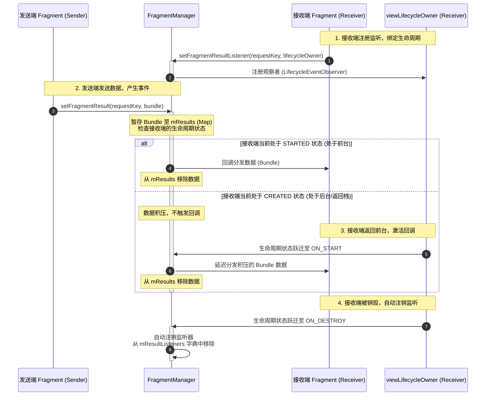

# 5.1.3.2 Fragment通信

在 Android 应用开发中，随着单 Activity 多 Fragment 架构（Single-Activity Architecture）的广泛普及，Fragment 已成为构建动态、灵活用户界面的核心组件。然而，由于 Fragment 拥有独立于宿主 Activity 却又与其交织的复杂生命周期，如何在多个 Fragment 之间、或者 Fragment 与宿主 Activity 之间进行安全、高效且解耦的数据交互与状态同步，成为了衡量应用架构质量的重要指标。

在实际开发中，不合理的通信设计极易引发各种线上故障。例如：在屏幕旋转（配置变更）或系统低内存杀进程重建时，由于直接持有引用而引发空指针异常（`NullPointerException`）；或者因长生命周期对象持有已销毁 Fragment 的实例引用，导致内存泄漏（`Memory Leak`）。

本文将深入探讨 Android Fragment 通信的各种主流机制与最佳实践，从底层的设计哲学到具体的源码实现进行全方位解析，并针对常见的不安全反模式进行深度剖析，帮助开发者在实际项目中做出最合理的架构选型。

---

## 一、 传统接口（Interface）回调机制

在 Jetpack 组件尚未诞生之前，接口回调是 Android 官方推荐的 Fragment 与宿主 Activity 进行通信的标准范式。

### 1. 实现模式与生命周期绑定

接口回调的核心思想是**“面向接口编程”**：由 Fragment 定义一套行为契约（接口），而宿主 Activity 实现该接口。Fragment 内部在特定生命周期阶段获取并强转宿主 Activity 实例，从而在需要通信时安全地调用接口方法。

为了规避内存泄漏风险，该接口的持有期必须与 Fragment 的生命周期严格绑定。经典的生命周期绑定设计如下：
- **绑定（`onAttach`）**：当 Fragment 与 Activity 关联时，系统会回调 `onAttach(Context)` 方法。此时，Fragment 可以安全地将传入的 `Context`（即宿主 Activity）强制类型转换为自定义的接口。如果宿主未实现该接口，则立即抛出类型转换异常（`ClassCastException`），以便在编译期或开发阶段快速定位问题。
- **解绑（`onDetach`）**：当 Fragment 与 Activity 解除关联时，系统会回调 `onDetach()` 方法。此时，必须将接口引用置为 `null`，以便 JVM 的垃圾回收器（GC）能够正常回收宿主 Activity 的实例，防止发生内存泄漏。

### 2. 核心代码范式

以下是传统的 Interface 回调通信的 Kotlin 语言实现范式：

```kotlin
// 1. 定义通信接口
interface OnDataSelectedListener {
    fun onDataSelected(data: String)
}

class SenderFragment : Fragment() {
    // 2. 声明接口成员变量，初始为 null
    private var callbackListener: OnDataSelectedListener? = null

    // 3. 在 onAttach 中安全绑定
    override fun onAttach(context: Context) {
        super.onAttach(context)
        if (context is OnDataSelectedListener) {
            callbackListener = context
        } else {
            throw ClassCastException("$context 必须实现 OnDataSelectedListener 接口")
        }
    }

    // 4. 在需要通信时触发回调
    fun performAction() {
        val message = "来自 Fragment 的数据"
        callbackListener?.onDataSelected(message)
    }

    // 5. 在 onDetach 中解除引用，杜绝内存泄漏
    override fun onDetach() {
        super.onDetach()
        callbackListener = null
    }
}
```

```kotlin
// 6. 宿主 Activity 实现该接口
class MainActivity : AppCompatActivity(), OnDataSelectedListener {

    override fun onCreate(savedInstanceState: Bundle?) {
        super.onCreate(savedInstanceState)
        setContentView(R.layout.activity_main)
        // 动态加载 SenderFragment...
    }

    // 7. 处理来自 Fragment 的回调数据
    override fun onDataSelected(data: String) {
        // 更新 Activity 本身，或者将数据转交分发给其他 Fragment
        Log.d("MainActivity", "收到 Fragment 传递的数据: $data")
    }
}
```

### 3. 传统接口回调的局限性与“层层传递灾难”

尽管接口回调机制类型安全、易于理解，但在构建中大型、复杂的 Fragment 嵌套布局时，其局限性开始暴露无遗：
1. **多级嵌套传递繁琐（ChildFragment 传递灾难）**：如果应用采用了嵌套 Fragment 的架构（例如 `MainActivity` -> `ParentFragment` -> `ChildFragment`），而 `ChildFragment` 的数据需要回传给 `MainActivity` 甚至是同级其他的嵌套 Fragment。由于 `onAttach(Context)` 传入的 `Context` 永远是 Activity 实例，如果想传给 `ParentFragment`，就必须使用 `parentFragment` 链条进行强转；如果想要传给 `MainActivity`，则 `ParentFragment` 必须作为“传话筒”重新实现一套接口，层层转交。这种做法会导致中间层级的 Fragment 存在大量的代理代码，破坏了代码的可读性与简洁性。
2. **强耦合限制了 Fragment 的复用性**：在 `onAttach` 中强制转换 Context 的逻辑，使得该 Fragment 与实现该特定接口的宿主 Activity 产生了强耦合。如果另外一个 Activity 也需要复用该 Fragment，但它的交互逻辑有所不同，这个 Activity 就必须被迫实现相同的接口，否则就会在运行时抛出 `ClassCastException` 崩溃。这违背了组件高复用、低耦合的设计原则。

---

## 二、 基于共享 ViewModel 的机制（现代化黄金范式）

随着 Android Jetpack 组件库的日益成熟，`ViewModel` 凭借其生命周期感知、对配置变更（如屏幕旋转）的天然免疫以及结构解耦的优势，成为了现代化 Fragment 通信的黄金首选。

### 1. 底层工作原理：以宿主为纽带的单例共享

在使用 `ViewModel` 机制进行 Fragment 通信时，其核心 API 是委托属性 `by activityViewModels()`，而非普通的 `by viewModels()`。

```kotlin
// 普通的 ViewModel 获取方式（作用域局限在 Fragment 自身）
private val fragmentViewModel: MyViewModel by viewModels()

// 共享的 ViewModel 获取方式（作用域为宿主 Activity）
private val sharedViewModel: MyViewModel by activityViewModels()
```

#### （1）ViewModelStoreOwner 的生命周期纽带
在 Jetpack 架构中，每一个实现了 `ViewModelStoreOwner` 接口的类（如 `FragmentActivity` 和 `Fragment`）都拥有一个独立的 `ViewModelStore`。`ViewModelStore` 内部实际上是通过一个 `HashMap<String, ViewModel>` 来缓存并持有所有的 `ViewModel` 实例的。

当我们在 Fragment 中调用 `by activityViewModels()` 时，委托属性在底层实际上是通过 `requireActivity()` 获取宿主 Activity 实例作为 `ViewModelStoreOwner`，进而获取其底层的 `ViewModelStore`。由于同一宿主 Activity 下的多个 Fragment 获取的都是同一个 Activity 的 `ViewModelStore`，因此在调用相同类型的 `ViewModel` 类名时，`ViewModelProvider` 始终会从 Activity 的缓存 Map 中返回同一个 `ViewModel` 实例。

#### （2）局部范围共享（Nested Fragment 局部共享）
在某些复杂的嵌套界面设计中（如 ViewPager 内包含多个子 Fragment），如果我们不希望这些子 Fragment 产生的数据污染到整个宿主 Activity，可以利用父 Fragment 的作用域实现局部共享。

```kotlin
// 子 Fragment 中通过 requireParentFragment() 获取父 Fragment 作为 ViewModelStoreOwner
private val localSharedViewModel: LocalViewModel by viewModels({ requireParentFragment() })
```
这种设计极大地提高了组件的内聚性，确保子 Fragment 的通信逻辑被封装在父 Fragment 的树状结构内部，外部组件无法窥探或干扰。

### 2. 代码范式：结合 Kotlin 协程 Flow 的状态与事件分发

为了实现更好的响应式编程，我们通常在共享的 `ViewModel` 中提供两种类型的数据通道：
- **状态共享（State）**：使用 `StateFlow` 或 `LiveData`，它具有“粘性”特征，能够持有当前最新的状态值，适合用于 UI 渲染。
- **单次事件通信（Event）**：使用不带初始值且不保留旧数据的 `SharedFlow`，适合用于展示 Toast、弹窗提示或导航跳转等单次消费的行为。

```kotlin
// 1. 共享的 ViewModel，用于管理数据与事件
class SharedDataViewModel : ViewModel() {

    // 状态通道：持有当前的过滤文本，具有粘性
    private val _filterText = MutableStateFlow<String>("")
    val filterText: StateFlow<String> = _filterText.asStateFlow()

    // 事件通道：只分发一次的单次事件流（如跳转通知）
    private val _navigationEvent = MutableSharedFlow<String>()
    val navigationEvent: SharedFlow<String> = _navigationEvent.asSharedFlow()

    // 提供给发送端调用的方法
    fun updateFilter(query: String) {
        _filterText.value = query
    }

    fun triggerNavigation(destination: String) {
        viewModelScope.launch {
            _navigationEvent.emit(destination)
        }
    }
}
```

```kotlin
// 2. 发送端 Fragment
class FilterInputFragment : Fragment(R.layout.fragment_filter_input) {

    // 获取 Activity 级别共享的 ViewModel
    private val sharedViewModel: SharedDataViewModel by activityViewModels()

    override fun onViewCreated(view: View, savedInstanceState: Bundle?) {
        super.onViewCreated(view, savedInstanceState)
        
        // 当用户输入时，更新共享状态
        view.findViewById<EditText>(R.id.et_search).doAfterTextChanged { text ->
            sharedViewModel.updateFilter(text?.toString() ?: "")
        }

        // 点击按钮触发单次导航事件
        view.findViewById<Button>(R.id.btn_navigate).setOnClickListener {
            sharedViewModel.triggerNavigation("DetailDestination")
        }
    }
}
```

```kotlin
// 3. 接收端 Fragment
class FilterResultFragment : Fragment(R.layout.fragment_filter_result) {

    // 获取相同的 Activity 级别共享 of ViewModel 实例
    private val sharedViewModel: SharedDataViewModel by activityViewModels()

    override fun onViewCreated(view: View, savedInstanceState: Bundle?) {
        super.onViewCreated(view, savedInstanceState)

        // 安全地收集共享状态（仅在界面处于 STARTED 状态及以上时收集）
        viewLifecycleOwner.lifecycleScope.launch {
            viewLifecycleOwner.repeatOnLifecycle(Lifecycle.State.STARTED) {
                // 监听搜索词变化并刷新列表
                launch {
                    sharedViewModel.filterText.collect { query ->
                        updateUiWithFilter(query)
                    }
                }

                // 监听单次跳转事件
                launch {
                    sharedViewModel.navigationEvent.collect { destination ->
                        navigateToTarget(destination)
                    }
                }
            }
        }
    }

    private fun updateUiWithFilter(query: String) {
        // 具体更新 UI 逻辑...
    }

    private fun navigateToTarget(destination: String) {
        // 执行导航逻辑...
    }
}
```

### 3. 配置重建下的可靠表现

基于共享 ViewModel 的机制之所以被称为“现代化黄金范式”，其主要原因之一是它能够无缝应对 Activity 的重建。

当用户旋转屏幕，宿主 Activity 会被销毁并重建。在销毁阶段，系统会把 Activity 的 `ViewModelStore` 保存在 Activity 的非配置实例（`NonConfigurationInstances`）中。当新的 Activity 实例重建并创建完毕后，它会自动检索并接管之前的 `ViewModelStore`。

因此，即使参与通信的 Fragment 被彻底销毁并重新初始化，它们通过 `by activityViewModels()` 获取到的依然是宿主 Activity 之前保留下来的同一个 ViewModel 实例，其中的 `StateFlow` 或 `LiveData` 数据在重建后能够立刻分发最新的值，完美地实现了数据的保存与恢复。

---

## 三、 现代化官方推荐：Fragment Result API

虽然 ViewModel 机制对于复杂的、持续性的数据同步与状态共享非常完美，但在很多开发场景中，我们只需要在两个 Fragment 之间完成一次“单次的数据回传”。例如：点击“选择城市”Fragment，选中后返回前一个 Fragment 并回传“城市名称”。

针对这种典型的单次事件/数据回传，官方在 Fragment 1.3.0（关于版本兼容性的详细记录请参考：[AndroidVersionChangeLog.md](../../../../../AndroidVersionChangeLog.md)）中正式推出了 **Fragment Result API**，同时废弃了不安全的 `targetFragment` 相关方法。

### 1. 运行机制与核心设计

Fragment Result API 的底层设计哲学是**“绝对解耦”**。发送端 Fragment 与接收端 Fragment 无需知道彼此的存在，不需要持有对方的实例引用，甚至不需要依赖宿主 Activity 作为逻辑跳转的中间枢纽。

它们进行数据交互的唯一媒介是彼此共同的 `FragmentManager`：
- **同级 Fragment 之间通信**：通过相同的 `parentFragmentManager` 进行数据传递与监听。
- **父子 Fragment 之间通信**：通过 `childFragmentManager` 进行传递。

其底层的核心类是 `FragmentManager` 内部维护的两个数据存储结构：
- `mResults`：一个 `Map<String, Bundle>` 类型的缓存字典，用于在内存中暂存发送端发送的数据，其 Key 便是双约定的 `requestKey`。
- `mResultListeners`：一个 `Map<String, LifecycleAwareResultListener>` 类型的字典，用于保存接收端注册的数据监听器。

### 2. 源码级生命周期绑定与自动注销机制

Fragment Result API 最精妙的设计在于它与宿主 Lifecycle 进行了深度的生命周期绑定，通过在底层对 `LifecycleOwner` 的订阅，实现了完全自动化的资源管理，从而避免了内存泄漏。

#### （1）LifecycleAwareResultListener 的职责
当我们在接收端调用 `parentFragmentManager.setFragmentResultListener(requestKey, lifecycleOwner) { key, bundle -> ... }` 时，FragmentManager 并没有直接把我们的 Lambda 回调保存起来，而是将其封装在了一个内部类 `LifecycleAwareResultListener` 实例中。

该类实现了 `LifecycleEventObserver` 接口，并把自己注册到传入的 `LifecycleOwner`（通常是 Fragment 的 `viewLifecycleOwner`）的生命周期观察者队列中。

#### （2）事件分发的“积压”与“延迟投递”机制
当发送端 Fragment调用 `setFragmentResult(requestKey, bundle)` 时，FragmentManager 会在内部执行以下流程：
1. **暂存数据**：将数据放入 `mResults` 字典中缓存。
2. **状态判定**：检查 `mResultListeners` 中是否存在对应 `requestKey` 的 `LifecycleAwareResultListener`。
3. **安全分发**：
   - 如果接收端当前生命周期处于 `STARTED` 状态或以上（即可见状态），FragmentManager 立即分发该数据，并同时从 `mResults` 字典中移除该 Bundle，保证数据“阅后即焚”或只消费一次。
   - 如果接收端当前处于后台（处于 `BackStack` 中，生命周期仅为 `CREATED` 状态），为了避免在界面不可见时更新 UI 导致异常崩溃，FragmentManager **不会**立刻执行回调。它会任由数据积压在 `mResults` 缓存中。当接收端 Fragment 重新返回前台、其生命周期跃迁至 `STARTED` 时，`LifecycleEventObserver` 会感知到状态变化，触发 FragmentManager 将缓存的数据立刻投递分发。

#### （3）自动注销规避泄露
当接收端 Fragment 被彻底销毁时，它的 `Lifecycle` 会接收到 `ON_DESTROY` 事件。`LifecycleAwareResultListener` 监测到该事件后，会自动向 `FragmentManager` 申请将自己从 `mResultListeners` 字典中移除。这一机制确保了即使接收端 Fragment 销毁后，发送端再发送任何数据，都不会因为垃圾回收器无法释放监听器而产生内存泄漏。

### 3. 时序图解密

下图直观地展示了 Fragment Result API 底层依靠 `FragmentManager` 作为中介进行数据暂存、延迟投递以及生命周期注销的交互时序：



### 4. 核心代码范式

以下是 Fragment Result API 的 Kotlin 语言使用范式。

```kotlin
// 1. 接收端 Fragment
class ConsumerFragment : Fragment(R.layout.fragment_consumer) {

    override fun onCreate(savedInstanceState: Bundle?) {
        super.onCreate(savedInstanceState)
        
        // 建议在 onCreate 阶段就注册监听，以确保重建后能在生命周期跃迁至 STARTED 时及时接收数据
        parentFragmentManager.setFragmentResultListener("request_key", this) { requestKey, bundle ->
            // 从 Bundle 中提取回传数据
            val resultMessage = bundle.getString("extra_result_data")
            Log.d("ConsumerFragment", "收到回传数据: $resultMessage")
        }
    }
}
```

```kotlin
// 2. 发送端 Fragment
class ProducerFragment : Fragment(R.layout.fragment_producer) {

    fun sendResultAndBack() {
        val resultBundle = bundleOf("extra_result_data" to "数据回传成功")
        
        // 向 parentFragmentManager 写入结果数据
        parentFragmentManager.setFragmentResult("request_key", resultBundle)
        
        // 结束当前 Fragment 并返回
        parentFragmentManager.popBackStack()
    }
}
```

---

## 四、 不安全设计与反模式解析

在日常开发中，有些不安全的通信方式虽然能暂时跑通，但一旦遭遇系统重建或高并发场景，便会引爆一系列运行时崩溃和内存问题。以下是重点需要规避的三大反模式：

### 1. 反模式一：直接通过 findFragmentByTag 获取实例并调用其 Public 方法

#### （1）典型代码展示
```kotlin
// 错误示范：在 Activity 或 sibling Fragment 中直接寻址并调用方法
val target = parentFragmentManager.findFragmentByTag("TargetFragment") as? TargetFragment
target?.updateList(newData)
```

#### （2）致命漏洞剖析
这种方案在测试环境且不发生旋转屏幕时通常表现正常，但它带来了严重的隐患：
- **强耦合性**：调用方必须显式知晓 `TargetFragment` 的具体类型，一旦后期对 TargetFragment 进行重命名或重构，所有调用它的组件均需同步修改，不符合高内聚低耦合原则。
- **实例状态不一致与 NPE**：在系统重建发生时，所有 Fragment 的实例都会被系统重新恢复并实例化。如果在 Fragment 重建尚未彻底完成，或者该 Fragment 恰好被系统移出栈时进行了此方法调用，`findFragmentByTag` 将返回 `null`。如果开发者使用了强转（`as TargetFragment`）或强硬的非空断言（`!!`），应用就会瞬间发生 NullPointerException 崩溃。

### 2. 反模式二：在带参数的构造函数中传入数据或回调接口

#### （1）典型代码展示
```kotlin
// 错误示范：定义带参数的构造函数
class DetailFragment(
    private val userId: String, 
    private val callback: OnDataCallback
) : Fragment() {
    // ...
}
```

#### （2）崩溃机理分析
这是 Android 初学者最常犯的错误之一。在 JVM 层面上，这种构造函数完全合法，但在 Android 运行框架中却是一枚随时引爆的炸弹：
- **系统重建与无参构造反射**：当系统因配置变更（如屏幕旋转）或被系统低内存杀进程重建时，Activity 会重新调用其底层的 `FragmentFactory` 重建所有的 Fragment。
- **反射机制与崩溃**：系统的默认逻辑是**通过反射机制调用 Fragment 的无参构造函数（No-argument Constructor）**来重新恢复其实例。
- **两种糟糕的后果**：
  1. 如果该 Fragment **只定义了带参构造函数**而没有定义无参构造函数，系统在利用反射寻找无参构造函数失败后，会直接抛出 `Fragment.InstantiationException` 运行时崩溃，导致应用直接闪退。
  2. 如果开发者保留了无参构造函数，系统虽然不会崩溃，但系统重建时会默认调用无参构造函数，这导致通过带参构造函数传入的 `userId` 以及 `callback` 回调完全没有机会被赋值，它们将全部为 `null`，进而在后续的代码执行中引发空指针崩溃。

#### （3）正确实践
1. **数据传递**：务必使用 `Arguments`（`Bundle`）传参。通过 `setArguments(bundle)` 传入的数据会被系统的 `onSaveInstanceState` 序列化持久化。即使 Fragment 重建，系统依然能自动读取 `arguments` 并恢复所有数据。
2. **回调机制**：全面采用 Jetpack ViewModel 共享状态，或者通过 Fragment Result API 回传数据，杜绝传递 Callback 强引用接口。

### 3. 反模式三：成员变量直接持有 sibling 实例导致的强引用泄漏

#### （1）典型代码展示
```kotlin
// 错误示范：Fragment 内部直接声明并持有另一个 Fragment 的物理实例引用
class MainFragment : Fragment() {
    private lateinit var detailFragment: DetailFragment // 强行持有同级 Fragment 实例

    fun changeDetail(fragment: DetailFragment) {
        this.detailFragment = fragment
    }
}
```

#### （2）内存泄漏分析
由于 Fragment 本身是一个承载复杂 UI 和 View 树的大对象，当 `DetailFragment` 被移出栈（例如执行了 `replace` 操作并放入了返回栈，或者被彻底销毁）时，JVM 垃圾回收器（GC）本应回收其占用的内存。

但由于 `MainFragment` 的成员变量中仍然牢牢持有着 `DetailFragment` 的物理实例引用，这形成了一条从 `MainFragment -> DetailFragment -> View树 -> Context` 的强引用链条。这导致 DetailFragment 无法被 GC 回收，其占用的内存空间被永久性侵占，多次操作后便会引发系统性的内存溢出（`OutOfMemoryError`）。

---

## 五、 核心通信方案对比与最佳实践选型指南

为了帮助开发者在开发过程中更直观地选择通信机制，下表从解耦度、生命周期安全性、数据复杂度以及重构友好度等多维度对上述三种方案进行了横向对比：

| 维度 / 机制 | 传统的接口（Interface）回调 | 基于共享的 ViewModel 机制 | 官方 Fragment Result API |
| :--- | :--- | :--- | :--- |
| **解耦程度** | 较差，需要宿主签名实现特定接口，耦合性强 | 极佳，组件之间通过第三方媒介（ViewModel）进行数据间接流动，互不干扰 | 极佳，组件之间没有任何物理依赖，完全解耦 |
| **生命周期安全性** | 较差，必须手动在 `onDetach` 释放引用，否则有内存泄漏隐患 | 极佳，生命周期由 `ViewModelStore` 自主托管，且天然支持配置变更重建 | 极佳，底层绑定 Lifecycle，在 `ON_DESTROY` 自动解绑注销，无泄露隐患 |
| **数据承载复杂度** | 支持任意类型（直接调用方法传参） | 极佳，支持响应式数据流（Flow / LiveData），适合复杂对象与状态的频繁同步 | 较弱，仅支持传递 `Bundle`，适合轻量级、简单的序列化数据交互 |
| **时序与状态积压** | 不支持状态积压，若接收端处于后台，直接调用可能导致 UI 异常崩溃 | 支持状态积压（如 StateFlow 始终持有最新状态，返回前台重新激活） | 极佳，处于后台时数据暂存在 FragmentManager 缓存中，回到前台（STARTED）自动延迟投递 |
| **典型应用场景** | 浅层级（一二级）且不涉及配置重建的简单父子组件局部强类型通信 | 同一 Activity 宿主下的多个 Fragment 频繁进行复杂数据流共享、大状态集同步 | 页面返回时的数据单次回传（如城市选择、商品参数筛选回传、确认弹窗选择等） |

### 选型决策树

为了在开发时快速决策，建议遵循以下选型逻辑：

```
                           开始寻找 Fragment 通信方案
                                      │
                                      ▼
                        是否涉及跨 Activity 的页面通信？
                                ├───► 是：使用 Activity 间的 Result API 或全局 Service
                                └───► 否
                                      │
                                      ▼
                      是否需要多个 Fragment 之间共享复杂的数据状态？
                      （例如：复杂的表单填写、购物车的实时价格与数量同步）
                                ├───► 是：使用 Jetpack 共享 ViewModel (by activityViewModels())
                                └───► 否
                                      │
                                      ▼
                           是否属于单次的数据回传？
                      （例如：在子页面/弹窗选完数据后，返回上一页并更新）
                                ├───► 是：使用 Fragment Result API
                                └───► 否：视层级决定。若是简单的浅层父子通信，可使用 Interface 回调，
                                         但需严防生命周期泄漏。
```

通过合理运用现代化的 Jetpack ViewModel 和官方推荐的 Fragment Result API，可以帮助我们构建出低耦合、强健、且生命周期安全的现代化 Android 应用程序，彻底解决传统 Fragment 通信带来的各种历史隐患。
