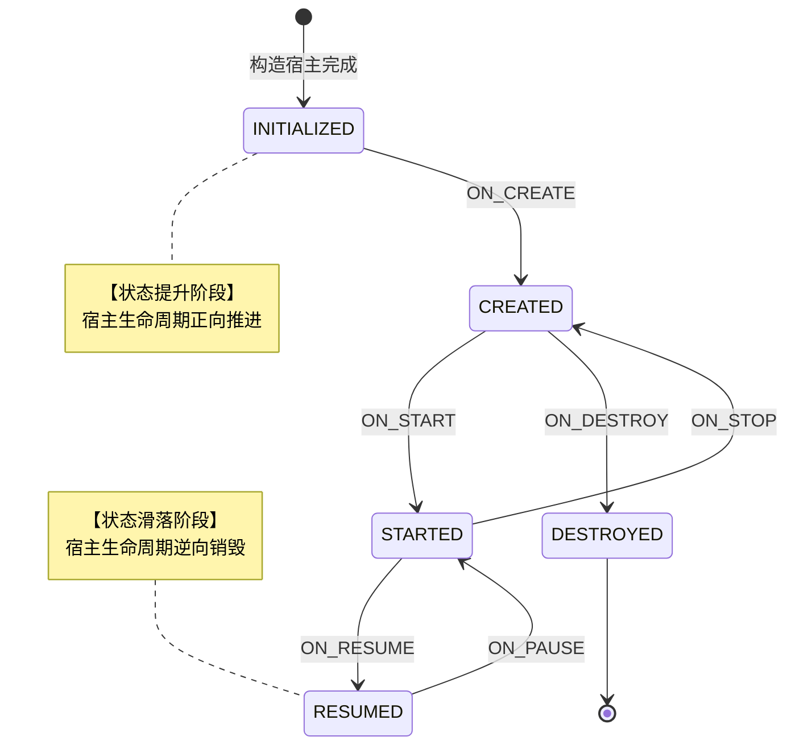
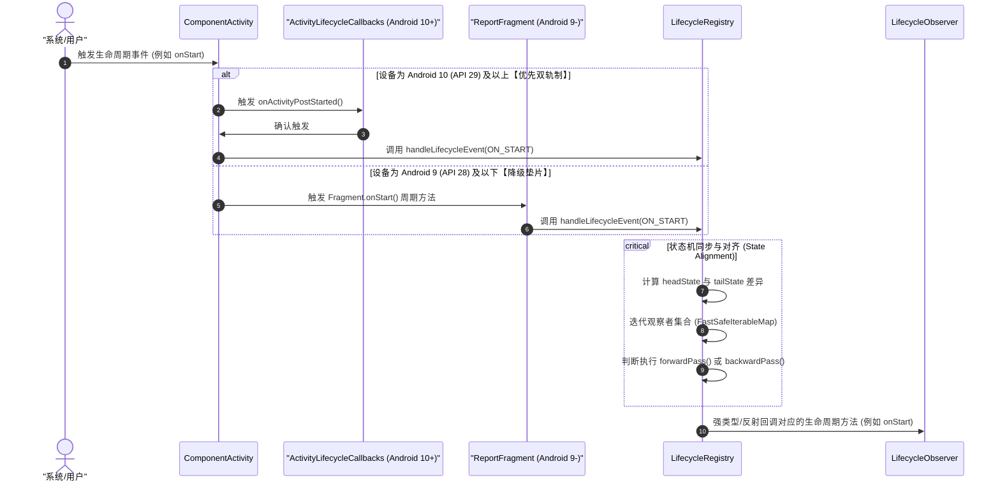

# 5.1.3.3 Lifecycle

## 1. 导言

在 Android 应用开发中，生命周期管理一直是一个极为关键且棘手的课题。Activity 和 Fragment 等组件具有由系统强力管控的生命周期，这要求任何与界面或页面上下文相关的业务逻辑（如音视频播放、传感器监听、网络定位、异步加载等）都必须与这些组件的生命周期变化严格保持同步。

传统的命令式生命周期回调模式要求开发者在 Activity/Fragment 的各种生命周期方法中手动编写初始化与销毁代码。这不仅会导致宿主页面组件的代码体积极度膨胀，更会导致核心业务逻辑零散分布在各个生命周期回调中，埋下了难以排查的时序 Bug 与内存泄漏隐患。

为了彻底解决这一痛点，Google 在 Android Jetpack 中引入了 **Lifecycle** 架构组件。它通过定义一套声明式、非侵入性的生命周期感知机制，实现了生命周期管理逻辑与宿主页面的彻底解耦，让任何普通类都能具备自主感知生命周期的能力。本文将从设计初衷、核心三驾马车、单向状态机模型、底层的 `ReportFragment` 注入分发源、以及其设计模式的演进路径等维度，深度剖析 Jetpack Lifecycle 的核心原理与实现机制。

---

## 2. 设计初衷与时序陷阱

要深刻理解 Lifecycle 的核心价值，必须了解它所解决的传统 Android 生命周期管理的两个核心缺陷：**生命周期代码膨胀与耦合**，以及**异步回调下的时序崩溃陷阱**。

### 2.1 传统模式的弊端与耦合

在没有 Lifecycle 之前，如果我们需要在 Activity 中引入一个定位组件（`MyLocationListener`）和一个播放器组件（`MyVideoPlayer`），我们必须在 Activity 的生命周期方法中显式进行控制。以下是一个典型的传统写法：

```kotlin
class MyActivity : AppCompatActivity() {
    private lateinit var locationListener: MyLocationListener
    private lateinit var videoPlayer: MyVideoPlayer

    override fun onCreate(savedInstanceState: Bundle?) {
        super.onCreate(savedInstanceState)
        setContentView(R.layout.activity_my)
        
        locationListener = MyLocationListener(this) { location ->
            // 处理位置更新并渲染 UI
        }
        videoPlayer = MyVideoPlayer(this)
    }

    override fun onStart() {
        super.onStart()
        locationListener.start() // 开启定位
    }

    override fun onResume() {
        super.onResume()
        videoPlayer.resume() // 恢复播放
    }

    override fun onPause() {
        super.onPause()
        videoPlayer.pause() // 暂停播放
    }

    override fun onStop() {
        super.onStop()
        locationListener.stop() // 停止定位
    }

    override fun onDestroy() {
        super.onDestroy()
        // 彻底释放资源
    }
}
```

在这种模式下，`MyActivity` 充当了协调者的角色，被迫直接感知并调用外部组件 of 初始化与注销方法。当页面承载的业务逻辑逐渐增多，例如加入推送 SDK、蓝牙扫描、数据同步、打点统计等组件时，Activity 的生命周期方法中将充斥着大量的协调性模板代码。这种高耦合的设计不仅违背了面向对象设计的“单一职责原则”（Single Responsibility Principle），还使得这些外部业务组件极其难以被独立测试和复用。

### 2.2 异步回调下的时序陷阱与崩溃

除了代码膨胀，传统生命周期管理更致命的缺陷在于**异步操作的时序不确定性**所引发的运行时崩溃（通常表现为 `NullPointerException` 或 `IllegalStateException`）。

假设定位组件 `MyLocationListener` 在调用 `start()` 启动定位时，内部需要执行异步的 Binder 调用或者网络连接请求。这个过程需要一定的耗时。如果在此期间用户点击了返回键，导致 Activity 执行了 `onStop()` 甚至是 `onDestroy()`。此时，异步的定位服务才成功连接并返回结果。当定位回调代码块尝试执行诸如：

```kotlin
// 定位成功后的异步回调
fun onLocationChanged(location: Location) {
    if (activity != null) {
        // 尝试更新 Activity 中的 TextView 节点，或者显示 Dialog 弹窗
        updateUi(location)
    }
}
```

由于 Activity 已经处于销毁状态，此时任何对 Activity View 树的修改操作都会引发崩溃，或者因为强引用了已被销毁的 Activity 而造成严重的内存泄漏。即使在回调中进行了非空判断，由于异步回调的时序是高度随机的，开发者必须在每个回调里小心翼翼地检查 Activity 的状态（如 `isDestroyed` 或 `isFinishing`）。这极大地增加了代码的维护成本和出错概率。

### 2.3 Lifecycle 的应对之道

Jetpack Lifecycle 通过将生命周期的状态（State）变化抽象为统一的、单向流转的状态机，完美地规避了这一时序陷阱：

1. **生命周期自治**：外部组件通过实现 `LifecycleObserver` 接口，将生命周期的监听逻辑内敛到组件内部。Activity 仅需将其 Lifecycle 对象暴露出去，组件会自主订阅并响应生命周期变化。
2. **状态可查询性（State Querying）**：Lifecycle 在任何时刻都保存着当前的生命周期状态（`State`）。当异步回调返回时，观察者无需盲目调用，而是可以通过 `lifecycle.currentState.isAtLeast(Lifecycle.State.STARTED)` 来判断当前宿主是否至少处于“已启动”的安全活跃状态。如果状态低于该阀值，则直接舍弃此次回调更新，从而优雅且彻底地规避了因异步时序导致的 Crash 隐患。

---

## 3. 核心“三驾马车”：设计模式与实现职责

Jetpack Lifecycle 能够无缝协调宿主与观察者，得益于其架构中设计极其精妙的三大核心类/接口。这三者构成了一个经典的**观察者模式**（Observer Pattern）变体，被开发者形象地称为 Lifecycle 的“三驾马车”：`LifecycleOwner`、`LifecycleObserver` 和 `LifecycleRegistry`。

```
                    +--------------------+
                    |   LifecycleOwner   |
                    +---------+----------+
                              | 返回
                              v
                    +--------------------+
                    |     Lifecycle      |
                    +---------+----------+
                              ^
                              | 继承并实现具体管理
                              |
                    +---------+----------+
                    |  LifecycleRegistry | <---+ 管理/对齐状态
                    +----+----------+----+
                         |          |
                   注册  |          | 分发事件
                         |          v
            +------------+----+  +--+-----------------+
            |LifecycleObserver|  |LifecycleObserver B |
            +-----------------+  +--------------------+
```

### 3.1 LifecycleOwner（生命周期持有者）

`LifecycleOwner` 是生命周期的“生产者”契约，其源码定义极其精简：

```java
public interface LifecycleOwner {
    @NonNull
    Lifecycle getLifecycle();
}
```

* **设计职责**：它是一个单一接口契约，用于表示该实现类具有生命周期。它唯一的职责就是向外输出一个关联的 `Lifecycle` 实例。
* **设计意图**：通过此接口将具体的生命周期宿主（如 `Fragment`、`ComponentActivity` 等）抽象化。任何外部组件在接收参数时，只需声明依赖 `LifecycleOwner` 接口，而无需关心自己到底是被放在了一个 `Activity`、`Fragment` 还是自定义的 Window 宿主中。这种高层次的接口隔离保证了极佳的扩展性。

### 3.2 LifecycleObserver（生命周期观察者）

`LifecycleObserver` 是生命周期的“消费者”契约。在底层设计中，它起初是一个空标记接口：

```java
public interface LifecycleObserver {}
```

* **设计职责**：作为一个类型标识，用于向 `LifecycleRegistry` 表明该实现类是一个生命周期的观察者。
* **体系演进**：随着版本演进，为了支持不同的分发模式，它演进出了多个子类接口：
  1. `LifecycleEventObserver`：核心分发接口，其定义了 `onStateChanged(LifecycleOwner, Lifecycle.Event)` 方法，当生命周期发生任何变化时，都会通过此方法接收最直接的通知。
  2. `DefaultLifecycleObserver`：现代化黄金规范，面向开发者友好。它提供了 `onCreate`、`onStart`、`onResume` 等默认空实现方法，开发者只需按需覆写特定生命周期方法。

### 3.3 LifecycleRegistry（生命周期注册与状态管理中枢）

`LifecycleRegistry` 是核心协调者与控制中枢，它继承自 `Lifecycle` 抽象类，是整个 Lifecycle 框架中逻辑最复杂的类。

* **设计职责**：
  1. **注册与移除**：提供 `addObserver()` 和 `removeObserver()` 接口，用于动态管理生命周期的观察者集合。
  2. **事件驱动流转**：对外提供 `handleLifecycleEvent(Lifecycle.Event)` 方法。当宿主（如 Activity）经历生命周期变化时，底层分发源会向 `LifecycleRegistry` 投递对应的 `Event`。
  3. **状态同步与对齐（State Alignment）**：负责将当前所有的观察者的内部状态，逐步对齐到宿主的最新状态，并在此过程中驱动事件的分发。

#### 3.3.1 核心数据结构：`FastSafeIterableMap`

在 `LifecycleRegistry` 的内部实现中，观察者的存储并不是使用普通的 `HashMap` 或 `ArrayList`，而是使用了一个定制的专用数据结构——`FastSafeIterableMap`。

* **为什么不使用普通集合？**
  生命周期观察者集合的维护存在一个极其苛刻的场景：**在遍历过程中修改集合**。
  例如，观察者 A 在接收到 `ON_START` 事件后，可能会在回调内部调用 `lifecycle.removeObserver(A)` 注销自己，或者在某些动态配置下调用 `lifecycle.addObserver(B)` 注册一个新的观察者。如果使用普通的容器进行迭代，这种行为会直接触发 `ConcurrentModificationException`。
* **实现方案**：
  `FastSafeIterableMap` 继承自 `SafeIterableMap`，其内部基于**双向链表**配合 **HashMap** 实现。
  1. `SafeIterableMap` 保证了在遍历过程中，若有节点被删除，迭代器的指针会自适应地指向前驱或后继节点，不会因为链表断裂或指针失效而引发崩溃，完美支持了遍历时的安全移除。
  2. `FastSafeIterableMap` 在 `SafeIterableMap` 的双向链表之上，引入了一个 `HashMap` 用于缓存 Key 与节点的映射关系，从而将 `contains()` 和 `get()` 操作的查找复杂度降低到 `O(1)`，兼顾了安全遍历与随机存取的性能。

---

## 4. 状态（State）与事件（Event）的单向状态机流转设计

Lifecycle 架构之所以能够完美梳理复杂的生命周期逻辑，是因为它在底层建立了一套极其严密、单向流转的**状态机模型**。

### 4.1 状态（State）与事件（Event）的定义

* **State（状态）**：表示生命周期的当前所处阶段。它是状态机的**节点**。
* **Event（事件）**：表示生命周期发生转变的信号，对应 Android 系统回调。它是状态机的**边**（即状态转换的触发器）。

Lifecycle 定义了 5 种状态（State）与 7 种事件（Event）：

| 状态 (State) | 说明 |
| :--- | :--- |
| `DESTROYED` | 已销毁。在此状态下，Lifecycle 不再接受任何观察者（如果是终态，会直接释放所有观察者）。 |
| `INITIALIZED` | 初始状态。宿主已被构建，但尚未执行 `onCreate`。 |
| `CREATED` | 已创建。对应 `ON_CREATE` 已执行，或 `ON_STOP` 已执行。 |
| `STARTED` | 已启动。对应 `ON_START` 已执行，或 `ON_PAUSE` 已执行。此时观察者被认为是“活跃”的。 |
| `RESUMED` | 已恢复。对应 `ON_RESUME` 已执行，处于前台交互状态。 |

| 事件 (Event) | 触发时机 |
| :--- | :--- |
| `ON_CREATE` | 宿主被创建时触发。 |
| `ON_START` | 宿主被启动时触发。 |
| `ON_RESUME` | 宿主获取焦点、进入前台时触发。 |
| `ON_PAUSE` | 宿主失去焦点、即将退到后台时触发。 |
| `ON_STOP` | 宿主不可见、已退到后台时触发。 |
| `ON_DESTROY` | 宿主被销毁时触发。 |
| `ON_ANY` | 匹配任何生命周期事件，主要用于通用的底层分发。 |

### 4.2 单向状态机流转模型

以下是 Lifecycle 状态与事件流转的单向状态机模型图。状态的流转分为**状态提升（Upward）**与**状态滑落（Downward）**两个方向：



#### 4.2.1 状态与事件的映射换算

在 `LifecycleRegistry` 的底层，每一步状态的升级与降级都有严格的数学公式和静态映射换算：

```java
// 状态提升时的事件获取（获取从当前状态提升至目标下一状态时，需要派发的事件）
static Event upEvent(State state) {
    switch (state) {
        case INITIALIZED:
        case DESTROYED:
            return ON_CREATE;
        case CREATED:
            return ON_START;
        case STARTED:
            return ON_RESUME;
        case RESUMED:
            throw new IllegalArgumentException();
    }
}

// 状态滑落时的事件获取（获取从当前状态降级至目标下一状态时，需要派发的事件）
private static Event downEvent(State state) {
    switch (state) {
        case INITIALIZED:
            throw new IllegalArgumentException();
        case CREATED:
            return ON_DESTROY;
        case STARTED:
            return ON_STOP;
        case RESUMED:
            return ON_PAUSE;
        case DESTROYED:
            throw new IllegalArgumentException();
    }
}
```

### 4.3 状态对齐机制与追赶算法

当宿主生命周期发生改变时，`LifecycleRegistry` 需要保证**队列中所有观察者都会同步到宿主的当前状态**。这并不是简单的批量循环通知，而是需要通过精密的“对齐算法”来实现。

#### 4.3.1 观察者的状态包裹（ObserverWithState）

当一个观察者被注册到 `LifecycleRegistry` 时，它会被包装成一个 `ObserverWithState` 对象。该类内部不仅持有观察者实例，还会记录它当前“已同步达到的状态”：

```java
static class ObserverWithState {
    State mState;
    LifecycleEventObserver mLifecycleObserver;

    ObserverWithState(LifecycleObserver observer, State initialState) {
        mLifecycleObserver = Lifecycling.lifecycleEventObserver(observer);
        mState = initialState;
    }

    void dispatch(LifecycleOwner owner, Event event) {
        State targetState = getStateAfter(event);
        mState = min(mState, targetState); // 对齐状态
        mLifecycleObserver.onStateChanged(owner, event);
        mState = targetState;
    }
}
```

#### 4.3.2 状态追赶（State Catch-up）

如果宿主（Activity）当前已经处于 `RESUMED` 状态，此时突然新实例化并注册了一个 `Observer`（例如在页面打开后，某个业务弹窗才开始创建并订阅生命周期）。
由于新注册的观察者初始状态默认是 `INITIALIZED`，为了保证其业务逻辑能够正确初始化，`LifecycleRegistry` 必须执行 **“状态追赶”**：
1. 观察者状态从 `INITIALIZED` 跃迁至 `CREATED`，分发并回调 `ON_CREATE`。
2. 状态继续跃迁至 `STARTED`，分发并回调 `ON_START`。
3. 状态最终跃迁至 `RESUMED`，分发并回调 `ON_RESUME`。

这一机制确保了即使是中途加入的组件，也不会遗漏前置的关键生命周期事件。

#### 4.3.3 双向对齐算法（`sync()`）

在 `LifecycleRegistry` 的核心逻辑中，`sync()` 方法每次在状态改变时都会被调用。它的工作原理是：
1. 比较队列头部（最老注册的观察者）的状态 `headState` 与队列尾部（最新注册的观察者）的状态 `tailState`。
2. 比较这两者与宿主当前状态 `mState` 的差异：
   * 如果最老观察者的状态比宿主当前状态还要新，说明宿主状态刚刚发生了**滑落（降级）**，例如从 `RESUMED` 突变到了 `STARTED`。此时调用 `backwardPass()`，按照逆序遍历观察者链表，依次分发降级事件（如 `ON_PAUSE`），将它们的状态往下拉。
   * 如果最新观察者的状态落后于宿主当前状态，说明宿主状态刚刚发生了**提升（升级）**，例如执行了 `onStart`。此时调用 `forwardPass()`，按照顺序遍历链表，依次分发升级事件（如 `ON_START`），将它们的状态网上推。
3. 这一过程会一直循环，直到队列中所有观察者的状态全部对齐（即 `headState == tailState == mState`）为止。

---

## 5. 核心分发源：ReportFragment 底层剖析

很多开发者会好奇：为什么我们不需要在自定义的基类 Activity 中写任何诸如 `lifecycle.onStart()` 的分发代码，Lifecycle 就能自动感知到 Activity 的所有生命周期？

答案隐藏在 `androidx.activity.ComponentActivity` 的底层实现中。Lifecycle 框架通过往 Activity 中隐式注入一个无界面的 `ReportFragment`，利用 Fragment 自身的生命周期回调充当了事件分发的“引线”。

### 5.1 ReportFragment 的静默注入

当 `ComponentActivity` 被创建时，其 `onCreate` 方法内部会执行以下操作：

```java
protected void onCreate(@Nullable Bundle savedInstanceState) {
    // ... 
    super.onCreate(savedInstanceState);
    ReportFragment.injectIfNeededIn(this); // 静默注入
}
```

in `ReportFragment` 内部：

```java
public static void injectIfNeededIn(Activity activity) {
    if (Build.VERSION.SDK_INT >= 29) {
        // 在 Android 10+ (API 29+) 采用动态注册双轨制
        LifecycleCallbacks.registerIn(activity);
    }
    // 同时注入 ReportFragment，作为向下兼容的垫片
    android.app.FragmentManager manager = activity.getFragmentManager();
    if (manager.findFragmentByTag(REPORT_FRAGMENT_TAG) == null) {
        manager.beginTransaction().add(new ReportFragment(), REPORT_FRAGMENT_TAG).commit();
        manager.executePendingTransactions(); // 立即执行
    }
}
```

* **为什么使用 `android.app.Fragment`？**
  因为 `android.app.Fragment` 是底层 Android 框架自带的 Fragment，不需要引入 `androidx.fragment.app.Fragment` 支持包。这使得 Lifecycle 可以作为基础组件，即使在纯原生没有引入 AndroidX Fragment 库的项目中也能够正常运行。
* **零侵入原理**：
  `ReportFragment` 是一个没有 UI 的 Fragment（未调用 `setContentView`）。由于系统会将 Fragment 的生命周期与宿主 Activity 进行强绑定，当 Activity 的生命周期发生变化时，操作系统底层会自动回调 `ReportFragment` 对应的 `onStart`、`onResume`、`onPause` 等生命周期方法。

### 5.2 Android 10+ (API 29+) 的双轨分发优化

在 Android 发展到 [Android 10 (API 29)](../../../../AndroidVersionChangeLog.md#android-10api-29) 之后，系统级别引入了对单个 Activity 进行局部生命周期监听的能力——`ActivityLifecycleCallbacks`（在此之前，此 API 仅能在 Application 级别全局监听所有 Activity）。

为了利用这一新特性提升分发性能，`ReportFragment` 在 API 29+ 级别的设备上启用了“双轨检测”机制：

1. **第一条轨（高版本原生回调）**：
   在 API 29+ 的设备上，`ReportFragment.LifecycleCallbacks` 静态内部类会动态注册到当前的 Activity 上：
   ```java
   static class LifecycleCallbacks implements Application.ActivityLifecycleCallbacks {
       static void registerIn(Activity activity) {
           activity.registerActivityLifecycleCallbacks(new LifecycleCallbacks());
       }
       // 捕获 Activity 的生命周期事件
       @Override
       public void onActivityPostCreated(@NonNull Activity activity, @Nullable Bundle savedInstanceState) {
           dispatch(activity, Lifecycle.Event.ON_CREATE);
       }
       @Override
       public void onActivityPostStarted(@NonNull Activity activity) {
           dispatch(activity, Lifecycle.Event.ON_START);
       }
       // ... 捕获所有 Post-X 状态
   }
   ```
   它通过重写 `onActivityPostCreated`、`onActivityPostStarted` 等回调方法，可以直接捕获 Activity 生命周期各个阶段执行完毕后的时机，并调用 `dispatch(activity, event)` 进行事件分发。

2. **第二条轨（低版本降级垫片）**：
   在低于 API 29 的老旧系统上，`LifecycleCallbacks.registerIn(activity)` 不会执行。此时，系统完全依赖 `ReportFragment` 自身的各种生命周期方法（如 `onStart()`、`onResume()`）来触发分发。

在 API 29+ 设备的执行逻辑中，为了避免重复回调，`ReportFragment` 内部会有一套标志位拦截机制。当第一条轨通过 `ActivityLifecycleCallbacks` 已经触发了 `ON_START` 等分发后，第二条轨在 Fragment 回调中检测到状态已同步，就不会再重复进行分发，保证了逻辑的严密。

无论是走哪一条轨道，它们最后都挂钩到相同接口，都会调用 `dispatch(Activity, Lifecycle.Event)` 方法：

```java
static void dispatch(@NonNull Activity activity, @NonNull Lifecycle.Event event) {
    if (activity instanceof LifecycleRegistryOwner) {
        ((LifecycleRegistryOwner) activity).getLifecycle().handleLifecycleEvent(event);
        return;
    }

    if (activity instanceof LifecycleOwner) {
        Lifecycle lifecycle = ((LifecycleOwner) activity).getLifecycle();
        if (lifecycle instanceof LifecycleRegistry) {
            ((LifecycleRegistry) lifecycle).handleLifecycleEvent(event);
        }
    }
}
```

通过这一层巧妙的抽象，在底层将系统回调转发给 `LifecycleRegistry`，从而彻底启动了整个观察者队列的状态同步与通知流程。

### 5.3 核心分发时序图

下面是 `ReportFragment` 在应用进程中与 Activity 之间进行生命周期事件同步的完整时序图：



---

## 6. 反射向编译期/接口演进

随着 Android 开发规范的逐步提升，Lifecycle 框架的分发机制也经历了一场由“动态反射”向“静态契约”过渡的重大架构演进。这一过程反映了 Android 团队对于包体积、构建速度以及运行时性能的持续追求。

### 6.1 第一阶段：运行时反射（`@OnLifecycleEvent`）

在 Lifecycle 最早期版本中，开发者的用法通常是直接继承一个空接口 `LifecycleObserver`，并通过给方法添加 `@OnLifecycleEvent` 注解来声明其需要响应的生命周期事件：

```kotlin
// 废弃写法：不推荐使用
class MyLocationObserver : LifecycleObserver {
    @OnLifecycleEvent(Lifecycle.Event.ON_START)
    fun startLocation() {
        // 定位初始化
    }

    @OnLifecycleEvent(Lifecycle.Event.ON_STOP)
    fun stopLocation() {
        // 释放定位
    }
}
```

* **底层实现原理**：
  当调用 `lifecycle.addObserver(MyLocationObserver())` 时，`Lifecycle` 内部的 `Lifecycling` 工具类会通过 Java 的 **反射机制**（Reflective Method invocation）去遍历该类所有的声明方法，筛选出带有 `@OnLifecycleEvent` 注解的方法。接着根据注解中声明的 Event 构建一张静态映射表，在事件到来时再次通过反射调用该方法。
* **致命弊端**：
  1. **反射带来的性能开销**：在应用启动、核心 Activity 页面切换等高频生命周期事件发生时，集中的类方法扫描反射解析会导致明显的 CPU 瞬时损耗，甚至造成页面卡顿（Jank）。
  2. **混淆异常隐患**：混淆工具（如 ProGuard / R8）在没有配置繁琐的 `-keep` 规则时，会随意修改方法名或去除未被显式调用的注解，这会导致运行时反射失效，抛出方法未找到的异常或静默失效。

### 6.2 第二阶段：编译期代码生成（APT）

为了消除运行时反射解析的弊端，Google 引入了注解处理器 `lifecycle-compiler` 依赖。

* **底层实现原理**：
  在应用编译构建期间，`lifecycle-compiler` 扫描代码中所有的 `@OnLifecycleEvent` 注解，并在后台自动生成辅助类（被称为 `GeneratedAdapter`），例如 `MyLocationObserver_LifecycleAdapter`。
  当运行时调用 `lifecycle.addObserver()` 时，框架会尝试通过特定的命名规则去 ClassLoader 中寻找对应的 `_LifecycleAdapter`。如果寻找到，则将其包装成直接调用的强类型适配器类。当事件触发时，底层不需走反射反射，而是直接通过：
  ```java
  public class MyLocationObserver_LifecycleAdapter implements GeneratedAdapter {
      final MyLocationObserver mReceiver;
      // ...
      @Override
      public void callMethods(LifecycleOwner owner, Event event, boolean acceptNextEv, MethodCallsLogger logger) {
          if (event == Event.ON_START) {
              mReceiver.startLocation(); // 直接调用，零反射
          }
      }
  }
  ```
* **新的弊端**：
  虽然解决了运行时的反射性能问题，但这种方式引入了极大的**编译成本**。每一个使用了注解的观察者类都会在编译期生成一个新的 Java 类，这大大拉长了项目的整体增量编译时间，增加了包体积，并且在复杂的组件化多模块依赖中极易因为类隔离发生构建冲突。

### 6.3 第三阶段：现代化强接口规范（`DefaultLifecycleObserver`）

为了彻底解决以上所有弊端，在 Java 8 语言特性成为 Android 标配后，Google 彻底推翻了注解反射的设计，推出了 `DefaultLifecycleObserver`：

```java
public interface DefaultLifecycleObserver extends FullLifecycleObserver {
    @Override
    default void onCreate(@NonNull LifecycleOwner owner) {}

    @Override
    default void onStart(@NonNull LifecycleOwner owner) {}

    @Override
    default void onResume(@NonNull LifecycleOwner owner) {}

    @Override
    default void onPause(@NonNull LifecycleOwner owner) {}

    @Override
    default void onStop(@NonNull LifecycleOwner owner) {}

    @Override
    default void onDestroy(@NonNull LifecycleOwner owner) {}
}
```

* **核心优势**：
  1. **零反射、零编译生成**：由于使用了 Java 8 的接口默认方法（`default`），开发者只需像普通类一样实现该接口，并覆写自己需要的方法即可。在编译期没有任何多余的生成文件生成，在运行时也是直接的接口强引用方法调用，运行效率达到了纯 Java 调用的极致。
  2. **更好的安全边界（防止内存泄漏）**：在覆写的方法中，接口自动把当前的生命周期持有者 `LifecycleOwner` 对象作为参数进行回调（如 `onStart(owner: LifecycleOwner)`）。这使得外部观察者可以直接通过参数获得当前上下文，或者在方法内直接执行宿主的操作，避免了在外部类中强行持有 Activity 实例所导致的隐式内存泄漏风险。
  3. **注解废弃**：从 Lifecycle 2.4.0 开始，旧的 `@OnLifecycleEvent` 注解已经被正式打上了 `@Deprecated` 废弃标记。目前实现 `DefaultLifecycleObserver` 已成为 Android 社区的黄金适配准则。

---

## 7. 常见误区与最佳实践

在深刻理解了 Lifecycle 的原理后，我们在日常工程实践中还需要避免以下两类经典误区。

### 7.1 误区一：未校验生命周期状态直接执行异步 UI 操作

虽然 Lifecycle 提供了生命周期感知能力，但如果我们在自定义的 Lifecycle 观察者中发起了非挂钩式的协程或网络请求，在异步回调返回时依然直接修改 Activity 的 View 属性，这依然会导致 Crash。

* **正误对比**：
  ```kotlin
  // 错误写法：如果接口请求慢，返回时 Activity 可能已经 onDestroy 销毁
  class FakeObserver : DefaultLifecycleObserver {
      override fun onStart(owner: LifecycleOwner) {
          HttpClient.requestData { result ->
              // 直接刷新宿主页面 UI，无任何边界判断
              activity.updateUi(result) 
          }
      }
  }
  ```

  ```kotlin
  // 正确写法：在回调执行前，校验当前的生命周期是否依旧处于活跃状态
  class FakeObserver : DefaultLifecycleObserver {
      override fun onStart(owner: LifecycleOwner) {
          HttpClient.requestData { result ->
              // 校验当前宿主是否至少处于 STARTED 状态（未 stop，更未 destroy）
              if (owner.lifecycle.currentState.isAtLeast(Lifecycle.State.STARTED)) {
                  activity.updateUi(result)
              }
          }
      }
  }
  ```

### 7.2 误区二：认为 onDestroy 中无需 removeObserver

不少开发者认为，既然 Lifecycle 已经高度智能化，那么在宿主销毁时，宿主会自动清理掉注册在其上面的所有观察者，因此就不需要手动调用 `removeObserver()`。

* **原理辨析**：
  `LifecycleRegistry` 在接收到 `ON_DESTROY` 事件，将状态流转到 `DESTROYED` 之后，确实会自动在内部清理并释放其 `mObservers` 集合，防止观察者因被 LifecycleRegistry 强引用而产生内存泄漏。
  但是，**如果观察者本身的生命周期比宿主要长**，例如观察者是一个单例（`Singleton`）组件或被一个静态全局类所持有，如果它中途被绑定到了一个 Activity 的 Lifecycle 上，若不显式调用 `removeObserver`，该 Activity 即使销毁了，在观察者内部生命周期结束前，可能会有残留的引用甚至逻辑干扰。因此，遵循**对称性原则**（在 `onResume` 中 `add` 的在 `onPause` 中 `remove`，在 `onCreate` 中 `add` 的在 `onDestroy` 中 `remove`）始终是最佳的安全开发防线。

### 7.3 现代 Kotlin 开发最佳实践：协程支持

在当前的现代化 Android 架构中，配合 Kotlin 协程和 Lifecycle 提供的扩展库，推荐使用 `lifecycleScope` 以及 `repeatOnLifecycle` 来进行生命周期的安全消费。

```kotlin
class MyFragment : Fragment() {
    override fun onViewCreated(view: View, savedInstanceState: Bundle?) {
        super.onViewCreated(view, savedInstanceState)

        // 使用 lifecycleScope 启动协程
        viewLifecycleOwner.lifecycleScope.launch {
            // repeatOnLifecycle 会在 viewLifecycleOwner 的生命周期至少是 STARTED 时执行并挂起
            // 当状态从 STARTED 回落到 STOPPED 时，协程会自动被 Cancel
            // 当再次回到 STARTED 时，协程会重新启动，完美避开了任何异步时序 Bug
            viewLifecycleOwner.repeatOnLifecycle(Lifecycle.State.STARTED) {
                viewModel.uiState.collect { state ->
                    // 安全渲染 UI
                    renderUi(state)
                }
            }
        }
    }
}
```

使用 `repeatOnLifecycle` 的底层逻辑依然是依赖 Lifecycle 状态机所进行的状态判定。它把挂起函数与生命周期状态的变换深度缝合，是当前 Jetpack 生态中最被推崇的数据感知消费模式。

---

## 8. 总结

Jetpack Lifecycle 机制是现代 Android 架构的底座与灵魂。它通过：
1. **接口契约设计**（`LifecycleOwner`、`LifecycleObserver`、`LifecycleRegistry`）极大地降低了外部业务逻辑与页面宿主之间的耦合。
2. 通过**单向状态机流转与双向对齐同步算法**（`sync` 追赶机制），彻底攻克了异步多线程环境下的生命周期时序错乱问题。
3. 运用 **`ReportFragment` 零侵入注入与 API 29+ 动态 Activity 周期注册双轨分发**，达成了底层无缝感知的工业级体验。
4. 随着 **`DefaultLifecycleObserver` 强类型契约** 的主导，Lifecycle 告别了早期低效的运行时反射与繁琐的编译期 APT 生成。

掌握 Lifecycle 的底层工作机制，能够帮助 Android 开发者在构建组件化、模块化的复杂系统工程时，写出更加健壮、无泄漏且性能卓越的高质量代码。
