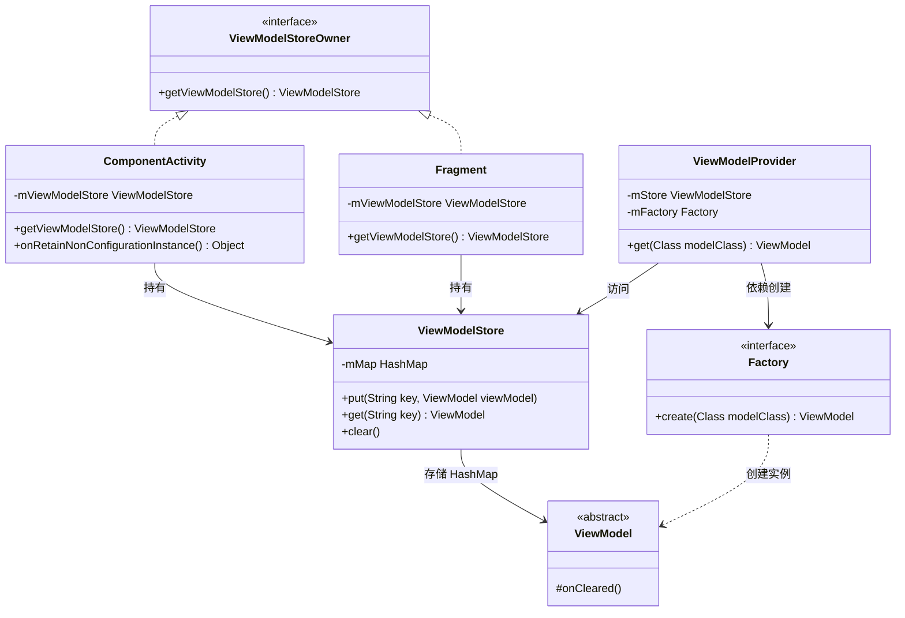
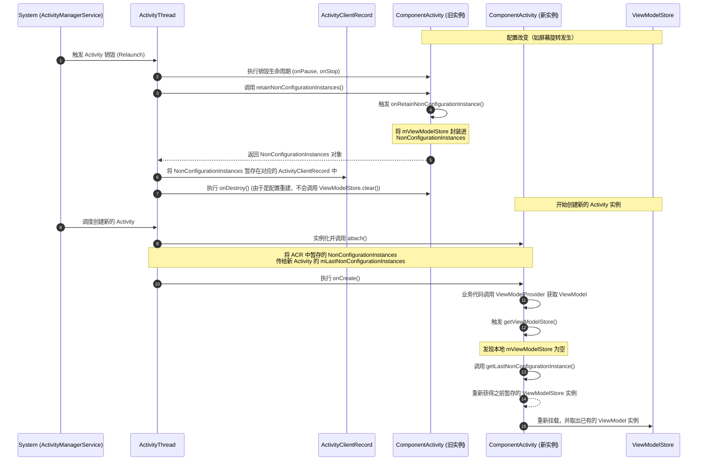

# 5.1.3.4 ViewModel

ViewModel 是 Android Jetpack 架构组件中最为核心的成员之一，其主要设计目的是为了实现界面数据与控制器（Activity/Fragment）逻辑的分离，保障界面在遭遇配置重建（如屏幕旋转、系统语言切换等）时数据不丢失，并彻底解决传统 Controller 层的生命周期缺陷。

在现代 Android 架构设计中，ViewModel 承担着“界面状态持有者”（UI State Holder）的角色。本篇将从架构设计、底层移交机制、状态恢复机制以及生命周期规约等维度，对 ViewModel 展开系统性的深度剖析。

---

## 1. 诞生背景与核心价值

在早期 Android 系统的设计中（从 Android 1.0 开始，参见 [Android Version Change Log](file:///Users/lizhiyang/Desktop/AndroidKnowledge/AndroidVersionChangeLog.md#android-10api-1)），Activity 的生命周期与系统行为是强绑定的。系统为了让应用重新匹配当前配置的最佳资源（例如从竖屏 layout-port 切换到横屏 layout-land），必须将当前的 Activity 实例完全销毁并重新创建。这种“配置重建”（Configuration Changes）机制虽然极大地简化了多配置资源匹配的复杂度，却带来了严重的副作用：**Activity 内存状态的瞬时丢失**。

为了应对这一问题，传统的 Android 方案主要依赖于 Activity 提供的生命周期回调：
* `onSaveInstanceState(Bundle outState)`
* `onRestoreInstanceState(Bundle savedInstanceState)`

然而，这种基于系统级暂存 Bundle 的保存机制存在着三个致命的系统痛点：
1. **数据规模受限（TransactionTooLargeException）**：`onSaveInstanceState` 的底层数据传递依赖于系统的 Binder 进程间通信（IPC）机制。Binder 缓冲区在系统级别具有大约 1MB 的物理共享限制（此限制为整个进程中所有正在进行的 Binder 事务总和，非单一 Activity 专属）。一旦试图保存大型 List、较长的数据集或 Bitmap 图像，就会直接引发 `TransactionTooLargeException` 崩溃。
2. **主线程性能损耗**：Bundle 要求所有保存的数据必须是可序列化的（实现了 `Serializable` 或 `Parcelable` 接口）。数据在写入和读出时会产生大量的 CPU 序列化与反序列化开销，直接阻塞主线程，导致界面发生明显的卡顿。
3. **职责边界模糊**：Activity 应当只负责 UI 的渲染与交互事件的搬运。如果在其中混合大量的业务数据 and 生命周期判断，会导致 Activity 迅速退化为不可维护的“上帝类”（God Class）。

ViewModel 的推出完美解决了上述设计痛点。从设计哲学上来看，它完全避开了配置重建的影响：它不依赖于 Parcelable 序列化，而是直接在内存中将数据对象保留下来，并且其生命周期完全覆盖了多次 Activity 配置重建的周期，直至 Activity 被用户主动关闭（或被进程强杀），从而彻底实现了解耦与高效的数据留存。

### 状态留存方案对比

为了更直观地理解不同保留机制的边界，下表对 `onSaveInstanceState`、`SavedStateHandle` 和 `ViewModel` 进行了多维度对比：

| 维度 | onSaveInstanceState | SavedStateHandle | ViewModel |
| :--- | :--- | :--- | :--- |
| **存储位置** | 系统进程（system_server）内存 | 系统进程（system_server）内存 | 当前应用进程（App Process）内存 |
| **数据限制** | 严格受限（共享约 1MB Binder 缓冲区） | 严格受限（共享约 1MB Binder 缓冲区） | 仅受限于 App 可分配 of JVM 堆内存大小 |
| **生命周期** | 跨配置重建存活；跨进程强杀存活 | 跨配置重建存活；跨进程强杀存活 | 跨配置重建存活；**进程强杀后数据丢失** |
| **反序列化开销** | 存在（且在主线程执行，影响帧率） | 存在（且在主线程执行，影响帧率） | 无任何反序列化开销，直接复用内存对象 |
| **适用数据类型** | 仅支持可序列化/基础数据类型 | 仅支持可序列化/基础数据类型 | 任意 Java/Kotlin 内存对象（含数据流、网络连接等） |
| **典型场景** | 保存页面状态的关键 Key（如 TabId、输入框文本） | 强杀恢复场景下的核心参数（如商品详情的 GoodsId） | 缓存列表数据、网络请求的状态流、复杂业务实体 |

---

## 2. 核心“铁三角”架构

ViewModel 并非孤立工作的，它的底层是由 `ViewModelStoreOwner`、`ViewModelStore` 以及 `ViewModelProvider` 三者共同构建的协作体系。这三者各司其职，遵循了面向对象设计中的“职责单一原则（SRP）”与“依赖倒置原则（DIP）”。

### 2.1 ViewModelStoreOwner（生命周期宿主）
`ViewModelStoreOwner` 是一个极其简单的接口，其源码定义如下：
```java
public interface ViewModelStoreOwner {
    @NonNull
    ViewModelStore getViewModelStore();
}
```
它作为 ViewModel 的“生命周期宿主”，为外部提供了一个访问 `ViewModelStore` 的统一视图。无论是 `ComponentActivity` 还是 `Fragment`，只要实现了此接口，就能被 `ViewModelProvider` 视作合法的宿主。这也使得 ViewModel 的挂载不仅局限于 Activity，还可以轻松挂载到 Fragment 上以实现同一 Activity 下不同 Fragment 之间的轻松通信，或是将多个 Fragment 的生命周期共享挂载到其宿主 Activity 的 ViewModel 上。

### 2.2 ViewModelStore（物理存储容器）
`ViewModelStore` 是 ViewModel 实例在内存中的物理存储容器。其核心实现极其精简，本质上是一个封装了 `HashMap` 的数据结构：
```java
public class ViewModelStore {
    private final HashMap<String, ViewModel> mMap = new HashMap<>();

    final void put(String key, ViewModel viewModel) {
        ViewModel oldViewModel = mMap.put(key, viewModel);
        if (oldViewModel != null) {
            oldViewModel.onCleared();
        }
    }

    final ViewModel get(String key) {
        return mMap.get(key);
    }

    public final void clear() {
        for (ViewModel vm : mMap.values()) {
            vm.clear(); // 内部触发 ViewModel.onCleared()
        }
        mMap.clear();
    }
}
```
当 `ViewModelStore` 遭遇 `clear()` 调用时，它会遍历所有的 ViewModel 并触发其 `onCleared()` 方法。这说明，`ViewModelStore` 的生命周期终点就是所有 ViewModel 的生命周期终点。

### 2.3 ViewModelProvider（控制枢纽与工厂）
`ViewModelProvider` 是开发者直接使用的工具类，用于获取或实例化 ViewModel。在开发中，我们通常采用以下方式获取 ViewModel：
```kotlin
val viewModel = ViewModelProvider(this).get(MyViewModel::class.java)
```
在这个调用背后，`ViewModelProvider` 的运作机制如下：
1. **获取容器**：首先，通过传入的 `ViewModelStoreOwner`（如 Activity 或 Fragment）的 `getViewModelStore()` 方法，从中获取物理存储容器 `ViewModelStore`。
2. **生成 Key**：以传入的 `Class<T>` 的全限定类名拼接上默认的前缀，生成一个唯一的 Key（例如：`androidx.lifecycle.ViewModelProvider.DefaultKey:com.example.MyViewModel`）。
3. **查存命中**：在 `ViewModelStore` 中通过 Key 查找对应的 ViewModel 实例。如果存在且类型匹配，则直接返回该实例。
4. **反射创建**：若容器中没有该实例，则通过内部持有的 `ViewModelProvider.Factory` 去实例化该 ViewModel（如通过反射调用其构造方法），随后将其存入 `ViewModelStore` 中，并返回给调用者。

#### ViewModelProvider.Factory 实例化工作流

默认情况下，`ViewModelProvider` 使用的工厂主要包括以下几种实现：
* **NewInstanceFactory**：最精简的实现，仅支持通过无参构造函数反射实例化 ViewModel。
* **AndroidViewModelFactory**：专门用于实例化 `AndroidViewModel` 的工厂，在反射创建时会自动寻找并传入 `Application` 参数。
* **SavedStateViewModelFactory**：最复杂的工厂实现，专门用于支持 `SavedStateHandle` 的自动注入。在反射创建 ViewModel 时，它不仅会传入 `Application` 参数，还会自动从序列化 Bundle 中还原出对应的 `SavedStateHandle` 并注入到构造函数中。

在真实项目中，为了实现依赖注入（DDI）和合理的架构解耦，我们经常需要实现自定义工厂来传入仓储层（Repository）或业务用例（UseCase）。以下是自定义工厂的具体设计实践：

```kotlin
// ViewModel 接收自定义的 Repository 作为构造参数，实现依赖倒置
class UserViewModel(private val userRepository: UserRepository) : ViewModel() {
    val userInfo = MutableStateFlow<String>("")
    // 业务逻辑...
}

// 自定义 Factory 实现
class UserViewModelFactory(
    private val userRepository: UserRepository
) : ViewModelProvider.Factory {
    
    override fun <T : ViewModel> create(modelClass: Class<T>): T {
        // 使用 isAssignableFrom 确保类型安全性
        if (modelClass.isAssignableFrom(UserViewModel::class.java)) {
            @Suppress("UNCHECKED_CAST")
            return UserViewModel(userRepository) as T
        }
        throw IllegalArgumentException("Unknown ViewModel class: ${modelClass.name}")
    }
}
```

#### ViewModel 核心类关系结构图

以下是 ViewModel 核心组件之间的类关系结构图，展示了它们是如何通过接口与组合模式紧密协作的：



---

## 3. 跨配置重建留存原理

在屏幕旋转等配置改变（Configuration Changes）导致 Activity 实例完全销毁重建的过程中，新生成的 Activity 实例依然能够拿到先前的 `ViewModelStore` 及其内部所有的 ViewModel 实例。这一特性的底层核心逻辑深藏于 Android 系统服务与 `ActivityThread` 级别的非配置实例流转中。

### 3.1 核心机制：NonConfigurationInstance 与 getLastNonConfigurationInstance()
在较早的 API 版本中（例如 Android 3.0 API 11，参见 [Android Version Change Log](file:///Users/lizhiyang/Desktop/AndroidKnowledge/AndroidVersionChangeLog.md#android-3xapi-11-12-13)），系统引入了 `onRetainNonConfigurationInstance()` 机制，允许 Activity 在遭遇销毁重建前，向系统抛出一个任意类型的 Object，供新 Activity 继承。这一历史遗留 API 虽已被官方声明为“弃用”（Deprecated），但在现代 `AndroidX ComponentActivity` 内部，它被声明为 `final` 方法以封装底层的 ViewModelStore 传递：

```java
static final class NonConfigurationInstances {
    Object custom;
    ViewModelStore viewModelStore;
}
```

### 3.2 销毁阶段的物理移交时序与源码级拆解
当系统遭遇配置改变需要销毁重建 Activity 时，整个数据流转的物理过程在应用进程的 `ActivityThread` 中展开：

1. **触发销毁调度**：系统服务进程 `ActivityManagerService`（AMS）检测到物理配置变更，向应用进程的 `ActivityThread` 发送 relaunch 调度指令。
2. **执行销毁流程**：在 `ActivityThread.handleRelaunchActivity` 方法中，系统首先会执行销毁旧 Activity 实例的逻辑。在其调用的 `ActivityThread.handleDestroyActivity` 内部，通过 `performDestroyActivity` 方法触发 Activity 的销毁生命周期。
3. **保留非配置数据**：在 `performDestroyActivity` 中，系统在执行 `onDestroy()` 之前，会先调用 Activity 的 `retainNonConfigurationInstances()` 方法：
   ```java
   // ActivityThread.java 中的核心片段
   ActivityClientRecord r = mActivities.get(token);
   // ...
   r.lastNonConfigurationInstances = r.activity.retainNonConfigurationInstances();
   ```
4. **ComponentActivity 封装**：`ComponentActivity` 在重写的该方法中，新建一个 `NonConfigurationInstances` 静态类实例，将当前的 `mViewModelStore` 引用塞入其中并返回给 ActivityThread 托管：
   ```java
   @Override
   @Nullable
   public final Object onRetainNonConfigurationInstance() {
       Object custom = onRetainCustomNonConfigurationInstance();
       ViewModelStore viewModelStore = mViewModelStore;
       if (viewModelStore == null) {
           // 检查是否在先前缓存 of 旧 Store 中有可用实例
           NonConfigurationInstances nc = (NonConfigurationInstances) getLastNonConfigurationInstance();
           if (nc != null) {
               viewModelStore = nc.viewModelStore;
           }
       }
       if (viewModelStore == null && custom == null) {
           return null;
       }
       NonConfigurationInstances nci = new NonConfigurationInstances();
       nci.custom = custom;
       nci.viewModelStore = viewModelStore;
       return nci;
   }
   ```
5. **宿主实例销毁**：接着，旧 Activity 实例被调用 `onDestroy()` 销毁。由于这是配置重建引发的销毁，其 `isChangingConfigurations()` 状态为 `true`。因此，`ComponentActivity` 内部注册的生命周期监听器不会调用 `mViewModelStore.clear()`，保留了其内部所有的 ViewModel 对象免于释放。

### 3.3 重建阶段的挂载与恢复
1. **实例化新 Activity**：`ActivityThread` 调用 `performLaunchActivity` 开始实例化全新的 Activity。
2. **调用 attach() 注入**：在实例化完成后，`ActivityThread` 立即调用新 Activity 的 `attach()` 方法，将保存在 `ActivityClientRecord` 中的 `lastNonConfigurationInstances` 对象作为参数传入新 Activity：
   ```java
   // Activity.java 的 attach 方法签名
   final void attach(Context context, ActivityThread thread, ...
           Object lastNonConfigurationInstances) {
       // ...
       mLastNonConfigurationInstances = lastNonConfigurationInstances;
   }
   ```
3. **重新取回 Store**：当新 Activity 启动，业务代码再次通过 `ViewModelProvider` 获取 ViewModel 时，触发 `getViewModelStore()`：
   ```java
   @NonNull
   @Override
   public ViewModelStore getViewModelStore() {
       if (mViewModelStore == null) {
           NonConfigurationInstances nc =
               (NonConfigurationInstances) getLastNonConfigurationInstance();
           if (nc != null) {
               // 完美继承旧实例的 ViewModelStore
               mViewModelStore = nc.viewModelStore;
           }
           if (mViewModelStore == null) {
               mViewModelStore = new ViewModelStore();
           }
       }
       return mViewModelStore;
   }
   ```
这样，旧 Activity 中的 `ViewModelStore` 直接物理流转到了新 Activity 中。由于 `ViewModelStore` 内部以 `HashMap` 直接持有 ViewModel 实例的强引用，所以所有的 ViewModel 依然驻留在进程内存中，直接复用。

### 3.4 补充：Fragment 级别的 ViewModelStore 流转机制
与 Activity 类似，`Fragment` 同样实现了 `ViewModelStoreOwner`。那么在配置重建时，Fragment 的 `ViewModelStore` 又是如何流转的？
在 Fragment 架构中，Fragment 的生命周期和状态由宿主 Activity 的 `FragmentManager` 进行统一管理。在配置重建时，`ComponentActivity` 的 `onRetainNonConfigurationInstance` 不仅打包了自身的 `ViewModelStore`，同时还会打包流转 `FragmentManager` 的非配置状态（即 `FragmentManagerViewModel` 实例，它本身也是一个 ViewModel 实例）。
`FragmentManagerViewModel` 内部维护着一个以 Fragment 的唯一 UUID 为 Key、以其对应的 `ViewModelStore` 为 Value 的 Map。当 Fragment 随新 Activity 的重建而被重新创建、挂载时，它在初始化过程中会去 `FragmentManagerViewModel` 中取出属于自己原先的 `ViewModelStore` 重新完成绑定。这也解释了在同一个 Activity 范围内的多个 Fragment，如果使用 `requireActivity()` 作为宿主创建 ViewModel，由于最终指向的都是 Activity 唯一的 `ViewModelStore`，因此可以十分轻量地达成 Fragment 之间的数据同步与流转。

#### 配置重建时 ViewModelStore 移交时序图

以下是配置重建时，系统、`ActivityThread` 以及新旧 Activity 之间物理流转 `ViewModelStore` 的时序图：



---

## 4. SavedStateHandle 的强杀恢复原理

虽然上面的“非配置保留机制”可以完美应对配置重建，但在面对“系统低内存强杀进程”（System-initiated Process Death）时却无能为力。一旦应用退入后台，在极端内存短缺下，整个应用进程会被操作系统无情杀死。此时，`ActivityThread` 在内存中的所有数据（包括 `ActivityClientRecord` 及其中的 `NonConfigurationInstances`）都会彻底消亡。

为了解决这一顽疾，Android Jetpack 引入了 `SavedStateHandle` 机制。

### 4.1 核心解决原理：SavedStateRegistry 桥梁
`SavedStateHandle` 是通过在普通的宿主 `onSaveInstanceState` 序列化机制上，构建了一层响应式的读写桥梁。它的底层绑定了由 ComponentActivity（或 Fragment）提供的 `SavedStateRegistry`。

在 Activity 内部，主要通过 `SavedStateRegistryController` 辅助类来控制 `SavedStateRegistry` 的生命周期，从而完成了对数据的注册、收集与还原：

1. **SavedStateProvider 的注册**：当 ViewModel 通过 `SavedStateViewModelFactory` 实例化时，工厂会创建一个 `SavedStateHandle` 对象，并自动将其作为一个 `SavedStateProvider` 注册进宿主的 `SavedStateRegistry` 中。
2. **数据收集暂存**：当应用即将因退入后台而被销毁或挂起时，系统调用 Activity 的 `onSaveInstanceState(Bundle)`。此时，`SavedStateRegistryController` 会触发 `SavedStateRegistry` 遍历所有注册的 Provider，把 `SavedStateHandle` 内存字典中的键值对拉出来，打包序列化到一个 Bundle 中，随后通过 Binder 进程间通信（IPC）将该 Bundle 传递给系统进程 `system_server` 进行持久化托管。
3. **数据读取恢复**：当进程被强杀后，用户重新拉起应用，系统将之前保存在 `system_server` 中的 Bundle 数据作为参数传递给重建的 Activity。Activity 启动时，调用 `SavedStateRegistryController.performRestore()` 恢复状态。之后在通过 `SavedStateViewModelFactory` 反射创建 ViewModel 时，即可将已恢复的 Bundle 数据还原为 `SavedStateHandle` 并作为构造参数注入给 ViewModel。

### 4.2 SavedStateHandle 内部的响应式类解析
为了做到“读写即时保存”，`SavedStateHandle` 内部实现并非单纯的 Map，而是为响应式流设计了特有的绑定类：
* **SavingStateLiveData**：当开发者调用 `state.getLiveData("key")` 时，内部会返回一个自定义的 LiveData 子类。它在每次被调用 `setValue()` 或 `postValue()` 时，都会先执行常规的 LiveData 分发，然后立即将最新值同步写入 `SavedStateHandle` 内部的 `LinkedHashMap` 中。
* **StateFlow 原生支持**：对于 Kotlin 协程，当调用 `state.getStateFlow("key", defaultValue)` 时，内部会创建一个特定包装的 Flow。在这个 Flow 的值被更新时，也会触发内部拦截器将数据同步写入 Map。

由于有了这一层物理桥梁，应用在退入后台面临强杀时，`SavedStateHandle` 中的所有最新内存修改都已经自动合并进了最终的 `onSaveInstanceState` 的 Bundle 序列中，从而确保了状态不丢失。

---

## 5. 致命避坑与生命周期规约

由于 ViewModel 实例在发生配置重建时会在内存中跨实例留存，其生命周期长度通常显著长于 Activity 和 Fragment。如果开发者在 ViewModel 的编写中存在不良代码，会导致极其隐蔽且严重的内存泄漏。

### 5.1 内存泄漏发生的物理本质与 GC Root 链
JVM 的垃圾回收器（GC）在判断对象是否可回收时，是通过 **GC Roots 可达性分析算法** 来决策的。

当配置重建发生时，旧 Activity 的 `onDestroy()` 已被调用，但如果在内存中依然存在如下强引用关系：
$$\text{GC Root (System Server / Handler)} \rightarrow \text{ActivityThread} \rightarrow \text{ActivityClientRecord} \rightarrow \text{ViewModelStore} \rightarrow \text{ViewModel} \rightarrow \text{旧 Activity 实例}$$

那么垃圾回收器就会判定旧 Activity 对象依旧是“可达的”，从而无法将其从 JVM 堆内存中回收。随着用户的多次旋转屏幕，废弃的 Activity、Fragment 以及大量的 View 树对象会在堆内存中迅速堆积，从而触发 `OutOfMemoryError` 崩溃。

### 5.2 严守防内存泄漏核心规约

#### 规约一：严禁持有界面强引用
在 ViewModel 内部，**严禁以强引用形式持有 View、Context、Activity、Fragment**。
* ❌ **错误做法**：在 ViewModel 内部声明 `private var context: Context`。
* ❌ **错误做法**：在 ViewModel 中声明 `private var textView: TextView`。
* ❌ **错误做法**：在 ViewModel 中以强引用存储包含界面引用的接口回调 Listener。

#### 规约二：正确使用 ApplicationContext 绕开泄漏
若 ViewModel 必须使用 Context（例如读取 Android 资源、访问 SharedPreferences、获取系统服务等），请**必须使用** `AndroidViewModel`。
`AndroidViewModel` 强制接收一个 `Application` 实例作为构造参数。其源码如下：
```java
public class AndroidViewModel extends ViewModel {
    @SuppressLint("StaticFieldLeak")
    private Application mApplication;

    public AndroidViewModel(@NonNull Application application) {
        mApplication = application;
    }

    @NonNull
    public <T extends Application> T getApplication() {
        return (T) mApplication;
    }
}
```
因为 `Application` 的生命周期是与整个应用进程的生命周期相同的，所以在 ViewModel 中持有它永远不会发生生命周期倒挂或内存泄漏。

#### 规约三：优雅地使用 onCleared() 释放长生命周期资源
ViewModel 提供了 `onCleared()` 的生命周期回调，这正是进行善后清理的黄金时机。
当 Activity 彻底销毁、被 finish，或者 Fragment 从 FragmentManager 中被彻底弹出时，宿主的 `ViewModelStore` 会被清空，从而触发 ViewModel 的 `onCleared()`。开发者在此方法中应当进行如下清理规约：
1. **清理非 viewModelScope 的异步任务**：如果使用了自定义的线程池、Handler 或是没有绑定生命周期的异步网络请求（如 RxJava 的 Observable 订阅），必须在 `onCleared()` 中手动调用 `Disposable.dispose()` 或取消异步 Job。
2. **解除长生命周期的单例监听器**：如果在 ViewModel 中注册了系统服务的监听回调（如传感器 `SensorEventListener`、定位 `LocationListener` 或广播接收器 `BroadcastReceiver`），必须在 `onCleared()` 中反注册，否则这些单例系统服务会由于长久持有该 Listener 回调而导致整个 ViewModel 泄漏。
3. **显式关闭流与文件资源**：在 ViewModel 中打开的数据库操作连接（如 Room）、I/O 字节流或 Socket 连接，必须在此阶段执行 `close()` 释放内核文件描述符（FD）。

#### 补充：Kotlin 协程自动清理机制与 Tag
在现代的 Android 开发中，对于协程的清理，我们可以直接使用 Lifecycle 组件包中提供的 `viewModelScope`。它的底层也是基于 `onCleared()` 释放的。

`viewModelScope` 是一个绑定了主线程调度器的协程作用域。当它被首次调用时，系统会将一个名为 `CloseableCoroutineScope` 的关联 Tag 写入 ViewModel 的缓存映射中。该静态作用域实现了 Java 的 `Closeable` 接口：
```kotlin
internal class CloseableCoroutineScope(context: CoroutineContext) : Closeable, CoroutineScope {
    override val coroutineContext: CoroutineContext = context

    override fun close() {
        coroutineContext.cancel()
    }
}
```
在 ViewModel 内部销毁并触发其包级私有的 `clear()` 方法时，它会遍历所有的 Tag，如果发现有实现了 `Closeable` 接口的对象，会自动调用其 `close()` 方法。此时，`CloseableCoroutineScope` 的 `close()` 会被执行，进而调用其协程上下文的 `cancel()`，自动中止其内部正在运行的所有子协程，彻底避免了由于后台协程未取消导致的界面资源泄漏。

### 5.3 LiveData 与 Flow 的生命周期安全收集比较

在架构层面上，即使在 ViewModel 中处理好了强引用隔离，如果在 UI 层（Activity/Fragment）的数据流收集（Data Collection）上使用不当，依然可能带来隐藏的泄漏或后台资源消耗问题。

1. **LiveData 的天然安全设计**：
   LiveData 内部重写了 `observe(LifecycleOwner owner, Observer observer)` 方法。它将观察者包装成 `LifecycleBoundObserver` 绑定在宿主生命周期上。当 Lifecycle 状态变为 `DESTROYED` 时，它会自动调用 `removeObserver` 注销监听，不仅避免了因为遗忘反注册产生的内存泄漏，也保证了当 Activity 处于后台时不会接收不需要的 UI 更新分发。
2. **Flow 收集的安全范式**：
   相比之下，Kotlin 协程中的 Flow 默认不具备生命周期感知能力。如果直接在 UI 层调用 `lifecycleScope.launch { flow.collect { ... } }`，当 Activity/Fragment 退入后台（进入 STOPPED 状态）时，协程收集器仍在默默工作，占用 CPU 资源并持有数据链路。
   
为了防范这一资源占用泄漏，必须在界面收集端采用 `repeatOnLifecycle` 机制：
```kotlin
// UI 层（Activity/Fragment）的安全流收集示例
lifecycleScope.launch {
    // 当 Lifecycle 处于 STARTED 或以上时开始执行收集，退入后台（STOPPED）时自动取消内部协程
    lifecycle.repeatOnLifecycle(Lifecycle.State.STARTED) {
        viewModel.pageState.collect { page ->
            // 安全更新 UI
        }
    }
}
```
这一设计确保了流的收集周期与宿主的活跃生命周期完全吻合，构成了 ViewModel 到界面通信的生命周期安全闭环。
