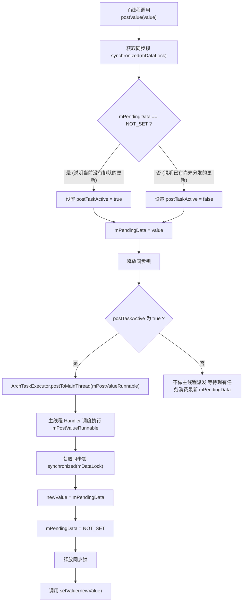
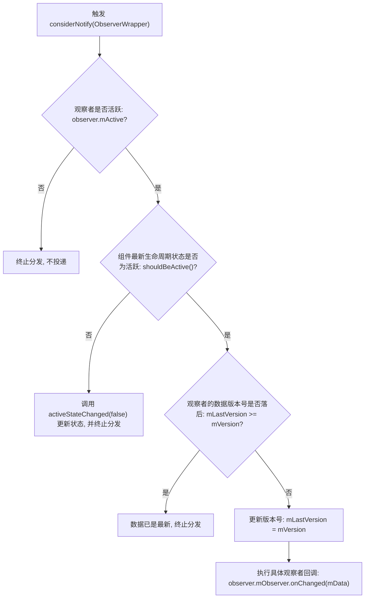

# 5.1.3.5 LiveData

## 1. 导言

在 Android 应用开发的发展历程中，如何安全、高效地在后台数据层与前台 UI 界面之间传输数据，一直是一个极具挑战性的架构课题。Activity、Fragment 以及 Service 等组件具有由 Android 系统强力管控的生命周期，它们的创建、暂停、恢复和销毁等动作对开发者而言在很大程度上是异步且不可控的。传统的命令式回调或者基于普通观察者模式的响应式框架，在面对这样复杂的生命周期时，往往会显露出其致命的缺陷：在组件处于不可见或销毁状态时，异步回调尝试更新 UI 会直接导致应用程序崩溃；而在组件销毁后未及时注销观察者，则会引发严重的内存泄漏。

为了彻底解除数据分发与生命周期管理之间的紧密耦合，Google 在 Android Jetpack 中引入了 **LiveData**。LiveData 是一种可感知生命周期的、可观察的数据持有者类（Observable Data Holder）。与普通的观察者模式不同，LiveData 实现了内部数据与 Activity/Fragment 组件生命周期的全自动解耦。它能确保数据只在其关联的宿主组件处于活跃状态（`STARTED` 或 `RESUMED`）时，才向其推送最新的更新。而当宿主的生命周期状态转为 `DESTROYED` 时，LiveData 能够实现内部感知并自动注销观察者，从而从根本上消除了内存泄漏和因生命周期不匹配导致的界面崩溃风险。

在以 MVVM（Model-View-ViewModel）和 MVI 为代表的现代化 Android 架构体系中，LiveData 往往作为 ViewModel 与视图层（Activity/Fragment）之间的响应式纽带。本文将从底层的核心分发 API 源码出发，深入解析 LiveData 的线程切换、活跃过滤、生命周期对齐机制，彻底拆解“数据倒灌”的成因与架构防范手段，剖析中介者 `MediatorLiveData` 的多源聚合模式，并探讨在当下的 Kotlin 协程时代，现代 Kotlin Flow（如 `StateFlow` 与 `SharedFlow`）是如何在架构层级上对 LiveData 进行全面替代与升级的。关于 LiveData 在各个 Jetpack 版本中的演进历程，开发者可以参考 [AndroidVersionChangeLog.md](../../../../../AndroidVersionChangeLog.md) 了解更多细节。

---

## 2. 核心分发 API 源码探秘

LiveData 的核心职责在于数据的存储与分发。在 `LiveData` 类中，最关键的两个数据变更分发接口是 `setValue(T)` 和 `postValue(T)`。虽然它们最终的目的都是将数据投递给注册的观察者，但它们的调用线程限制、底层实现逻辑以及在多线程环境下的行为特征有着本质的区别。

### 2.1 setValue(T) 的主线程独占机制

`setValue(T)` 是一个必须且只能在 Android 主线程（UI 线程）中调用的方法。如果我们在子线程中尝试直接调用它，程序会立刻抛出 `IllegalStateException` 异常。

#### 2.1.1 setValue 源码剖析

我们来看 LiveData 中 `setValue(T)` 的底层源码实现：

```java
@MainThread
protected void setValue(T value) {
    assertMainThread("setValue");
    mVersion++;
    mData = value;
    dispatchingValue(null);
}
```

这几行精炼的代码包含了 LiveData 核心分发的几个核心要素：
1. **主线程断言**：`assertMainThread("setValue")` 内部通过 `ArchTaskExecutor` 检查当前调用线程是否为 Looper 主线程。这种设计强行保证了数据的更新是在主线程进行的，从而避免了 UI 组件在多线程环境下并发修改导致的竞争问题。
2. **版本号自增**：`mVersion++` 是 LiveData 数据版本控制的关键。每一次 `setValue` 的成功调用都会使这个全局版本号递增。这个机制是后续“状态感知分发”以及“数据倒灌”现象的根源所在。
3. **数据缓存**：`mData = value` 将最新的数据保存在 LiveData 的私有成员变量中。
4. **触发遍历分发**：`dispatchingValue(null)` 传入 `null` 作为参数，意味着这是一次全局性质的广播，需要遍历所有向该 LiveData 注册的观察者。

#### 2.1.2 深入 dispatchingValue 的防重入与多重更新对齐

`dispatchingValue(@Nullable ObserverWrapper initiator)` 方法是 LiveData 分发逻辑的核心枢纽。它的设计不仅要处理常规的数据分发，还需要极其谨慎地应对在分发流程中由于观察者回调再次触发 `setValue` 所引起的“递归重入”问题。

```java
void dispatchingValue(@Nullable ObserverWrapper initiator) {
    if (mDispatchingValue) {
        mDispatchModeNewCycle = true;
        return;
    }
    mDispatchingValue = true;
    do {
        mDispatchModeNewCycle = false;
        if (initiator != null) {
            considerNotify(initiator);
            initiator = null;
        } else {
            for (Iterator<Map.Entry<Observer<? super T>, ObserverWrapper>> iterator =
                    mObservers.iteratorWithAdditions(); iterator.hasNext(); ) {
                considerNotify(iterator.next().getValue());
                if (mDispatchModeNewCycle) {
                    break;
                }
            }
        }
    } while (mDispatchModeNewCycle);
    mDispatchingValue = false;
}
```

为了保障遍历的安全性，LiveData 引入了两个布尔标记位：`mDispatchingValue` 和 `mDispatchModeNewCycle`。
* **mDispatchingValue**：表示当前 LiveData 是否正处于分发数据的状态中。
* **mDispatchModeNewCycle**：表示在当前分发周期未结束时，是否又收到了新的数据更新请求。

当 LiveData 正在对观察者集合进行遍历分发时，如果有某个观察者在其 `onChanged` 回调中同步调用了 `setValue` 再次更新数据，此时代码会重新进入 `dispatchingValue`。由于上一次分发尚未结束，`mDispatchingValue` 为 `true`，此时重入的代码会将 `mDispatchModeNewCycle` 标记为 `true`，然后直接 `return` 退出。

在外层正在执行的 `do-while` 循环中，每次遍历一个观察者后，都会检查 `mDispatchModeNewCycle` 是否被标记为了 `true`。一旦发现该标记为 `true`，循环会立即通过 `break` 中断当前周期的剩余观察者分发。由于 `do-while` 的循环条件是 `mDispatchModeNewCycle`，外层循环会立即重置 `mDispatchModeNewCycle = false` 并开始新一轮的遍历，从而确保所有观察者都能按照数据更新的最新时序接收到最新的值。这种“以循环替代递归”的防重入设计，既保证了数据分发的最新一致性，又完美避免了多层嵌套回调导致的栈溢出（StackOverflowError）。

---

### 2.2 postValue(T) 的多线程安全与“吞值”物理合并机制

在子线程更新 LiveData 数据的场景中，我们必须使用 `postValue(T)`。`postValue` 的设计目标是实现跨线程投递，确保无论从哪个子线程发起调用，最终的数据更新和观察者回调都能安全地切换回 Android 主线程执行。

#### 2.2.1 postValue 源码剖析

我们来深度剖析 `postValue(T)` 的底层源码：

```java
protected void postValue(T value) {
    boolean postTask;
    synchronized (mDataLock) {
        postTask = mPendingData == NOT_SET;
        mPendingData = value;
    }
    if (!postTask) {
        return;
    }
    ArchTaskExecutor.getInstance().postToMainThread(mPostValueRunnable);
}
```

这里通过 `synchronized (mDataLock)` 代码块实现了多线程安全。
* **mPendingData**：一个临时的变量，用来暂存即将发送到主线程的数据。当没有排队更新时，其值默认为常量 `NOT_SET`。
* **postTask**：布尔值，用于决定是否需要向主线程的 Handler 发送一个用于调度的 Runnable。只有在 `mPendingData` 当前等于 `NOT_SET` 时，`postTask` 才会为 `true`。

紧接着是主线程调度任务 `mPostValueRunnable` 的定义：

```java
private final Runnable mPostValueRunnable = new Runnable() {
    @SuppressWarnings("unchecked")
    @Override
    public void run() {
        Object newValue;
        synchronized (mDataLock) {
            newValue = mPendingData;
            mPendingData = NOT_SET;
        }
        setValue((T) newValue);
    }
};
```

当 `mPostValueRunnable` 被主线程 Handler 调度执行时，它首先再次获取 `mDataLock` 同步锁，读取临时的 `mPendingData` 并赋给局部变量 `newValue`，随后立即将 `mPendingData` 重置为 `NOT_SET` 以便接收后续的更新，最后在主线程安全地调用 `setValue((T) newValue)` 来完成实际的观察者分发。

#### 2.2.2 “吞值”物理合并特性分析及其性能考量

在上述源码中，存在一个极其重要且常被开发者忽略的物理特性——**数据合并与吞值**。

假设子线程在极短的时间内（在主线程 Handler 还没来得及调度并执行 `mPostValueRunnable` 之前）连续调用了多次 `postValue`。让我们跟踪其执行路径：
1. **第一次调用 `postValue(Value_A)`**：
   - 获取锁，此时 `mPendingData` 是 `NOT_SET`，所以 `postTask` 设为 `true`。
   - `mPendingData` 赋值为 `Value_A`。
   - 释放锁。
   - 因为 `postTask` 为 `true`，触发 `ArchTaskExecutor.getInstance().postToMainThread(mPostValueRunnable)`。将 Runnable 投递到主线程消息队列。
2. **第二次调用 `postValue(Value_B)`（主线程 Runnable 尚未执行）**：
   - 获取锁，此时 `mPendingData` 已经是 `Value_A`（不等于 `NOT_SET`），所以 `postTask` 设为 `false`。
   - `mPendingData` 覆盖赋值为 `Value_B`。
   - 释放锁。
   - 因为 `postTask` 为 `false`，直接返回，**不再向主线程投递新的 Runnable**。
3. **第三次调用 `postValue(Value_C)`（主线程 Runnable 仍然在排队）**：
   - 同理，`mPendingData` 覆盖赋值为 `Value_C`，`postTask` 为 `false`，直接返回。
4. **主线程开始执行 `mPostValueRunnable`**：
   - 获取锁，读取当前的 `mPendingData`，此时它的值是 `Value_C`。
   - 将 `mPendingData` 重置为 `NOT_SET`。
   - 释放锁。
   - 执行 `setValue(Value_C)`。

在此过程中，`Value_A` 和 `Value_B` 被直接覆盖丢弃了，主线程的观察者只会收到最后一次更新的 `Value_C`。这种物理合并的机制，被称为 LiveData 的**“吞值”特性**。

##### 性能考量与设计哲学

这种“吞值”设计绝对不是 LiveData 的 Bug，而是 Google 工程师基于 Android 平台特性进行的极其深思熟虑的性能考量。

在 Android 系统中，界面渲染的最高频次通常与屏幕刷新率对齐（传统设备为 60Hz，即每 16.6ms 刷新一次；高刷设备为 120Hz 甚至更高）。如果子线程以极高的频率（例如在 5ms 内产生上百条数据）向主线程 post 数据，而 LiveData 机械地将每一个数据都排队在主线程执行 `setValue`，这会导致：
* **消息队列拥堵**：主线程的 MessageQueue 会被大量的更新消息填满，导致其他关键的输入事件（如点击、滑动）以及 VSync 信号无法被及时处理，引起严重的界面卡顿（Jank）。
* **重复绘制浪费**：UI 控件在同一帧渲染时间内，频繁地用中间状态数据进行重绘。但由于人眼的视觉暂留以及屏幕的物理刷新频率限制，这些中间状态在屏幕上根本无法被肉眼捕获，从而造成了极大的 CPU/GPU 计算资源浪费。

LiveData 的设计哲学是**“数据最终一致性”优先于“数据过程完整性”**。它明确将自身定位为**“UI 状态持有者”**而非**“通用流式事件管道”**。对于 UI 渲染而言，最新、最终的状态才是唯一有意义的，中间的过渡状态是可以并且应当被丢弃的。因此，通过临时的 `mPendingData` 覆盖机制，将多次连续的 `postValue` 合并为最后一次的 `setValue`，最大程度地保护了主线程的吞吐量与界面的流畅度。



---

## 3. 活跃状态过滤与生命周期感知

LiveData 能够区别于传统观察者模式的核心竞争力，在于其对观察者生命周期状态的敏锐感知能力。它通过在内部引入一层包装器模式，将普通的观察者（`Observer`）与生命周期组件（`Lifecycle`）有机地结合在了一起。

### 3.1 LifecycleBoundObserver 的包装与职责

当我们在 Activity 或 Fragment 中调用 `liveData.observe(owner, observer)` 时，LiveData 并没有直接把 `observer` 存入集合，而是用一个内部类 `LifecycleBoundObserver` 对其进行了封装。

#### 3.1.1 LifecycleBoundObserver 源码拆解

```java
class LifecycleBoundObserver extends ObserverWrapper implements LifecycleEventObserver {
    @NonNull
    final LifecycleOwner mOwner;

    LifecycleBoundObserver(@NonNull LifecycleOwner owner, Observer<? super T> observer) {
        super(observer);
        mOwner = owner;
    }

    @Override
    boolean shouldBeActive() {
        return mOwner.getLifecycle().getCurrentState().isAtLeast(STARTED);
    }

    @Override
    public void onStateChanged(@NonNull LifecycleOwner source,
            @NonNull Lifecycle.Event event) {
        Lifecycle.State currentState = mOwner.getLifecycle().getCurrentState();
        if (currentState == DESTROYED) {
            removeObserver(mObserver);
            return;
        }
        Lifecycle.State prevState = null;
        while (prevState != currentState) {
            prevState = currentState;
            activeStateChanged(shouldBeActive());
            currentState = mOwner.getLifecycle().getCurrentState();
        }
    }
}
```

`LifecycleBoundObserver` 继承自 `ObserverWrapper`，并且实现了 `LifecycleEventObserver` 接口。这使得它能够直接作为 Lifecycle 的观察者注册到宿主的 LifecycleRegistry 中。它主要承担了三个核心职责：

1. **宿主隔离与生命周期绑定**：持有 `LifecycleOwner`（如 Activity 或 Fragment）的弱引用，充当桥梁角色。
2. **活跃状态判定**：重写了 `shouldBeActive()` 方法。其内部通过 `isAtLeast(STARTED)` 判断当前宿主的生命周期状态。这意味着只有当宿主处于 `STARTED`（已启动，页面可见但未获取焦点）或 `RESUMED`（已恢复，页面可见且处于前台交互）时，该观察者才被定义为**“活跃状态（Active）”**。
3. **生命周期变化的主动响应**：实现 `onStateChanged` 回调。当宿主生命周期发生任何变化时，系统都会调用此方法。

#### 3.1.2 自动防泄漏机制与状态流转

在 `onStateChanged` 中，首先会获取宿主的当前状态。
* **DESTROYED 状态的彻底解绑**：一旦检测到 `currentState == DESTROYED`，这表明 Activity 或 Fragment 正在经历被彻底销毁的阶段。此时，包装器会立即调用 LiveData 的 `removeObserver(mObserver)`。这一步操作会将观察者从 LiveData 内部的 `mObservers` 集合中移除，并且也会解除在 LifecycleRegistry 中注册的监听。由于解除了全部的强引用链，使得不可见的垃圾对象能够顺利被 JVM 回收，从根本上杜绝了因前台页面销毁而后台数据更新导致内存泄漏的隐患。
* **非销毁状态的活跃转换**：如果状态没有被销毁，则会进入一个 `while` 循环，调用 `activeStateChanged(shouldBeActive())`。该方法在父类 `ObserverWrapper` 中定义：

```java
void activeStateChanged(boolean newActive) {
    if (newActive == mActive) {
        return;
    }
    mActive = newActive;
    changeActiveCounter(mActive ? 1 : -1);
    if (mActive) {
        dispatchingValue(this);
    }
}
```

如果观察者的活跃状态发生了切换（例如宿主从后台切回前台，状态从 `CREATED` 提升至 `STARTED`，导致 `newActive` 从 `false` 变为 `true`），则会更新内部的 `mActive` 标记，并调用 `changeActiveCounter()` 改变 LiveData 内部活跃观察者的计数器。最关键的是，当 `mActive` 变为 `true` 时，会立刻触发 `dispatchingValue(this)`，将可能在不可见期间错过的最新数据，主动同步并推送给该观察者。

---

### 3.2 深入 considerNotify 数据投递校验

在分发流程中，不论是通过 `setValue` 触发的全局分发，还是因为生命周期从非活跃转为活跃触发的单点分发，最终都会走到 `considerNotify(ObserverWrapper observer)` 方法。该方法是决定数据是否能真正回调给开发者 `onChanged` 的最后一道防线。

#### 3.2.1 considerNotify 源码剖析

```java
private void considerNotify(ObserverWrapper observer) {
    if (!observer.mActive) {
        return;
    }
    // Check latest state b4 actually dispatching yellow light. We may have have been put to a queue
    // and a lateral call to DESTROYED may have already happened.
    if (!observer.shouldBeActive()) {
        observer.activeStateChanged(false);
        return;
    }
    if (observer.mLastVersion >= mVersion) {
        return;
    }
    observer.mLastVersion = mVersion;
    observer.mObserver.onChanged((T) mData);
}
```

#### 3.2.2 考虑生命周期变化时 considerNotify() 的流转判断分支图



如上图所示，`considerNotify` 执行了三重严格的校验：
1. **第一重校验（物理活跃状态检查）**：`if (!observer.mActive)`。如果当前观察者包装器已经被标记为了“非活跃”，则直接拦截，不予分发。
2. **第二重校验（动态生命周期再次确认）**：`if (!observer.shouldBeActive())`。这是一个经典的防御性设计。因为生命周期回调与主线程消息排队存在微小的时差，当要执行分发时，宿主组件的状态有可能刚刚发生了骤变（例如用户按了 Home 键，宿主已瞬间滑落为不可见状态）。所以必须在最终投递前，再次调用 `shouldBeActive()` 实时获取宿主的最真状态。如果发现不活跃，则调用 `activeStateChanged(false)` 将其降级，并终止分发。
3. **第三重校验（版本控制机制）**：`if (observer.mLastVersion >= mVersion)`。如果观察者所记录的最新消费版本号 `mLastVersion` 已经大于或等于当前 LiveData 的数据版本号 `mVersion`，这说明该观察者此前已经消费过了最新版本的数据，数据没有发生更新，因此直接退出，拦截多余的通知。

只有通过了上述全部三重严苛检验，LiveData 才会将 `mLastVersion` 更新对齐至当前最新的 `mVersion`，并最终执行底层的回调方法：`observer.mObserver.onChanged((T) mData)`。

---

## 4. “数据倒灌”（粘性事件）底层解密与架构防范

在使用 LiveData 构建应用时，绝大多数开发者都遭遇过所谓的**“数据倒灌（Data Revert / 粘性事件）”**现象。这种现象在承载“一次性事件”（如弹窗提示、页面跳转、播放控制等）时，往往会带来非常糟糕的体验，导致界面在页面重建或旋转屏幕后反复触发相同的逻辑。

### 4.1 数据倒灌现象与成因的源码剖析

#### 4.1.1 场景再现
假设我们在 Activity A 中使用 LiveData 传递一个控制弹窗的数据：`val showDialogEvent = MutableLiveData<Boolean>()`。
1. 当用户点击按钮，调用 `showDialogEvent.value = true`，Activity A 顺利弹出一个 Dialog。
2. 随后，用户旋转了屏幕，导致 Activity A 经历销毁（`onDestroy`）与重建（`onCreate`）的生命周期。
3. 重建后的 Activity A 重新订阅了该数据：`showDialogEvent.observe(this) { show -> if (show) showDialog() }`。
4. 意想不到的现象发生了：Activity A 刚重建完毕，没有任何用户点击操作，弹窗却再次莫名其妙地弹出了！

#### 4.1.2 物理成因解密
数据倒灌之所以发生，其根本原因在于 **LiveData 的版本对齐控制机制** 与 **新建观察者的默认初始状态** 产生了不对称。

我们再次回顾 LiveData 与 `ObserverWrapper` 的源码。
在 `LiveData` 实例被创建时，其全局版本号初始化为：
```java
static final int START_VERSION = -1;
private int mVersion = START_VERSION; // 初始值为 -1
```
而在 `ObserverWrapper`（观察者包装类）被初始化时，其内部记录的版本号同样是：
```java
int mLastVersion = START_VERSION; // 初始值为 -1
```

当我们调用了 `showDialogEvent.value = true` 之后：
1. `mVersion` 自增，其值从 `-1` 变为了 `0`。
2. 重建后的 Activity A 重新执行 `observe(owner, observer)` 时，内部新建了一个全新的 `LifecycleBoundObserver` 包装器。
3. 新包装器中的 `mLastVersion` 被初始化为默认的 `-1`。
4. 随着重建后 Activity 状态回到 `STARTED`，Lifecycle 回调触发 `activeStateChanged(true)` -> `considerNotify`。
5. 在 `considerNotify` 中，进行第三重校验：
   ```java
   if (observer.mLastVersion >= mVersion) {
       return;
   }
   ```
   此时，`observer.mLastVersion` 是 `-1`，而 LiveData 实例的 `mVersion` 已经是 `0`。
   校验结果显然不成立（因为 `-1 < 0`）。
   因此，代码不会被拦截，而是继续执行：
   ```java
   observer.mLastVersion = mVersion; // mLastVersion 被强行对齐为 0
   observer.mObserver.onChanged((T) mData); // 触发 onChanged，投递了历史旧值 "true"
   ```
这个“历史旧值追赶”的过程，在设计之初是为了保证当页面不可见时错过的最新数据，能在重新可见后第一时间得到刷新。但对于那些**具有时效性、非状态性质的“事件（Event）”**而言，这种粘性设计无疑是一场灾难。

---

### 4.2 架构防范解决方案对比分析

为了解决这一顽疾，Android 开发者社区及 Google 官方都提出并实现了相应的架构防范方案。主要有以下三种代表性的思路。

#### 4.2.1 方案一：基于 Java 反射的 mLastVersion 强制对齐

这是最简单直接的解决思路：既然问题出在新注册的观察者的 `mLastVersion` 初始值是 `-1` 从而低于 LiveData 的 `mVersion`，那么我们只要在注册观察者的时刻，利用反射强行把该观察者包装类内部的 `mLastVersion` 赋值为 LiveData 当前持有的 `mVersion` 即可。

##### 代码实现：
```kotlin
class NonStickyLiveData<T> : MutableLiveData<T>() {
    override fun observe(owner: LifecycleOwner, observer: Observer<in T>) {
        super.observe(owner, observer)
        try {
            hook(observer)
        } catch (e: Exception) {
            e.printStackTrace()
        }
    }

    private fun hook(observer: Observer<in T>) {
        // 1. 反射获取 LiveData 中的 mObservers 成员变量
        val classLiveData = LiveData::class.java
        val fieldObservers = classLiveData.getDeclaredField("mObservers")
        fieldObservers.isAccessible = true
        val mObservers = fieldObservers.get(this)
        
        // 2. 获取 SafeIterableMap.get() 方法
        val classSafeIterableMap = mObservers.javaClass
        val methodGet = classSafeIterableMap.getDeclaredMethod("get", Any::class.java)
        methodGet.isAccessible = true
        
        // 3. 取得封装后的 Entry 对象并取出其 Value（即 ObserverWrapper）
        val entry = methodGet.invoke(mObservers, observer)
        var observerWrapper: Any? = null
        if (entry is Map.Entry<*, *>) {
            observerWrapper = entry.value
        }
        if (observerWrapper == null) return
        
        // 4. 反射获取 ObserverWrapper 的 mLastVersion 字段
        val classObserverWrapper = observerWrapper.javaClass.superclass
        val fieldLastVersion = classObserverWrapper.getDeclaredField("mLastVersion")
        fieldLastVersion.isAccessible = true
        
        // 5. 反射获取 LiveData 的 mVersion 字段
        val fieldVersion = classLiveData.getDeclaredField("mVersion")
        fieldVersion.isAccessible = true
        val currentVersion = fieldVersion.get(this)
        
        // 6. 强行对齐：将 mLastVersion 设置为当前的 mVersion
        fieldLastVersion.set(observerWrapper, currentVersion)
    }
}
```

##### 方案评估：
* **优势**：开箱即用，对外部业务调用者完全透明。开发者可以继续沿用原生的 `observe` 和 `Observer` 写法，完全没有学习和迁移成本。
* **劣势**：
  1. **反射黑科技的稳定性风险**：Android 9.0 (API 28) 开始逐步引入了对非 SDK 接口限制的政策（俗称“深浅灰名单限制”），强行反射系统内部 API 在未来的高版本 Android 中随时面临失效甚至引发 Crash 的风险（版本兼容详情可参考 [AndroidVersionChangeLog.md](../../../../../AndroidVersionChangeLog.md)）。
  2. **性能开销**：反射查找字段和方法在界面大量重建或高频创建观察者时，存在一定的运行期开销。

#### 4.2.2 方案二：SingleLiveEvent（基于消费状态的单点分发）

`SingleLiveEvent` 是 Google 官方曾经在其架构展示项目（Architecture Components Blueprints）中推荐过的一种非粘性 LiveData 变体。

##### 代码实现：
```java
public class SingleLiveEvent<T> extends MutableLiveData<T> {
    private final AtomicBoolean mPending = new AtomicBoolean(false);

    @MainThread
    @Override
    public void observe(@NonNull LifecycleOwner owner, @NonNull final Observer<? super T> observer) {
        // 包装一层 Observer，拦截回调
        super.observe(owner, new Observer<T>() {
            @Override
            public void onChanged(@Nullable T t) {
                // 利用 AtomicBoolean 的原子重置操作判定当前数据是否已经被消费
                if (mPending.compareAndSet(true, false)) {
                    observer.onChanged(t);
                }
            }
        });
    }

    @MainThread
    @Override
    public void setValue(@Nullable T t) {
        mPending.set(true); // 每次有新数据写入，将标志位置为 true
        super.setValue(t);
    }
}
```

##### 方案评估：
* **优势**：代码极其精简，完全不依赖反射，没有任何兼容性隐患，符合标准的 Jetpack 接口协议。
* **劣势（致命局限性）**：
  由于 `AtomicBoolean` 标记是隶属于 `SingleLiveEvent` 实例本身的，而一旦其中一个注册的观察者收到了 `onChanged` 回调，就会原子性地执行 `compareAndSet(true, false)` 将标记修改为 `false`。
  这意味着，**如果是多观察者（Multi-Observer）场景，只有第一个执行回调的观察者能够收到数据更新，之后排队执行的所有观察者都会被无情拦截**。这在一些需要多界面协同联动的场景中（例如一个全局的下载完成通知需要同时改变底栏图标与提示组件），会造成严重的事件丢失。

#### 4.2.3 方案三：UnPeekLiveData（基于独立版本追踪的终极解法）

由开源社区（如 KunMinX 老师）提出的 `UnPeekLiveData` 代表了非反射、支持多观察者独立消费状态的终极解决方案。

它的核心思想是：**“彻底放弃反射，改由各个观察者自身来持有各自的读取进度（版本号）”**。

##### 实现原理解析：
1. `UnPeekLiveData` 内部维护一个版本号，每次 `setValue` 时该版本号自增。
2. 每一个注册的 `Observer` 都会被包装成一个拥有自己独立 `lastVersion` 标记的自定义包装类。
3. 在调用 `observe` 的一瞬间，包装类会将自身的 `lastVersion` 初始化为当前 `UnPeekLiveData` 最新的版本号。这样，新观察者刚注册时，其版本号与 LiveData 的当前版本是**绝对对齐**的，这完美规避了首次对齐产生的粘性倒灌。
4. 只有当后续真的有新数据写入（LiveData 版本号自增且大于包装类当前持有的 `lastVersion`）时，才允许回调，并在回调后将 `lastVersion` 更新至最新版本。

通过这种“版本独立计票”的设计，既摆脱了对反射黑科技的依赖，又完美地支持了多观察者同时独立监听且互不干扰的需求，是当前防倒灌的最优架构选择。

---

## 5. 中介者 MediatorLiveData 与多源聚合机制

在处理复杂的业务逻辑时，我们经常会遇到需要“多路复用”或者“多源聚合”的场景。例如：在搜索页面中，数据源可能来自“网络请求结果”和“本地数据库缓存”；或者界面表单的提交按钮状态（Enabled/Disabled），取决于“用户名输入框”、“密码输入框”和“验证码输入框”这三个独立输入源的状态是否都合法。

对于这类需求，原生的 `MutableLiveData` 很难在优雅不冗余的前提下实现。为了解决这一架构痛点，Jetpack 提供了 **MediatorLiveData**。

### 5.1 MediatorLiveData 的定位与作用
`MediatorLiveData` 继承自 `MutableLiveData`，其核心设计职责是**“能够监听其他多个 LiveData 数据源”**。一旦被它监听的任何一个数据源发生了数据更新，`MediatorLiveData` 都可以捕获到变化，并触发自定义的 onChanged 回调函数来进行统一的数据转化、多源合并分发或过滤处理。

### 5.2 底层 Source 包装器的源码剖析

我们来窥探一下 `MediatorLiveData` 的底层源码，首先是它内部的核心辅助类 `Source` 的实现：

```java
private static class Source<T> implements Observer<T> {
    final LiveData<T> mLiveData;
    final Observer<? super T> mObserver;
    int mVersion = START_VERSION;

    Source(LiveData<T> liveData, final Observer<? super T> observer) {
        mLiveData = liveData;
        mObserver = observer;
    }

    void plug() {
        mLiveData.observeForever(this);
    }

    void unplug() {
        mLiveData.removeObserver(this);
    }

    @Override
    public void onChanged(@Nullable T v) {
        if (mVersion != mLiveData.getVersion()) {
            mVersion = mLiveData.getVersion();
            mObserver.onChanged(v);
        }
    }
}
```

`Source` 类是 MediatorLiveData 实现多源聚合的基石，它内部包装了被监听的数据源 `mLiveData` 以及对应的回调 `mObserver`。
* **独立版本对齐**：Source 内部有自己的 `mVersion`。在它的 `onChanged` 回调中，会比对 `mVersion` 与被监听 LiveData 的最新版本，并在有新数据时对齐版本号并通知中介者。
* **plug() 与 unplug()**：核心的接入与断开函数。注意，`plug()` 中使用的是 **`observeForever(this)`**！

#### 为什么是 observeForever？
通常我们使用 LiveData 时，Google 都极力反对使用 `observeForever`，因为有导致内存泄漏的极大风险。但在 `Source` 中，使用 `observeForever` 是为了能够摆脱对特定 UI 生命周期的绑定，将生命周期的状态决策权转交给 `MediatorLiveData` 自身。

我们来看 `MediatorLiveData` 中处理源添加与状态联动的相关逻辑：

```java
public class MediatorLiveData<T> extends MutableLiveData<T> {
    private SafeIterableMap<LiveData<?>, Source<?>> mSources = new SafeIterableMap<>();

    @MainThread
    public <S> void addSource(@NonNull LiveData<S> toObserve, @NonNull Observer<? super S> onChanged) {
        Source<S> source = new Source<>(toObserve, onChanged);
        Source<?> existing = mSources.putIfAbsent(toObserve, source);
        if (existing != null && existing.mObserver != onChanged) {
            throw new IllegalArgumentException(
                    "This source was already added with the different observer");
        }
        if (existing != null) {
            return;
        }
        if (hasActiveObservers()) {
            source.plug();
        }
    }

    @MainThread
    public <S> void removeSource(@NonNull LiveData<S> toObserve) {
        Source<?> source = mSources.remove(toObserve);
        if (source != null) {
            source.unplug();
        }
    }

    @CallSuper
    @Override
    protected void onActive() {
        for (Map.Entry<LiveData<?>, Source<?>> entry : mSources) {
            entry.getValue().plug();
        }
    }

    @CallSuper
    @Override
    protected void onInactive() {
        for (Map.Entry<LiveData<?>, Source<?>> entry : mSources) {
            entry.getValue().unplug();
        }
    }
}
```

#### 状态联动与生命周期兜底机制
1. **hasActiveObservers() 延迟接入**：当我们在主线程调用 `addSource` 添加一个数据源时，中介者并不会盲目地直接调用 `source.plug()` 去订阅。它首先通过 `hasActiveObservers()` 检查当前是否有人在监听 `MediatorLiveData` 本身。只有在中介者本身拥有活跃观察者时，才会调用 `source.plug()`。
2. **onActive() 批量唤醒**：当有观察者监听了 `MediatorLiveData`，使其生命周期状态激活触发 `onActive()` 回调时，中介者会遍历所有通过 `addSource` 注册的数据源并批量调用它们的 `plug()` 接入监听（即开始执行 `observeForever`）。
3. **onInactive() 批量休眠（防止内存泄漏）**：当所有的观察者都离开了页面，`MediatorLiveData` 本身变为非活跃状态时，会立刻触发 `onInactive()` 回调。在其中，它会遍历所有的 Sources 并执行 `unplug()`。由于 `unplug` 内部会调用原生的 `removeObserver` 从而彻底解除对所有上游 LiveData 的监听，使得整条链路在非活跃期间完全处于休眠状态，既防止了多余的异步刷新消耗，又彻底规避了 `observeForever` 引发内存泄漏的问题。

---

## 6. LiveData 的现代化落幕与 Flow 的崛起

尽管 LiveData 在相当长的一段时间内承载了整个 Android 响应式架构的重任，但随着应用复杂度提升以及 Kotlin 协程在 Android 生态中的全面普及，LiveData 逐渐暴露出了其在现代复杂架构设计中的疲态与局限性。在当下以 Jetpack Compose 和 MVI 架构为引领的现代 Android 开发时代，Google 已经将推荐的底层响应式方案全面转向了 **Kotlin Flow**。

### 6.1 LiveData 的核心架构局限

为什么 LiveData 在现代 MVVM / MVI 开发中逐渐遭遇冷落并退居二线？主要原因集中在以下五个架构维度：

1. **主线程强绑定与糟糕的线程切换支持**：
   LiveData 被牢牢禁锢在 Android 主线程上（其 `setValue` 必须在主线程，`postValue` 也仅仅是向主线程投递一个切换 Runnable）。这使得如果我们需要在数据流向 UI 之前，对其进行一些极其耗时的计算操作（如复杂的 JSON 序列化、图像滤镜转换、大规模列表排序等），LiveData 无法原生提供非主线程的算力支持。我们必须借助 `Transformations` 或者在协程中另起调度器，编写极为繁琐的桥接代码。
2. **缺乏强大的操作符生态支持**：
   LiveData 仅仅提供了 `map` 和 `switchMap` 这两种基础的操作符。而在面对复杂的业务逻辑时，我们可能需要限流（`debounce`）、高频合并（`combine` / `zip`）、合并打平（`flatMapLatest`）、数据缓存（`buffer`）以及各种复杂的异常捕获（`catch`）等。在 LiveData 体系中，缺乏这一整套现代响应式流（Reactive Streams）标准的操作符支持，迫使开发者不得不写出大量臃肿的样板代码。
3. **缺乏背压（Backpressure）机制**：
   LiveData 仅依靠其“吞值覆盖”的简单合并机制来防止主线程阻塞。这在面对数据源速度远快于数据消费速度（例如传感器高频采集、网络 WebSocket 消息推流）的场景时，无法提供真正的背压协调（即让上游的生产者挂起或者降低速度）。这导致开发者不得不引入大量的限流代码或缓冲区设计，增加了系统不稳定性。
4. **不支持协程的挂起（Suspend）操作**：
   作为 Java 时代的产物，LiveData 对 Kotlin 协程天然缺少共鸣。在 LiveData 内部，无法直接承载或调用协程的挂起函数（`suspend`），要想完成网络请求等异步挂起操作，必须将其通过 `androidx.lifecycle:lifecycle-livedata-ktx` 等外部桥接库进行二次转换，增加了系统复杂度和依赖链条。
 5. **与 Android 平台强耦合，阻碍多平台架构复用**：
   LiveData 的底层设计严重依赖于 Android 特有的核心类，诸如 `android.os.Handler`、`android.os.Looper` 以及 `androidx.lifecycle.Lifecycle` 状态机。在现代化大型项目推进中，为了实现极致的代码复用与单元测试，我们往往会倡导 Clean Architecture 或领域驱动设计（DDD），将业务逻辑层（Domain Layer）和数据层（Data Layer）抽离为纯粹的 JVM 甚至 Multiplatform 模块。在这种纯 JVM 模块下，引入 LiveData 会直接因为缺少 Android 运行时环境而导致编译或单元测试失败，这严重阻碍了架构的跨平台复用能力。

---

### 6.2 现代化 Kotlin Flow 的全方位替代

在现代 Kotlin 生态中，我们可以利用 `Flow` 来完美覆盖 LiveData 的全部职责。为了实现无缝平替，Kotlin 协程标准库推出了两个专门用于状态和事件分发的 Flow 实现类：**`StateFlow`** 和 **`SharedFlow`**。

#### 6.2.1 状态持有者：StateFlow
`StateFlow` 是一套完全基于协程的、高吞吐量的、状态感知型数据流。它旨在直接替代带初值的 `LiveData`。
* **有初始值且必有最新值**：`StateFlow` 在创建时必须传入一个默认初值。并且通过 `stateFlow.value`，我们可以随时随地以同步命令式的方式获取到流中最新的状态。
* **天然防抖（DistinctUntilChanged）**：在调用 `emit` 更新数据时，`StateFlow` 底层默认会自动进行 `equals` 比对，只有在数据真正发生实质改变时才会向下游分发。
* **热流特征**：与普通的 Cold Flow 不同，`StateFlow` 是一种热流（Hot Flow）。这意味着不论是否有观察者（Collect），它都能够独立持有并维护内部的最真数据状态，并且支持多个观察者同时收集该流中的数据。

#### 6.2.2 一次性事件通道：SharedFlow
`SharedFlow` 则是专门针对“流式事件推送”或“一次性事件”场景设计的，用来直接替代不带初值的 LiveData 以及那些奇技淫巧防倒灌的 LiveData。
* **无初值配置**：`SharedFlow` 不需要也不存在任何初始值，它就是一个纯粹的数据通道。
* **丰富的配置参数**：
  `SharedFlow` 的构造函数中提供了三个极具杀伤力的定制参数：
  ```kotlin
  fun <T> MutableSharedFlow(
      replay: Int = 0,               // 重播缓存的大小
      extraBufferCapacity: Int = 0,  // 缓冲溢出前的额外缓冲区大小
      onBufferOverflow: BufferOverflow = BufferOverflow.SUSPEND // 溢出时的背压策略
  )
  ```
  通过将 `replay` 设置为 `0`（表示不重播任何历史数据），新注册的订阅者只能够收到注册之后产生的新事件。这在根本上从架构逻辑层面彻底杀死了“数据倒灌（粘性事件）”的温床，再也不需要开发者使用反射或 AtomicBoolean 等多余的包装。

#### 6.2.3 现代化生命周期绑定：repeatOnLifecycle
相比于 LiveData，早期的 Flow 最大的软肋在于它无法自动感知 Android 界面的生命周期。如果用户按了 Home 键回到后台，Activity 的 Flow 收集器如果仍然在继续读取数据并刷新界面，同样会面临内存泄漏和界面异常。

为了补齐这最后一块核心拼图，Google 官方在 Lifecycle 库中提供了现代化生命周期感知 API —— **`repeatOnLifecycle`**（版本变更细节可参阅 [AndroidVersionChangeLog.md](../../../../../AndroidVersionChangeLog.md)）。

##### 现代架构最佳实践代码：
```kotlin
class UserFragment : Fragment() {
    private val viewModel: UserViewModel by viewModels()

    override fun onViewCreated(view: View, savedInstanceState: Bundle?) {
        super.onViewCreated(view, savedInstanceState)

        // 利用 viewLifecycleOwner 绑定的 Lifecycle 协程范围
        viewLifecycleOwner.lifecycleScope.launch {
            // repeatOnLifecycle 是一个挂起函数，在其内部传入 STARTED 状态
            // 当 Fragment 进入 ON_START 时，会自动拉起一个新的协程收集状态
            // 一旦 Fragment 跌出 ON_STOP，该协程会被自动挂起并安全注销，完美对齐 LiveData 的防泄漏效果
            viewLifecycleOwner.repeatOnLifecycle(Lifecycle.State.STARTED) {
                // 监听状态流 StateFlow
                launch {
                    viewModel.userUiState.collect { uiState ->
                        updateUserUi(uiState)
                    }
                }
                
                // 监听事件流 SharedFlow
                launch {
                    viewModel.navigateToDetailEvent.collect { detailId ->
                        navigateToDetailScreen(detailId)
                    }
                }
            }
        }
    }
}
```

通过这一套组合拳，现代 Android 应用成功建立起了**“Flow 负责状态分发与流式处理，repeatOnLifecycle 负责与 Android 系统生命周期解耦与绑定”**的先进架构模式。至此，LiveData 终于圆满地完成了它在 Android 开发历史舞台上的过渡使命，将接力棒正式交托给更强大、更通用的 Kotlin Flow 体系。
