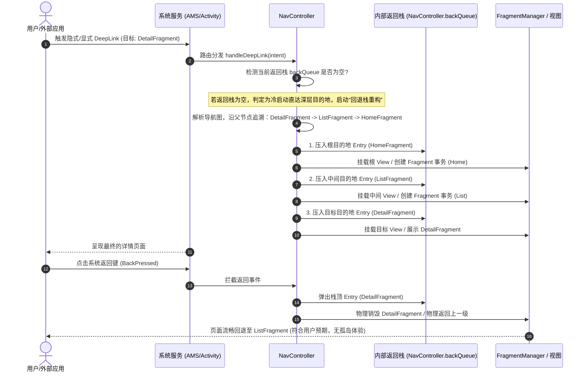

# 5.1.3.6 Navigation

在现代 Android 应用开发中，单 Activity 架构（Single Activity Architecture）已成为官方首选的推荐范式。在这一架构下，整个应用通常仅由一个宿主 Activity 承载，而具体的业务页面则以 [Fragment](file:///Users/lizhiyang/Desktop/AndroidKnowledge/docs/5.Android/5.1.基础/5.1.3.Fragment与Jetpack基础组件/5.1.3.1.Fragment生命周期.md) 或 Jetpack Compose 的 Composable 组件形式存在。

传统的 Fragment 页面跳转依赖于手动管理 `FragmentManager` 与 `FragmentTransaction`。由于 Fragment 生命周期极其复杂，手动调用 `add()`、`replace()`、`show()`、`hide()` 事务极易导致生命周期状态不一致、返回栈（Back Stack）混乱、数据泄露或多重跳转白屏等问题。此外，传统模式在处理编译期参数校验、深层链接（DeepLink）页面路由与回退栈层级重建，以及多 Tab 页签下多返回栈的状态保留时，其实现逻辑繁琐且极其脆弱。

为了规范并简化单 Activity 架构下的页面流转，Google 推出了 Jetpack Navigation 导航组件。它为 Android 应用提供了统一的、声明式的目的地页面路由规范，将以往容易出错的 Fragment 事务和回退栈管理封装进标准化、高度可预测的底层框架中。本文将深入解密 Jetpack Navigation 的架构设计、底层返回栈管理逻辑、编译期安全传参、DeepLink 重构机制、多返回栈保存恢复原理以及现代 Compose 导航的过渡演进。

---

## 一、 Navigation 架构“三杰”关系解构与依赖拓扑

Jetpack Navigation 的整体设计遵循了清晰的职责分离原则。其核心架构由三个关键组件协作构成，开发社区常将其称为 Navigation 的“三杰”：

1. **Navigation Graph（导航图）**
   * **定义**：导航图是一种非可视化的、结构化的有向图拓扑关系数据结构（在 XML 模式下定义为 `nav_graph.xml`，在 Compose 模式下定义为 Kotlin DSL 路由图）。
   * **职责**：它充当整个导航上下文的“静态地图”，声明了所有潜在的目的地（`NavDestination`，可以是 Fragment、Activity、DialogFragment 或自定义 Destination）以及它们之间的连接通路，即动作（`NavAction`）。在导航图中，还可以静态定义页面切换的转场动画、传参要求以及返回栈弹出行为（如 `popUpTo` 属性）。

2. **NavHost（导航容器占位）**
   * **定义**：它是导航目的地在视图层级中的物理承载容器，通常在 Activity 的布局文件中作为占位实体。在 Fragment 体系中，最常用的具体实现是 `NavHostFragment`（底层是一个 `FragmentContainerView`）。
   * **职责**：它负责将当前激活的目的地视图渲染并注入到当前的视图树中，并与宿主 Activity 的生命周期进行严格联动。每一个 `NavHost` 内部都会实例化并持有一个专属的导航控制器。

3. **NavController（导航中枢控制器）**
   * **定义**：它是整个 Navigation 框架中最为核心的逻辑指挥官，是一个纯粹的逻辑控制类，不直接参与 UI 绘制。
   * **职责**：它负责维护当前的返回栈状态，并将开发者的路由意图（如 `navigate()`、`popBackStack()`、`navigateUp()`）翻译成底层的具体事务，下发给不同的 `Navigator` 适配器去执行。同时，它向外界暴露了生命周期变化监听、导航拦截器以及 DeepLink 路由解析分发接口。

### 1.1 三要素依赖拓扑关系图

在运行时，这三者的关系相互交织，形成了一个典型的“控制器-容器-配置”模型。我们可以通过以下拓扑关系图来直观理解：

```mermaid
graph TD
    classDef highlight fill:#f9f,stroke:#333,stroke-width:2px;
    
    subgraph NavigationComponent [Navigation 架构三要素]
        Graph["Navigation Graph<br/>(导航图 XML/DSL)"]
        Host["NavHost / NavHostFragment<br/>(视图容器占位)"]
        Controller["NavController<br/>(导航中枢控制器)"]
    end
    
    Activity["Activity / Fragment"] -->|1. 获取控制器 findNavController()| Controller
    Controller -->|2. 解析并加载| Graph
    Controller -->|3. 控制和切换目的地| Host
    Graph -->|定义 Destination 与 Action| Host
    Host -->|管理并挂载目的地| Destination["NavDestination<br/>(Fragment / Composable / Activity)"]
```

### 1.2 findNavController() 寻踪：View 树向上回溯与 Tag 挂载机制

在实际开发中，开发者可以通过 `findNavController()` 静态扩展方法在任意 View 或 Fragment 中快速获取当前上下文的 `NavController`。这一机制的底层实现并非依赖于全局单例，而是基于 **“View 树向上溯源”** 与 **“反射/Tag 挂载”** 的巧妙设计。

#### 1.2.1 View.findNavController() 的回溯算法
当我们在 View 中调用 `findNavController()` 时，底层的核心调用会走向 `Navigation.findNavController(View)`。其源码逻辑本质上是一个自底向上的 View 树迭代搜索过程：

```kotlin
// 伪代码：Navigation.findNavController(view) 的核心实现原理
private fun findViewNavController(view: View): NavController? {
    var current: View? = view
    while (current != null) {
        // 尝试从当前 View 的 Keyed Tag 中获取已绑定的 NavController 实例
        val controller = current.getTag(R.id.nav_controller_view_tag) as? NavController
        if (controller != null) {
            return controller
        }
        // 如果当前 View 未绑定，则向上寻找其 Parent View，直至 DecorView (根视图)
        val parent = current.parent
        current = parent as? View
    }
    return null
}
```

* **Tag 的注入时机**：这个特定的 `R.id.nav_controller_view_tag` 是在什么时候被注入到 View 中的？当 `NavHostFragment` 执行其 [Fragment生命周期](file:///Users/lizhiyang/Desktop/AndroidKnowledge/docs/5.Android/5.1.基础/5.1.3.Fragment与Jetpack基础组件/5.1.3.1.Fragment生命周期.md) 中的 `onViewCreated()` 时，它会调用 `Navigation.setViewNavController(view, navController)`，将创建好的 `NavController` 作为 Tag 保存到当前 `NavHostFragment` 的根 View 及其子容器中。
* **成立条件与异常**：`View.findNavController()` 成功的前提是：**该 View 必须已被挂载（Attach）到由 `NavHost` 承载的视图树中**。如果在一个尚未 Attach 的 View 上，或者在 `Activity.onCreate()` 中视图还未完全渲染时直接调用，就会由于回溯不到持有 Tag 的根 View，从而抛出 `IllegalStateException: View does not have a NavController set`。

#### 1.2.2 Fragment.findNavController() 的向上追溯
与 View 的回溯机制不同，`Fragment.findNavController()` 优先通过 Fragment 树的层级结构进行寻找：

```kotlin
// 伪代码：Fragment.findNavController() 核心检索链
fun Fragment.findNavController(): NavController {
    var findFragment: Fragment? = this
    while (findFragment != null) {
        if (findFragment is NavHostFragment) {
            return findFragment.navController
        }
        // 沿着父级 Fragment 树向上查找
        val primaryNavigationFragment = findFragment.parentFragmentManager.primaryNavigationFragment
        if (primaryNavigationFragment is NavHostFragment) {
            return primaryNavigationFragment.navController
        }
        findFragment = findFragment.parentFragment
    }
    // 降级兜底：如果在 Fragment 树中没找到，尝试在宿主 Activity 的根 View 树中寻找
    val view = view
    if (view != null) {
        return Navigation.findNavController(view)
    }
    throw IllegalStateException("Fragment $this does not have a NavController set")
}
```

这套寻踪机制确保了在复杂的嵌套 Fragment（Nested Fragments）场景下，子 Fragment 能够自动寻寻找最邻近的、起主导作用的 `NavHostFragment` 的控制器，从而保证了导航作用域的隔离与正确性。

---

## 二、 底层返回栈（Back Stack）管理原理

在传统的 Fragment 管理中，物理返回栈是由 `FragmentManager` 的 `BackStackRecord` 链表结构直接维护的。然而，`BackStackRecord` 仅记录了 Fragment 事务的提交顺序，无法感知更高层级的导航拓扑关系，也无法为特定路由区间提供独立生命周期与数据共享的作用域。

为了彻底解决这一痛点，Navigation 引入了高阶抽象概念——`NavBackStackEntry`。

### 2.1 NavBackStackEntry：目的地的物理实体与隔离作用域

在 Navigation 的设计哲学中，返回栈里存储的不再是原生的 Fragment 实例，而是一个个 `NavBackStackEntry` 对象。它是返回栈中的物理承载节点，代表了一个正处于激活或后台备份状态保持的 Destination 实例。

最重要的是，`NavBackStackEntry` 实现了以下三个 Jetpack 核心架构接口，为其所代表的目的地页面提供了完全隔离的高级作用域：

1. **[LifecycleOwner](file:///Users/lizhiyang/Desktop/AndroidKnowledge/docs/5.Android/5.1.基础/5.1.3.Fragment与Jetpack基础组件/5.1.3.3.Lifecycle.md)**
   每个 `NavBackStackEntry` 都拥有其专属的 `Lifecycle` 对象。当目的地被压入栈顶时，该 Entry 的生命周期会过渡到 `RESUMED`；当有新页面压入它之上，该页面退居后台时，它的生命周期会降级为 `CREATED`（依然在栈内留存，但不可见）；当它被 `popBackStack()` 弹出栈并销毁时，它的生命周期变为 `DESTROYED`。
   
2. **[ViewModelStoreOwner](file:///Users/lizhiyang/Desktop/AndroidKnowledge/docs/5.Android/5.1.基础/5.1.3.Fragment与Jetpack基础组件/5.1.3.4.ViewModel.md)**
   这是 Navigation 架构的一大突破。每个 Entry 都维护着自己独立的 `ViewModelStore`。这意味着：
   * **页面级 ViewModel 自动销毁**：与 Entry 绑定的 ViewModel 仅在当前目的地存活于返回栈中时有效。一旦页面出栈（`DESTROYED`），Entry 的 `ViewModelStore` 就会自动调用 `clear()`，销毁所有相关的 ViewModel，不再需要依赖 Activity 的生命周期。这完美解决了由于 Activity 作用域过大导致的数据脏滞留和内存泄露。
   * **导航子图共享作用域（Scoped ViewModel）**：开发者可以通过指定 Navigation Graph 的 ID 来创建 ViewModel：`val viewModel: MyViewModel by navGraphViewModels(R.id.my_sub_graph)`。该 ViewModel 的生命周期将由代表该子图（`NavGraph`）的 `NavBackStackEntry` 统一控制。只有当用户彻底离开该子图的所有页面时，该 ViewModel 才会随之销毁，非常适合用于多步骤表单提交等业务场景。

3. **SavedStateRegistryOwner**
   它提供了一套无缝的数据持久化机制。当系统面临低内存杀死应用进程（Process Death）时，该 Entry 会通过 `SavedStateRegistry` 保存当前页面状态，并在进程重建后利用 `SavedStateHandle` 自动还原数据，保证用户体验的连贯性。

### 2.2 navigate() 与 popBackStack() 的事务封装与提交流程

在内部，`NavController` 将具体的页面渲染和呈现工作委托给了具体的 `Navigator` 子类。对于 Fragment 而言，它的实际操纵者是 `FragmentNavigator`。

```
[NavController.navigate()] 
       │
       ▼ (封装参数与配置)
[Navigator.navigate()] -> 例如 FragmentNavigator
       │
       ▼ (拼装 FragmentTransaction)
[FragmentManager.beginTransaction()] -> 提交物理 Fragment 事务
```

当开发者调用 `navController.navigate(R.id.detailFragment, bundle)` 时，底层的调用流转如下：

1. **拓扑解析与 Options 准备**：`NavController` 检查其持有的 `NavGraph`，根据传入的目的地 ID 找到目标 `NavDestination`，并解析其附带的 `NavOptions`（包含转场动画、启动模式等）。
2. **创建并入栈 Entry**：`NavController` 实例化一个全新的 `NavBackStackEntry`，将其压入内部的双端队列 `backQueue`（`ArrayDeque<NavBackStackEntry>`）中。
3. **委托给 Navigator**：`NavController` 将跳转请求下发给 `FragmentNavigator`。
4. **事务构建与提交**：
   * `FragmentNavigator` 提取 `NavOptions` 中预设的转场动画参数，调用 `FragmentTransaction.setCustomAnimations()`。
   * 随后，它会在底层调用 `FragmentTransaction.replace()`（在默认非多返回栈场景下），将当前托管容器（如 `FragmentContainerView`）中的旧 Fragment 替换为新实例。
   * 为确保该操作可逆且有序，它会通过 `FragmentTransaction.addToBackStack()` 将该事务注册到 `FragmentManager` 的物理回退栈中，与该 `NavBackStackEntry` 的唯一 ID 进行关联，最后执行 `commit()`。
5. **回退逻辑 popBackStack()**：
   当调用 `popBackStack()` 时，`NavController` 首先将栈顶的 `NavBackStackEntry` 从 `backQueue` 中移除并改变其生命周期为 `DESTROYED`（从而触发内部 `ViewModelStore.clear()`），接着调用 `FragmentNavigator.popBackStack()`，最终驱动底层 `fragmentManager.popBackStack()` 物理撤销最近一次的 FragmentTransaction，将上一个 Fragment 重新渲染并提升生命周期状态。

---

## 三、 编译期保护：Safe Args 类型安全传参

在传统的 Android 开发中，页面间传递数据主要依赖于 Bundle 键值对：

```kotlin
// 发送端
val fragment = DetailFragment()
val bundle = Bundle().apply { putString("user_id", "10086") }
fragment.arguments = bundle

// 接收端
val userId = arguments?.getString("userid") // 拼写错误 "userid" vs "user_id"，导致运行时 NPE
```

由于 Bundle 的 Key-Value 是一种弱类型的接口，拼写错误、类型转换错误、可空性配置丢失等隐患都极易被带到线上运行期，并在发生冲突时直接崩溃（抛出 `ClassCastException` 或 `NullPointerException`）。

### 3.1 Safe Args 的编译期扫描与辅助类生成机制

为了在物理上消除这些隐患，Jetpack Navigation 提供了 **Safe Args** Gradle 插件。它通过在**构建期（Build Time）**自动生成辅助代码，实现了类型安全的编译期传参保护。

其工作原理主要包含以下几个核心步骤：

```
[XML 导航图定义] ──(AAPT 编译期扫描)──> [AST 解析器解析 <argument>] ──(生成代码)──> [*Directions & *Args 辅助类]
```

1. **AAPT 扫描与 AST 解析**：在项目编译阶段，Safe Args 插件会拦截 Gradle 构建任务，使用 AAPT 自动扫描当前模块下的所有导航 XML 资源文件。
2. **提取约束元数据**：AST（抽象语法树）解析器会分析每个 `<fragment>` 节点下的 `<argument>` 声明，提取其包含的 `android:name`（名称）、`app:argType`（数据类型）、`android:defaultValue`（默认值）以及 `app:nullable`（是否可空）属性。
3. **自动生成辅助代码**：根据解析到的元数据，Safe Args 会利用 JavaPoet 或 KotlinPoet 在 `build/generated/source/` 目录下生成两类辅助类：
   * **`[Destination]Directions`（发送端包装类）**：如果 `HomeFragment` 定义了可以跳转至 `DetailFragment` 的 Action，且目标页面需要参数 `userId`，插件就会生成 `HomeFragmentDirections` 类，并在内部提供静态方法：
     ```kotlin
     // 编译期静态约束：强类型参数 userId，不可省略，无法传错类型
     fun actionHomeToDetail(userId: String): NavDirections
     ```
   * **`[Destination]Args`（接收端解析类）**：对于目标页面 `DetailFragment`，Safe Args 会为其生成 `DetailFragmentArgs` 类。接收端在获取参数时，可以直接通过该辅助类进行安全读取：
     ```kotlin
     // 接收端调用
     val args: DetailFragmentArgs by navArgs()
     val userId = args.userId // 强类型，可空性在编译期已确定
     ```

### 3.2 自动生成代码核心逻辑解密

从底层生成的 Java/Kotlin 字节码视角来看，Safe Args 生成的代码并没有脱离 Bundle，而是对传统的 `Bundle.put/get` 操作进行了强类型的**静态包装**。以下是生成的 `DetailFragmentArgs` 大致的工作机制：

```kotlin
// Safe Args 自动生成的代码示例说明
public class DetailFragmentArgs implements NavArgs {
    private final String userId;

    private DetailFragmentArgs(String userId) {
        this.userId = userId;
    }

    // 接收端通过 fromBundle 将弱类型的 Bundle 转换为强类型的 Args 实例
    public static DetailFragmentArgs fromBundle(Bundle bundle) {
        if (bundle == null) {
            throw new IllegalArgumentException("Required arguments bundle is missing");
        }
        if (!bundle.containsKey("userId")) {
            // 编译期强制约束：如果无默认值且缺失 Key，在转换时立刻抛出异常，防止运行中由于 NPE 造成不可预期的表现
            throw new IllegalArgumentException("Required argument \"userId\" is missing");
        }
        String userId = bundle.getString("userId");
        if (userId == null) {
            throw new IllegalArgumentException("Argument \"userId\" is marked as non-null but was passed a null value.");
        }
        return new DetailFragmentArgs(userId);
    }
}
```

通过这一层代理，Safe Args 在开发周期的**最早阶段（编码与编译阶段）**就将潜在的传参错误暴露出来，避免了运行时隐患的滋生。

---

## 四、 深度链接（DeepLink）路由匹配与回退栈重构机制

在 Android 系统中，深度链接（DeepLink）是让应用实现外部唤起、运营推广和系统通知直达特定深层页面的重要手段。传统的 DeepLink 适配中，当应用进程尚未被拉起（冷启动）时，如果通过外部链接直接拉起一个处于应用最底层的 Activity 或 Fragment，会导致一个严重的体验断层——**“孤岛页面”**：当用户在详情页点击物理返回键时，系统会由于物理返回栈为空而直接退出应用，用户无法像正常启动应用那样逐级回退到首页或列表页。

Navigation 框架设计了一套“回退栈重构（Back Stack Reconstruction）”机制，从根本上解决了这一难题。

### 4.1 显式与隐式 DeepLink 的触发和匹配流程

Navigation 提供了两种深度链接匹配逻辑：

* **显式 DeepLink (Explicit DeepLink)**：通常由应用内部模块构建（如发送系统 Notification、放置 AppWidget）。它通过 `NavDeepLinkBuilder` 显式构建一个 `PendingIntent`。该 Intent 在打包时就已经在 Extra数据中绑定了完整的导航回退路径（`int[]` 格式的目的地 ID 数组）。
* **隐式 DeepLink (Implicit DeepLink)**：通过定义 URI 匹配规则、Action 或 MIME 类型来触发（如在 `nav_graph.xml` 中配置 `<deepLink app:uri="https://www.example.com/goods/{goodsId}" />`）。当外部应用（如浏览器）发出包含该 URI 的 Intent 时，拥有对应 `intent-filter` 声明的 Activity 会拦截该意图，并在其 `onCreate` 或 `onNewIntent` 中将 Intent 转发给 `NavController.handleDeepLink(Intent)`，由其内部利用正则表达式对 URI 进行匹配，最终映射到导航图中的特定目的地。

### 4.2 底层“回退栈重构（Back Stack Reconstruction）”原理解密

当 `NavController` 拦截到 DeepLink 路由意图，且检测到当前应用处于冷启动（当前导航栈为空，说明并非由于用户层层点击进入该详情页）时，它会自动在后台触发回退栈重构流程，其层级流转如下图所示：



#### 4.2.1 拓扑回溯重建步骤
1. **反向树状追溯**：当检测到需要重建返回栈时，`NavController` 不会立刻创建目标 `DetailFragment`。它会沿着导航图（Navigation Graph）中的树状连接结构，由下至上进行递归反向追溯。对于 `DetailFragment`，它的 Parent Graph 可能是 `GoodsSubGraph`，最外层 Parent Graph 是 `RootGraph`（其首页目的地为 `HomeFragment`）。
2. **构建层级序列**：追溯算法会生成一条从根目的地直达目标目的地的有序链条：`[HomeFragment, ListFragment, DetailFragment]`。
3. **按序执行入栈与事务模拟**：`NavController` 会遍历这个链条，模拟用户的点击轨迹，按顺序将这些目的地对应的 `NavBackStackEntry` 压入 `backQueue` 中。在此期间，底层的 `FragmentNavigator` 会同步执行对应的 Fragment 事务。
4. **最终展示**：在完成了前置页面的返回栈重建后，目标 `DetailFragment` 最终被渲染在屏幕上。
5. **回退行为**：当用户在详情页点击物理返回键或调用 `popBackStack()` 时，由于前置的 `ListFragment` 和 `HomeFragment` 的 Entry 已经安静地躺在返回栈中，系统会像往常一样流畅地逐级将页面回退到上一层，从而确保了导航的一致性和逻辑闭环。

---

## 五、 多返回栈（Multiple Back Stacks）支持与状态恢复演进

在现代的 Android App 中，主流的主界面架构通常采用底部导航栏（如使用 `BottomNavigationView` 或 `NavigationBar`）配合 3~5 个并列的业务 Tab 页（如“首页”、“消息”、“购物车”、“个人中心”）。

在这种模式下，用户希望在各个 Tab 页面中各自进行独立的导航流转。例如：
* 用户在“首页”点击进入了“商品详情” -> “评论列表”；
* 此时用户点击底部导航栏切换到了“购物车”，在“购物车”点击了“下单结算”；
* 当用户再次切回“首页”时，他们期望“首页”的视图依然保留在刚才的“评论列表”页面，并且保留之前的滑动位置和输入框状态；
* 同样，切回“购物车”时，结算页面也不应当丢失。

这种需求，在 Android 12 之前，对开发者来说是一场灾难。

### 5.1 历史适配痛点与性能瓶颈

在早期版本的 Navigation 中，物理上只维护着一个单一的返回栈。如果用户在 Tab 切换时直接调用 `navigate()`，由于只能维持一条单向栈，若不进行特殊处理，就会导致其他 Tab 页面下的导航路径瞬间被清空重置。

为了克服这个缺陷，开发团队以前不得不采用极为复杂的变通方案：
1. **维护多个独立的 NavHostFragment**：在主 Activity 中定义 5 个 FragmentContainerView，每个 View 中挂载一个独立的 `NavHostFragment`。在切换 Tab 时，通过手动操作 `FragmentManager` 的 `show()` 和 `hide()` 将不活跃的 `NavHost` 隐藏起来。
2. **这种方案的瓶颈**：
   * **内存开销巨大**：由于 5 个 `NavHost` 实例和里面所有的 Fragment 示例在后台全部处于活动状态，它们的 Lifecycle 停留在 `STARTED`。系统无法释放后台 Tab 中暂时用不到的 Fragment 资源，容易造成内存吃紧和 OOM。
   * **数据模型混乱**：多个独立的 `NavController` 导致了导航作用域的分裂，物理返回键（BackPressed）的分发拦截极易失效或产生冲突，排障极为困难。

### 5.2 Android 12 与 Navigation 2.4+ 的底层突破

为了给多返回栈提供完美的官方原生支持，Google 在 Android 12 (API 31) 推出期间，对底层的组件进行了重大革新。在 [Android 12（API 31）](../../../../AndroidVersionChangeLog.md#android-12api-31) 版本及其配套的 Jetpack 组件演进中，Fragment 库升级至 `1.4.0`，而 Navigation 库升级至 `2.4.0-alpha01`（及更高稳定版本）。这次升级引入了多返回栈（Multiple Back Stacks）的底层支撑 API。

其底层机制的核心在于，重新设计并导出了 `FragmentManager` 的两组关键事务 API，并由 Navigation 组件在外部封装了 `saveState` 与 `restoreState` 配置选项。

```
                    ┌────────────┐ (用户切换 Tab B)
                    │  Tab A 栈  │ 
                    └─────┬──────┘
                          │ 
                          ├─► [NavController.saveState()]
                          │         │
                          │         ▼ (序列化缓存 Entry 与 ViewModelStore)
                          │   [FragmentManager.saveBackStack(tabAStateId)]
                          │ 
                          ▼ (Fragment 物理销毁并释放，但状态已被缓存)
                    ┌────────────┐ (还原 Tab B)
                    │  Tab B 栈  │ 
                    └─────┬──────┘
                          │ 
                          ├─► [NavController.restoreState()]
                          │         │
                          │         ▼ (反序列化重建 Entry，关联 ViewModel)
                          │   [FragmentManager.restoreBackStack(tabBStateId)]
                          │ 
                          ▼ (视图无缝还原)
```

#### 5.2.1 FragmentManager.saveBackStack(String name) 原理
当用户从 Tab A 切换至 Tab B 时，配合 `BottomNavigationView` 的 `NavigationUI.setupWithNavController` 扩展，Navigation 会调用 `NavController.navigate()`，并在内部设置 `saveState = true` 与 `popUpTo` 选项。
* **出栈而不销毁状态**：底层 `FragmentNavigator` 会触发 `FragmentManager.saveBackStack(tabAStateId)`。它会将 Tab A 返回栈中除根节点以外的所有 Fragment 实例物理弹出，但是，它**绝非物理销毁**。
* **状态打包缓存**：底层框架会将这些 Fragment 的视图层次状态、输入状态、`SavedStateRegistry` 以及极其关键的页面级 `ViewModelStore` 进行打包，以特定的 `UUID` 为 Key，存储到宿主 `FragmentManager` 的非配置状态缓存中。
* **内存释放**：物理 Fragment 被销毁并从 View 层次结构中剥离，释放占用的视图内存，从而在后台保持极低的内存负担。

#### 5.2.2 FragmentManager.restoreBackStack(String name) 原理
当用户再次切回 Tab A 时，调用 `NavController.navigate()` 并带有 `restoreState = true` 属性。
* **取出状态与重建**：底层 `FragmentNavigator` 会收到该配置，并调用 `FragmentManager.restoreBackStack(tabAStateId)`。
* **恢复事务与状态**：`FragmentManager` 会从之前的非配置状态缓存中，根据 Tab A 的 Key 取出所有打包好的状态信息，在底层重新构建对应的 Fragment 实例，恢复它们之前的 `BackStackRecord` 事务状态，并把它们重新加挂回托管容器中。
* **ViewModel 无缝重绑定**：由于旧的 `ViewModelStore` 在缓存中被完整保留，新创建的 Fragment 在重新绑定对应的 `NavBackStackEntry` 后，获取到的依然是刚才离开时的同一个 ViewModel 实例。这实现了在内存几乎无额外常驻开销的前提下，多页面 Tab 返回栈状态的完美保存与极速无感复原。

---

## 六、 现代化 Compose 导航（Navigation Compose）中的发展与过渡

随着 Android 彻底迈进以声明式 UI 为代表的 Jetpack Compose 时代，传统的以 Fragment 为核心的导航面临了架构上的“去 Fragment 化”革命。为此，官方推出了 `Navigation Compose`。

### 6.1 核心差异：从 Fragment 事务到 Composable 重组的转变

`Navigation Compose` 的出现，使得整个 Navigation 的设计更加纯粹，完成了从传统 View 树模型向声明式数据流模型的彻底转变：

| 特性 | 传统 Navigation (Fragment 模式) | Modern Navigation Compose (声明式模式) |
| --- | --- | --- |
| **承载实体** | [Fragment](file:///Users/lizhiyang/Desktop/AndroidKnowledge/docs/5.Android/5.1.基础/5.1.3.Fragment与Jetpack基础组件/5.1.3.1.Fragment生命周期.md) 实例 | `@Composable` 声明式函数 |
| **物理适配器** | `FragmentNavigator` | `ComposeNavigator` |
| **底层实现** | 依赖 `FragmentManager` 提交 FragmentTransaction 事务 | 摆脱 `FragmentManager`，完全依赖虚拟 `backQueue` 驱动重组 |
| **页面流转物理介质**| 操纵 Fragment 的 `add`/`replace`/`remove` 与 View 树挂载 | 监听 `NavController.currentBackStackEntryAsState()`，根据栈顶 Entry 的目的地重构 UI 树 |

在 Compose 导航中，`NavHost` 本质上是一个响应式的 `@Composable` 容器。它订阅了 `NavController` 内部暴露的 `backQueue`（返回栈队列状态流）。一旦开发者调用 `navigate()` 导致栈顶的 `NavBackStackEntry` 发生变化，Compose 的状态监听机制就会在下一帧触发 Recomposition（重组），销毁旧的 Composable 页面视图，渲染出新栈顶 Entry 所指向的 Composable 目的地。

### 6.2 类型安全新范式：从 String Route 到 Kotlinx Serialization 的跃升

在 Navigation Compose 诞生之初（直到 Navigation 2.7.x 版本），它由于彻底摒弃了 XML 机制，无法再借助 Safe Args 插件进行编译期传参保护。当时，页面跳转完全退化到了依靠拼接“String 路由路径（String Routes）”的模式，例如：

```kotlin
// 早期 Compose 导航：参数拼接，容易拼写出错，类型不安全
navController.navigate("detail/10086?name=Google")
```

从 **Navigation 2.8.0** 开始，Google 对 Compose 导航进行了重构，引入了基于 **Kotlinx Serialization（Kotlin 序列化）** 的全新声明式强类型路由规范。这宣告了 Safe Args 的核心思想在现代化 UI 框架中得到了完全的重生。

#### 6.2.1 Kotlinx Serialization 模式的工作机制
在 2.8.0 及其后续版本中，开发者不再需要声明 XML，而是通过声明标准的 Kotlin 对象（Objects）或数据类（Data Classes）并标记 `@Serializable` 来直接定义目的地：

```kotlin
import kotlinx.serialization.Serializable

// 1. 声明强类型目的地
@Serializable
object Home // 无参目的地

@Serializable
data class Detail(val userId: String, val age: Int) // 带强类型参数的目的地
```

在构建导航图和执行跳转时，编译器与运行时会自动协作：

```kotlin
// 2. 在 NavHost 中使用类型声明目的地，免去手写 String Path 路由的麻烦
NavHost(navController = navController, startDestination = Home) {
    composable<Home> {
        HomeScreen(onNavigateToDetail = { id ->
            // 3. 强类型安全导航：像调用普通函数一样传入强类型参数，完全受编译器保护
            navController.navigate(Detail(userId = id, age = 25))
        })
    }
    composable<Detail> { backStackEntry ->
        // 4. 类型安全的数据读取：直接解析为对应的 Data Class，避免强转崩溃
        val detail: Detail = backStackEntry.toRoute()
        DetailScreen(userId = detail.userId, age = detail.age)
    }
}
```

* **底层实现原理**：Kotlin 序列化编译器插件会在编译期为带有 `@Serializable` 注解的类生成对应的序列化器（Serializer）。当调用 `navigate(Detail(...))` 时，Navigation 框架内部的序列化器会自动将整个数据类实例的字段解析并编码为符合规范的键值对 Bundle；而在目标端调用 `toRoute<Detail>()` 时，框架又会反向读取 Bundle 数据并反序列化回强类型的 Kotlin 对象。
* **这一升级的意义**：它不仅保留了 Jetpack Compose “纯 Kotlin 编写、无 XML 噪音”的开发体验，又在完全摆脱 AAPT XML 解析的底层限制下，实现了比传统 Safe Args 更加优雅、直观、开箱即用的**类型安全保护**，代表了 Android 页面导航技术未来的演进方向。
