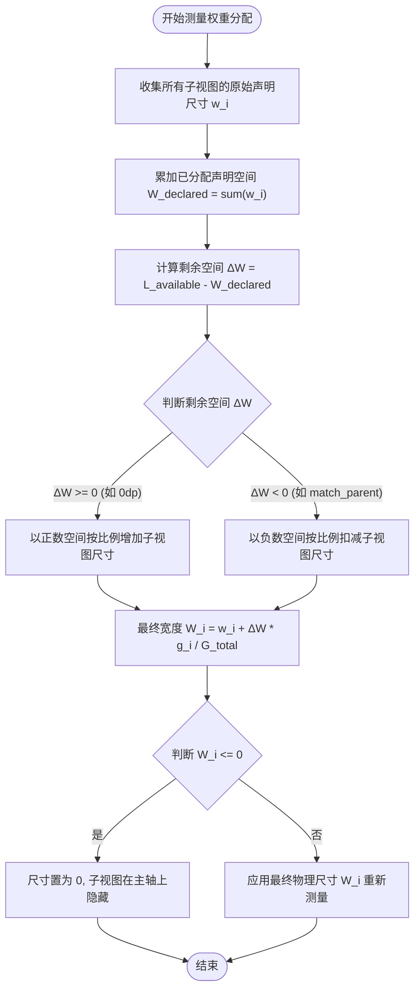
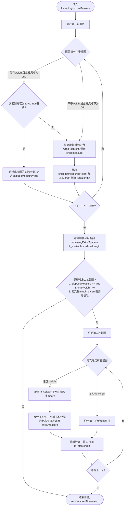

# 5.1.4.1.1 LinearLayout

`LinearLayout`（线性布局）是 Android 视图体系中最基础、最常用的布局管理器之一。它继承自 `ViewGroup`，旨在将子视图（`View`）在单一方向（水平或垂直）上进行线性排列。尽管其概念非常直观，但在实际的复杂界面开发中，若对其底层的测量机制、权重分配算法、二次测量开销以及分割线绘制逻辑缺乏深度理解，往往会导致不可预期的布局效果，甚至引发严重的 UI 性能卡顿。

本文将从 Android 框架源码与底层数学公式的双重视角，深度剖析 `LinearLayout` 的工作机制，帮助开发者在保障界面正确性的同时，实现最优的渲染性能。

---

## 一、 核心属性与视图排布机制

`LinearLayout` 的排布逻辑由几个关键属性控制，其中最核心的是排列方向、容器重力与子视图局部重力。这些属性在 `onMeasure`（测量）和 `onLayout`（布局）两个生命周期阶段中，起着决定性的控制作用。

### 1. orientation 属性与测量主轴

`android:orientation` 属性决定了子视图的排列方向，其可选值为 `horizontal`（水平）与 `vertical`（垂直，默认值）。

*   **主轴（Main Axis）与交叉轴（Cross Axis）**：
    *   在垂直布局下，**主轴**为 Y 轴，**交叉轴**为 X 轴。
    *   在水平布局下，**主轴**为 X 轴，**交叉轴**为 Y 轴。
*   **物理意义**：
    *   主轴是 `LinearLayout` 累加子视图尺寸的方向。在 `onMeasure` 阶段，`LinearLayout` 会沿着主轴方向累加子视图的尺寸（包括子视图的 `Margin` 与 `LinearLayout` 本身的 `Padding`），并维护一个关键的成员变量 `mTotalLength` 用以记录当前已占用的主轴总长度。
    *   交叉轴是子视图在排列方向的垂直维度。在 `onMeasure` 阶段，`LinearLayout` 会根据交叉轴上的测量规格限制（如 `MeasureSpec`）来独立测量每个子视图在该轴上的尺寸。

### 2. gravity 与 layout_gravity 的设计与底层实现差异

开发者常因混淆 `android:gravity` 与 `android:layout_gravity` 而导致布局效果不符合预期。理解它们的底层区别需要从“作用对象”与“生效阶段”两个维度切入：

#### (1) gravity（内容对齐方式）
*   **定义**：定义在 `LinearLayout` 自身上，控制其内部**所有子视图作为一个整体**在 `LinearLayout` 剩余可用空间中的对齐方式，或者控制子视图内部内容的对齐。
*   **底层机制**：
    *   在 `onMeasure` 阶段，`gravity` 不参与子视图的尺寸计算（但会参与 `LinearLayout` 自身包裹内容的最终大小决策）。
    *   在 `onLayout` 阶段，以垂直布局为例，若 `LinearLayout` 的实际高度大于所有子视图的累计高度（即存在多余空间），且 `gravity` 包含 `Gravity.CENTER_VERTICAL` 或 `Gravity.BOTTOM`，`LinearLayout` 将计算出一个初始偏移量 `childTop`：
        *   若为 `BOTTOM`：`childTop = mPaddingTop + bottom - top - mTotalLength`
        *   若为 `CENTER_VERTICAL`：`childTop = mPaddingTop + (bottom - top - mPaddingTop - mPaddingBottom - mTotalLength) / 2`
    *   随后，在遍历布局子视图时，每个子视图的 `top` 坐标都将累加上这个偏移量，从而实现整体对齐。

#### (2) layout_gravity（子视图局部对齐方式）
*   **定义**：这是 `LinearLayout.LayoutParams` 中的属性，控制**当前子视图**在父容器分配给它的空间中，在**交叉轴（Cross Axis）**方向上的对齐方式。
*   **关键约束**：在主轴方向上，`layout_gravity` 是**无效**的。
    *   **原因剖析**：主轴方向上的相对位置已经被 `orientation` 锁死。例如，在垂直排列中，视图必须按 `V1 -> V2 -> V3` 的物理顺序从上往下堆叠，不可能允许 `V2` 设置 `layout_gravity="bottom"` 越过 `V3` 贴到底部，这违背了“一维线性排列”的基本定义。如果希望在主轴方向上产生间距或弹性对齐，必须通过修改子视图的 `layout_weight` 或主轴 `margin` 来实现。
    *   **源码佐证**：在 `LinearLayout.layoutVertical()`（垂直布局的布局阶段源码）中，系统仅解析子视图的 `layout_gravity` 在水平方向的分量（如 `Gravity.LEFT`, `Gravity.RIGHT`, `Gravity.CENTER_HORIZONTAL`），并在计算子视图的 `left` 坐标时应用：
        ```java
        // 垂直布局中，处理水平方向（交叉轴）的对齐
        switch (absoluteGravity & Gravity.HORIZONTAL_GRAVITY_MASK) {
            case Gravity.CENTER_HORIZONTAL:
                childLeft = paddingLeft + ((childSpace - width) / 2)
                        + lp.leftMargin - lp.rightMargin;
                break;
            case Gravity.RIGHT:
                childLeft = childRight - width - lp.rightMargin;
                break;
            case Gravity.LEFT:
            default:
                childLeft = paddingLeft + lp.leftMargin;
                break;
        }
        ```
        而在水平布局中，系统仅解析子视图的 `layout_gravity` 在垂直方向的分量（如 `Gravity.TOP`, `Gravity.BOTTOM`, `Gravity.CENTER_VERTICAL`），忽略水平分量。

---

## 三、 权重（layout_weight）底层数学算法大公开

`layout_weight` 是 `LinearLayout` 最强大的特性之一，能够让子视图以比例方式瓜分父容器的剩余空间。然而，许多开发者在设置 `0dp` 与 `match_parent` 时，常遇到视图反常变形、大权重反而变窄甚至消失的怪异现象。这一切的背后，都遵循着严密的底层数学分配公式。

### 1. 核心计算公式

当 `LinearLayout` 发现有子视图设置了非零的 `layout_weight` 时，在测量完所有子视图的原始声明尺寸后，会计算出父容器在主轴方向上的**剩余空间（Remaining Space）**。

设父容器在主轴方向的可用总长度（已减去 Padding）为 $L_{\text{available}}$。
假设有 $n$ 个子视图 $V_1, V_2, \dots, V_n$。
各子视图在主轴方向上声明的原始尺寸分别为 $w_1, w_2, \dots, w_n$。
各子视图的权重分别为 $g_1, g_2, \dots, g_n$。

**步骤一：计算声明的总尺寸**
$$W_{\text{declared}} = \sum_{j=1}^{n} w_j$$

**步骤二：计算剩余空间 $\Delta W$**
$$\Delta W = L_{\text{available}} - W_{\text{declared}}$$
> **注意**：$\Delta W$ 可以是正数（当声明的总空间小于容器可用空间时），也可以是**负数**（当声明的总空间超出容器可用空间时）。

**步骤三：计算每个子视图分配后的最终尺寸 $W'_i$**
$$W'_i = w_i + \Delta W \times \frac{g_i}{G_{\text{total}}}$$
其中，$G_{\text{total}} = \sum_{j=1}^{n} g_j$ 为所有子视图的 `layout_weight` 之和（若 `LinearLayout` 显式设置了 `android:weightSum`，则 $G_{\text{total}} = \text{weightSum}$）。

---

### 2. 场景一：子视图主轴宽度均为 `0dp` 时的正比例分配

这是最符合直觉的场景。以水平布局为例：
*   **输入参数**：
    *   父容器可用宽度 $L_{\text{available}} = 1080\text{px}$。
    *   三个子视图 $V_1, V_2, V_3$ 的宽度均声明为 `0dp`，即 $w_1 = w_2 = w_3 = 0\text{px}$。
    *   权重分别设为 $g_1 = 1, g_2 = 2, g_3 = 3$，总权重 $G_{\text{total}} = 1 + 2 + 3 = 6$。

*   **数学推导过程**：
    1.  计算总声明宽度：
        $$W_{\text{declared}} = 0 + 0 + 0 = 0\text{px}$$
    2.  计算剩余宽度：
        $$\Delta W = 1080 - 0 = 1080\text{px}$$
    3.  代入分配公式计算各视图最终宽度：
        $$W'_1 = 0 + 1080 \times \frac{1}{6} = 180\text{px}$$
        $$W'_2 = 0 + 1080 \times \frac{2}{6} = 360\text{px}$$
        $$W'_3 = 0 + 1080 \times \frac{3}{6} = 540\text{px}$$

*   **结论**：最终物理宽度之比为 $180 : 360 : 540 = 1 : 2 : 3$，与设置的权重值完全成**正比例**。

---

### 3. 场景二：子视图主轴宽度均为 `match_parent` 时的反比例分配与极端反直觉现象

当子视图的主轴宽度均设为 `match_parent` 时，底层公式将引入**负剩余空间**，导致大权重的子视图反而被扣减得更多，甚至在屏幕上“凭空消失”。

#### 案例 A：两个子视图时的反比例分配
*   **输入参数**：
    *   父容器可用宽度 $L_{\text{available}} = 1080\text{px}$。
    *   两个子视图 $V_1, V_2$ 的宽度均设为 `match_parent`，即原始声明宽度 $w_1 = w_2 = 1080\text{px}$。
    *   权重分别设为 $g_1 = 1, g_2 = 2$，总权重 $G_{\text{total}} = 3$。

*   **数学推导过程**：
    1.  计算总声明宽度：
        $$W_{\text{declared}} = w_1 + w_2 = 1080 + 1080 = 2160\text{px}$$
    2.  计算剩余宽度：
        $$\Delta W = 1080 - 2160 = -1080\text{px}$$
    3.  代入分配公式计算各视图最终宽度：
        $$W'_1 = 1080 + (-1080) \times \frac{1}{3} = 1080 - 360 = 720\text{px}$$
        $$W'_2 = 1080 + (-1080) \times \frac{2}{3} = 1080 - 720 = 360\text{px}$$

*   **结论**：最终物理宽度之比为 $V_1 : V_2 = 720 : 360 = 2 : 1$。
    *   **反直觉现象**：$V_2$ 的权重（2）大于 $V_1$ 的权重（1），但 $V_2$ 的最终实际宽度却只有 $V_1$ 的一半。

#### 案例 B：三个子视图时的极端“消失”现象
*   **输入参数**：
    *   父容器可用宽度 $L_{\text{available}} = 1080\text{px}$。
    *   三个子视图 $V_1, V_2, V_3$ 宽度均设为 `match_parent`，即 $w_1 = w_2 = w_3 = 1080\text{px}$。
    *   权重分别设为 $g_1 = 1, g_2 = 2, g_3 = 3$，总权重 $G_{\text{total}} = 6$。

*   **数学推导过程**：
    1.  计算总声明宽度：
        $$W_{\text{declared}} = 1080 \times 3 = 3240\text{px}$$
    2.  计算剩余宽度：
        $$\Delta W = 1080 - 3240 = -2160\text{px}$$
    3.  代入公式计算：
        $$W'_1 = 1080 + (-2160) \times \frac{1}{6} = 1080 - 360 = 720\text{px}$$
        $$W'_2 = 1080 + (-2160) \times \frac{2}{6} = 1080 - 720 = 360\text{px}$$
        $$W'_3 = 1080 + (-2160) \times \frac{3}{6} = 1080 - 1080 = 0\text{px}$$

*   **结论**：拥有最大权重（3）的 $V_3$ 最终分配到的物理宽度为 $0\text{px}$。它在屏幕上完全被挤出，无法呈现。这就是为什么设置权重时，**主轴尺寸务必设为 `0dp`**。

下图概括了上述权重分配算法的数学演算流转逻辑：



---

## 四、 二次测量（Two-pass Measure）源码解密

很多时候，`LinearLayout` 会对其子视图进行多达两次的测量。这种二次测量机制是实现权重弹性分配与自适应布局的基石，但同样也是引发绘制性能劣势的重要成因。

### 1. 为什么需要进行二次测量？

在单次遍历中，`LinearLayout` 无法立刻得知所有子视图在测量完成后会留下多少可用空间。
*   那些声明了固定尺寸（如 `100dp`）或 `wrap_content` 的子视图，其所需空间可以通过直接测量计算得到。
*   那些声明了 `weight` 的子视图，其最终尺寸受到“剩余空间”的制约。如果还没测完前面的非权重视图，就不知道剩余空间的值，也就无法确定权重视图的精确尺寸。
*   因此，必须采用**分步法**：第一轮先确定非权重视图以及权重视图的声明基准；第二轮根据剩余空间按比例修正权重视图的真实尺寸。

---

### 2. 第一轮测量（First Pass）的源码逻辑

在 `LinearLayout.measureVertical()` 或 `measureHorizontal()` 的源码中，系统会首先对所有子视图进行第一轮遍历：

```java
// 简化源码逻辑示意
float totalWeight = 0;
int mTotalLength = 0;
boolean skippedMeasure = false;

for (int i = 0; i < count; ++i) {
    final View child = getVirtualChildAt(i);
    if (child == null || child.getVisibility() == View.GONE) continue;

    final LayoutParams lp = (LayoutParams) child.getLayoutParams();
    totalWeight += lp.weight;

    // 判断在垂直主轴上，子视图高度是否为 0dp 且设置了 weight
    final boolean useZeroHeight = lp.height == 0 && lp.weight > 0;

    if (heightMode == MeasureSpec.EXACTLY && useZeroHeight) {
        // 条件成立：父容器有固定高度，且子视图高度为 0dp，暂时不需要它贡献测量高度
        // 在第一轮中跳过对它的子树测量，只累加其 margin 占位
        final int totalLength = mTotalLength;
        mTotalLength = Math.max(totalLength, totalLength + lp.topMargin + lp.bottomMargin);
        skippedMeasure = true;
    } else {
        // 如果高度不是 0dp，或者是 wrap_content 且带有权重，必须先测一次，确定其基准高度
        int oldHeight = Integer.MIN_VALUE;
        if (useZeroHeight) {
            // 父容器如果不是 EXACTLY 模式，即便子视图高度为 0dp，也必须赋予其 wrap_content 的特权去测一次
            lp.height = LayoutParams.WRAP_CONTENT;
        }

        // 调用标准测量方法，触发子 View 的 onMeasure()
        measureChildBeforeLayout(child, i, widthMeasureSpec, 0, heightMeasureSpec,
                totalWeight == 0 ? mTotalLength : 0);

        if (oldHeight != Integer.MIN_VALUE) {
            lp.height = oldHeight; // 还原属性
        }

        final int childHeight = child.getMeasuredHeight();
        // 累加子视图的测量高度和 margin 到 mTotalLength
        mTotalLength = Math.max(mTotalLength, mTotalLength + childHeight + 
                lp.topMargin + lp.bottomMargin + getNextLocationOffset(child));
    }
}
```

*   **核心策略**：如果子视图是 `0dp` 且有权重，且父容器是精确大小（`EXACTLY`），第一轮遍历中会跳过（`skippedMeasure = true`）其子树的 `measure` 过程。这是一种为了规避多余性能消耗的优化设计。
*   如果不是 `0dp`，即便有权重，也会先测量一遍并记录基准尺寸。

#### measureWithLargestChild (最大子视图强制对齐机制)
在测量逻辑中，`LinearLayout` 还支持 `android:measureWithLargestChild="true"` 属性。开启此属性后，在第一轮测量中，系统会记录所有带有权重子视图中“主轴测量高度最大值”的那个 View 的高度，将其赋值给 `mLargestChildLength`。在第二轮测量分配空间前，会强制将所有带权重的子视图的基准尺寸提升为这个最大高度，然后再在此基础上瓜分剩余空间。这在源码上表现为：
```java
if (mUseLargestChild && (heightMode == MeasureSpec.AT_MOST || heightMode == MeasureSpec.UNSPECIFIED)) {
    mTotalLength = 0;
    for (int i = 0; i < count; ++i) {
        // 重新按最大子视图高度累加 mTotalLength，修正基准
        mTotalLength += mLargestChildLength + lp.topMargin + lp.bottomMargin;
    }
}
```
这会导致更多的二次测量计算。

---

### 3. 第二轮测量（Second Pass）的触发与流转

当第一轮遍历完毕后，系统拿到了所有非权重子视图所消耗的确定长度 `mTotalLength` 以及总权重 `totalWeight`。接着，系统会检查是否需要启动第二轮测量：

```java
// 检查是否需要重新测量
if (skippedMeasure || (sRemeasure && remainingExtraSpace != 0) || (totalWeight > 0)) {
    float weightSum = mWeightSum > 0 ? mWeightSum : totalWeight;
    
    // 重新校正 mTotalLength，为第二轮累加做准备
    mTotalLength = 0; 

    for (int i = 0; i < count; ++i) {
        final View child = getVirtualChildAt(i);
        if (child == null || child.getVisibility() == View.GONE) continue;

        final LayoutParams lp = (LayoutParams) child.getLayoutParams();
        final float childWeight = lp.weight;

        if (childWeight > 0) {
            // 计算当前权重分得的物理尺寸（可能是增加，也可能是扣减）
            int share = (int) (childWeight * remainingExtraSpace / weightSum);
            remainingExtraSpace -= share;
            weightSum -= childWeight;

            // 重新构建子视图的 MeasureSpec，规格强制为 EXACTLY
            final int childHeightMeasureSpec;
            int childHeight = lp.height == 0 && !mUseLargestChild ? 0 : child.getMeasuredHeight();
            
            // 最终尺寸为原始大小 + 瓜分的 share
            int newHeight = Math.max(0, childHeight + share); 
            childHeightMeasureSpec = MeasureSpec.makeMeasureSpec(newHeight, MeasureSpec.EXACTLY);

            // 触发第二次真正的 measure，遍历该子视图的整个子树
            child.measure(childWidthMeasureSpec, childHeightMeasureSpec);
        }

        // 重新累加计算出 LinearLayout 最终的 mTotalLength
        mTotalLength = Math.max(mTotalLength, mTotalLength + child.getMeasuredHeight() + 
                lp.topMargin + lp.bottomMargin + getNextLocationOffset(child));
    }
}
```

#### 二次测量的主要判定流转图



### 4. 频繁二次测量引发的绘制开销

二次测量的开销是**链式向下传递**的。
1.  **子树重测**：每当 `child.measure(childWidthMeasureSpec, childHeightMeasureSpec)` 被执行，如果 `child` 是一个复杂的 `ViewGroup`，它将向下分发 `measure` 调用给自己的所有子视图。
2.  **布局抖动**：多次测量会导致界面上的元素位置处于计算的过渡态。如果在 `RecyclerView` 中作为 Item 布局且包含了二次测量的 `LinearLayout`，这会在频繁滑动的复用机制中，引发大量的 CPU 算力被测量方法占用，导致一帧的计算耗时超过了设备的刷新周期限制。有关 Android 系统底层绘制与帧率优化的机制，可参考 [AndroidVersionChangeLog.md](../../../../../../AndroidVersionChangeLog.md)。

---

## 五、 分割线（Divider）绘制原理

`LinearLayout` 原生提供了在子视图之间添加分割线的能力。其设计精妙之处在于，**分割线不仅仅是单纯地把 Drawable 绘制在屏幕上，而是在测量阶段就已经实现了空间的预留占位**，从而从物理上防止分割线遮挡或覆盖子视图。

### 1. 分割线核心属性

*   `android:divider`：传入一个 Drawable 资源（可以是图片，也可以是 XML 定义的 `<shape>` 资源）。
*   `android:showDividers`：控制分割线的展现位置，其值是位标志（Flags）：
    *   `none` (0)：不展示。
    *   `beginning` (1)：在首个子视图之前绘制分割线。
    *   `middle` (2)：在相邻两个子视图之间绘制分割线。
    *   `end` (4)：在最后一个子视图之后绘制分割线。
*   `android:dividerPadding`：分割线两端的缩进距离（在垂直布局中缩进左右，在水平布局中缩进上下）。

---

### 2. Measure 阶段的占位处理

在第一轮遍历子视图时，`LinearLayout` 会检查是否需要在子视图之前绘制分割线，如果满足绘制条件，会自动把分割线的厚度累加到 `mTotalLength` 中。

以垂直布局为例，源码实现核心如下：

```java
// 遍历子视图累加高度时
if (hasDividerBeforeChildAt(i)) {
    mTotalLength += mDividerHeight; // 累加分割线的高度占位
}
```

*   **物理隔离**：因为在测量阶段将分割线的高度（`mDividerHeight`）或宽度（`mDividerWidth`）累加进了 `mTotalLength`，所以后续排布的子视图在 `onLayout` 时的坐标（`top`/`left`）就会自动往后偏移对应的像素。这就实现了完全依靠坐标系统的占位排他性，确保子视图不会与分割线发生交叠。

---

### 3. Draw 阶段的物理绘制

当进入 `onDraw()` 阶段时，`LinearLayout` 会根据 `orientation` 调用对应的绘制方法。

#### 垂直布局下的 `drawVertical()` 核心实现：
```java
void drawVertical(Canvas canvas) {
    final int count = getVirtualChildCount();
    // 1. 遍历所有可见的子视图
    for (int i = 0; i < count; i++) {
        final View child = getVirtualChildAt(i);
        if (child != null && child.getVisibility() != View.GONE) {
            // 2. 检查此子视图之前是否需要画分割线
            if (hasDividerBeforeChildAt(i)) {
                final LayoutParams lp = (LayoutParams) child.getLayoutParams();
                // 3. 根据子视图的 layout 物理位置和 Margin 确定分割线在主轴上的坐标
                final int top = child.getTop() - lp.topMargin - mDividerHeight;
                drawDividerBefore(canvas, top);
            }
        }
    }

    // 4. 针对最后一个子视图之后的 end 分割线进行特殊判断绘制
    if (hasDividerBeforeChildAt(count)) {
        final View child = getLastNonGoneChild();
        int bottom = 0;
        if (child == null) {
            bottom = getHeight() - getPaddingBottom() - mDividerHeight;
        } else {
            final LayoutParams lp = (LayoutParams) child.getLayoutParams();
            bottom = child.getBottom() + lp.bottomMargin;
        }
        drawDividerBefore(canvas, bottom);
    }
}

void drawDividerBefore(Canvas canvas, int top) {
    // 5. 结合 dividerPadding 计算分割线在交叉轴上的具体边界坐标
    mDivider.setBounds(getPaddingLeft() + mDividerPadding, top,
            getWidth() - getPaddingRight() - mDividerPadding, top + mDividerHeight);
    mDivider.draw(canvas); // 绘制到画布
}
```

#### 水平布局下的 `drawHorizontal()` 与 RTL 模式支持：
在水平排列模式下，分割线的绘制依赖于 `drawHorizontal()`。值得注意的是，自 Android 4.2 开始系统原生引入了 **RTL（从右到左）** 布局模式支持。当系统语言切换为阿拉伯语等 RTL 语言时，`LinearLayout` 会自动从右向左进行子视图的排列。

在底层逻辑中，`drawHorizontal()` 的逻辑与 `drawVertical()` 类似，但它在处理分割线的 `left` 坐标时，必须检查当前布局的方向是否为 RTL。如果是 RTL，分割线不仅要倒序排列，在计算 `left` 时也要替换为基于 `child.getLeft()` 的左偏（减去 `Margin` 和 `mDividerWidth`），而不是常规 LTR 模式下的 `child.getRight() + lp.rightMargin`。这能确保分割线在多语言环境中不发生错位遮挡。关于 RTL 兼容性以及 Android 4.2 历史行为变更，可查阅 [AndroidVersionChangeLog.md](../../../../../../AndroidVersionChangeLog.md)。

---

## 六、 嵌套惩罚与现代布局优化

多层级嵌套 `LinearLayout` 是导致 Android 应用界面掉帧（Jank）和滑动卡顿的最主要祸首之一。了解这一性能退化的本质，对构建高性能的用户界面至关重要。

### 1. 指数级嵌套惩罚的数学逻辑

当我们在一个复杂的页面里使用带有 `layout_weight` 属性的 `LinearLayout` 嵌套时，测量开销会发生**指数级增加**。

假设我们设计了一个垂直列表项，其层级结构如下：
*   **第 1 层**：带有 `weight` 的 `LinearLayout A`。
    *   **第 2 层**：带有 `weight` 的 `LinearLayout B`（作为 A 的子视图）。
        *   **第 3 层**：带有 `weight` 的 `LinearLayout C`（作为 B 的子视图）。
            *   **第 4 层**：叶子节点 `View D`。

**测量调用次数推导过程**：
1.  `A` 触发测量，启动第一轮测量，它会调用 `B` 的 `measure()` 第一次。
2.  `B` 被调用 `measure()` 第一次时，因为其自身是带 `weight` 的布局，在自己的一轮测量中会去测量 `C`。这就导致 `C` 的 `measure()` 被调用了 $1 \times 1 = 1$ 次。
3.  因为 `A` 有 `weight`，所以 `A` 必须启动**第二轮测量**，再次对自己的子视图进行精确测量。这会导致 `B` 被调用 `measure()` 第二次。
4.  在 `B` 被调用第二次 `measure()` 的过程中，因为 `B` 本身也包含 `weight` 且要精确计算自己的子视图，它也必须对自己的权重视图进行二次测量。此时，在 `B` 的内部又会触发对 `C` 的二次测量分发。
5.  结果，因为两层带有 `weight` 的嵌套，第二层的 `C` 至少被测量了 $2 \times 2 = 4$ 次。

一般化推导，如果我们的布局树中嵌套了 $N$ 层带有权重分配的 `LinearLayout`，最底层叶子节点视图的 `measure()` 方法被调用的次数为：
$$T(N) = 2^N$$
*   若 $N = 3$，最底层需要被测量 $8$ 次；
*   若 $N = 5$，最底层需要被测量 $32$ 次！

在复杂的页面中，伴随每一次滚动，复用机制会迫使这一整套指数级的测量流程高频执行。CPU 将被完全锁死在视图测量的数学计算和视图树遍历中，导致帧率断崖式下跌。

---

### 2. 优化规约与现代化替代方案

为了避免指数级嵌套惩罚，开发者在设计布局时必须遵循以下优化原则：

#### (1) 精准评估，合理剔除 weight
如果能够使用固定大小（如 `dp`）或者通过 `Gravity` 实现排布，尽量不要在嵌套的 `LinearLayout` 中声明 `android:layout_weight`。对于不需要重新计算剩余空间的 `LinearLayout`，它只在第一轮对子视图进行一次简单的线性遍历，其测量性能接近常数级别 $O(K)$。

#### (2) 迁移至扁平化容器

| 布局容器 | 嵌套测量复杂度 | 主流应用场景 | 优势与劣势 |
| :--- | :--- | :--- | :--- |
| **LinearLayout (无 weight)** | $O(1)$ | 简单的横向或纵向的一行式排布 | 极轻量，单次遍历，性能极优。但无法满足复杂位置关系。 |
| **LinearLayout (有 weight)** | $O(2^N)$ | 均分、按比例分配空间 | 二次测量，嵌套后会导致测量次数呈指数级暴增。 |
| **RelativeLayout** | $O(2)$ | 多层堆叠、相对边缘对齐 | 无论是否有权重，默认都会在水平和垂直两个轴向上分别测量一次子视图。能避免指数级嵌套，但内部关系过密时依赖计算繁琐。 |
| **ConstraintLayout** | $O(1)$ 至 $O(2)$ | 极其复杂的扁平化现代界面 | 基于 Cassowary（线性等式与不等式约束求解）算法，在单次测量中解析全部约束条件，能在大层级中通过平铺方式替代所有深层嵌套，大幅提升渲染流畅度。 |

> [!NOTE]
> **Cassowary 算法简介**：`ConstraintLayout` 所采用的数学解析算法可以在不进行层层深度遍历的情况下，将所有视图之间的左右、上下对齐及比例关系化为一组线性规划方程组。通过求解该方程组，直接一次性计算出所有子视图的绝对物理坐标，从而将传统多层嵌套中呈指数级 $O(2^N)$ 上升的测量复杂度降回至接近常数或线性级别。

#### (3) 善用 `<merge>` 标签与布局调优工具
*   **消除冗余层级**：当一个自定义 View 继承自 `LinearLayout` 时，其对应的 XML 布局文件的根节点应当使用 `<merge>` 标签。这样在视图被解析加载时，可以直接将子视图添加到父类中，避免增加额外的无意义布局层级。
*   **工具辅助分析**：熟练掌握 Android Studio 内置的 **Layout Inspector** 和 **System Trace** 工具。通过抓取系统 Trace 能够清晰地看到每一帧在测量阶段（`Measure`）、布局阶段（`Layout`）和绘制阶段（`Draw`）的具体耗时。当发现 `Measure` 阶段耗时异常拉长时，应重点排查是否存在多层级带有权重的布局嵌套，并执行扁平化改造。

通过深度剖析 `LinearLayout` 的底层机制，我们可以明白，哪怕是极其基础的线性布局，在经过数学权重的引入和多层级设计后，也会演化出复杂的底层分支流程。在实际应用开发中，合理控制其嵌套深度，理解其剩余空间分配机制，才是写出流畅且完美适配界面的必由之路。
