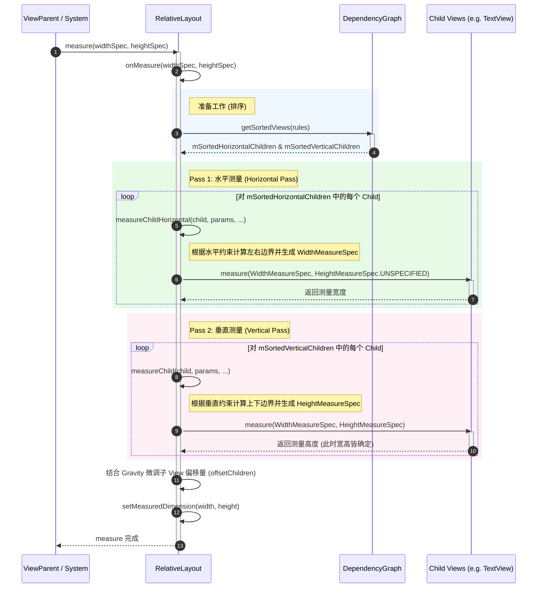
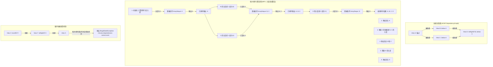

# 5.1.4.1.2 RelativeLayout

## 导言
在 Android 经典 UI 渲染体系中，`RelativeLayout`（相对布局）曾扮演着举足轻重的历史角色。在 `ConstraintLayout`（约束布局）诞生并普及之前，它是开发者用来减少视图树嵌套层级、构建复杂二维排版界面的核心利器。与仅支持单向流式排列的 `LinearLayout` 相比，`RelativeLayout` 允许子视图声明与父容器或其他兄弟视图的相对几何关系，从而在表达重叠、居中对齐、按比例排列等场景时展现出极高的灵活性。

然而，这种强大功能的背后隐藏着沉重的性能代偿。由于相对关系允许子视图在水平和垂直方向上产生独立的依赖纠缠，`RelativeLayout` 在底层必须采用基于有向无环图（DAG）的依赖分析，并在测量（Measure）阶段执行强制的双重测量（Two-pass Measure）机制。当页面结构复杂且发生多层嵌套时，这种测量机制会使底层计算呈指数级增长，成为引发界面掉帧、卡顿的性能隐患。

本文将从 `RelativeLayout` 的相对定位机制与物理实现、双重测量源码、DependencyGraph 拓扑排序算法以及其循环依赖崩溃原理进行深度剖析，并提供其与 `ConstraintLayout` 的性能对比矩阵及现代优化重构策略。

---

## 一、 相对对齐机制与物理实现

`RelativeLayout` 的排版逻辑的核心是**“约束定位”**。与传统 `AbsoluteLayout` 通过指定绝对像素坐标 `(x, y)` 不同，`RelativeLayout` 的子视图是通过声明相对规则（Rules），由父容器在运行时动态计算出每个子视图的几何边界坐标：左边界（`left`）、上边界（`top`）、右边界（`right`）和下边界（`bottom`）。

### 1. 声明属性的分类与映射
子视图通过 `RelativeLayout.LayoutParams` 声明的约束规则可以分为三大类：

#### A. 兄弟视图相对对齐（Sibling-relative Alignment）
这类属性声明了当前 View 边缘相对于另一个兄弟 View 边缘的位置。目标视图必须是同一个 `RelativeLayout` 容器内的其他子视图，且必须显式指定目标视图的 `android:id`：
*   **空间排布**：`layout_toLeftOf`（在某 View 左侧）、`layout_toRightOf`（在某 View 右侧）、`layout_above`（在某 View 上方）、`layout_below`（在某 View 下方）。
*   **边缘对齐**：`layout_alignLeft`（左边缘对齐）、`layout_alignRight`（右边缘对齐）、`layout_alignTop`（上边缘对齐）、`layout_alignBottom`（下边缘对齐）。
*   **文本对齐**：`layout_alignBaseline`（基准线对齐）。对于高度不同或字号不同的文本控件，使其文字的 Baseline 在同一水平线上，能提供更加严谨的视觉体验。

#### B. 父容器相对对齐（Parent-relative Alignment）
这类属性声明了当前 View 相对于父容器 `RelativeLayout` 的几何边界关系，其取值为布尔值（`true` 或 `false`）：
*   **边缘附着**：`layout_alignParentLeft`、`layout_alignParentRight`、`layout_alignParentTop`、`layout_alignParentBottom`。
*   **轴线居中**：`layout_centerHorizontal`（水平居中）、`layout_centerVertical`（垂直居中）、`layout_centerInParent`（父容器内完全居中）。

#### C. 引入 RTL（Right-to-Left）自适应对齐
为了支持阿拉伯语、希伯来语等自右向左书写习惯的国际化布局，Android 4.2（API 17）引入了 RTL 布局适配规则（参考 [AndroidVersionChangeLog.md](../../../../../../AndroidVersionChangeLog.md)）。`RelativeLayout` 相应地增加了以下属性：
*   `layout_toStartOf`、`layout_toEndOf`（替代 `toLeftOf` / `toRightOf`）
*   `layout_alignStart`、`layout_alignEnd`（替代 `alignLeft` / `alignRight`）
*   `layout_alignParentStart`、`layout_alignParentEnd`（替代 `alignParentLeft` / `alignParentRight`）

在运行时，`RelativeLayout` 会根据当前的布局方向（`layoutDirection`，可通过 `View.LAYOUT_DIRECTION_RTL` 或 `View.LAYOUT_DIRECTION_LTR` 查询），在测量前通过 `resolveRules()` 方法将这些抽象的 Start/End 规则动态映射为物理上的 Left/Right 规则。

### 2. 物理承载：`LayoutParams` 中的 `mRules` 数组
在底层实现上，这些规则并没有被存放在复杂的对象中，而是以极其扁平的整型数组形式存放在 `RelativeLayout.LayoutParams` 中。
```java
public static class LayoutParams extends ViewGroup.MarginLayoutParams {
    @ViewDebug.ExportedProperty(resolveId = true, indexMapping = {
        @ViewDebug.IntToString(from = TRUE, to = "true"),
        @ViewDebug.IntToString(from = 0, to = "false/NO_ID")
    }, mapping = {
        @ViewDebug.IntToString(from = ABOVE, to = "above"),
        @ViewDebug.IntToString(from = BELOW, to = "below"),
        // ...
    })
    private int[] mRules = new int[VERB_COUNT];
    
    // 缓存解析后的物理规则，避免重复计算
    private int[] mInitialRules = new int[VERB_COUNT];
    // ...
}
```
*   `VERB_COUNT` 的大小通常为 22。这 22 个索引代表了不同的“动词”（即定位关系类型，如 `BELOW` 的值为 3）。
*   `mRules[VERB]` 存储的数值则是“名词”（即依赖的锚点）。如果值是 0，说明未启用该规则；如果是 `-1`（即 `TRUE`），说明是相对于父容器的规则；如果是大于 0 的正数，说明它是目标兄弟视图的资源 ID。
*   在初始化时，`RelativeLayout` 通过 `resolveRules()` 会执行深拷贝，把 `mInitialRules` 中的原始属性转换，并在 RTL 模式下进行左右对齐的翻转，最终将其存入 `mRules` 数组。布局引擎随后的所有边界推导，都将直接读取这个整型数组，以保证计算速度。

---

## 二、 双重测量（Two-pass Measure）源码级深度解密

### 1. 为什么必须进行双重测量？
在经典的 View 树测量体系中，`ViewGroup` 的职责是根据父容器传入的 `MeasureSpec` 以及子 View 自身的 `LayoutParams`，计算出子 View 的 `MeasureSpec` 并调用子 View 的 `measure()` 方法。
对于 `LinearLayout`（在不设置 `weight` 属性时），其测量过程是一维流式的：它只需要沿着排列方向（横向或纵向）依次测量每个子 View，每次测量时子 View 的尺寸与其它 View 的尺寸没有复杂的双向纠缠，因而只需要一次遍历（Single-pass）就能完成整树测量。

然而，`RelativeLayout` 支持的**横纵双向依赖**打破了这种一维的线性关系。例如：
*   View A 的右侧对齐 View B（水平关系）。
*   View B 的下方对齐 View C（垂直关系）。
*   View C 的高度根据其自身的文字内容决定（`wrap_content`），但其宽度必须与 View A 保持一致（水平对齐）。

在这样的布局网中，水平方向的排布结果会影响垂直方向的边界，而垂直方向的尺寸最终又可能反过来作用于水平约束。如果试图在一次遍历中同时确定子 View 的宽度和高度，系统就会因为“信息缺失”而无法给出精确的值——例如在尚未测量出 View A 的宽度时，就无法计算 View C 的宽度；而在尚未测量出 View C 的高度时，又无法计算 View B 的垂直坐标。

为了破解这种维度纠缠，`RelativeLayout` 底层采取了**维度分步解耦**的设计思想：**在一次 `onMeasure` 调用中，强行将测量拆分为“水平 Pass”和“垂直 Pass”两个独立阶段，即“双重测量”机制。**

### 2. `onMeasure` 源码执行步骤
我们结合 Android 系统源码（以 SDK 29 为主线），深入解密 `RelativeLayout.onMeasure` 的执行逻辑。



#### Step 1：拓扑排序准备
在 `onMeasure` 的起点，`RelativeLayout` 首先检查当前的子 View 列表是否发生了结构性变更。如果有，则调用其内部静态类 `DependencyGraph` 对所有子 View 进行拓扑排序。
排序结果会被分配到两个数组中：
*   `mSortedHorizontalChildren`：排除了垂直依赖、仅按水平依赖关系排序的子视图序列。
*   `mSortedVerticalChildren`：排除了水平依赖、仅按垂直依赖关系排序的子视图序列。
排序的目的是确保：**如果 View A 的定位依赖于 View B，那么在数组中 B 必然排在 A 的前面。当循环遍历数组测量 A 时，B 的几何边界已经是已知的。**

#### Step 2：Pass 1 - 水平方向测量
RelativeLayout 遍历 `mSortedHorizontalChildren`。这一阶段的目标是确定所有子视图的**水平边界（`mLeft`, `mRight`） and 测量宽度（`MeasuredWidth`）**。

1.  **确定左右坐标边界**：
    通过 `applyHorizontalSizeRules(params, myWidth, rules)`，系统检索子 View 的水平规则。
    *   例如，如果设置了 `layout_toLeftOf="@id/viewB"`，系统会查找到 `viewB` 已经计算出的 `left` 坐标（因为拓扑排序保证了 `viewB` 先一步完成计算），并将当前 View 的临时 `right` 坐标设置为 `viewB.left - margin`。
    *   如果没有任何规则限制左边界或右边界，系统会默认以父容器的左边界或右边界为基准。
2.  **生成水平 MeasureSpec 并测量**：
    执行 `measureChildHorizontal(child, params, myWidth, myHeight)` 方法：
    ```java
    private void measureChildHorizontal(View child, LayoutParams params, int myWidth, int myHeight) {
        final int childWidthMeasureSpec = getChildMeasureSpec(
                params.mLeft, params.mRight, params.width,
                params.leftMargin, params.rightMargin,
                mPaddingLeft, mPaddingRight, myWidth);
        
        // 关键点：高度此时完全未知，传入 UNSPECIFIED 或是临时的高度限制
        final int childHeightMeasureSpec;
        if (myHeight < 0 && !mAllowDirectUpdates) { // 历史版本兼容判断
            childHeightMeasureSpec = MeasureSpec.makeMeasureSpec(0, MeasureSpec.UNSPECIFIED);
        } else {
            childHeightMeasureSpec = MeasureSpec.makeMeasureSpec(
                    Math.max(0, myHeight - mPaddingTop - mPaddingBottom - params.topMargin - params.bottomMargin),
                    MeasureSpec.AT_MOST);
        }
        
        // 触发子视图的第一次 measure()
        child.measure(childWidthMeasureSpec, childHeightMeasureSpec);
    }
    ```
    在这次测量中，子 View 的宽度是准确计算出来的，但**高度是一个占位或估算值**。
3.  **计算物理宽度并存储**：
    调用 `positionChildHorizontal()`，根据子 View 刚刚测量返回的 `getMeasuredWidth()`，最终锁定其 `mLeft` 和 `mRight` 坐标。

#### Step 3：Pass 2 - 垂直方向测量
在所有子 View 的水平边界都确定后，`RelativeLayout` 开始遍历 `mSortedVerticalChildren`。这一阶段的目标是确定子视图的**垂直边界（`mTop`, `mBottom`）和最终的测量高度（`MeasuredHeight`）**。

1.  **确定上下坐标边界**：
    通过 `applyVerticalSizeRules(params, myHeight, child.getBaseline())` 结合 `BELOW`、`ABOVE` 等垂直规则，计算并锁定当前 View 的 `mTop` 和 `mBottom` 坐标。
2.  **生成最终 MeasureSpec 并执行二次测量**：
    调用 `measureChild(child, params, myWidth, myHeight)` 方法。由于我们在 Pass 1 中已经计算出了该 View 的准确宽度与水平坐标，在 Pass 2 中，系统可以为子 View 提供极其准确的 `childWidthMeasureSpec`（通常是带有 `EXACTLY` 模式的精确宽度），同时结合 Pass 2 计算出的上下边界，生成 `childHeightMeasureSpec`。
    ```java
    private void measureChild(View child, LayoutParams params, int myWidth, int myHeight) {
        // 使用 Pass 1 锁定的 mLeft 和 mRight 重新计算精确的宽度 MeasureSpec
        final int childWidthMeasureSpec = MeasureSpec.makeMeasureSpec(
                params.mRight - params.mLeft, MeasureSpec.EXACTLY);
                
        // 计算精确的高度 MeasureSpec
        final int childHeightMeasureSpec = getChildMeasureSpec(
                params.mTop, params.mBottom, params.height,
                params.topMargin, params.bottomMargin,
                mPaddingTop, mPaddingBottom, myHeight);
        
        // 触发子视图的第二次 measure()
        child.measure(childWidthMeasureSpec, childHeightMeasureSpec);
    }
    ```
    这一次，子 View 接收到了准确的横纵双向约束，其内部的测量引擎会计算出精确的最终尺寸。

#### Step 4：Gravity 对齐与整体偏移量微调
在所有子 View 的四轴物理坐标（`mLeft`, `mRight`, `mTop`, `mBottom`）全部得出后，若父容器 `RelativeLayout` 的 `gravity` 不是默认的左上角对齐（例如设置了 `CENTER` 或 `BOTTOM`），则在最后一步通过 `offsetChildren()` 方法对所有子 View 的物理坐标进行一次偏移校正。例如，若是垂直居中对齐，则将所有子视图在垂直轴上整体向下平移 `(RelativeLayoutHeight - TotalChildrenHeight) / 2` 像素。

### 3. 多层嵌套下的“指数级性能恶化”
虽然在单一平级布局中，每个 View 测量两次的开销微不足道，但当界面中存在多层嵌套的 `RelativeLayout` 时，该机制就会产生灾难性的后果。

假设有一颗树形结构，其深度为 $N$，所有节点均由 `RelativeLayout` 组成：
*   **根节点 (Layer 1)**：被系统触发 `measure`，进入其 `onMeasure` 逻辑。它会对第二层（Layer 2）的直接子视图分别发起**至少 2 次测量**（Pass 1 与 Pass 2）。
*   **第二层节点 (Layer 2)**：因为根节点发起了 2 次测量，每一个 Layer 2 的 `RelativeLayout` 都会被触发两次 `onMeasure`。而在它自身的 `onMeasure` 内部，又会对其直接子视图（Layer 3）发起 2 次测量。因此，第三层节点在这一轮中将接收到 $2 \times 2 = 4$ 次测量。
*   **第 $N$ 层节点**：以此类推，位于树的第 $N$ 层的叶子节点（例如底部的 `TextView` 或 `ImageView`），最终在单帧渲染中被触发 `measure()` 方法的次数将高达：
    $$T(N) = 2^N$$

若 $N = 4$（这在旧项目的复杂列表项或复杂详情页中非常常见），底部的叶子视图单帧内会被强制执行 $2^4 = 16$ 次 `measure()`。
在 Android UI 系统的黄金渲染时限内，如果包含复杂的 `TextView` 控件，由于文本的字体度量（Font Metrics）、折行排版（Layout StaticLayout）等计算极其消耗 CPU，多达 16 次的重复测量会导致主线程被严重阻塞。
这会导致渲染流水线（Choreographer）在 VSync 信号到达时无法按时完成 `measure` -> `layout` -> `draw` 过程，产生“掉帧（Jank）”，表现为用户的肉眼可见的滑动卡顿。

---

## 三、 循环依赖检测：DependencyGraph 机制

由于 `RelativeLayout` 允许子 View 之间自由设定相对约束，如何确保这些相互交织的约束关系能够被合理、有序地计算，是布局引擎必须解决的算法问题。

### 1. 有向无环图（DAG）的构建
在图论中，我们可以将 `RelativeLayout` 的排版抽象为以下模型：
*   **节点（Vertex/Node）**：每个子 View 代表一个节点。
*   **有向边（Directed Edge）**：若 View A 声明其位置依赖于 View B（例如 `layout_below="@id/B"`），则存在一条**由 B 指向 A 的有向边（B $\to$ A）**。这代表 B 是 A 的前置条件（祖先），必须先计算出 B 的坐标，才能推导 A 的坐标。

为了使排版计算能够按部就班地完成，这幅关系图必须是一个**有向无环图（Directed Acyclic Graph, DAG）**。如果图中包含闭环（例如 A $\to$ B $\to$ A），则说明逻辑上陷入了循环引用（A 依赖 B，而 B 又依赖 A），布局引擎将无法确定谁是计算的起点，从而导致计算死锁。

### 2. 源码级解密：`DependencyGraph` 与拓扑排序
`RelativeLayout` 内部的静态辅助类 `DependencyGraph` 负责在每次视图发生结构变化时重新构建依赖网，并采用拓扑排序算法输出可行的测量顺序。

#### A. 核心数据结构
`DependencyGraph` 的核心结构如下：
```java
private static class DependencyGraph {
    // 图中所有节点的集合
    private ArrayList<Node> mNodes = new ArrayList<Node>();
    // Key 为子 View 的 ID，Value 为对应的 Node，便于根据 ID 快速寻点
    private SparseArray<Node> mKeyNodes = new SparseArray<Node>();
    // 存储当前入度（依赖数）为 0 的所有叶子根节点，用于拓扑排序的初始化队列
    private ArrayDeque<Node> mRoots = new ArrayDeque<Node>();

    static class Node {
        View view;
        // 当前节点所依赖的前置节点集合（自己作为后继）
        final SparseArray<Node> dependents = new SparseArray<Node>();
        // 依赖当前节点的后继节点集合（自己作为前置）
        final ArrayMap<Node, DependencyGraph> dependencies = new ArrayMap<Node, DependencyGraph>();
        
        // 对象池优化：回收 Node 对象避免内存抖动
        static final Pools.SynchronizedPool<Node> sPool = new Pools.SynchronizedPool<Node>(100);
        
        static Node acquire(View view) {
            Node node = sPool.acquire();
            if (node == null) {
                node = new Node();
            }
            node.view = view;
            return node;
        }
        
        void release() {
            view = null;
            dependents.clear();
            dependencies.clear();
            sPool.release(this);
        }
    }
}
```

#### B. 拓扑排序算法流程 (`getSortedViews`)
当调用 `getSortedViews(View[] sorted, int... rules)` 时，`DependencyGraph` 遵循经典的**入度递减拓扑排序算法（基于 Kahn 算法变种）**来计算出正确的渲染顺序：



##### 算法详细实现步骤：
1.  **建图**：遍历所有子 View 并封装为 `Node`。对每个 `Node`，遍历其 `LayoutParams` 中的 `mRules`。如果是有效的依赖 ID，则从 `mKeyNodes` 找到目标祖先节点，在两节点间建立双向关系：将祖先节点加入到当前节点的 `dependents`（入度集合）中，同时将当前节点加入到祖先节点的 `dependencies`（出度集合）中。
2.  **寻找无依赖节点（Roots）**：清空 `mRoots` 队列。遍历 `mNodes` 中的每一个 `Node`。如果一个节点的 `dependents` 集合长度为 0（即该 View 在该维度上没有依赖任何其他 View，入度为 0），代表它可以独立被确定位置，直接将其放入 `mRoots` 队列中。
3.  **循环剥离依赖与输出**：
    ```java
    final ArrayDeque<Node> roots = mRoots;
    int count = 0;
    
    while (roots.size() > 0) {
        // 从队列头部取出一个入度为 0 的节点
        final Node node = roots.dequeue();
        final View view = node.view;
        final int key = view.getId();
        
        // 将该 View 填入最终的排序输出数组中
        sorted[count++] = view;
        
        // 遍历所有依赖当前节点的后继节点（即它的子孙节点）
        final ArrayMap<Node, DependencyGraph> dependencies = node.dependencies;
        final int numDependencies = dependencies.size();
        for (int i = 0; i < numDependencies; i++) {
            final Node dependency = dependencies.keyAt(i);
            final SparseArray<Node> dependents = dependency.dependents;
            
            // 剥离这层依赖关系（相当于将后继节点的入度减 1）
            dependents.remove(key);
            
            // 如果该后继节点的所有依赖都被剥离（入度降为 0），说明它的所有前置节点已排好序
            // 立即将其加入队列中
            if (dependents.size() == 0) {
                roots.add(dependency);
            }
        }
    }
    ```
4.  **环路检测校验**：
    在排序逻辑结束后，系统检查 `count`（排好序输出的节点数量）是否等于 `sorted.length`（图中的总节点数）。
    如果 `count < sorted.length`，说明图中存在环。因为环路中的节点入度相互支撑，没有任何一个节点能降为 0，它们因此无法进入 `mRoots` 队列，算法中途提前中止。
    此时，RelativeLayout 会直接抛出运行时崩溃异常：
    ```java
    if (count < sorted.length) {
        throw new IllegalStateException("Circular dependencies cannot exist in RelativeLayout");
    }
    ```

### 3. 崩溃陷阱：经典循环依赖案例分析
在 XML 开发过程中，循环依赖绝大多数是由于在编写复杂页面时，拼写错误或复制粘贴属性导致了逻辑闭环。

#### 崩溃示例 XML：
```xml
<RelativeLayout xmlns:android="http://schemas.android.com/apk/res/android"
    android:layout_width="match_parent"
    android:layout_height="match_parent">

    <TextView
        android:id="@+id/tv_title"
        android:layout_width="wrap_content"
        android:layout_height="wrap_content"
        android:layout_toLeftOf="@id/iv_avatar"
        android:text="Title" />

    <ImageView
        android:id="@+id/iv_avatar"
        android:layout_width="wrap_content"
        android:layout_height="wrap_content"
        android:layout_toRightOf="@id/tv_title"
        android:src="@drawable/avatar" />

</RelativeLayout>
```
#### 崩溃原理刨析：
1.  在构建水平图时，系统发现 `tv_title` 声明了 `layout_toLeftOf="@id/iv_avatar"`，因此 `tv_title` 的 `dependents` 集合中添加了 `iv_avatar`（入度为 1）。
2.  同时，`iv_avatar` 声明了 `layout_toRightOf="@id/tv_title"`，因此 `iv_avatar` 的 `dependents` 集合中添加了 `tv_title`（入度为 1）。
3.  在进行第二步筛选 `mRoots` 时，系统遍历整个列表，发现没有任何一个节点的 `dependents.size() == 0`。
4.  `mRoots` 队列为空，拓扑排序的 `while` 循环根本不会执行。
5.  最终，`count` 为 0，而 `sorted.length` 为 2。
6.  系统判定存在循环依赖，直接抛出 `IllegalStateException: Circular dependencies cannot exist in RelativeLayout`，APP 发生运行时闪退。

---

## 四、 性能损耗与现代化替代（ConstraintLayout）

随着 Android 设备屏幕的碎片化以及用户界面复杂度的攀升，传统的布局方案越来越难以支撑高性能页面的渲染需求。因此，谷歌在 2016 年推出了 `ConstraintLayout`（约束布局），并在现代 Android 开发中将其立为推荐的核心布局容器。

### 1. 核心布局容器对比矩阵

| 对比维度 | LinearLayout (无 Weight) | LinearLayout (有 Weight) | RelativeLayout | ConstraintLayout |
| :--- | :--- | :--- | :--- | :--- |
| **层级结构** | 易产生嵌套，表达二维关系差 | 易产生嵌套，表达二维关系差 | 较好，能实现一定程度的扁平化 | 极佳，几乎可做到单层完全扁平化 |
| **平均测量次数** | $1$ 次 | $2$ 次 | $2$ 次 | $1 \sim 2$ 次（支持高度智能的缓存） |
| **嵌套时的测量复杂度** | 线性增长 $O(N)$ | 指数增长 $O(2^N)$ | 极速指数增长 $O(2^N)$ | 接近线性增长 $O(N)$ |
| **复杂约束表达能力** | 极差，仅支持单向流式排列 | 较差，仅支持比例划分 | 中等，仅支持基本的相对锚定 | 极强，支持 Barrier, Group, Chain, Flow 等 |
| **核心算法/机制** | 顺序线性累加 | 二阶段比重划分 | DAG 拓扑排序 + 横纵双重测量 | Cassowary 线性方程求解器 |
| **性能表现** | 极高（单次轻量级测量） | 中等（多次测量） | 较低（深层嵌套下极其恶劣） | 极高（规避了多重嵌套的测量损耗） |

### 2. 为什么扁平化布局首选 ConstraintLayout？

`ConstraintLayout` 在解决 `RelativeLayout` 的测量性能痛点上，实现了技术跨越：

#### A. Cassowary 算法的线性方程求解
`ConstraintLayout` 的约束关系并不像 `RelativeLayout` 那样强行将水平和垂直方向解耦成两次独立的测量 Pass，而是将页面中所有声明的几何约束条件（如对齐、边距、比例、链条等）全部抽象为一组**线性方程与不等式组**。
底层集成的 **Cassowary 求解器** 能够在接近线性（Linear-time）的时间复杂度内求解这组方程，一次性算出所有子 View 的精确坐标。这种算法规避了多次拓扑排序和横纵解耦带来的重复物理测量开销。

#### B. 智能的渲染缓存（Smart Cache）
`ConstraintLayout` 引入了强大的状态缓存机制。当界面发生刷新（例如触发 `requestLayout`）时，如果子视图的边界约束和父容器的大小未发生改变，约束求解器会直接返回缓存的坐标和大小，拦截物理 `measure()` 的向下分发。这使得在多次布局刷新时，实际的物理测量次数逼近 $O(1)$，对复杂的动态页面非常友好。

#### C. 虚拟辅助对象（Virtual Helpers）消除物理嵌套
在 `RelativeLayout` 中，我们如果想让几个 View 组合成一个相对单元，或者在某些复杂对其场景下，不得不引入嵌套的 `LinearLayout` 充当中间媒介。
而在 `ConstraintLayout` 中，谷歌引入了许多不参与绘制、不占用实际 View 节点的“虚拟辅助对象”：
*   **Barrier（屏障）**：能够动态监测一组 View 的最大边界，并作为一个临时的单侧约束锚点。
*   **Group（组）**：允许直接控制一组 View 的可见性，而不需要用一个额外的父布局来包裹它们。
*   **Guideline（引导线）**：支持百分比或物理距离的定位引导。
这些辅助对象只存在于内存的约束解析层，在最终的 View 树渲染中不占用任何层级。这使得开发者能够在一层物理结构下表达几乎所有的复杂设计，将原本的嵌套深度降到最低，完美规避了指数级测量的放大效应。

---

## 五、 RelativeLayout 性能优化实战方案

在老旧系统重构或短期内无法整体替换为 `ConstraintLayout` 的业务场景下，如果必须要使用或维护 `RelativeLayout`，应采取以下优化策略以维持应用的流畅度：

### 1. 规避 `RelativeLayout` 自身尺寸的 `wrap_content`
若将 `RelativeLayout` 的宽或高设置为 `wrap_content`，布局引擎的计算压力会大幅增加。
在测量过程中，`RelativeLayout` 不仅要根据父容器 spec 确定内部子 View 的相对坐标，还要在所有子 View 测量完后重新归纳子 View 的最大边界，以修正自身的大小。如果自身的大小发生修正，意味着所有子 View 必须配合新的父容器大小重新计算边界。这会触发额外的测量周期。
**优化建议**：尽可能将 RelativeLayout 的宽或高设置为 `match_parent` 或指定精确的像素值（如 `120dp`）。

### 2. 避免嵌套 RelativeLayout
嵌套是性能退化的万恶之源。在实际开发中，应严格禁止 `RelativeLayout` 的嵌套。
*   如果仅需要完成一维方向的单流排列，请直接使用**无 weight 属性的 LinearLayout**，其单次测量的特性具有最高的性能。
*   如果遇到必须使用二维定位的局部区域，应保持该区域的精简性，将影响控制在视图树的局部叶子节点上，防止指数级测量向下传播。

### 3. 渐进式扁平化重构路线
对于在性能监控（如 CPU Profiler 或 Systrace）中被检测为“耗时大户”的复杂页面：
1.  **第一步**：使用 Layout Inspector 导出当前界面的 View 树，寻找深度大于 3 且包含 RelativeLayout 嵌套的分支。
2.  **第二步**：将这一分支标记为重构目标。在不修改子 View 具体业务逻辑的前提下，将外层嵌套的 RelativeLayout 和 LinearLayout 剥离，统一替换为单层的 `ConstraintLayout`。
3.  **第三步**：将子 View 之间的定位关系转化为 ConstraintLayout 的属性，利用 `ConstraintHelper`（如 Barrier、Flow）代替原有嵌套布局所承担的功能，彻底打平布局。

---

## 延伸阅读
*   关于 Android UI 系统的整体测量与绘制流程，可参阅 [docs/5.Android/5.1.基础/5.1.4.UI体系与资源/5.1.4.2.绘制流程.md](../../../../../docs/5.Android/5.1.基础/5.1.4.UI体系与资源/5.1.4.2.绘制流程.md)。
*   Android 核心版本变化中关于布局机制 and 适配要求的演进，详见根目录下的 [AndroidVersionChangeLog.md](../../../../../../AndroidVersionChangeLog.md)。
