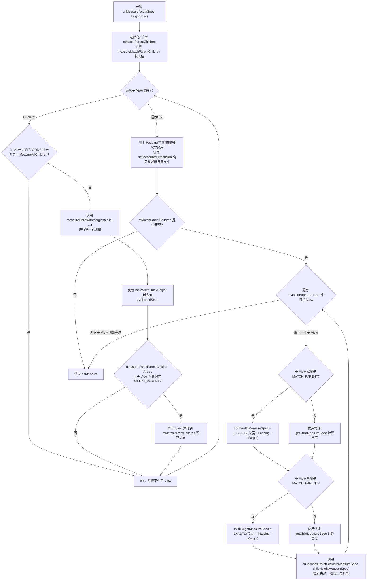

# 5.1.4.1.3 FrameLayout

`FrameLayout`（帧布局）是 Android 视图体系中最简单、最轻量的布局容器之一。其核心设计初衷是为了在屏幕上开辟一片空白区域，并在这片区域内以“叠罗汉”的形式堆叠排列子视图（Subviews）。

本文将从视图排布机制、应用场景演进、`onMeasure` 源码级深度剖析与二次测量、`onLayout` 物理定位逻辑与坐标公式推导、以及 `Foreground`（前台修饰）绘制细节与版本演进等维度，对 `FrameLayout` 进行系统性探讨。

---

## 1. 视图重叠排布与应用场景

### 1.1 视图堆叠机制
`FrameLayout` 的布局逻辑基于简单的空间层级累加。在默认情况下，所有添加到 `FrameLayout` 中的子 View 都会锚定在容器的左上角（Top-Left）。后添加的子 View 会直接覆盖在先添加的子 View 之上。

这一特性由 `FrameLayout` 并没有像 `LinearLayout` 那样维护子视图的线性排列方向（Orientation），也没有像 `RelativeLayout` 那样维护复杂的视图依赖拓扑图所决定。它仅仅是将子视图当成一个个独立的“帧”（Frame），并在绘制时按照子视图加入容器的顺序（即 `ViewGroup` 内部的 `mChildren` 数组顺序）依次调用 `draw()` 方法。这种简单性使其拥有极高的测量与布局效率，在特定场景下能够提供优于其他复杂布局的性能表现。

### 1.2 核心应用场景与现代演进

#### 1. Fragment 容器占位的演进：从 FrameLayout 到 FragmentContainerView
这是 `FrameLayout` 最经典的使用方式。由于 `Fragment` 的切换通常是互斥的（即同一时间只有一个 `Fragment` 可见），使用轻量级的 `FrameLayout` 作为承载 `Fragment` 视图的容器，可以避免引入不必要的测量开销。

然而，在 Android Jetpack 库中，Google 强烈推荐使用 `FragmentContainerView` 代替 `FrameLayout` 作为 Fragment 容器。`FragmentContainerView` 虽然继承自 `FrameLayout`，但专门修复了 `FrameLayout` 承载 Fragment 时的以下三大历史痛点：
* **Window Insets 分发缺陷**：
  在 Android 的窗口 Insets 分发机制中（例如处理状态栏、导航栏或输入法键盘遮挡），默认的 `ViewGroup` 在消耗了 Insets 之后，不会再主动将其向下分发给同级或后代的其他视图。对于 `FrameLayout`，如果存在多个重叠的 Fragment，第一个 Fragment 消耗了 Insets 后，同级的其他 Fragment 就会丢失 Insets 信息，导致页面布局显示异常。`FragmentContainerView` 重写了 `dispatchApplyWindowInsets` 方法，确保将 Insets 独立且完整地分发给它所承载的每一个 Fragment 子视图。
* **重叠 Fragment 的绘制顺序（Z-Order 排序）与转场动画异常**：
  当对 Fragment 执行退出（Exit）和进入（Enter）的转场动画时，`FrameLayout` 仅仅根据子 View 在 `mChildren` 数组中的物理索引来绘制视图。这经常导致退出动画的 Fragment 遮挡住正在进入的 Fragment，产生闪烁或错位。`FragmentContainerView` 通过重写 `drawChild` 并提供自定义的绘制顺序逻辑，保证正在执行进入动画的 Fragment 总是绘制在退出动画的 Fragment 之上。
* **动态添加限制**：
  `FragmentContainerView` 限制了只能通过 `Fragment` 相关的事务来操作子 View，防止开发者在 XML 中误将非 Fragment 的普通 View 直接声明在其中，确保了容器职责的单一性。

#### 2. 状态覆盖层（Loading/Error/Empty/Skeleton View）
在网络请求或页面初始化时，常需要在正常内容之上覆盖一层加载中（Loading）动画、错误重试提示或空白页。将内容布局和这些状态页放入同一个 `FrameLayout`，通过动态控制各状态视图的 `Visibility`（`VISIBLE` / `GONE`），能够实现极度平滑的视图状态切换。

#### 3. 前台修饰与遮罩效果
例如点击态的半透明蒙层、高亮引导层（Guide Mask）、圆角边框图层等。利用其后进先出的覆盖原则，将修饰视图置于布局声明的底部，从而使其盖在所有内容之上。

#### 4. 悬浮控件与快捷入口
如右下角的悬浮按钮（Floating Action Button, FAB）、滑动返回的防爆触边缘层等，利用 `layout_gravity` 属性将其锚定在特定的物理边界。

### 1.3 mMeasureAllChildren 属性与 GONE 视图的深度分析
在默认情况下，`FrameLayout` 不会测量 Visibility 为 `GONE` 的子 View。然而，`FrameLayout` 包含一个关键成员变量 `mMeasureAllChildren`。当该属性被置为 `true`（可以通过 XML 中的 `android:measureAllChildren="true"` 或在代码中调用 `setMeasureAllChildren(true)`）时，即使子 View 的 Visibility 为 `GONE`，它仍然会被强制执行测量，并且其测量得出的尺寸会被累加到 `maxWidth` 和 `maxHeight` 的计算中。

该属性主要适用于以下场景：
* **规避布局抖动（Layout Jitter）**：某些动态隐藏的视图如果大小经常发生变化，会导致父容器频繁收缩。开启该标志位可以使得父容器的大小始终维持在包含所有子 View 时的最大尺寸，避免引起周围其他视图发生突兀的跳跃。
* **动画预热**：某些动画在执行前需要将 View 从 GONE 切换至 VISIBLE。在 GONE 状态下提前执行测量，可以避免在动画启动瞬间由于临时触发 Measure 带来的帧卡顿（Jank）。

然而，开启 `mMeasureAllChildren` 会带来额外的性能损耗：
* **无效测量负担**：原本可以被跳过的 GONE 子视图（甚至其嵌套的子树）现在必须全量执行 `measure()`。如果这些隐藏视图内部结构非常复杂，将产生严重的 CPU 浪费。
* **触发不必要的二次测量**：如果被隐藏（GONE）的子 View 其宽高刚好设置为了 `match_parent`，一旦开启该标志位，它同样会被加入到 `mMatchParentChildren` 列表中，从而强制 FrameLayout 在 wrap_content 模式下执行二次测量。这会导致即使界面上什么都没显示，也照样承受了双倍的布局测量损耗。

### 1.4 优缺点与性能对比
* **优点**：结构极其简单，首轮测量仅进行单次 O(N) 遍历。在不触发“二次测量”的情况下，它是 Android 所有标准 ViewGroup 中运行效率最高的容器。
* **缺点**：不具备自动规避覆盖的能力。如果需要子视图之间不重叠且按特定相对位置排列，`FrameLayout` 将无能为力，强行使用会产生大量的 `Margin` 魔法值，导致代码脆弱且难以适配不同屏幕尺寸。

---

## 2. onMeasure 源码级深度剖析

`FrameLayout` 的 `onMeasure` 流程是其最核心的源码逻辑所在。虽然它相对简单，但为了处理子 View 设置为 `match_parent` 且父容器为 `wrap_content` 这种特殊冲突，它引入了**二次测量（Two-pass Measure）**机制。

### 2.1 第一轮遍历：测量子 View 并收集信息
在第一轮测量中，`FrameLayout` 会遍历所有子视图，调用它们的 `measure` 方法，并计算出容器初步所需的尺寸。

以下是 `FrameLayout.onMeasure` 的核心代码逻辑片段（基于 Android AOSP 源码分析）：

```java
@Override
protected void onMeasure(int widthMeasureSpec, int heightMeasureSpec) {
    int count = getChildCount();

    // 标志位：是否需要针对 match_parent 的子 View 进行二次测量
    final boolean measureMatchParentChildren =
            MeasureSpec.getMode(widthMeasureSpec) != MeasureSpec.EXACTLY ||
            MeasureSpec.getMode(heightMeasureSpec) != MeasureSpec.EXACTLY;
    
    // 清空上次二次测量的子 View 暂存列表
    mMatchParentChildren.clear();

    int maxHeight = 0;
    int maxWidth = 0;
    int childState = 0;

    // 1. 第一轮遍历：测量所有子 View
    for (int i = 0; i < count; i++) {
        final View child = getChildAt(i);
        // 默认不测量 GONE 属性的子 View，除非 mMeasureAllChildren 设为 true
        if (mMeasureAllChildren || child.getVisibility() != GONE) {
            // 调用常规的 measureChildWithMargins 来测量子视图
            measureChildWithMargins(child, widthMeasureSpec, 0, heightMeasureSpec, 0);
            final LayoutParams lp = (LayoutParams) child.getLayoutParams();
            
            // 累加计算子视图占用的最大宽度 and 高度（包含 Margin）
            maxWidth = Math.max(maxWidth,
                    child.getMeasuredWidth() + lp.leftMargin + lp.rightMargin);
            maxHeight = Math.max(maxHeight,
                    child.getMeasuredHeight() + lp.topMargin + lp.bottomMargin);
            
            // 合并子视图的测量状态（用于支持多类型尺度的测量规范）
            childState = combineMeasuredStates(childState, child.getMeasuredState());
            
            // 如果父容器本身不是 EXACTLY 模式，且子 View 宽或高为 MATCH_PARENT
            // 则需要将其加入暂存列表，以备在第二轮测量中重新测定其尺寸
            if (measureMatchParentChildren) {
                if (lp.width == LayoutParams.MATCH_PARENT ||
                        lp.height == LayoutParams.MATCH_PARENT) {
                    mMatchParentChildren.add(child);
                }
            }
        }
    }

    // 加上 FrameLayout 自身的 Padding 尺寸
    maxWidth += getPaddingLeftWithForeground() + getPaddingRightWithForeground();
    maxHeight += getPaddingTopWithForeground() + getPaddingBottomWithForeground();

    // 考虑背景的最小宽度/高度以及前景的最小尺寸要求
    maxHeight = Math.max(maxHeight, getSuggestedMinimumHeight());
    maxWidth = Math.max(maxWidth, getSuggestedMinimumWidth());

    // 考虑前景 Drawable 的大小
    final Drawable drawable = getForeground();
    if (drawable != null) {
        maxHeight = Math.max(maxHeight, drawable.getIntrinsicHeight());
        maxWidth = Math.max(maxWidth, drawable.getIntrinsicWidth());
    }

    // 确定 FrameLayout 自身的测量宽高
    setMeasuredDimension(resolveSizeAndState(maxWidth, widthMeasureSpec, childState),
            resolveSizeAndState(maxHeight, heightMeasureSpec,
                    childState << MEASURED_HEIGHT_STATE_SHIFT));
    
    // 2. 第二轮遍历的触发决策与执行
    // ... （下文详解）
}
```

#### `measureChildWithMargins` 的角色与 Margin 计算
在上述循环中，`measureChildWithMargins` 承担了将父容器的 `MeasureSpec` 转换为子 View 的 `MeasureSpec` 的工作。它不仅考虑了父容器的 Padding，还扣除了子 View 自身的 Margin 空间：

```java
protected void measureChildWithMargins(View child,
        int parentWidthMeasureSpec, int widthUsed,
        int parentHeightMeasureSpec, int heightUsed) {
    final MarginLayoutParams lp = (MarginLayoutParams) child.getLayoutParams();

    // 计算子 View 的 MeasureSpec
    final int childWidthMeasureSpec = getChildMeasureSpec(parentWidthMeasureSpec,
            mPaddingLeft + mPaddingRight + lp.leftMargin + lp.rightMargin
                    + widthUsed, lp.width);
    final int childHeightMeasureSpec = getChildMeasureSpec(parentHeightMeasureSpec,
            mPaddingTop + mPaddingBottom + lp.topMargin + lp.bottomMargin
                    + heightUsed, lp.height);

    child.measure(childWidthMeasureSpec, childHeightMeasureSpec);
}
```

### 2.2 二次测量（Two-pass Measure）剖析

#### 触发条件与 mNeedsSecondMeasure 标志位分析
在 AOSP 早期源码中，二次测量由布尔值 `mNeedsSecondMeasure` 标志位所控制，后来该标志位被重构为了局部变量 `measureMatchParentChildren` 结合 `mMatchParentChildren` 列表的尺寸来控制。

二次测量的触发核心是：
1. **父容器的宽高测量模式中至少有一个不是 `EXACTLY`**（即 `AT_MOST` 或 `UNSPECIFIED`，常见于布局宽或高声明为 `wrap_content`）。
2. **子 View 的布局参数中，对应维度声明为 `MATCH_PARENT`**。

#### 为什么要二次测量？
当父容器的尺寸由子 View 决定（`wrap_content`），同时又存在某个子 View 要求填充父容器（`match_parent`）时，就会产生逻辑上的**环形依赖**：
* 父容器的尺寸取决于最宽/最高的子 View。
* `match_parent` 的子 View 的尺寸又取决于父容器的尺寸。

为了打破这种死锁，`FrameLayout` 采取了分两步走的策略：
1. **第一步（第一轮遍历）**：对所有子 View 进行初始测量。对于 `match_parent` 的子 View，它的测量尺寸暂时不能反映其真实的填充需求（因为此时父 View 的尺寸还没最终确定，只是通过常规的 `getChildMeasureSpec` 计算出了一个临时大小），但其他非 `match_parent` 的视图能够确定其尺寸。
2. **第二步（计算父尺寸）**：利用第一轮遍历得出的最大子 View 尺寸去确定 `FrameLayout` 自身的 MeasuredSize。
3. **第三步（第二轮遍历）**：既然父容器的尺寸已经确定了，那么之前那些处于等待状态的 `match_parent` 子 View 就能够拿到确切的填充尺寸了。此时，`FrameLayout` 会重构它们的 `MeasureSpec` 为 `EXACTLY` 模式，并强制它们执行第二次测量。

#### 二次测量的核心源码实现

```java
    // 承接上文 onMeasure 代码中 setMeasuredDimension 之后
    count = mMatchParentChildren.size();
    if (count > 1) { // 只有在 matchParentChildren 列表不为空时才处理
        for (int i = 0; i < count; i++) {
            final View child = mMatchParentChildren.get(i);
            final MarginLayoutParams lp = (MarginLayoutParams) child.getLayoutParams();

            int childWidthMeasureSpec;
            // 如果子 View 宽是 MATCH_PARENT
            if (lp.width == LayoutParams.MATCH_PARENT) {
                // 计算其确切的可用宽度 = 容器宽度 - padding - margin
                final int width = Math.max(0, getMeasuredWidth()
                        - getPaddingLeftWithForeground() - getPaddingRightWithForeground()
                        - lp.leftMargin - lp.rightMargin);
                // 构造 EXACTLY 测量规格，约束其必须等于该宽度
                childWidthMeasureSpec = MeasureSpec.makeMeasureSpec(width, MeasureSpec.EXACTLY);
            } else {
                // 否则，仍按第一轮的常规模式重新生成 MeasureSpec
                childWidthMeasureSpec = getChildMeasureSpec(widthMeasureSpec,
                        getPaddingLeftWithForeground() + getPaddingRightWithForeground() +
                        lp.leftMargin + lp.rightMargin,
                        lp.width);
            }

            int childHeightMeasureSpec;
            // 如果子 View 高是 MATCH_PARENT
            if (lp.height == LayoutParams.MATCH_PARENT) {
                // 计算其确切的可用高度 = 容器高度 - padding - margin
                final int height = Math.max(0, getMeasuredHeight()
                        - getPaddingTopWithForeground() - getPaddingBottomWithForeground()
                        - lp.topMargin - lp.bottomMargin);
                // 构造 EXACTLY 测量规格
                childHeightMeasureSpec = MeasureSpec.makeMeasureSpec(height, MeasureSpec.EXACTLY);
            } else {
                childHeightMeasureSpec = getChildMeasureSpec(heightMeasureSpec,
                        getPaddingTopWithForeground() + getPaddingBottomWithForeground() +
                        lp.topMargin + lp.bottomMargin,
                        lp.height);
            }

            // 触发子视图的二次 measure 过程
            child.measure(childWidthMeasureSpec, childHeightMeasureSpec);
        }
    }
}
```

### 2.3 resolveSizeAndState 源码深度剖析
In 第一轮测量结束后，`FrameLayout` 调用了 `resolveSizeAndState` 来最终确定自身的测量宽高。这是所有自定义 View 和布局容器都应遵循的系统级规范方法。其内部源码如下：

```java
public static int resolveSizeAndState(int size, int measureSpec, int childMeasuredState) {
    final int specMode = MeasureSpec.getMode(measureSpec);
    final int specSize = MeasureSpec.getSize(measureSpec);
    int result;
    switch (specMode) {
        case MeasureSpec.AT_MOST:
            if (specSize < size) {
                // 如果父容器限制的最大大小小于子 View 期望的大小
                // 则妥协为父容器限制的大小，并打上 MEASURED_STATE_TOO_SMALL 标志位
                result = specSize | MEASURED_STATE_TOO_SMALL;
            } else {
                result = size;
            }
            break;
        case MeasureSpec.EXACTLY:
            result = specSize;
            break;
        case MeasureSpec.UNSPECIFIED:
        default:
            result = size;
            break;
    }
    return result;
}
```

* **`MEASURED_STATE_TOO_SMALL` 标志位**：
  当 FrameLayout 所需要的尺寸（由所有子 View 撑开）超过了外部父容器给定的限制（`specSize`）时，`resolveSizeAndState` 不仅会将结果限制在 `specSize`，还会在其高位上通过按位或（`|`）运算，标记上 `MEASURED_STATE_TOO_SMALL`。
  这个状态最终会随着 `getMeasuredWidthAndState()` 等方法向上传递。父容器（如 `ScrollView` 或 `RecyclerView`）可以通过读取该状态，得知这个 `FrameLayout` 实际上已经被迫“缩减”了空间，从而做出进一步的布局调整或策略响应。这体现了 Android 视图测量体系中完善的**向下协商与向上反馈**机制。

### 2.4 测量缓存机制与性能影响
尽管 `FrameLayout` 依靠二次测量解决了嵌套冲突，但也导致了某些子 View 的 `measure()` 方法在单次布局流程中被执行了两次。

为了缓解这带来的性能损耗，Android 视图系统在基类 `View` 中设计了**测量缓存机制（Measure Cache）**。其核心逻辑维护在 `View.measure()` 方法内：

1. **缓存字段**：`View` 内部保留了 `mOldWidthMeasureSpec`、`mOldHeightMeasureSpec` 两个成员变量以及一个 `mMeasureCache`（`LongSparseLongArray` 类型的哈希表，通过强类型组合 `(widthSpec << 32) | heightSpec` 作为 key，MeasuredDimensions 作为 value）。
2. **命中校验**：当 `View.measure()` 被调用时，会首先检查：
   * 是否没有设置强制布局标志位 `PFLAG_FORCE_LAYOUT`。
   * 本次传入的两个 `MeasureSpec` 是否与 `mOldWidthMeasureSpec` 和 `mOldHeightMeasureSpec` 完全一致。
   * 如果上述条件均满足，则说明本次测量规格未发生变化且不需要强制重绘，此时会绕过 `onMeasure` 的执行，直接读取缓存的尺寸返回。
3. **针对二次测量的情况**：
   * 第一次测量时，`match_parent` 的子 View 得到的是非 EXACTLY 模式或临时宽度的 Spec（例如 `AT_MOST` 约束）。
   * 第二次测量时，`FrameLayout` 计算出自己的尺寸后，强行将 Spec 改为 `EXACTLY`，并指定了具体的像素值。
   * 由于**前后的 `MeasureSpec` 的模式（Mode）和大小（Size）均发生了本质变化**，缓存检查机制判定“未命中”，从而导致子 View 必须重新执行内部的 `onMeasure` 函数体。
   * 如果该子 View 是一个嵌套复杂的布局（如 `ConstraintLayout` 或复杂的 `LinearLayout`），这种重测开销会逐级向下传递，从而造成 CPU 时间的成倍浪费。

---

## 3. onMeasure 流程图



---

## 4. onLayout 物理定位逻辑与公式推导

测量阶段结束后，每个子 View 的测量宽度和测量高度（MeasuredWidth / MeasuredHeight）已确定。`onLayout` 的主要任务就是根据子视图设置的 `layout_gravity`，计算出其在 `FrameLayout` 容器坐标系下的物理坐标：左（Left）、上（Top）、右（Right）、下（Bottom）。

### 4.1 layout_gravity 解析机制
在布局阶段，子 View 的相对位置主要由其 `LayoutParams` 中的 `gravity` 字段决定。在 Android 源码中，主要通过以下两步来解析这一属性：

1. **RTL（Right-To-Left）方向转换**：
   在多语言适配（如阿拉伯语等从右往左阅读的系统）中，`layout_gravity` 中的 `Gravity.START` 和 `Gravity.END` 需要转换为物理上的 `Gravity.LEFT` 和 `Gravity.RIGHT`。
   ```java
   final int layoutDirection = getLayoutDirection();
   final int absoluteGravity = Gravity.getAbsoluteGravity(gravity, layoutDirection);
   ```
2. **屏蔽非相关位掩码（Bitmask）**：
   `gravity` 是一个包含水平和垂直对齐信息的 32 位整型值（Int Flag）。在计算水平坐标时，只提取水平位分量；在计算垂直坐标时，只提取垂直位分量：
   ```java
   final int horizontalGravity = absoluteGravity & Gravity.HORIZONTAL_GRAVITY_MASK;
   final int verticalGravity = absoluteGravity & Gravity.VERTICAL_GRAVITY_MASK;
   ```

### 4.2 RTL/LTR 转换的底层机理
对于 `Gravity.START` 和 `Gravity.END`，其定义的值是特殊的占位符：
* `Gravity.START = 0x00800003`
* `Gravity.END = 0x00800005`
而物理上的左和右为：
* `Gravity.LEFT = 0x03`
* `Gravity.RIGHT = 0x05`

在 LTR 布局方向下（`layoutDirection == LAYOUT_DIRECTION_LTR`，如中文、英文）：
* `START` 被映射为 `LEFT`。
* `END` 被映射为 `RIGHT`。

在 RTL 布局方向下（`layoutDirection == LAYOUT_DIRECTION_RTL`，如阿拉伯语、希伯来语）：
* `START` 被映射为 `RIGHT`。
* `END` 被映射为 `LEFT`。

通过这种映射，布局引擎能够将开发者声明的逻辑方向无缝适配到物理屏幕方向上。

### 4.3 物理坐标计算公式推导
我们设 `FrameLayout` 的内部可用区域边界为：
* 左边界：$P_{left} = Padding_{left}$
* 右边界：$P_{right} = Width - Padding_{right}$
* 顶边界：$P_{top} = Padding_{top}$
* 底边界：$P_{bottom} = Height - Padding_{bottom}$

对于任意子视图 $C$，其测量宽度为 $W_{child}$，测量高度为 $H_{child}$，对应的 `LayoutParams` 包含的 Margin 属性分别为 $M_{left}, M_{top}, M_{right}, M_{bottom}$。

#### 1. 水平坐标（$C_{left}$）推导
根据不同的水平对齐模式（`horizontalGravity`），子视图的左边界 $C_{left}$ 的计算公式如下：

* **模式 A：`Gravity.LEFT`（左对齐）**
  直接贴靠父容器可用区域左侧，加上子 View 的左 Margin：
  $$C_{left} = P_{left} + M_{left}$$

* **模式 B：`Gravity.RIGHT`（右对齐）**
  贴靠父容器可用区域右侧，减去子 View 自身的宽度，再减去子 View 的右 Margin：
  $$C_{left} = P_{right} - W_{child} - M_{right}$$

* **模式 C：`Gravity.CENTER_HORIZONTAL`（水平居中）**
  计算父容器可用宽度与子 View（含 Margin 占位）之间的剩余空间，进行折半分配：
  $$C_{left} = P_{left} + \frac{(P_{right} - P_{left}) - W_{child}}{2} + M_{left} - M_{right}$$
  将上式展开简化：
  $$C_{left} = \frac{P_{left} + P_{right} - W_{child}}{2} + M_{left} - M_{right}$$

#### 2. 垂直坐标（$C_{top}$）推导
根据不同的垂直对齐模式（`verticalGravity`），子视图的顶边界 $C_{top}$ 的计算公式如下：

* **模式 A：`Gravity.TOP`（顶对齐）**
  直接贴靠父容器可用区域顶部，加上顶 Margin：
  $$C_{top} = P_{top} + M_{top}$$

* **模式 B：`Gravity.BOTTOM`（底对齐）**
  贴靠父容器可用区域底部，减去子 View 自身的高度，再减去底 Margin：
  $$C_{top} = P_{bottom} - H_{child} - M_{bottom}$$

* **模式 C：`Gravity.CENTER_VERTICAL`（垂直居中）**
  计算垂直剩余空间并折半分配：
  $$C_{top} = P_{top} + \frac{(P_{bottom} - P_{top}) - H_{child}}{2} + M_{top} - M_{bottom}$$
  简化后：
  $$C_{top} = \frac{P_{top} + P_{bottom} - H_{child}}{2} + M_{top} - M_{bottom}$$

#### 3. 右边界与下边界坐标计算
确定了 $C_{left}$ 和 $C_{top}$ 之后，右边界 $C_{right}$ 和下边界 $C_{bottom}$ 遵循基础的平移关系：
$$C_{right} = C_{left} + W_{child}$$
$$C_{bottom} = C_{top} + H_{child}$$

最后，调用子 View 的布局定位接口，完成物理放置：
```java
child.layout(childLeft, childTop, childLeft + width, childTop + height);
```

---

## 5. onLayout 物理坐标计算图

下图直观地展示了在不同 `Gravity` 模式下，Margin 和 Padding 是如何作用于子 View 的坐标定位计算的。

```mermaid
graph TD
    subgraph FrameLayout 物理范围 (Width * Height)
        direction TB
        ParentBoundary["FrameLayout 边界"] --- PaddingBoundary["可用区域边界 (P_left, P_top, P_right, P_bottom)"]
        
        subgraph Gravity.LEFT + Gravity.TOP (默认)
            DirectionLT["左上定位"]
            CalcLT["childLeft = PaddingLeft + MarginLeft<br/>childTop = PaddingTop + MarginTop"]
        end

        subgraph Gravity.CENTER (居中)
            DirectionCenter["中心定位"]
            CalcCenter["childLeft = PaddingLeft + (可用宽度 - childWidth)/2 + MarginLeft - MarginRight<br/>childTop = PaddingTop + (可用高度 - childHeight)/2 + MarginTop - MarginBottom"]
        end

        subgraph Gravity.RIGHT + Gravity.BOTTOM (右下)
            DirectionRB["右下定位"]
            CalcRB["childLeft = (Width - PaddingRight) - childWidth - MarginRight<br/>childTop = (Height - PaddingBottom) - childHeight - MarginBottom"]
        end
    end

    style ParentBoundary fill:#f9f,stroke:#333,stroke-width:2px
    style PaddingBoundary fill:#bbf,stroke:#333,stroke-width:1px
    style CalcLT fill:#dfd,stroke:#333,stroke-width:1px
    style CalcCenter fill:#fdd,stroke:#333,stroke-width:1px
    style CalcRB fill:#ffd,stroke:#333,stroke-width:1px
```

---

## 6. Foreground（前台修饰）绘制细节

前台（Foreground）是 Android 视图体系中用于在内容层之上绘制额外装饰的一项特性。虽然开发者常用 `background` 属性来设置背景，但很多时候我们更需要在子 View 已经被全部画完之后，再绘制一层遮盖层，比如加水印、置顶半透明点击态等。

### 6.1 在 View.draw() 中的绘制节点
在 Android 视图绘制的通用管线中，`View.draw(Canvas canvas)` 规定了标准的七步绘制顺序。前景（Foreground）绘制发生在最末尾的步骤中。

以下是 `View.draw()` 核心调度中与前景相关的代码段：

```java
public void draw(Canvas canvas) {
    /*
     * 绘制主干管线（共七步）：
     * 1. Draw the background (绘制背景)
     * 2. If necessary, save the canvas' layers to prepare for fading (保存图层)
     * 3. Draw view's content (调用 onDraw() 绘制 View 自身内容)
     * 4. Draw children (调用 dispatchDraw() 绘制子 View)
     * 5. If necessary, draw the fading edges and restore layers (绘制渐变边沿)
     * 6. Draw decorations (scrollbars for instance) and foreground (绘制滚动条与前台装饰)
     * 7. Draw default focus highlight (绘制焦点高亮)
     */
    
    // ... 前期背景、自身内容、子 View 的绘制已完成

    // 步骤 6：绘制前景与滚动条等装饰物
    onDrawForeground(canvas);
}
```

在 `onDrawForeground(Canvas canvas)` 内部，系统将分别绘制滚动条（Scroll Indicator）和前台图片（Foreground Drawable）：

```java
protected void onDrawForeground(Canvas canvas) {
    // 1. 绘制滚动条指示器
    onDrawScrollIndicators(canvas);
    onDrawScrollBars(canvas);

    // 2. 绘制前台 Drawable
    final Drawable foreground = mForegroundInfo != null ? mForegroundInfo.mForeground : null;
    if (foreground != null) {
        if (mForegroundInfo.mBoundsChanged) {
            // 如果 View 尺寸发生变化，需要依据 gravity 重新计算前台的边界 (Bounds)
            mForegroundInfo.mBoundsChanged = false;
            final Rect selfBounds = mForegroundInfo.mSelfBounds;
            final Rect overlayBounds = mForegroundInfo.mOverlayBounds;

            selfBounds.set(0, 0, getWidth(), getHeight());
            
            // 依据 mForegroundGravity 计算出 overlayBounds 实际要占有的像素矩形
            Gravity.apply(mForegroundInfo.mGravity, foreground.getIntrinsicWidth(),
                    foreground.getIntrinsicHeight(), selfBounds, overlayBounds, getLayoutDirection());
            foreground.setBounds(overlayBounds);
        }
        
        // 最终将前台遮罩层直接绘制到 canvas 画板的最上层
        foreground.draw(canvas);
    }
}
```

### 6.2 源码级属性机理与 mBoundsChanged 触发时机
前台绘制并非一成不变，其核心数据结构 `ForegroundInfo` 内部封装了状态字段：
* `mBoundsChanged` 标志位：决定了是否需要在绘制前景时重新调用 `Gravity.apply` 计算前台 Drawable 的 Bounds。
* 该标志位通常在以下几个生命周期节点被置为 `true`：
  1. `onSizeChanged(int w, int h, int oldw, int oldh)`：View 大小改变时。
  2. `onLayout(boolean changed, int left, int top, int right, int bottom)`：View 物理位置重新放置时。
  3. `setForeground(Drawable drawable)`：新设置前景图片时。

同时，自 API 21 起系统引入了 `foregroundTint` 和 `foregroundTintMode` 属性，它们利用渲染管线的 ColorFilter，在不需要重新生成 Drawable 的情况下，直接通过硬件加速管线对前台遮罩进行着色（Tint），从而能够极大地节省内存占用。

### 6.3 版本演进与前台属性提升（Hoist）
在 API 级别和平台演进中，前景这一功能经历了一次重大的重构。

* **Android 6.0（API 23）之前**：
  前台属性（包括 `android:foreground`、`android:foregroundGravity` 等字段）是 **`FrameLayout` 专有** 的属性。
  如果在普通 `LinearLayout` 或 `TextView` 上设置 `foreground` 属性，系统会直接忽略，或者只能通过自定义 View 并在其内部手动重写绘制管线来支持。这导致为了实现一个水波纹点击态（Ripple Overlay），开发者往往必须在底层 View 外面额外嵌套一层 `FrameLayout`。这无疑增加了页面的 DOM 树深度，带来了额外的内存与布局开销。

* **Android 6.0（API 23）及之后**：
  Google 进行了“前台属性提升（Hoist）”重构。他们将 `foreground` 相关的字段、数据结构（`ForegroundInfo` 类）以及核心绘制逻辑从 `FrameLayout` 的子类实现直接提升到了基类 **`View`** 中。
  这一变化的详细变更记录可参见根目录下的 [AndroidVersionChangeLog.md](../../../../../../AndroidVersionChangeLog.md)。

此次重构带来的影响及改进：
1. **全员支持**：现在的任何标准系统组件（如 `LinearLayout`、`Button`、`ConstraintLayout` 等）均能在 XML 中直接声明 `android:foreground`，无需额外包装 `FrameLayout`。
2. **布局层级扁平化**：减少了冗余的 `FrameLayout` 包装层，使 View 层次结构更加扁平，缓解了 GPU Overdraw，提高了渲染流畅度。

---

## 7. 避坑指南与最佳实践

### 7.1 避免引发不必要的二次测量
如前文所述，在非 `EXACTLY`（即 `wrap_content`）的 `FrameLayout` 下放置 `match_parent` 的子 View，会百分之百触发二次测量。以下是规避该性能损耗的建议：
* **固定宽高**：如果父容器的尺寸能够预先确定，请尽量将其设置为固定数值（例如 `100dp`）或 `match_parent`（当上级视图是 EXACTLY 模式时），将其测量模式固定为 `EXACTLY`。这样在第一轮遍历后，直接计算出结果，从而避免二次测量流程。
* **按需使用 MATCH_PARENT**：在包裹多层复杂页面时，检查那些处于底层的视图，看看它们是否真的必须是 `match_parent`。如果仅需要保持与父视图同高，有时在代码动态计算中指定，或者在根布局的配置上做扁平化处理，往往更为高效。

### 7.2 谨慎启用 mMeasureAllChildren
`FrameLayout` 提供了 `android:measureAllChildren` 属性，默认情况下该值为 `false`。
如果设为 `true`，即使子 View 处于 `GONE` 状态，`FrameLayout` 在 `onMeasure` 时依然会调用该子视图的 `measure` 方法，并将它的宽高一并计入自身尺寸的计算范围中。
* **警惕开销**：除非有特殊的动画效果需要预先拿到 GONE 视图的尺寸，否则应当保持默认的 `false` 状态，以减少无效的布局测量计算。

### 7.3 合理应用前台修饰符优化层级
由于 foreground 已经在 Android 6.0 提升至 View 级别：
* 强烈建议直接在宿主 View 上使用 `android:foreground="?attr/selectableItemBackground"` 来实现点击波纹效果，而不是外挂一层 `FrameLayout` 或在其上盖一个空白 View。这样可以将布局嵌套深度降低一级。
