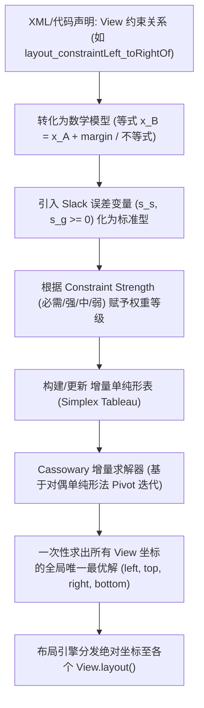

# 5.1.4.1.4 ConstraintLayout

ConstraintLayout（约束布局）是现代 Android 开发中推荐的声明式、扁平化布局管理器，旨在消除复杂 UI 下的多层 ViewGroup 嵌套难题。它通过灵活的约束关系和高效的求解算法，在保证界面灵活性的同时，极大降低了 View 树的深度，从而优化了 UI 渲染性能。

---

## 1. 扁平化设计哲学与传统布局的性能瓶颈

### 1.1 为什么嵌套是性能天敌？
在 Android 系统的视图渲染流程中，`Measure`（测量）和 `Layout`（布局）是决定性能表现的关键阶段。Android UI 渲染管道要求在 16.67ms（对应 60Hz 刷新率）或更短的时间（如 90Hz、120Hz 屏幕）内完成一帧的绘制。如果 View 树过深，由于以下原因，测量和布局的开销会呈指数级上升：

1. **多重测量惩罚（Double Measure Penalty）**：
   - **LinearLayout**：当为子 View 设置了 `android:layout_weight` 时，LinearLayout 需要对这些子 View 进行两次测量。第一遍测量没有 Weight 约束时的基本大小，第二遍根据剩余空间按权重比例重新分配并测量。
   - **RelativeLayout**：RelativeLayout 的核心机制是相对定位。为了确定每个 View 的最终位置，RelativeLayout **总是**会对所有子 View 进行至少两次测量（一次横向测量，一次纵向测量）。
   - **指数级累积**：如果将一个带有 `weight` 的 LinearLayout 嵌套在 RelativeLayout 中，或者将 RelativeLayout 相互嵌套，子视图被测量的次数将以 $O(2^d)$（$d$ 为嵌套深度）的指数级速度递增。在深层嵌套的复杂列表中，一个叶子节点 View 可能会被重复测量数十次，导致 CPU 占用率暴涨，主线程发生丢帧（Jank）。

2. **视图树遍历开销**：
   每次触发 `requestLayout()` 时，系统都会自顶向下递归遍历整个 View 树。深层树形结构不仅增加了递归调用的栈深度，还显著增加了垃圾回收（GC）的压力，因为在测量过程中会频繁产生临时的测量状态对象。

### 1.2 相对定位约束如何实现扁平化表达
ConstraintLayout 的设计哲学是**以“关系网”代替“层级树”**。在传统的布局中，我们需要通过嵌套 ViewGroup（例如用 Horizontal LinearLayout 嵌套 Vertical LinearLayout）来表达“先水平排布、再垂直对齐”的结构。而 ConstraintLayout 允许我们将所有子 View 放在同一个扁平的层级中，通过“相对定位约束”（Relative Positioning Constraints）来声明它们之间的空间位置关系。

在约束布局中，一个 View 可以直接声明它的某一边（Left、Top、Right、Bottom、Start、End、Baseline）与另一个 View 的某边对齐，甚至可以与父容器（Parent）的边缘绑定。这种直接的对偶关系在底层构成了一张**有向图（Directed Graph）**。通过将树形嵌套解构为扁平的关系图，ConstraintLayout 可以在单一层级下表达任意复杂的 UI 结构，将 View 树的平均深度降低 50% 以上。

---

## 2. Cassowary 线性方程组求解器的底层数学原理

ConstraintLayout 的强大之处，在于它将直观的布局声明转化为了严密的数学问题，并在运行时高效求解。其背后的核心数学引擎是 **Cassowary 算法**（一种专门用于用户界面布局的增量式线性规划求解器）。

### 2.1 UI 约束的数学抽象
在布局运行阶段，每一个 View 的边界都可以由四个变量表示：左边界 $x_{left}$、右边界 $x_{right}$、上边界 $y_{top}$、下边界 $y_{bottom}$。View 的宽度 $w$ 和高度 $h$ 可以表示为：
$$w = x_{right} - x_{left}$$
$$h = y_{bottom} - y_{top}$$

当我们声明一个约束时，例如“View B 的左边缘在 View A 的右边缘向右偏移 16dp 的位置”，在底层就会被抽象为一个线性等式：
$$x_{B, left} = x_{A, right} + 16 \cdot density$$

当声明“View C 的宽度是 View D 宽度的 2 倍”时，转化为：
$$x_{C, right} - x_{C, left} = 2 \cdot (x_{D, right} - x_{D, left})$$

如果涉及尺寸限制（如最小宽度、最大高度限制），则会转化为线性不等式：
$$x_{right} - x_{left} \ge minWidth$$
$$x_{right} - x_{left} \le maxWidth$$

对于居中对齐（如 View A 在 View B 和 View C 之间水平居中，偏置为 50%），则表现为加权等式：
$$x_{A, left} - x_{B, right} = x_{C, left} - x_{A, right}$$

### 2.2 强约束与弱约束系统（约束优先级）
在实际 UI 设计中，冲突是不可避免的。例如，一个 View 既被要求宽度填满父容器，又被要求最大宽度不能超过 300dp，同时还要与右侧的按钮保持一定的间距。如果这些约束都是绝对硬性的，求解器将无解。

为了解决这个问题，Cassowary 引入了**有冲突的约束分级系统（Constraint Hierarchies）**。约束被划分为不同的强度级别（Strength）：
- **Required（必需约束）**：必须绝对满足，否则求解器报错（例如，View 不能超出父容器边界，或者尺寸不能为负数）。
- **Strong（强约束）**、**Medium（中约束）**、**Weak（弱约束）**：可以被妥协。

为了在数学上表达这些非必需约束的妥协程度，算法为每个非必需约束引入了**误差变量（Slack Variables / Error Variables）**，记为 $s_i \ge 0$。如果约束是 $x_1 = x_2$，引入误差后转化为：
$$x_1 - x_2 + s_s - s_g = 0 \quad (s_s, s_g \ge 0)$$
其中 $s_s$ 表示偏小误差（Slack），$s_g$ 表示偏大误差（Surplus）。

求解器的核心任务，就是通过数学规划，**最小化所有非必需约束误差变量的加权和**。其目标函数（Objective Function）形如：
$$\min \sum_{j} w_j \cdot (s_{j, s} + s_{j, g})$$
其中 $w_j$ 是根据约束强度级别（Priority）赋予的权重。强约束的权重远大于弱约束（例如 $w_{strong} \gg w_{medium} \gg w_{weak}$），这确保了高优先级的约束总是优先被满足，只有当高优先级约束达成后，才会去尽可能逼近低优先级的约束。

### 2.3 Simplex（单纯形法）变体与增量式求解
在标准的线性规划中，通常采用单纯形法（Simplex Method）来求解目标函数的最优解。然而，标准的单纯形法开销较大，且每次布局发生变化（如某个 View 改变了大小、或者执行动画）时，都需要重新构建矩阵并完整求解，这在 16ms 的渲染帧率要求下是无法接受的。

Cassowary 算法对标准单纯形法进行了重大改良，实现了**增量式求解（Incremental Solving）**：
1. **增量添加与删除约束**：当 UI 发生交互、动态添加或移除某个 View 的约束时，求解器不需要重新计算整个约束网络。它通过维护一个处于“已解决”状态的单纯形表（Simplex Tableau），利用双对偶单纯形算法（Dual Simplex），只需进行局部基变量替换（Pivoting），即可在极短的步数内平滑地过渡到新状态。
2. **高效处理常量修改**：当用户拖动滑块或进行手势操作导致某个 Constraint 距离（Margin Constant）发生连续变化时，Cassowary 将其标记为“活动变量”（Active Variables）。求解器无需重构表，而是通过在已有最优基上进行极小幅度的增量调整，实现 $O(1)$ 或接近 $O(1)$ 的坐标更新速度。

### 2.4 避免树形递归
与传统的 Android ViewGroup 自上而下递归测量子视图不同，ConstraintLayout 内部维护了一个虚拟的布局体系结构。在测量阶段，所有的子 View 被抽象为 `ConstraintWidget`，而 ConstraintLayout 容器本身被抽象为 `ConstraintWidgetContainer`。

`ConstraintWidgetContainer` 内部维护了 Cassowary 求解器的实例。在 `onMeasure` 阶段，它把整个关系网中的所有 `ConstraintWidget` 的相对关系、边距、宽高比例一次性转化为约束方程，并送入求解器中。求解器输出的是每个 Widget 的绝对物理坐标（即相对于父容器左上角的 `left`、`top`、`right`、`bottom`）。整个过程不依赖任何传统的树形递归测量逻辑，从而彻底瓦解了深度嵌套带来的性能退化。



---

## 3. 核心辅助组件设计与机制

为了在扁平的层级结构中提供更高级的布局组织能力，ConstraintLayout 引入了一系列“辅助组件”（Helper Objects）。这些组件的共同特征是：**它们继承自 `ConstraintHelper`（间接继承自 `View`），但在运行时它们并不参与真正的绘制，没有实体大小，也不占用视图渲染树的开销。它们的唯一作用是作为虚拟的锚点或逻辑分组器，指导 Cassowary 求解器构建约束方程。**

### 3.1 Guideline（引导线）
Guideline 是一个纯粹的虚拟线，其 `Visibility` 在初始化时就被默认设为 `GONE`，并且其 `onDraw()` 是空实现。
- **底层机制**：Guideline 内部包含一个特定的 `ConstraintWidget`。它通过属性 `layout_constraintGuide_begin`（固定像素偏移）、`layout_constraintGuide_end`（尾部物理偏移）或 `layout_constraintGuide_percent`（百分比比例）在求解器中添加一个绝对等式约束：
  $$x_{Guideline} = x_{Parent, left} + percent \cdot w_{Parent}$$
- **应用场景**：为多个子 View 提供一个统一的对齐基准线，如左右两栏布局的黄金分割线。当分割比例调整时，只需修改 Guideline 的百分比，所有依赖它的 View 都会自动重绘对齐。

### 3.2 Barrier（屏障）
Barrier 类似于 Guideline，但它的位置不是固定的，而是**动态依赖一组 View 的最边缘边界**。

- **底层依赖计算逻辑**：
  Barrier 通过 `constraint_referenced_ids` 持有一组 View 的 ID。在 `onMeasure` 阶段，Barrier 对应的 `Barrier` 挂载类会遍历这些被引用 View 的 `ConstraintWidget`。
  假设屏障方向设为 `end`（或 `right`），引用的 View 集合为 $\{V_1, V_2, \dots, V_n\}$。在求解器运行前，Barrier 会动态执行一次坐标边界计算：
  $$x_{Barrier} = \max(x_{V_1, right}, x_{V_2, right}, \dots, x_{V_n, right})$$
  这会在约束网中生成一个动态的线性约束不等式系统：
  $$\forall i \in [1, n], \quad x_{Barrier} \ge x_{V_i, right}$$
  同时，约束在 Barrier 右侧的组件（例如一个 Action 按钮 $V_{action}$）会建立依赖于 Barrier 的约束：
  $$x_{V_{action}, left} = x_{Barrier} + margin$$

- **场景与国际化支持**：
  在多语言适配中，不同国家文字长度差异巨大。例如，“用户名”和“密码”在中文下很短，但在德文或意大利文下可能非常长。如果采用固定宽度的对齐，文案极易溢出或重叠。通过 Barrier 将这两个 TextView 包裹，并将屏障置于它们的右侧，右侧的输入框约束到这个 Barrier 上。无论哪个 TextView 因为翻译变长，Barrier 都会被动态推到最长 TextView 的右侧，从而确保输入框永远不会与文本发生重叠。

```mermaid
graph LR
    subgraph "输入组件群 (Referenced IDs)"
        A["TextView A (用户名 - 德文较长: R_A)"]
        B["TextView B (密码 - 较短: R_B)"]
    end
    
    A -->|右边界坐标| D{"Barrier 动态计算"}
    B -->|右边界坐标| D
    
    D -->|计算 max(R_A, R_B)| E["确定屏障位置: X_barrier = max(R_A, R_B)"]
    E -->|生成虚拟锚点线| F["Barrier Line"]
    F -->|向右约束边界| G["EditText (对齐到 Barrier 右侧)"]
    
    style F fill:#f9f,stroke:#333,stroke-width:2px
```

### 3.3 Group（组）
Group 用于控制一组 View 的可见性（`Visibility`）。在传统的布局中，如果我们要同时隐藏多个相关的 View，必须用一个父 ViewGroup（如 LinearLayout）把它们套起来，然后设置该 ViewGroup 的 Visibility。但这会引入额外的嵌套。
- **底层机制**：
  Group 在 `onMeasure` 和 `onLayout` 阶段不会参与计算（不影响任何相对位置约束，其尺寸为 0x0）。它在初始化时通过解析 `constraint_referenced_ids` 属性，在内存中缓存所有被引用 View 的引用。
  当开发者调用 `Group.setVisibility(View.GONE)` 时，Group 会直接遍历这个引用的 View 列表，逐个调用这些 View 的 `setVisibility(GONE)`。
- **注意点**：由于 Group 是通过直接修改子 View 的 Visibility 属性工作的，因此如果多个 Group 控制了同一个 View，或者在代码中直接对单个子 View 调用了 `setVisibility`，可能会引发状态覆盖冲突，需要注意控制逻辑的单一职责。

### 3.4 Layer（层）
Layer 与 Group 类似，也是一种虚拟引用类，但它专注于**视图变换（Transforms）**。
- **底层机制**：
  当我们对传统的 ViewGroup 进行旋转（Rotation）、缩放（Scale）或平移（Translation）时，系统需要对该容器及其所有子视图在绘制阶段应用 Canvas 矩阵变换。
  Layer 不增加任何 View 层级。它会监听整个 ConstraintLayout 的 Layout 过程，并在 `onLayout` 完成后，动态计算出所有被引用 View 的共同边界矩形（Bounding Box）及其几何中心点（Center X, Center Y）。
  当我们调用 `Layer.setRotation(45f)` 时，Layer 会以这个共同中心点为轴心，遍历所有引用的子 View，逐个应用对应的 `View.setRotation()`、`setTranslationX()` 等属性，从而在扁平的布局结构中实现完美的组合动画效果。

### 3.5 Flow（流式排布）
Flow 是 ConstraintLayout 2.0 引入的流式虚拟辅助类，旨在解决约束布局在处理大量动态、不确定数量子组件时的短板。
- **底层机制**：
  Flow 接收一组 `referenced_ids`，并在 `onMeasure` 阶段根据配置的属性（如 `flow_wrapMode` 设为 `aligned`、`chain` 或 `none`）在 `ConstraintWidget` 的层级动态构建**约束链（Constraint Chains）**。
  - **none**：所有引用 View 被放入一个单一的水平或垂直链中，超出屏幕不折行。
  - **chain**：超出空间时自动折行，折行后的每一行（或每一列）在底层被动态构建为一条独立的 Constraint Chain，并应用配置的链样式（如 spread、spread_inside、packed）。
  - **aligned**：将所有 View 对齐排列，类似于网格，其每一行、每一列的基准线都是动态计算并对齐的。
- **性能优势**：相较于传统的 GridLayout 或嵌套的 LinearLayout，Flow 实现了纯扁平化下的多行流式排布，支持复杂的对齐和间距配置（如 `flow_horizontalGap`），极大地简化了标签云（Tag Cloud）、数字键盘等界面的开发。

---

## 4. onMeasure 二次测量与底层优化机制

虽然 ConstraintLayout 大幅减少了视图树的嵌套层级，但是如果布局中存在大量尺寸不确定的 View，求解复杂的约束网依然存在性能开销。为此，ConstraintLayout 设计了一套极为精密的 `onMeasure` 二次测量流程和底层优化器。

### 4.1 什么时候会触发双重测量（Double Measure）？
在 ConstraintLayout 中，并不是所有的子 View 都会被测量多次。只有当 View 的尺寸属性涉及到**“未知与依赖”**时，才会触发双重测量。

1. **特定触发条件**：
   - 当子 View 的宽度或高度被设置为 `MATCH_CONSTRAINT`（即 `0dp`）时。
   - 并且该 View **没有**设置固定的宽高比（`layout_constraintDimensionRatio`）。
   - 或者子 View 被设置为 `wrap_content`，但其内部内容尺寸需要依赖其他受约束 View 的最终定位。

2. **双重测量的标准流程**：
   - **第一轮测量（Measure Pass 1）**：求解器尚未知晓 0dp 组件的实际空间。它首先将这些组件的尺寸假设为 0，然后收集其余固定尺寸或已约束 View 的信息，向这些 0dp 或 wrap_content 的子 View 发起一次试探性的 `measure()` 调用（MeasureSpec 的 Mode 通常是 `AT_MOST` 或 `UNSPECIFIED`）。子 View 测量完后，将其反馈的 `measuredWidth/measuredHeight` 填入约束系统，作为已知常量输入给 Cassowary 求解器。
   - **求解器运算（Solve Pass）**：Cassowary 运行增量求解算法，更新并解出所有 Widget 的最终精确坐标。
   - **第二轮测量（Measure Pass 2）**：对于尺寸发生改变的子 View，求解器会使用确定的坐标值算出精确的宽和高（例如 $w = x_{right} - x_{left}$），并以 `EXACTLY` 模式对子 View 发起第二次 `measure()` 调用，强行将其尺寸校准为方程求解的最优解。

### 4.2 底层优化器（Optimizer）分类
为了规避无意义的双重测量，`ConstraintWidgetContainer` 引入了 `Optimizer` 优化引擎。在运行时，它会提前分析约束网络，尝试用更简单的手段直接得出答案。常用的优化策略包括：

- **OPTIMIZER_DIRECT（直接解析）**：
  如果一个子 View 的约束关系非常清晰（例如：只约束在父容器的边缘，或者只单向约束到其他已经有确定尺寸的 View 上），这个 View 就属于“无环依赖树”的一部分。Optimizer 会跳过将其方程送入 Cassowary 求解器的步骤，直接通过加减 Margin 计算出其坐标，将其状态标记为 `Resolved`。
- **OPTIMIZER_BARRIER / OPTIMIZER_CHAIN**：
  对 Barrier 和 Chain（链）进行局部化预解析。如果链上的所有子 View 尺寸都是固定的，或者可以直接推算，则直接在优化器内部解出，不把整条链的变量引入全局线性方程组中。

### 4.3 测量缓存机制（Measure Cache）
即使避免不了双重测量，ConstraintLayout 也绝不会傻傻地重复执行所有子 View 的测量代码。它内部实现了一个基于 `ConstraintWidget` 的**测量缓存（Measure Cache）**：

1. **缓存的数据结构**：
   每个 `ConstraintWidget` 内部都会缓存上一次测量时的输入条件（`MeasureSpec` 的模式与大小、自身的宽度和高度、Margin 状态等）以及测量输出结果（`MeasuredWidth`, `MeasuredHeight`）。
2. **命中校验（Hit Validation）**：
   当 ConstraintLayout 对某个子 View 发起 `measure()` 请求时，会先对比当前的输入 `MeasureSpec` 与缓存的是否完全一致。此外，优化引擎会检查该 View 依赖的锚点坐标是否在两次测量之间发生了漂移。
3. **跳过测量**：
   如果完全一致，且相关依赖坐标未变，布局引擎会**直接跳过**该子 View 的整个 `measure(int, int)` 递归链，直接使用缓存的测量宽高。这种缓存过滤将绝大多数稳定子 View 的测量复杂度从 $O(2^N)$ 直接降低到接近 $O(1)$。

---

## 5. MotionLayout 与版本演进

随着 ConstraintLayout 的成熟，其底层关系网求解的机制展示出了天然的动画适应性——如果能平滑地改变约束条件，就能平滑地产生动画。为此，ConstraintLayout 2.0 引入了其子类 **MotionLayout**。

### 5.1 MotionLayout 的核心概念
MotionLayout 是一种专门用于管理手势和属性动画的声明式布局管理器。它将 UI 的**“结构”**与**“动画行为”**彻底解耦：
- **UI 结构**：依然在标准的布局 XML 文件中声明。
- **动画行为**：在单独的 `MotionScene` XML 文件中声明。

`MotionScene` 内部的核心概念包含：
- **ConstraintSet（约束集）**：定义了动画在特定状态（如 `Start` 状态和 `End` 状态）下的所有子 View 的布局约束。每个 ConstraintSet 都是对同一个布局结构的约束重写。
- **Transition（过渡）**：定义了从一个 ConstraintSet 到另一个 ConstraintSet 的变化路径。它可以包含动画持续时间（`duration`）、插值器，以及最重要的：
  - **OnSwipe（手势滑屏）**：将用户的滑动拖拽手势与过渡进度（Progress 0.0 ~ 1.0）直接进行绑定，通过 `touchAnchorId` 和 `dragDirection` 实现精确的手势跟手反馈。
  - **KeyFrameSet（关键帧集合）**：允许在过渡的中途（例如 50% 处）插入位置关键帧（`KeyPosition`）或属性关键帧（`KeyAttribute`），偏导视图的移动轨迹，实现抛物线、圆弧等复杂曲线动画，而无须编写一行 Java/Kotlin 代码。

### 5.2 版本演进与兼容性配置
从早期版本至今，ConstraintLayout 经历了重大的技术架构演进，开发者需要注意不同版本的行为兼容性（具体变更日志可见 [AndroidVersionChangeLog.md](../../../../../../AndroidVersionChangeLog.md)）：

1. **ConstraintLayout 1.1.x**：
   - 奠定了 Cassowary 求解器的基础，引入了百分比布局（Percent Layout）和 Barrier 等核心特性。
   - 修复了早期版本在多层嵌套和 `wrap_content` 极端场景下求解器死锁或无解崩溃的问题。

2. **ConstraintLayout 2.0.x**：
   - 正式引入了 `MotionLayout`，为手势驱动和转场动画提供了官方最佳实践。
   - 引入了 `ConstraintHelper` 的子类 `Flow` 和 `Layer`，大幅提升了列表、网格流和组合动画的编写效率。
   - 优化了优化器（Optimizer），在 `onMeasure` 阶段大幅减少了因嵌套 `MATCH_CONSTRAINT` 产生的冗余测量次数，同时增强了对右到左（RTL）布局语境下的对称解析支持。

3. **ConstraintLayout 2.1.x 及以上**：
   - 增强了 MotionLayout 对折叠屏（Foldables）和窗口缩放的动态响应支持。
   - 改进了 ConstraintSet 的动态修改 API（如 `updatePreLayout`），允许在运行时通过 Kotlin 更加灵活地以编程方式调整约束网络。
   - 提供更强大的性能诊断工具，支持在 Layout Inspector 中直接查看约束网图解，便于排查复杂的死锁约束。
