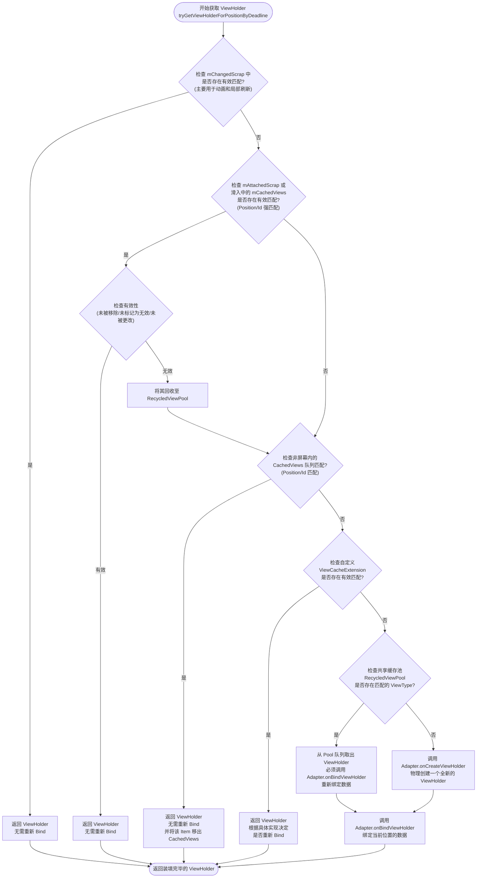
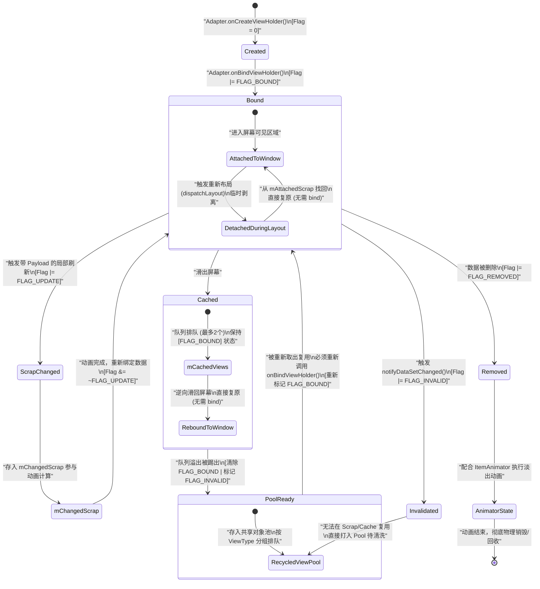

# 5.1.4.1.5 RecyclerView

## 导言
在 Android 界面开发的历史长河中，列表控件的演进代表了系统渲染与内存优化技术的极致追求。早在 Android 早期版本中，`ListView` 作为首代列表展示的核心控件，虽然解决了基本的滚动展示问题，但其内部架构存在着职责边界模糊、布局模式单一、动画支持匮乏等硬伤。伴随着 Android 5.0（Lollipop）的发布，系统正式引入了全新的 `RecyclerView`（详细设计背景请参阅 [AndroidVersionChangeLog.md](../../../../../../AndroidVersionChangeLog.md)）。

`RecyclerView` 并非对 `ListView` 的简单升级，而是一次彻底的重构。其核心思想是**“将视图复用与排版布局彻底解耦”**。它通过高度抽象的“三权分立”架构，将列表的测量、绘制、数据绑定、缓存管理、滑动预取以及动画渲染等职责拆分到不同的核心模块中。这种设计不仅巧妙地化解了海量长列表在滑动过程中内存常驻与 CPU 实时测量渲染之间的性能矛盾，更成为了 Android 现代 UI 体系中承载高频复杂交互的基石。

---

## 1. 经典三权分立架构

`RecyclerView` 的架构之美，首要体现在其高度模块化的职责划分。它没有试图在一个庞大的类中处理所有事务，而是通过三位核心角色共同构建了一个高效的生命循环系统：

```
+---------------------------------------------------------+
|                      RecyclerView                       |
|                                                         |
|    +------------------+         +------------------+    |
|    |  LayoutManager   | <=====> |     Recycler     |    |
|    | (排版布局计算器) |         | (内存与缓存中枢) |    |
|    +------------------+         +------------------+    |
|             ^                            ^              |
|             |                            |              |
|             +============+===============+              |
|                          |                              |
|                          v                              |
|                 +------------------+                    |
|                 |     Adapter      |                    |
|                 | (数据与视图桥梁) |                    |
|                 +------------------+                    |
+---------------------------------------------------------+
```

### 1.1 LayoutManager：排版布局的几何掌控者
`LayoutManager` 是掌控子视图（Item View）在屏幕上排版、定位与几何测量的核心计算模块。它决定了列表的形态（如单列线性的 `LinearLayoutManager`、多列网格的 `GridLayoutManager`、瀑布流的 `StaggeredGridLayoutManager`）。
- **解耦设计**：`RecyclerView` 自身不负责任何关于子视图位置计算的逻辑，全部委托给 `LayoutManager`。
- **与缓存的交互**：在列表滚动或重新布局时，`LayoutManager` 会根据滑动位移计算哪些子视图即将滑出屏幕、哪些即将滑入屏幕。对于即将滑入的视图，它并不直接实例化 `View`，而是向 `Recycler` 发出索取请求（例如通过调用 `Recycler.getViewForPosition(int)`）；对于滑出屏幕的视图，它会调用 `Recycler.recycleView(View)` 将其移交回收。

### 1.2 Adapter：数据模型与视图表示的适配器
`Adapter` 是连接原始业务数据源与可视化 `ViewHolder` 之间的桥梁，采用经典的适配器模式设计。其职责高度专注：
- **定义视图类型**：通过 `getItemViewType(int)` 告知 `RecyclerView` 特定位置的数据应使用哪种样式的布局。
- **物理创建**：在 `onCreateViewHolder(ViewGroup, int)` 中根据指定的视图类型实例化并初始化 `ViewHolder`。
- **数据装填**：在 `onBindViewHolder(ViewHolder, int)` 中将特定位置的数据绑定到 `ViewHolder` 对应的 UI 组件上。

### 1.3 Recycler：物理创建与复用的内存管理中枢
`Recycler` 是整个 `RecyclerView` 复用架构中最关键的幕后角色，掌控着 `ViewHolder` 的创建、缓存、状态标记与物理复用。
- **避免频繁 I/O 与反射**：XML 布局的解析（Inflation）和 View 对象的创建是高成本的 CPU 操作。`Recycler` 通过内部精细设计的缓存队列，保证当一个 Item 滑出屏幕时其 `ViewHolder` 物理对象不被销毁，而是经过清理和状态重置后，直接提供给滑入的 Item 重复使用。
- **三者协同运作机制**：当滑动事件触发时，系统事件流向 `LayoutManager`；`LayoutManager` 计算出目标位置并向 `Recycler` 请求 View；`Recycler` 依次在内部各级缓存中查找可用 `ViewHolder`；若未命中，则回退给 `Adapter` 调用 `onCreateViewHolder` 创建新实例；最终，`Recycler` 将获取的 `ViewHolder` 交付给 `Adapter` 完成数据装填（`onBindViewHolder`），再交还给 `LayoutManager` 完成屏幕上的布局测量与绘制。

---

## 2. 核心灵魂：四级缓存机制解密

`Recycler` 内部之所以能实现极致的流畅度，全赖于其环环相扣的四级缓存架构。其底层由一系列针对特定场景设计的队列与对象池组成。在 `RecyclerView` 进行布局或滑动时，它会调用核心方法 `tryGetViewHolderForPositionByDeadline()` 来获取 View，其查找和复用流程如图所示。

### 2.1 四级缓存查找与复用流转逻辑判定图



---

### 2.2 四级缓存底层工作原理与源码级剖析

为了彻底理解这四级缓存，我们需要剖析 `Recycler` 内部的成员变量及其对应的回收与复用边界：

#### 第一级缓存：`mAttachedScrap` 与 `mChangedScrap`（轻量级零成本复用）
在 `Recycler` 内部，这一级缓存由两个 `ArrayList<ViewHolder>` 组成。它们是**屏幕内轻量级临时缓存**，仅在 `layout` 计算期间生效。
- **`mAttachedScrap`**：在 `RecyclerView` 重新布局（如数据源改变引发的 `dispatchLayout` 过程）时，当前正在屏幕上显示的所有 `ViewHolder` 会被暂时剥离（Detach）并加入到 `mAttachedScrap` 中。接着，`LayoutManager` 重新计算各 Item 的位置，依次向 `Recycler` 获取 View。此时如果 Position 匹配，直接从 `mAttachedScrap` 中复原并重新 Attach 回窗口。因为这个 `ViewHolder` 的数据和位置完全没有变化，所以**无需执行任何 bind 操作**，甚至没有改变其在 View 树中的状态，损耗近乎于零。
- **`mChangedScrap`**：它的工作场景与 `mAttachedScrap` 相似，但专门服务于**有动画效果的局部刷新**。当调用带有 Payload 的刷新方法（如 `notifyItemChanged`）且有 ItemAnimator 参与时，数据发生改变的 `ViewHolder` 会被移入 `mChangedScrap`。这使得动画系统可以对比同一个 Position 刷新前后的两个 `ViewHolder`，从而精准渲染淡入淡出、平移等过渡动画。

#### 第二级缓存：`mCachedViews`（精准物理复用）
这一级缓存由 `ArrayList<ViewHolder> mCachedViews` 实现，默认容量限制为 `2`。
- **复用条件**：必须**完全满足 Position 或 Item ID 的物理强匹配**。
- **工作机制**：当用户滑动列表时，滑出屏幕的 Item 不会直接被抹去数据扔进池子里，而是先加入到 `mCachedViews`。因为容量只有 2，它遵循**先进先出（FIFO）**的队列机制。当第 3 个 Item 滑出屏幕时，最先滑出的 Item 就会被淘汰，清除状态后打入第四级缓存 `RecycledViewPool`。
- **性能优势**：如果在 `mCachedViews` 还没被淘汰前，用户又往相反方向滑动，该 Item 重新滑入屏幕。由于它是强匹配 Position，且依然保持着被滑出时的所有原装状态与数据，因此可以直接拿来显示，**完全不需要重新调用 `onBindViewHolder`**。这为快速来回微调滚动的场景提供了极好的性能保障。

#### 第三级缓存：`ViewCacheExtension`（开发者自定义缓存扩展）
在源码中定义为 `public abstract static class ViewCacheExtension`，默认情况下该对象为空（Null）。
- **设计目的**：Android 官方为开发者保留的一个高度定制化入口。`Recycler` 本身不负责这一级缓存的写入，仅在查找未命中前三级缓存时，通过回调 `ViewCacheExtension.getViewForPositionAndType(Recycler, int, int)` 询问开发者是否手动提供了现成的 View。
- **局限性**：由于它需要开发者自己去维护 View 的生命周期、数量上限以及位置映射，容易引入内存泄漏，因此在实际开发与开源库中极少被使用。

#### 第四级缓存：`RecycledViewPool`（基于 ViewType 的共享缓存池）
这是复用架构中覆盖范围最广的一级。当 `ViewHolder` 经历前三级缓存未命中，且滑出屏幕被 `mCachedViews` 队列挤出时，便会来到 `RecycledViewPool`。
- **存储结构**：底层核心是由 `SparseArray<ScrapData>` 维护的映射表。其中 Key 为该 Item 的 `ViewType`（整型），Value 对应一个 `ScrapData` 对象，其内部持有一个 `ArrayList<ViewHolder>`，该队列默认容量最大值为 `5`。
- **复用条件**：**仅匹配 ViewType，不匹配 Position**。
- **绑定损耗**：由于拿出来的 `ViewHolder` 原本对应的是其他位置的数据，其状态已被重置为无效（可通过状态位判定）。因此，从 Pool 中取出复用时，**必须重新调用 `Adapter.onBindViewHolder` 进行数据的完整重新装填**，但免去了 XML 解析与对象物理创建（`onCreateViewHolder`）的高额开销。
- **多实例共享池**：这是 `RecycledViewPool` 的一项杀手级特性。在诸如 ViewPager 嵌套多 Tab 列表、或是复杂嵌套的 `RecyclerView` 场景中，如果多个不同的 `RecyclerView` 中的子 Item 具有完全相同的 ViewType 和布局样式，我们可以通过 `recyclerView.setRecycledViewPool(SharedPool)` 让它们共享同一个缓存池。这可以极大地节省应用整体的内存开销，并显著降低滑动过程中由于切换页面而频繁创建 ViewHolder 的卡顿概率（可参考共享缓存池的优化细节，参阅 [AndroidVersionChangeLog.md](../../../../../../AndroidVersionChangeLog.md)）。

---

## 3. ViewHolder 的生命周期与状态标志位

要实现上述精细化的缓存调度，`Recycler` 必须对每一个 `ViewHolder` 的内部健康状况与生命阶段了如指掌。这是通过 `ViewHolder` 内部持有的状态标志位（Flags，整型位运算）来实现的。

### 3.1 常用状态标志位（FLAG）解析

| 标志位常量 (位掩码) | 语义释义与应用场景 | 对缓存与复用决策的影响 |
| :--- | :--- | :--- |
| `FLAG_BOUND` (1 << 0) | **已绑定状态**。表明当前 ViewHolder 已经完成了数据绑定（执行过 `onBind`），其内部保存的数据是与某个特定 Position 对应的。 | 只有带有此标记的 ViewHolder 才能直接在 Scrap 或 Cache 中复用。如果滑入 Pool，此标记会被清除。 |
| `FLAG_UPDATE` (1 << 1) | **数据待更新**。数据源发生了改变，但该 Item 尚未重新绑定最新的数据。 | layout 过程中，LayoutManager 遇到带有此标记的对象会判定其为脏（Dirty），可能会要求其在展示前重新 bind。 |
| `FLAG_INVALID` (1 << 2) | **无效状态**。ViewHolder 中的数据与关联的 Position 已完全失配（如全局刷新）。 | **最危险的标记**。被标记为 Invalid 且未做 ID 关联的 ViewHolder，无法被第一级 Scrap 和第二级 Cache 直接复用，它们会直接被移交或打入 `RecycledViewPool`，或者面临直接废弃。 |
| `FLAG_REMOVED` (1 << 3) | **已移除标记**。该 Item 对应的业务数据已在数据集（Dataset）中被删除，但物理视图目前仍留在屏幕上配合 ItemAnimator 执行删除过渡动画。 | layout 结束后，此 ViewHolder 会被彻底回收，不再参与后续的正常滑动复用。 |
| `FLAG_TMP_DETACHED` (1 << 8) | **临时分离标记**。在绘制或轻量重新排版期间，View 被临时从 ViewGroup 的 View 树中分离，但没有完全断开物理关联。 | 配合 `mAttachedScrap` 进行快速的复原操作。 |

### 3.2 ViewHolder 的状态位流转与生命周期周期图

下面通过状态机的形式，展现 `ViewHolder` 从物理诞生到销毁、以及在各级缓存队列中进出时的状态位变迁：



---

## 4. 局部刷新（Payload）与全局刷新的缓存博弈

在日常开发中，对于列表数据的变更，开发者通常会面对两种刷新策略：以 `notifyDataSetChanged()` 为代表的**全局刷新**，和以 `notifyItemChanged(position, payload)` 为代表的**局部刷新**。这两者在底层缓存流转中引发的连锁反应存在天壤之别。

### 4.1 为什么 notifyDataSetChanged() 是性能灾难？
调用 `notifyDataSetChanged()` 会通知 `RecyclerView` 数据源发生了一次结构完全未知的剧烈震荡。此时：
1. **全员标记为 Invalid**：系统无法确认哪些数据变了、哪些没变。于是，当前屏幕内外的所有正在被复用的 `ViewHolder` 都会被瞬间打上 `FLAG_INVALID` 状态标记。
2. **全员打入 Pool**：由于带有了 `FLAG_INVALID` 标记，它们无法再通过屏幕内缓存（`mAttachedScrap`）或高精度缓存（`mCachedViews`）进行 Position 物理匹配复用。它们被一股脑地清除结构状态，打回第四级缓存 `RecycledViewPool`。
3. **强制重新 Bind**：在接下来布局测量阶段（`layout`），所有的 Item View 在滑入或复原时，都必须从 `RecycledViewPool` 中取出，并**重新走一遍高成本的 `onBindViewHolder`**。
4. **负面连锁反应**：
   - 丢弃了所有的滑动状态，如图片的加载进度、编辑框焦点以及子控件的各种临时状态。
   - 由于没有了前后的状态关联，`ItemAnimator` 无法推算哪些 View 经历了平移或缩放，导致**所有的列表过渡动画丢失**，界面出现生硬的瞬闪。
   - 如果列表在快速滑动过程中调用此方法，主线程会在同一个 VSYNC 周期内承载数十次 `onBindViewHolder` 的计算量，导致严重的 CPU 过载掉帧。

### 4.2 notifyItemChanged(position, payload) 增量刷新原理
相比之下，局部刷新方法提供了一种**定向沟通机制**。当我们调用 `notifyItemChanged(position, "like_count_update")` 时：
1. **生成 UpdateOp 任务**：`RecyclerView` 内部的 `AdapterHelper` 会收到一个特定类型的操作对象（`UpdateOp`），指明仅在 `position` 位置发生变动，且携带了一个标识“喜欢数更新”的字符串/对象（Payload）。
2. **定向丢入 mChangedScrap**：在执行 `layout` 期间，对应的 `ViewHolder` 不会被标记为 Invalid，而是被加上 `FLAG_UPDATE` 并被定向丢入 `mChangedScrap` 中。
3. **精准 Payload 回调**：`Recycler` 会取出该 `ViewHolder`，并触发适配器中特化的绑定方法：
   ```java
   @Override
   public void onBindViewHolder(@NonNull ViewHolder holder, int position, @NonNull List<Object> payloads) {
       if (payloads.isEmpty()) {
           // 回退到默认的全局绑定，将整个 Item 内部所有 View 重新赋值
           super.onBindViewHolder(holder, position, payloads);
       } else {
           // 增量刷新：仅解析 payloads 里的标志，进行局部渲染
           for (Object payload : payloads) {
               if ("like_count_update".equals(payload)) {
                   holder.likeTextView.setText(getNewLikeCount());
               }
           }
       }
   }
   ```
4. **性能对比**：局部刷新不仅使该 Item 避开了不必要的 XML 重新测量与全局子 View 数据填充，更重要的是，它**只改变了需要变更的属性，完全保留了其他子 View 的状态**，且能够让 `ItemAnimator` 顺利捕获对应结点的淡入淡出或者缩放动画，带来如丝般顺滑的视觉反馈。

---

## 5. Prefetch（预取）机制

为了在用户快速滑动长列表时消除哪怕只有 1 帧（16.6ms 或 11.1ms）的视觉卡顿，Android 7.0（API 24）正式引入了 **Prefetch 预取优化机制**（详细引入背景可参见根目录下的 [AndroidVersionChangeLog.md](../../../../../../AndroidVersionChangeLog.md)）。

### 5.1 预取机制的触发背景与原理
在传统的系统渲染流程中，主线程（UI Thread）在收到系统的 `VSYNC` 信号后开始工作：计算输入、执行 Animation、执行 Measure/Layout/Draw，最后将渲染指令交给渲染线程（`RenderThread`）。`RenderThread` 完成绘制并将帧缓存（Buffer）提交给 `SurfaceFlinger` 渲染到屏幕上。

在许多场景下，主线程的这一套工作可能会在 4ms 到 8ms 内提早结束。这意味着在距离下一个 `VSYNC` 到来之前，主线程会有长达数毫秒的**空闲等待时间（Gap Time）**。预取机制正是利用了这段被白白浪费的 Gap Time。

```
常规帧渲染时间轴 (未开启 Prefetch)：
VSYNC       VSYNC       VSYNC
  |           |           |
主线程: [渲染第1帧]----(空闲等待 VSYNC)-----> [滑动滑入Item, 密集执行 onCreate/onBind] (耗时超长, 导致掉帧)
RT:    [绘制第1帧]                          [绘制第2帧]

开启 Prefetch 后的渲染时间轴：
VSYNC       VSYNC       VSYNC
  |           |           |
主线程: [渲染第1帧]--[启动 GapWorker 预取第2帧] --> [第2帧滑入, 直接从缓存取出展示] (零成本, 流畅滚动)
RT:    [绘制第1帧]                           [绘制第2帧]
```

### 5.2 GapWorker 的后台调度工作流
1. **收集滑动矢量**：当用户手指在屏幕上拖拽，`RecyclerView` 产生滑动时，其内部的 `GapWorker` 会开始工作，记录当前列表滑动的速度与方向。
2. **计算空闲窗口**：当主线程的一帧渲染工作完成后，`GapWorker` 会向 `Choreographer` 注册，查询下一个 `VSYNC` 信号到来的剩余时间。
3. **在空闲期发起预取**：如果预计空闲时间足够（例如还剩 8ms），`GapWorker` 会模拟滑动计算，判定出下一个即将滑入屏幕的 Item 的 Position 与 ViewType。
4. **静默加载与缓存**：它会在主线程空闲或由后台线程协助时，直接调用 `tryGetViewHolderForPositionByDeadline()`，从而默默触发该 Item 的 `onCreateViewHolder` 与 `onBindViewHolder`。
5. **归宿缓存**：被预取出来的 `ViewHolder` 会被直接存放到第二级缓存 `mCachedViews` 中。当滑动继续，该 Item 正式跨越屏幕边界滑入时，`RecyclerView` 再次请求该位置的 View，就会直接从 `mCachedViews` 中**以 0ms 的耗时瞬间取出**，完全消除了滑入瞬间的卡顿。

---

## 6. 长列表优化实战方案

将 `RecyclerView` 的底层渲染与缓存机制运用到实际工程中，可以沉淀出以下四套经典的优化实战方案：

### 6.1 `setHasFixedSize(true)` 的作用原理
在默认情况下，当往 `RecyclerView` 中添加、删除或修改数据时，`RecyclerView` 会触发 `requestLayout()`，这会导致整个 `RecyclerView` 自身及其所有子视图重新进行一次完整的测量（Measure）与布局（Layout）流转。
- **原理剖析**：如果你的列表在初始化后，其自身的物理宽高（Width/Height）并不会因为内部 Item 数量的增减或 Item 内容的变化而发生改变（例如一个占满全屏的商品流列表），我们可以调用：
  ```java
  recyclerView.setHasFixedSize(true);
  ```
- **技术效果**：此方法在底层会告诉 `RecyclerView`，数据源的改变不会改变它自己的几何尺寸。此后，当调用 `Adapter` 的各种 `notifyItem*` 方法时，`RecyclerView` 将直接跳过自身耗时的 Measure 和 Layout 阶段，直接让 `LayoutManager` 进行局部的子 Item 重新定位，从而省去了大量的全局度量开销。

### 6.2 扁平化 Item 布局以减少测量开销
`LayoutManager` 排放每一个 Item 时，都会对该 Item 及其子控件执行树状的测量。
- **优化点**：
  - 尽量避免在 Item 的布局中过度使用多层嵌套的 `LinearLayout`（尤其是配置了 `layout_weight` 的属性，它会导致子视图经历双倍强度的二次测量）。
  - 使用扁平化的 `ConstraintLayout` 或自研的轻量自定义 ViewGroup 来替代复杂的嵌套。
  - 对于极其简单的列表，甚至可以直接在 Canvas 上绘制文字和分割线，避免实例化过多的 View 节点。

### 6.3 利用 DiffUtil 进行差分刷新
传统的 `notifyDataSetChanged` 是粗暴的“格式化刷新”。在数据更新频繁的现代应用中，推荐使用 `DiffUtil`。
- **算法基础**：`DiffUtil` 底层基于 Eugene W. Myers 的**差分匹配算法（Myers' Difference Algorithm）**。它能够以 $O(N + D^2)$ 的时间复杂度计算出新旧两套数据集之间的最小差异。
- **使用建议**：由于 Myers 算法计算依然需要消耗 CPU，强烈建议使用官方提供的包装类 `AsyncListDiffer` 或 `ListAdapter`。它们会在后台子线程中计算出两组数据的差异，然后再切回主线程，自动、精准地将差异转化为一系列增量刷新指令（如 `notifyItemMoved`、`notifyItemRangeInserted`、`notifyItemRangeRemoved`）。这不仅避免了主线程计算瓶颈，还让列表的删除、插入伴随着生动的默认过渡动画。

### 6.4 共享缓存池 `RecycledViewPool` 优化嵌套长列表
在复杂应用中（如电商首页的 ViewPager2 嵌套多个 Tab，且每个 Tab 下的 `RecyclerView` 中都有完全相同的商品卡片样式），如果每个 Tab 列表都各自定义一个 `RecycledViewPool`，会导致内存中存在数倍的闲置 `ViewHolder` 实例。
- **优化实现**：
  ```java
  // 1. 创建一个全局或父级容器级别的共享缓存池
  RecyclerView.RecycledViewPool sharedPool = new RecyclerView.RecycledViewPool();
  // 根据业务情况，可以调大通用 ViewType 的缓存容量（默认是 5）
  sharedPool.setMaxRecycledViews(VIEW_TYPE_PRODUCT, 12);

  // 2. 在每个子 RecyclerView 初始化时，指向同一个共享池
  tabRecyclerView1.setRecycledViewPool(sharedPool);
  tabRecyclerView2.setRecycledViewPool(sharedPool);
  tabRecyclerView3.setRecycledViewPool(sharedPool);
  ```
- **技术优势**：当用户在 Tab 1 向上滑动产生了一批被回收的商品卡片 `ViewHolder` 后，切换到 Tab 2 时，Tab 2 不需要重新解析 XML 创建这些卡片，而是能直接从 `sharedPool` 中继承并复用这些闲置的实例。这使得页面切换和滑动的跟手流畅度得到了质的飞跃。
