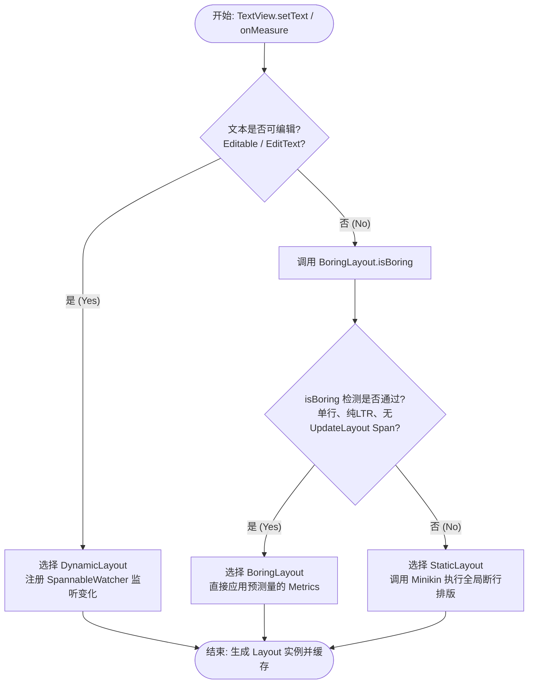

# 5.1.4.1.6 TextView

## 1. 导言：TextView 的黑盒与底层渲染架构

在 Android 视图开发中，`TextView` 常被误认为是一个仅负责调用 `Canvas.drawText()` 的轻量级字符展示控件。然而，从框架源码的厚度与复杂度来看，`TextView`（及其底层关联的排版系统）是 Android OS 中最庞大、最复杂的 UI 组件之一。其 Java 层源码直逼万行，且其背后隐藏着一整套由底层 Native 库支撑的排版引擎与渲染体系。

一个普通的文本序列（如 `CharSequence`）显示到屏幕上，并不只是简单地将矢量字体栅格化后贴图。它必须经过以下一系列复杂的底层工序：
1. **Unicode 规范化与双向文本重排（Bidi Algorithm）**：处理自左向右（LTR）与自右向左（RTL，如阿拉伯语、希伯来语）的混合排版。
2. **复杂语系的字符整形（Complex Text Layout / Shaping）**：对于泰语、印地语、阿拉伯语等复杂语系，字符的字形会根据上下文连写发生形变，这需要高精度的字形定位。
3. **折行断字（Line Breaking & Hyphenation）**：根据控件的物理宽度边界，使用动态规划算法在单词内部或词组边缘计算最优折行位置。
4. **富文本样式段切分与属性混合**：将挂载了不同 `Span` 的文本切分为多个样式运行段（Style Runs），为不同的字符应用对应的画笔属性。
5. **字形栅格化与硬件渲染**：最终通过底层渲染引擎（Skia / HWUI）调用 FreeType 提取矢量字形轮廓，生成 Alpha 掩膜，最终交付给 GPU 进行光栅化绘制。

在此体系中，Java 层的 `Layout` 架构（包括 `BoringLayout`、`StaticLayout`、`DynamicLayout`）扮演着上层排版“指挥官”的角色；而 C++ 层的 `Minikin` 库、`HarfBuzz` 库以及 `FreeType` 引擎则负责处理高能耗的物理排版和字形生成。深入理解这一体系的运转逻辑，是突破 Android 复杂文本性能瓶颈、开发高精度富文本和自定义文本组件的底层基石。

---

## 2. 三大 Layout 文本排版器深度解密

Android 的文字测量和折行逻辑并不是直接在 `TextView` 类中完成的，而是委托给了抽象类 `android.text.Layout`。`Layout` 负责管理、排版并计算文本在特定宽度约束下的行高、行数、字符坐标及折行断点。根据文本的复杂程度和交互场景，Android 提供了三种不同的 `Layout` 实现类。

### 2.1 BoringLayout（极速单行排版器）

`BoringLayout` 是排版体系中最轻量级的实现，专门为了处理那些不需要任何复杂排版逻辑的“无聊”文本而设计。

*   **适用场景**：单行、纯文本（无 Span 样式或仅含非度量型 Span）、且方向为自左向右（LTR）的极简文本。
*   **底层判断机制**：
    当 `TextView` 尝试测量文本时，首先会调用 `BoringLayout.isBoring(CharSequence text, TextPaint paint, TextDirectionHeuristic textDir, Metrics metrics)` 方法进行快速检测。检测的核心逻辑在于底层 Native 层对字符 Unicode 属性的扫描，如果满足以下所有条件，则判定为“Boring”文本：
    1.  文本中不能包含换行符（如 `\n` 或 `\r`）。
    2.  文本不包含任何 RTL（自右向左）的字符，不需要进行复杂的双向文本重排（Bidi）。
    3.  文本中不能含有任何实现了 `UpdateLayout` 接口的 Span 样式（例如 `MetricAffectingSpan`，因为这类 Span 会动态改变文字的字号、缩放等物理属性，从而打破 BoringLayout 的简单测量机制）。
*   **性能优势**：
    如果检测成功，该方法会返回一个 `BoringLayout.Metrics` 对象，其中已经直接填充好了单行文本的建议宽度（`width`）、`ascent`、`descent` 等关键度量指标。TextView 会直接复用这些预存指标并实例化一个 `BoringLayout`，省去了后续昂贵的断行计算与分段渲染流程。

### 2.2 StaticLayout（多行静态文本排版器）

对于绝大多数不可编辑但需要折行、含有换行符或富文本样式的多行文本，`StaticLayout` 是其实际的排版执行者。

*   **适用场景**：多行静态文本。例如文章阅读、商品描述、包含各式富文本样式的卡片展示。
*   **底层排版与断行算法**：
    `StaticLayout` 本质上是一个一次性排版器。一旦初始化完成，其内部的排版行信息即被固定。
    在排版过程中，`StaticLayout` 会委托底层的 `LineBreaker`（在 [Android 9.0 (API 28)](../../../../../../AndroidVersionChangeLog.md) 之后进行了重构，下层对接 C++ Minikin 引擎）进行折行计算。
    为了让排版视觉效果最优化，Minikin 引擎实现了著名的 **Knuth-Plass 折行算法**。该算法并不是简单地遇到边界就粗暴切断（即贪心算法），而是通过扫描整段文本，对每一种可能的断行切分点进行综合评分。它根据单词拆分、多语种断字（Hyphenation）规则、以及行的剩余留白宽度，计算出一个“惩罚值（Penalty）”。最终，算法会通过动态规划在全局寻找到一条累积惩罚值最小的路径作为折行方案。
    由于涉及频繁的 Native 交互、复杂的动态规划与字符宽度测量，`StaticLayout` 的构造过程极其消耗 CPU 资源。

### 2.3 DynamicLayout（动态可编辑排版器）

当文本需要实时被编辑，或者文本内容、Span 样式会被高频动态修改时，`StaticLayout` 的一次性排版策略将失效，必须依靠 `DynamicLayout`。

*   **适用场景**：`EditText` 的底层排版实现，或设置了 `BufferType.SPANNABLE` 且高频变化的文本组件。
*   **局部重构机理（Reflow）**：
    如果在用户每次按键输入、或者每次修改单个字符的颜色 Span 时，都对整篇成千上万字的文章重新做全局的 StaticLayout 测量，将直接引发界面掉帧卡顿。
    为了解决这一痛点，`DynamicLayout` 采用了**局部排版更新（Reflow）**机制：
    1.  **注入监听器**：`DynamicLayout` 在初始化时，会向被监视的 `Spannable` 文本中注册一个内部的私有辅助类 `SpannableWatcher`（该类同时实现了 `TextWatcher` 和 `SpanWatcher` 接口）。
    2.  **监听变化**：当用户修改了文本中的某一部分，或者增删了 Span 时，`SpannableWatcher` 会被回调，并把变化的起始和结束索引（`start` 和 `end`）汇报给 `DynamicLayout`。
    3.  **局部计算与数据重排**：`DynamicLayout` 接收到变化范围后，会计算受本次修改波及的行范围。它只会对这些局部受影响的几行文本重新调用折行算法进行测量。随后，它在 Java 层维护的一个动态数组（通过内部的 `PackedIntVector` 变长坐标数组，记录各行的顶底坐标和索引边界）中，将受影响的行数据进行局部擦除、增塞与位置偏移拷贝。
    从而将重排的时间复杂度从全局的 $O(N)$ 成功降至局部的 $O(K)$（$K$ 为受影响的字符或行数）。

### 2.4 三大 Layout 排版器决策流转图

下图展示了 `TextView` 在文本改变或执行测量时，底层选择三大 Layout 的详细决策决策流转过程：



---

## 3. 文本度量与排版数学：FontMetrics

要在 Canvas 上实现像素级精准的文本控制与排版，首先必须彻底理清字体的几何度量模型——`Paint.FontMetrics`。

### 3.1 物理基准线坐标系

在 Android 绘制体系中，文本绘制的 Y 轴物理基准线是 **Baseline（基线）**。
*   Baseline 在数学计算上被视为 **Y = 0** 的水平原点线。
*   **向上为负**：由于 Android Canvas 默认以左上角为 `(0, 0)` 且 Y 轴正方向向下，因此位于 Baseline 以上的所有度量指标（如 `top`、`ascent`）其物理坐标值均为**负数（Negative）**。
*   **向下为正**：位于 Baseline 以下的所有度量指标（如 `descent`、`bottom`）其物理坐标值均为**正数（Positive）**。

```mermaid
flowchart TD
    subgraph FontMetrics_Y_Axis [FontMetrics 坐标空间 (Y 轴向下为正)]
        direction TB
        LineTop["top (物理最大上边界，如 -120px)"] --- LineAscent["ascent (建议字符上边界，如 -80px)"]
        LineAscent --- LineBaseline["baseline (基准线，0px)"]
        LineBaseline --- LineDescent["descent (建议字符下边界，如 20px)"]
        LineDescent --- LineBottom["bottom (物理最大下边界，如 35px)"]
    end
    
    style LineBaseline stroke:#f00,stroke-width:2px,stroke-dasharray: 5 5
```

### 3.2 五大度量指标物理含义

调用 `Paint.getFontMetrics(FontMetrics outMetrics)` 可以获取到以下五个度量值：

1.  **`baseline`**：字符排版的物理基线。它是绘制英文字母（如 'a', 'x', 'm'）底部的虚拟水平对齐线。在 Y 轴上其相对坐标固定为 `0`。
2.  **`ascent`**：**建议的单行文本在基线以上的最大高度**。它通常对应普通大写字母（如 'A', 'H', 'L'）或上标字符的顶部位置。在 Baseline 以上，对应的值为**负数**。
3.  **`descent`**：**建议的单行文本在基线以下的最大高度**。用于留出英文字母（如 'g', 'j', 'p', 'q', 'y'）向下延伸的“尾巴”。在 Baseline 以下，对应的值为**正数**。
4.  **`top`**：**字体的物理最大上边界**。为了容纳极其特殊的重音符号、变音符号（例如泰语中的声调符号，法语中的尖音符），字体设计者会保留一个最大的物理上限。在 Baseline 以上，对应的值为**负数**，且满足物理关系：
    $$|top| \ge |ascent| \quad (\text{即 } top \le ascent)$$
5.  **`bottom`**：**字体的物理最大下边界**。代表在最极端情况下，字符可能向下延伸的最大物理极限。在 Baseline 以下，对应的值为**正数**，且满足关系：
    $$bottom \ge descent$$

### 3.3 计算实际占据高度的公式推导

在计算文本行距、自定义 View 高度或判定行碰撞时，需要利用上述度量指标推导出行的实际物理高度。

#### 1. 建议行高（Line Height）
建议行高代表排版设计上最和谐的单行高度。在此高度下，上下相邻两行的 `ascent` 与 `descent` 恰好相贴而不会产生物理重叠：
$$\text{LineHeight} = \text{descent} - \text{ascent}$$
*   **代数证明与推导**：
    由于 `ascent` 位于 Baseline 上方，其物理偏移绝对值为 $|\text{ascent}| = -ascent$；而 `descent` 位于 Baseline 下方，其绝对值距离为 $\text{descent}$。
    根据两点间距离公式，两线之间的物理跨度为：
    $$\text{Span} = \text{descent} - \text{ascent}$$
    由于 $ascent$ 本身为负数，这等价于两者的绝对值相加：
    $$\text{Span} = \text{descent} + |\text{ascent}|$
    因此，建议行高公式成立。

#### 2. 最大物理行高（Max Line Height）
在需要容纳极端变音符号、避免任何字符被 View 物理边界截断（Clipping）的场景下，字符可能占据的最大垂直物理空间为：
$$\text{MaxLineHeight} = \text{bottom} - \text{top}$$
*   **推导过程**：
    同理，因为 $top$ 为负数，其绝对物理偏移为 $-top$，而 $bottom$ 为正数，绝对偏移为 $bottom$。
    两者的几何最大间距即为：
    $$\text{MaxSpan} = \text{bottom} - \text{top} = bottom + |top|$$
    故公式完全成立。

---

## 4. 文本绘制：垂直居中 Baseline 公式推导

在自定义 View 中，一个极为经典的开发需求是：在指定的矩形容器（`Rect`）内，将一段单行文本实现**垂直且水平居中**绘制。

### 4.1 偏下问题的成因

很多开发者会直观地把矩形的中心点坐标 `(centerX, centerY)` 传入 Canvas 的绘制接口：
```java
// 错误写法示范
canvas.drawText(text, centerX, centerY, paint);
```
在设置了 `paint.setTextAlign(Paint.Align.CENTER)` 后，水平方向虽然完美居中，但运行后会发现**文字在视觉上明显偏下**。

其底层成因在于：`canvas.drawText` 中的参数 `y` 代表的是 **Baseline（基线）** 的 Y 轴坐标，而非文字物理边界的中心线坐标。
若直接将容器垂直中线 `centerY` 作为基线坐标传入，意味着文字的 Baseline 恰好与容器的中线重合。因为绝大多数英文字母（如 'A', 'B', '1', '2'）的高度都分布在 Baseline 之上（即由 `ascent` 决定的物理区间），只有极少部分（如 'g', 'q'）会跨越至 Baseline 以下。这就导致文字在视觉上的主体部分全部被顶到了容器中线的上方，从而破坏了垂直居中的平衡。

### 4.2 完美的 Y 轴基线坐标公式推导

为了消除这种视觉偏差，我们需要推导出一条完美的 Y 轴基线坐标公式，使得文字的**几何中心线**恰好与**容器的垂直中线**重合。

*   **已知条件**：
    *   容器在 Canvas 坐标系下的垂直中线坐标为 `centerY`（例如，容器高度为 $H$，则 `centerY = H / 2`）。
    *   文字在垂直方向上的建议排版可视区域由 `ascent`（负值）与 `descent`（正值）所包围。
    *   设我们需要计算的实际绘制基线坐标为 `baselineY`。

*   **推导第一步：计算文字几何中心相对于其 Baseline 的相对偏移量**
    由 `ascent` 和 `descent` 构成的文字建议高度为：
    $$h = \text{descent} - \text{ascent}$$
    文字的几何中心线（即高度的一半处）应该刚好位于从其上边界 `ascent` 往下偏移 $h / 2$ 的相对位置。设该相对位置（以 Baseline 为 Y=0）的相对 Y 轴偏移量为 `textCenterRelativeY`，则有：
    $$\text{textCenterRelativeY} = \text{ascent} + \frac{h}{2}$$
    将 $h = \text{descent} - \text{ascent}$ 代入上式：
    $$\text{textCenterRelativeY} = \text{ascent} + \frac{\text{descent} - \text{ascent}}{2}$$
    通分并化简：
    $$\text{textCenterRelativeY} = \frac{2 \cdot \text{ascent} + \text{descent} - \text{ascent}}{2} = \frac{\text{ascent} + \text{descent}}{2}$$

*   **推导第二步：将文字几何中心线对齐容器垂直中线**
    文字中心线在 Canvas 坐标系下的**绝对 Y 坐标**（`AbsoluteTextCenterY`）可以表示为：绘制基线的绝对坐标加上文字中心线相对于基线的相对偏移量：
    $$\text{AbsoluteTextCenterY} = \text{baselineY} + \text{textCenterRelativeY}$$
    将第一步推导出的表达式代入：
    $$\text{AbsoluteTextCenterY} = \text{baselineY} + \frac{\text{ascent} + \text{descent}}{2}$$
    为了实现垂直居中，必须使文字中心线的绝对坐标与容器中线的绝对坐标完全重合，即：
    $$\text{AbsoluteTextCenterY} = \text{centerY}$$
    得到代数方程：
    $$\text{baselineY} + \frac{\text{ascent} + \text{descent}}{2} = \text{centerY}$$

*   **推导第三步：解出绘制基线坐标 `baselineY`**
    对上式进行移项整理，即可推导出基线绘制的 Y 轴物理坐标公式：
    $$\text{baselineY} = \text{centerY} - \frac{\text{ascent} + \text{descent}}{2}$$

*   **代数结果的物理几何分析**：
    通常情况下，英文字体设计中，基线以上的建议高度绝对值 $|ascent|$ 大于基线以下的建议高度 $descent$。
    因此，代数项 $(\text{ascent} + \text{descent})$ 的值是一个**负数**。
    这导致项 $-\frac{\text{ascent} + \text{descent}}{2}$ 在计算上整体为一个**正数**。
    这就证明了：为了达到垂直居中，实际绘制的基线坐标 `baselineY` 必须在容器垂直中心线 `centerY` 的**下方**（即加上一个正数偏移），用以在物理上补偿文字大半部分偏上的缺陷，从而在视觉上呈现出完美的垂直居中。

---

## 5. Spannable 渲染链路

Android 的 `Spannable`（富文本）机制允许我们在单一的文本视图中挂载各种格式标签（`Span`）。这些 `Span` 在底层的运行生命周期中，根据其功能属性被归类为三大物理分类，并在不同的测量与绘制阶段深度介入。

### 5.1 Span 的三大物理分类

所有的 Span 本质上都是打在 `CharSequence` 上的标记。根据它们对系统渲染管线的影响阶段，它们被分类如下：

| Span 分类名称 | 代表实现类 | 实现的接口/父类 | 生效生命周期阶段 | 底层渲染机理 |
| :--- | :--- | :--- | :--- | :--- |
| **MetricAffectingSpan**<br>(尺寸度量型 Span) | `AbsoluteSizeSpan`<br>`RelativeSizeSpan`<br>`ScaleXSpan`<br>`TypefaceSpan`<br>`StyleSpan` | 继承 `CharacterStyle`<br>实现 `UpdateLayout` | **测量 (Measure)** 阶段 | 动态修改传入的 `TextPaint` 的字号、缩放等物理属性，直接导致字符的物理测量宽度和高度改变，从而引发重新折行计算。 |
| **CharacterStyle**<br>(字符外观型 Span) | `ForegroundColorSpan`<br>`BackgroundColorSpan`<br>`StrikethroughSpan`<br>`UnderlineSpan` | 继承 `CharacterStyle`<br>不实现 `UpdateLayout` | **绘制 (Draw)** 阶段 | 不改变文字尺寸，在绘制阶段通过修改 `TextPaint` 的颜色、着色器或在 Canvas 上执行辅助画线来改变外观。 |
| **ParagraphStyle**<br>(段落样式型 Span) | `LeadingMarginSpan`<br>`QuoteSpan`<br>`BulletSpan` | 实现 `ParagraphStyle` 接口 | **排版折行 (Layout)** 与<br>**绘制 (Draw)** 阶段 | 必须包围段落边界（由 `\n` 切割）。影响行首物理边缘缩进（如 Margin 计算），并在绘制时允许在空白边区进行自定义图案渲染。 |

### 5.2 底层测量与渲染管线链路

当一个复杂的 `SpannableString` 被设置到 `TextView` 时，底层渲染链路会经历以下物理阶段：

#### 阶段一：StaticLayout 测量与折行（Measure 阶段）
1.  `StaticLayout` 初始化并遍历文本中的所有 Span 标记。
2.  排版器内部会使用 `TextLine` 和 `MeasuredParagraph` 对象将文本按字符属性进行段切分。
3.  一旦遇到实现了 `UpdateLayout` 的 `MetricAffectingSpan`，排版器在测量该段字符宽度前，会先回调该 Span 的 `updateMeasureState(TextPaint)` 方法。
4.  Span 内部通过传入的 `TextPaint` 修改其物理度量属性（如 `paint.setTextSize()`）。
5.  排版器调用 Native 层的 `Minikin.measureText()`。由于 `TextPaint` 的物理大小已变，返回的字符宽度也随之改变。
6.  `StaticLayout` 结合这些测得的字宽与 View 的最大宽度，运行 Knuth-Plass 算法，划分出各行的字符起止索引，计算出各行的顶底坐标（Line Bounds），完成排版图谱的构建。

#### 阶段二：Layout.draw 渲染绘制（Draw 阶段）
在 View 的 `onDraw` 方法被触发后，测量得到的 Layout 开始进行绘制输出：
1.  `Layout.draw(Canvas)` 被调用，它会根据当前可见区域计算需要绘制的行范围（Line Range）。
2.  对于需要绘制的每一行，Layout 会构建或复用一个 `TextLine` 对象，并调用 `TextLine.draw()`。
3.  **处理 ParagraphStyle**：
    如果该行处于一个包含 `ParagraphStyle`（如 `LeadingMarginSpan`）的段落中，`TextLine` 会先回调该 Span 的 `getLeadingMargin(first)` 计算首行/非首行的缩进值，并将绘制的起始 X 轴坐标加上此缩进。同时回调 `drawLeadingMargin` 绘制小圆点、竖线或背景。
4.  **切割 Style Runs 并应用 CharacterStyle**：
    由于一行中可能部分文字是红色，部分有下划线，`TextLine` 会沿着所有 `CharacterStyle` 的边界将该行文本切割成若干个相互独立且样式单一的“运行段（Style Runs）”。
    对于每一个 Style Run：
    *   `TextLine` 会依次调用该 Run 中所有 `CharacterStyle` 实例的 `updateDrawState(TextPaint)` 方法，将对应的颜色、删除线属性应用到当前的 `TextPaint` 上。
    *   最终，通过 Canvas 的 `drawTextRun` 或底层的 `Paint` 渲染该段文字的像素。
5.  所有段绘制完成后，合成整行，输出到屏幕。

---

## 6. 文本测量性能优化与 PrecomputedText

在 Android 性能调优领域，带有大量文本或富文本的 `TextView` 几乎是 RecyclerView 列表滑动掉帧（Jank）的头号性能杀手。而这一切的原罪，正是底层的文本测量计算。

### 6.1 为什么文本测量是“性能杀手”？

在整个 TextView 渲染文本的完整生命周期中，**文本测量和排版占据了 90% 以上的 CPU 耗时**，而真正把栅格化像素画到屏幕上的 Draw 阶段只占不到 10%。
这 90% 的耗时主要被底层 Native 的排版计算吞噬：
1.  **复杂文本整形（Complex Text Layout / Shaping）**：
    现代排版引擎必须调用 `HarfBuzz` 等 C++ 库，通过解析字体文件（OTF / TTF）的 GPOS (Glyph Positioning) 和 GSUB (Glyph Substitution) 数据表，计算复杂语系的特殊连字、字符重叠变形以及物理偏移。这对于多语种应用是极大的计算负担。
2.  **折行断字（Hyphenation）**：
    如果 TextView 开启了自动断字（即 `android:breakStrategy` 设置为高精度模式），`Minikin` 排版引擎需要在整段文字中利用动态规划算法搜索最优折行方案。对于较长文本，这涉及大量的字符串拆分、回溯测量与字符排布，时间复杂度呈几何倍数攀升。
3.  **字形栅格化（Rasterization）**：
    从矢量轮廓中提取字符并生成像素灰度图，虽然 Native 层有缓存（`TextBlob`），但在首次排版或缓存失效时，依然会有较大的延迟。

这导致一旦在 RecyclerView 中快速滑动并绑定长文本数据时，UI 主线程会在 `onMeasure` 阶段频繁阻塞，直接诱发掉帧。

### 6.2 PrecomputedText 的底层重构

为了彻底斩断“主线程文本测量”这一性能颈瓶，Android 9.0 (API 28) 引入了 `PrecomputedText`（预计算文本）（详情见根目录 [AndroidVersionChangeLog.md](../../../../../../AndroidVersionChangeLog.md)）。

#### 1. 核心设计哲学
既然文本的 Layout 排版是一项“纯粹的数学计算”，其输入仅依赖于文本内容（`CharSequence`）与排版控制参数（由 `TextPaint`、`TextDirectionHeuristic`、`BreakStrategy`、`HyphenationFrequency` 构成的 `Params`）。
那么，**这项计算就完全可以脱离 UI 线程 of Context、View 视图树以及 Canvas 环境**。
因此，我们可以将这极其耗时的 90% 排版测量工作，直接移到后台线程（工作线程）中提前完成，而在 UI 线程仅保留耗时低于 10% 的渲染逻辑。

#### 2. 异步预计算的工作机理与代码实践
`PrecomputedText` 的工作机制主要分为以下三步：

*   **第一步：主线程提取排版参数**
    在主线程中，根据目标 `TextView` 快速获取其当前的物理排版参数，封装为 `PrecomputedText.Params`。此过程仅涉及参数读取，耗时接近常数时间：
    ```java
    // 在主线程执行，提取排版参数
    PrecomputedText.Params params = textView.getTextMetricsParams();
    ```

*   **第二步：后台线程执行异步测量**
    将耗时的排版和测量工作投递到后台线程执行。在 Native 层（Minikin 引擎）中提前算好所有的字形、坐标及折行断点，生成一个 `PrecomputedText` 实例：
    ```java
    // 在后台线程执行高能耗排版计算
    PrecomputedText precomputedText = PrecomputedText.create(longCharSequence, params);
    ```

*   **第三步：主线程极速渲染**
    计算完成后，将 `PrecomputedText` 对象抛回主线程，并直接设置给 `TextView`：
    ```java
    // 主线程极速应用
    textView.setText(precomputedText);
    ```

#### 3. TextView 内部 of O(1) 接力
当 `TextView.setText(PrecomputedText)` 被调用后，`TextView` 在执行 `onMeasure` 时，会检测到传入的文本是 `PrecomputedText` 类型。
此时，`TextView` 的 Layout 构建逻辑会发生底层重构：
*   它**不会**再为这段文本去调用昂贵的 `LineBreaker` 与 C++ `Minikin` 重新进行宽度测量与断行断字。
*   它会直接读取 `PrecomputedText` 内部在 Native 层已经预先计算完毕并缓存好的 `MeasuredParagraph`（已测量段落数据）及各行的断点数据。
*   在 `onMeasure` 阶段，TextView 仅仅只需要从缓存中读取已经算好的段落宽度与高度，时间复杂度从原先与文本长度成正比的昂贵计算，直接降为了 **$O(1)$ 常数级时间复杂度**。

#### 4. 版本兼容性与 Jetpack 桥接
由于原生 `PrecomputedText` 在 [Android 9.0 (API 28)](../../../../../../AndroidVersionChangeLog.md) 之后才获得 Native 层支持，对于 9.0 以下版本，Android Jetpack 提供了 **`PrecomputedTextCompat`**。
*   **在 Android 9.0 及以上设备**：`PrecomputedTextCompat` 会自动将任务委派给 Native 的 `PrecomputedText` 执行，享受底层的极致性能。
*   **在 Android 9.0 以下的旧设备上**：`PrecomputedTextCompat` 在后台线程中，会通过 Java 层的 `StaticLayout` 提前把排版数据全部算好并在内存中进行缓存。当它被设置给 `TextView` 时，Compat 会通过内部重写的自定义 Layout 机制，接管 TextView 的排版渲染，直接复用已有的 StaticLayout 实例，同样完美避开了主线程的重复测量开销。这极大地保证了旧版本机型在处理海量图文列表滑动时的 UI 流畅度。
