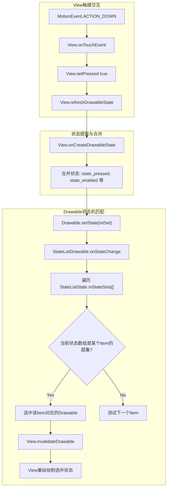
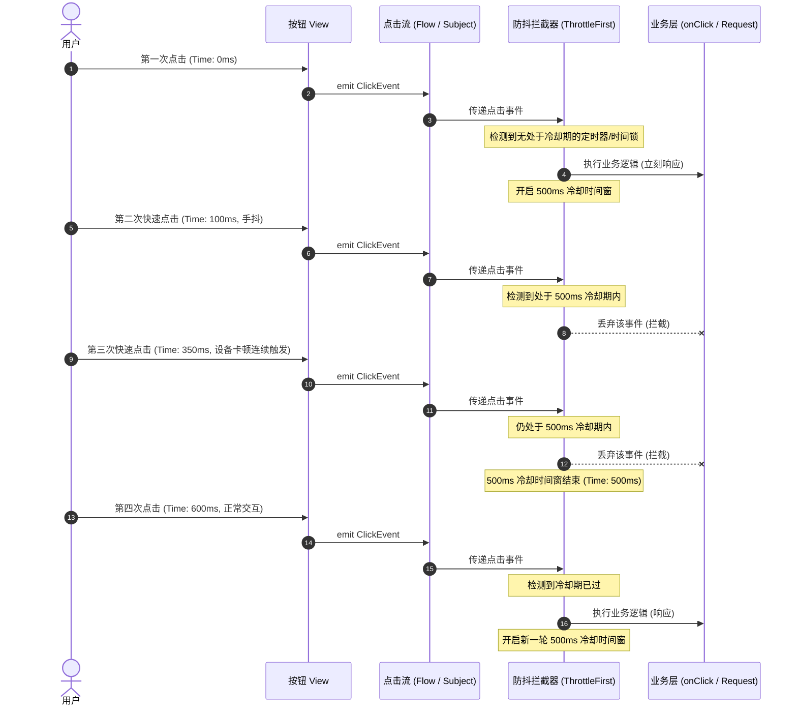

# 5.1.4.1.7 Button

## 1. 导言
在 Android 应用开发中，`Button`（按钮）是用户界面中最基础、最核心的交互控件之一。它不仅承载着引导用户进行下一步操作的任务，更是用户与应用之间建立情感连接的第一道桥梁。一个看似简单的点击动作，其背后却凝聚了 Android 系统从事件分发、无障碍辅助，到线程渲染加速和现代声明式 UI 架构的无数细节与设计取舍。

在传统的 View 体系中，`Button` 继承自 `TextView`，这种设计在带来强大文本排版和绘制复用收益的同时，也引入了类膨胀等一系列继承代价。而在点击反馈层面，从早期的基于 XML 的 `StateListDrawable`（状态选择器），到 Android 5.0 时代引入的由渲染线程（RenderThread）异步绘制的矢量水波纹（RippleEffect），Android 完成了从纯主线程逻辑绘制到跨线程平滑动画渲染的重大飞跃。进入 Jetpack Compose 时代，`Button` 彻底颠覆了面向对象的继承体系，以函数组合（Composition）的方式重构了点击交互与状态感知机制。

本文将从底层的继承架构设计、状态机匹配与水波纹渲染机理、点击事件分发与防抖拦截实战，以及 Compose 中的声明式进化等多个维度，对 Android `Button` 的原理、渲染与交互机制进行全面而深入的解密。

---

## 2. 为什么 Button 继承自 TextView？—— 体系架构设计与取舍

### 2.1 架构设计取舍与核心复用机制
在面向对象的 View 体系中，Android 团队没有让 `Button` 直接继承 `View`，而是选择让它作为 `TextView` 的直接子类。这一设计决策的核心考量在于**文本测量与排版引擎的极致复用**。

如果在 Android 中从头设计一个只继承 `View` 的 `Button`，为了能显示文本，我们不得不重新实现以下功能：
1. **FontMetrics 字体测量**：文本的大小、行高、基线（Baseline）位置计算非常繁杂。我们需要根据 Paint 的配置，精确计算 `top`、`ascent`、`baseline`、`descent`、`bottom` 等坐标。
2. **文本排版与换行（Text Layout）**：当按钮文字过长时，如何自动换行？如何处理多行居中？这需要调用复杂的 `StaticLayout` 或 `DynamicLayout`。
3. **国际化排版方向**：双向文字（Bidi）算法，即如何兼容从左到右（LTR）与从右到左（RTL，如阿拉伯语）的混合文本排版。
4. **图文混排与特殊文本格式**：通过 `SpannableString` 控制文本局部的字体颜色、下划线、甚至是嵌入图片，都需要依赖复杂的文本解析和绘制流程。

`TextView` 底层封装了 `android.text.Layout` 及其子类，并且与底层的 SKIA 图形渲染引擎紧密协作，完成了上述所有的文字渲染与换行测量工作。如果 `Button` 重新编写一套文本渲染器，不仅会导致冗余代码大量增加，还会因为字体缓存（Glyph Cache）无法有效复用而带来内存开销。因此，`Button` 继承 `TextView`，可以直接免费获得这套高度成熟的文本测量与绘制系统。

然而，这种设计也存在**架构取舍的代价**。`TextView` 为了支持文本选择（Selection）、文本编辑（EditText 的基类也是 TextView）、滚动条（ScrollBar）、复杂长文本滑动、链接跳转（LinkMovementMethod）等，源码体积极其庞大（高达上万行）。`Button` 继承它，意味着它无形中背负了大量冗余的状态和代码。即便如此，在移动设备的早期开发阶段，复用文本排版引擎所带来的研发效率和运行时性能的性价比，远大于携带这些不常用逻辑的代价。

### 2.2 核心差异分析
为了让普通的 `TextView` 蜕变为一个功能明确的 `Button`，系统在初始化 `Button` 时，通过 Theme 和默认样式属性（`defStyleAttr = com.android.internal.R.attr.buttonStyle`）对其进行了默认配置的修改。其核心差异如下：

1. **默认开启全大写转换（textAllCaps = true）**：
   在 Material Design 规范中，英语环境下的按钮文本默认需要全大写，以突出其可操作性。在 `TextView` 的构造方法中会读取此属性，并在底层配置 `AllCapsTransformationMethod`。它不仅能将英文字母转换为大写，还能保留国际化字符的特殊语义。
2. **默认居中对齐（gravity = Gravity.CENTER）**：
   `TextView` 默认是居左上对齐的（`Gravity.TOP | Gravity.START`），而 `Button` 的核心视觉是文字在矩形区域内居中，因此其默认样式中强制指定了 `Gravity.CENTER`。
3. **点击态背景与内边距（Padding）**：
   `Button` 拥有默认的背景 Drawable（传统的 `StateListDrawable` 或现代的 `RippleDrawable`）。为了保证触摸热区符合 Android 建议的 48dp 规范，`Button` 的默认样式会配置较大的 Padding（如上下 12dp，左右 16dp），并且设定了最小宽度（`minWidth`）和最小高度（`minHeight`）。
4. **默认可点击与可聚焦（clickable & focusable）**：
   `TextView` 默认的 `clickable` 和 `focusable` 属性为 `false`，而 `Button` 在构造方法中，这两个值被硬编码或者通过默认 Style 显式指定为 `true`。

---

## 3. 点击反馈机制大解密

点击反馈是按钮最为关键的交互体现。在用户点击按钮时，视觉上必须立刻给出“按下”和“抬起”的反馈。Android 历史上经历了两次重大的点击反馈机制演进：

### 3.1 传统 XML Selector 与 StateListDrawable 状态匹配机理
在 Android 5.0 之前，按钮通常使用 XML 编写的 `<selector>` 来实现点击反馈。其底层对应的 Java 类是 `StateListDrawable`。

当用户触摸按钮时，底层的交互链路与匹配机理如下：
1. **触摸状态变更**：
   当用户的手指按在 `Button` 上时，底层的 `View.onTouchEvent(MotionEvent event)` 接收到 `ACTION_DOWN` 事件，内部会触发 `setPressed(true)`。
2. **请求重绘与状态刷新**：
   `setPressed(true)` 内部会检测到状态值发生改变，随即调用 `refreshDrawableState()`。这个方法会进而调用 `View` 的 `onCreateDrawableState(int extraSpace)`。
3. **合并状态数组**：
   `onCreateDrawableState()` 是 View 体系中状态机的核心所在。它会根据当前 View 的状态属性，例如 `isPressed()`、`isEnabled()`、`isFocused()`、`isSelected()` 等，将对应的属性常量值（如 `android.R.attr.state_pressed`、`android.R.attr.state_enabled` 等）合并成一个整型状态数组 `int[] stateSet`。
4. **分发给 Drawable 状态机**：
   View 会调用其背景 Drawable 的 `setState(stateSet)` 方法。在 `StateListDrawable` 中，这个调用会被传递至其内部的成员变量 `StateListState`。
5. **从上至下线性过滤与匹配**：
   `StateListState` 内部以数组的形式按声明顺序存储了 XML 中定义的所有 `<item>` 节点，每个节点包含一个状态掩码数组（如 `{state_pressed, state_enabled}`）和一个对应的 Drawable 资源。
   `StateListDrawable` 会开始**线性遍历**这些 `<item>` 的状态数组，检测当前的 `stateSet` 是否是该 `<item>` 状态集的一个**超集**。
   * **超集匹配规则**：如果 `<item>` 要求 `state_pressed="true"`，而当前 View 的 `stateSet` 刚好包含该值，则匹配成功。如果 `<item>` 没有声明任何状态限制，则相当于空集，它能匹配任何 View 的状态。
   * **线性过滤的副作用**：由于匹配是自上而下按序执行的，一旦找到第一个匹配成功的 `<item>`，就会立即中断遍历并返回该项对应的 Drawable。这就是为什么**无状态限制的默认 item 必须放在 Selector XML 文件的最底部**，否则它会在首轮遍历中拦截所有状态，导致其余带有状态判定（如 `pressed`、`focused`）的 item 永远无法生效。
6. **重绘渲染**：
   选中新的 Drawable 后，`StateListDrawable` 会调用 `invalidateSelf()`，向 View 发送重绘请求，View 会在下一个 VSYNC 信号到来时，在 UI 线程上重新绘制该 Drawable，呈现出按下的视觉状态。

下面是这个经典状态匹配与状态机解析的 Mermaid 图：



### 3.2 现代 Material Design 的矢量水波纹 RippleDrawable
为了配合现代 Material Design 视觉规范，Android 5.0 (API 21) 引入了矢量水波纹（RippleEffect）机制，其底层对应的实现类为 `RippleDrawable`。关于 Android 5.0 起引入的海拔（elevation）和水波纹技术变更详情，可参见根目录的变更日志说明 [AndroidVersionChangeLog.md](../../../../../../AndroidVersionChangeLog.md)。

#### RenderThread 异步渲染机理
传统的 `StateListDrawable` 或者普通的动画实现，其绘制渲染完全依赖于**UI主线程（Main Thread）**。如果主线程由于执行复杂的业务逻辑（例如在滑动列表时 inflate 复杂布局、解析大 JSON、或者频繁进行 GC 导致 Stop-The-World），就会无法及时向底层的 `Choreographer` 发送 VSYNC 请求，导致水波纹动画帧率暴跌、卡顿甚至完全无法显示。

为了实现顺滑的 60fps/120fps 涟漪效果，Google 从 Android 5.0 开始引入了独立的 **RenderThread（渲染线程）**。`RippleDrawable` 正是基于这一架构演化而来，其流畅运行的底层机理如下：

1. **动画属性物理托管**：
   在 `RippleDrawable` 初始化时，涟漪的圆心（centerX/Y）、当前半径（radius）、以及透明度（opacity）并不是普通的 Java Float 变量，而是被封装在了特有的 `CanvasProperty<Float>` 对象中。
2. **绘制指令与硬件加速**：
   当用户点击 Button 时，UI 主线程首先捕获物理点击事件，并计算出触摸点坐标。随后，`RippleDrawable` 启动涟漪动画。不过，UI 线程**不参与**具体的动画循环计算，它只是在第一次绘制时，将绘制水波纹的命令（例如画圆 `drawCircle`）写入到 `DisplayList`（绘制命令序列）中。
3. **RenderNode 与 GPU 绑定**：
   UI 线程将携带了 `CanvasProperty` 的 `DisplayList` 提交给 `RenderThread`。在 RenderThread 中，底层的 HWUI（Android 硬件加速渲染引擎）把 `CanvasProperty` 与物理 GPU 上的着色器参数进行了绑定。
4. **主线程卡顿下的独立渲染**：
   一旦动画开启，RenderThread 会在每个 VSYNC 信号到来时，独立在 GPU 上更新 `CanvasProperty` 的值（例如让半径递增、透明度递减），并自动更新对应的 RenderNode。
   即使此时 UI 主线程被卡住（比如执行了一个耗时 300ms 的网络回调解析），由于 RenderThread 是一个独立的线程，它依然能够以每秒 60 次（或在现代高刷屏上每秒 120 次）的频率从底层接收 VSYNC 信号，将变化后的涟漪数据直接提交给 GPU 完成画面渲染。这就是保证了**水波纹动画绝对不会因为主线程卡顿而发生丝毫的掉帧**，从而为用户提供了极其流畅和灵敏的交互反馈。

---

## 4. 点击事件分发、无障碍（Accessibility）与点击防抖（Debounce）

### 4.1 点击事件分发与触发机制
当用户用手指触碰并松开 Button 时，底层的事件分发和点击触发链条如下：
1. **ACTION_DOWN 分发**：
   手指按下，事件通过 `ViewGroup` 的 `dispatchTouchEvent()` 层层向下分发，最终传递给 `Button.onTouchEvent()`。
   * 在 `onTouchEvent` 中，View 会判断自身的 `CLICKABLE` 属性。由于 Button 默认可点击，它会启动长按检测任务 `CheckForLongPress`（延迟 500ms 执行），并标记 `setPressed(true)`。
2. **ACTION_MOVE 判定**：
   手指在按钮表面滑动。如果超出了 View 的边界（`TouchSlop` 判定范围），View 会自动移除按下状态，并取消长按任务。
3. **ACTION_UP 触发点击**：
   手指离开屏幕。如果此时手指出屏坐标仍在 View 的有效范围内，View 会移除 `CheckForLongPress` 任务，并调用核心方法 `performClick()`。
   en performClick() 中：
   * 会检测并执行设置的 `OnClickListener`：
     ```java
     public boolean performClick() {
         // ... 
         final ListenerInfo li = mListenerInfo;
         if (li != null && li.mOnClickListener != null) {
             playSoundEffect(SoundEffectConstants.CLICK);
             li.mOnClickListener.onClick(this);
             result = true;
         }
         // ...
         return result;
     }
     ```
   * 同时它还会通过无障碍机制向上报送点击事件。

### 4.2 无障碍（Accessibility）行为
对于视障等特殊用户，Android 的无障碍通道（AccessibilityService）与 `Button` 之间的协作逻辑十分关键：
1. **角色（Role）识别**：
   普通的 `TextView` 并没有固定的无障碍角色。而 `Button` 重写了 `getAccessibilityClassName()`：
   ```java
   @Override
   public CharSequence getAccessibilityClassName() {
       return Button.class.getName();
   }
   ```
   这使得 TalkBack 等屏幕朗读器在聚焦到按钮时，能直接将其识别为 `Button` 角色，并用特定语音后缀（如中文下的“按钮”）播报按钮上的文本。
2. **激活指令映射**：
   TalkBack 开启后，单指轻触不会触发 `OnClickListener`，只会改变辅助聚焦框。当用户双击屏幕的任意位置时，无障碍框架会代理该手势，并在底层的 `AccessibilityNodeProvider` 中定位该按钮，通过直接调用 `performAccessibilityAction(AccessibilityNodeInfo.ACTION_CLICK, null)` 绕过物理手势判定，直接触发 `Button.performClick()`，确保无障碍操作的正确落地。

### 4.3 点击防抖（Debounce）的实现机制与设计模式
**重复点击痛点**：在实际开发中，由于网络延迟或设备运行卡顿，用户可能会在短时间内多次点击同一个提交按钮，这会导致重复向服务器发送表单请求（例如下重复的订单），或者在 Activity 栈中重复打开同一个页面。这种现象在低端机上极为普遍。为了解决这一痛点，开发者需要实现**点击防抖（Debounce）**。

其底层拦截机制与设计模式可以划分为以下两种主流实现：

#### 方案一：基于系统时间戳（或反射）的手动拦截
这是最直接的防抖逻辑。它的核心思路是：拦截每一次点击，并判断当前时间与上一次成功响应的点击时间的差值。如果差值小于设定的最小间隔阈值（如 500ms），则将该点击事件予以丢弃。

```kotlin
class DebouncedClickListener(
    private val interval: Long = 500L,
    private val onClickListener: View.OnClickListener
) : View.OnClickListener {
    private var lastClickTime = 0L

    override fun onClick(v: View) {
        val currentTime = SystemClock.elapsedRealtime()
        // 核心判断：对比两次点击的时间戳差值
        if (currentTime - lastClickTime >= interval) {
            lastClickTime = currentTime
            onClickListener.onClick(v)
        }
    }
}

// Kotlin 扩展函数，便于链式调用
fun View.setOnDebouncedClickListener(interval: Long = 500L, action: (View) -> Unit) {
    this.setOnClickListener(DebouncedClickListener(interval, View.OnClickListener { action(it) }))
}
```
> [!IMPORTANT]
> **关键细节：为什么使用 `SystemClock.elapsedRealtime()` 而非 `System.currentTimeMillis()`？**
> `System.currentTimeMillis()` 是“墙上时间”（Wall Clock Time），代表系统绝对时间。它容易受到用户手动修改系统时间、或者是 NTP 自动对时网络同步的影响，时间可能会发生向前跳跃或向后回溯，从而使防抖逻辑失效。
> 而 `SystemClock.elapsedRealtime()` 是自系统启动以来的绝对时间，包含设备深度睡眠（Deep Sleep）的流逝时间，它具有绝对的单调递增性，不会因为任何外界因素发生突变，是用于防抖测量的最佳物理依据。

#### 方案二：基于响应式编程与协程的数学/调度模型
手动记录时间戳在面对多路并发、生命周期绑定时会显得较为繁琐。我们可以通过更高级的响应式编程模型（如 RxJava 或 Kotlin 协程的 Flow）来对点击流进行数学建模。

* **RxJava 的 ThrottleFirst 模型（第一项限流）**：
  在 RxJava 中，防抖并不是使用 `debounce`（它代表在一段静止期后发射最后一次事件），而是使用 `throttleFirst`（在时间窗内仅发射第一次事件并冷却）。
  * **底层数学模型**：一旦事件流产生数据 $e_0$，就立即放行发射，并在此刻建立一个时间窗 $[T_0, T_0 + \tau]$。在这一闭区间内，所有后续的 $e_1, e_2$ 都会被忽略。当时间流逝超过 $T_0 + \tau$ 后，才允许重新接受下一个事件。
  * **实现细节**：我们可以在 View 上绑定一个 `PublishSubject`：
    ```kotlin
    val clicks = PublishSubject.create<View>()
    button.setOnClickListener { clicks.onNext(it) }

    clicks.throttleFirst(500, TimeUnit.MILLISECONDS)
          .observeOn(AndroidSchedulers.mainThread())
          .subscribe { view ->
              // 执行业务逻辑
          }
    ```
    在底层的 `ThrottleFirst` 操作符实现中，它通过一个原子性变量（`AtomicLong` 或带有 `CAS` 操作的锁状态）记录上一次成功透传的时间戳。即便是在高并发或者多线程背景下，由于原子变量锁的保护，也绝对能保证仅有一个点击事件能够穿透过滤器。

* **Kotlin 协程 Flow 拦截模型**：
  在 Kotlin 协程中，由于官方标准的 `Flow` 没有提供类似于 RxJava 的 `throttleFirst` 操作符，我们需要手动构造一个非阻塞的限流器。我们可以结合 `Mutex` 锁或是使用协程内部的时间计算：

  ```kotlin
  fun <T> Flow<T>.throttleFirst(windowDuration: Long): Flow<T> = flow {
      var lastEmissionTime = 0L
      collect { value ->
          val currentTime = System.currentTimeMillis()
          if (currentTime - lastEmissionTime >= windowDuration) {
              lastEmissionTime = currentTime
              emit(value)
          }
      }
  }
  ```

下面是 RxJava / 协程实现防重击 Debounce 拦截处理的时序图：



---

## 5. Jetpack Compose Button 的声明式进化

在 Jetpack Compose 中，Android 按钮的设计经历了一次颠覆性的变革，彻底摆脱了传统的命令式体系和深层继承弊端。

### 5.1 从“继承”到“组合”的架构范式转换
在前面的章节中我们分析过，传统的 `Button` 继承自 `TextView` 导致了严重的类膨胀和功能绑定。
在 Jetpack Compose 中，Google 否定了这种“面向对象”的类集成思想，转而拥抱**“组合优于继承”（Composition over Inheritance）**的函数式范式。

Compose 中的 `Button` 不再是一个庞大的类，而是一个轻量级的 `@Composable` 函数。其定义如下：
```kotlin
@Composable
fun Button(
    onClick: () -> Unit,
    modifier: Modifier = Modifier,
    enabled: Boolean = true,
    shape: Shape = ButtonDefaults.shape,
    colors: ButtonColors = ButtonDefaults.buttonColors(),
    elevation: ButtonElevation? = ButtonDefaults.buttonElevation(),
    border: BorderStroke? = null,
    contentPadding: PaddingValues = ButtonDefaults.ContentPadding,
    interactionSource: MutableInteractionSource = remember { MutableInteractionSource() },
    content: @Composable RowScope.() -> Unit
)
```
我们可以看到，`Button` 仅仅扮演一个“卡片容器”的角色。它接收一个 `content` 表达式，该表达式被约束在 `RowScope` 作用域内。这意味着：
* 如果要在按钮上显示文字，你需要在其内部主动声明一个 `Text("按钮文本")`；
* 如果你想实现一个图标按钮，可以直接在其内部放置一个 `Icon` 和一个 `Text`，它们会自动按 `Row`（行布局）水平排列。
这就彻底把“文字排版测量”与“按钮点击行为”进行了**解耦**。

### 5.2 Compose Button 的核心实现：组合机制
在 Compose 底层，`Button` 的本质是一个包裹了 `Surface` 的微件。而 `Surface` 的底层又利用了 `Box` 布局和一系列的 `Modifier`。
核心点击交互由 `Modifier.clickable()` 或者 `Modifier.combinedClickable()` 来接管：

1. **点击态水波纹（Indication）**：
   在 Compose 体系中，点击效果由 `Indication` 控制。`Modifier.clickable` 底层会获取当前的 `RippleTheme`，并使用由 Android 平台硬件渲染加速支持的 `RippleIndication` 来执行绘制。这保证了在 Compose 中即便界面十分复杂，水波纹的展开依然能获得硬件渲染线程（RenderThread）的异步流畅加速。
2. **事件流分发与触控感知**：
   Compose 使用了全新的手势处理系统（指针输入 Pointer Input）。在 `clickable` 修饰符的实现中，通过 `pointerInput` 操作符来检测触摸序列（Pointer Events）。这比起 View 体系中层层分发和拦截的 `dispatchTouchEvent`，其逻辑要扁平、清晰得多。

### 5.3 声明式状态重组（Recomposition）与点击交互响应（InteractionSource）
传统 View 需要根据当前的 pressed/focused 状态值生成状态数组去触发 Selector 重绘。而在 Compose 的声明式世界中，状态的变更会自动触发局部重组。

这一切得益于 `InteractionSource`（交互源）的设计：
1. **收集交互状态流**：
   `Button` 暴露了 `interactionSource: MutableInteractionSource` 参数。这是一个响应式的交互数据流（类似于 Kotlin 的 `Flow`），用于发射代表用户手势交互的 `Interaction`（例如 `PressInteraction.Press`、`PressInteraction.Release`、`FocusInteraction.Focus` 等）。
2. **状态收集与局部重组**：
   开发者可以通过便利的扩展方法，在协程和重组域中感知并观察这些状态流：
   ```kotlin
   val interactionSource = remember { MutableInteractionSource() }
   val isPressed by interactionSource.collectIsPressedAsState()
   
   val backgroundColor = if (isPressed) Color.Gray else Color.Blue
   
   Button(
       onClick = { /* 执行操作 */ },
       colors = ButtonDefaults.buttonColors(containerColor = backgroundColor),
       interactionSource = interactionSource
   ) {
       Text("声明式按钮")
   }
   ```
   * **运行流程**：当用户手指按下，`clickable` 内部会向 `interactionSource` 发送一个 `Press` 事件。
   * **触发重组**：`collectIsPressedAsState()` 内部的流收集器监听到新事件，将内部的 Compose State 状态值更新为 `true`。
   * **局部重绘**：Compose 的重组器（Recomposer）检测到 `backgroundColor` 依赖的 `isPressed` 状态发生了变化，随即触发这一小段代码的局部重组，以极低的性能开销完成背景色的平滑过渡渲染。

---

## 6. 总结
Android 中的 `Button` 历经了多年的架构演进。在经典的 View 体系中，它巧妙地通过继承 `TextView` 复用了庞大但极其必要的文字测量排版引擎，同时通过 XML Selector 与硬件级别的 RenderThread 水波纹实现了主线程无关的流畅点击反馈。为了应对实际开发中的多次点击痛点，手动时间戳检测和基于 RxJava/协程的防抖调度模型提供了灵活可靠的拦截方案。

进入 Jetpack Compose 时代，以 `Modifier` 和 `InteractionSource` 为核心的声明式“组合”模式，将按钮从沉重的类继承体系中彻底解放出来，在降低耦合度的同时，提供了更为扁平、直观的事件响应机制。理解这些深层次的机理与演进取舍，有助于我们在不同的 Android 架构版本下，都能开发出性能优异、触觉灵敏且业务健壮的用户界面。
