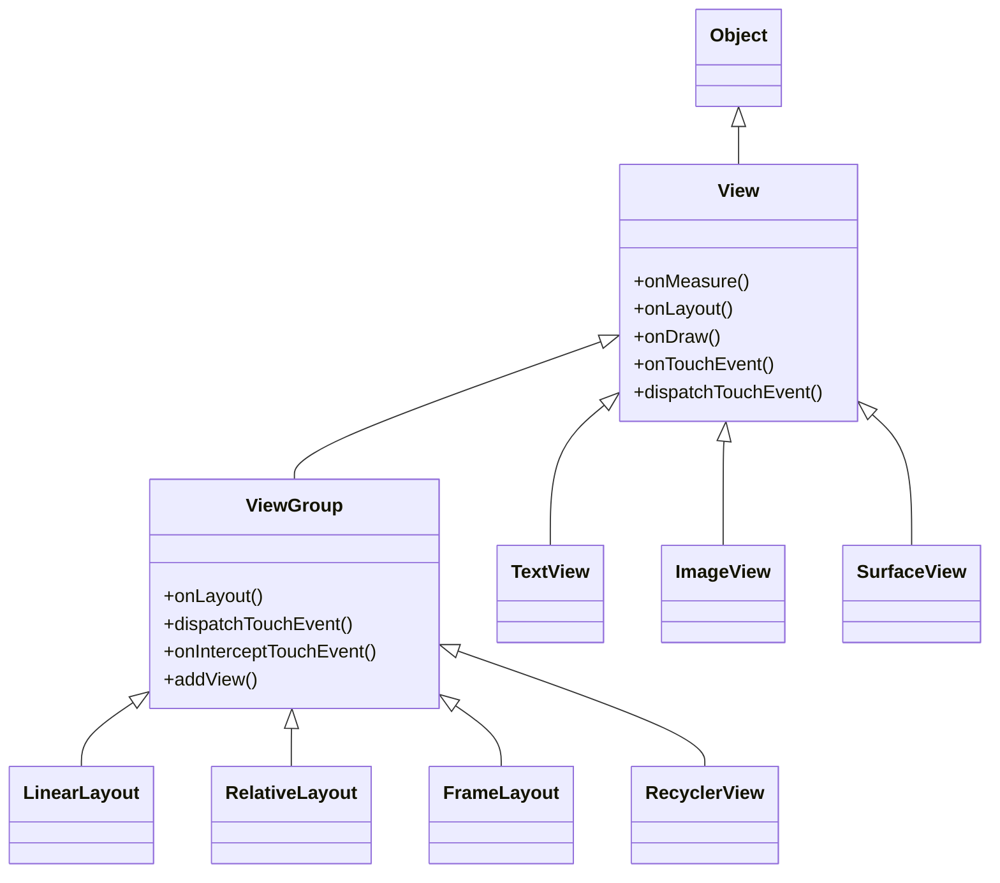
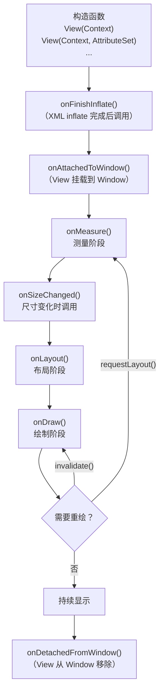
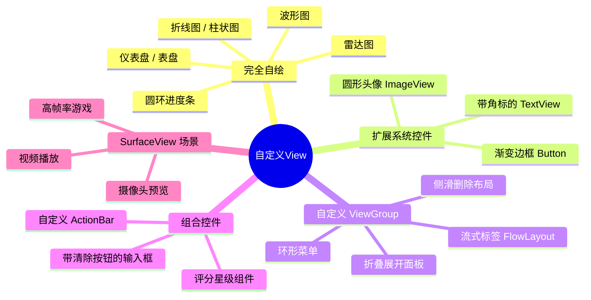

# 5.1.4.2.0 自定义View概述

Android 的 UI 系统是一套以 `View` 为核心原语构建的、高度可扩展的声明式渲染框架。尽管系统内置了数十种标准控件，但在实际产品开发中，总会遇到系统控件无法满足需求的场景——无论是复杂的交互动效、特殊的视觉形态，还是对性能极度敏感的场景（如游戏画面、K 线图、自定义布局算法）。自定义 View 是 Android UI 能力的天花板入口，也是中高级开发者必须掌握的核心技能。

本文作为自定义 View 系列的起点，从全局视角建立完整的认知框架：它是什么、何时使用、继承体系如何、生命周期如何流转、如何动手实现，以及常见陷阱在哪里。具体到测量、布局、绘制三大核心阶段的机制细节，分别参见：
- [onMeasure](5.1.4.2.1.onMeasure.md)：MeasureSpec 解密、尺寸协商与 `wrap_content` 的正确实现
- [onLayout](5.1.4.2.2.onLayout.md)：子 View 坐标分配、布局遍历与自定义 ViewGroup 排版策略
- [onDraw](5.1.4.2.3.onDraw.md)：Canvas、Paint、Bitmap 协作模型与硬件加速绘制管线

---

## 一、什么是自定义 View

自定义 View 是指开发者通过继承 `View` 或 `ViewGroup`（或其任意子类），重写特定的回调方法，以实现系统内置控件无法提供的外观或行为的 UI 组件。

"自定义"并不意味着从零绘制所有内容。按照实现策略的不同，自定义 View 可以分为以下四类：

| 分类 | 实现方式 | 典型场景 |
|------|---------|---------|
| **继承 View 完全自绘** | 继承 `View`，重写 `onMeasure` + `onDraw` | 仪表盘、折线图、自定义进度条 |
| **继承已有控件扩展** | 继承 `TextView`/`ImageView` 等，在现有能力上叠加功能 | 带删除线的 TextView、圆形头像 ImageView |
| **继承 ViewGroup 自定义布局** | 继承 `ViewGroup`，重写 `onMeasure` + `onLayout` | 流式标签布局、瀑布流、环形菜单 |
| **组合复用现有控件** | 继承 `LinearLayout`/`FrameLayout` 等，通过 XML 组合子控件 | 带 label 的输入框、自定义 ToolBar |

选择哪种策略，取决于目标与系统控件能力的"距离"：**距离近则扩展，距离远则自绘，需要排版子控件则继承 ViewGroup**。

---

## 二、View 的继承体系

理解自定义 View 的前提是清楚 Android 视图系统的类层次结构。



**几个关键设计点：**

- `View` 是所有控件的基类，封装了测量、布局、绘制、事件处理的完整生命周期。
- `ViewGroup` 继承自 `View`，本身也是一个 View，额外具有管理和排布子 View 的职责。这种"容器本身也是 View"的设计构成了 Android 视图树（View Tree）的递归结构基础。
- `SurfaceView` 与普通 `View` 不同，它拥有独立的绘制线程和 Surface 缓冲区，绕开了主线程的 `onDraw` 机制，适用于视频播放、高帧率游戏等场景，但代价是失去了 View 动画系统的支持和 Z 轴合成能力（API 24 以前）。
- `TextureView` 是 `SurfaceView` 的"软化"版本，将渲染内容作为普通纹理合并进 View 层次，支持动画和变换，但需要硬件加速且内存开销更高。

---

## 三、View 的完整生命周期

View 的生命周期并非只有测量-布局-绘制三步，从构造到销毁经历了一系列回调，理解其时序是正确实现自定义 View 的关键。



各阶段的核心职责如下：

- **构造函数**：初始化 Paint、路径对象、动画等成员变量。切记不要在此执行耗时操作，不要调用 `getWidth()`/`getHeight()`（此时尺寸尚未确定，会返回 0）。
- **`onFinishInflate()`**：当 View 及其所有子 View 从 XML 中 inflate 完成后触发。适合在此时查找并绑定子 View 的引用（`findViewById`），比在构造函数中更安全。
- **`onAttachedToWindow()`**：View 加入 Window 后回调，适合在此注册广播、开启动画、订阅数据。
- **`onMeasure()`**：系统询问 View 需要多大空间。详见 [onMeasure](5.1.4.2.1.onMeasure.md)。
- **`onSizeChanged(w, h, oldw, oldh)`**：尺寸确定后（或发生变化时）触发，适合在此初始化与尺寸相关的对象（如 `Bitmap`、`RectF` 等），避免在 `onDraw` 中反复创建。
- **`onLayout()`**：父容器确定此 View 及其子 View 的位置。详见 [onLayout](5.1.4.2.2.onLayout.md)。
- **`onDraw()`**：绘制 View 的视觉内容。详见 [onDraw](5.1.4.2.3.onDraw.md)。
- **`onDetachedFromWindow()`**：View 从 Window 移除时触发，适合在此注销广播、停止动画、释放资源，防止内存泄漏。

**`invalidate()` 与 `requestLayout()` 的区别：**

这是一个极为常见的混淆点：

- `invalidate()`：标记 View 的视觉内容"脏了"，仅触发 `onDraw()`，不重新测量和布局。适用于内容发生变化但尺寸不变的场景（如进度条进度更新、颜色切换）。
- `requestLayout()`：通知系统 View 的尺寸或位置需求发生了变化，触发完整的 Measure → Layout → Draw 流程。适用于 View 尺寸或其子 View 结构发生变化的场景。
- `postInvalidate()`：`invalidate()` 的线程安全版本，可在非 UI 线程中调用，内部通过 Handler 转发到主线程执行。

---

## 四、自定义 View 与自定义 ViewGroup 的选择策略

这是自定义 View 开发的第一个决策点。

**选择继承 `View` 的场景：**
- 需要完全控制绘制内容，视觉形态与系统任何控件差异较大（如波形图、圆环进度、雷达图）。
- 无需管理子 View，所有内容由 `onDraw` 直接绘制。

**选择继承 `ViewGroup` 的场景：**
- 需要将多个子 View 按自定义规则排列（如流式标签、环形菜单、折叠面板）。
- 自定义的是"容器的排版算法"，而非单个 View 的视觉内容。
- 继承 `ViewGroup` 时，通常不需要重写 `onDraw`（ViewGroup 默认不绘制自身背景以外的内容）。

**继承已有控件的场景：**
- 需要系统控件的全部基础能力（文字渲染、图片解码、点击反馈等），仅需叠加少量扩展功能。
- 例如继承 `ImageView` 实现圆角或圆形裁剪，继承 `TextView` 添加自定义下划线样式。

**一个常见的误判**：将多个控件组合后的整体以自定义 View 呈现，但内部的子 View 需要独立接收事件或动态更新——此时应使用 `ViewGroup` 而非在单个 `View.onDraw()` 中模拟子控件。在 `onDraw` 中绘制"假控件"会失去无障碍支持（Accessibility）、焦点管理和系统事件分发能力。

---

## 五、构造函数的四种形式

Java/Kotlin 自定义 View 的构造函数有四种签名，系统在不同场景下会调用不同的形式，理解它们的触发时机和职责链是正确初始化 View 的基础。

```kotlin
class MyView : View {

    // 形式一：仅 Context，代码创建时调用
    constructor(context: Context) : this(context, null)

    // 形式二：Context + AttributeSet，XML inflate 时调用
    constructor(context: Context, attrs: AttributeSet?) : this(context, attrs, 0)

    // 形式三：Context + AttributeSet + defStyleAttr，
    //         系统在 inflate 时需要应用主题默认样式时调用
    constructor(context: Context, attrs: AttributeSet?, defStyleAttr: Int)
        : this(context, attrs, defStyleAttr, 0)

    // 形式四：Context + AttributeSet + defStyleAttr + defStyleRes（API 21+）
    //         可在此处指定默认样式资源
    constructor(
        context: Context,
        attrs: AttributeSet?,
        defStyleAttr: Int,
        defStyleRes: Int
    ) : super(context, attrs, defStyleAttr, defStyleRes) {
        // 在这里完成所有初始化：读取自定义属性、初始化 Paint 等
        init(context, attrs, defStyleAttr, defStyleRes)
    }

    private fun init(
        context: Context,
        attrs: AttributeSet?,
        defStyleAttr: Int,
        defStyleRes: Int
    ) {
        // 读取自定义属性
        val ta = context.obtainStyledAttributes(
            attrs, R.styleable.MyView, defStyleAttr, defStyleRes
        )
        try {
            // ... 读取属性值
        } finally {
            ta.recycle() // 必须 recycle，否则内存泄漏
        }
    }
}
```

**触发时机说明：**

| 构造函数 | 触发场景 |
|---------|---------|
| `View(Context)` | 纯代码创建：`MyView(context)` |
| `View(Context, AttributeSet)` | XML 中使用 `<MyView .../>` inflate |
| `View(Context, AttributeSet, defStyleAttr)` | XML inflate 且 View 自身声明了默认主题属性 |
| `View(Context, AttributeSet, defStyleAttr, defStyleRes)` | API 21+，inflate 时需要解析样式资源 |

**最佳实践**：将全部初始化逻辑抽取到一个 `init()` 私有方法中，由最完整的构造函数调用，其余构造函数通过 `this(...)` 委托链向上传递，避免代码重复和初始化遗漏。

---

## 六、开发自定义 View 的核心步骤

一个生产级自定义 View 的开发流程通常包括以下步骤：

### 步骤一：确定继承基类

根据第四节的策略选择 `View`、`ViewGroup` 或其他已有控件作为基类。

### 步骤二：声明自定义属性（可选）

在 `res/values/attrs.xml` 中声明 `declare-styleable`，使 View 可通过 XML 属性配置。详见 [自定义属性](5.1.4.2.4.自定义属性.md)。

```xml
<declare-styleable name="MyView">
    <attr name="ringColor" format="color" />
    <attr name="ringWidth" format="dimension" />
    <attr name="progress" format="float" />
</declare-styleable>
```

### 步骤三：在构造函数中完成初始化

读取自定义属性、初始化 `Paint`、路径等绘制所需的对象。

```kotlin
private val paint = Paint(Paint.ANTI_ALIAS_FLAG).apply {
    style = Paint.Style.STROKE
}
```

**关键原则**：`Paint`、`Path`、`RectF` 等对象必须在构造阶段或 `onSizeChanged` 中创建，**绝不能在 `onDraw` 中 `new` 对象**，否则每帧都触发 GC，导致界面卡顿。

### 步骤四：重写 onMeasure 处理尺寸协商

为 View 提供合理的测量逻辑，尤其是正确处理 `wrap_content` 场景。详细机制见 [onMeasure](5.1.4.2.1.onMeasure.md)。

```kotlin
override fun onMeasure(widthMeasureSpec: Int, heightMeasureSpec: Int) {
    // 计算 View 的期望尺寸（默认内容大小）
    val desiredWidth = 200.dpToPx()
    val desiredHeight = 200.dpToPx()
    // 通过 resolveSize 结合 MeasureSpec 协商最终尺寸
    val width = resolveSize(desiredWidth, widthMeasureSpec)
    val height = resolveSize(desiredHeight, heightMeasureSpec)
    setMeasuredDimension(width, height)
}
```

### 步骤五：在 onSizeChanged 中更新尺寸依赖对象

```kotlin
override fun onSizeChanged(w: Int, h: Int, oldw: Int, oldh: Int) {
    super.onSizeChanged(w, h, oldw, oldh)
    // 在此处初始化依赖宽高的对象，而不是在 onDraw 中
    centerX = w / 2f
    centerY = h / 2f
    radius = minOf(w, h) / 2f - paint.strokeWidth / 2f
    bounds = RectF(
        centerX - radius, centerY - radius,
        centerX + radius, centerY + radius
    )
}
```

### 步骤六：重写 onLayout（仅 ViewGroup）

如果继承了 `ViewGroup`，需要在 `onLayout` 中调用每个子 View 的 `layout(l, t, r, b)` 方法为其分配位置。详见 [onLayout](5.1.4.2.2.onLayout.md)。

### 步骤七：重写 onDraw 实现绘制

在 `onDraw` 中使用 Canvas 绘制视觉内容。详见 [onDraw](5.1.4.2.3.onDraw.md)。

```kotlin
override fun onDraw(canvas: Canvas) {
    super.onDraw(canvas)
    // 绘制背景圆环
    paint.color = trackColor
    canvas.drawArc(bounds, 0f, 360f, false, paint)
    // 绘制进度弧
    paint.color = ringColor
    canvas.drawArc(bounds, -90f, progress * 360f, false, paint)
}
```

### 步骤八：处理触摸事件（可选）

如需响应手势，重写 `onTouchEvent` 或使用 `GestureDetector`。完整的分发、拦截与消费关系详见 [事件分发机制](5.1.4.2.5.事件分发机制.md)。

### 步骤九：支持无障碍（Accessibility）

为视障用户提供内容描述，通过 `contentDescription` 或重写 `onInitializeAccessibilityNodeInfo` 提供语义信息。这在生产应用中是必要的合规要求。

---

## 七、常见误区与注意事项

### 误区一：在 onDraw 中创建对象

这是最常见且危害最大的错误。`onDraw` 在动画场景下每秒可能被调用 60 次或更多，在其中 `new Paint()` 或 `new Path()` 会触发频繁 GC，轻则帧率下降，重则在低端机上出现明显卡顿。

**正确做法**：所有绘制对象在成员变量层级声明并在构造函数或 `onSizeChanged` 中初始化。

### 误区二：直接在 onDraw 中调用 invalidate()

```kotlin
// 错误！会造成无限绘制循环，CPU 飙升
override fun onDraw(canvas: Canvas) {
    // ... 绘制
    invalidate() // 绝不能这样做
}
```

如需持续动画，应使用 `ValueAnimator`、`ObjectAnimator` 或 `Choreographer.FrameCallback`，在动画帧回调中按需触发 `invalidate()`。

### 误区三：在构造函数中获取 View 的宽高

构造函数执行时，View 尚未经过测量，`getWidth()` 和 `getHeight()` 返回 0。应在 `onSizeChanged` 或 `post { }` 的回调中获取宽高。

### 误区四：忘记处理 wrap_content

如果不重写 `onMeasure`，`wrap_content` 与 `match_parent` 的行为相同——View 会填满父容器。这对大多数业务场景是错误的。

### 误区五：在 ViewGroup 的 onDraw 中绘制内容

`ViewGroup` 默认不调用 `onDraw`（有优化标志位 `WILL_NOT_DRAW` 默认为 true）。如果继承 `ViewGroup` 并重写 `onDraw`，必须调用：
```kotlin
setWillNotDraw(false)
```
否则 `onDraw` 不会被执行。

### 误区六：忘记调用 super 方法

- `onMeasure` 最终必须调用 `setMeasuredDimension()`，否则系统抛出 `IllegalStateException`。
- `onDraw` 通常应调用 `super.onDraw(canvas)`（除非完全自绘且不需要系统背景绘制）。
- `onTouchEvent` 如不消费事件，应返回 `super.onTouchEvent(event)` 而非直接 `return false`。

---

## 八、性能注意事项

### 减少过度绘制（Overdraw）

过度绘制指同一个像素在同一帧中被多次绘制。通过开发者选项的"调试 GPU 过度绘制"可视化检测。减少策略：
- 不要给自定义 View 同时设置背景 Drawable 和在 `onDraw` 中绘制背景，二者选其一。
- 使用 `canvas.clipRect()` 裁剪绘制区域，跳过不可见区域的绘制。
- 在复杂场景中使用 `canvas.quickReject()` 提前过滤不在裁剪区域内的绘制指令。

### 利用硬件加速

Android 3.0（API 11）起默认开启硬件加速。在硬件加速模式下，`Canvas` 的绘制指令被录制为 `DisplayList`，由 GPU 执行，而非 CPU 直接光栅化。

注意：部分 Canvas API 在硬件加速模式下不被支持（如 `drawPicture()`、某些 PorterDuff 模式在旧版本上的兼容性问题）。可通过 `canvas.isHardwareAccelerated` 判断当前绘制环境，按需降级处理。

### 缓存复杂绘制结果

对于计算量大的绘制内容（如复杂路径、文字排版），可在首次绘制时将结果缓存到 `Bitmap`，后续帧直接 `drawBitmap`：

```kotlin
private var cacheBitmap: Bitmap? = null
private var cacheCanvas: Canvas? = null

override fun onSizeChanged(w: Int, h: Int, oldw: Int, oldh: Int) {
    super.onSizeChanged(w, h, oldw, oldh)
    cacheBitmap?.recycle()
    cacheBitmap = Bitmap.createBitmap(w, h, Bitmap.Config.ARGB_8888)
    cacheCanvas = Canvas(cacheBitmap!!)
    // 将复杂内容绘制到 cacheCanvas
    drawComplexContent(cacheCanvas!!)
}

override fun onDraw(canvas: Canvas) {
    cacheBitmap?.let { canvas.drawBitmap(it, 0f, 0f, null) }
    // 再绘制需要实时更新的动态部分
}
```

### 避免在主线程执行耗时计算

`onDraw` 运行在主线程。如果 View 需要大量数据计算（如图表数据聚合、路径生成），应在后台线程提前计算好，将结果缓存为绘制所需的简单数据结构，然后 `invalidate()` 触发重绘。

### 适时释放资源

在 `onDetachedFromWindow()` 中释放 Bitmap、停止 Animator、注销监听器，防止 View 引用链导致的 Context 泄漏。

---

## 九、自定义 View 的典型应用全景



以上是自定义 View 的全局认知框架。在实际开发中，掌握测量、布局、绘制三大阶段的机制是实现复杂自定义 View 的核心。进一步学习请参阅本目录下的各专题文档：

- [onMeasure](5.1.4.2.1.onMeasure.md)：深入理解 MeasureSpec 与尺寸协商机制
- [onLayout](5.1.4.2.2.onLayout.md)：掌握 ViewGroup 布局算法与坐标体系
- [onDraw](5.1.4.2.3.onDraw.md)：系统掌握 Canvas/Paint 绘制能力与硬件加速管线
- [自定义属性](5.1.4.2.4.自定义属性.md)：declare-styleable 与 TypedArray 的正确使用
- [事件分发机制](5.1.4.2.5.事件分发机制.md)：系统理解 `dispatchTouchEvent`、`onInterceptTouchEvent`、`onTouchEvent`、手势消费与滑动冲突
