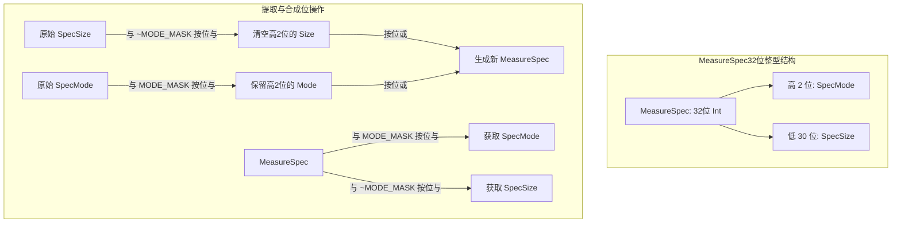
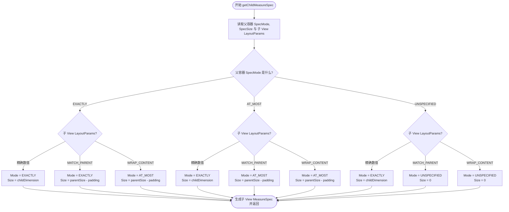

# 5.1.4.2.1 onMeasure

在 Android UI 系统的视图树绘制与排版流程中，`onMeasure(int widthMeasureSpec, int heightMeasureSpec)` 是整个自定义 View 体系生命周期的物理起点和几何基石。它与后续的 `onLayout` 和 `onDraw` 构成了 Android 视图呈现的“三大核心步骤”。其中，测量（Measure）阶段的核心任务是解决“View 究竟需要占据多大的屏幕空间”的几何估算问题。只有确定了精确的测绘宽高，后续的布局（Layout，解决“View 应该放在屏幕的什么位置”）和绘制（Draw，解决“View 应该长成什么样”）才能得以开展。

本文将从 Android 视图树测量机制的源头出发，深度解密 `MeasureSpec` 的 32 位二进制打包设计，探寻其背后的位运算内幕与三大测量模式的语义，推导父容器分发规格时的 `getChildMeasureSpec()` 核心决策矩阵，并通过源码分析重写 `onMeasure()` 的规范步骤、系统内部的崩溃陷阱，最后探讨在开发实践中如何安全地获取 View 宽高，以及 Android 系统在各个版本中对测量性能的底层优化。

---

## 1. 测量体系的起点与 MeasureSpec 深度解密

在深入分析测量方法之前，我们必须首先理解测量参数的载体——`MeasureSpec`。无论是自定义单个 View 还是自定义 ViewGroup，系统传给 `onMeasure(int, int)` 的两个整型参数，都是经过精心设计与打包的 `MeasureSpec` 值。

### 1.1 32位二进制打包机制的底层设计

在 Android 应用运行时，一个界面可能包含数百个甚至上千个 View 节点。如果为每个 View 节点的每一个维度（宽、高）都创建一个专门的配置对象（如 `MeasureSpec` 实体类）来存储测量模式与尺寸，那么在每次界面刷新、布局重绘或列表滚动时，系统都会面临海量的临时对象创建。这对于内存和 Dalvik/ART 虚拟机的垃圾回收（GC）机制来说，会带来极大的瞬时内存抖动和顿卡压力。

为了在极致追求流畅度的移动设备上避免频繁的对象创建与垃圾回收，Android 巧妙地引入了**二进制打包技术**。它直接利用一个 32 位的整型（`int`，占 4 字节）来打包两个维度的核心测量信息：
*   **高 2 位**：代表测量模式（`SpecMode`），用于描述父容器对当前 View 的约束类型。
*   **低 30 位**：代表测量大小（`SpecSize`），表示当前 View 在特定约束下所能达到的具体像素尺寸。

这种利用基础数据类型进行位打包的设计，是典型的“空间与性能双重优化”的系统级实践。

### 1.2 位运算内幕与二进制算术演算

在 `android.view.View.MeasureSpec` 内部，通过一组高效的位运算来完成 `MeasureSpec` 的合成、拆解。其核心的常量定义与方法实现如下：

```java
public static class MeasureSpec {
    private static final int MODE_SHIFT = 30;
    private static final int MODE_MASK  = 0x3 << MODE_SHIFT; // 0xC0000000

    public static final int UNSPECIFIED = 0 << MODE_SHIFT; // 0x00000000
    public static final int EXACTLY     = 1 << MODE_SHIFT; // 0x40000000
    public static final int AT_MOST     = 2 << MODE_SHIFT; // 0x80000000

    public static int makeMeasureSpec(int size, int mode) {
        if (sUseBrokenMakeMeasureSpec) {
            return size + mode;
        } else {
            return (size & ~MODE_MASK) | (mode & MODE_MASK);
        }
    }

    public static int getMode(int measureSpec) {
        return (measureSpec & MODE_MASK);
    }

    public static int getSize(int measureSpec) {
        return (measureSpec & ~MODE_MASK);
    }
}
```

#### 位掩码与移位解析
1.  **`MODE_SHIFT = 30`**：表示将模式信息向左移动 30 位。因为 `int` 类型为 32 位，移位 30 位正好让模式的二进制码占据最左侧的高 2 位（即第 31 位和第 32 位）。
2.  **`MODE_MASK = 0x3 << 30`**：
    *   十六进制数 `0x3` 的二进制表示为 `...00000011`。
    *   向左移 30 位后，得到二进制 `11000000 00000000 00000000 00000000`。
    *   对应的十六进制即为 `0xC0000000`。
    *   这个掩码用于隔离高 2 位的值。

#### 核心位操作的演算步骤
*   **提取模式 `getMode(measureSpec)`**：
    执行 `measureSpec & MODE_MASK`。因为 `MODE_MASK` 低 30 位全为 `0`，按位与操作会将 `measureSpec` 的低 30 位全部清零；而 `MODE_MASK` 高 2 位为 `11`，按位与操作会完整保留 `measureSpec` 的高 2 位。
*   **提取大小 `getSize(measureSpec)`**：
    执行 `measureSpec & ~MODE_MASK`。
    *   `~MODE_MASK` 是对掩码按位取反，取反后二进制为 `00111111 11111111 11111111 11111111`，即十六进制 `0x3FFFFFFF`。
    *   按位与操作会将高 2 位全部抹去（变为 `0`），同时保留低 30 位的全部尺寸信息，从而安全地还原出原始的 `SpecSize`。
*   **打包规格 `makeMeasureSpec(size, mode)`**：
    执行 `(size & ~MODE_MASK) | (mode & MODE_MASK)`。
    *   `(size & ~MODE_MASK)` 可以确保传入的 `size` 变量高 2 位没有脏数据（强行将其清空，保证只保留低 30 位的数值）。
    *   `(mode & MODE_MASK)` 确保 `mode` 仅包含高 2 位的有效值。
    *   最后，通过按位或（`|`）将高 2 位与低 30 位拼接成一个完整的 32 位整型。

下图直观地展示了 MeasureSpec 的打包结构以及如何通过位运算进行拆分与合成：



### 1.3 三大测量模式的语义与场景选用

通过高 2 位的位运算，Android 定义了三种具有完全不同几何约束性质的测量模式：

#### 1. EXACTLY（精确模式）
*   **二进制值**：`01000000 00000000 00000000 00000000` (即 `0x40000000`)
*   **物理语义**：父容器已经为子 View 计算出了精确的物理尺寸，子 View 必须被限制在这个尺寸内，而不需要关心自己内部的内容大小。
*   **适用环境**：
    *   在 XML 中明确声明了具体的尺寸数值，如 `android:layout_width="100dp"`。
    *   声明为 `android:layout_width="match_parent"`，表示子 View 将直接充满父容器当前的剩余空间。

#### 2. AT_MOST（最大值模式）
*   **二进制值**：`10000000 00000000 00000000 00000000` (即 `0x80000000`)
*   **物理语义**：父容器没有给子 View 限制固定的尺寸，但是给定了一个可支配的最大尺寸上限（`SpecSize`）。子 View 的实际大小取决于自身的内容（如文本长度、图片大小），但绝对不能超过这个上限。
*   **适用环境**：
    *   在 XML 中声明为 `android:layout_width="wrap_content"`。此时子 View 期望包裹其内部内容，但其最大尺寸不能越过父容器的边界限制。

#### 3. UNSPECIFIED（无约束模式）
*   **二进制值**：`00000000 00000000 00000000 00000000` (即 `0x00000000`)
*   **物理语义**：父容器对子 View 没有任何约束，子 View 可以是任意大小。这种模式一般在系统底层或具有无限滚动能力的特殊容器中使用，极少在常规自定义 View 的测量中被直接拿来限制最终大小。
*   **适用环境**：
    *   诸如 `ScrollView`、`HorizontalScrollView`、ListView 或 RecyclerView 等滚动组件。在这些组件对子 Item 进行初次测量时，由于滚动方向上空间可以无限延伸，因此通常会传递 `UNSPECIFIED` 给子 View。
    *   系统底层的某些过渡测量流程，例如 `View.measure()` 中的状态重置阶段。

---

## 2. getChildMeasureSpec() 决策矩阵与九宫格推导

在 Android 视图树的测量分发流程中，`ViewGroup` 扮演着“规格分配者”的角色。父容器必须遍历它的所有子 View，调用子 View 的 `measure()` 方法。但在调用之前，父容器必须要为子 View 准备好测量所需的 `widthMeasureSpec` 和 `heightMeasureSpec`。

这一核心决策是由 `ViewGroup.getChildMeasureSpec(int spec, int padding, int childDimension)` 方法做出的。

### 2.1 影响子 View 规格分配的三方数据

子 View 最终得到的 `MeasureSpec` 并不是由子 View 自身单方面决定的，也不是由父容器强行规定的，而是由以下**三方数据**共同推导、制衡的结果：
1.  **父容器自身的 `MeasureSpec`**：它代表了父容器本身所受到的几何约束。
2.  **父容器分配给子 View 的可用空间**：在数值上等于“父容器自身的总大小（`parentSize`）减去父容器的 `Padding` 加上子 View 自身的 `Margin`”。
3.  **子 View 自身的 `LayoutParams`**：子 View 在 XML 布局中通过 `layout_width` 和 `layout_height` 表达的自主意愿。

### 2.2 九宫格决策矩阵

根据这三方输入条件的变化，`getChildMeasureSpec()` 内部形成了一套完整的**九宫格决策矩阵**（排除 `UNSPECIFIED` 带来的特例分支，针对主流的 `EXACTLY` 和 `AT_MOST` 约束进行展示）：

| 父容器 SpecMode | 子 View LayoutParams | 子 View 期望大小 / 状态 | 子 View 最终 SpecMode | 子 View 最终 SpecSize |
| :--- | :--- | :--- | :--- | :--- |
| **EXACTLY** (精确) | **精确数值** (如 `100dp`) | 子 View 想要固定大小 | **EXACTLY** | 子 View 自身的设定值 (`childSize`) |
| **EXACTLY** (精确) | **MATCH_PARENT** | 子 View 想要占满父容器 | **EXACTLY** | 父容器剩余的全部空间 (`parentSize - padding`) |
| **EXACTLY** (精确) | **WRAP_CONTENT** | 子 View 大小由内容决定，但不能超出父容器 | **AT_MOST** | 父容器剩余的全部空间 (`parentSize - padding`) |
| **AT_MOST** (最大值) | **精确数值** (如 `100dp`) | 子 View 想要固定大小 | **EXACTLY** | 子 View 自身的设定值 (`childSize`) |
| **AT_MOST** (最大值) | **MATCH_PARENT** | 子 View 想要占满父容器，但父容器也是上限模式 | **AT_MOST** | 父容器剩余的全部空间 (`parentSize - padding`) |
| **AT_MOST** (最大值) | **WRAP_CONTENT** | 子 View 大小由内容决定，上限不能超出父容器 | **AT_MOST** | 父容器剩余的全部空间 (`parentSize - padding`) |
| **UNSPECIFIED** (无限制)| **精确数值** (如 `100dp`) | 子 View 想要固定大小 | **EXACTLY** | 子 View 自身的设定值 (`childSize`) |
| **UNSPECIFIED** (无限制)| **MATCH_PARENT** | 子 View 想要充满父容器，但父容器大小未知 | **UNSPECIFIED** | `0` (在部分低版本中可能为父容器当前的临时值) |
| **UNSPECIFIED** (无限制)| **WRAP_CONTENT** | 子 View 想要根据内容决定大小 | **UNSPECIFIED** | `0` (在部分低版本中可能为父容器当前的临时值) |

### 2.3 决策判断流程图

以下 Mermaid 流程图描述了 `ViewGroup.getChildMeasureSpec()` 内部的分支逻辑：



### 2.4 九宫格决策背后的数学推导与逻辑合理性

很多开发者会产生疑问：**为什么在父容器为 `AT_MOST`、子 View 声明为 `wrap_content` 时，子 View 拿到的规格竟然也是 `AT_MOST`，且大小限制是父容器的剩余可用空间？** 我们可以从数学逻辑和物理语义上来进行推导。

#### 数学推导与合理性分析
1.  **物理状态约束：**
    *   父容器的 `SpecMode` 为 `AT_MOST`。这意味着父容器对外界宣告：“我所占用的最大尺寸就是 `parentSize`。我的任何子 View，或者我自己的大小，都不能超过这个物理上限。”
    *   因此，子 View 在空间资源上的总池子最大只能是 $S_{max} = parentSize - padding$。
2.  **子 View 的行为意愿：**
    *   子 View 声明其 LayoutParams 为 `wrap_content`。在 Android 语境下，`wrap_content` 的语义是：“我需要根据我自身包含的文字、图片或子节点内容来决定我最终占据的尺寸 $S_{child}$，我的尺寸应该尽量贴合我的内容大小。”
3.  **最终规格的折中与推导：**
    *   在数学上，子 View 期望的尺寸是 $S_{child}$，然而受制于物理环境，它绝不能越界。即必须满足不等式：
        $$S_{child} \le S_{max}$$
    *   在这个约束条件下，子 View 测量的策略是：**在不超过 $S_{max}$ 的前提下，完全按照自身的内容尺寸去设定最终大小**。
    *   这正是 `AT_MOST` 测量模式的精准语义！即“最大值限制在 $S_{max}$，在内部在这个范围内随意发挥”。
    *   因此，父容器将自身的 $S_{max}$ 作为 `SpecSize`，配以 `AT_MOST` 模式打包成 `MeasureSpec` 传递给子 View。

同样的逻辑，我们可以解释为什么**父容器是 `EXACTLY`，子 View 是 `wrap_content` 时，子 View 拿到的也是 `AT_MOST`**：
*   虽然父容器拥有绝对确定的尺寸，但因为子 View 仍声明为 `wrap_content`（即子 View 大小由内容定），所以它在数学上仍然必须服从 $S_{child} \le S_{max}$ 的不等式约束。因此，子 View 的测量状态依然只能是 `AT_MOST`。

### 2.5 源码实现逻辑

我们可以直接查看 `ViewGroup.getChildMeasureSpec` 的部分核心源码来印证上述九宫格的逻辑分支：

```java
public static int getChildMeasureSpec(int spec, int padding, int childDimension) {
    int specMode = MeasureSpec.getMode(spec);
    int specSize = MeasureSpec.getSize(spec);

    int size = Math.max(0, specSize - padding);

    int resultSize = 0;
    int resultMode = 0;

    switch (specMode) {
    // Parent has an exact size
    case MeasureSpec.EXACTLY:
        if (childDimension >= 0) {
            resultSize = childDimension;
            resultMode = MeasureSpec.EXACTLY;
        } else if (childDimension == LayoutParams.MATCH_PARENT) {
            // Child wants to be our size. So be it.
            resultSize = size;
            resultMode = MeasureSpec.EXACTLY;
        } else if (childDimension == LayoutParams.WRAP_CONTENT) {
            // Child wants to determine its own size. It can't be
            // bigger than us.
            resultSize = size;
            resultMode = MeasureSpec.AT_MOST;
        }
        break;

    // Parent has imposed a maximum size on us
    case MeasureSpec.AT_MOST:
        if (childDimension >= 0) {
            // Child wants a specific size... so be it
            resultSize = childDimension;
            resultMode = MeasureSpec.EXACTLY;
        } else if (childDimension == LayoutParams.MATCH_PARENT) {
            // Child wants to be our size, but our size is not fixed.
            // Constrain child to not be bigger than us.
            resultSize = size;
            resultMode = MeasureSpec.AT_MOST;
        } else if (childDimension == LayoutParams.WRAP_CONTENT) {
            // Child wants to determine its own size. It can't be
            // bigger than us.
            resultSize = size;
            resultMode = MeasureSpec.AT_MOST;
        }
        break;

    // Parent asked to see how big we want to be
    case MeasureSpec.UNSPECIFIED:
        if (childDimension >= 0) {
            // Child wants a specific size... let him have it
            resultSize = childDimension;
            resultMode = MeasureSpec.EXACTLY;
        } else if (childDimension == LayoutParams.MATCH_PARENT) {
            // Child wants to be our size... find out how big it should be
            resultSize = View.sUseZeroUnspecifiedMeasureSpec ? 0 : size;
            resultMode = MeasureSpec.UNSPECIFIED;
        } else if (childDimension == LayoutParams.WRAP_CONTENT) {
            // Child wants to determine its own size.... find out how big
            // it should be
            resultSize = View.sUseZeroUnspecifiedMeasureSpec ? 0 : size;
            resultMode = MeasureSpec.UNSPECIFIED;
        }
        break;
    }
    return MeasureSpec.makeMeasureSpec(resultSize, resultMode);
}
```

---

## 3. 重写 onMeasure() 的规范步骤与崩溃陷阱

自定义单个 View 时，我们必须理解系统默认实现的逻辑与缺陷，从而掌握标准的覆写模板。

### 3.1 默认实现 getDefaultSize() 的 wrap_content 失效 Bug

很多开发者在尝试自定义 View 时会发现，自己直接继承自 `View`，并在布局中写入了 `android:layout_width="wrap_content"`，但是在屏幕上，这个自定义 View 依然占据了整个屏幕或者填满了父容器的剩余可用空间，其效果完全等同于 `match_parent`。

这是由于 `View` 类的默认 `onMeasure` 实现以及 `getDefaultSize` 的处理逻辑造成的。我们来剖析 `View` 的源码：

```java
protected void onMeasure(int widthMeasureSpec, int heightMeasureSpec) {
    setMeasuredDimension(getDefaultSize(getSuggestedMinimumWidth(), widthMeasureSpec),
            getDefaultSize(getSuggestedMinimumHeight(), heightMeasureSpec));
}

public static int getDefaultSize(int size, int measureSpec) {
    int result = size;
    int specMode = MeasureSpec.getMode(measureSpec);
    int specSize = MeasureSpec.getSize(measureSpec);

    switch (specMode) {
    case MeasureSpec.UNSPECIFIED:
        result = size;
        break;
    case MeasureSpec.AT_MOST:
    case MeasureSpec.EXACTLY:
        result = specSize;
        break;
    }
    return result;
}
```

#### Bug 原因解析
1.  根据九宫格决策矩阵，当子 View 声明为 `wrap_content`，并且父容器是 `EXACTLY` 或 `AT_MOST` 时，子 View 拿到的 `specMode` 分别是 `AT_MOST` 或 `AT_MOST`。
2.  进入 `getDefaultSize()` 方法。当 `specMode` 为 `AT_MOST` 时，源码中它与 `EXACTLY` 共享了同一套处理分支：`result = specSize`。
3.  这里的 `specSize` 在数值上等同于父容器的剩余可用空间。
4.  因此，在默认实现中，即使你声明了 `wrap_content`，系统也会粗暴地直接将父容器剩余的全部大小赋值给这个 View。这就是 `wrap_content` 默认失效退化为 `match_parent` 效果的根本原因。

### 3.2 重写 onMeasure() 的标准三部曲模板

为了让自定义 View 支持 `wrap_content`，我们必须重写 `onMeasure` 并遵循以下的标准三部曲流程：

#### 第一部曲：计算 View 自身内容期望的默认宽高
根据 View 所需要绘制的内容（如文本的字数、画笔绘制几何图形的实际物理跨度）以及自身的 `Padding` 来计算在不受外界物理限制时的最小理想尺寸。
```java
int defaultWidth = getPaddingLeft() + getPaddingRight() + calculateContentWidth();
int defaultHeight = getPaddingTop() + getPaddingBottom() + calculateContentHeight();
```

#### 第二部曲：依据父容器传入的 MeasureSpec 对期望大小进行过滤与修正
这是最核心的部分。我们将期望的默认大小（`defaultWidth`/`defaultHeight`）传入系统提供的 `resolveSize(int size, int measureSpec)` 方法进行过滤：
```java
int finalWidth = resolveSize(defaultWidth, widthMeasureSpec);
int finalHeight = resolveSize(defaultHeight, heightMeasureSpec);
```

#### 第三部曲：必须调用 setMeasuredDimension 将结果持久化
最终获取到的宽、高值必须被传递给 `setMeasuredDimension(int measuredWidth, int measuredHeight)`，以此告知父容器当前 View 最终的测量结果。

下面给出一个标准的自定义 View 测量模板实现：

```java
@Override
protected void onMeasure(int widthMeasureSpec, int heightMeasureSpec) {
    // 1. 计算自身所需的理想 wrap_content 尺寸
    int desiredWidth = getPaddingLeft() + getPaddingRight() + getContentWidth();
    int desiredHeight = getPaddingTop() + getPaddingBottom() + getContentHeight();

    // 2. 依据父容器传入的 MeasureSpec 进行二次过滤，以决定最终物理尺寸
    int finalWidth = resolveSize(desiredWidth, widthMeasureSpec);
    int finalHeight = resolveSize(desiredHeight, heightMeasureSpec);

    // 3. 必须调用且第一优先级执行 setMeasuredDimension
    setMeasuredDimension(finalWidth, finalHeight);
}
```

### 3.3 系统工具方法 resolveSize() 源码探究

为了深入理解第二部曲的修正原理，我们必须研读 `resolveSize()` 的底层逻辑。在 API 11 (Android 3.0) 之后，系统还提供了功能更丰富的 `resolveSizeAndState()`。

```java
public static int resolveSize(int size, int measureSpec) {
    return resolveSizeAndState(size, measureSpec, 0) & MEASURED_SIZE_MASK;
}

public static int resolveSizeAndState(int size, int measureSpec, int childMeasuredState) {
    final int specMode = MeasureSpec.getMode(measureSpec);
    final int specSize = MeasureSpec.getSize(measureSpec);
    final int result;
    switch (specMode) {
        case MeasureSpec.AT_MOST:
            if (size < specSize) {
                // 自身内容所需大小小于父容器上限，以自身内容为准
                result = size;
            } else {
                // 自身内容超出父容器限制，强行裁剪到父容器剩余的最大空间，并标记尺寸受限状态
                result = specSize | MEASURED_STATE_TOO_SMALL;
            }
            break;
        case MeasureSpec.EXACTLY:
            // 精确模式下，直接尊崇父容器给定的物理数值
            result = specSize;
            break;
        case MeasureSpec.UNSPECIFIED:
        default:
            // 自由模式，完全以自身内容的理想大小为准
            result = size;
            break;
    }
    return result;
}
```

在 `resolveSizeAndState()` 中，如果子 View 自主计算的理想宽度/高度超过了父容器给出的限制大小 `specSize`，系统会对返回值执行按位或操作 `| MEASURED_STATE_TOO_SMALL`。这个标志位是一个高 8 位的状态标记，它可以在测量链条向上回溯时，让父容器能够感知到：“虽然我强行把这个子 View 压制在我的边界尺寸内，但它在物理层面上是不够装的”。

### 3.4 绝对必要性与崩溃陷阱

在自定义 View 时，在 `onMeasure` 退出前，必须成功且无条件地执行 `setMeasuredDimension()`。如果未能成功调用，Android 系统在运行到布局（Layout）阶段时会立即抛出致命的 `IllegalStateException`，导致应用崩溃。

#### 崩溃背后的状态机原理
系统是在 `View.measure()` 方法中控制这个安全机制的。我们看其关键实现：

```java
public final void measure(int widthMeasureSpec, int heightMeasureSpec) {
    ...
    // 清除状态位中的“测量维度已设置”标志
    mPrivateFlags &= ~PFLAG_MEASURED_DIMENSION_SET;

    // 执行子类重写的测量逻辑
    onMeasure(widthMeasureSpec, heightMeasureSpec);

    // 检查子类在执行完 onMeasure 后是否设置了该标志
    if ((mPrivateFlags & PFLAG_MEASURED_DIMENSION_SET) != PFLAG_MEASURED_DIMENSION_SET) {
        throw new IllegalStateException("View with id " + getId() + ": "
                + getClass().getName() + "#onMeasure() did not set the"
                + " measured dimension by calling"
                + " setMeasuredDimension()");
    }
    ...
}
```

当 `measure()` 启动时，系统会将 `mPrivateFlags` 变量中的 `PFLAG_MEASURED_DIMENSION_SET` 位清零。
而在 `setMeasuredDimension()` 的源码中，系统会对其重新赋值：

```java
protected final void setMeasuredDimension(int measuredWidth, int measuredHeight) {
    mMeasuredWidth = measuredWidth;
    mMeasuredHeight = measuredHeight;

    // 设置状态位
    mPrivateFlags |= PFLAG_MEASURED_DIMENSION_SET;
}
```

如果开发者重写了 `onMeasure()`，却由于代码逻辑分支（如 `if-else` 分支）、直接返回，或者忘记调用 `super.onMeasure()`，导致在方法退出时 `PFLAG_MEASURED_DIMENSION_SET` 标志位未能打上，系统在紧接着的安全检查中便会侦测到状态异常，直接抛出 `Underlay View did not call setMeasuredDimension()` 异常。

---

## 4. 进阶开发实践与高频痛点解决方案

### 4.1 Activity 刚创建时如何获取 View 宽高？

在开发中，经常会有这样的场景：当 Activity 启动时，需要立即获取某个 View 的宽高来进行动态计算（如弹窗定位、画布缩放）。如果我们在 `onCreate()`, `onStart()`, 或者 `onResume()` 中直接调用 `view.getWidth()` 或 `view.getMeasuredWidth()`，会尴尬地发现拿到的结果始终是 `0`。

#### 为什么是 0？
在 Android 架构中，Activity 的生命周期与 View 树的测量/布局/绘制是**异步运行**的。
当 Activity 执行完 `onResume` 并对用户可见时，系统底层的 `ViewRootImpl` 可能还未发出首帧的测量指令。由于 View 树的 `performMeasure()` 尚未启动，View 的 `mMeasuredWidth` 依旧是初始值，此时获取宽度必然返回 0。

为了解决这个高频痛点，行业沉淀了三种经典的解决机制：

#### 方案一：使用 `View.post(Runnable)` （推荐）
利用 Handler 机制将我们读取宽高的任务提交到 UI 线程的消息队列尾部。

```java
view.post(new Runnable() {
    @Override
    public void run() {
        int width = view.getMeasuredWidth();
        int height = view.getMeasuredHeight();
        // 在这里安全使用宽高
    }
});
```

*   **原理：** 当系统在执行生命周期时，也会在 Handler 消息队列中排列首帧测量的任务。使用 `View.post` 投递的 `Runnable` 将会被排在首帧测量流程之后执行。当 `Runnable` 的 `run` 方法被回调时，View 树的 `onMeasure` 和 `onLayout` 已经跑完，因而可以安全拿到物理宽高。

#### 方案二：注册 `ViewTreeObserver.OnGlobalLayoutListener`
监听 View 树的全局布局变化状态。

```java
view.getViewTreeObserver().addOnGlobalLayoutListener(new ViewTreeObserver.OnGlobalLayoutListener() {
    @Override
    public void onGlobalLayout() {
        // 移除监听器以防重复触发和内存泄露
        view.getViewTreeObserver().removeOnGlobalLayoutListener(this);
        int width = view.getMeasuredWidth();
        int height = view.getMeasuredHeight();
        // 在这里安全使用宽高
    }
});
```

*   **原理：** 只要 View 树完成了 Layout，这个监听器就会被回调。需要注意的是，一定要在获取到宽高后**立即移除监听器**，否则当界面有任何微小改动（如输入框弹出、其他组件可见性变化）时，该方法都会被频繁调用，引发性能抖动。

#### 方案三：覆写 `Activity.onWindowFocusChanged(boolean hasFocus)`
在 Activity 窗口获得焦点时获取。

```java
@Override
public void onWindowFocusChanged(boolean hasFocus) {
    super.onWindowFocusChanged(hasFocus);
    if (hasFocus) {
        int width = view.getMeasuredWidth();
        int height = view.getMeasuredHeight();
        // 在这里安全使用宽高
    }
}
```

*   **原理：** 窗口一旦获得焦点（用户可真正交互时），意味着首帧的排版已经彻底完成，测量数据早已就绪。需要注意该方法在生命周期中会被调用多次（如锁屏、切换到后台再返回都会重新触发）。

### 4.2 双重测量问题与性能优化

在 ViewGroup 测量子 View 的过程中，可能存在**双重测量（Double Taxation）**的问题。例如：
*   当一个 `RelativeLayout` 包含很多声明了 `layout_alignRight` 或相对关系的子 View 时，RelativeLayout 通常需要对每一个子 View 进行横向和纵向**各两次**测量，以确定最终的绝对坐标。
*   当 `LinearLayout` 开启了 `layout_weight` 属性时，也会引发两次测量：第一次测量收集每个子 View 在无权重时的尺寸，第二次测量将剩余的空间按照权重比例重新分配给声明了 `weight` 的子 View。

这种多重测量如果在布局树中产生层级深嵌套，性能消耗会成指数级上升。对此，Android 核心框架在不同版本上进行了多项深度优化：
1.  **引入 `ConstraintLayout`**：ConstraintLayout 凭借其强大的约束求解算法，尽量在扁平化的布局结构中完成所有的相对定位，极大地减少了由于嵌套导致的多次测量现象。
2.  **测量缓存优化**：Android 系统在 `View` 内部引入了 `mMeasureCache`。在 `View.measure()` 内部，系统会对比当前传入的 `widthMeasureSpec` 和 `heightMeasureSpec` 与上一次测量的 Spec。如果规格完全一致，并且 View 没有请求重绘（`isLayoutRequested()` 为 false），View 将直接跳过 `onMeasure()`，从缓存中直接读取上次测量的结果，从而极大缓解了重绘时的 CPU 计算负载。关于 Android 历代版本对测量及渲染性能的优化演进，可以参考根目录下的 [AndroidVersionChangeLog.md](../../../../../../AndroidVersionChangeLog.md)。
