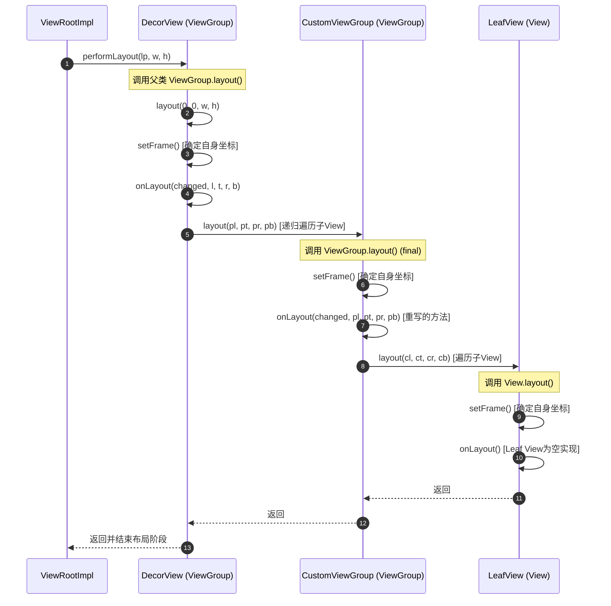
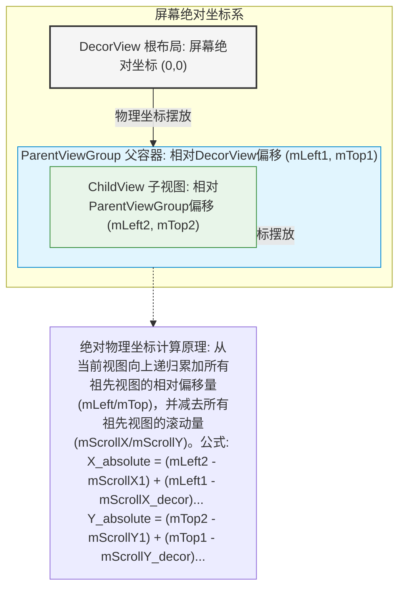

# 5.1.4.2.2 onLayout

## 一、导言：Layout 阶段的承上启下作用与本质

在 Android 自定义 View 的三大核心渲染流程——测量（Measure）、布局（Layout）与绘制（Draw）中，**布局（Layout）**阶段扮演着至关重要的承上启下角色。

- **承上**：它接收了在 `onMeasure` 阶段计算并锁定的“测量尺寸”（Measured Width & Measured Height），这些尺寸代表了 View 期望占用的空间大小（即它的“理想尺寸”）。
- **启下**：它将这些“理想尺寸”转化为屏幕像素坐标系中真实的、具体的物理边界坐标（`left`, `top`, `right`, `bottom`）。只有在这个阶段完成后，View 的实际宽度（`getWidth()`）与实际高度（`getHeight()`）才被真正确定，并且为接下来的 `onDraw` 绘制阶段划定了画布（Canvas）的裁剪范围和绘制边界。

从本质上讲，`layout` 过程是父容器（ViewGroup）按照特定的布局规则（排版策略），将其内部的所有子视图（Views）摆放到屏幕对应相对位置的控制机理。它是一个**自顶向下的递归分配过程**。

---

## 二、layout() 与 onLayout() 的职责分工与源码级机理

为了保证 View 树下降布局过程能够有序、安全地流转，Android 架构设计在 `View` 和 `ViewGroup` 中对 `layout()` 与 `onLayout()` 进行了严密的职责隔离。



### 1. View.layout(l, t, r, b) 的源码解析与核心流程

`View.layout(int l, int t, int r, int b)` 是布局流程的入口点。需要强调的是，在 `View` 类中该方法并不是 `final` 的，但开发者在自定义 View 时**严禁重写此方法**，因为它是整个布局状态机的骨架。

它的主要职责是确定 View 自身在父容器坐标系中的绝对物理位置。以下是 `View.layout()` 的核心源码执行逻辑：

```java
public void layout(int l, int t, int r, int b) {
    // 1. 判断是否需要在布局前重新进行测量
    if ((mPrivateFlags3 & PFLAG3_MEASURE_NEEDED_BEFORE_LAYOUT) != 0) {
        onMeasure(mOldWidthMeasureSpec, mOldHeightMeasureSpec);
        mPrivateFlags3 &= ~PFLAG3_MEASURE_NEEDED_BEFORE_LAYOUT;
    }

    int oldL = mLeft;
    int oldT = mTop;
    int oldB = mBottom;
    int oldR = mRight;

    // 2. 锁定自身坐标：通过 setFrame 设定当前 View 的物理边界
    boolean changed = isLayoutModeOptical(mParent) ?
            setOpticalFrame(l, t, r, b) : setFrame(l, t, r, b);

    // 3. 如果位置发生改变，或者当前 View 带有强制布局标志，则触发 layout
    if (changed || (mPrivateFlags & PFLAG_LAYOUT_REQUIRED) != 0) {
        // 调用 onLayout 方法，该方法在 View 中为空，在 ViewGroup 中为抽象，在子类中被重写
        onLayout(changed, l, t, r, b);

        if (shouldDrawRoundScrollbar()) {
            if (mRoundScrollbarRenderer == null) {
                mRoundScrollbarRenderer = new RoundScrollbarRenderer(this);
            }
        }

        // 清除“必须布局”标志位
        mPrivateFlags &= ~PFLAG_LAYOUT_REQUIRED;

        // 4. 触发布局改变监听器回调
        ListenerInfo li = mListenerInfo;
        if (li != null && li.mOnLayoutChangeListeners != null) {
            ArrayList<OnLayoutChangeListener> listenersCopy =
                    (ArrayList<OnLayoutChangeListener>)li.mOnLayoutChangeListeners.clone();
            int numListeners = listenersCopy.size();
            for (int i = 0; i < numListeners; ++i) {
                listenersCopy.get(i).onLayoutChange(this, l, t, r, b, oldL, oldT, oldR, oldB);
            }
        }
    }

    // 清除“正在布局”标志位
    mPrivateFlags &= ~PFLAG_FORCE_LAYOUT;
    mPrivateFlags3 |= PFLAG3_LAYOUT_IS_SIGNALING_AND_RIPPLE_ALPHA_CHANGED;
}
```

#### 源码细节解密：
- **`setFrame(l, t, r, b)`**：这是一个核心的内部隐藏方法。它将传入的 `l, t, r, b` 赋值给 View 内部的四个核心成员变量：`mLeft`, `mTop`, `mRight`, `mBottom`。在赋值前，它会进行数值比对。如果发现新旧坐标不同，则说明 View 的物理尺寸或位置发生了变化，此时会返回 `true` 并触发 `onSizeChanged(newWidth, newHeight, oldWidth, oldHeight)` 的回调。这证明了 `onSizeChanged` 并不是在 Measure 阶段被触发的，而是在 Layout 阶段的 `setFrame()` 内部被触发的。
- **重绘标志位设置**：当 `setFrame` 返回 `true` 时，系统会同时调用 `invalidate(true)` 标记该 View 及其父容器的对应区域在下一帧需要被重新绘制。这确保了当 View 被“挪动”或者“缩放”时，屏幕上的物理像素能及时得到刷新。同时，它还会清除绘制缓存状态标记 `PFLAG_DRAWING_CACHE_VALID`。
- **`onLayout()` 调用**：锁定了自身坐标后，View 紧接着调用 `onLayout(changed, l, t, r, b)`。对于叶子节点 View 来说，它的职责到此结束，因为它的 `onLayout()` 在 `View` 基类中是一个空实现：
  ```java
  protected void onLayout(boolean changed, int left, int top, int right, int bottom) {
      // 叶子 View 没有子 View，不需要再做任何子视图的位置摆放
  }
  ```

### 2. ViewGroup.layout(l, t, r, b) 为什么被声明为 final？

当我们在自定义布局容器时，会继承自 `ViewGroup`。如果你尝试重写 `layout(int l, int t, int r, int b)`，编译器会直接报错。这是因为在 `ViewGroup.java` 中，`layout()` 被显式地重写并声明为了 `final`：

```java
@Override
public final void layout(int l, int t, int r, int b) {
    if (!mTransitionHeader && (mTransition == null || !mTransition.isChangingLayout())) {
        if (mLayoutMode == LAYOUT_MODE_CLIP_BOUNDS) {
            // 进行光学边界转换等底层处理
            // ...
        }
        // 调用 View 的 layout() 以锁定 ViewGroup 自身在父容器中的物理坐标
        super.layout(l, t, r, b);
    } else {
        // 如果当前有过渡动画（LayoutTransition）正在执行，延迟或做特殊动画定位处理
        mLayoutTransitionTx.startLayoutTransition(this, l, t, r, b);
    }
}
```

#### 设计哲学与职责分工：
- **保护递归分发链**：Android 团队在此处采用了**模板方法设计模式**。ViewGroup 作为一个容器，除了要摆放自身位置（通过 `super.layout()` 调用 View 的逻辑，利用 `setFrame()` 锁定自身位置并触发自身 `onLayout()` 之外），它的核心职责是**管理和调度其所有子视图的布局**。如果允许子类重写 `layout()`，开发者极有可能漏掉 `super.layout()` 或破坏 `LayoutTransition` 动画的流转，从而导致整个 View 树在递归布局时中断。
- **职责彻底隔离**：
  * **`layout()`**：由系统框架控制，负责锁定**自身**的物理尺寸坐标，并作为分发的总入口。
  * **`onLayout()`**：由具体的容器子类（如 `LinearLayout`, `RelativeLayout`, `FrameLayout` 以及我们自定义的布局）重写，负责**摆放子视图**的物理尺寸坐标。

因此，ViewGroup 中将 `onLayout()` 声明为了一个**抽象方法**：
```java
@Override
protected abstract void onLayout(boolean changed, int l, int t, int r, int b);
```
任何具体的 ViewGroup 子类都必须重写 `onLayout()`。在其中遍历子 View，计算每个子 View 在当前容器坐标系中的 `(left, top, right, bottom)`，然后调用子 View 的 `child.layout()`，以此将布局流程递归地传递下去。

---

## 三、坐标系统与相对-绝对坐标偏移量累加

在自定义布局中，正确理解和运用 Android 的相对坐标系与屏幕绝对坐标系是精细控制布局位置的基础。



### 1. View 树中的相对坐标体系

Android 的视图坐标系以**父容器的左上角为原点 $(0, 0)$**。X 轴正方向水平向右，Y 轴正方向垂直向下。

每个 View 在 Layout 阶段确定的物理位置，都是由其相对于直接父容器的相对坐标来表示的。这四组核心成员变量和对应的获取 API 如下：
- `mLeft` (`getLeft()`)：View 的左边缘到父容器左边缘的距离。
- `mTop` (`getTop()`)：View 的上边缘到父容器上边缘的距离。
- `mRight` (`getRight()`)：View 的右边缘到父容器左边缘的距离。
- `mBottom` (`getBottom()`)：View 的下边缘到父容器上边缘的距离。

#### 关键概念辨析：`getWidth()` 与 `getMeasuredWidth()`
在 Android 面试或开发实践中，经常会遇到关于这两个宽度的区别：
- **`getMeasuredWidth()`**：在 `onMeasure()` 阶段结束时锁定。它的值代表子 View “期望得到的宽度”。
- **`getWidth()`**：在 `layout()` 阶段的 `setFrame()` 被调用后被赋予有效值。
  其计算公式为：
  $$\text{Width} = mRight - mLeft$$
- **不一致的成立条件**：在绝大多数标准的布局实现中，这两者是完全相等的。但在自定义 ViewGroup 的 `onLayout` 过程中，父容器拥有最终的裁决权。如果我们在调用 `child.layout(l, t, r, b)` 时，故意传入一个与 `child.getMeasuredWidth()` 不同的跨度（例如：`child.layout(left, top, left + measuredWidth / 2, top + measuredHeight)`），那么最终 `getWidth()` 的值将只有 `getMeasuredWidth()` 的一半。这体现了 Layout 阶段对几何边界的最终决定权。

#### 动态坐标偏移量：
- **`translationX` 与 `translationY`**：这是由属性动画或滑动控制引入的平移偏移量。此时 View 的布局坐标 `mLeft`/`mTop` 未变，但渲染时的视觉原点发生了偏移。
- **`getX()` 与 `getY()`**：
  $$\text{getX()} = \text{getLeft()} + \text{getTranslationX()}$$
  $$\text{getY()} = \text{getTop()} + \text{getTranslationY()}$$

### 2. 物理屏幕绝对像素坐标的推导与偏移量累加算法

当发生输入事件（如触摸点击）或者需要在 Native 渲染层确定 View 在物理屏幕上的绘制原点时，相对坐标必须被映射为相对于整个屏幕（根窗口 `DecorView`）的绝对坐标。

为了推导出一个叶子 View 在屏幕绝对坐标系中的物理位置，系统需要沿着视图树的父子链（Parent-Child Chain）向上进行递归回溯，将每一层父容器的相对坐标进行累加，并减去每一层容器的内容滚动偏移量（Scroll Offset）。

#### 累加推导公式：
设叶子节点视图为 $V_0$，其父容器为 $V_1$，祖先容器依次为 $V_2, V_3, \dots, V_n$（其中 $V_n$ 是最顶层的根视图 `DecorView`）。

对于 X 轴方向的绝对屏幕坐标 $X_{\text{screen}}$：
$$X_{\text{screen}} = \sum_{k=0}^{n-1} \left( V_k.mLeft - V_{k+1}.mScrollX \right)$$

对于 Y 轴方向的绝对屏幕坐标 $Y_{\text{screen}}$：
$$Y_{\text{screen}} = \sum_{k=0}^{n-1} \left( V_k.mTop - V_{k+1}.mScrollY \right)$$

#### 物理意义深度解析：
- 为什么在累加 $mLeft$ 和 $mTop$ 的同时，要减去 $mScrollX$ 和 $mScrollY$？
  因为对于任何一个父容器 $V_{k+1}$ 而言，它的 `scrollX` 值若大于 0，代表它的内部视图内容（也就是它的子视图 $V_k$）在水平方向上整体向左滚动了。在视觉和屏幕物理位置上，向左滚动意味着子视图在屏幕绝对位置的坐标值变小了。因此，必须将滚动量从累加坐标中扣除，才能得出正确的屏幕像素投影位置。
- **系统 API 支持**：
  - `getLocationOnScreen(int[] location)`：在底层实现中，该方法会遍历 View 树直到宿主窗口根视图，最终累加得出相对于物理屏幕左上角 $(0,0)$ 的像素偏移。
  - `getLocationInWindow(int[] location)`：计算相对于当前应用窗口（Window）左上角的物理像素位置。在多窗口模式、分屏模式或者折叠屏适配下，窗口的左上角可能并不是物理屏幕的 $(0,0)$。
  - 在大屏与折叠屏的多窗口适配中，由于 Android 系统在不同版本中调整了多窗口边界的计算基准，开发者应针对 `getLocationOnScreen` 与 `getLocationInWindow` 做差异化适配，防止触摸事件发生偏移。详细演进可以参见根目录下的 [AndroidVersionChangeLog.md](../../../../../../AndroidVersionChangeLog.md)。

---

## 四、物理定位计算逻辑：结合 Margin、Padding 和 Gravity 的公式推导

在一个自定义 ViewGroup 的布局阶段，最核心的技能就是依据子 View 的测量尺寸，并解析其携带的各种布局规则（如 Padding、Margin 以及 Gravity 属性），计算出子视图在容器内准确的绝对物理坐标。

下面，我们以一个经典的**自定义垂直线性布局（`CustomVerticalLayout`）**为例，详细推导这套计算公式的底层数学逻辑。

### 1. 场景设定与物理变量定义

- **父容器属性**：
  * 宽度：$W_{\text{parent}}$，高度：$H_{\text{parent}}$
  * 左、上、右、下内边距：$P_{\text{left}}$，$P_{\text{top}}$，$P_{\text{right}}$，$P_{\text{bottom}}$
- **第 $i$ 个子视图（Child $i$）属性**：
  * 测量宽度：$w_i = \text{child.getMeasuredWidth()}$
  * 测量高度：$h_i = \text{child.getMeasuredHeight()}$
  * 外边距：$M_{\text{left}, i}$，$M_{\text{top}, i}$，$M_{\text{right}, i}$，$M_{\text{bottom}, i}$
  * 布局对齐方向：$G_i = \text{layout\_gravity}$（包含水平方向的 `LEFT`, `RIGHT`, `CENTER_HORIZONTAL`）
- **垂直高度累加指针**：
  * $Y_{\text{current}}$：表示当前已摆放视图的底边界在 Y 轴方向上的累积高度。
  * 初始状态：$Y_{\text{current}} = P_{\text{top}}$

### 2. 绝对坐标推导公式详细列表

当遍历到第 $i$ 个子 View 时，其四个边界坐标值 `childLeft` ($L_i$), `childTop` ($T_i$), `childRight` ($R_i$), `childBottom` ($B_i$) 的推导逻辑如下：

#### (1) 纵向（Y 轴）物理定位公式
由于子 View 在垂直方向上依次紧密排列，故每个子 View 的上边界受限于当前的累计高度指针，并且必须响应其自身的上外边距：
$$T_i = Y_{\text{current}} + M_{\text{top}, i}$$

计算子 View 的下边界：
$$B_i = T_i + h_i$$

在排布完当前 View 后，下一视图的起始计算基准需要向前推移，且必须考虑当前视图的下外边距。因此，需要更新垂直高度累加指针：
$$Y_{\text{current}} = B_i + M_{\text{bottom}, i}$$

#### (2) 横向（X 轴）物理定位公式
子视图在水平方向的可用总跨度（排除父容器内边距后的净空间）为：
$$W_{\text{net}} = W_{\text{parent}} - P_{\text{left}} - P_{\text{right}}$$

根据子 View 的水平 `layout_gravity` 规则，分以下三种情况进行计算：

##### 情况 A：当 $G_i$ 包含 `Gravity.LEFT`（默认靠左）时
子 View 对齐到父容器的左侧内边缘，只需额外加上其自身的左外边距：
$$L_i = P_{\text{left}} + M_{\text{left}, i}$$
$$R_i = L_i + w_i$$

##### 情况 B：当 $G_i$ 包含 `Gravity.RIGHT`（靠右对齐）时
子 View 的右边缘对齐到父容器的右侧内边缘，考虑其右外边距和自身宽度后计算左边缘：
$$R_i = W_{\text{parent}} - P_{\text{right}} - M_{\text{right}, i}$$
$$L_i = R_i - w_i = W_{\text{parent}} - P_{\text{right}} - M_{\text{right}, i} - w_i$$

##### 情况 C：当 $G_i$ 包含 `Gravity.CENTER_HORIZONTAL`（水平居中）时
子 View 的中心线需要与父容器的水平中心线对齐。此时，我们需要在容器可支配宽度中排除子 View 自身所占的全部空间（宽度 + 外边距），然后进行对半平分。
可用宽度剩余空间为：
$$\Delta W_i = W_{\text{parent}} - P_{\text{left}} - P_{\text{right}} - M_{\text{left}, i} - M_{\text{right}, i} - w_i$$

左边界坐标即为左侧起点加上自身的左边距，再加上剩余空间的一半：
$$L_i = P_{\text{left}} + M_{\text{left}, i} + \frac{W_{\text{parent}} - P_{\text{left}} - P_{\text{right}} - M_{\text{left}, i} - M_{\text{right}, i} - w_i}{2}$$

通过同分母合并化简，得出最终的最简计算公式：
$$L_i = \frac{W_{\text{parent}} + P_{\text{left}} - P_{\text{right}} + M_{\text{left}, i} - M_{\text{right}, i} - w_i}{2}$$
$$R_i = L_i + w_i$$

---

### 3. 代码实现示例（Kotlin）

将上述推导逻辑转化为工程实现代码，构建一个规范的自定义 `CustomVerticalLayout`：

```kotlin
package com.example.knowledge.ui

import android.content.Context
import android.util.AttributeSet
import android.view.Gravity
import android.view.View
import android.view.ViewGroup

/**
 * 演示 onLayout 物理坐标计算逻辑的自定义垂直线性布局
 */
class CustomVerticalLayout @JvmOverloads constructor(
    context: Context,
    attrs: AttributeSet? = null,
    defStyleAttr: Int = 0
) : ViewGroup(context, attrs, defStyleAttr) {

    // 允许子视图声明 Margin 属性，重写以下相关方法
    override fun generateLayoutParams(attrs: AttributeSet?): LayoutParams {
        return MarginLayoutParams(context, attrs)
    }

    override fun generateDefaultLayoutParams(): LayoutParams {
        return MarginLayoutParams(LayoutParams.MATCH_PARENT, LayoutParams.WRAP_CONTENT)
    }

    override fun generateLayoutParams(p: LayoutParams?): LayoutParams {
        return MarginLayoutParams(p)
    }

    override fun checkLayoutParams(p: LayoutParams?): Boolean {
        return p is MarginLayoutParams
    }

    override fun onMeasure(widthMeasureSpec: Int, heightMeasureSpec: Int) {
        var totalHeight = 0
        var maxWidth = 0

        // 1. 遍历所有子 View 进行测量
        for (i in 0 until childCount) {
            val child = getChildAt(i)
            if (child.visibility != View.GONE) {
                // 考虑父容器的 padding 和子 View 的 margin，递归调用子视图的 measure 流程
                measureChildWithMargins(child, widthMeasureSpec, 0, heightMeasureSpec, 0)
                val lp = child.layoutParams as MarginLayoutParams
                maxWidth = maxOf(maxWidth, child.measuredWidth + lp.leftMargin + lp.rightMargin)
                totalHeight += child.measuredHeight + lp.topMargin + lp.bottomMargin
            }
        }

        // 2. 加上父容器自身的 Padding 尺寸
        maxWidth += paddingLeft + paddingRight
        totalHeight += paddingTop + paddingBottom

        // 3. 锁定容器自身最终的测量宽度与高度
        setMeasuredDimension(
            resolveSize(maxWidth, widthMeasureSpec),
            resolveSize(totalHeight, heightMeasureSpec)
        )
    }

    override fun onLayout(changed: Boolean, l: Int, t: Int, r: Int, b: Int) {
        val parentWidth = r - l
        val pLeft = paddingLeft
        val pTop = paddingTop
        val pRight = paddingRight

        // 初始化 Y 轴累加高度指针为 paddingTop
        var currentTop = pTop

        for (i in 0 until childCount) {
            val child = getChildAt(i)
            if (child.visibility != View.GONE) {
                val childWidth = child.measuredWidth
                val childHeight = child.measuredHeight
                val lp = child.layoutParams as MarginLayoutParams

                // 解析 layout_gravity，如果子视图的 layoutParams 不是 MarginLayoutParams 则降级
                val gravity = getHorizontalGravity(child)

                // 公式推导 Y 轴定位
                val childTop = currentTop + lp.topMargin
                val childBottom = childTop + childHeight

                // 公式推导 X 轴定位
                val childLeft = when (gravity and Gravity.HORIZONTAL_GRAVITY_MASK) {
                    Gravity.LEFT -> {
                        pLeft + lp.leftMargin
                    }
                    Gravity.RIGHT -> {
                        parentWidth - pRight - lp.rightMargin - childWidth
                    }
                    Gravity.CENTER_HORIZONTAL -> {
                        // 对应公式的最简形式实现
                        (parentWidth + pLeft - pRight + lp.leftMargin - lp.rightMargin - childWidth) / 2
                    }
                    else -> pLeft + lp.leftMargin
                }
                val childRight = childLeft + childWidth

                // 4. 调用 child.layout 方法将物理坐标赋给子视图
                child.layout(childLeft, childTop, childRight, childBottom)

                // 5. 更新 Y 轴累加高度指针
                currentTop = childBottom + lp.bottomMargin
            }
        }
    }

    /**
     * 辅助解析：获取子 View 在布局参数中声明的 horizontal gravity
     * 实际工程中可从自定义的 AttributeSet 中解析，此处为演示逻辑进行简化模拟
     */
    private fun getHorizontalGravity(child: View): Int {
        val lp = child.layoutParams
        // 假设通过位置来模拟不同的 layout_gravity 排版分支
        val index = indexOfChild(child)
        return when (index % 3) {
            1 -> Gravity.CENTER_HORIZONTAL
            2 -> Gravity.RIGHT
            else -> Gravity.LEFT
        }
    }
}
```

---

## 五、Layout 阶段的崩溃与死循环陷阱

在 Android UI 开发中，最普遍且隐蔽的一个错误就是：**在 `onLayout()`（或者 `onMeasure()`, `onDraw()`）方法的调用链中直接或间接地触发了 `requestLayout()`**。这将立刻引起严重的布局卡死（ANR）或者抛出运行时崩溃。

### 1. requestLayout() 的完整调用链路与 Choreographer 机制

要彻底理解这一死循环的发生，必须从源码级别剖析 `requestLayout()` 的运作原理。

```java
// View.java 中的核心逻辑
@CallSuper
public void requestLayout() {
    if (mMeasureCache != null) mMeasureCache.clear();

    // 1. 设置强制布局标志位，标志当前 View 急需重发布局
    mPrivateFlags |= PFLAG_FORCE_LAYOUT;
    mPrivateFlags |= PFLAG_INVALIDATED;

    // 2. 如果 parent 存在，且 parent 还没有发起布局请求，则层层向上传递
    if (mParent != null && !mParent.isLayoutRequested()) {
        mParent.requestLayout();
    }
}
```

当调用一个 View 的 `requestLayout()` 时，其内部经历了如下级联传播：
1. **打上标记**：当前 View 清空自身的测量缓存 `mMeasureCache`，并将 `mPrivateFlags` 设为 `PFLAG_FORCE_LAYOUT`，指示需要强制布局。
2. **回溯冒泡**：通过 `mParent.requestLayout()`，把该请求向上传播给它的父容器。在这个过程中，所有沿途的祖先 ViewGroup 都会在其内部标志位上打上标记，表示它们内部存在某些子 View 请求了重新布局，直到回溯到达顶层窗口根节点——**`ViewRootImpl`**。
3. **`ViewRootImpl` 协调调度**：
   在 `ViewRootImpl.requestLayout()` 中，会执行两个关键动作：
   - 将 `mLayoutRequested` 变量设为 `true`。
   - 调用 `scheduleTraversals()` 发起一个屏幕重绘申请。
4. **Choreographer 引入与 VSync 机制**：
   - `scheduleTraversals()` 内部不会立刻触发布局，因为为了配合屏幕刷新的物理频率，避免无效的重复计算，Android 引入了 **`Choreographer`**。
   - 它向 Choreographer 的回调队列（CallbackQueue）中投递了一个 `TraversalRunnable`（本质是一个 Runnable），等待系统在下一个 VSync（垂直同步）信号到来时触发。
5. **Traversals 的执行**：
   下一个 VSync 信号抵达主线程，Choreographer 从队列中取出并执行 `TraversalRunnable`，这会进入到 `ViewRootImpl.performTraversals()`。在这个庞大且关键的状态机中，系统会依次且单向地触发：
   $$\text{performTraversals()} \longrightarrow \text{performMeasure()} \longrightarrow \text{performLayout()} \longrightarrow \text{performDraw()}$$

在 `performLayout()` 的执行中，会调用根视图 `DecorView.layout()`，它会沿着 View 树自顶向下分发，依次触发各层级容器和视图的 `onLayout()` 方法。

### 2. 在 onLayout 内部调用 requestLayout() 导致死循环的运行机制

假设我们在某个 View 的 `onLayout()` 执行流程中，出于某种逻辑（如动态调整大小、状态变更）直接或间接调用了该 View 自身的 `requestLayout()`。

这个调用的运行机理会导致致命的状态倒流，具体流转逻辑如下：

```mermaid
graph TD
    VRI["ViewRootImpl <br/> performTraversals()"] -->|执行布局分发| PL["performLayout()"]
    PL -->|递归调用| OL["ViewGroup.onLayout()"]
    
    subgraph 布局死循环机制 (Infinite Layout Loop)
        OL -->|1. 执行子View布局逻辑| CL["child.layout()"]
        CL -->|2. 在onLayout中触发状态变更| RL["requestLayout()"]
        RL -->|3. 标记 PFLAG_FORCE_LAYOUT| PB["mParent.requestLayout()"]
        PB -->|4. 冒泡回溯至 ViewRootImpl| VRI_Req["ViewRootImpl.requestLayout()"]
        VRI_Req -->|5. 再次向主线程投递| SR["scheduleTraversals()"]
        SR -->|6. 下一 VSycn 信号再次触发| VRI
    end

    classDef loop fill:#ffebee,stroke:#c62828,stroke-width:2px;
    class VRI,PL,OL,CL,RL,PB,VRI_Req,SR loop;
```

1. **状态逆向回流**：
   当 `performLayout()` 的单向状态机正在向下遍历并执行 `onLayout()` 时，其本身属于 `performTraversals()` 的调用栈深处。此时突然触发 `requestLayout()`，会把已经走过 `requestLayout` 阶段的 `ViewRootImpl` 及其他父容器的 `mLayoutRequested` 重新篡改为 `true`，并再次把 `mPrivateFlags` 标上 `PFLAG_FORCE_LAYOUT`。
2. **VSync 回调无尽累加**：
   `scheduleTraversals()` 会再次被调用，使 Choreographer 重新注册下一个 VSync 刷新的重绘请求。
3. **陷入死循环**：
   当当前的这帧 `performTraversals()` 调用栈运行结束后，主线程的消息队列里已经立刻积压了下一个 VSync 的 `TraversalRunnable` 请求。
   主线程会在极短的周期内（屏幕刷新间隔，通常为 60Hz 即 16.6ms，甚至 120Hz 即 8.3ms）再次进入 `performTraversals()`。
   在下一帧执行时，它因为 `PFLAG_FORCE_LAYOUT` 的存在，又重新走了一慢 `performMeasure()` 和 `performLayout()`，从而再次触碰到那个导致了调用 `requestLayout` 的逻辑，接着又向消息队列投递了重绘请求。
   
这一过程互为因果，首尾相接，形成了被称为**布局抖动（Layout Thrashing）**的死循环状态。

### 3. 死循环的致命危害

- **主线程卡死（ANR）**：
  主线程被源源不断生成的 `TraversalRunnable` 彻底占满，导致主线程没有空余的时间片来响应用户的触摸手势（Touch Event）、系统物理按键事件、广播发送或者任何其他 Handler 消息。在 5 秒钟之内，系统便会判定主线程无响应，进而向用户弹出严重的 **ANR（Application Not Responding）** 崩溃弹窗。
- **内存溢出（OOM）**：
  在高速循环的 layout 流程中，伴随着子 View 布局参数的频繁计算、临时局部变量的大量创建、以及某些框架中对 `LayoutParams` 实例的重复分配。由于主线程被完全锁死，负责垃圾回收（GC）的子线程甚至无法在安全的 GC 挂起点（Safe Point）让主线程停顿，这导致短时间内产生的堆内存垃圾无法得到回收，内存占用指数级膨胀，最终导致应用抛出 **OOM（Out Of Memory）** 异常崩溃。
- **Android 系统拦截机制**：
  为了避免此类恶意代码拖垮整个系统的 UI 进程，在 Android 高版本系统的 `ViewRootImpl` 内部，针对 `performLayout()` 的执行逻辑引入了安全校验拦截：
  ```java
  private void performLayout(WindowManager.LayoutParams lp, int desiredWindowWidth, int desiredWindowHeight) {
      // ...
      mInLayout = true;
      host.layout(0, 0, host.getMeasuredWidth(), host.getMeasuredHeight());
      mInLayout = false;
      
      // 执行完毕后进行校验：如果在 layout 期间，有任何 View 再次触发了重新布局请求
      if (mLayoutRequested) {
          // 在特定版本或调试模式下，系统判定为非法逻辑调用，直接抛出运行时异常强行中断应用
          throw new IllegalStateException("ViewRootImpl: requestLayout() improperly called by "
                  + mCurrentActiveLayoutView + " during layoutCompletedOrAborted()");
      }
      // ...
  }
  ```
  如果开发者在 `onLayout()` 时触发了该机制，应用会直接发生运行时崩溃，并提示这一错误。

### 4. 正确的应对策略与最佳实践

- **杜绝在 onLayout 中修改会引发重新布局的状态**：
  在 `onLayout()` 中绝对不能调用 `setText()`、`setImageResource()`、`setVisibility()`、`requestLayout()` 等会向上传播布局标志的方法。
- **异步延迟（Post）队列方案**：
  如果你的业务逻辑非常特殊，确实需要依赖子 View 最终布局出的真实物理位置，再去动态地缩放或调整另外一个 View 的大小，你应当通过 `View.post(Runnable)` 的机制进行解耦：
  ```kotlin
  override fun onLayout(changed: Boolean, l: Int, t: Int, r: Int, b: Int) {
      super.onLayout(changed, l, t, r, b)
      
      val child = getChildAt(0)
      if (child.width > threshold) {
          // 通过 post 绕过当前一帧的 performTraversals 状态机
          child.post {
              // 此时已经处于下一帧或当前帧渲染结束后的主线程消息队列中
              // 修改 LayoutParams 它是安全的，不会与当前的 onLayout 发生交叉干扰
              val lp = targetView.layoutParams
              lp.height = child.width / 2
              targetView.layoutParams = lp
              targetView.requestLayout()
          }
      }
  }
  ```
- **执行过滤与断言对比**：
  即使在 `post` 或是必须在布局监听器 `OnLayoutChangeListener` 中修改属性时，也应该在修改前对参数进行严格的值比对。仅在目标参数确实发生变化时才调用修改方法，避免无效的、无休止的“布局请求循环”。
- **职责合理划分至 Measure 阶段**：
  大多数情况下，之所以想在 `onLayout` 中动态计算尺寸，是因为在 `onMeasure` 阶段没有算清依赖关系。应该将尺寸的计算、约束关系的推导全部移入到自定义的 `onMeasure()` 中，使其在 measure 结束后就已经被完美确定。`onLayout` 应该仅仅执行绝对像素点的赋值和定位工作。
