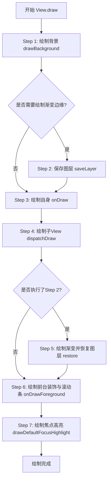
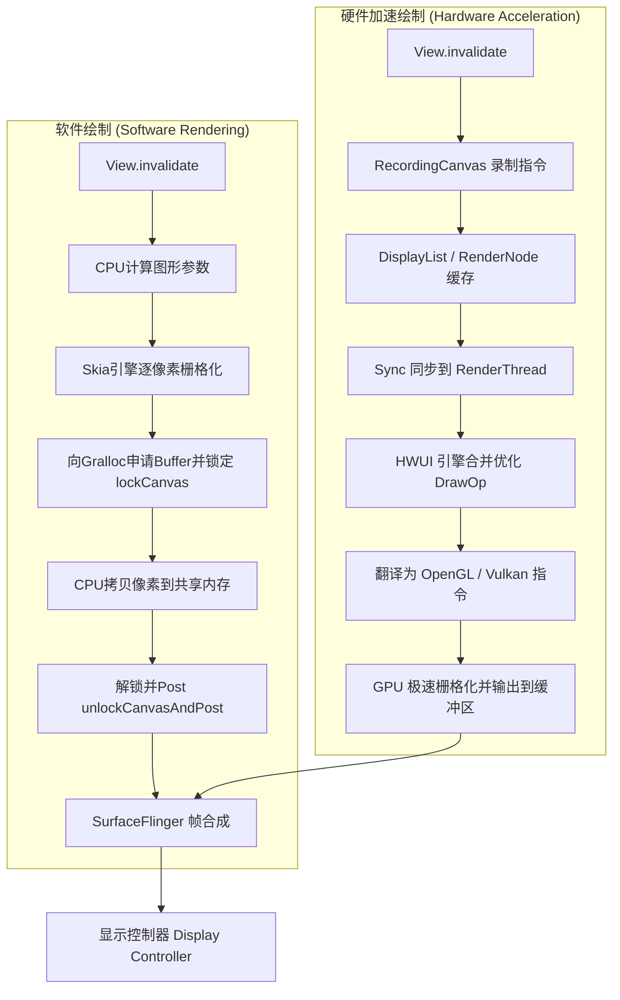

# 5.1.4.2.3 onDraw

## 1. 导言：绘制的视觉本质
在 Android 自定义 View 生命周期的三大核心步骤——测量（Measure）、布局（Layout）、绘制（Draw）中，绘制是整个渲染流水线的终点，也是最终实现人机交互视觉呈现的节点。如果说 `onMeasure` 确定了 View 的“尺寸”，`onLayout` 决定了 View 的“位置”，那么 `onDraw(Canvas)` 则是赋予 View “血肉与皮肤”的核心阵地。

在这一阶段，开发者的几何意图（例如：在屏幕坐标 $(x, y)$ 处绘制一个半径为 $r$ 的圆形，并填充渐变色）被转化为 Canvas 指令。对于底层图形系统而言，这些高级绘制指令不能被显示设备直接呈现，必须经过底层的图形渲染引擎进行深度处理，通过栅格化（Rasterization）操作，把矢量的数学图形转换为屏幕上的物理像素点阵。理解 `onDraw(Canvas)` 不仅仅是学会使用 Canvas 和 Paint 的 API，更要厘清 Canvas、Paint、Bitmap 的底层协作机制，洞悉 View.draw() 源码所规定的渲染流程，以及软件绘制（Software Rendering）与硬件加速（Hardware Acceleration）的图形管线博弈。

---

## 2. 绘制三杰：Canvas、Paint 与 Bitmap 的协作模型
在 Android 的 2D 绘图体系中，Canvas、Paint、Bitmap 被并称为“绘制三杰”，它们分工明确、紧密配合，构成了一套完整且高度解耦的图形渲染模型。我们可以用现实中的画室来作一个生动的类比：**Canvas 是画板，Paint 是画笔，而 Bitmap 则是用于承载像素色彩的画幅实体。**

```
 ┌─────────────────────────────────────────────────────────┐
 │                        协作模型                         │
 │                                                         │
 │  ┌─────────────────┐           ┌─────────────────────┐  │
 │  │     Canvas      │           │        Paint        │  │
 │  │  (绘图指令分发)  │           │   (绘制风格与属性)   │  │
 │  └────────┬────────┘           └──────────┬──────────┘  │
 │           │                               │             │
 │           └───────────────┬───────────────┘             │
 │                           ▼                               │
 │                ┌─────────────────────┐                  │
 │                │       Bitmap        │                  │
 │                │    (物理像素承载)   │                  │
 │                └─────────────────────┘                  │
 └─────────────────────────────────────────────────────────┘
```

### 2.1 Canvas（画板）：绘图指令分发与状态管理
很多初学者会误认为 Canvas 就是一块可以任意涂抹的图像内存，但实际上，**Canvas 本身不持有任何像素数据**。Canvas 的本质是一个**指令分发器与状态机**。
- **指令分发**：当开发者在 Java 层调用 `canvas.drawCircle()`、`canvas.drawPath()` 或 `canvas.drawText()` 时，这些调用会被传递到 Native 层的 `SkCanvas` (软件绘制) 或 `RecordingCanvas` (硬件加速)，其作用是将几何属性（圆心、半径、路径、字体信息等）与当前的变换矩阵、裁剪区域组合起来，生成具体的绘制指令。
- **几何变换（Transformation Matrix）**：Canvas 内部维护了一个 3D 仿射变换矩阵（Matrix）。通过 `canvas.translate(dx, dy)`、`canvas.scale(sx, sy)`、`canvas.rotate(degrees)` 以及 `canvas.skew(sx, sy)`，开发者可以改变后续所有绘制指令的坐标系。这些变换本质上是对坐标向量进行矩阵乘法。
- **裁剪区域（Clip）**：Canvas 允许设置一个矩形或路径作为裁剪区域（如 `canvas.clipRect()`、`canvas.clipPath()`）。所有超出裁剪区域的绘制指令都会被底层栅格化阶段直接丢弃，从而保护非目标区域的像素不被覆写。
- **状态栈管理器（State Stack）**：Canvas 提供了状态保存与恢复机制：
  - `save()`：将当前的变换矩阵、裁剪区域以及图层属性压入状态栈。
  - `restore()`：将状态栈顶的矩阵和裁剪信息弹出，恢复画布到上一次 `save()` 的状态。
  - `saveLayer()`：这是一种更重的操作。它不仅保存了矩阵和裁剪状态，还会在离屏（Off-screen）缓冲区中临时开辟一块全新的图像图层（Layer）。在 `saveLayer()` 之后的所有绘制指令都会暂时写入这个临时图层，直到调用 `restore()` 时，系统才会通过指定的混合模式（PorterDuff.Mode）把临时图层与主画布（Base Layer）进行像素合并。

### 2.2 Paint（画笔）：绘制风格与视觉属性控制
如果 Canvas 规定了“画什么”和“在哪里画”，那么 Paint 则定义了“怎么画”。它控制着图形的颜色、样式、滤镜、混合模式等一切视觉属性。
- **基础属性**：
  - `setColor(int color)`：设置画笔的 ARGB 颜色。
  - `setStrokeWidth(float width)`：设置描边宽度。
  - `setStyle(Paint.Style style)`：有三种模式：`FILL`（仅填充内部）、`STROKE`（仅描边）、`FILL_AND_STROKE`（既填充又描边）。
  - `setAntiAlias(boolean aa)`：开启抗锯齿。开启后，底层引擎会在图形边缘进行像素多采样或羽化计算，使边缘平滑，消除阶梯状的毛刺，但会带来额外的计算开销。
  - `setDither(boolean dither)`：开启抖动。这通常在低色深屏幕（如 RGB_565，16位色）上非常有用。它通过微弱的噪声颗粒混合算法，消除由于色彩通道精度不足而产生的色带（Color Banding）渐变断层。
  - `setStrokeCap(Paint.Cap cap)`：控制线条终点的样式（`BUTT` 平头、`ROUND` 圆头、`SQUARE` 方头）。
  - `setStrokeJoin(Paint.Join join)`：控制线段连接处的过渡样式（`MITER` 锐角连接、`ROUND` 圆角连接、`BEVEL` 折角连接）。
- **高级属性**：
  - **Shader（着色器）**：实现图形的填充特效。常见的有 `LinearGradient`（线性渐变）、`RadialGradient`（环形/放射状渐变）、`SweepGradient`（扫描渐变，如雷达效果）和 `BitmapShader`（使用 Bitmap 对图形进行铺贴或填充）。
  - **PorterDuffXfermode（混合模式）**：它是图形叠加和特效混合的核心。通过设置不同的混合模式（共 18 种，如 `SRC_IN`、`DST_IN`、`CLEAR`、`MULTIPLY` 等），开发者能够实现圆角图片、橡皮擦擦除效果、图层遮罩等高阶视觉设计。
  - **ColorFilter（颜色过滤器）**：用于对图像的每个像素进行颜色变换。例如 `ColorMatrixColorFilter` 可以通过一个 $4 \times 5$ 的颜色矩阵实现黑白滤镜、怀旧滤镜、高对比度等图像特效。
  - **MaskFilter（面罩过滤器）**：对边缘的 Alpha 通道进行处理，例如 `BlurMaskFilter`（边缘模糊，常用于发光、阴影特效）和 `EmbossMaskFilter`（浮雕效果）。

### 2.3 Bitmap（画幅/像素容器）：内存中物理像素的承载实体
无论 Canvas 发出了多么复杂的矢量绘制指令，最终这些指令都必须被转换为真实的像素阵列（即栅格化），而 **Bitmap 就是在内存中承载这些物理像素的最终容器**。
- **内存模型**：Bitmap 实际上是一个封装了像素数组（Color Array）的 Java 包装类，其底层核心数据在 Native 层的 C++ 对象 `SkBitmap` 中管理。
- **分辨率与内存消耗**：Bitmap 的内存大小由其分辨率与像素配置格式（Bitmap.Config）决定。
  - 公式：`Memory = Width * Height * BytePerPixel`。
  - 常见的配置格式包括 `ARGB_8888`（每个像素占 4 字节，色彩最丰富逼真）、`RGB_565`（每个像素占 2 字节，没有 Alpha 通道，适合不透明的大图）、`ALPHA_8`（每个像素仅占 1 字节，只存储透明度，用于遮罩或边缘模糊图层）以及 `RGBA_F16`（每个像素占 8 字节，高动态范围 HDR 格式）。

### 2.4 离屏缓冲（Off-screen Buffer）与双缓冲机制
在进行复杂的图形渲染时，如果每一次绘制都直接写到屏幕的物理缓冲区上，由于绘制步骤的先后顺序，用户会看到图形被逐层画出来的过程，导致屏幕产生严重的闪烁现象。为了解决这一问题，Android 采用了**双缓冲机制**：
- **软件双缓冲**：在内存中先分配一个临时的 Bitmap，我们通过 `Canvas temporaryCanvas = new Canvas(temporaryBitmap);` 构建一个离屏 Canvas。所有的复杂图形绘制（如圆角、遮罩、多次几何叠加）都先在这个离屏 Bitmap 上由 CPU 写入完成，待绘制完毕后，再通过 `mainCanvas.drawBitmap(temporaryBitmap, 0, 0, paint)` 一次性将完整的图像拷贝到与屏幕绑定的主 Canvas 上。
- **硬件离屏缓冲（Hardware Layer）**：在硬件加速下，如果一个 View 的 LayerType 被设置为 `LAYER_TYPE_HARDWARE`，系统会在 GPU 显存中专门为该 View 分配一块纹理缓冲区（FrameBuffer Object, FBO）。在 `onDraw` 执行时，所有的 DisplayList 指令首先在 GPU 中被栅格化并绘制到该显存纹理中。当进行页面滚动或动画时，GPU 直接对这块已经栅格化好的显存纹理进行旋转、平移和透明度变换，而无须重新执行 `onDraw()`，这不仅极大地减少了主线程 CPU 的指令计算，更彻底避免了像素的多次重复渲染。
- **代价警示**：离屏缓冲（尤其是通过 `canvas.saveLayer()` 或开启不当的 Hardware Layer）具有极高的内存和 GPU 带宽代价。每次触发离屏缓冲时，GPU 必须暂停当前的图形管线渲染，清空管线，将渲染目标从主缓冲区切换到离屏 FrameBuffer（即 Framebuffer Switch），在绘制完成后，再从离屏 Buffer 切换回来进行混合（Blit）。这种频繁的 GPU 状态上下文切换会破坏显卡的高速缓存命中，消耗大量显存带宽，这也是导致自定义 View 在滚动时产生严重卡顿甚至掉帧的隐形杀手。

---

## 3. View.draw() 源码级标准七步绘制解密
自定义 View 的核心入口是 `onDraw(Canvas)`，然而 `onDraw` 只是 View 整个绘制树中的一个节点。真正统领整个 View 绘制流程的是 `View.java` 内部的 `draw(Canvas canvas)` 方法。

在 `View.java` 源码中，官方用非常详实的英文注释规定了标准绘制的七个步骤。让我们进入源码深处，逐一解密。

```java
// 摘自 Android SDK - View.java 中的 draw(Canvas canvas) 核心流程注释
/*
 * Draw traversal performs several drawing steps which must be executed
 * in the appropriate order:
 *
 *      1. Draw the background
 *      2. If necessary, save the canvas' layers to prepare for fading
 *      3. Draw view's content
 *      4. Draw children
 *      5. If necessary, draw the fading edges and restore layers
 *      6. Draw decorations (scrollbars for instance)
 *      7. If necessary, draw the default focus highlight
 */
```

### 3.1 标准七步流程的深度拆解



#### Step 1: 绘制背景 (Draw the background)
- **核心方法**：`drawBackground(canvas)`（私有或包级私有方法）。
- **执行逻辑**：系统首先会检查该 View 是否设置了背景 Drawable（`mBackground`）。如果存在背景，它会根据当前 View 的滚动偏移量 `mScrollX` 和 `mScrollY`，以及 View 的宽度和高度，计算出背景的绘制边界（Bounds）。随后调用 `mBackground.draw(canvas)` 将背景绘制在最底层。如果背景存在改变（如按下态变化），它还会处理背景的状态变化（Stateful）。

#### Step 2: 保存 Canvas 图层准备渐变边缘 (Save the canvas' layers to prepare for fading)
- **触发条件**：仅在 View 启用了渐变边缘（Fading Edges，即 `android:requiresFadingEdge` 属性为 true，常用于 ScrollView 滚动到边缘时呈现阴影渐变效果）且当前计算出确实需要展示渐变时触发。
- **执行逻辑**：系统会通过 `canvas.saveLayer()` 或者 `canvas.saveLayerAlpha()` 创建一个离屏图层。为什么要创建新图层？因为渐变边缘需要将原本绘制出的内容在边缘处进行淡化（Alpha 渐变），这需要通过 `PorterDuff.Mode.DST_IN` 的混合模式进行像素相乘。如果直接在主画布上操作，会连同父布局的背景一同被淡化，因此必须把绘制内容隔离在独立的图层中。

#### Step 3: 绘制 View 自身内容 (Draw view's content)
- **核心方法**：`onDraw(canvas)`。
- **执行逻辑**：这是自定义 View 开发者最核心的切入点。在 `View.java` 中，这是一个受保护的空方法（`protected void onDraw(Canvas canvas) {}`），留给子类实现。在此处，开发者使用传入的 `Canvas` 参数，绘制自定义的文字、线条、图片等几何图形。
- **调用时机**：由父级容器或 `ViewRootImpl` 触发 `invalidate()` 重新请求布局与绘制时被动调用，不能主动在代码中通过 `view.onDraw()` 手动调用。

#### Step 4: 绘制子 View 树 (Draw children)
- **核心方法**：`dispatchDraw(canvas)`。
- **执行逻辑**：此步骤用于向下分发绘制指令。
  - 对于**单一 View**（如 Button、ImageView），其内部没有子 View，因此 `View.java` 中 `dispatchDraw` 是一个空实现。
  - 对于**容器 ViewGroup**（如 LinearLayout、RelativeLayout、FrameLayout），`ViewGroup.java` 重写了 `dispatchDraw(canvas)`。它会遍历所有的子 View，根据子 View 的绘制顺序（如 Z-order 深度），调用 `drawChild(canvas, child, drawingTime)`。在 `drawChild` 内部，又会进一步调用子 View 的 `child.draw(canvas)`，从而形成了树状的递归绘制链条。

#### Step 5: 绘制渐变边缘并恢复图层 (Draw the fading edges and restore layers)
- **触发条件**：与 Step 2 相对应。只有在 Step 2 执行并创建了临时图层后，本步骤才会执行。
- **执行逻辑**：系统会创建线性渐变着色器（`LinearGradient`），并用含有 `PorterDuff.Mode.DST_IN` 混合模式的 Paint，在 Canvas 的顶部、底部或两侧绘制渐变蒙版，使图层边缘的内容呈现淡出效果。最后，调用 `canvas.restoreToCount(saveCount)` 将离屏图层合并回主画布，恢复 Canvas 状态。

#### Step 6: 绘制前台修饰及滚动条等装饰物 (Draw decorations (scrollbars for instance))
- **核心方法**：`onDrawForeground(canvas)`。
- **执行逻辑**：此步骤负责将附加在 View 顶部的装饰性元素绘制出来，确保它们不会被 View 自身的内容或子 View 所遮挡。
  - **前台 Drawable**：通过 `android:foreground` 设置的前台图片或点击波纹效果（`RippleDrawable`），在此步骤中通过 `mForeground.draw(canvas)` 绘制。
  - **滚动条**：如果 View 启用了横向或纵向滚动条，系统会在此处计算滚动条的滑动块位置和大小，并调用 `onDrawScrollBars(canvas)` 绘制滚动条。

#### Step 7: 绘制焦点高亮 (Draw default focus highlight)
- **引入版本**：Android 8.0 (API 26)（可跳转到 [Android 8.0 / 8.1（API 26 / 27）](../../../../../../AndroidVersionChangeLog.md#android-80--81api-26--27)）。
- **执行逻辑**：如果当前 View 正处于焦点（Focused）状态，并且其 `isDefaultFocusHighlightEnabled()` 返回为 true（例如在电视端或使用外接键盘导航时），系统在此处会使用一个预设的淡蓝色高亮框覆盖在 View 的最上层，给用户以明确的视觉反馈。

---

## 4. 软件绘制与硬件加速绘制的底层链路博弈
当我们在 `onDraw(Canvas)` 中写下一行 `canvas.drawRect()` 时，Android 操作系统究竟是如何将这行代码最终变成屏幕上的光的？在 Android 历史的发展中，演进出了两种截然不同的底层渲染链路：**软件绘制**与**硬件加速绘制**。



### 4.1 软件绘制（Software Rendering）：经典的 CPU 像素填充
在早期 Android 系统以及未开启硬件加速的 View 上，系统默认采用软件绘制。
- **底层驱动源**：软件绘制完全依赖 **CPU** 运行 2D 图形库 **Skia** 完成所有的绘制计算。
- **渲染工作流**：
  1. **触发重绘**：应用调用 `View.invalidate()`，通过事件分发树向上回溯到 `ViewRootImpl`，触发下一次 VSync 信号时的 `performTraversals()`。
  2. **锁定画布**：在 `ViewRootImpl` 的 `performDraw()` 中，系统会通过底层 Binder 通信向窗口管理器（WindowManagerService）申请一块图形内存缓冲区（Graphic Buffer，通过 `Gralloc` 分配）。接着，调用 `Surface.lockCanvas(dirtyRect)`，获取一个特殊的 Canvas 实例，并锁住该内存区域，返回一个指向这块内存的 CPU 指针。
  3. **CPU 栅格化**：在主线程中，系统遍历 View 树，执行 `draw(canvas)`。所有的 Canvas 绘图 API 最终转换为底层的 Skia C++ 代码。CPU 开始进行苦力活：计算多边形的顶点、进行抗锯齿的边缘像素混合、把 Bitmap 解码后的 RGB 数据逐个拷贝到 lockCanvas 锁定的共享内存中。这个把矢量图形转为像素点阵的过程，全部在 **UI 主线程**中同步运行。
  4. **解锁与送显**：绘制完成后，调用 `Surface.unlockCanvasAndPost()`。系统将填充完毕的 Graphic Buffer 标记为可读，并提交给系统级的合成器 **SurfaceFlinger**。SurfaceFlinger 在其独立的进程中，将这个窗口的 Graphic Buffer 与其他窗口（如 StatusBar、NavigationBar）的 Buffer 合成，最终送往屏幕显示控制器（Display Controller）。
- **致命痛点**：
  - **CPU 性能瓶颈**：CPU 内部的运算核心较少，擅长处理复杂的逻辑控制，而不擅长处理大量并行的、简单的像素数学运算（如大量的乘加运算）。在处理旋转、缩放、抗锯齿、阴影等操作时，CPU 会产生严重的计算瓶颈。
  - **缺乏重用与缓存**：每次 View 树中有一个微小的 View 发生重绘，即使它的兄弟 View 甚至父布局的内容完全没有变化，整个重绘区域（Dirty Area）内的所有 View 依然不得不重新执行整个 `draw()` 流程，CPU 必须重新计算一遍这些像素，造成了极大的资源浪费。

### 4.2 硬件加速绘制（Hardware Acceleration）：GPU 与 RenderThread 的协奏曲
为了解决 CPU 软件渲染的卡顿问题，Android 3.0（API 11）引入了硬件加速（可跳转到 [Android 3.x（API 11 / 12 / 13）](../../../../../../AndroidVersionChangeLog.md#android-3xapi-11-12-13)），利用 **GPU** 代替 CPU 来进行图形计算，并在后续版本中不断完善渲染架构。

#### 4.2.1 硬件加速的里程碑演进
- **Android 3.0（API 11）**：平台首次引入硬件加速渲染管线，将 Canvas 的 2D 指令映射为 OpenGL ES 指令，将繁重的栅格化计算交给 GPU 处理（可跳转到 [Android 3.x（API 11 / 12 / 13）](../../../../../../AndroidVersionChangeLog.md#android-3xapi-11-12-13)）。
- **Android 4.0（API 14）**：硬件加速被设定为系统默认开启属性（可跳转到 [Android 4.0（API 14 / 15）](../../../../../../AndroidVersionChangeLog.md#android-40api-14-15)）。
- **Android 5.0（API 21）**：引入了独立的线程 **RenderThread**（可跳转到 [Android 5.0 / 5.1（API 21 / 22）](../../../../../../AndroidVersionChangeLog.md#android-50--51api-21--22)）。在此之前，主线程既要负责处理用户输入、生命周期回调、布局测量，又要负责向 GPU 发送渲染指令。一旦 GPU 渲染耗时较长，UI 主线程就会被阻塞，导致动画卡顿。有了 `RenderThread` 后，渲染指令的提交和与 GPU 的通信都移交到了这个专门的后台渲染线程，实现了主线程与渲染线程的并发工作。
- **Android 8.0/9.0（API 26/28）**：渲染引擎底层的 HWUI 开始放弃直接调用 OpenGL ES 的架构，转而引入了 **Skia Pipeline**，即使用 Skia 库作为统一的 2D 渲染前端，但在底层将其翻译成 Skia OpenGL 或 Skia Vulkan 管道提交给 GPU，大大提高了解析绘制指令的一致性与渲染效能（可跳转到 [Android 8.0 / 8.1（API 26 / 27）](../../../../../../AndroidVersionChangeLog.md#android-80--81api-26--27) 与 [Android 9（API 28）](../../../../../../AndroidVersionChangeLog.md#android-9api-28)）。

#### 4.2.2 核心机制：RenderNode 与 DisplayList 的“录制-同步-渲染”三部曲
硬件加速绘制的本质是**指令录制与异步渲染**。
1. **指令录制（Recording）—— UI 主线程的工作**
   - 在硬件加速开启后，`View.invalidate()` 被调用时，系统并不会像软件绘制那样立刻去擦除和改写内存像素。相反，它会向 View 的 `RenderNode` 申请一个特化的画布，称为 `RecordingCanvas`。
   - 当 `onDraw(canvas)` 在 UI 主线程中执行时，我们调用的所有 `drawXXX()` 指令并没有被立即执行，而是被转化为一个个携带绘制参数的 C++ 对象（如 `DrawRectOp`、`DrawTextOp`、`DrawBitmapOp`），并以链表的形式存储在 View 独有的 `DisplayList` 中。
   - 每个 View 都有一个关联的 `RenderNode`，它就像是一个“渲染节点包装器”，封装了该 View 的 `DisplayList`，以及该 View 的 3D 变换状态（如旋转 `rotationX`、平移 `translationX`、缩放 `scaleX` 和透明度 `alpha` 等属性）。
2. **状态同步（Sync）—— 握手阶段**
   - 当 View 树遍历录制完毕后，`ViewRootImpl` 会向 `RenderThread` 发起同步请求。
   - 主线程会被暂时阻塞，等待 `RenderThread` 做好数据交接准备。随后，主线程将刚才录制好的 `DisplayList` 数据、`RenderNode` 属性以及渲染树（RenderNode Tree）的拓扑关系“同步”拷贝到 `RenderThread`。
   - 同步完成后，主线程被释放，可以立刻去处理下一帧的用户事件、网络响应和业务逻辑；而 `RenderThread` 则接管后续的渲染工作。
3. **极速渲染（Rendering）—— RenderThread 与 GPU 的工作**
   - `RenderThread` 获取到 `DisplayList` 后，底层的 **HWUI 引擎** 会对其进行优化与重排。例如，HWUI 会进行 **Draw Call 合并**：如果检测到连续多个绘制操作使用的是同一个纹理集（如相同的 Bitmap），它会通过批处理（Batching & Merging）将它们打包成一个绘制命令，减少 CPU 向 GPU 发送指令的次数（CPU-GPU Context Switch 是极其昂贵的）。
   - 优化后的指令被 HWUI 翻译成 OpenGL ES 或 Vulkan 指令，发送给 GPU 显卡。
   - GPU 利用成百上千个小计算核心的并行计算优势，在几个毫秒之内将矢量图形高速栅格化，并输出到双缓冲/三缓冲的 FrameBuffer 中，由 SurfaceFlinger 消费。

#### 4.2.3 硬件加速下的终极性能武器：DisplayList 重用
硬件加速之所以流畅，核心秘密在于 **DisplayList 的零 CPU 消耗重用机制**：
- 如果一个 View 的内容完全没有变，只是发生了位置平移（例如：在 RecyclerView 滚动时，或者属性动画 `ObjectAnimator.ofFloat(view, "translationX", ...)` 运行时），UI 主线程**完全不需要**重新执行 `onDraw()`。
- 主线程只需要修改该 View 对应 `RenderNode` 的 `translationX` 属性值，然后直接进行 Sync。
- `RenderThread` 在渲染时，直接在 GPU 顶点着色器（Vertex Shader）中对该 View 的 `DisplayList` 乘以一个平移矩阵即可。在这个过程中，没有任何的 Java 代码重新运行，也没有任何的 Canvas 指令重录，一切都在 GPU 内部闪电般完成，这极大地保障了 60 FPS / 120 FPS 动画的极致流畅度。

---

## 5. Canvas 常用绘图与避坑指南
自定义 View 的核心业务最终落实到 Canvas 的具体 API 调用上。掌握常用的几何路径绘制，以及规避硬件加速带来的“不支持坑”，是衡量一个 Android 开发绘制功底的重要指标。

### 5.1 Path 绘制与贝塞尔曲线的数学之美
在 Canvas 的所有绘制命令中，`drawPath(Path, Paint)` 是灵活性与表达力最强的一个。通过 `Path`（路径），开发者可以勾勒出任意复杂的矢量几何图形。
- **Path 的基础绘制指令**：
  - `moveTo(x, y)`：将画笔移动到指定的坐标起点，不留痕迹。
  - `lineTo(x, y)`：从当前画笔位置绘制一条直线到指定的坐标。
  - `arcTo(oval, startAngle, sweepAngle)`：绘制圆弧。
  - `close()`：连接当前点与起点，封闭路径。
- **贝塞尔曲线（Bézier Curve）**：
  在需要绘制平滑曲线（如波动的水波纹、手写板平滑笔迹、弹性的 UI 交互动画）时，传统的直线拼接会产生生硬的折角，此时必须借助贝塞尔曲线。
  - **二阶贝塞尔曲线**：
    - 方法：`quadTo(x1, y1, x2, y2)`（或相对坐标版本 `rQuadTo`）。
    - 参数说明：$(x1, y1)$ 是控制点，$(x2, y2)$ 是曲线的终点。
    - 数学公式：对于时间参数 $t \in [0, 1]$，曲线上的点 $B(t)$ 的轨迹方程为：
      $$B(t) = (1-t)^2 P_0 + 2t(1-t) P_1 + t^2 P_2$$
      其中 $P_0$ 是起点，$P_1$ 是控制点，$P_2$ 是终点。它利用一条控制折线实现了平滑的弧度。
  - **三阶贝塞尔曲线**：
    - 方法：`cubicTo(x1, y1, x2, y2, x3, y3)`（或相对坐标版本 `rCubicTo`）。
    - 参数说明：包含两个控制点 $(x1, y1)$、$(x2, y2)$ 和一个终点 $(x3, y3)$。
    - 数学公式：
      $$B(t) = (1-t)^3 P_0 + 3t(1-t)^2 P_1 + 3t^2(1-t) P_2 + t^3 P_3$$
      三阶贝塞尔曲线由于拥有两个控制点，可以绘制出类似 “S” 形的复杂反向弯曲弧线，是绘制复杂流体特效和复杂图标动画的数学工具。

### 5.2 硬件加速下的绘制缺陷与避坑
虽然硬件加速渲染管线非常强大，但由于 GPU 渲染的物理限制，某些原本在软件渲染（Skia CPU 栅格化）下运行良好的 Canvas 绘制方法和 Paint 特效，在硬件加速下要么**无法显示**，要么**显示行为异常**。

#### 5.2.1 常见的不支持或受限制特性
1. **Paint 滤镜限制**：
   - `Paint.setMaskFilter()` 中的 `BlurMaskFilter` 和 `EmbossMaskFilter` 在硬件加速下在低版本系统上（通常在 API 28 以下或某些特定 GPU 驱动上）完全失效，或者只有在其所在的 View 关闭硬件加速时才能正常绘制出阴影边缘。
2. **Paint 阴影图层限制**：
   - `Paint.setShadowLayer()` 在某些旧版 GPU 上只支持绘制文本阴影，如果用来给复杂的 `Path` 绘制阴影，则会完全隐形。
3. **Canvas 局部裁剪限制**：
   - 在低版本 API 上，`Canvas.clipPath()` 在硬件加速下可能会引发崩溃或裁剪区域错乱，直到后期版本才得以全面支持。
4. **混合模式限制**：
   - 一些不常用的 PorterDuff 混合模式（如 `DARKEN`、`LIGHTEN`、`OVERLAY`）在硬件加速下的混合计算结果可能与 CPU 软件绘制时的像素级混合结果存在细微偏差。

#### 5.2.2 解决方案：局部降级为软件绘制
如果我们的自定义 View 中必须使用上述不支持的特性（例如，我们要用 `BlurMaskFilter` 实现一个高性能的发光阴影圆环），最稳妥的办法就是**针对当前 View 实例局部关闭硬件加速，降级为软件绘制**。
- **核心代码**：
  ```java
  // 必须在 View 的初始化构造函数中调用，或在绘制前调用
  if (Build.VERSION.SDK_INT >= Build.VERSION_CODES.HONEYCOMB) {
      setLayerType(View.LAYER_TYPE_SOFTWARE, null);
  }
  ```
- **原理解析**：
  调用 `setLayerType(View.LAYER_TYPE_SOFTWARE, null)` 后，Android 系统会为该 View 分配一块软件渲染缓冲区（即一个 CPU 内存的 Bitmap）。此后，该 View 的 `onDraw(canvas)` 传入的 Canvas 实际上是一个底层的软件 Canvas（`SkCanvas`）。所有的绘制指令完全通过 CPU 跑 Skia 写入到该内存 Bitmap 中，完美支持所有的 Paint 特效。最后，在 Sync 阶段，RenderThread 将这块 CPU 算好的 Bitmap 转换为 GPU 纹理，一次性贴到硬件加速的主屏幕上。
- **硬件加速控制的四个级别**：
  - **Application 级别**：在 `AndroidManifest.xml` 中配置 `<application android:hardwareAccelerated="false" ...>`（全局关闭，不推荐）。
  - **Activity 级别**：在 `AndroidManifest.xml` 中配置 `<activity android:hardwareAccelerated="false" ...>`。
  - **Window 级别**：在代码中控制，如 `getWindow().setFlags(WindowManager.LayoutParams.FLAG_HARDWARE_ACCELERATED, WindowManager.LayoutParams.FLAG_HARDWARE_ACCELERATED);`（仅支持开启）。
  - **View 级别**：即通过 `view.setLayerType(View.LAYER_TYPE_SOFTWARE, null)` 对单个 View 实施局部降级。

### 5.3 绘制极致优化的军规
在重写 `onDraw` 时，由于该方法在 UI 主线程中会被频繁、反复地调用，稍有不慎就会引起严重的页面卡顿。开发者必须牢记以下三条黄金避坑准则：

#### 1. 严禁在 `onDraw()` 中进行任何形式的对象分配与内存申请
- **反面教材**：
  ```java
  @Override
  protected void onDraw(Canvas canvas) {
      Paint paint = new Paint(); // 每次绘制都新建 Paint 实例
      Path path = new Path();   // 每次绘制都新建 Path 实例
      RectF rect = new RectF();  // 每次绘制都新建 RectF 实例
      // 绘图逻辑...
  }
  ```
- **严重后果**：
  在屏幕刷新率高达 120Hz 的今天，系统每 8.3 毫秒就会执行一次 `onDraw()`。如果在 `onDraw()` 中创建对象，一秒钟内可能会产生数千个垃圾对象。这会导致系统堆内存（Heap）迅速被占满，频繁触发 ART 虚拟机的垃圾回收（GC）。GC 运行期间会引发“Stop-The-World”，直接挂起主线程，产生严重的视觉掉帧与卡顿。
- **正确做法**：将所有 Paint、Path、RectF 等对象的声明和初始化全部移至 View 的构造函数或特定的初始化方法中，在 `onDraw` 中仅仅是对这些成员变量进行属性重置与重用。

#### 2. 避免过度绘制（Overdraw）与不必要的无效重绘
- **过度绘制**是指在屏幕的同一个位置，像素被重复绘制了多次。这在复杂的自定义布局中非常普遍。
- **优化技巧**：
  - 减少多余的背景：如果自定义 View 的父布局已经有了背景色，且自定义 View 本身需要填充图形，尽量避免在自定义 View 的 `xml` 中再次声明背景，或者调用 `setBackgroundColor`，以防系统在绘制完背景后再绘制自定义 View 内容。
  - 善用裁剪：通过 `canvas.clipRect(dirtyRect)`，可以限制后续绘制操作的有效区域。对于不可见的区域（如重叠折叠列表下的遮挡部分），不发送绘制指令，从而节省 GPU 的像素填充率（Fill Rate）。

#### 3. 避免在 `onDraw()` 中执行耗时算法与 I/O 操作
- 任何会导致 CPU 密集计算的操作（如大数组排序、复杂的文本解析、大图解码），或者任何文件 I/O、SharedPreferences 读取、网络通信，都必须严防死守，绝对不能出现在 `onDraw` 的执行路径中。
- `onDraw` 必须是一个纯粹的、无副作用的、执行耗时通常低于 2 毫秒的快速指令录制函数。所有的数据计算与预备工作都应当放在子线程中异步计算完成，并在主线程中更新数据模型后，仅通过调用 `invalidate()` 来告知系统触发刷新。
