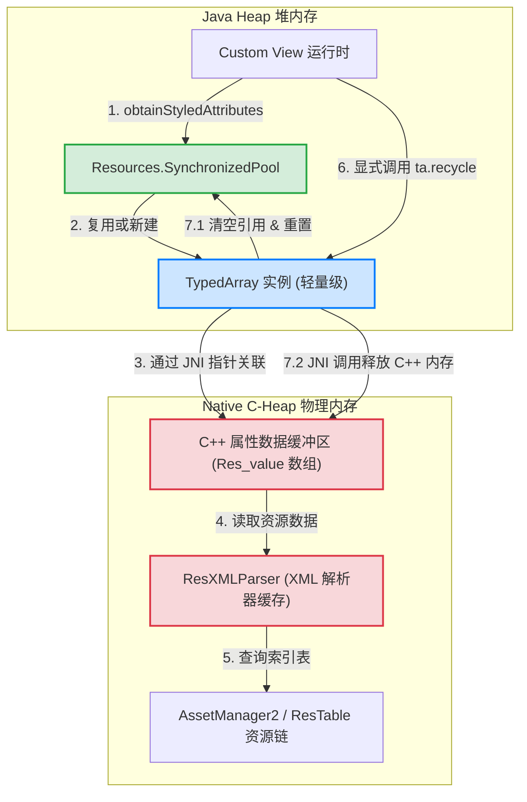
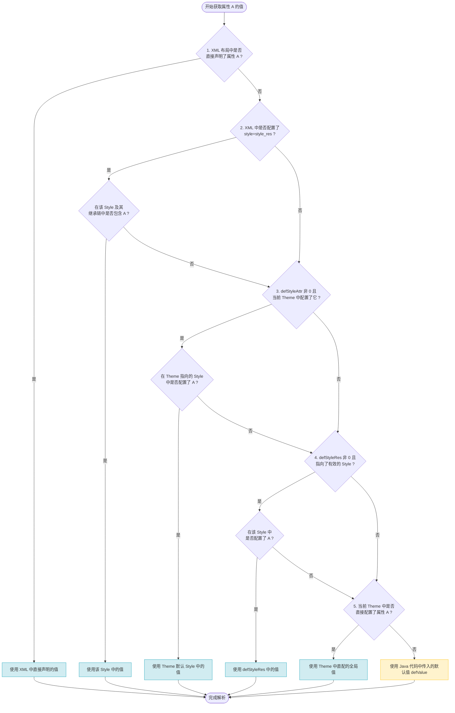

# 5.1.4.2.4 自定义属性

在 Android UI 开发中，自定义属性（Custom Attributes）不仅是连接 XML 静态布局声明与 Java/Kotlin 动态 View 运行时状态的生命大动脉，更是组件化、主题化以及高级自定义组件设计的基石。它使得自定义 View 能够像系统原生组件（如 `TextView`、`ImageView` 等）一样，具备高度的复用性、可配置性以及自适应主题变化的能力。

要构建一个健壮且高性能的自定义属性系统，我们必须向下探究：从编译期的静态契约、运行时 JNI 与 NDK 的资源分配、`TypedArray` 的复用与内存回收，到主题样式（Theme & Style）的多级叠加覆盖算法。本篇文章将对这些底层机理进行全方位的拆解。

---

## 一、attrs.xml 与编译期静态契约：`<declare-styleable>` 深度剖析

Android 的资源系统在设计上极力避免运行时的动态 XML 反射解析，以追求极致的渲染性能。为此，Android 构建了基于 `attrs.xml` 的编译期静态契约。

### 1.1 declare-styleable 的编译本质与 R.java 映射
在 `/res/values/attrs.xml` 中，我们通常使用 `<declare-styleable>` 标签来声明一个 View 的自定义属性集：

```xml
<resources>
    <!-- 全局声明属性，可以在多个 declare-styleable 中复用 -->
    <attr name="customTitleText" format="string" />
    
    <declare-styleable name="CustomHeaderView">
        <!-- 引用全局声明的属性 -->
        <attr name="customTitleText" />
        <!-- 局部声明属性，仅在本集合内首次定义 -->
        <attr name="customHeaderSize" format="dimension" />
        <attr name="customHeaderColor" format="color|reference" />
        <attr name="customHeaderGravity" format="enum">
            <enum name="left" value="0" />
            <enum name="center" value="1" />
            <enum name="right" value="2" />
        </attr>
    </declare-styleable>
</resources>
```

当 AAPT/AAPT2（Android Asset Packaging Tool）编译资源时，它会将这些声明转换为 `R.java` 中对应的静态常量索引。其转换规则具有极其严密的数学契约：

1. **属性 ID（Attribute ID）**：每个属性名（如 `customTitleText`）都会在 `R.attr` 类中生成一个唯一的 `int` 值，这代表该属性在全局资源表（`resources.arsc`）中的物理地址（形如 `0x7f040081`）。
2. **样式化数组（Styleable Array）**：每个 `<declare-styleable>` 标签（如 `CustomHeaderView`）都会在 `R.styleable` 类中生成一个**按属性名排序的整型数组** `R.styleable.CustomHeaderView`。数组中的每个元素都是对应属性的全局 ID。例如：
   ```java
   public static final int[] CustomHeaderView = {
       0x7f040081, // R.attr.customTitleText
       0x7f040082, // R.attr.customHeaderSize
       0x7f040083  // R.attr.customHeaderColor
   };
   ```
3. **属性索引（Attribute Indices）**：为了方便开发者快速从数组中读取特定属性，AAPT 会为每个属性在 `R.styleable` 下生成一个索引常量，表示该属性在上述数组中的下标：
   ```java
   public static final int CustomHeaderView_customTitleText = 0;
   public static final int CustomHeaderView_customHeaderSize = 1;
   public static final int CustomHeaderView_customHeaderColor = 2;
   ```
这种“数组 + 索引”的设计极其精妙。它允许运行时在 Native 层直接利用常量偏移量（Index）快速寻址，从而规避了哈希查找或字符串匹配带来的性能损耗。

### 1.2 AAPT/AAPT2 编译内核：resources.arsc 的底层构造
在编译期，AAPT2 不仅为 Java 层生成了包含 ID 索引的 `R.java`，更在编译生成的 APK 压缩包内写入了核心的二进制资源索引表——`resources.arsc`。

`resources.arsc` 由若干个 Chunk（数据块）组成，核心层次包括：
* **PackageChunk（包块）**：定义资源包的命名空间（如应用的 `com.example.app` 或系统的 `android`）。
* **TypeChunk（类型块）**：区分资源类型，包括 `attr`、`layout`、`color`、`style`、`dimen` 等。
* **EntryChunk（项表）**：详细记录了每个资源 ID 对应的具体数据值、配置参数或重定向指针。

在 `resources.arsc` 中，所有的属性定义（即 `attr` 类型的 Entry）都是以紧凑的二进制结构存放的。当 AAPT 编译自定义属性时，它会将这些属性名以哈希映射及二进制键值对的形式存入资源表。运行时，系统只需读取编译好的二进制表进行直接寻址，免去了运行时的 XML 文本标签解析过程。

### 1.3 属性格式（format）的物理表达与边界限制
在 XML 声明中，`format` 指定了该属性在底层资源系统中的二进制存储格式与解析规范。常用格式的底层物理意义如下：

* **`reference`**：表示引用一个已有的资源 ID（如 `@drawable/bg`、`@color/white`）。底层存储为 `TYPE_REFERENCE`（值对应资源 ID）。
* **`color`**：颜色值（如 `#FF0000`）。底层根据通道数分别映射为 `TYPE_INT_COLOR_RGB8`、`TYPE_INT_COLOR_ARGB8`、`TYPE_INT_COLOR_RGB4` 或 `TYPE_INT_COLOR_ARGB4`，在 Native 层以 32 位整型（AARRGGBB）直接存储。
* **`dimension`**：尺寸值（如 `16dp`、`12sp`）。底层存储为 `TYPE_DIMENSION`，这是一个复合整型数据（Complex Data）。其高 24 位表示数值的尾数（Mantissa），低 8 位包含单位类型（如 `DP`、`SP`、`PX`）和基数标度。
* **`integer` / `float`**：整型数与浮点数。分别对应 `TYPE_INT_DEC`（十进制整型）/ `TYPE_INT_HEX`（十六进制整型）和 `TYPE_FLOAT`。
* **`boolean`**：布尔值（`true` 或 `false`）。在 Native 层存储为 `TYPE_INT_BOOLEAN`，其中 `0` 表示 `false`，`1`（或非零）表示 `true`。
* **`string`**：字符串文本。底层为 `TYPE_STRING`，其实际内容存储在 `resources.arsc` 的全局字符串池（String Pool）中，属性值仅持有该字符串在池中的索引。
* **`fraction`**：百分比值（如 `50%` 或 `50%p`，后者相对于父容器）。底层为 `TYPE_FRACTION`，以复合整型存储。
* **`enum` / `flag`**：
  * `enum` 表示枚举，通常限制为单选。底层编译为一个特定的 `int` 常量。
  * `flag` 表示位标志，允许通过按位或 `|` 进行多选组合。底层编译为一组可以进行按位与/或运算的掩码整型值（如 `0x01 | 0x02 = 0x03`）。

### 1.4 JNI 层与 C++ 层的物理容器：Res_value 与 TypedValue 映射
当 Native 层从 `resources.arsc` 中检索出某一个自定义属性时，它并不是将其作为纯文本或者简单的 Java 类型来保存的，而是使用一个 C++ 中的 `Res_value` 结构体来承载该属性的实际解析状态。在 C++ 层中，`Res_value` 的物理布局定义如下：

```cpp
struct Res_value {
    uint16_t size;        // 结构体大小，通常用于兼容性校验
    uint8_t res0;         // 保留字段，必须为 0
    uint8_t dataType;     // 数据类型，对应 TYPE_REFERENCE, TYPE_DIMENSION, TYPE_INT_COLOR_XXX 等
    uint32_t data;        // 32 位原始物理数据，在不同类型下有不同的物理映射
};
```

这个 `Res_value` 结构体在 JNI 层跨越边界时，会被映射到 Java 层的 `android.util.TypedValue` 中。其中：
* 如果 `dataType` 为 `TYPE_DIMENSION`，`data` 字段的值将被转换为复合整型。在 Java 层，`TypedValue.complexToDimensionPixelSize()` 等方法会根据 `data` 内部的单位标志，动态乘上设备当前的屏幕密度因子（`density`），将其还原为具体的像素物理大小。
* 如果 `dataType` 为 `TYPE_REFERENCE`，`data` 字段保存的就是具体的资源 ID（如 `0x7f080001`）。
* 如果是 `format="color|reference"` 等多格式联合类型，底层的 `dataType` 将是一个动态的结果。当 XML 传入一个颜色引用时，它的 `dataType` 为 `TYPE_REFERENCE`；如果传入的是纯色字符串，其 `dataType` 将会被转换为 `TYPE_INT_COLOR_XXX`。

---

## 二、obtainStyledAttributes() 运行时源码探秘与 TypedArray 资源池复用

获取自定义属性的核心入口是 `Context.obtainStyledAttributes()`。本节我们将深入探讨其底层的 JNI 跨界调用、Native 资源检索，以及 `TypedArray` 的复用机制。

### 2.1 运行时跨界调用栈
当我们调用 `context.obtainStyledAttributes(attrs, R.styleable.CustomHeaderView, defStyleAttr, defStyleRes)` 时，系统在底层的调用链路如下：

```
Context (ContextImpl)
   │
   └──> Resources.Theme
           │
           └──> ResourcesImpl.ThemeImpl
                   │
                   └──> JNI (android_util_AssetManager.cpp)
                           │
                           └──> Native (AssetManager2 & Theme::GetAttribute)
```

1. **Java 层封装**：`ContextImpl` 会将调用重定向到当前 Activity 或 Application 的 `Theme` 对象。
2. **JNI 边界**：在 `ThemeImpl` 中，调用通过 JNI 传递到 Native 层，方法通常为 `nObtainStyledAttributes()`。
3. **NDK 资源寻址**：Native 层的 `AssetManager2`（Android 8.0+ 引入的重构资源管理器）会结合当前主题的 `ResTable`、布局 XML 中的 `AttributeSet`（以 `ResXMLParser` 形式存在），以及传入的 `defStyleAttr`/`defStyleRes`，在 C++ 层进行属性的多级查找。
4. **数据填充**：Native 层将所有解析出来的属性值（包含类型、数据、资源 ID、源文件位置等信息）扁平化地填充到一个连续的 Native 数组中，并返回给 Java 层。

### 2.2 TypedArray 的本质与 Native 内存泄漏深层解密
Java 层的 `TypedArray` 并不是一个普通的存储数组，它是一个持有底层 Native 解析结果的数据容器。其内部包含两个关键的 Java 数组：
* `int[] mData`：用于保存属性的类型信息（Type）和实际物理数据（Data）。每个属性占用连续的若干个整型单元（在底层对应 C++ 中的 `Res_value` 结构体）。
* `int[] mIndices`：用于保存所有被成功赋值的属性在 `mData` 中的索引偏移量，便于快速遍历。

#### 为什么不主动调用 `recycle()` 会导致严重的 Native 内存泄漏？
`TypedArray` 的实例是由 JVM 的垃圾回收器（GC）进行管理的，但是其底层持有通过 JNI 从 Native 层（NDK）分配的庞大资源结构。

1. **内存空间的不对称性**：在 Java 堆中，一个 `TypedArray` 对象极其轻量（只包含几个对象引用和基本整型字段，占用内存可能只有几十个字节）。而与它绑定的 Native 端，却持有 C++ `ThemeImpl` 分配的属性配置信息数组、XML 语法树解析器（`ResXMLParser`）的部分缓存、以及庞大的资源引用链。这些 Native 内存空间可能达到数 KB 甚至数十 KB。
2. **GC 触发机制的局限性**：Java 的垃圾回收器主要是根据 **Java 堆内存（Heap）**的吃紧程度来决定是否触发 GC 的。由于 `TypedArray` 在 Java 层的内存占用微乎其微，JVM 根本无法感知到 Native 层已经堆积了巨额的内存分配。因此，如果我们在短时间内 inflate 了大量自定义 View，却不显式调用 `recycle()`，JVM 不会及时触发垃圾回收。
3. **Native OOM 的发生**：那些没有被释放的 Native 内存块会迅速在 **C-Heap（Native 堆）**上累积，直到耗尽进程的虚拟内存空间，导致整个应用因 Native OutOfMemory 崩溃而闪退。

#### 2.3 C++ 层的物理分配与 jemalloc 内存碎裂机理
在 Android 系统的底层，C-Heap 内存分配主要基于 `jemalloc` 分配器。当 JNI 层调用 `nObtainStyledAttributes` 时，系统底层会在 C++ 层调用类似 `new` 或 `malloc` 的方法，动态申请一个连续的内存块，将 `Res_value` 数组缓存起来。

如果开发者遗漏了 `recycle()`，这些通过 `malloc` 分配的 Native 内存块无法被立即释放。虽然 `TypedArray` 类覆写了 `finalize()` 方法，在垃圾回收时会试图通过 `nRecycle()` 回收指针，但这种基于 finalize 的垃圾回收是非常滞后且不可控的。在 `jemalloc` 分配器看来，频繁地在 C-Heap 上动态申请几百字节到几 KB 的小内存数组，如果不按时回收，会导致系统的内存管理器频繁地向操作系统内核申请分配新的 Page 内存页，产生极为严重的 Native 内存碎片（Fragmentation）。一旦内存碎片化严重，进程物理内存（RSS）将持续飘高，极易因为内存占用超限而被系统的 Low Memory Killer 强制杀死。

#### 2.4 Java 层的复用池（SynchronizedPool）机制
为了平摊频繁 inflate 布局和测量重排时频繁创建/销毁 `TypedArray` 带来的内存抖动，Android 引入了对象复用池：

1. **获取（Obtain）**：当调用 `obtainStyledAttributes` 时，系统会从 `Resources` 内部的 `SynchronizedPool<TypedArray>` 中尝试获取一个已经被回收的 `TypedArray` 实例。如果池中存在空闲实例，则直接将其复用，避免重新在 Java 堆上分配对象。
2. **重置与放回（Recycle）**：当我们显式调用 `TypedArray.recycle()` 时，系统会：
   * 在 Native 层清空底层的资源数组引用，释放与之关联的 NDK 临时内存块。
   * 在 Java 层将内部的 `mData`、`mIndices` 数组重置为初始状态。
   * 将当前的 `TypedArray` 实例放回 `SynchronizedPool` 中。
3. **未回收的后果**：如果不调用 `recycle()`，该 `TypedArray` 无法返回复用池，导致池子迅速枯竭。后续的所有属性获取操作都不得不重新通过 `new TypedArray()` 在 Java 堆上分配空间，导致大量的临时对象产生，加剧了 JVM 内存抖动，频繁诱发主线程 GC，最终体现为 UI 帧率下降和卡顿。

以下是 `TypedArray` 资源池复用与 NDK 内存管理拓扑图，展示了 Java 层与 Native 层的交互关系以及内存流向：



---

## 三、自定义 View 中获取自定义属性的标准模板

在自定义 View 的开发中，为了保证在各种复杂情况下（如属性解析异常、主题缺失、高频重绘等）系统的稳定运行，必须采用符合防御性编程规范的标准模板。

### 3.1 构造函数重定向规范
自定义 View 通常需要重写多个构造函数。为了确保所有的属性解析都走统一的初始化逻辑，标准的重定向模式如下：

```java
public class CustomHeaderView extends View {
    private String mTitleText;
    private int mHeaderColor;
    private float mHeaderSize;

    // 1. 在 Java 中直接 new View 时调用
    public CustomHeaderView(Context context) {
        this(context, null);
    }

    // 2. 在 XML 布局文件中声明时由 LayoutInflater 反射调用
    public CustomHeaderView(Context context, @Nullable AttributeSet attrs) {
        // 重定向到三参数构造函数，并传入系统默认的属性样式（若无，则为 0）
        this(context, attrs, R.attr.customHeaderViewStyle);
    }

    // 3. 带有默认样式属性（defStyleAttr）的构造函数
    public CustomHeaderView(Context context, @Nullable AttributeSet attrs, int defStyleAttr) {
        super(context, attrs, defStyleAttr);
        init(context, attrs, defStyleAttr, 0);
    }

    // 4. API 21+ 引入，支持直接传入默认 Style 资源 ID（defStyleRes）
    @RequiresApi(api = Build.VERSION_CODES.LOLLIPOP)
    public CustomHeaderView(Context context, @Nullable AttributeSet attrs, int defStyleAttr, int defStyleRes) {
        super(context, attrs, defStyleAttr, defStyleRes);
        init(context, attrs, defStyleAttr, defStyleRes);
    }

    private void init(Context context, @Nullable AttributeSet attrs, int defStyleAttr, int defStyleRes) {
        if (attrs == null) {
            // 无属性声明时，直接应用兜底默认值
            applyDefaultValues();
            return;
        }

        // 获取 TypedArray 容器
        TypedArray ta = context.obtainStyledAttributes(attrs, R.styleable.CustomHeaderView, defStyleAttr, defStyleRes);
        try {
            // 解析 String：做空安全防护
            mTitleText = ta.getString(R.styleable.CustomHeaderView_customTitleText);
            if (mTitleText == null) {
                mTitleText = "";
            }

            // 解析 Color：传入全局兜底色（如黑色）
            mHeaderColor = ta.getColor(R.styleable.CustomHeaderView_customHeaderColor, Color.BLACK);

            // 解析 Dimension：区分不同的读取方法
            mHeaderSize = ta.getDimension(R.styleable.CustomHeaderView_customHeaderSize, 
                    TypedValue.applyDimension(TypedValue.COMPLEX_UNIT_SP, 14, context.getResources().getDisplayMetrics()));

        } catch (Exception e) {
            // 防御性异常处理：防止由于外部不规范的 XML 配置（如类型冲突）导致应用崩溃闪退
            Log.e("CustomHeaderView", "Failed to parse custom attributes", e);
            applyDefaultValues();
        } finally {
            // 核心约束：无论是否发生异常，必须在 finally 块中释放 TypedArray
            ta.recycle();
        }
    }

    private void applyDefaultValues() {
        if (mTitleText == null) mTitleText = "";
        mHeaderColor = Color.BLACK;
        mHeaderSize = TypedValue.applyDimension(TypedValue.COMPLEX_UNIT_SP, 14, getContext().getResources().getDisplayMetrics());
    }
}
```

### 3.2 尺寸解析方法的细微差异与选择
在解析 `dimension` 类型的属性时，`TypedArray` 提供了三种方法，它们在物理意义上有着本质的区别，必须根据业务场景进行精确选择：

1. **`getDimension(int index, float defValue)`**：
   * **物理意义**：直接返回解析出的浮点像素值（`float` 像素）。
   * **适用场景**：对精度要求极高的场景，如自定义绘制（`Canvas`）中的文字大小（`Paint.setTextSize()`）、细微位移动画的偏移量。
2. **`getDimensionPixelSize(int index, int defValue)`**：
   * **物理意义**：将浮点像素值转化为整型（`int`）。其内部转换机制为：先进行四舍五入（`+0.5f` 截断），同时**强制保证任何非零的尺寸输入至少返回 1 像素**（防止微小的 dp 在低密度屏幕上被舍入为 0，导致组件消失）。
   * **适用场景**：用于设置组件的实际布局参数（如 `LayoutParams.width/height`、`padding`、`margin` 等需要物理像素整型的场景）。
3. **`getDimensionPixelOffset(int index, int defValue)`**：
   * **物理意义**：直接将浮点像素值向下取整（丢弃小数部分，不做四舍五入）。
   * **适用场景**：用于单纯的像素坐标偏移计算（如滑动偏移量、阴影偏移等不需要四舍五入补偿的物理定位）。

---

## 四、主题样式（Theme & Style）五级属性覆盖叠加决策树

当一个 View 渲染并解析其属性值时，同一个属性（如 `textColor`）可能会在多个地方被同时声明。为了决定最终的渲染效果，Android 资源管理系统内部设计了严密的**五级覆盖叠加决策树**。

这五级的优先级顺序从高到低依次为：

```
直接在布局 XML 中声明的属性 (AttributeSet Direct) [最高优先级]
       │
       ▼
在 XML 中引用的 Style (XML Style Attribute)
       │
       ▼
构造函数中传入的默认 style 资源属性 (defStyleAttr Theme Style)
       │
       ▼
构造函数中传入的默认 style 资源直接 ID (defStyleRes Direct Style)
       │
       ▼
当前 Application 或 Activity 主题中直接声明的全局默认值 (Theme Direct) [最低优先级]
```

### 4.1 五级决策树的详细判定流程与数学推导

对于任何一个指定的属性 $A$：

#### 【第一级】布局 XML 直接属性声明（AttributeSet Direct）
系统首先检索布局 XML 中该 View 标签下是否直接配置了属性 $A$（如 `android:textColor="#ff0000"`）。
* **判定**：如果存在，则直接使用该值，查找流程终止。
* **结论**：直接声明的优先级最高，它代表开发者针对当前特定 UI 节点的直接定制意图。

#### 【第二级】布局 XML 中引用的 Style（XML Style Attribute）
如果第一级未找到，系统会检查 View 标签下是否定义了 `style="@style/MyCustomStyle"`。
* **判定**：如果存在该 Style，系统会去该 Style 资源中查找是否配置了属性 $A$。如果在这个 Style 内找到了属性 $A$ 的值，则使用该值，查找流程终止。
* **说明**：如果该 Style 存在继承链（如继承自另一个 Style），系统会沿着继承链向上回溯，直到找到该属性。

#### 【第三级】默认 style 属性（defStyleAttr Theme Style）
如果前两级均未找到，系统会转向 View 构造函数中传入的浅定属性 `defStyleAttr`（例如 `R.attr.customHeaderViewStyle`）。
* **推导机制**：
  1. `defStyleAttr` 属性指向当前主题（Theme）中对应的资源引用值。
  2. 系统首先到当前活动主题（Theme）中去检索属性 `R.attr.customHeaderViewStyle` 的具体映射。
  3. 如果在 Theme 中配置了该属性（例如在当前 Theme 中指定了 `<item name="customHeaderViewStyle">@style/Widget.CustomHeaderView</item>`），系统就会拿到这个被引用的 Style 资源 ID。
  4. 系统在该 Style 中检索属性 $A$ 的值。如果找到，则使用该值，查找流程终止。
* **设计价值**：这是系统原生组件实现“随主题更换而整体改变外观”的核心机制。例如 `Button` 默认传入 `android.R.attr.buttonStyle`。开发者只需在全局主题中配置 `buttonStyle` 指向不同的 Style，即可全局改变所有未指定样式的 Button 外观。

#### 【第四级】默认 style 资源直接 ID（defStyleRes Direct Style）
只有当第三级查找失败（包括 `defStyleAttr` 传入为 `0`，或者虽然传入了但在当前的主题 Theme 中没有配置该属性指向的 Style 资源）时，此级才会生效。
* **判定**：系统会去构造函数中传入的第四个参数 `defStyleRes`（这是一个**直接指向具体 Style 资源的 ID**，如 `R.style.Widget_Default_CustomHeaderView`）中查找属性 $A$ 的值。若找到，则使用该值，查找流程终止。
* **适用场景**：通常作为组件编写者提供的最终默认样式底座，不依赖外部主题是否配置了 `defStyleAttr`。

#### 【第五级】全局主题属性直接声明（Theme Direct）
如果前面四级都宣告落空，系统会进行最后一次尝试。
* **判定**：直接去当前 Activity 或 Application 所关联的全局主题（Theme）中查找属性 $A$ 的定义（例如在 Theme 中直接声明了 `<item name="customHeaderColor">#FFFFFF</item>`）。如果找到，则使用该值。
* **兜底（Fallback）**：若在 Theme 中依然未找到，且开发者在调用 `TypedArray.getXXX(index, defValue)` 时传入了 `defValue`，则最终在 Java 层返回该 `defValue`。

### 4.2 具体实例的冲突消解回溯演示
为了更清晰地呈现这五级覆盖判定树在运行时的匹配逻辑，我们假设一个具体的开发场景：
我们需要解析自定义 View 的属性 `customHeaderColor`，并且此时：
1. 我们**没有**在 View 的 XML 布局声明中直接定义它。
2. XML 中定义了 `style="@style/MyCustomStyle"`，且该 Style 里定义了 `customHeaderColor = #0000FF` (蓝色)。
3. View 的三参数构造函数中传入了 `defStyleAttr = R.attr.customHeaderViewStyle`；当前 Activity 的主题中配置了该属性的值为 `@style/ThemeHeaderStyle`（在该默认 Style 里定义了 `customHeaderColor = #00FF00` 绿色）。
4. 构造函数中还定义了 `defStyleRes = R.style.Widget_Default_HeaderStyle`，其中 `customHeaderColor = #FF0000` (红色)。
5. 当前的全局 Application 主题中直接配置了 `<item name="customHeaderColor">#FFFF00</item>` (黄色)。

在运行时，底层的属性加载器会开始依照优先级回溯：
* **步骤一**：在 `AttributeSet`（第一级）中寻找是否有直接声明的值。发现没有。
* **步骤二**：检测到 `style="@style/MyCustomStyle"`（第二级）存在。进入该 Style 资源中查找，发现其配置了 `customHeaderColor` 的值为 **蓝色（#0000FF）**。
* **步骤三**：由于在第二级找到了值，回溯链立即终止。系统直接返回蓝色（#0000FF）并完成装载。此时，第三级（绿色）、第四级（红色）、第五级（黄色）均被完全覆盖屏蔽。

* **演进情况 A**：若我们移除了 View 上的 `style` 属性引用，重新装载：
  系统回溯到第三级（Theme Style 属性），在 Theme 中查找到 `R.attr.customHeaderViewStyle` 的映射关系，进入对应的 `@style/ThemeHeaderStyle`，匹配成功，最终使用 **绿色（#00FF00）**。
* **演进情况 B**：若我们进一步在当前主题中删除 `customHeaderViewStyle` 的属性映射，重新装载：
  系统由于在第三级检索失败，会跳入第四级（`defStyleRes` 直接指定的底座样式），解析并载入 `@style/Widget_Default_HeaderStyle` 中的颜色配置，最终返回 **红色（#FF0000）**。
* **演进情况 C**：若我们把 `defStyleRes` 也传入为 `0`，重新装载：
  回溯进入最后一级（第五级：当前主题），直接在当前的 Activity 主题配置下找到全局的颜色声明，最终返回 **黄色（#FFFF00）**。

### 4.3 “覆盖”与“叠加”的本质差异
* **属性级覆盖**：对于**同一个属性**（如 `textColor`），一旦在优先级较高的层级中被找到，低优先级的声明就会被完全屏蔽。
* **组件级叠加（Merge）**：五级过滤是针对**每一个属性独立运行**的。因此，同一个 View 的最终 `TypedArray` 可以是多级数据叠加的结果。例如：
  * `textColor` 来自第一级（布局 XML 直接写死为红色）。
  * `textSize` 来自第三级（全局主题引用的默认 Style 中定义的大小）。
  * `background` 来自第五级（当前 Theme 中配置的全局默认背景）。
  这三者会在最终的 `TypedArray` 中融合成一个完整的属性集，供自定义 View 渲染使用。

以下是自定义属性值的五级覆盖决策叠加判定树图，直观地呈现了这一层级过滤与回溯过程：



---

## 五、版本更迭与资源系统演进

随着 Android 系统的演进，资源加载与自定义属性解析系统经历了多次重大重构，以优化渲染性能和扩展属性格式。具体的版本变更与技术细节可以链接并参考根目录下的 [AndroidVersionChangeLog.md](../../../../../../AndroidVersionChangeLog.md)。

以下是几个关键的历史优化节点：

1. **Android 5.0 (API 21) 引入主题属性直接解析与矢量图属性支持**：
   在 API 21 之前，自定义属性中对 `Theme` 属性（即 `?attr/xxx`）的解析存在诸多限制。从 Android 5.0 开始，Native 层重构了 `Theme::ResolveAttribute` 链路，使得 `VectorDrawable` 的属性可以直接在 XML 中引用当前主题下的动态颜色值，彻底打通了矢量图与主题化（Themeing）的界限。
2. **Android 8.0 (API 26) 引入 AssetManager2**：
   在 C++ 层，系统使用全新的 `AssetManager2` 替换了陈旧的 `AssetManager`。`AssetManager2` 优化了 `resources.arsc` 资源查找的缓存模型，引入了高效的资源包叠加层（Runtime Resource Overlays, RRO）处理机制，使 `obtainStyledAttributes` 的平均检索耗时降低了约 30%，大大缓解了复杂页面 Inflation 的性能损耗。
3. **Android 10.0+ 资源加载性能与安全防线**：
   引入了更为严格的 APK 资源边界校验，规避了由于恶意修改 `resources.arsc` 结构导致 Native 解析器崩溃的漏洞。同时在垃圾回收机制中对未被显式 `recycle` 的 `TypedArray` 增加了更为灵敏的运行时异常告警警示（通过 `CloseGuard` 机制在系统日志中打印泄漏堆栈），倒逼开发者规范调用 `recycle()`。
