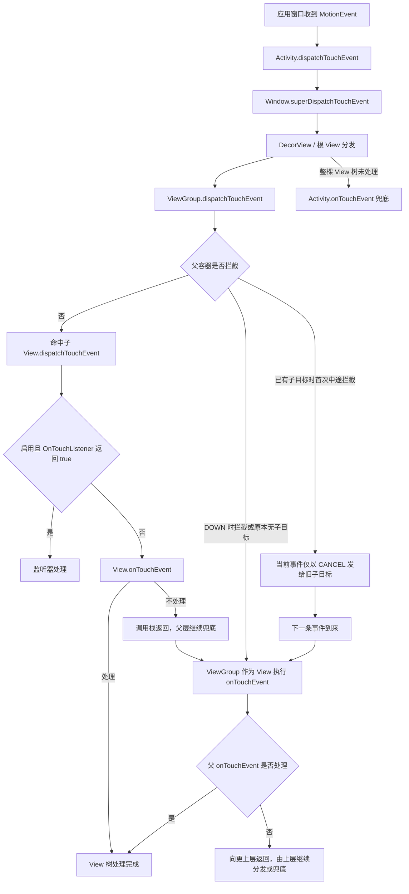
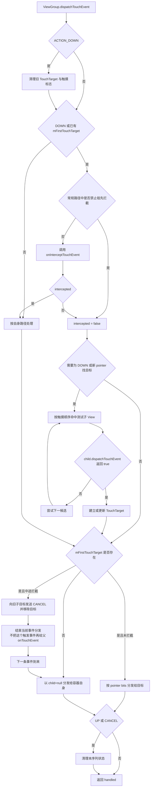
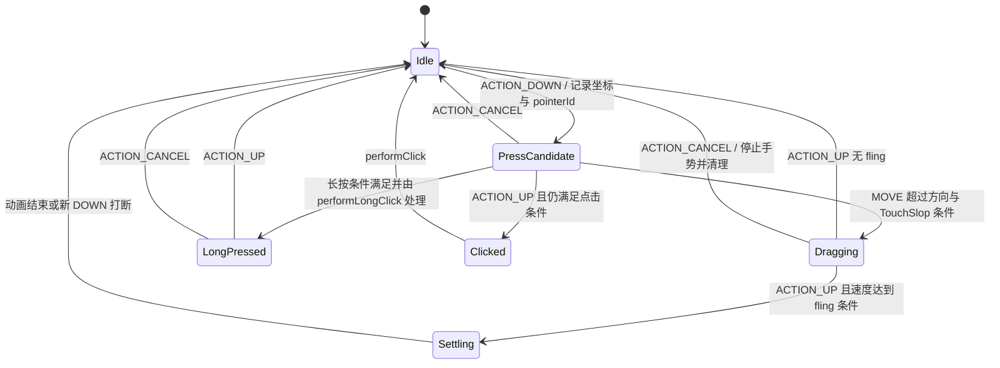

# 5.1.4.2.5 事件分发机制

Android View 体系中的触摸事件分发机制，解决的不是“某个回调什么时候执行”这一件事，而是三个连续问题：

1. 一组来自同一次手势的 `MotionEvent`，应当进入哪个窗口、沿哪条 View 树路径传递；
2. 父容器、子 View 与监听器如何协商当前事件由谁处理；
3. 一旦某个节点成为触摸目标，后续事件如何保持路由连续性，并在拦截、取消、多指变化或窗口状态变化时正确结束。

因此，`dispatchTouchEvent`、`onInterceptTouchEvent` 和 `onTouchEvent` 不能脱离“事件序列”单独理解。一次点击不是一个孤立的 `ACTION_UP`，一次拖动也不是若干互不相关的 `ACTION_MOVE`；它们都属于从 `ACTION_DOWN` 开始、以 `ACTION_UP` 或 `ACTION_CANCEL` 结束的有状态序列。分发系统必须在序列开始时确定候选目标，在序列进行中维护目标关系，在所有结束路径上清理状态。

本文讨论经典 View 体系中的触摸分发。AOSP 代码会持续演进，文中的源码均是用于解释稳定机制的简化示意，不绑定某一个 Android 发布版本，也不应直接复制到业务代码。预测返回手势、无障碍触摸探索、鼠标悬停、手写笔按钮、`ACTION_OUTSIDE` 等输入路径可能经过额外策略；没有特别说明时，以下结论针对应用窗口内普通触摸屏输入产生的 `MotionEvent` 序列。

## 1. 先建立整体模型：分发、拦截与消费

一个节点收到触摸事件后，首先进入 `dispatchTouchEvent`。这个方法代表“当前节点如何处理分发责任”，不等同于“当前节点亲自消费事件”。对于 `ViewGroup`，它可能把事件交给某个子 View；对于普通 `View`，它会先考虑 `OnTouchListener`，再考虑自身的 `onTouchEvent`。只有走到具体手势处理逻辑时，才是在讨论消费。

三个核心方法的职责可以概括为：

| 方法 | 典型拥有者 | 主要职责 | 返回值的局部含义 |
| --- | --- | --- | --- |
| `dispatchTouchEvent(event)` | `Activity`、`ViewGroup`、`View` | 当前层的分发入口，决定委托给窗口、子节点、监听器还是自身 | 当前层级是否处理了这次分发 |
| `onInterceptTouchEvent(event)` | `ViewGroup` | 在父容器与子树之间决定是否截留事件 | `true` 表示当前容器决定阻止事件继续交给当前子目标 |
| `onTouchEvent(event)` | `Activity`、`ViewGroup`、`View` | 当前对象作为消费者解释事件并维护手势状态 | 当前对象是否处理该事件 |

这里有两个容易造成误解的细节。

第一，返回 `false` 后所谓“向上回传”，通常不是系统重新把同一个事件依次调用每一级父节点的 `onTouchEvent`。更准确的模型是：父容器调用子 View 的 `dispatchTouchEvent`，得到 `false` 后，继续执行父容器自己的决策，必要时再由父容器作为普通 View 调用自身消费逻辑。它是一层层调用栈返回后的兜底，而不是另一条独立的冒泡协议。

第二，一个方法返回 `true` 只说明该层对当前分发结果负责。`ViewGroup.dispatchTouchEvent` 返回 `true` 时，真正消费事件的可能是深层子 View；不能据此推断父容器的 `onTouchEvent` 一定执行过。

可以用下面的总图理解应用内的主路径：



这张图只表达职责关系。真实的 `ViewGroup.dispatchTouchEvent` 还要处理命中测试、坐标变换、触摸目标链表、多点事件分割、取消和安全过滤等细节。

## 2. MotionEvent 不是一个点，而是一段有身份的序列

### 2.1 单指序列的基本边界

最常见的单指序列是：

```text
ACTION_DOWN
ACTION_MOVE
ACTION_MOVE
...
ACTION_UP
```

`ACTION_DOWN` 表示当前手势中的第一根指针进入触摸区域，建立一个新的触摸序列。`ACTION_UP` 表示最后一根指针离开，正常结束序列。若目标不应继续按照正常手势处理，则可能以 `ACTION_CANCEL` 结束。

`ACTION_MOVE` 的数量不固定，也不保证每一帧只有一个采样点。为了降低分发开销，系统可以把较早的移动采样作为 history 批量放进同一个 `MotionEvent`。需要高精度轨迹的画板、签名或手写组件，可以读取 `historySize`、`getHistoricalX/Y`；普通拖动组件通常只使用当前坐标即可。忽略历史点不会破坏分发契约，只会降低轨迹采样精度。

事件时间也应区分：

- `downTime`：本次手势最初 `ACTION_DOWN` 的时间；
- `eventTime`：当前事件或采样发生的时间。

二者可用于判断手势持续时间，但业务代码一般不应硬编码“点击必须小于多少毫秒”或“长按固定多少毫秒”。系统阈值、设备能力、辅助功能和框架实现都可能影响交互，优先使用 `ViewConfiguration`、`GestureDetector` 或平台 View 已有语义。

### 2.2 多指序列增加的是指针变化，不是多条无关序列

多指触控中，第一根手指仍产生 `ACTION_DOWN`，最后一根手指离开仍产生 `ACTION_UP`。中间增加或移除某根手指时使用：

- `ACTION_POINTER_DOWN`：已有活动指针时，又有指针按下；
- `ACTION_POINTER_UP`：仍有其他指针活动时，其中一根指针抬起。

动作类型应使用 `actionMasked` 读取，发生变化的指针位置使用 `actionIndex` 读取。`action` 的高位包含索引信息，直接把完整 `action` 与 `ACTION_POINTER_DOWN` 比较容易得到错误结果。

每根活动指针同时有 `pointerId` 和 `pointerIndex`：

- `pointerId` 是这根指针在其活动生命周期内的稳定标识；
- `pointerIndex` 是它在当前 `MotionEvent` 数据数组中的位置，后续事件中可能变化。

官方 API 明确说明指针在事件数组中的顺序没有稳定保证。持续跟踪一根手指时，应保存 `pointerId`，每次通过 `findPointerIndex(pointerId)` 获取当前索引，再读取坐标。不能把某次事件中的 index 长期保存。

```kotlin
private var activePointerId = MotionEvent.INVALID_POINTER_ID

fun readActivePoint(event: MotionEvent): Pair<Float, Float>? {
    val index = event.findPointerIndex(activePointerId)
    if (index < 0) return null
    return event.getX(index) to event.getY(index)
}
```

当活跃指针在 `ACTION_POINTER_UP` 中离开时，拖动组件需要选择仍然存在的另一根指针，并同时重置“上一次坐标”。如果只切换 ID 而不更新基准坐标，下一次位移会把两根手指的位置差误算成一次巨大移动，表现为内容跳跃。

### 2.3 坐标有层级，事件也可能被变换

常用坐标含义不同：

- `event.x/y` 或 `getX/getY(index)`：相对当前接收 View 的局部坐标；
- `rawX/rawY`：相对屏幕坐标，适合跨窗口或拖拽位置估算，但要考虑窗口移动、显示区域和多屏场景；
- View 的 `left/top/right/bottom`：相对父容器布局坐标；
- `translationX/Y`、缩放、旋转和矩阵：属于绘制或属性变换，不应与布局边界混为一谈。

事件从父容器发给子 View 前，框架会把父坐标转换为子 View 局部坐标。概念上需要扣除子 View 的位置、加入父容器滚动偏移，并在子 View 存在非单位变换矩阵时应用逆矩阵。业务日志若只打印每层 `event.x`，会发现数值随层级改变，这是正常的坐标转换，不是事件被系统篡改。

`MotionEvent` 对象可能被框架临时偏移、分割或复制。应用代码不应在回调结束后长期持有传入对象，也不应回收由框架传入的事件。确需异步保存时，应复制所需字段，或按 API 契约创建副本并负责其生命周期。

## 3. 从系统输入到 View 树：Activity、Window 与 DecorView

触摸首先由输入系统选择目标窗口。内核输入设备、`EventHub`、`InputReader`、`InputDispatcher`、输入通道和 `ViewRootImpl` 构成窗口之前的系统链路。本文重点是 View 树内部机制，只需要保留两点：

1. 系统先决定事件属于哪个窗口，View 的命中测试不会跨应用窗口寻找目标；
2. 应用主线程迟迟不完成输入处理，会阻塞后续输入确认，并可能参与输入分发超时问题。

进入典型 Activity 窗口后，主路径可抽象为：

```text
Activity.dispatchTouchEvent
    -> Window.superDispatchTouchEvent
    -> DecorView.superDispatchTouchEvent
    -> ViewGroup.dispatchTouchEvent
    -> ... -> View.dispatchTouchEvent
```

在常见框架实现中，Activity 持有的窗口通常是 `PhoneWindow`，根视图是 `DecorView`。但不应把“常见默认实现”写成 `Window` 在所有环境中的唯一具体实现：测试框架、系统组件、厂商代码或未来实现都可能提供不同对象。稳定契约是 Activity 通过 `Window.superDispatchTouchEvent` 把事件交给窗口管理的 View 层级，而不是某个类名永远唯一。

Activity 的逻辑可以简化理解为：

```java
// AOSP 机制简化示意，不是可替换源码
boolean dispatchTouchEvent(MotionEvent event) {
    if (event.getAction() == MotionEvent.ACTION_DOWN) {
        onUserInteraction();
    }
    if (getWindow().superDispatchTouchEvent(event)) {
        return true;
    }
    return onTouchEvent(event);
}
```

因此：

- View 树处理成功后，Activity 的 `onTouchEvent` 不会作为第二个观察回调再次执行；
- 整棵 View 树没有处理事件时，Activity 才有机会兜底；
- 在 Activity 中粗暴返回 `true`、不调用正常窗口分发，会截断整个界面的触摸链路；
- 在 Activity 中记录分发日志可以观察入口，但不适合作为日常业务手势的集中处理点。

`DecorView` 是窗口内容与系统装饰的根容器。事件进入它后，主体遵循 `ViewGroup` 的分发规则。状态栏、标题区域、窗口回调和系统功能可能带来额外处理，但对普通内容 View 而言，可以把它看作 View 树的顶层父容器。

## 4. ACTION_DOWN 的“契约”到底意味着什么

常见说法是“谁消费 DOWN，后续就给谁”。这个说法有帮助，但必须补充层级和例外。

对某个父 `ViewGroup` 来说，`ACTION_DOWN` 到来时会清理上一序列遗留的触摸目标和标志，重新执行命中测试。若某个子 View 的分发返回 `true`，父容器会为它建立 `TouchTarget`。后续 `MOVE`、`UP` 通常根据这个目标关系继续分发，而不是每次重新从所有子 View 中找目标。

若一个子 View 对 `ACTION_DOWN` 返回 `false`，它没有成为该父容器当前序列的触摸目标。即使手指后来移动进它的区域，它通常也不会在该序列中重新获得普通单指事件。这样设计有三个原因：

1. 保证一个手势的按下、移动和结束由同一状态机解释；
2. 避免手指经过多个控件时不断切换消费者；
3. 允许组件在 DOWN 时初始化速度、阈值、按压反馈和手势识别状态。

但“消费 DOWN”不等于某个叶子 View 永远独占后续事件。父容器可以在中途拦截；窗口可以取消事件；多点分割可以把不同 pointer 分给不同子目标；安全过滤或特殊输入策略也可能改变路径。因此更严谨的结论是：

> `ACTION_DOWN` 决定普通触摸序列中初始目标关系。目标若建立，后续事件倾向于保持路由连续；目标若未建立，该子 View 通常不会再参与该序列。这个关系可以由父容器中途拦截或系统取消终止。

还要区分“View 的 `onTouchEvent(DOWN)` 返回值”和“View 的 `dispatchTouchEvent(DOWN)` 返回值”。若 `OnTouchListener` 返回 `true`，即使 `onTouchEvent` 没执行，整个 View 的分发仍返回 `true`，它依然可以成为父容器记录的触摸目标。

同样需要区分 DOWN 与后续事件的返回值。决定父容器是否为子 View 建立 `TouchTarget` 的关键，是初始 DOWN 分发是否返回 `true`。目标已经建立后，子 View 某次 `ACTION_MOVE` 的分发返回 `false`，不会像 DOWN 失败那样让父容器重新命中兄弟 View，也不会自动把本序列平滑转交给另一个子 View。父容器仍按已有目标关系推进当前分发；是否中途接管取决于父容器的拦截决策，接管时需要通过 CANCEL 结束旧目标。因此，“`onTouchEvent` 任意一次返回 false 都会失去全部后续事件”不是普遍规则，必须结合动作阶段、外层 `dispatchTouchEvent` 的最终返回值和父容器当前的 `TouchTarget` 状态判断。

## 5. ViewGroup.dispatchTouchEvent 的内部决策

`ViewGroup.dispatchTouchEvent` 是整个机制的核心，因为它既是一个 View 的分发入口，又承担对子树的路由责任。主线 AOSP 实现很复杂，但稳定的骨架可以拆成七步。

### 5.1 新 DOWN：清理旧序列

当新的 `ACTION_DOWN` 到来时，父容器会取消并清理仍残留的旧触摸目标，重置当前触摸状态。这样即使应用切换、上个序列异常终止或状态未及时释放，新手势也不会沿用旧的 `mFirstTouchTarget`。

这一阶段还会清理上一触摸序列中的 `FLAG_DISALLOW_INTERCEPT` 等状态。子 View 在上一次手势中请求父容器不要拦截，不会永久影响未来手势。

### 5.2 是否调用 onInterceptTouchEvent

当前 AOSP 主线的经典判断仍可抽象为：

```java
// AOSP 主线机制简化示意
if (actionMasked == ACTION_DOWN || mFirstTouchTarget != null) {
    if (!disallowIntercept) {
        intercepted = onInterceptTouchEvent(event);
    } else {
        intercepted = false;
    }
} else {
    intercepted = true;
}
```

含义是：

- DOWN 必须给父容器一次建立拦截决策的机会；
- 已有子触摸目标时，父容器在序列进行中仍可能检查是否要接管；
- 若不是 DOWN 且没有子目标，父容器没有必要再寻找子 View，后续直接按自身路径处理。

这段条件判断同时解释了“为什么日志里没有出现拦截回调”。`onInterceptTouchEvent` 不是输入系统对每个事件固定调用的入口，而是 `ViewGroup.dispatchTouchEvent` 在仍存在父子所有权竞争时才执行的内部决策：

| 当前状态 | 常规路径是否调用 `onInterceptTouchEvent` | 主要原因 |
| --- | --- | --- |
| 新的 `ACTION_DOWN` | 是 | 清理旧状态后决定本轮是否从起点接管 |
| 非 DOWN，已有 `mFirstTouchTarget`，未禁止拦截 | 是 | 子目标仍存在，父容器还有中途接管的可能 |
| 非 DOWN，已有目标，但设置了 `FLAG_DISALLOW_INTERCEPT` | 通常否 | 后代已请求祖先暂时不要进行普通拦截判断 |
| 非 DOWN，没有子目标 | 通常否 | 已没有“阻止事件继续给哪个子目标”的问题 |
| 父容器已中途拦截并清除目标 | 否 | 后续直接走父容器自身消费路径 |

表中的“通常”是为了给系统手势、预测返回、无障碍和未来实现中的特殊输入分支留出边界；应用内普通触摸冲突可以按该模型分析。

`mFirstTouchTarget` 为空不等于当前父容器一定收不到事件。若子树在 DOWN 阶段无人处理，父容器可以通过 child 为空的路径调用自身 `View.dispatchTouchEvent` 和 `onTouchEvent`。这属于“没有子目标后的自身兜底”，不是 `onInterceptTouchEvent` 成功拦截。反过来，只要某个直接子树在 DOWN 分发中返回 true，父容器便会保存相应目标，后续 MOVE 才有“继续给子目标还是中途接管”的选择。

`requestDisallowInterceptTouchEvent(true)` 会使常规触摸分发在相应触摸持续期内跳过祖先的普通拦截判断。该请求会沿父链传播，父容器通常通过内部 `FLAG_DISALLOW_INTERCEPT` 记录状态；事件仍会经过祖先的 `dispatchTouchEvent`，只是祖先不再调用普通的 `onInterceptTouchEvent` 来抢占。新 DOWN 会重置上一序列的标记，UP/CANCEL 也会结束本轮约束，所以它不是永久配置。

这个请求还有三个边界：

1. 它只限制普通拦截判断，不会绕过命中测试，也不能让一个拒绝 DOWN 的子 View 重新成为目标；
2. 子 View 调用 `requestDisallowInterceptTouchEvent(false)` 只是重新允许祖先在后续事件判断，只有祖先之后真正返回 true，才会取消子目标并接管；
3. 它不是跨所有输入类型、窗口策略和系统手势的绝对权限。例如当前主线中与预测返回手势状态相关的路径可能具有特殊处理，业务结论应限定为经典 View 触摸仲裁。

自定义 `ViewGroup` 重写 `requestDisallowInterceptTouchEvent` 时，若没有明确替代协议，应调用 `super` 继续向祖先传播。截断传播会造成直接父容器看似遵守请求、更外层容器却仍然拦截的隐蔽冲突。

### 5.2.1 返回值改变的是序列所有权

`onInterceptTouchEvent` 返回 false，表示当前父容器暂不接管；若已有子目标，当前事件继续给该目标。父容器可以记录坐标、判断方向和检查边界，但不应在观察阶段同时执行正常内容滚动，否则父子会对同一个采样都产生业务位移。

在 DOWN 返回 true 时，本轮尚未建立子目标，当前 DOWN 会直接进入父容器自身的分发与 `onTouchEvent`。这种策略适合父容器专属拖拽手柄、明确的边缘手势区或子树不应参与的模式。若整个容器无条件拦截 DOWN，按钮点击、文本选择、列表项长按等依赖子 View 起始状态的交互都会失去机会。父容器既然从 DOWN 接管，就必须在自己的 `onTouchEvent(DOWN)` 返回 true，并在那里建立完整消费状态。

在已有子目标时，某个 MOVE 首次返回 true 是最常见的中途接管。当前 AOSP 常规主干会把这个原始 MOVE 仅以 CANCEL 语义发给旧目标并清除对应 `TouchTarget`；父容器不会在同一次分发中再用原始 MOVE 调用自己的 `onTouchEvent`。父的正常消费从下一条事件开始，下一条可能是 MOVE，也可能已经是 UP 或 CANCEL。因此决定拦截时应保存当前坐标作为交接基线，不能假设当前 MOVE 还会在父 `onTouchEvent` 中初始化状态。

接管后也不能靠下一次返回 false 把同一手势交还给原子 View。旧目标已经收到 CANCEL，也没有新的 DOWN 可以重建点击、速度和长按状态。需要父子在同一手势中反复分配距离或速度时，应采用 Nested Scrolling 或明确的协作协议，而不是把拦截返回值当作可逆开关。

### 5.2.2 DOWN、MOVE、UP 与 CANCEL 在拦截阶段的职责

`ACTION_DOWN` 用于重置方向锁、拖动标记和活跃 pointer，保存 `downX/downY` 等累计位移基线，并记录触点是否位于父容器专属区域。多数方向冲突应先返回 false，为子 View 保留点击机会；但“DOWN 永远不能拦截”同样不成立，关键是父容器是否确实拥有从起点处理整段序列的理由与能力。

`ACTION_MOVE` 用于在累计位移超过运行时 `touchSlop` 后确定意图。方向型容器通常同时比较主轴、副轴和滚动边界，并在首次确认后锁定方向。判断应基于 DOWN 到当前点的总位移，而不是只比较相邻 MOVE；慢速移动的单帧差可能始终小于阈值，偶发噪声也可能让逐帧方向来回变化。

`ACTION_UP` 若到来前父容器始终没有接管，通常只清理观察状态并继续放行，让子目标正常提交点击或手势。最后一刻才在 UP 返回 true，往往只会把子 View 原本的正常 UP 改成 CANCEL，却没有可供父容器继续处理的后续序列。

`ACTION_CANCEL` 表示当前层的观察或消费被更高层、窗口或输入状态终止。尚未接管时，父容器可能在拦截回调看到 CANCEL，并应清理判断状态；已经接管后，CANCEL 通常直接进入父 `onTouchEvent`，不再依赖拦截回调。因此速度追踪器、动画、拖动状态等消费资源必须在 `onTouchEvent(UP/CANCEL)` 或统一取消入口中释放，不能只写在 `onInterceptTouchEvent`。

### 5.3 为新的 pointer 寻找候选子 View

在未拦截，并且当前动作需要建立新目标时，父容器会按触摸分发顺序检查子 View。最常见的是 `ACTION_DOWN`；启用多点事件分割时，`ACTION_POINTER_DOWN` 也可能为新 pointer 寻找另一个子目标。

候选检查不只是一个简单矩形 `contains(x, y)`：

- 子 View 必须具备接收 pointer 的条件，例如可见或处于框架认可的过渡状态；
- 触点要经过父子坐标变换后落入子 View 的命中区域；
- 子 View 的 Z 顺序、自定义 drawing order、elevation 等会影响谁先尝试；
- `TouchDelegate` 可以在父层扩大某个子 View 的可触摸区域，但它不等于修改子 View 的布局边界；
- 被命中的子 View 仍可在自己的 `dispatchTouchEvent` 中返回 `false`，父容器随后尝试其他候选或自身消费。

因此，“视觉上盖在上面”“XML 写在后面”“坐标位于 left/right 内”都不是单独足够的判断条件。调试重叠控件时，应同时检查 Z 顺序、变换矩阵、可见性、父容器滚动量、点击区域和实际返回值。

### 5.4 坐标变换后调用 child.dispatchTouchEvent

父容器通过类似 `dispatchTransformedTouchEvent` 的内部路径，把事件转换到子 View 坐标系，再调用 `child.dispatchTouchEvent`。如果分发目标参数为空，则表示不再交给子节点，而是把当前 `ViewGroup` 当作普通 `View`，进入其父类分发与自身 `onTouchEvent`。

简化示意如下：

```java
// AOSP 机制简化示意，省略安全过滤、事件复制、矩阵和多指细节
boolean dispatchTransformed(MotionEvent event, View child) {
    if (child == null) {
        return super.dispatchTouchEvent(event);
    }

    MotionEvent transformed = MotionEvent.obtain(event);
    transformed.offsetLocation(
            scrollX - child.getLeft(),
            scrollY - child.getTop()
    );
    // child 有变换矩阵时还需应用逆矩阵
    boolean handled = child.dispatchTouchEvent(transformed);
    transformed.recycle();
    return handled;
}
```

真实实现会尽量避免不必要复制，并处理 pointer bits、取消标志、变换矩阵和历史样本。示意代码的作用只是说明“child 不为空则向下分发，child 为空则由容器自身处理”。

### 5.5 子 View 返回 true：建立 TouchTarget

子 View 的分发返回 `true` 后，父容器会记录一个触摸目标。主线实现中的 `TouchTarget` 可抽象为：

```java
// AOSP 数据结构简化示意
final class TouchTarget {
    View child;
    int pointerIdBits;
    TouchTarget next;
}
```

`mFirstTouchTarget` 指向链表头。单指且不分割时通常只有一个目标；启用多指分割后，不同 pointer 可以对应不同子 View，因此需要链表和 `pointerIdBits`。

AOSP 会复用 `TouchTarget` 实例以降低高频分发中的分配压力。对象池是实现优化，不应夸大为“绝对零分配”或“整个触摸路径没有内存开销”：事件变换、监听器业务、手势对象、日志和厂商改动都可能产生分配，是否发生 GC 也取决于完整运行环境。

### 5.6 后续事件：沿 TouchTarget 路由

目标建立后，父容器处理后续 MOVE、UP 时通常遍历已有 `TouchTarget`，而不是重新做完整命中测试。即使手指短暂移出子 View 的视觉边界，目标也不会自动改成旁边的兄弟 View。是否取消按压、停止点击或继续拖动，由目标 View 的手势状态机决定。

这解释了一个常见现象：按钮按下后移动到按钮外，按钮仍可能持续收到 MOVE，最终根据是否仍在允许范围内决定不执行点击。事件路由的“目标连续性”和控件语义的“是否仍算点击”是两个层次。

### 5.7 UP/CANCEL：结束并释放目标

正常 `ACTION_UP` 或取消事件到来后，父容器会重置触摸状态并回收目标节点。多指场景中，某个 `ACTION_POINTER_UP` 只移除相应 pointer 的映射；最后的 `ACTION_UP` 才结束整个触摸序列。

整体决策可以概括为：



## 6. View.dispatchTouchEvent：监听器为什么先于 onTouchEvent

普通 View 没有子节点分发责任。其 `dispatchTouchEvent` 在通过窗口遮挡、安全过滤等检查后，核心消费顺序可简化为：

1. View 处于可用状态，并设置了 `OnTouchListener` 时，先调用 `listener.onTouch(view, event)`；
2. 监听器返回 `true`，当前事件由监听器处理，不再调用 `onTouchEvent`；
3. 没有监听器或监听器返回 `false`，再调用 View 的 `onTouchEvent`；
4. 两者任一处理，`dispatchTouchEvent` 返回 `true`。

```java
// View.dispatchTouchEvent 的机制简化示意
boolean handled = false;
if (isEnabled() && listener != null) {
    handled = listener.onTouch(this, event);
}
if (!handled) {
    handled = onTouchEvent(event);
}
return handled;
```

这带来几个工程结论。

### 6.1 OnTouchListener 返回 true 会屏蔽该事件的 onTouchEvent

如果监听器每次都返回 `true`，自定义 View 重写的 `onTouchEvent` 不会收到这些事件，平台 `View.onTouchEvent` 中的点击、长按、按压状态也可能无法按原路径执行。若监听器只是旁观日志或识别一部分动作，应返回 `false` 让后续逻辑继续；若它完整接管手势，则要自己保证点击、取消、无障碍和状态清理语义。

### 6.2 OnClickListener 不在原始分发链上

`OnClickListener.onClick` 不是系统收到 `ACTION_UP` 后直接分发的第四个触摸回调。通常是 `View.onTouchEvent` 根据 DOWN、移动范围、长按状态、启用状态等条件，最终调用 `performClick()`，再由 `performClick()` 触发点击监听器。

自定义触摸控件若自己识别点击，应调用 `performClick()`，并重写时调用 `super.performClick()`：

```kotlin
override fun performClick(): Boolean {
    super.performClick()
    // 如有自定义点击语义，可在这里处理
    return true
}
```

这样既复用点击监听器，也保留无障碍服务、测试框架和平台语义入口。只在 `ACTION_UP` 中直接调用业务 lambda，往往会让触摸可用但无障碍点击不可用。

### 6.3 enabled、clickable 与 longClickable 共同影响默认消费

平台 `View.onTouchEvent` 的真实判断不只是“clickable 就 true”。启用状态、`clickable`、`longClickable`、context-clickable、滚动条拖动、触摸代理以及不同平台版本实现都可能参与。对普通自定义 View，最稳定的做法是明确设置所需交互属性，并在自定义状态机中对 DOWN 返回一致结果，而不是依赖某个控件在某个版本上的偶然默认值。

例如，设置 `OnClickListener` 通常会使 View 具备可点击语义；Button 等控件默认可点击；纯绘制 View 若没有设置可点击能力且未重写消费逻辑，可能不会接管事件序列。

## 7. onTouchEvent 的职责：把坐标流解释为手势

`onTouchEvent` 位于分发链的消费端。它不负责替父容器寻找子目标，而是把当前 View 已收到的事件解释为按下、点击、长按、拖动、缩放或甩动。

一个可靠的手势状态机至少要回答：

- DOWN 时记录哪些基准坐标和 pointer ID；
- 移动多远才从“可能点击”转为“拖动”；
- 何时显示和清除 pressed 状态；
- 长按触发后是否还允许点击；
- 活跃 pointer 离开时如何接力；
- UP 时触发点击、fling 还是只结束；
- CANCEL 时如何无副作用地撤销。

### 7.1 TouchSlop 是阈值，不是固定像素常量

手指按住时会有细微抖动。若坐标一变化就进入拖动，点击和长按几乎无法稳定触发。`ViewConfiguration.get(context).scaledTouchSlop` 提供当前环境的建议阈值。

不要把它写死为“所有 mdpi 设备都是 8dp”，也不要假定厂商、输入设备或未来版本永远使用同一数值。应用只需在运行时读取配置：

```kotlin
private val touchSlop = ViewConfiguration.get(context).scaledTouchSlop
```

方向型容器通常不只比较欧氏距离，还要判断主轴和副轴。例如横向分页容器可能要求 `abs(dx) > touchSlop` 且 `abs(dx) > abs(dy)`；手写画板则可能在 DOWN 后立即收集轨迹，不采用同样的拖动门槛。

### 7.2 点击、长按与拖动是竞争状态

简化状态可以表示为：



平台 View 内部有按压反馈、tap 检查与长按任务，但具体延迟来自 `ViewConfiguration` 和实现上下文，不应把 TapTimeout、LongPressTimeout 写成所有设备、所有版本固定的 100ms、500ms。位于可滚动容器中的 View 还可能延迟按压反馈，以减少手指快速滑过列表时的闪烁。

若使用平台默认点击和长按，尽量让 `super.onTouchEvent` 维护这些细节。只有组件确实需要自定义拖动或复合手势时，才自行维护完整状态机。

### 7.3 速度与惯性属于消费语义，不改变分发所有权

`VelocityTracker` 根据一段时间内的采样估算 pointer 速度。它应接收同一序列中的连续事件，并在结束后清理：

```kotlin
private var velocityTracker: VelocityTracker? = null

private fun addMovement(event: MotionEvent) {
    val tracker = velocityTracker ?: VelocityTracker.obtain().also {
        velocityTracker = it
    }
    tracker.addMovement(event)
}

private fun releaseVelocityTracker() {
    velocityTracker?.recycle()
    velocityTracker = null
}
```

UP 时调用 `computeCurrentVelocity(1000, maxVelocity)`，再使用活跃 pointer ID 读取速度。速度单位中的 `1000` 表示换算到每秒，最大、最小 fling 速度应从 `ViewConfiguration` 读取。若在父容器中使用嵌套滚动，还需要考虑剩余速度是否交给父级，而不是每层都独立启动 fling。

`OverScroller` 根据起点、初速度和边界计算随时间变化的位置，本身不会移动 View。组件需要在 `computeScroll` 或动画帧中读取当前位置并调用 `scrollTo`，再请求下一帧：

```kotlin
override fun computeScroll() {
    if (scroller.computeScrollOffset()) {
        scrollTo(scroller.currX, scroller.currY)
        postInvalidateOnAnimation()
    }
}
```

新的 DOWN 通常应停止仍在进行的惯性动画，让手指重新获得控制。`OverScroller` 自 API 9 提供；具体摩擦、样条和越界计算是平台实现细节，不应在业务文档中简化成一个恒定加速度公式后当作真实源码模型。

## 8. ACTION_CANCEL：不是“异常 UP”，而是撤销协议

`ACTION_CANCEL` 表示当前目标不应再把这次序列解释为正常完成。父容器中途拦截是最典型来源：

1. DOWN 最初交给子 View，父容器建立了指向它的 `TouchTarget`；
2. MOVE 到来后，父容器判断手势属于自身滚动并拦截；
3. 对这个触发拦截的 MOVE，框架把同一个事件改成 `ACTION_CANCEL` 语义发给当前子目标；
4. 目标关系被移除，该 MOVE 不会在同一次 `dispatchTouchEvent` 中再作为普通 MOVE 交给父容器的 `onTouchEvent`；
5. 从下一条到来的事件开始，因为 `mFirstTouchTarget == null`，父容器才以 child 为空的路径进入自身 `onTouchEvent`；
6. 对这一常规序列，父容器接管后不再继续通过自身的 `onInterceptTouchEvent` 反复询问是否拦截。

除父容器拦截外，窗口失去有效触摸目标、系统手势接管、View 被移除或其他输入状态变化也可能引发取消。组件不能假定每个 DOWN 最终都有 UP。

收到 CANCEL 时应执行与“终止”有关的清理，但不能执行“成功完成”语义：

- 取消点击、长按和延迟任务；
- 清除 pressed、dragging、scaling 等状态；
- 释放 `VelocityTracker` 等序列资源；
- 停止本次手势产生的临时视觉反馈；
- 不调用 `performClick()`；
- 通常不根据取消瞬间速度启动 fling；
- 若曾请求 `requestDisallowInterceptTouchEvent(true)`，结束路径应允许父链恢复正常状态。

可以把 UP 与 CANCEL 的关系理解为：二者都要求清理，但只有 UP 有机会提交点击、拖放完成或 fling 等正常结果。

```kotlin
when (event.actionMasked) {
    MotionEvent.ACTION_UP -> {
        finishGesture(commit = true)
        return true
    }
    MotionEvent.ACTION_CANCEL -> {
        finishGesture(commit = false)
        return true
    }
}
```

把两者完全写进同一分支、无条件触发点击，是自定义 View 最常见的状态错误之一。

## 9. TouchTarget 与多点触控分割

### 9.1 为什么目标是链表而不是单个 child

如果一个父容器只允许整个手势交给同一个子 View，保存一个 child 引用就够了。但 ViewGroup 可以启用 motion event splitting：第一根手指落在 child A，第二根手指落在 child B 时，不同 pointer 可以分别由不同子目标处理。

此时每个 `TouchTarget` 保存：

- 目标子 View；
- 分配给它的 pointer ID 位集合；
- 指向下一个目标的链接。

后续事件到来时，父容器根据每个目标的 `pointerIdBits` 生成适合它的事件视图。某个子 View 可能只看到与自己相关的 pointer，不必知道兄弟 View 正在处理另一根手指。

### 9.2 事件分割会调整动作语义

设第一根手指已经交给 A，第二根手指按到 B。原始窗口事件对整个手势而言是 `ACTION_POINTER_DOWN`，但 B 第一次看到属于自己的 pointer 时，需要得到能建立自身状态机的动作语义。框架在分割事件时会根据保留的 pointer 集合调整 action；对某个目标来说，原始 pointer 动作可能表现为 DOWN、UP、MOVE 或保持相应的 pointer 动作。

因此，不能假定所有子 View 看到的 `actionMasked` 与父容器收到的原始事件完全一致。框架保证的是每个目标看到一条自洽的局部序列。

### 9.3 splitting 的版本和配置要带范围

多点触控 pointer API 从较早 Android 版本就已提供，其中 `findPointerIndex` 等 API 在 API 5 可用，`getActionMasked/getActionIndex` 在 API 8 可用。是否能获得真实多指数据还取决于设备硬件与输入能力。

ViewGroup 的事件分割行为可通过 `android:splitMotionEvents` 或 `setMotionEventSplittingEnabled` 配置。平台文档把 Honeycomb 前后作为默认行为变化的边界，但实际组件还可能显式配置、继承父类策略或受目标 SDK 与框架实现影响。工程代码应查询和控制当前容器行为，不要只凭系统版本推断。

涉及具体 Android 版本演进时，应同时核对根目录的 [AndroidVersionChangeLog.md](../../../../../AndroidVersionChangeLog.md)，正文侧重机制影响，不在这里重复维护版本清单。

### 9.4 PointerId 与 PointerIndex 的工程模板

下面是活跃 pointer 接力的核心逻辑：

```kotlin
private fun onSecondaryPointerUp(event: MotionEvent) {
    val liftedIndex = event.actionIndex
    val liftedId = event.getPointerId(liftedIndex)
    if (liftedId != activePointerId) return

    val replacementIndex = (0 until event.pointerCount)
        .firstOrNull { it != liftedIndex }

    if (replacementIndex == null) {
        activePointerId = MotionEvent.INVALID_POINTER_ID
    } else {
        activePointerId = event.getPointerId(replacementIndex)
        lastX = event.getX(replacementIndex)
        lastY = event.getY(replacementIndex)
    }
}
```

实际组件还要处理 `findPointerIndex` 返回 `-1` 的情况。出现失配时，宁可安全取消当前手势，也不要继续用索引 0 猜测，否则可能造成跳动、错误速度甚至越界异常。

## 10. requestDisallowInterceptTouchEvent：请求的是祖先协作

子 View 调用：

```kotlin
parent.requestDisallowInterceptTouchEvent(true)
```

表达的是“在当前常规触摸持续期内，请父容器及其祖先不要通过 `onInterceptTouchEvent` 接管”。父容器实现应把请求继续传给自己的父级，所以它影响的不只是直接父节点。

这个请求有四个边界：

1. 它不是事件消费。子 View 仍需让自己的分发返回 `true` 并正确处理序列；
2. 它不能补救一个已经被父容器拦截的 DOWN，因为子 View 根本没有机会收到该 DOWN；
3. 它通常持续到 UP/CANCEL，新的 DOWN 会重新建立拦截状态；
4. 它约束常规父容器拦截协作，不应扩展解释为能阻止窗口策略、系统导航、预测返回等所有输入接管。

若子 View 在 MOVE 中调用 `false` 重新允许父容器拦截，父容器可能在随后事件接管并向子 View发送 CANCEL。事件所有权不是从子 View“无缝双向切换”后还能再切回来；经典分发中，一旦子目标被取消，本序列后续通常由父级继续处理。

## 11. 滑动冲突的本质与两类解法

滑动冲突不是“两个 View 同时收不到事件”，而是父子组件对同一序列的意图判断和所有权转移不一致。常见场景包括：

- 横向分页容器内嵌纵向列表；
- 纵向刷新容器内嵌可纵向滚动内容；
- 地图、画板或缩放控件嵌在可滚动页面中；
- 同方向父子列表，需要在边界处继续滚动；
- 可点击子项与父列表滚动竞争。

### 11.1 外部拦截法：父容器统一判断

父容器在 DOWN 时记录起点，通常先让子 View 成为目标；MOVE 超过 `touchSlop` 后，根据方向、角度、边界和业务状态决定是否拦截。若中途从不拦截变为拦截，触发拦截的这个 MOVE 只会以 CANCEL 语义结束子目标。父容器从下一条事件开始进入自身 `onTouchEvent`，所以决定接管时还应把当前坐标保存为后续增量计算的交接基准。

```kotlin
private var downX = 0f
private var downY = 0f
private var lastX = 0f
private var lastY = 0f

override fun onInterceptTouchEvent(event: MotionEvent): Boolean {
    when (event.actionMasked) {
        MotionEvent.ACTION_DOWN -> {
            downX = event.x
            downY = event.y
            lastX = event.x
            lastY = event.y
            // 直接继承 ViewGroup 时父类通常不拦截；
            // 继承已有滚动容器时应保留父类自己的策略。
            return super.onInterceptTouchEvent(event)
        }

        MotionEvent.ACTION_MOVE -> {
            val dx = event.x - downX
            val dy = event.y - downY
            val horizontal = abs(dx) > touchSlop && abs(dx) > abs(dy)
            val shouldIntercept = horizontal && canParentHandle(dx)
            if (shouldIntercept) {
                // 当前 MOVE 只会作为 CANCEL 发给旧子目标。
                // 保存交接点，父 onTouchEvent 从下一条事件计算增量。
                lastX = event.x
                lastY = event.y
                return true
            }
            return super.onInterceptTouchEvent(event)
        }

        MotionEvent.ACTION_UP,
        MotionEvent.ACTION_CANCEL -> {
            return super.onInterceptTouchEvent(event)
        }
    }
    return super.onInterceptTouchEvent(event)
}

override fun onTouchEvent(event: MotionEvent): Boolean {
    when (event.actionMasked) {
        MotionEvent.ACTION_MOVE -> {
            val dx = event.x - lastX
            val dy = event.y - lastY
            scrollParentBy(dx, dy)
            lastX = event.x
            lastY = event.y
            return true
        }

        MotionEvent.ACTION_UP,
        MotionEvent.ACTION_CANCEL -> {
            finishParentGesture()
            return true
        }
    }
    return true
}
```

其中 `canParentHandle`、`scrollParentBy` 和 `finishParentGesture` 是需要按内容边界实现的业务占位方法。这只是方向冲突的骨架，不是所有父容器的固定模板。“UP 必须返回 false”也不是普遍定律：若父容器早已接管，本序列可能不会再调用其拦截回调；若一直未接管，UP 是否拦截应由组件语义决定。通常不应在最后一刻仅为了获取 UP 而突然拦截，因为这会把子目标的正常结束改成 CANCEL。

外部拦截适合父容器最了解布局方向和整体策略的场景。判断应基于 DOWN 起点，而不是每次把 lastX/lastY 更新后只比较单个采样间隔，否则慢速移动可能一直达不到阈值，方向也容易被噪声反复改变。

下面给出一个更完整的横向父容器模板。它仍省略真实内容边界、Nested Scrolling、边缘效果和 fling，但完整表达了四个关键约束：DOWN 阶段初始化观察状态；使用 pointer ID 跟踪活跃触点；首次拦截 MOVE 时保存交接坐标；父 `onTouchEvent` 能够从下一条 MOVE，甚至直接从 UP/CANCEL 开始收尾。

```kotlin
class HorizontalDragLayout @JvmOverloads constructor(
    context: Context,
    attrs: AttributeSet? = null
) : ViewGroup(context, attrs) {

    private val touchSlop =
        ViewConfiguration.get(context).scaledTouchSlop

    private var activePointerId = MotionEvent.INVALID_POINTER_ID
    private var downX = 0f
    private var downY = 0f
    private var lastX = 0f
    private var dragging = false

    override fun onInterceptTouchEvent(event: MotionEvent): Boolean {
        when (event.actionMasked) {
            MotionEvent.ACTION_DOWN -> {
                activePointerId = event.getPointerId(0)
                downX = event.x
                downY = event.y
                lastX = downX
                dragging = false

                // 基础 ViewGroup 通常先让子 View 获得 DOWN。
                return false
            }

            MotionEvent.ACTION_MOVE -> {
                val index = event.findPointerIndex(activePointerId)
                if (index < 0) {
                    resetTouchState()
                    return false
                }

                val x = event.getX(index)
                val y = event.getY(index)
                val dx = x - downX
                val dy = y - downY

                if (!dragging &&
                    abs(dx) > touchSlop &&
                    abs(dx) > abs(dy) &&
                    canParentScrollHorizontally(dx)
                ) {
                    dragging = true

                    // 该 MOVE 仅以 CANCEL 语义结束旧子目标。
                    // 父从下一条事件开始处理，先对齐增量基线。
                    lastX = x
                }
                return dragging
            }

            MotionEvent.ACTION_POINTER_UP -> {
                updateActivePointerAfterUp(event)
                return dragging
            }

            MotionEvent.ACTION_UP,
            MotionEvent.ACTION_CANCEL -> {
                resetTouchState()
                return false
            }
        }
        return dragging
    }

    override fun onTouchEvent(event: MotionEvent): Boolean {
        when (event.actionMasked) {
            MotionEvent.ACTION_DOWN -> {
                // 覆盖“父从 DOWN 接管”或“子树无人处理”的路径。
                activePointerId = event.getPointerId(0)
                downX = event.x
                downY = event.y
                lastX = downX
                dragging = false
                return true
            }

            MotionEvent.ACTION_MOVE -> {
                val index = event.findPointerIndex(activePointerId)
                if (index < 0) {
                    resetTouchState()
                    return true
                }

                val x = event.getX(index)
                val y = event.getY(index)
                if (!dragging) {
                    val dx = x - downX
                    val dy = y - downY
                    if (abs(dx) > touchSlop &&
                        abs(dx) > abs(dy) &&
                        canParentScrollHorizontally(dx)
                    ) {
                        // 父若从 DOWN 就走自身路径，不会再靠拦截回调启动拖动。
                        dragging = true
                        lastX = x
                    }
                    return true
                }

                if (dragging) {
                    val deltaX = lastX - x
                    scrollParentBy(deltaX)
                    lastX = x
                }
                return true
            }

            MotionEvent.ACTION_POINTER_UP -> {
                updateActivePointerAfterUp(event)
                return true
            }

            MotionEvent.ACTION_UP -> {
                finishParentGesture(cancelled = false)
                resetTouchState()
                return true
            }

            MotionEvent.ACTION_CANCEL -> {
                finishParentGesture(cancelled = true)
                resetTouchState()
                return true
            }
        }
        return true
    }

    private fun updateActivePointerAfterUp(event: MotionEvent) {
        val upIndex = event.actionIndex
        if (event.getPointerId(upIndex) != activePointerId) return

        val newIndex = (0 until event.pointerCount)
            .firstOrNull { it != upIndex }

        if (newIndex == null) {
            activePointerId = MotionEvent.INVALID_POINTER_ID
        } else {
            activePointerId = event.getPointerId(newIndex)
            downX = event.getX(newIndex)
            downY = event.getY(newIndex)
            lastX = downX
        }
    }

    private fun canParentScrollHorizontally(fingerDx: Float): Boolean {
        // 结合内容范围、当前页和方向判断，不能在真实项目中恒为 true。
        return fingerDx != 0f
    }

    private fun scrollParentBy(deltaX: Float) {
        // 按真实内容边界钳制位置，并统一手指方向与内容方向的符号。
        scrollBy(deltaX.roundToInt(), 0)
    }

    private fun finishParentGesture(cancelled: Boolean) {
        // cancelled=false 时可按业务计算完成或 fling；
        // cancelled=true 时只撤销与清理，不提交正常结果。
    }

    private fun resetTouchState() {
        activePointerId = MotionEvent.INVALID_POINTER_ID
        dragging = false
    }

    override fun onLayout(
        changed: Boolean,
        left: Int,
        top: Int,
        right: Int,
        bottom: Int
    ) {
        // 按当前容器的布局规则放置子 View。
    }
}
```

模板中的 `canParentScrollHorizontally` 必须反映父容器当前是否真的能沿该方向处理。父内容不足一屏、已经到达边界或当前模式禁止翻页时，拦截只会取消子控件，却不能产生有效父级行为。`canScrollHorizontally(direction)` 和 `canScrollVertically(direction)` 的方向参数描述内容能否沿指定方向滚动，往往与手指位移符号相反；项目应集中定义符号转换并用边界用例验证，避免左右或上下条件写反。

直接继承基础 `ViewGroup` 时，可以完全定义自己的拦截规则；继承已有滚动容器时则不能照搬“DOWN 固定 false、其他事件只看自定义 dragging”的模板。`ScrollView`、`RecyclerView`、ViewPager 系列或第三方容器可能已经在父类中维护阈值、速度、嵌套滚动、边缘效果和内部状态。更稳妥的策略是：

- 仅在业务专属条件明确成立时覆盖父类结果；
- 其余路径调用 `super.onInterceptTouchEvent(event)` 和必要的 `super.onTouchEvent(event)`；
- 优先使用组件公开扩展点、回调或 Nested Scrolling，而不是截断父类分发；
- 若决定不调用 `super`，就要明确接管 CANCEL、多指、速度、边界、可访问性及父类内部状态的全部责任。

是否调用 `super` 没有脱离继承层级的统一答案。基础 `ViewGroup` 示例的默认行为不能被当成所有平台容器的默认行为。

### 11.2 内部协商法：子 View 请求暂时不拦截

子 View 在 DOWN 后请求祖先不要拦截；MOVE 时若自己能继续处理，就维持请求；到达边界或判断手势属于父级后，重新允许父级拦截。

```kotlin
override fun dispatchTouchEvent(event: MotionEvent): Boolean {
    when (event.actionMasked) {
        MotionEvent.ACTION_DOWN -> {
            parent.requestDisallowInterceptTouchEvent(true)
            downX = event.x
            downY = event.y
        }

        MotionEvent.ACTION_MOVE -> {
            val dx = event.x - downX
            val dy = event.y - downY
            val keepForChild = shouldChildKeepGesture(dx, dy)
            parent.requestDisallowInterceptTouchEvent(keepForChild)
        }

        MotionEvent.ACTION_UP,
        MotionEvent.ACTION_CANCEL -> {
            parent.requestDisallowInterceptTouchEvent(false)
        }
    }
    return super.dispatchTouchEvent(event)
}
```

该方式需要父子双方契约一致。若某一层父容器不正确传播 disallow 请求，祖先仍可能接管；若子 View 自己不消费 DOWN，请求也无法让它获得后续事件。

还要注意传播粒度：请求会沿父链传播，可能同时抑制多个祖先的普通拦截，而不是只约束直接父容器。如果交互只希望和某一级容器协商，却不希望更外层受影响，单靠这个 API 很难表达精细层级策略，应考虑 Nested Scrolling 或组件间明确的仲裁接口。子 View 在同一次回调中调用 `false` 后，也不能假定父容器已经立刻滚动；父容器要等后续事件重新获得拦截机会并返回 true，框架才会发送 CANCEL、移除目标并完成所有权转移。

### 11.3 同向连续滚动优先考虑 Nested Scrolling

经典拦截的所有权转移是离散的：子 View 被取消后，父 View接管剩余序列，难以在同一帧精细分配滚动距离。`NestedScrollingChild/Parent` 协议允许子节点在滚动前后与父节点协商预消费、剩余位移和 fling，更适合 CoordinatorLayout、AppBar、列表嵌套等连续协作。

Nested Scrolling 不是“传统拦截法的新版”或简单升级，而是一套与触摸分发并行、可由触摸或非触摸滚动驱动的父子协作协议。它没有替代事件分发：触摸发起的滚动仍需先经过 dispatch/intercept/touch 建立手势；进入滚动阶段后，预滚动、剩余位移和 fling 再通过嵌套滚动接口协调。键盘、可访问性或惯性动画产生的非触摸滚动，也可能参与嵌套滚动而没有一条对应的手指拦截链。

## 12. 一个完整但聚焦的拖动 View 实现

下面的示例展示事件消费端如何处理 DOWN 契约、TouchSlop、活跃 pointer、速度、点击、CANCEL 和 `OverScroller`。它不实现父容器拦截，也不试图覆盖缩放等所有手势，目的是把分发机制落到一个可验证的状态机。

```kotlin
class DraggableView @JvmOverloads constructor(
    context: Context,
    attrs: AttributeSet? = null
) : View(context, attrs) {

    private val configuration = ViewConfiguration.get(context)
    private val touchSlop = configuration.scaledTouchSlop
    private val minFlingVelocity = configuration.scaledMinimumFlingVelocity
    private val maxFlingVelocity = configuration.scaledMaximumFlingVelocity
    private val scroller = OverScroller(context)

    private var activePointerId = MotionEvent.INVALID_POINTER_ID
    private var velocityTracker: VelocityTracker? = null
    private var downX = 0f
    private var downY = 0f
    private var lastY = 0f
    private var dragging = false
    private var clickCandidate = false

    init {
        isClickable = true
    }

    override fun onTouchEvent(event: MotionEvent): Boolean {
        when (event.actionMasked) {
            MotionEvent.ACTION_DOWN -> {
                if (!scroller.isFinished) {
                    scroller.abortAnimation()
                }

                activePointerId = event.getPointerId(0)
                downX = event.x
                downY = event.y
                lastY = event.y
                dragging = false
                clickCandidate = true
                isPressed = true

                velocityTracker?.recycle()
                velocityTracker = VelocityTracker.obtain().also {
                    it.addMovement(event)
                }

                return true
            }

            MotionEvent.ACTION_POINTER_DOWN -> {
                velocityTracker?.addMovement(event)
                clickCandidate = false
                isPressed = false
                return true
            }

            MotionEvent.ACTION_MOVE -> {
                velocityTracker?.addMovement(event)
                val index = event.findPointerIndex(activePointerId)
                if (index < 0) {
                    cancelGesture()
                    return true
                }

                val x = event.getX(index)
                val y = event.getY(index)
                val totalDx = x - downX
                val totalDy = y - downY
                if (totalDx * totalDx + totalDy * totalDy >
                    touchSlop.toFloat() * touchSlop
                ) {
                    clickCandidate = false
                    isPressed = false
                }

                if (!dragging &&
                    abs(totalDy) > touchSlop &&
                    abs(totalDy) > abs(totalDx)
                ) {
                    dragging = true
                }

                if (dragging) {
                    val dy = y - lastY
                    scrollBy(0, -dy.roundToInt())
                }
                lastY = y
                return true
            }

            MotionEvent.ACTION_POINTER_UP -> {
                velocityTracker?.addMovement(event)
                switchActivePointerIfNeeded(event)
                return true
            }

            MotionEvent.ACTION_UP -> {
                velocityTracker?.addMovement(event)

                if (dragging) {
                    velocityTracker?.computeCurrentVelocity(
                        1000,
                        maxFlingVelocity.toFloat()
                    )
                    val velocityY =
                        velocityTracker?.getYVelocity(activePointerId) ?: 0f

                    if (abs(velocityY) >= minFlingVelocity) {
                        scroller.fling(
                            0,
                            scrollY,
                            0,
                            -velocityY.roundToInt(),
                            0,
                            0,
                            minScrollY(),
                            maxScrollY()
                        )
                        postInvalidateOnAnimation()
                    }
                } else if (clickCandidate) {
                    performClick()
                }

                finishGesture()
                return true
            }

            MotionEvent.ACTION_CANCEL -> {
                cancelGesture()
                return true
            }
        }
        return super.onTouchEvent(event)
    }

    private fun switchActivePointerIfNeeded(event: MotionEvent) {
        val liftedIndex = event.actionIndex
        if (event.getPointerId(liftedIndex) != activePointerId) return

        val newIndex = (0 until event.pointerCount)
            .firstOrNull { it != liftedIndex }

        if (newIndex == null) {
            activePointerId = MotionEvent.INVALID_POINTER_ID
        } else {
            activePointerId = event.getPointerId(newIndex)
            lastY = event.getY(newIndex)
            downX = event.getX(newIndex)
            downY = event.getY(newIndex)
        }
    }

    private fun finishGesture() {
        velocityTracker?.recycle()
        velocityTracker = null
        activePointerId = MotionEvent.INVALID_POINTER_ID
        dragging = false
        clickCandidate = false
        isPressed = false
    }

    private fun cancelGesture() {
        // CANCEL 不提交点击，也不根据当前速度启动 fling。
        finishGesture()
    }

    override fun performClick(): Boolean {
        super.performClick()
        return true
    }

    override fun computeScroll() {
        if (scroller.computeScrollOffset()) {
            scrollTo(scroller.currX, scroller.currY)
            postInvalidateOnAnimation()
        }
    }

    private fun minScrollY(): Int = 0

    private fun maxScrollY(): Int = measuredHeight
}
```

示例中的 `minScrollY/maxScrollY` 只是占位边界，真实组件应根据内容尺寸计算，并在 `scrollBy` 时钳制范围。示例也没有擅自调用 `requestDisallowInterceptTouchEvent`：父子冲突必须结合父容器方向和边界按上一节单独设计，不能由一个脱离布局上下文的叶子 View 模板替所有场景决定。实际组件还需要根据产品语义决定：

- 拖动开始后是否始终禁止父级拦截；
- 到边界时是否把控制权交回父级；
- 新 pointer 加入时是否切换活跃 pointer；
- 点击是否要求 UP 仍位于 View 范围内；
- 组件不可见、分离窗口或数据重置时如何取消当前动画。

示例没有手写长按 Runnable，因为平台已经提供 `performLongClick`、`GestureDetector` 等成熟入口。若自行实现长按，也必须使用 `ViewConfiguration` 的运行时超时值，并在 MOVE 超阈值、UP、CANCEL、detach 等路径取消任务。

## 13. 典型事件序列的逐层推演

仅记住方法调用顺序，很容易在真实嵌套场景中迷失。更有效的方法是选定一条事件序列，逐层记录“谁调用谁、返回值给谁、父容器保存了什么状态”。下面用 `Activity -> RootGroup -> ParentGroup -> ChildView` 作为统一结构，推演几种最常见路径。

### 13.1 子 View 正常完成点击

假设 `ChildView` 可点击，父容器都不拦截。

DOWN 到来时：

1. Activity 把事件委托给 Window 和根 View；
2. `RootGroup.dispatchTouchEvent` 检查拦截，结果为 false；
3. RootGroup 命中 ParentGroup，调用其 `dispatchTouchEvent`；
4. ParentGroup 同样不拦截，命中 ChildView；
5. ChildView 的触摸监听器未处理，`onTouchEvent(DOWN)` 返回 true；
6. ParentGroup 收到 ChildView 分发返回 true，为 ChildView 建立 `TouchTarget`；
7. RootGroup 收到 ParentGroup 分发返回 true，也为 ParentGroup 建立自己的 `TouchTarget`；
8. 最终 Activity 得到 View 树已处理的结果。

这里会形成分层目标链。RootGroup 只知道自己的直接子目标是 ParentGroup，不直接保存深层 ChildView；ParentGroup 保存 ChildView。每一层只管理直接子节点，这是 View 树能够递归分发而无需维护一张全局目标表的原因。

MOVE 到来时，RootGroup 根据自己的目标把事件交给 ParentGroup；ParentGroup 再根据自己的目标交给 ChildView。只要没有中途拦截，就不需要重新遍历所有兄弟节点。ChildView 可以根据位移是否超过 TouchSlop 更新 pressed 状态，但目标关系本身仍然存在。

UP 到来时，事件沿同一目标链到达 ChildView。若点击条件仍满足，ChildView 通过 `performClick()` 提交点击；各层在序列结束后清理目标。由此可以看出，点击回调出现在序列末端，但获得 UP 的前提是 DOWN 时已经逐层建立目标。

### 13.2 子 View 拒绝 DOWN，父容器兜底

假设 ChildView 的最终 `dispatchTouchEvent(DOWN)` 返回 false。

ParentGroup 调用 ChildView 后得到 false，不会为它建立 `TouchTarget`。如果还有其他命中的候选子 View，ParentGroup 可以继续尝试；若没有子节点处理，则 ParentGroup 以普通 View 的身份执行自身分发和 `onTouchEvent`。

若 ParentGroup 的 `onTouchEvent(DOWN)` 返回 true，ParentGroup 对 RootGroup 而言就是成功处理事件的直接子目标。RootGroup 会记录 ParentGroup，后续事件继续进入 ParentGroup，但 ParentGroup 内部不会再把普通单指 MOVE 交给刚才拒绝 DOWN 的 ChildView。

若 ParentGroup 也返回 false，调用栈继续向 RootGroup 返回。RootGroup 可以由自身 `onTouchEvent` 兜底；整棵 View 树都返回 false 时，Activity 才执行自己的 `onTouchEvent`。

这一过程说明“向上回传”的本质：不是 ChildView 主动把事件发送给 ParentGroup 的 `onTouchEvent`，而是 ParentGroup 调用 ChildView失败后继续运行自己的分发代码。

### 13.3 父容器在 MOVE 中途拦截

假设 DOWN 时 ChildView 已成为 ParentGroup 的目标，随后用户移动超过父容器滚动阈值。

第一个达到条件的 MOVE 到来时：

1. ParentGroup 因为 `mFirstTouchTarget != null`，仍有机会调用 `onInterceptTouchEvent`；
2. 父容器判断这是自己的滚动方向，返回 true；
3. ParentGroup 遍历已有目标时，不再给 ChildView 正常 MOVE，而是构造取消语义并分发 `ACTION_CANCEL`；
4. ChildView 清除 pressed、点击候选、长按任务和自己的跟踪资源；
5. ParentGroup 移除 ChildView 对应的 `TouchTarget`；
6. ParentGroup 结束这个 MOVE 的当前分发；它不会再把同一个 MOVE 作为普通事件交给自己的 `onTouchEvent`；
7. 下一条事件到来时，因为 ParentGroup 已没有子目标，才通过 child 为空的路径进入自己的 `onTouchEvent`；
8. 后续 MOVE、UP 在常规路径中不再通过 ParentGroup 的 `onInterceptTouchEvent` 重复询问，而是直接按父容器自身消费路径推进。

对更外层 RootGroup 而言，它记录的直接目标仍可能是 ParentGroup。变化发生在 ParentGroup 内部：它原来把事件交给 ChildView，现在自己接管。每一层可以独立发生这种所有权收缩，所以复杂嵌套中可能看到某个中层收到 CANCEL，而更外层仍保持原目标。

父容器中途拦截不是“把同一个 MOVE 同时给子和父正常处理”。触发拦截的当前 MOVE 只以 CANCEL 语义到达旧子目标；父容器的正常 MOVE 处理从下一条事件才开始。若业务代码让子 View 在 CANCEL 中仍提交点击，就会出现滚动列表时误触条目的问题。

### 13.4 OnTouchListener 接管，但 onTouchEvent 不执行

假设 ChildView 设置了 `OnTouchListener`，监听器从 DOWN 开始返回 true。

ChildView 的 `dispatchTouchEvent(DOWN)` 仍返回 true，因此 ParentGroup 会正常建立指向 ChildView 的目标。区别只发生在 ChildView 内部：事件被监听器短路，不再进入 `onTouchEvent`。

后续 MOVE 和 UP 仍沿父容器保存的目标关系到达 ChildView，再由监听器处理。如果监听器在 DOWN 返回 true、MOVE 突然返回 false，那么该次 MOVE 会继续尝试 ChildView 的 `onTouchEvent`；是否最终返回 false取决于后者。即使该次整体分发为 false，父容器也不会因此重新命中某个兄弟 View。监听器的返回值变化会让同一 View 内部的状态机变得难以理解，因此完整接管手势的监听器通常应在整个序列中保持一致策略。

若监听器识别到一次点击，却只调用业务回调而不调用 `performClick`，触摸用户可能看到功能正常，但无障碍服务、键盘激活和测试工具无法获得标准点击语义。监听器接管的不只是坐标，还接管了维护平台交互语义的责任。

### 13.5 目标建立后，MOVE 返回 false

这是最容易被错误口诀覆盖的场景。假设 ChildView 在 DOWN 时返回 true，ParentGroup 已为它建立目标；某个 MOVE 中，ChildView 的最终分发返回 false。

ParentGroup 会得到该次分发未处理的结果，但现有 `TouchTarget` 不会因为这个布尔值自动改绑到兄弟 View。下一次事件到来时，父容器仍以当前目标链和拦截状态为基础处理，而不是把手指当前位置当作一个新 DOWN 重新命中。

为什么不能自动换目标？因为新兄弟 View 没有收到 DOWN，无法建立点击、速度和长按状态；原目标可能只是选择不处理某个采样，却仍需要终止事件；任意 MOVE 都可切换目标还会造成坐标经过重叠区域时消费者抖动。

后续事件最终由谁处理，取决于外层实现：

- 父容器可能继续保持目标并记录当次 handled 结果；
- 父容器可能依据自己的 `onInterceptTouchEvent` 在某次 MOVE 中正式接管，并给子目标 CANCEL；
- 自定义 `dispatchTouchEvent` 若人为改写返回逻辑，也可能产生其他结果；
- 但框架不会仅因目标某次 MOVE 返回 false，就自动进行一次新的兄弟命中选择。

因此，返回值说明必须分两层：DOWN 的分发结果参与目标建立；目标建立后的事件返回值描述当次处理结果，但不天然等同于目标注销。

### 13.6 多层容器中的 CANCEL 传播

设结构为 OuterGroup -> InnerGroup -> Child。DOWN 时两层都不拦截，目标链分别是 OuterGroup 指向 InnerGroup、InnerGroup 指向 Child。

如果 InnerGroup 在 MOVE 中拦截，Child 收到 CANCEL，InnerGroup 自己接管；OuterGroup 仍把 InnerGroup 当作直接目标，所以 InnerGroup 后续继续收到事件。

如果随后 OuterGroup 也决定拦截，OuterGroup 会取消自己的直接子目标 InnerGroup。此时 InnerGroup 收到 CANCEL，需要终止刚刚开始的自身拖动。Child 通常不会再次收到第二个 CANCEL，因为它已在上一层接管时退出目标链。

这类层层接管说明 CANCEL 是相对于“当前父节点记录的直接目标”发送的。调试日志中看到多个层级先后收到 CANCEL，不一定是系统重复错误，而可能是目标关系逐层收缩。

### 13.7 返回值语义对照

| 场景 | 返回 false 的直接影响 | 是否重新命中兄弟 View | 后续事件是否一定丢失 |
| --- | --- | --- | --- |
| 子 View 的 DOWN 最终分发返回 false | 父容器不为它建立初始 `TouchTarget` | 父容器可在本次 DOWN 中继续尝试其他候选 | 对该子 View 而言，普通后续序列通常不会再来 |
| 已建目标后某次 MOVE 返回 false | 表示当次子分发未处理 | 不会仅因此重新命中 | 不一定，目标关系不自动按 DOWN 规则清除 |
| 父容器 `onInterceptTouchEvent` 返回 true | 父容器接管，取消已有子目标 | 不会转给兄弟目标 | 子目标收到 CANCEL 后失去本序列 |
| `OnTouchListener` 返回 false | 当前 View 内继续调用 `onTouchEvent` | 与兄弟命中无直接关系 | 取决于 View 最终分发结果与目标状态 |
| `onTouchEvent(UP)` 返回 false | 当次正常结束结果未处理 | 序列已经结束，不再命中 | 没有后续普通触摸事件 |

这张表不能替代源码，但可以避免把所有 boolean 返回值压缩成同一句“true 消费、false 上抛”。同一个 false 出现在不同动作和不同层级，影响并不相同。

## 14. 深入理解几个容易被忽略的实现边界

### 14.1 命中测试使用的是变换后的局部点

假设父容器自身已经向右滚动 100 像素，子 View 的布局左边界为 300，触点在父坐标系中的 x 为 250。对子 View 来说，概念上的局部 x 不是简单的 `250 - 300`，还要考虑父滚动偏移，近似为 `250 + 100 - 300 = 50`。若子 View又有缩放或旋转矩阵，还要把这个点乘以逆矩阵才能判断它是否位于子 View 的局部区域。

这解释了以下现象：

- 父容器滚动后，直接用 `event.rawX` 与 child.left 比较会出错；
- View 使用 `translationX` 移动后，视觉位置与原始布局位置不同，但框架命中会考虑相应变换；
- 旋转 View 的可见外接矩形与真实局部命中区域不同；
- 在不同层级日志中，同一物理触点的 `event.x/y` 不相同；
- 自定义父容器若绕过框架、手工调用子 View 事件却不转换坐标，会导致点击位置整体偏移。

若要扩大一个小图标的点击范围，优先使用 `TouchDelegate` 或调整父容器命中策略，不要仅修改绘制尺寸。视觉、布局与触摸区域是三个相关但不同的概念。

### 14.2 子 View 顺序不只是“最后添加优先”

没有 Z 轴和自定义顺序时，后绘制的子 View 通常更接近触摸遍历前端，因此“后添加优先”常能解释简单布局。但现代 ViewGroup 还要考虑：

- `elevation` 与 translationZ 形成的 Z 顺序；
- `getChildDrawingOrder` 或预排序列表；
- 子 View 是否能接收 pointer；
- 动画和过渡状态；
- 命中点经过矩阵变换后是否仍在局部区域；
- 已存在的 `TouchTarget` 是否让框架跳过新命中。

所以两个 View 重叠时，不能只交换 XML 顺序后就断定问题解决。应同时在 Layout Inspector 中检查层级和 Z 值，并记录父容器实际尝试了哪个 child。

### 14.3 ViewGroup 自身消费与子树消费是两套角色

`ViewGroup` 继承自 `View`，所以它既可以管理子目标，也可以像普通 View 一样在 `onTouchEvent` 中消费。常见误区是把 `onInterceptTouchEvent` 当作消费方法：父容器返回 true 只代表它阻止继续交给子目标，真正能否持续处理，还要看自身分发和 `onTouchEvent`。

一个自定义滚动容器若在 MOVE 中拦截，却没有建立自身需要的基准状态，接管后的第一帧会跳动。虽然 DOWN 当时交给了子 View，父容器仍可在 `onInterceptTouchEvent(DOWN)` 中记录 downX/downY、初始化判断所需信息，但应避免产生业务副作用。更重要的是，在某个 MOVE 首次决定拦截时，要把该事件坐标保存为 lastX/lastY：这个 MOVE 只会作为 CANCEL 发送给旧子目标，父 `onTouchEvent` 收到的是下一条事件，必须从交接坐标计算第一段增量。拦截判断和实际滚动共享基准数据，却承担不同职责。

如果父容器 `onInterceptTouchEvent(MOVE)` 返回 true，而自身 `onTouchEvent` 又持续返回 false，序列可能出现已取消子目标、父级又不稳定处理的状态。自定义容器应把“决定接管”和“具备接管能力”作为同一设计契约验证。

### 14.4 pressed 状态不等于 TouchTarget

`TouchTarget` 是父容器内部的路由记录，pressed 是 View 用于视觉和点击语义的状态。二者可能不同步：

- View 已成为目标，但手指移出允许区域后清除 pressed，仍继续收到 MOVE；
- 父容器中途拦截时，View 收到 CANCEL 后清除 pressed，同时目标被移除；
- View 禁用或窗口变化可能改变视觉状态；
- 自定义 View 完全接管触摸但从未设置 pressed，仍可能一直是触摸目标。

所以“按钮不再高亮”不能证明它不再收到事件，“按钮还高亮”也不能证明目标关系仍然正常。调试时要分别记录路由和视觉状态。

### 14.5 点击判定不仅是 UP 坐标在矩形内

平台点击语义通常综合考虑：

- View 是否处于可点击、启用和附着状态；
- DOWN 是否由该 View 接管；
- 序列是否被取消；
- 是否已触发并消费长按；
- 移动是否超出允许范围；
- 是否处于滚动容器及其按压反馈策略；
- UP 到来时是否仍满足执行点击的条件；
- 是否有触摸代理、无障碍或上下文点击参与。

自定义组件若只写“UP 时坐标没超出 width/height 就 onClick”，容易遗漏父容器滚动、CANCEL、长按和无障碍。若需求只是点击，不应重写整套触摸；若需求是点击与拖动竞争，应把 `performClick` 作为状态机的一个提交动作，而不是独立回调。

### 14.6 长按应由状态和配置共同决定

长按不是“收到若干 MOVE 后看时间够不够”。在等待期间，组件必须持续确认：

- View 仍处于可交互状态；
- 当前窗口和附着关系有效；
- 手指没有越过取消阈值；
- 序列没有收到 CANCEL；
- 还没有进入拖动或其他互斥手势；
- 同一个 DOWN 世代仍然有效，旧 Runnable 不能误作用于新手势。

平台 View 内部会用附着计数、按压标志和延时任务避免旧回调污染新状态。自定义实现若只 `postDelayed` 而不在每条结束路径移除，快速点击、页面切换或父容器接管后都可能误触发长按。更推荐使用 `GestureDetector` 或平台长按能力；确需自定义时，应给每个手势维护 generation 标识或严格移除任务。

### 14.7 GestureDetector 与事件分发的关系

`GestureDetector`、`ScaleGestureDetector` 等工具不决定事件从父容器到哪个 View。它们是在某个 View 已收到事件后，帮助消费端识别 tap、scroll、fling、double tap 或 scale。

把事件交给 detector 后，View 仍要决定自己的 `onTouchEvent` 返回值。若 detector 对 DOWN 返回 false，而 View 直接把这个结果作为最终返回值，父容器可能不会建立目标，后续事件也无法继续用于识别。因此常见实现会确保组件在需要跟踪的 DOWN 上返回 true，同时让 detector 管理内部语义。

多个 detector 并存时，还要定义互斥和优先级。例如缩放开始后取消单指拖动，双击候选期间是否允许父级滚动，手写笔输入是否绕过普通手势。detector 减少了阈值和计时错误，但不能替代组件自己的所有权与状态设计。

### 14.8 多点分割的完整例子

设一个父容器包含按钮 A 和画板 B，并启用事件分割。

第一根手指落在 A：

1. 父容器收到全局 DOWN；
2. 命中 A，A 返回 true；
3. 父容器创建 `Target(A, pointer0)`。

第二根手指落在 B：

1. 父容器收到包含 pointer0 与 pointer1 的 POINTER_DOWN；
2. 为新 pointer1 命中 B；
3. B 第一次看到属于自己的局部序列，分割后的动作语义足以让它初始化；
4. 父容器增加 `Target(B, pointer1)`。

两根手指同时移动：

1. 父容器原始 MOVE 含两根指针及各自坐标；
2. 分发给 A 的事件只保留 pointer0；
3. 分发给 B 的事件只保留 pointer1；
4. A 可以维持按压，B 可以画线，两者互不需要知道另一根手指。

若第一根手指从 A 滑到 B 的视觉区域，它仍属于 A 的目标映射，不会因为位置变化自动加入 B。若父容器中途整体拦截，则两个目标都应收到各自自洽的 CANCEL，目标链被清理。

若未启用分割，整个多指事件通常围绕同一个触摸目标分发，目标 View 可以看到所有 pointer 并自行识别缩放等手势。是否启用 splitting 应根据子控件独立交互需求决定，不是多指越多越应该开启。

### 14.9 活跃 pointer 选择是组件策略

框架提供所有 pointer 数据，但“哪根手指控制拖动”由组件决定。常见策略有：

- 始终使用第一根按下的手指，直到它抬起再接力；
- 新手指按下后立即成为活跃指针；
- 使用两根手指中心点控制平移；
- 缩放时暂停单指拖动，缩放结束后选择剩余 pointer；
- 画板为每个 pointer 维护独立轨迹，而不是单一 active ID。

无论哪种策略，都应在 pointer 切换时同步重置 lastX/lastY 和速度基准。`VelocityTracker` 可以按 pointer ID 读取速度，但若组件在中途切换控制手指，最终 fling 应使用当前有效 ID，并确认该 ID 在 UP 事件中仍可读取。若活跃 ID 丢失，安全取消比回退到 index 0 更可靠。

### 14.10 ACTION_CANCEL 的来源要按协议处理，不按原因猜测

业务代码通常不需要判断 CANCEL 究竟来自父容器拦截、窗口失焦还是系统手势。对当前 View 而言，协议含义一致：不要提交当前手势，释放临时状态。

试图区分原因并在某些 CANCEL 中继续点击，容易依赖不稳定实现。如果业务确实需要知道父滚动是否开始，应由父子组件通过明确接口、嵌套滚动回调或共享状态传递，不要从 CANCEL 的坐标和时间反向猜测。

同样，不能通过“我从未主动发送 CANCEL”证明组件无需处理它。CANCEL 是分发框架用于维护状态一致性的标准动作，任何自定义触摸消费者都应覆盖。

### 14.11 外部拦截案例：横向分页嵌套纵向列表

该场景的目标不是比较一次 MOVE 的 `abs(dx)` 和 `abs(dy)` 就结束，而是尽早稳定手势方向：

1. DOWN 记录起点，不拦截，让列表获得点击和竖向滚动机会；
2. 总位移未超过 TouchSlop 时保持“方向未决”，避免抖动触发；
3. 首次超过阈值后，根据主轴比例锁定横向或纵向；
4. 锁定横向且分页容器可滚动时，父容器拦截，列表收到 CANCEL；
5. 锁定纵向后，本序列保持不拦截，不要因后续某个采样横向分量稍大就反复改变；
6. UP/CANCEL 清除方向锁。

如果分页已经在最左侧，用户继续向右拖，是否交给内层或更外层由产品决定。方向判断之外还必须加入边界判断，否则父容器会拦截却无法产生有效滚动。

### 14.12 内部协商案例：刷新容器嵌套可滚动列表

下拉刷新通常只应在列表位于顶部且用户向下拖时由父容器接管。

子列表可在自身仍能向上滚动时请求父容器不要拦截；到达顶部且手势方向向下时，允许父容器检查。父容器随后正式拦截，列表收到 CANCEL，刷新容器处理剩余拖动。

需要注意，“列表到达顶部”是动态条件。若只在 DOWN 时检查，用户可能从列表中部一路滚到顶部后继续下拉，却无法触发刷新。若每次 MOVE 都立即释放拦截，又可能在惯性或轻微方向反转时抖动。成熟组件通常结合方向锁、边界查询、嵌套滚动和阻尼状态，而不是只靠一个 boolean。

### 14.13 同向父子列表为什么更适合嵌套滚动

设父容器还可向上折叠 40 像素，子列表收到一次向上 100 像素的拖动。传统拦截只能选择“这段序列主要给父”或“主要给子”，中途接管还会取消一方。嵌套滚动可以让父先预消费 40，剩余 60 交给子列表，视觉上形成连续滚动。

反方向时，子列表可能先消费到顶部，再把未消费距离交给父容器展开。fling 也可以在父子之间协商。这个过程是距离预算分配，不是重新判断哪个 View 收到原始 MotionEvent，因此必须与 dispatch/intercept 的目标路由分开理解。

### 14.14 自定义 ViewGroup 的实现清单

编写可拦截、可滚动的自定义 ViewGroup 时，至少检查以下问题：

1. DOWN 是否记录了起点、活跃 pointer 和动画状态；
2. `onInterceptTouchEvent` 是否只做所有权判断，避免提前执行不可逆业务；
3. 方向判断是否基于总位移并在超过阈值后锁定；
4. 决定拦截时，自身 `onTouchEvent` 是否具备完整消费能力；
5. 子 View 收到 CANCEL 后是否能恢复点击和按压状态；
6. 父容器自身收到 CANCEL 时是否也能结束滚动；
7. 多指加入或主 pointer 离开时是否更新基准；
8. 到边界时是保持消费、允许祖先拦截，还是使用嵌套滚动；
9. 是否正确传播 `requestDisallowInterceptTouchEvent`；
10. 是否调用 `super` 以保留父类必要行为；
11. 是否避免在 MOVE 中创建临时对象、拼接大量日志；
12. 是否在 detach、禁用和数据切换时终止动画与手势。

这份清单比“重写三个方法并返回 true”更能验证组件是否完整。

### 14.15 自定义 View 的实现清单

叶子或复合自定义 View 应确认：

1. 需要整段手势时，DOWN 的最终分发结果是否为 true；
2. 点击是否通过 `performClick` 提交；
3. 长按是否使用平台配置并在所有终止路径取消；
4. TouchSlop 和速度阈值是否运行时读取；
5. dragging 是否只在越过阈值后建立；
6. UP 与 CANCEL 是否分开提交和撤销；
7. pointer ID 是否稳定保存，index 是否每次重新查找；
8. 速度追踪器是否覆盖完整采样并及时回收；
9. fling 是否在新 DOWN 时可被打断；
10. pressed、选中或临时高亮是否与手势结束同步；
11. 是否兼容无障碍点击、键盘和测试框架；
12. 是否避免同时让监听器和 `onTouchEvent` 维护两套冲突状态。

### 14.16 性能问题通常来自业务处理，而非方法层级本身

事件分发调用频繁，但 ViewGroup 的目标缓存避免了每个 MOVE 都完整遍历子树。真实卡顿常来自：

- MOVE 中进行布局、磁盘 I/O 或复杂对象分配；
- 高频日志和字符串拼接；
- 每个采样都创建 Path、Rect、集合或协程；
- 在主线程执行复杂命中和业务查询；
- `requestLayout`、`invalidate` 范围过大；
- 多层手势同时计算但没有明确所有权；
- 速度或滚动动画每帧触发昂贵数据更新。

优化时应先用 trace 确认耗时，不要为了“减少分发”而破坏触摸契约。框架内部对象池能降低部分结构分配，但无法抵消业务回调中的持续分配。

### 14.17 测试应覆盖序列，而不是只调用单个回调

单元测试直接调用一次 `onTouchEvent(ACTION_UP)`，无法证明真实点击工作，因为它跳过了 DOWN 建目标和中间状态。触摸测试应至少覆盖：

- DOWN-UP 的普通点击；
- DOWN-MOVE 超阈值-UP 的拖动；
- DOWN 后父容器接管产生 CANCEL；
- 长按前移动取消；
- 活跃 pointer 抬起后的接力；
- 多指分别落在不同子 View；
- 新 DOWN 打断正在运行的 fling；
- View detach 或窗口变化时状态清理；
- 无障碍 `performClick` 路径。

Instrumentation 或 UI 测试可以验证完整分发链；纯状态机部分则可抽离成可单测逻辑。测试目标不是固定某个 AOSP 私有字段，而是验证对外可观察的序列契约。

### 14.18 把源码理解成几个持续成立的不变量

阅读 `ViewGroup.dispatchTouchEvent` 时，局部变量和版本分支很多，直接按行背源码很容易在版本更新后失效。更稳定的方法是提炼分发过程中必须维护的不变量。

第一个不变量是“父容器只记录直接子目标”。父容器不需要知道深层叶子是谁，只要把事件交给直接子 ViewGroup，由下一层继续路由。这样目标关系与 View 树结构一致，子树可以独立封装自己的分发策略。

第二个不变量是“新手势不能继承旧目标”。新的 DOWN 会清理残留目标和拦截限制，否则一个异常结束的旧手势可能把下一次触摸错误送给已经移动或移除的 View。

第三个不变量是“目标建立依赖起始分发”。一个子 View 只有在相应起始动作的分发成功后，才会被登记为后续目标。普通单指主要看 DOWN；事件分割开启后，新 pointer 的加入也可能建立新的目标映射。

第四个不变量是“中途接管必须先终止旧状态机”。父容器不能悄悄停止给子 View 发送事件，否则子 View 会一直等待 UP。框架使用 CANCEL 明确通知旧目标撤销。

第五个不变量是“触发拦截的当前事件只有一个正常归属”。已有目标时，当前事件被改成 CANCEL 发给旧目标，父自身不再把它当作正常 MOVE 处理。父从下一条输入开始消费，避免同一个采样既终止子手势又推动父滚动。

第六个不变量是“坐标必须以接收者为参照”。事件每向下一层传递，都要符合下一层局部坐标语义；多点分割后还要符合目标能看到的 pointer 集合。

第七个不变量是“序列结束必须释放目标和临时资源”。UP、CANCEL、pointer 离开、View 分离、动画打断都可能要求清理不同粒度的状态。

用这些不变量审查自定义分发代码，可以快速发现问题。例如某个父容器直接缓存深层孙 View 并手工调用其 `onTouchEvent`，同时违反了层级封装和坐标转换；某个容器拦截后不给子 View CANCEL，违反了旧状态终止；某个组件在新 DOWN 时不停止旧 fling，则让两个序列同时控制位置。

### 14.19 View 在序列中被移除、隐藏或禁用

触摸开始后，界面结构仍可能变化：列表刷新移除条目，动画把 View 隐藏，导航切换替换根布局，业务状态把按钮禁用。事件分发必须面对“目标建立时存在，但后续已不适合继续交互”的情况。

如果目标 View 从父容器移除，父容器需要清理与它相关的触摸目标。具体取消路径由框架操作和调用时机决定，业务组件不能把“必然还能收到最后一个 UP”作为资源释放前提。自定义 View 在 `onDetachedFromWindow` 中应停止只对当前附着有效的动画和延迟任务，但也不能在这里无条件提交手势结果。

把 View 设为 `INVISIBLE` 或 `GONE` 会改变后续可交互性和布局。已建立目标的序列如何结束，可能受框架清理时机影响；调用方应主动让状态转换与手势取消一致，而不是等待一个偶然的事件。比如拖动卡片被业务删除时，应先取消拖动、释放速度追踪，再移除 View。

在手势中途设置 `isEnabled = false` 也不等于自动得到一条业务可依赖的 CANCEL。平台 View 对 disabled 状态有自己的触摸规则，但自定义组件仍应把禁用动作视为需要撤销当前交互的状态变更。若禁用后 pressed 仍保留，会出现按钮看似卡住；若禁用时仍执行点击，则会违背用户看到的状态。

更稳妥的设计是提供统一的 `cancelCurrentGesture()`，由以下入口共同调用：

- `ACTION_CANCEL`；
- View detach；
- 数据重置或目标对象删除；
- 组件被禁用；
- 外部模式切换，例如从编辑模式切到只读；
- 新 DOWN 打断旧动画；
- detector 切换到互斥手势。

统一入口只做撤销和清理，不提交点击或 fling，从而避免不同生命周期路径出现不一致。

### 14.20 TouchDelegate：扩大触摸区域但不改变布局

小图标的视觉尺寸可能符合设计，却低于易点击区域要求。直接修改子 View 布局会影响排版；`TouchDelegate` 允许父 View 把一个更大的矩形区域代理给子 View。

它的本质是父层命中策略：父容器先收到事件，当触点落在代理区域内时，把事件交给指定子 View。它不会改变子 View 的 `left/top/right/bottom`，也不会让兄弟节点自动理解新的区域。

使用时要注意：

1. 代理区域以父 View 坐标系描述，通常要在布局完成后根据 child hit rect 扩展；
2. 一个父 View 的标准代理能力有其组织方式，多个子区域需要合适的组合实现；
3. 扩大后的区域不能与其他重要控件无规则重叠，否则命中优先级变得含糊；
4. 子 View 仍需正常消费 DOWN，代理只解决“事件能否到达”，不解决内部手势；
5. 调试时视觉边界与触摸边界不同，日志应标明代理是否生效。

如果开发者只在子 View 的 `onTouchEvent` 中允许负坐标或超出宽高的坐标，并不能扩大初始命中范围，因为事件可能根本不会被父容器分发给它。扩大初始命中必须发生在父层候选选择之前。

### 14.21 RecyclerView 条目中的点击、横滑与列表滚动

RecyclerView 条目常同时包含整项点击、内部按钮、横向滑动菜单和纵向列表滚动，是事件分发问题的集中体现。

整项点击应尽量使用标准 clickable View 和 `performClick` 语义。若在 `onBindViewHolder` 中给根 View 设置监听器，平台会处理基本点击状态；不应为了获得点击坐标而让 `OnTouchListener` 全程返回 true，否则可能阻断 RecyclerView 的滚动判断和条目 pressed 状态。

内部按钮被按下时，DOWN 可能由按钮成为条目层级中的目标。用户随后纵向拖动超过阈值，RecyclerView 或中间容器接管，按钮收到 CANCEL，不能再执行点击。这正是“按住按钮拖动列表不应误点击”的正常路径。

横向滑动菜单则需要稳定方向锁：

- DOWN 时记录条目局部起点；
- 未过阈值前保持点击候选；
- 横向意图成立时，条目容器处理横向位移，并视层级选择阻止纵向父容器拦截；
- 纵向意图成立时，允许 RecyclerView 接管，条目收到 CANCEL 后关闭临时状态；
- 已展开菜单的新 DOWN 可能先用于关闭菜单，不应同时触发条目点击；
- ViewHolder 复用前必须重置 translation、pressed、dragging 和动画状态。

ViewHolder 复用会放大状态清理问题：某个条目 CANCEL 后若未复位，滚出屏幕后该 ViewHolder 可能带着横移位置绑定到另一条数据。此时表面看似“复用 bug”，根因却是触摸状态机没有在所有结束路径闭环。

如果使用 `ItemTouchHelper`，应让它负责相应拖拽或滑动协议，不要再在条目内部实现一套争夺同一方向的手势。多套处理器同时观察 MOVE 时，必须明确谁在何时成为唯一拥有者。

### 14.22 地图、画板与分页容器的多指冲突

地图或画板通常需要单指平移、双指缩放，有时还嵌在横向分页或纵向页面中。只按 `abs(dx) > abs(dy)` 分配所有权无法处理从单指过渡到双指的情况。

一种常见策略是：

1. 第一根手指 DOWN 时先保留单指平移候选；
2. 移动超过阈值且只有一根指针时，根据产品决定由内部平移还是外部分页；
3. 第二根手指按下后，内部组件进入缩放候选，并请求祖先不要拦截常规触摸；
4. 缩放 detector 确认后，取消单指点击和分页候选；
5. 一根手指抬起、仍剩一根时，重置剩余手指的平移基准，避免中心点变化造成跳动；
6. 最后一根手指 UP 或收到 CANCEL 时结束所有 detector 和临时请求。

这里不能把第二根手指的 `ACTION_POINTER_DOWN` 当成新的独立手势 DOWN。对同一个目标 View，它仍属于原序列；组件要在内部从单指状态迁移到多指状态。

若父 ViewPager 在第一根手指小幅移动时过早拦截，地图将收不到第二根手指，无法进入缩放。若地图从 DOWN 起永远禁止父拦截，又会让用户无法在地图区域翻页。解决方案通常需要方向、pointer 数量、缩放状态、地图边界和产品手势优先级共同决定，或者由页面设计提供明确的手势区域。

画板还应读取历史采样以获得平滑轨迹，并为不同 pointer ID 维护独立 Path。事件分割若让每个子画布只看到部分 pointer，也要保证每个局部序列能在 CANCEL 中结束未完成笔画。是否保留取消笔画取决于产品，但不能把 CANCEL 当作正常落笔完成而无条件提交。

### 14.23 交接坐标为什么必须在 onInterceptTouchEvent 中保存

考虑以下采样：

| 事件 | x 坐标 | 父容器决策 |
| --- | ---: | --- |
| DOWN | 0 | 不拦截 |
| MOVE 1 | 4 | 未超过阈值，不拦截 |
| MOVE 2 | 14 | 超过阈值，首次拦截 |
| MOVE 3 | 22 | 父自身开始收到正常 MOVE |

在 MOVE 2 上，父容器的 `onInterceptTouchEvent` 返回 true。当前 AOSP 逻辑把 MOVE 2 改成 CANCEL 发给旧子目标，移除 target，并结束该次分发。父 `onTouchEvent` 第一次看到的正常移动是 MOVE 3。

如果父容器仍用 DOWN 的 x=0 作为 lastX，那么 MOVE 3 会一次滚动 22 像素，其中 0 到 14 的区间此前并未由父容器正常处理，用户会看到接管瞬间跳跃。若父容器在拦截 MOVE 2 时保存 `lastX=14`，MOVE 3 只消费 8 像素，交接连续。

是否要补偿阈值内的 14 像素是组件设计问题。有些滚动容器希望开始拖动后包含超过阈值的剩余距离，有些希望从接管点开始。无论采用哪种手感，都应显式计算，而不是错误假定父会在 MOVE 2 的 `onTouchEvent` 中得到一次机会。

速度追踪也有类似问题。父容器若只在自己的 `onTouchEvent` 中添加事件，会缺少 DOWN 到接管前的样本；若希望 fling 反映完整手势，可在拦截观察阶段收集事件，但必须避免同一事件重复加入，并在未接管而序列结束时同样回收。另一种做法是父只根据接管后的样本估速，语义更简单但速度窗口较短。两种方式都可行，关键是生命周期一致。

### 14.24 不要在 dispatchTouchEvent 中随意改 action 或重复分发

开发者有时会为了“让父子都收到”，在自定义 `dispatchTouchEvent` 中手工调用一次 child，再调用一次 super；或者把 MOVE 改成 DOWN 重新发送。这样通常会破坏框架维护的目标关系。

重复分发可能导致：

- 同一个 View 的速度追踪器收到重复样本，速度异常；
- 点击状态机看到多个 DOWN 或 UP；
- 父容器记录的返回值与实际业务处理不一致；
- 同一个 `MotionEvent` 被偏移后没有恢复，后续接收者坐标错误；
- 多点 actionIndex 与 pointer 集合不再匹配；
- CANCEL 后又收到伪造 MOVE，状态机“复活”；
- 无障碍和测试观察到重复动作。

若确需创建合成事件，应使用 `MotionEvent.obtain` 等正式 API，保证时间、pointer properties、坐标和 action 自洽，并明确副本回收责任。但绝大多数滑动冲突不需要伪造事件，只需正确实现拦截协商或嵌套滚动。

同理，不要在 `onInterceptTouchEvent` 中直接调用子 View 的 `onTouchEvent`。这绕过了子 View 的 `dispatchTouchEvent`、监听器、安全检查和坐标转换，也绕过父容器自己的 `TouchTarget` 维护。

### 14.25 自定义 dispatchTouchEvent 何时才有必要

普通叶子 View 多数只需重写 `onTouchEvent`；普通自定义 ViewGroup 多数通过 `onInterceptTouchEvent` 与 `onTouchEvent` 即可完成滚动。重写 `dispatchTouchEvent` 适合确实需要改变当前节点整体分发策略的场景，例如：

- 在分发前后统一埋点或诊断，并保持原返回值；
- 实现特殊手势模式，在明确条件下阻止整棵子树；
- 子 View 需要根据边界动态请求祖先不拦截；
- 组件框架要协调多个内部 detector；
- 需要处理平台提供的特定安全或输入过滤接口。

重写时应优先调用 `super.dispatchTouchEvent`，只在调用前后增加最小逻辑。若直接返回固定 true，会让父层认为该节点始终处理，但内部可能没有任何消费者；固定 false 则会让子树即使处理成功也无法建立外层目标。

最危险的模式是按 action 分支返回不一致，却没有完整状态设计，例如 DOWN 调 super、MOVE 固定 true、UP 固定 false。这会让父层目标、子层状态和业务结果彼此脱节。每个返回值都应回答“当前层是否完整承担这次分发结果”，而不是“我想不想看到下一个回调”。

### 14.26 把手势状态从 View 代码中抽离

复杂组件可以把“事件路由”和“业务状态”分开。View 负责读取 `MotionEvent`、坐标转换、pointer ID 和平台回调；纯状态机负责根据抽象输入输出意图：

```text
输入：Down(x, y)、Move(x, y)、PointerChanged、Up、Cancel
状态：Idle、PressCandidate、Dragging、Scaling、Settling
输出：ShowPressed、StartDrag、DragBy、Click、Fling、Reset
```

这样做有几个好处：

- 可以用普通单元测试覆盖 DOWN-MOVE-CANCEL，而不依赖真实屏幕；
- 能明确 CANCEL 与 UP 产生不同输出；
- pointer 接力只影响坐标输入，不把 View 生命周期散落到业务代码；
- 父子交接时可以测试“触发拦截事件不产生父 DragBy，下一 MOVE 才产生”；
- View 层仍负责调用 `performClick`、`requestDisallowInterceptTouchEvent` 和 `OverScroller`，不会把平台协议伪装成纯业务。

抽离并不意味着重新发明 `GestureDetector`。平台 detector 能满足的手势应继续使用；状态抽离适合组件有明确业务模式、需要验证多分支所有权时。

### 14.27 事件、目标和资源的对应关系

编写或评审代码时，可以用下面的表检查每个阶段是否闭环：

| 阶段 | 路由状态 | 消费端动作 | 必须维护的资源 |
| --- | --- | --- | --- |
| DOWN | 命中并尝试建立目标 | 记录起点，决定是否接管 | active pointer、阈值状态、必要 detector |
| 未过阈值 MOVE | 沿已有目标 | 保持点击候选，积累样本 | pressed、历史坐标、速度样本 |
| 越过阈值 MOVE | 目标不变或父决定拦截 | 进入拖动，取消点击/长按 | dragging、交接坐标 |
| 首次中途拦截的 MOVE | 当前事件以 CANCEL 给旧目标 | 父不处理该 MOVE 的正常位移 | 清理旧 target，保存父 last 坐标 |
| 后续 MOVE | 父自身路径或原子目标路径 | 消费增量、嵌套协作 | 位移边界、速度、重绘 |
| POINTER_DOWN/UP | 更新 pointer 映射 | 切换或扩展手势 | pointer ID 到局部状态映射 |
| UP | 正常结束并清目标 | 点击、完成拖动或 fling | 回收 tracker，清 pressed |
| CANCEL | 撤销并清目标 | 不提交点击和 fling | 移除任务、恢复所有临时状态 |
| 新 DOWN | 清旧序列后重新命中 | 打断旧动画，重新开始 | 不得复用失效 pointer 与 target |

若某个资源只在 UP 释放、没有 CANCEL 路径，或者某个父容器在首次拦截 MOVE 就执行了正常 `DragBy`，表格会直接暴露缺口。

### 14.28 ACTION_OUTSIDE、悬停与滚轮不是普通触摸序列

`MotionEvent` 不只承载触摸屏 DOWN、MOVE、UP。鼠标、触控板、手写笔和窗口边界还可能产生 `ACTION_HOVER_MOVE`、`ACTION_SCROLL`、`ACTION_OUTSIDE` 等动作。它们虽然使用同一个数据类型，却不一定遵循本文前面描述的普通触摸目标契约。

`ACTION_OUTSIDE` 表示事件发生在窗口或特定区域之外。平台文档指出，`ViewGroup` 默认不会像普通触摸那样把 OUTSIDE 自动分发给所有子 View；需要这种能力的容器应在自己的分发逻辑或 `Window.Callback` 层明确处理。不能期待某个弹出层子 View 仅靠重写 `onTouchEvent(ACTION_OUTSIDE)` 就一定收到窗口外点击。

悬停事件没有“手指按住”的含义，通常经过 hover 相关回调；鼠标滚轮属于 generic motion，常通过 `onGenericMotionEvent` 处理。若把所有 `MotionEvent` 都强行送进只理解 DOWN-MOVE-UP 的状态机，可能出现没有 DOWN 就收到移动、pressed 永不清除或滚轮被误认为拖动。

手写笔还可能携带工具类型、压力、倾斜和按钮状态。pointer ID 规则仍有价值，但组件是否把笔尖、橡皮和手指视为同一种手势，应根据 `getToolType` 与输入源决定。事件分发提供路由，输入语义仍由消费者定义。

因此，调试“为什么没有 DOWN”前先检查 `source`、`toolType` 和 action。本文关于 TouchTarget、父容器中途拦截和 DOWN 契约的结论，主要针对经典触摸动作集合，不应无条件套用到 hover、scroll 或窗口外事件。

### 14.29 安全过滤发生在监听器与 onTouchEvent 之前

触摸事件可能被其他窗口遮挡。Android View 提供 `filterTouchesWhenObscured` 与 `onFilterTouchEventForSecurity` 等安全过滤入口，用于对被遮挡触摸采取拒绝或自定义策略。在支付、授权、敏感设置等界面，这类检查可以降低覆盖层诱导点击风险。

从分发角度看，安全过滤位于 View 的普通监听器和 `onTouchEvent` 之前。事件若被过滤，开发者可能只看到父层 dispatch 日志，却看不到目标 View 的 `OnTouchListener` 或 `onTouchEvent`。这时继续修改 clickable、返回 true 或扩大触摸区域都不能解决根因。

安全策略也不能简单写成“检测到任意遮挡就永远拒绝”，因为系统窗口、辅助功能和不同遮挡类型需要结合平台能力判断。正文只强调排查方向：敏感 View 收不到事件时，除父容器拦截外，还应检查窗口遮挡标志、安全过滤配置和设备环境。

如果重写 `dispatchTouchEvent` 绕过 `super` 并直接调用业务逻辑，可能跳过平台已有过滤。这也是不建议手工重建完整 View 分发流程的原因之一。

### 14.30 无障碍语义要求把点击与拖动分开

触摸事件分发服务于手指交互，但 View 还可能由无障碍服务、键盘、遥控器或测试框架激活。标准点击入口是 `performClick`，标准长按入口是 `performLongClick`。自定义 View 应让“业务点击”最终收敛到这些语义方法，而不是只存在于某个触摸分支。

一个可拖动又可点击的 View 可以遵循以下规则：

1. DOWN 只建立点击候选，不立即执行业务；
2. MOVE 未超过阈值时保持候选；
3. 超过阈值后进入拖动并取消点击候选；
4. UP 且仍是候选时调用 `performClick`；
5. CANCEL 永远撤销候选；
6. 无障碍直接调用 `performClick` 时，不依赖先前存在触摸 DOWN。

若 `performClick` 的业务实现反过来读取 activePointerId 或 DOWN 坐标，无障碍调用就可能失败。点击语义应能独立完成；确实需要点击位置时，可以保存最近有效位置作为可选信息，但不能让标准点击入口依赖一条正在进行的触摸序列。

内容描述、可聚焦性、可点击状态和无障碍节点信息也应与触摸行为一致。一个 `onTouchEvent` 始终返回 true、却没有 clickable 语义和 `performClick` 的 View，会形成“手指能用，辅助技术不知道它能做什么”的割裂。

### 14.31 用症状反推分发阶段

不同故障表现通常对应不同分发阶段：

| 症状 | 优先检查 |
| --- | --- |
| 连 DOWN 都没有 | 窗口目标、父层命中、遮挡、安全过滤、View 可见与坐标 |
| 有 DOWN，没有 MOVE/UP，而出现 CANCEL | 父容器中途拦截、窗口或系统手势接管 |
| 有 DOWN，没有任何终止日志 | 日志层级不完整、View 被移除、异常状态切换、测试事件不完整 |
| `OnTouchListener` 有日志，`onTouchEvent` 没有 | 监听器返回 true 或安全/启用条件改变 |
| `onTouchEvent` 有 UP，但点击不执行 | 移动超阈值、已长按、状态被取消、没有调用 `performClick` |
| 拖动第一帧突然跳跃 | pointer 切换未重置基准，或首次拦截 MOVE 未保存交接坐标 |
| 两指操作偶发崩溃 | 持久保存 pointerIndex、未检查 `findPointerIndex` 结果 |
| 列表滚动时条目误点击 | CANCEL 当 UP 处理，或触摸监听器绕过平台点击状态 |
| fling 方向或速度异常 | 坐标方向符号、重复 addMovement、读取了错误 pointer ID |
| 视觉位置可点区域不一致 | translation/scale、父滚动、TouchDelegate 或手工坐标判断 |

这个表的价值在于把排查从“到处改 return true”转为定位具体阶段。先确认事件在哪一层消失，再检查该层维护的目标、状态和坐标。

### 14.32 事件分发设计评审的最终问题

在提交一个自定义触摸组件前，可以用六个问题完成最终评审：

第一，谁拥有 DOWN？必须能从 Activity 到目标 View 逐层解释每个分发返回值，以及每层建立的直接 `TouchTarget`。

第二，手势何时改变语义？点击候选何时变成拖动，单指何时变成缩放，判断是否使用运行时阈值并保持方向稳定。

第三，所有权何时改变？父容器是否通过正式拦截接管，触发拦截事件是否只给子 CANCEL，父是否从下一事件并以正确交接坐标开始处理。

第四，多指身份是否稳定？组件保存的是 pointer ID 还是 index，活跃手指离开时是否重置基准，事件分割配置是否符合子控件需求。

第五，所有结束路径是否对称？UP 提交正常结果，CANCEL 只撤销；禁用、移除、detach、新 DOWN 和 detector 切换是否也能释放资源。

第六，平台语义是否完整？点击是否经过 `performClick`，长按是否使用标准入口，父子滚动是否正确区分传统拦截和 Nested Scrolling，安全过滤与无障碍是否被保留。

如果六个问题都有明确答案，组件通常已经从“能在一个演示里滑动”提升为“能在复杂 View 树、不同输入和异常终止下保持状态一致”。

### 14.33 用一条完整日志验证中途拦截

假设 Parent 中包含 Child，Child 在 DOWN 时处理事件，Parent 在第二个 MOVE 首次拦截。理想化日志应呈现下面的相对顺序：

```text
Parent.dispatch DOWN
Parent.onIntercept DOWN -> false
Child.dispatch DOWN
Child.onTouch DOWN -> true

Parent.dispatch MOVE_1
Parent.onIntercept MOVE_1 -> false
Child.dispatch MOVE_1
Child.onTouch MOVE_1 -> true

Parent.dispatch MOVE_2
Parent.onIntercept MOVE_2 -> true
Child.dispatch CANCEL
Child.onTouch CANCEL -> true
Parent.dispatch MOVE_2 -> handled

Parent.dispatch MOVE_3
Parent.onTouch MOVE_3 -> true

Parent.dispatch UP
Parent.onTouch UP -> true
```

这里最值得检查的不是方法总数，而是三个断点：

1. Child 的 CANCEL 与 Parent 判断拦截发生在同一个原始 MOVE_2；
2. 日志中不应出现 `Parent.onTouch MOVE_2`，否则可能是自定义代码重复分发或日志标识不准确；
3. Parent 第一次正常处理移动是 MOVE_3，其增量基准应来自拦截 MOVE_2 时保存的坐标。

真实源码日志可能还包含 DecorView、更多祖先、事件复制或 detector 输出，但这三个时序关系不应被混淆。若 Parent 外面还有 Outer，Outer 仍会把 Parent 当作自己的直接目标；Parent 对内部 Child 的接管不会要求 Outer 重新命中。

如果 MOVE_2 后用户立即抬手，Parent 下一条收到的可能是 UP，而不是另一个 MOVE。此时父容器没有正常消费任何移动增量，却仍需完成自身序列清理。组件不应因为“已经决定拦截”就假定至少还能收到一帧 MOVE，也不应在 UP 中补算整段位移制造跳跃。

日志中的 `handled` 也要谨慎解释。触发拦截的 MOVE_2 可能因为取消分发的结果而让 Parent 的 `dispatchTouchEvent` 返回已处理，但这不表示 Parent 的 `onTouchEvent` 已经处理了 MOVE_2。判断消费者必须同时看方法入口，而不能只看最外层布尔返回值。

### 14.34 选择实现位置的原则

同一个交互需求往往可以写在监听器、自定义 View、自定义 ViewGroup、Activity 甚至窗口层，但位置越高，影响范围越大。实现位置应由“谁掌握必要信息”决定。

单个控件内部的点击、拖动、缩放和绘制，优先放在该 View 的消费端；父子方向竞争、子节点命中和容器滚动，放在 ViewGroup 的拦截与消费逻辑；连续距离分配使用 Nested Scrolling；窗口外点击、系统级输入或整个界面统一策略才考虑 Window、Activity 等更高层入口。

把局部手势集中写到 Activity，虽然能看到入口事件，却需要自己重建命中、坐标和生命周期关系，容易截断标准 View 行为。反过来，让叶子 View 猜测所有祖先边界，也会形成脆弱耦合。合理位置应拥有做决定所需的数据，同时只影响最小子树。

还应优先组合平台能力：普通点击使用 clickable 与 `performClick`，常见手势使用 detector，滚动计算使用 `OverScroller`，父子连续滚动使用嵌套滚动协议。只有平台抽象无法表达业务状态时，再补充最小的自定义分发逻辑。

最终判断标准不是“代码在哪个回调最容易写出来”，而是该层能否完整维护 DOWN 到终止事件的契约，能否在 CANCEL、pointer 变化和父子接管时保持状态一致。

边界清晰的实现也更容易通过日志、测试和源码对照持续验证。

## 15. 常见误区及其修正

### 15.1 “事件先向下，再自动逐级调用所有父 View 的 onTouchEvent”

不准确。向下是父调用子的分发；向上通常是子返回 `false` 后父调用栈继续执行自己的兜底。若子返回 `true`，父的 `onTouchEvent` 可能完全不执行。

### 15.2 “dispatchTouchEvent 返回 true 就是当前 View 自己消费”

不准确。ViewGroup 可能只是成功把事件交给子树。判断真正消费者要结合 `onInterceptTouchEvent`、子 View 返回值和当前 `TouchTarget`。

### 15.3 “onTouchEvent(DOWN) 返回 false，后面改成 true 还能收到 MOVE”

对普通目标选择通常不成立。父容器没有为它建立目标，后续不会重新命中它。若需要处理整段手势，应在 DOWN 时明确接管，并在 CANCEL 中清理。

反过来，目标已通过 DOWN 建立后，某次 MOVE 返回 false 也不等于父容器会重新命中兄弟 View。后续返回值描述的是当次调用的处理结果，不能脱离 `TouchTarget` 和父容器拦截状态套用 DOWN 的目标建立规则。

### 15.4 “父容器一旦把 DOWN 给子 View，就不能再拿回来”

不准确。父容器可在后续 MOVE 中拦截。触发拦截的那个事件只会被改成 CANCEL 语义发给原子目标，不会再作为普通 MOVE 交给父 `onTouchEvent`；从下一条事件开始才交给父容器自身。接管后，常规序列不会反复调用该父容器的拦截回调。

### 15.5 “requestDisallowInterceptTouchEvent(true) 能永久禁止父容器”

不准确。请求沿祖先传播，主要在当前常规触摸持续期内有效，UP/CANCEL 或新 DOWN 会重置相关状态；特殊输入策略也可能有例外。

### 15.6 “OnTouchListener 和 onTouchEvent 都会按顺序执行”

只有监听器未处理时才继续进入 `onTouchEvent`。监听器返回 `true` 会短路后者。需要保留点击语义时，应明确由谁调用 `performClick`。

### 15.7 “ACTION_CANCEL 可以当成 ACTION_UP”

二者都要清理，但 CANCEL 不应提交点击、拖放完成或 fling。把它们无条件合并会产生误点击和状态泄漏。

### 15.8 “PointerIndex 就是手指编号”

不准确。index 是当前事件数组下标，会变化；跨事件追踪必须保存 pointer ID，并用 `findPointerIndex` 转换。

### 15.9 “重叠 View 总是最后添加的先收到事件”

过度简化。真实顺序还受 Z/elevation、自定义子顺序、可见性、动画状态和坐标变换影响。应观察父容器实际的触摸分发顺序。

### 15.10 “TouchSlop、点击和长按超时是固定常量”

不准确。它们来自运行时 `ViewConfiguration`，并可能受版本、设备、输入方式和辅助功能影响。硬编码会让交互在不同设备上失真。

### 15.11 “VelocityTracker 会自动让 View 滚动”

不准确。它只估算速度；`OverScroller` 只计算位置；真正移动与逐帧刷新仍由 View 实现。

### 15.12 “Nested Scrolling 取代了事件分发”

不准确。事件分发负责建立初始触摸与手势，嵌套滚动负责滚动阶段的距离和速度协作，两者处于不同层次。

## 16. 调试事件分发的系统方法

### 16.1 日志要带序列身份与层级

只打印 `"MOVE"` 很难定位问题。建议至少记录：

- View 或容器名称；
- `actionMasked`、`actionIndex`；
- `pointerCount` 与每个 pointer ID；
- 局部坐标和必要时的 raw 坐标；
- `dispatchTouchEvent`、`onInterceptTouchEvent`、`onTouchEvent` 的进入与返回值；
- 当前 dragging、pressed、activePointerId 等状态；
- 是否调用过 disallow intercept。

```kotlin
private fun MotionEvent.actionName(): String = when (actionMasked) {
    MotionEvent.ACTION_DOWN -> "DOWN"
    MotionEvent.ACTION_POINTER_DOWN -> "POINTER_DOWN"
    MotionEvent.ACTION_MOVE -> "MOVE"
    MotionEvent.ACTION_POINTER_UP -> "POINTER_UP"
    MotionEvent.ACTION_UP -> "UP"
    MotionEvent.ACTION_CANCEL -> "CANCEL"
    else -> actionMasked.toString()
}
```

高频 MOVE 日志可能显著改变时序并造成卡顿，复现性能问题时应采样、使用 trace，或只在状态切换时记录。

### 16.2 按固定问题顺序排查

遇到“View 收不到点击或滑动”时，可按以下顺序缩小范围：

1. 窗口是否收到 DOWN，Activity 入口是否正常；
2. 哪个父容器第一次没有继续向下分发；
3. 是否有父容器在 DOWN 就拦截；
4. 目标 View 的 `dispatchTouchEvent(DOWN)` 最终返回什么；
5. `OnTouchListener` 是否返回 true 并屏蔽 `onTouchEvent`；
6. 是否在 MOVE 中收到 CANCEL；
7. 命中坐标是否经过 scroll、translation、scale 或 rotation；
8. pointer ID 是否失效，是否错误保存了 index；
9. View 是否 disabled、不可见、被覆盖或触摸区域与视觉区域不一致；
10. 是否有系统手势、弹窗、窗口切换或辅助功能改变输入路径。

### 16.3 用最小层级复现，而不是先修改返回值

事件问题常被“所有方法都返回 true”暂时掩盖，但这会破坏点击、滚动和父子协作。更可靠的做法是建立最小父子布局，只保留一个冲突方向，打印完整 DOWN 到终止事件，再逐层加入真实容器。

### 16.4 检查所有终止路径

代码评审时搜索 `ACTION_UP`，然后确认同一资源是否也在 `ACTION_CANCEL`、pointer 切换、View detach、数据重置中释放。常见泄漏状态包括：

- 长按 Runnable 未移除；
- `VelocityTracker` 未回收；
- `isPressed` 或 dragging 未清除；
- 父容器拦截禁用请求未恢复；
- scroller 与手指输入同时修改位置；
- activePointerId 已离开仍继续读取。

### 16.5 用场景矩阵验证拦截实现

只验证“父容器能滑动”不足以证明事件所有权正确。至少应覆盖以下场景，并同时观察父 `dispatchTouchEvent/onInterceptTouchEvent/onTouchEvent`、子目标动作和内部状态：

1. **静止点击**：子 View 收到 DOWN 与 UP，父始终不接管，点击只提交一次；
2. **父方向拖动**：子先收到 DOWN，首次满足父条件时收到且只收到一次 CANCEL；触发拦截的 MOVE 不进入父 `onTouchEvent`，父从下一事件处理；
3. **子方向拖动**：即使总位移很大，只要方向或边界属于子 View，父也不能仅因超过阈值就接管；
4. **斜向临界拖动**：横纵位移接近时反复测试，方向一旦锁定不应随单帧噪声来回变化；
5. **滚动边界**：让子内容分别处于起点、中间和终点，双向验证 `canScroll...` 的符号以及父是否确实可继续；
6. **外部取消**：制造更高层接管、窗口切换或注入 CANCEL，确认按压、速度、拖动和延时任务全部释放，且不点击、不 fling；
7. **多指换位**：第二根手指加入后抬起当前活跃指针，坐标不跳跃、不因 index 变化误拦截；
8. **禁止拦截传播**：在多个祖先记录日志，确认请求 true 时普通拦截回调被跳过，请求 false 后只是恢复后续判断机会，新 DOWN 不继承旧标记；
9. **父专属区域**：触点落在拖拽手柄时父可从 DOWN 接管，落在普通内容区时仍允许子 View 建立目标；
10. **快速短滑与低采样**：不能假设超过阈值前一定收到固定数量、固定间隔的 MOVE，累计位移和交接状态仍应正确。

自动化测试可以构造 DOWN-MOVE-UP、DOWN-MOVE-CANCEL 和多指序列，断言公开可观察结果；真实设备或模拟器还应覆盖标准滚动容器、系统手势区域和目标 API 范围。测试不应绑定 `mFirstTouchTarget` 私有字段或某个内部方法的固定调用次数，而应验证目标何时取消、父何时开始消费，以及序列结束后状态是否恢复。

## 17. 机制闭环

Android 触摸分发可以最终收敛为四条主线：

1. **序列线**：DOWN 建立手势，MOVE 推进状态，UP 正常提交，CANCEL 撤销并清理；
2. **层级线**：Activity 把事件交给 Window 和 DecorView，ViewGroup 决定子树路由，View 负责监听器与自身消费；
3. **目标线**：ViewGroup 通过命中测试建立 `TouchTarget`，后续沿目标持续分发，中途拦截时先取消旧目标；
4. **语义线**：`onTouchEvent` 将原始 pointer 数据解释为点击、长按、拖动和 fling，并通过 `performClick`、速度跟踪与动画工具接入平台语义。

真正可靠的自定义触摸组件，不是简单记住“三个方法谁先调用”，而是始终维护同一份序列状态：DOWN 时明确是否接管，MOVE 时只在满足阈值后改变手势，pointer 变化时按 ID 跟踪，所有 CANCEL 路径都能撤销，父子冲突通过拦截请求或嵌套滚动协作。理解这套状态与目标关系后，点击失效、滑动冲突、多指跳动和按压状态残留就不再是彼此无关的问题，而是同一分发协议在不同阶段的表现。

## 参考资料

- [Manage touch events in a ViewGroup](https://developer.android.com/develop/ui/views/touch-and-input/gestures/viewgroup)
- [View API reference](https://developer.android.com/reference/android/view/View)
- [ViewGroup API reference](https://developer.android.com/reference/android/view/ViewGroup)
- [ViewGroup.onInterceptTouchEvent API reference](https://developer.android.com/reference/android/view/ViewGroup#onInterceptTouchEvent(android.view.MotionEvent))
- [MotionEvent API reference](https://developer.android.com/reference/android/view/MotionEvent)
- [AOSP ViewGroup.java](https://cs.android.com/android/platform/superproject/main/+/main:frameworks/base/core/java/android/view/ViewGroup.java)
