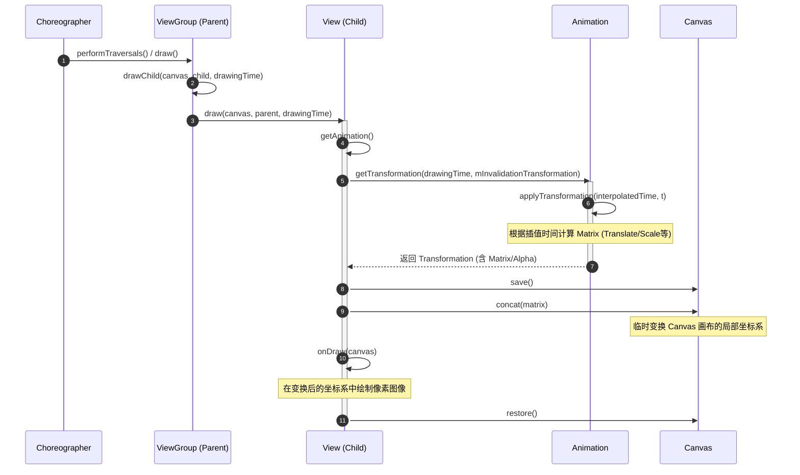

# 5.1.4.3.1 View动画

View 动画（又称**补间动画 / Tween Animation**）是 Android 早期提供的经典动画框架，自 Android 1.0 诞生之初便被广泛用于实现视图的平滑视觉过渡。它位于 `android.view.animation` 包中，主要通过在重绘过程中对 Canvas（画布）进行矩阵变换来改变视图的视觉展现。

由于其实现机制只在视图渲染阶段临时应用变换，而不修改 View 自身的物理属性，这引出了 Android 开发中著名的经典缺陷——“View 动画播放后点击区域仍在原地”。在 Android 3.0（API 11）引入属性动画（参见 [5.1.4.3.2 属性动画](5.1.4.3.2.属性动画.md)）后，补间动画在复杂的交互界面中逐渐退居幕后，但在 Activity 切换转场、简单的加载等待旋转、或者无点击交互的纯视觉渐变场景中，因其使用简单且系统开销较小，依然扮演着不可或缺的角色。

---

## 一、 四大补间动画类型与基本定义详解

补间动画的核心思想是：开发者只需指定动画的开始状态和结束状态，系统会利用插值器（Interpolator）在指定的持续时间（Duration）内，根据特定的时间函数，自动计算并填充中间过程的每一帧图像状态（即“补间”）。

在 Android 源码中，所有补间动画均继承自抽象类 `android.view.animation.Animation`。系统提供了四种最基础的补间动画实现：

### 1. AlphaAnimation（透明度动画）
*   **对应 XML 节点**：`<alpha>`
*   **核心机理**：通过改变绘制时的 Alpha（透明度）通道值，让 View 在 0.0（完全透明）到 1.0（完全不透明）之间平滑过渡。
*   **关键配置属性**：
    *   `android:fromAlpha`：动画起始时的透明度值（0.0 ~ 1.0）。
    *   `android:toAlpha`：动画结束时的透明度值（0.0 ~ 1.0）。

### 2. ScaleAnimation（缩放动画）
*   **对应 XML 节点**：`<scale>`
*   **核心机理**：通过缩放矩阵在横向（X轴）和纵向（Y轴）上对 View 的绘制比例进行调整。
*   **关键配置属性**：
    *   `android:fromXScale` / `android:toXScale`：水平方向的起始与结束缩放倍数（1.0 表示不缩放）。
    *   `android:fromYScale` / `android:toYScale`：垂直方向的起始与结束缩放倍数。
    *   `android:pivotX` / `android:pivotY`：缩放中心轴点的坐标。关于 Pivot 坐标的配置是补间动画适配的关键，系统支持以下三种类型：
        1.  **绝对像素值（Absolute）**：如 `android:pivotX="50"`。这代表缩放中心点在 View 左上角向右偏移 50 像素的位置。在 Java 中对应类型 `Animation.ABSOLUTE`。
        2.  **相对自身百分比（Relative to self）**：如 `android:pivotX="50%"`。表示缩放中心点在 View 宽度的 $50\%$ 处（即水平中心线）。在 Java 中对应类型 `Animation.RELATIVE_TO_SELF`。
        3.  **相对父容器百分比（Relative to parent）**：如 `android:pivotX="50%p"`。表示缩放中心点在父容器宽度的 $50\%$ 处。在 Java 中对应类型 `Animation.RELATIVE_TO_PARENT`。

### 3. TranslateAnimation（平移动画）
*   **对应 XML 节点**：`<translate>`
*   **核心机理**：控制 View 在 Canvas 坐标系中的水平或垂直偏移量。
*   **关键配置属性**：
    *   `android:fromXDelta` / `android:toXDelta`：水平方向的起始与结束偏移位置。
    *   `android:fromYDelta` / `android:toYDelta`：垂直方向的起始与结束偏移位置。
    *   与 ScaleAnimation 的 Pivot 类似，Delta 偏移值同样支持**绝对数值（如 `100`）**、**百分比（如 `100%`）**以及**父容器百分比（如 `100%p`）**。

### 4. RotateAnimation（旋转动画）
*   **对应 XML 节点**：`<rotate>`
*   **核心机理**：围绕指定的中心轴点（Pivot）对 View 进行角度旋转。
*   **关键配置属性**：
    *   `android:fromDegrees`：动画起始的角度（以度为单位）。
    *   `android:toDegrees`：动画结束的角度。正值表示顺时针旋转，负值表示逆时针旋转。
    *   `android:pivotX` / `android:pivotY`：旋转中心轴点的坐标，其类型设定和物理意义与 ScaleAnimation 缩放中心完全一致。

### 5. 补间动画的共享通用属性
这四种动画以及将它们组合在一起的 `AnimationSet`（对应 XML 节点 `<set>`）都继承了以下通用属性：
*   `android:duration`：动画执行 the 持续时间，单位为毫秒（ms）。
*   `android:fillAfter`：当设置为 `true` 时，动画结束后，View 会保持在动画的最后一帧状态。
*   `android:fillBefore`：当设置为 `true` 时，动画结束后，View 会还原到动画的初始帧状态（默认为 `true`）。
*   `android:fillEnabled`：当设置为 `true` 时，`fillBefore` 的设定才会生效；若为 `false`，则动画结束时视图会强制还原到初始状态，不论 `fillAfter` 是否为 `true`。这是许多开发者遇到“动画无法保留结束状态”时的隐藏原因。
*   `android:startOffset`：动画延迟启动的时间，单位为毫秒（ms）。常用于 `AnimationSet` 中实现子动画的排队播放。
*   `android:interpolator`：插值器，用于控制动画变化的速度节奏（例如加速、减速或匀速）。常见插值器包括 `@android:anim/linear_interpolator`（匀速）和 `@android:anim/accelerate_decelerate_interpolator`（加速减速）等。
*   `android:repeatCount`：动画重复执行的次数。设为 `infinite` 时代表无限循环播放。
*   `android:repeatMode`：重复播放的模式，可设为 `restart`（从头开始）或 `reverse`（反向播放）。

### 6. XML 解析与中心轴点转换机理
当我们在 XML 中定义上述动画时，Android 底层是通过 `Animation.Description` 类来解析带有符号的字符串数值（如 `50%` 或 `50%p`）的。其核心逻辑可概述为以下解析流程：
1.  如果字符串以 `%p` 结尾，系统判定其类型为 `RELATIVE_TO_PARENT`，其数值通过 `Float.parseFloat()` 解析后除以 $100$ 作为系数。
2.  如果字符串以 `%` 结尾但没有 `p`，判定类型为 `RELATIVE_TO_SELF`，同样除以 $100$ 作为自身系数。
3.  如果仅是普通数字，判定类型为 `ABSOLUTE`，直接作为像素绝对值处理。

在动画即将开始执行的 `initialize()` 阶段，系统会根据 View 自身的宽高及父容器的宽高，通过 `resolveSize()` 方法将百分比转换为绝对物理坐标下的像素位置：
```java
protected float resolveSize(int type, float value, int size, int parentSize) {
    switch (type) {
        case ABSOLUTE:
            return value;
        case RELATIVE_TO_SELF:
            return size * value;
        case RELATIVE_TO_PARENT:
            return parentSize * value;
        default:
            return value;
    }
}
```
通过这种转换，动画在执行时即可获取精确的 Pivot 像素坐标（如旋转中心），这保证了复杂屏幕分辨率下的完美适配。

---

## 二、 补间动画的仿射变换与 `getTransformation()` 底层原理

补间动画之所以能够实现各种平滑的几何变形，其底层完全基于计算机图形学中的**仿射变换（Affine Transformation）**以及 **3x3 变换矩阵（Matrix）**。

### 1. 仿射变换的数学基础与 Transformation
在 2D 平面图形学中，任何平移、旋转、缩放、错切（Skew）等几何变换，都可以用一个 3x3 的矩阵来表示。对于 View 上的任意像素点 $P(x, y)$，通过与 3x3 仿射矩阵 $M$ 相乘，可以映射得到变换后的新坐标点 $P'(x', y')$：

$$
\begin{bmatrix} x' \\ y' \\ 1 \end{bmatrix} =
\begin{bmatrix}
MSCALE\_X & MSKEW\_X & MTRANS\_X \\
MSKEW\_Y & MSCALE\_Y & MTRANS\_Y \\
MPERSP\_0 & MPERSP\_1 & MPERSP\_2
\end{bmatrix}
\begin{bmatrix} x \\ y \\ 1 \end{bmatrix}
$$

在二维图像变换中，矩阵的第三行通常固定为 `[0, 0, 1]`。通过调整矩阵中的不同元素，系统能够精细地控制像素点的变换行为：
*   **平移（Translation）**：修改 `MTRANS_X` 和 `MTRANS_Y` 对应的值。
*   **缩放（Scale）**：修改 `MSCALE_X` 和 `MSCALE_Y` 对应的值。
*   **旋转（Rotation）**：通过结合 $\sin\theta$ 与 $\cos\theta$ 修改 `MSCALE` 与 `MSKEW` 元素值。

在 Android 源码中，`android.view.animation.Transformation` 是承载仿射变换数据的核心实体类。它主要封装了两个关键属性：
```java
public class Transformation {
    protected Matrix mMatrix; // 3x3几何变换矩阵
    protected float mAlpha;    // 透明度通道值 (0.0f ~ 1.0f)
    protected int mTransformationType; // 变换类型，如 TYPE_ALPHA, TYPE_MATRIX 或 TYPE_BOTH
    // ...
}
```

### 2. 核心驱动方法 `Animation.getTransformation()` 源码剖析
每一帧动画的计算与渲染，都是通过调用 `Animation.getTransformation(long currentTime, Transformation outTransformation)` 来驱动的。以下是该方法的精简版核心逻辑源码：

```java
public boolean getTransformation(long currentTime, Transformation outTransformation) {
    // 1. 初始化动画开始时间
    if (mStartTime == -1) {
        mStartTime = currentTime;
    }

    // 2. 获取动画延迟与持续时间
    final long startOffset = getStartOffset();
    final long duration = mDuration;
    float normalizedTime;

    // 3. 计算当前的动画时间进度比例 (0.0 ~ 1.0)
    if (duration != 0) {
        normalizedTime = ((float) (currentTime - (mStartTime + startOffset))) / (float) duration;
    } else {
        // duration 为 0 时，若当前时间已超过开始时间则直接设为 1.0
        normalizedTime = currentTime < mStartTime ? 0.0f : 1.0f;
    }

    // 判断动画是否结束
    final boolean expired = normalizedTime >= 1.0f;
    mEnded = expired;

    // 限制时间范围在 [0.0, 1.0]
    if ((normalizedTime >= 0.0f || mFillBefore) && (normalizedTime <= 1.0f || mFillAfter)) {
        normalizedTime = Math.max(Math.min(normalizedTime, 1.0f), 0.0f);

        // 4. 将时间比例传入插值器，映射成转换进度 (interpolatedTime)
        final float interpolatedTime = mInterpolator.getInterpolation(normalizedTime);

        // 5. 调用虚方法 applyTransformation 应用具体的仿射变换
        applyTransformation(interpolatedTime, outTransformation);
    }

    // 如果动画尚未超时，或者属于无限循环动画，返回 true，代表动画仍在运行，需要下一帧继续重绘
    return !expired || isMore();
}
```

在 `getTransformation()` 方法中，首先根据当前的绝对时间 `currentTime` 减去动画的起始时间 `mStartTime`，计算出已播放时间的归一化比例 `normalizedTime`。接着，将该比例传入 `Interpolator` 进行非线性映射，得到 `interpolatedTime`。

最后，该方法调用虚方法 `applyTransformation(float interpolatedTime, Transformation t)`。不同的动画子类通过重写此方法来计算具体的矩阵或透明度。例如，`TranslateAnimation` 的实现逻辑如下：

```java
@Override
protected void applyTransformation(float interpolatedTime, Transformation t) {
    float dx = mFromXDelta;
    float dy = mFromYDelta;
    // 根据当前插值进度计算平移偏移量
    if (mFromXDelta != mToXDelta) {
        dx = mFromXDelta + ((mToXDelta - mFromXDelta) * interpolatedTime);
    }
    if (mFromYDelta != mToYDelta) {
        dy = mFromYDelta + ((mToYDelta - mFromYDelta) * interpolatedTime);
    }
    // 将计算出的平移向量写入 Transformation 的 Matrix 中
    t.getMatrix().setTranslate(dx, dy);
}
```

### 3. 图形学变换中心点（Pivot）的数学转换
当在 `ScaleAnimation` 或 `RotateAnimation` 中引入非原点（即 Pivot 坐标不为 $(0,0)$）的缩放或旋转时，图形学的标准处理方法并非直接乘以简单的缩放/旋转矩阵。因为简单的变换默认以坐标系原点为核心。
为了实现绕特定中心点 $P_{pivot}(x_{p}, y_{p})$ 的变换，需要执行三步级联矩阵相乘运算：
1.  **平移坐标系**：将坐标原点移到 Pivot 点，即平移变换 $T(-x_{p}, -y_{p})$；
2.  **执行变换**：执行以原点为中心的缩放或旋转变换 $R(\theta)$ 或 $S(s_{x}, s_{y})$；
3.  **还原原点**：将坐标系平移回最初的位置，即平移变换 $T(x_{p}, y_{p})$。

其最终的级联矩阵形式为：

$$
M_{final} = T(x_{p}, y_{p}) \times R(\theta) \times T(-x_{p}, -y_{p})
$$

在 `ScaleAnimation.applyTransformation` 中，其源码逻辑正是依据这一图形学原理实现的：
```java
@Override
protected void applyTransformation(float interpolatedTime, Transformation t) {
    float sx = 1.0f;
    float sy = 1.0f;
    // 计算当前的缩放比例
    if (mFromXScale != mToXScale) {
        sx = mFromXScale + ((mToXScale - mFromXScale) * interpolatedTime);
    }
    if (mFromYScale != mToYScale) {
        sy = mFromYScale + ((mToYScale - mFromYScale) * interpolatedTime);
    }

    if (mPivotX == 0.0f && mPivotY == 0.0f) {
        t.getMatrix().setScale(sx, sy);
    } else {
        // 利用平移矩阵与缩放矩阵的乘法，实现绕中心轴缩放
        t.getMatrix().setScale(sx, sy, mPivotX, mPivotY);
    }
}
```
`Matrix.setScale(sx, sy, px, py)` 底层正是封装了 $T(px, py) \cdot S(sx, sy) \cdot T(-px, -py)$ 级联乘法，从而避免了图像直接缩放到左上角边缘。

### 4. 插值器（Interpolator）的数学解析与节奏驱动
时间转换进度 `interpolatedTime` 的大小取决于插值器的数学计算。插值器的本质是一个数学映射函数，输入为归一化时间 $t \in [0, 1]$，输出为插值进度 $f(t)$。几种经典的插值器函数如下：
*   **LinearInterpolator（匀速）**：
    $$f(t) = t$$
*   **AccelerateInterpolator（单向加速）**：
    $$f(t) = t^{2}$$（或更高次方，取决于 `factor` 系数）
*   **DecelerateInterpolator（单向减速）**：
    $$f(t) = 1 - (1 - t)^{2}$$
*   **AccelerateDecelerateInterpolator（前半段加速，后半段减速）**：
    $$f(t) = \frac{\cos((t + 1)\pi) + 1}{2}$$

正是因为这些非线性时间转换函数的过滤，`applyTransformation` 接收到的 `interpolatedTime` 并非均匀递增，进而在视觉上产生了弹跳、阻尼、阻尼回弹等各种节奏的视觉质感。

---

## 三、 经典缺陷分析：为什么 View 动画无法改变真实点击区域？

在 Android 实际开发中，View 动画有一个非常经典的 Bug：**如果对一个 Button 应用平移动画，当 Button 移动到新位置时，点击新位置是无法触发 Click 事件的，只有点击原来的物理位置才能响应。**

要彻底理解这一现象的本质，必须深入剖析底层重绘流程（绘制视图时的 Canvas 矩阵变换）与事件分发体系的底层源码冲突。

### 1. 渲染原理：`ViewGroup.drawChild()` 阶段的矩阵级联（Concat）
在视图重绘阶段，父容器 ViewGroup 负责组织子视图的绘制工作。整个变换流程通过以下时序进行：



在父容器遍历子视图进行绘制时，会调用到 `ViewGroup.drawChild(Canvas canvas, View child, long drawingTime)`。该方法内部会调用 `child.draw(canvas, this, drawingTime)`。

在三参数的 `View.draw(Canvas canvas, ViewGroup parent, long drawingTime)` 方法中，包含一段处理补间动画的关键逻辑：

```java
boolean draw(Canvas canvas, ViewGroup parent, long drawingTime) {
    // 获取当前 View 上绑定的 Animation
    final Animation a = getAnimation();
    if (a != null) {
        // 从父容器中取出一个临时的 Transformation 结构体
        final Transformation t = parent.mInvalidationTransformation;
        // 计算当前帧的变换数据，并写入 t 中
        boolean more = a.getTransformation(drawingTime, t);
        
        if (more) {
            // 如果动画未完，调用 parent.invalidate() 以保证下一帧继续触发重绘
            parent.invalidate(left, top, right, bottom);
        }

        // 获取当前帧算出的仿射变换矩阵
        final Matrix matrix = t.getMatrix();
        
        // 关键绘制步骤：将 Matrix 作用到 Canvas 上
        int restoreTo = canvas.save(); // 保存当前 Canvas 状态
        canvas.concat(matrix);         // 将临时计算出的动画 Matrix 叠加到 Canvas 局部坐标系中
        
        // 执行常规绘制流程，子 View 在变换后的坐标系中渲染像素
        child.onDraw(canvas);
        
        canvas.restoreToCount(restoreTo); // 恢复 Canvas 状态
    } else {
        // 无动画时的正常绘制
        child.onDraw(canvas);
    }
}
```

通过源码分析可知，View 动画所产生的变换矩阵 `Matrix` 只是在 `draw` 阶段通过 `canvas.concat(matrix)` 临时应用于 Canvas。这直接修改了**绘图画布的局部坐标系**。其结果是，虽然子 View 绘制出来的像素图形（视觉呈现）在屏幕上发生了偏移或缩放，但这纯粹是**视觉层面**的投影变换。

#### 硬件加速（Hardware Acceleration）场景下的机制表现
在 Android 3.0 之后系统默认开启了硬件加速。在硬件加速架构中，View 绘制由原本的软件画布 Canvas 操作，升级为使用 `DisplayList` 进行指令录制。
当 View 绑定有 View 动画时，底层仍然不会直接修改 View 的几何属性，而是将计算好的 `Transformation` 中的 `Matrix` 通过底层接口注入到当前视图的 `RenderNode` 中（即通过 Native 层的 `RenderNode.setAnimationMatrix(matrix)` 传递）。
在最终将渲染指令发送给 GPU 栅格化时，该矩阵仅作用于 GPU 的顶点着色器（Vertex Shader），改变渲染网格在屏幕像素上的物理映射位置。这种变换仍然局限在**渲染管道的叶子节点**中，对 Java 层的组件物理结构是完全透明且不可见的。

### 2. 物理定位与事件分发检测的脱节
与视觉上的天马行空相反，View 真实的物理属性（如位置和大小）是由其成员变量 `mLeft`、`mTop`、`mRight`、`mBottom` 决定的。
*   这四个物理边界值是在布局生命周期的 **Layout 阶段** 由父容器根据测量结果计算出来的，一旦确定便固化在内存中。
*   在 View 动画运行 the 整个生命周期里，没有任何代码去修改 View 自身的 `mLeft` 等物理位置属性。因此，**在系统的物理视图树结构中，View 的物理包围盒（Bounding Box）依然静止在原地**。

当用户的手指触摸屏幕时，事件分发系统开始工作。在 `ViewGroup.dispatchTouchEvent()` 中，父容器需要遍历所有的子 View，找出哪一个子 View 能够接收这个点击事件。其判定碰撞的核心逻辑如下：

```java
// 简化后的 ViewGroup 事件分发核心逻辑
public boolean dispatchTouchEvent(MotionEvent ev) {
    final float x = ev.getX();
    final float y = ev.getY();
    final int childrenCount = mChildrenCount;
    final View[] children = mChildren;

    for (int i = childrenCount - 1; i >= 0; i--) {
        final View child = children[i];
        
        // 关键点：检测触摸点 (x, y) 是否落在子 View 的物理区域内
        if (isTransformedTouchPointInView(x, y, child, null)) {
            // 分发事件给命中的子 View
            if (dispatchTransformedTouchEvent(ev, false, child, idBitsToAssign)) {
                return true;
            }
        }
    }
    return false;
}
```

而在 `isTransformedTouchPointInView()` 内部判断坐标范围时，系统主要依赖子 View 的物理坐标界限进行碰撞检测：

```java
protected boolean isTransformedTouchPointInView(float x, float y, View child, PointF outLocalPoint) {
    // 主要是通过 child.mLeft, mTop, mRight, mBottom 计算的矩形范围判定点击是否落入
    final float[] point = tempPoint;
    point[0] = x;
    point[1] = y;
    
    // 逆映射坐标（此处只会考虑 3.0+ 属性动画带来的 RenderNode 属性矩阵，不会考虑 View 动画的 Matrix）
    transformPointToViewLocal(point, child);
    
    // 进行矩形碰撞碰撞测试
    return child.pointInView(point[0], point[1]); 
}
```

#### 视觉区域与物理区域分离示意图

```mermaid
graph TD
    subgraph 物理空间 (Layout 空间)
        PhysicalView["View 物理边界<br/>(mLeft, mTop, mRight, mBottom)<br/>- 坐标原点: (100, 100)<br/>- 点击事件在此响应"]
    end

    subgraph 视觉空间 (Draw 空间)
        CanvasMatrix["Canvas.concat(Matrix)<br/>平移变换 dx=200, dy=200"] --> VisualView["View 渲染像素<br/>- 视觉呈现在: (300, 300)<br/>- 仅是像素绘制偏离"]
    end

    TouchEvent["用户手指触摸点 (300, 300)"]
    TouchEvent -->|ViewGroup分发事件| Check["碰撞检测: 点是否在物理边界内?"]
    Check -->|否: (300,300) 不在 (100,100) 范围内| Miss["事件未命中 (点击无效)"]

    TouchEvent2["用户手指触摸点 (100, 100)"]
    TouchEvent2 -->|ViewGroup分发事件| Check2["碰撞检测: 点是否在物理边界内?"]
    Check2 -->|是: (100,100) 落在物理边界内| Hit["事件命中 (点击响应)"]
```

在判断点击点坐标时，系统获取的是 `child.mLeft`、`child.mTop` 等值。因为 View 动画计算出的临时变换矩阵只用于 Canvas 绘制，并未更新到 View 本身的属性中。所以在事件分发时，当用户点击位于动画终点（如偏移后的位置）的视觉按钮时，碰撞检测无法通过，点击事件被判定为“未命中”；而点击空无一物的原位置时，反而因为物理边界在该处而触发了点击事件。

### 3. 属性动画是如何解决此问题的？
在 Android 3.0（API 11，参见 [Android Version Change Log](../../../../../../AndroidVersionChangeLog.md#android-3xapi-11-12-13)）中，系统重构了动画框架，引入了属性动画。在属性动画中：
1.  动画会直接通过反射或 Setter 方法改变 View 对象的真实成员变量（如 `translationX`、`translationY`、`scaleX` 等），这些属性与底层的物理渲染节点（`RenderNode` / `DisplayList`）强绑定。
2.  在事件分发阶段，`transformPointToViewLocal()` 方法会被调用。该方法内部会去获取 View 对应的属性矩阵或 RenderNode 变换矩阵，并计算出它的**逆矩阵（Inverse Matrix）**。
3.  系统利用该逆矩阵将手指触摸的屏幕绝对坐标，逆向映射转换回 View 变换后的局部坐标系中，然后再进行碰撞检测。这就从根本上解决了“点击区域与视觉画面脱节”的经典问题。

---

## 四、 `AnimationListener` 内存泄漏风险与防范

在持久持有 View 的场景下（例如长生命周期的控制器、常驻后台服务的 View 引用，或是被 Activity 持有的常驻动画 View），使用 `AnimationListener` 极其容易引入**内存泄漏（Memory Leak）**风险。

### 1. 内存泄漏产生的根本原因
当我们为动画设置监听器时：
```java
animation.setAnimationListener(new Animation.AnimationListener() {
    @Override
    public void onAnimationStart(Animation animation) {}
    @Override
    public void onAnimationEnd(Animation animation) {
        // 经常需要在此更新 UI 控件或执行页面跳转
        mTextView.setText("Finished");
    }
    @Override
    public void onAnimationRepeat(Animation animation) {}
});
```

这背后会建立起一条复杂的强引用链条：

1.  **匿名内部类隐式持有外部类引用**：在 Java/Kotlin 中，非静态内部类（包括匿名内部类）在编译后都会隐式持有一个指向外部类（通常是 Activity 或 Fragment）的强引用（即 `this$0`）。
2.  **动画对象强引用监听器**：`Animation` 内部声明了成员变量 `mListener`，当调用 `setAnimationListener` 时，该成员变量会强引用上述匿名内部类对象。
3.  **视图对象强引用动画对象**：一旦通过 `view.startAnimation(animation)` 启动动画，View 就会通过 `mCurrentAnimation` 属性持有 `Animation` 对象的引用。
4.  **Choreographer/Window 引用 View 树**：只要动画仍在运行（或处于循环状态），系统绘制回调机制（通过 `Choreographer` 安排下一帧重绘）就会强引用该 View 树。

**强引用链模型**：
$$\text{Choreographer} \rightarrow \text{View} \rightarrow \text{Animation} \rightarrow \text{AnimationListener (匿名内部类)} \rightarrow \text{Activity / Fragment}$$

在现代 Android 开发中，如果结合使用 Jetpack Lifecycle 库（如 `lifecycleScope.launch`）或 Kotlin 协程进行异步操作，强引用链条可能会变得更加隐蔽和复杂。例如，如果在协程内间接持有了正在执行补间动画的 View，或在其监听器中包含了挂起函数（Suspending Functions），一旦协程没有随着宿主的销毁而被妥善取消，协程上下文（CoroutineContext）所组成的 Job 链条将继续在内存中挂载该监听器和 View 树，从而将内存泄漏的生命周期周期无限拉长。这种在异步任务与传统动画回调机制混用时的深层隐患，是大型商业项目排障时的难点。

如果用户在此期间按返回键退出了 Activity，由于动画仍在执行（例如设置了 `INFINITE` 循环播放的 Loading 动画），或者由于 View 没有被及时从 Window 中移除、没有显式取消动画，导致这条强引用链依旧牢固存活。垃圾回收器（GC）在追踪可达性时，会判定整个 Activity/Fragment 以及它所持有的所有内存资源仍然“可达”，从而导致它们无法被回收，发生严重的内存泄漏。

---

## 五、 安全防范最佳实践与通用模板

为了彻底规避 `AnimationListener` 带来的内存泄漏问题，开发者需要从“及时断开引用链”与“避免强引用外部类”两个维度进行安全防护。

### 1. 规范的生命周期清理动作
最直接也是最有效的手段：**在宿主（Activity/Fragment/Custom View）销毁的生命周期回调中，必须显式取消动画，并将 View 上的动画相关持有彻底清空**。

```java
// 宿主销毁时的清理模板 (如 Activity 的 onDestroy 或 Fragment 的 onDestroyView)
@Override
protected void onDestroy() {
    super.onDestroy();
    if (mAnimationView != null) {
        // 1. 停止动画运行，这会触发将动画从系统的 Choreographer 重绘队列中移除
        mAnimationView.clearAnimation();
    }
    if (mTranslateAnimation != null) {
        // 2. 显式置空 Animation 内部持有的监听器，切断强引用链条
        mTranslateAnimation.setAnimationListener(null);
        mTranslateAnimation.cancel();
        mTranslateAnimation = null;
    }
}
```

### 2. 静态内部类 + 弱引用防范模板
为了从根本上避免匿名内部类隐式持有宿主的问题，可以使用静态内部类（Static Inner Class）来继承 `AnimationListener`（在 Kotlin 中，默认的内部类就是静态的，除非声明了 `inner` 关键字），并通过**弱引用（WeakReference）**来安全地访问宿主中的 View 或组件。

以下是高度安全的 Java 和 Kotlin 版本的 `SafeAnimationListener` 防范模板：

#### Java 安全模板
```java
import android.view.View;
import android.view.animation.Animation;
import java.lang.ref.WeakReference;

public class SafeAnimationListener implements Animation.AnimationListener {
    
    // 使用弱引用持有需要更新的宿主 View，防止阻止垃圾回收
    private final WeakReference<View> mViewRef;
    private final WeakReference<OnAnimationCallback> mCallbackRef;

    // 回调接口，用于解耦具体业务逻辑
    public interface OnAnimationCallback {
        void onAnimStart(View view);
        void onAnimEnd(View view);
    }

    public SafeAnimationListener(View targetView, OnAnimationCallback callback) {
        this.mViewRef = new WeakReference<>(targetView);
        this.mCallbackRef = new WeakReference<>(callback);
    }

    @Override
    public void onAnimationStart(Animation animation) {
        View view = mViewRef.get();
        OnAnimationCallback callback = mCallbackRef.get();
        if (view != null && callback != null) {
            callback.onAnimStart(view);
        }
    }

    @Override
    public void onAnimationEnd(Animation animation) {
        View view = mViewRef.get();
        OnAnimationCallback callback = mCallbackRef.get();
        if (view != null && callback != null) {
            callback.onAnimEnd(view);
        }
    }

    @Override
    public void onAnimationRepeat(Animation animation) {
        // 按需实现
    }
}
```

#### Kotlin 安全模板
```kotlin
import android.view.View
import android.view.animation.Animation
import java.lang.ref.WeakReference

/**
 * 伴生或独立声明的 SafeAnimationListener。
 * Kotlin 中非 inner class 默认即为静态内部类，不会持有外部类的隐式引用。
 */
class SafeAnimationListener(
    targetView: View,
    callback: OnAnimationCallback
) : Animation.AnimationListener {

    private val viewRef = WeakReference(targetView)
    private val callbackRef = WeakReference(callback)

    interface OnAnimationCallback {
        fun onAnimStart(view: View)
        fun onAnimEnd(view: View)
    }

    override fun onAnimationStart(animation: Animation?) {
        val view = viewRef.get()
        val callback = callbackRef.get()
        if (view != null && callback != null) {
            callback.onAnimStart(view)
        }
    }

    override fun onAnimationEnd(animation: Animation?) {
        val view = viewRef.get()
        val callback = callbackRef.get()
        if (view != null && callback != null) {
            callback.onAnimEnd(view)
        }
    }

    override fun onAnimationRepeat(animation: Animation?) {
        // 按需实现
    }
}
```

#### 安全模板的使用姿势
```kotlin
// 在 Activity/Fragment 中的具体使用示例
val animCallback = object : SafeAnimationListener.OnAnimationCallback {
    override fun onAnimStart(view: View) {
        // 安全地处理动画开始逻辑
    }

    override fun onAnimEnd(view: View) {
        // 安全地处理动画结束逻辑，例如更新文本
        mTextView?.text = "Animation Ended Successfully"
    }
}

// 绑定安全监听器，即使 Activity 被销毁，该监听器亦不会导致 Activity 发生内存泄漏
val safeListener = SafeAnimationListener(mTextView, animCallback)
myAnimation.setAnimationListener(safeListener)
mTextView.startAnimation(myAnimation)
```

通过这套机制，即使动画由于系统调度延迟或未及时 cancel，在其强引用链条中，由于使用的是 `WeakReference`，GC 可以在 Activity 销毁后无障碍地对其进行垃圾回收。而当下一次动画触发时，弱引用中持有的 View 与 Callback 回收后返回 `null`，回调逻辑安全地跳过执行，避免了内存泄漏的同时，也杜绝了可能因空指针导致的崩溃风险。
