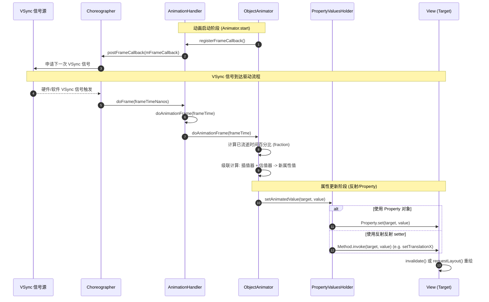

# 5.1.4.3.2 属性动画

## 1. 引言：Android 动画体系演进与属性动画的历史使命

在 Android UI 系统的发展历程中，动画不仅是增强界面流畅度和交互吸引力的视觉工具，更是连接用户操作与系统反馈的重要桥梁。为了满足各种复杂的交互设计，Android 动画系统经历了一次根本性的技术重构。

在早期 Android 系统中，动画主要依赖于传统补间动画（Tween Animation，位于 `android.view.animation` 包中）。补间动画虽然能实现平移、缩放、旋转和透明度等常见特效，但在底层机制上存在着一个致命的“阿喀琉斯之踵”：**它仅在 Canvas（画布）绘制渲染层层面对 View 进行仿射变换，而从未真正改变 View 在内存中的物理属性。** 在补间动画执行过程中，父容器在绘制子 View 时临时修改了 Canvas 矩阵，使得 View 看起来移动到了新位置。然而，代表 View 真实物理边界的布局字段（如 `mLeft`、`mTop`、`mRight`、`mBottom`）以及事件响应区域，依然死死地钉在动画开始前的初始位置。这直接导致了在复杂交互场景下，动画结束后用户点击屏幕新位置无法触发 View 的点击事件，反而点击原地变空的区域却能触发的怪异现象。

此外，补间动画的作用目标被严格限制在 `View` 及其子类上。一旦开发者需要对非 View 对象的某种自定义属性（例如游戏引擎中自定义图形的圆心半径 `radius`，或某个物理刚体运动中的加速度等数值）进行平滑过渡计算，补间动画就无能为力了。

为了彻底解决补间动画在“视觉表现”与“触控物理”上的割裂，Android 团队于 Android 3.0 (API 11) 版本中正式推出了**属性动画系统（Property Animation）**（关于这一历史版本的发布与演进细节，可参见 [Android 版本变更日志](../../../../../../AndroidVersionChangeLog.md#android-30-api-11-honeycomb)）。属性动画的设计哲学是：**在设定的动画时长内，实打实地改变目标对象的任意内存属性值，并且在每一帧数值发生变更时，自动触发重绘以保证视觉效果与物理属性的一致性**。它的引入，彻底消成了点击区域与视觉图像不一致的痛点，为 Android 高质量、高交互性的现代化 UI 奠定了坚实的技术基石。

---

## 2. 核心架构：ValueAnimator 与 ObjectAnimator 的分工与融合

属性动画体系的架构设计精妙，既提供了高度抽象、开箱即用的声明式接口，又保留了灵活的、可针对任意数值进行插值计算的底层引擎。其最核心的两个类是 `ValueAnimator` 与 `ObjectAnimator`。

```
                    ┌───────────────────┐
                    │     Animator      │ (抽象基类，定义通用控制与监听)
                    └─────────┬─────────┘
                              │
                    ┌─────────▼─────────┐
                    │   ValueAnimator   │ (核心数值生成引擎，管理时序与计算)
                    └─────────┬─────────┘
                              │
                    ┌─────────▼─────────┐
                    │  ObjectAnimator   │ (针对目标属性封装，自动触发反射/Property)
                    └───────────────────┘
```

### 2.1 ValueAnimator：数值计算的底层引擎
`ValueAnimator` 是整个属性动画体系的心脏。它本身并不直接与任何 UI 控件或具体的对象属性绑定，甚至不需要知道任何 View 的存在。它唯一的职责是在设定的动画时间段（`duration`）内，依据时间的自然流逝，生成一段平滑、连续且符合特定物理规律的数值流。

`ValueAnimator` 内部通过与主线程 `Looper` 绑定的时钟源驱动，核心工作流程如下：
1. **计时追踪**：在每次屏幕刷新信号（VSync）到来时，计算出当前动画已经播放的时间占总时长的比例，称为原始时间进度比率（Fraction）。
2. **节奏转换**：将 Fraction 输入给时间插值器（`TimeInterpolator`），由其计算并输出一个“动画阶段完成度”（Interpolated Fraction）。
3. **值域计算**：将该完成度输入给类型估值器（`TypeEvaluator`），在开发者设定的起始值（startValue）与结束值（endValue）之间计算出这一帧精确的过渡数值。
4. **派发回调**：通过注册的 `AnimatorUpdateListener` 监听器，将这一帧计算出的最新数值回调给开发者，由开发者在回调方法内部手动执行后续的属性更新逻辑。

由于 `ValueAnimator` 与具体的宿主解耦，它成为了一个通用的“数学计算引擎”，可以对任何类型的值（如浮点数、整数、自定义的对象坐标等）执行动画计算。

### 2.2 ObjectAnimator：属性绑定的声明式封装
`ObjectAnimator` 继承自 `ValueAnimator`。它是为了消除手动编写 `AnimatorUpdateListener` 的繁琐性而设计的实用封装类。

在实际开发中，我们通常需要对某个具体的 UI 视图进行属性修改（例如改变一个按钮的透明度）。`ObjectAnimator` 允许开发者在构造时直接传入目标对象（`Target`，通常是一个 `View`）以及表示属性名称的字符串（`propertyName`，如 `"alpha"`、`"translationX"`）。

在每一帧计算出新的数值后，`ObjectAnimator` 会自动执行以下逻辑：
1. 取得当前帧的估值结果。
2. 利用 Java 反射机制（Reflection）或者预先定义好的 `Property` 接口对象，动态查找并调用目标对象 `Target` 上的 `set<PropertyName>()` 方法（例如对于 `"alpha"` 属性，它会寻找并调用 `setAlpha(float)` 方法），将计算好的数值自动应用 to 目标对象上。

### 2.3 两者的区别与联系
- **本质联系**：`ObjectAnimator` 是 `ValueAnimator` 的子类。它们底层的计时时钟、插值器计算、类型估值器数学模型完全一致。`ObjectAnimator` 的底层依然是靠 `ValueAnimator` 来驱动的。
- **职责分工**：`ValueAnimator` 专注于数值的数学计算与节奏把控，保持了绝对的通用性；`ObjectAnimator` 则在 `ValueAnimator` 的基础上，增加了“反射注入”和“属性绑定”的职责，简化了日常 UI 开发的工作流。
- **使用限制与 Property 优化**：
  - `ObjectAnimator` 的正常工作有一个绝对的前提条件：**目标对象必须提供公开的 `set<PropertyName>` 方法**。如果在调用 `ObjectAnimator.ofFloat()` 时没有传入初始值（只传入了结束值），那么目标对象还必须提供公开的 `get<PropertyName>` 方法，供动画系统在初始化时读取当前状态作为动画起点。
  - 由于早期的 `ObjectAnimator` 极度依赖反射来调用 `set` 和 `get` 方法，这在性能较差的 Android 早期设备上会带来一定的 CPU 开销。为了优化这一性能痛点，Android 后续引入了类型安全的 `Property<T, V>` 类（例如 `View.ALPHA`、`View.TRANSLATION_X`）。当开发者使用带有 `Property` 对象的重载方法构造动画时，底层将避开反射查找，直接调用 `Property.set(target, value)`，这大幅提升了执行速度，并能够在编译期就避免拼写错误带来的安全隐患。

---

## 3. 数学模型：TimeInterpolator 与 TypeEvaluator 的级联转换

属性动画能在每一帧生成流畅度极佳、动感自然的物理数值，其核心秘密在于其底层建立的一套极具严密性的数学变换管道。这个管道通过**时间插值器（TimeInterpolator）**与**类型估值器（TypeEvaluator）**的级联配合来完成。

```mermaid
graph TD
    A[时间流逝百分比 t = elapsedtime / duration] -->|输入值: t ∈ [0, 1]| B(TimeInterpolator 插值器)
    B -->|输出值: f(t) = y ∈ [a, b]| C[插值百分比 y]
    C -->|输入参数: y| D(TypeEvaluator 估值器)
    E[起始值 StartValue] -->|输入参数: Start| D
    F[结束值 EndValue] -->|输入参数: End| D
    D -->|计算公式: g(y, Start, End) = V| G[当前帧的属性计算结果 V]

    style B fill:#f9f,stroke:#333,stroke-width:2px
    style D fill:#bbf,stroke:#333,stroke-width:2px
    style G fill:#bfb,stroke:#333,stroke-width:2px
```

### 3.1 时间插值器（TimeInterpolator）的数学本质
时间插值器的职责是实现“时间流逝速率的非线性变换”。在没有任何插值器干预的情况下，动画随时间是以绝对匀速运行的。为了让动画表现出符合物理世界的加速度、摩擦阻力或弹簧回弹，我们需要对“已流逝时间比率”进行扭曲。

在数学上，`TimeInterpolator` 可以抽象为一个定义在区间 $[0, 1]$ 上的单调或基本单调的实函数 $f(t) = y$，其中：
- **自变量 $t$（即 `input`）**：原始已流逝时间百分比，公式为 $t = \frac{t_{elapsed}}{duration}$。$t \in [0, 1]$，其中 $t_{elapsed}$ 为动画启动到当前帧的已播时间， $duration$ 为动画设定的总时长。
- **因变量 $y$（即返回值）**：变换后的动画完成度比率。$y$ 的取值通常在 $[0, 1]$ 之间，但在特殊插值器（如具有回弹特效的 `AnticipateOvershootInterpolator`）中，其值可以小于 0（向后蓄力）或大于 1（向前超调）。

下面剖析几种最常用 Android 系统插值器的数学解析式：

1. **LinearInterpolator（线性/匀速插值器）**：
   $$f(t) = t$$
   其导数 $f'(t) = 1$ 恒成立，表示物体做完美的匀速直线运动。

2. **AccelerateInterpolator（加速插值器）**：
   $$f(t) = t^{2 \cdot factor}$$
   当 $factor = 1.0$ 时，它是一个二次函数 $f(t) = t^2$。其一阶导数 $f'(t) = 2t$。这表明物体的瞬时运动速度随着时间流逝而线性增大，非常适合用于模拟重力作用下的自由落体运动。

3. **DecelerateInterpolator（减速插值器）**：
   $$f(t) = 1.0 - (1.0 - t)^{2 \cdot factor}$$
   当 $factor = 1.0$ 时，该式展开为 $f(t) = 2t - t^2$。其一阶导数为 $f'(t) = 2 - 2t$。在动画起点 $t=0$ 时，初始瞬时速度达到峰值 $2$；而在动画终点 $t=1$ 时，瞬时速度减至 $0$。这完美模拟了物体在具有摩擦力的物理表面上慢慢滑行至停止的过程。

4. **AccelerateDecelerateInterpolator（加速减速/双向缓冲插值器）**：
   $$f(t) = \frac{\cos((t + 1)\pi) + 1.0}{2}$$
   该插值器利用了余弦函数在 $[\pi, 2\pi]$ 区间内平滑起伏的曲线特性。其一阶导数（瞬时速度）为 $f'(t) = \frac{\pi}{2}\sin((t+1)\pi)$。这使得动画在启动（$t=0$）和停止（$t=1$）时的瞬时速度均为 $0$，在中间点（$t=0.5$）速度达到最大值。它能提供极其顺滑的加减速双重缓冲效果，是 Android 系统默认的属性动画插值器。

### 3.2 类型估值器（TypeEvaluator）的数学本质
类型估值器的职责是“将无量纲的百分比参数转换为对应数据类型的具体物理状态值”。它接收时间插值器输出的虚拟进度 $y$，并在开发者指定的初始值（StartValue，记作 $S$）与结束值（EndValue，记作 $E$）之间进行值域空间的投影映射。

其数学公式可表示为一个多维或一维的映射函数 $g(y, S, E) = V$，其中 $V$ 为当前帧输出的物理属性值。

1. **FloatEvaluator（浮点数估值器）**：
   对于基础的浮点型动画，其数学模型为一维线性插值（Linear Interpolation，简称 Lerp）：
   $$V = S + y \cdot (E - S)$$
   当 $y=0$ 时， $V=S$；当 $y=1$ 时， $V=E$。它在起止状态之间架起了一条直线通道。

2. **IntEvaluator（整型估值器）**：
   其公式与浮点数极其类似，但由于整型的离散特性，必须对计算结果进行取整截断：
   $$V = \lfloor S + y \cdot (E - S) \rfloor$$

3. **ArgbEvaluator（颜色渐变估值器）**：
   颜色在 Android 中以 32 位整型（Int，格式为 `0xAARRGGBB`）存储，格式为 `0xAARRGGBB`。不能直接用上面的线性插值公式对整型进行计算，否则会导致颜色分量混合混乱。
   `ArgbEvaluator` 的数学逻辑是对这四个通道分别拆解成浮点数，执行独立的 Lerp 计算，最后重新打包：
   - 提取分量：
     $$A_s = (S \gg 24) \land 0xFF, \quad R_s = (S \gg 16) \land 0xFF, \quad G_s = (S \gg 8) \land 0xFF, \quad B_s = S \land 0xFF$$
     $$A_e = (E \gg 24) \land 0xFF, \quad R_e = (E \gg 16) \land 0xFF, \quad G_e = (E \gg 8) \land 0xFF, \quad B_e = E \land 0xFF$$
   - 各通道独立插值：
     $$A_{curr} = A_s + y \cdot (A_e - A_s)$$
     $$R_{curr} = R_s + y \cdot (R_e - R_s)$$
     $$G_{curr} = G_s + y \cdot (G_e - G_s)$$
     $$B_{curr} = B_s + y \cdot (B_e - B_s)$$
   - 合并封装为 32 位整型：
     $$V = (\text{Int}(A_{curr}) \ll 24) \mid (\text{Int}(R_{curr}) \ll 16) \mid (\text{Int}(G_{curr}) \ll 8) \mid \text{Int}(B_{curr})$$
   这种将颜色空间转换到独立仿射通道的做法，保证了色彩过渡的柔和与自然。

### 3.3 级联计算公式与流转机制
属性动画在运行时的计算，本质上是一个**复合函数级联**的数据流转管道。给定任何一个时刻的已播放时间占比 $t$，最终渲染输出的属性值 $V(t)$ 遵循以下级联计算公式：
$$V(t) = g\big(f(t),\, S,\, E\big) = S + Interpolator\Big(\frac{t_{elapsed}}{duration}\Big) \cdot (E - S)$$
这套数学公式在每一次屏幕刷新信号触发时都在主线程中高速运转，确保了每一次微小的屏幕更新都能映射出完美的物理形态。

---

## 4. 底层大动脉：Choreographer VSync 驱动机制与属性变更全链路

属性动画能以 60 帧或更高帧率（如 90Hz、120Hz 刷新率设备）实现平滑更新，绝非仅仅依靠简单的 Java/Kotlin 线程定时循环。其底层是紧紧依托 Android 系统的心脏时钟——**Choreographer（编舞者）**与系统底层的 **VSync（垂直同步）信号** 来协同驱动的。

### 4.1 全链路运作时序图

下面的时序图详细描述了从动画启动、向系统注册 VSync 监听，直到 VSync 信号到达驱动属性值计算与注入的完整生命周期：



### 4.2 步骤拆解一：动画注册与 VSync 回调预约
当开发者在主线程调用 `Animator.start()` 时，动画便进入了注册与调度序列：
1. **线程单例接入**：动画实例会立即被注册到 `AnimationHandler` 中。`AnimationHandler` 内部利用 `ThreadLocal` 机制实现了与当前执行线程（主线程）的强制绑定。这意味着在主线程中运行的所有属性动画，最终都由同一个 `AnimationHandler` 进行统一调度与协调。
2. **预约 VSync 同步时钟**：`AnimationHandler` 内部维护着一个类型为 `Choreographer.FrameCallback` 的全局帧回调对象 `mFrameCallback`。一旦有新动画处于活动状态（Active），`AnimationHandler` 就会向 `Choreographer` 投递该回调：
   `Choreographer.getInstance().postFrameCallback(mFrameCallback)`
3. **向系统申请同步信号**：`Choreographer` 收到请求后，会通过底层的 `FrameDisplayEventReceiver` 向显示硬件管理服务（SurfaceFlinger）申请订阅下一次 VSync 信号。此时，整个主线程会挂起动画逻辑，处于静止等待状态，直到下一次硬件刷新中断发生。

### 4.3 步骤拆解二：VSync 信号到达与时间驱动环路
当屏幕刷新的物理时间窗口到达，硬件 VSync 信号触发：
1. **VSync 信号路由**：系统底层通过 Linux Epoll 事件驱动机制以及 JNI 调用，唤醒主线程的 `Looper`，最终回调到 `Choreographer.doFrame(long frameTimeNanos)` 方法。
2. **回调分发优先级**：`Choreographer` 收到 VSync 信号后，会按照极其严格的逻辑顺序处理回调队列：
   - 首先执行 `CALLBACK_INPUT` 队列（确保用户手势操作第一时间被响应，减少触控延迟）。
   - 紧接着执行 `CALLBACK_ANIMATION` 队列。此时，`AnimationHandler` 之前注册的 `mFrameCallback` 会在这一优先级下被调度。
3. **驱动动画步进**：`AnimationHandler.doAnimationFrame(long frameTime)` 在主线程被唤醒执行。它会通过一个死循环，遍历当前注册在列表中的所有活动动画，并依次调用每个动画的 `doAnimationFrame(frameTime)` 方法。
4. **自循环驱动**：如果遍历时发现某些动画尚未播放结束，`AnimationHandler` 会在当前 `doFrame` 方法的尾部，**再次调用 `Choreographer.postFrameCallback(mFrameCallback)`**，预约下一次 VSync 周期。这就像在摆钟底端轻轻一推，让属性动画能够伴随着每次硬件 VSync 信号自动、高频地运转下去。

### 4.4 步骤拆解三：属性值注入与反射性能优化
当 `ObjectAnimator` 在 VSync 回调中完成了这一帧的插值和估值计算后，必须将最终数值注入到目标 View 对象中：
1. **Property 快捷通道**：如果创建动画时传入了显式的 `Property` 对象，`ObjectAnimator` 的底层执行类 `PropertyValuesHolder` 会直接调用 `Property.set(target, value)`，这属于纯静态代码调用，没有任何反射开销。
2. **缓存优化反射通道**：如果开发者使用的是字符串 `propertyName`，则必须通过反射获取 View 类中的 `set<PropertyName>` 方法。
   - 为了防止每秒 60 次以上的反射调用压垮 CPU，`PropertyValuesHolder` 内部设计了一个静态的 `HashMap`（`sSetterPropertyMap`），用作反射方法 `Method` 对象的缓存池。
   - 当动画首帧被调度时，系统通过反射查找出目标 View 的公开 Method，并将其存入缓存 Map 中。
   - 在后续的所有帧刷新中，`PropertyValuesHolder` 直接从 Map 缓存中取出预存的 `Method`，直接执行 `Method.invoke(target, value)`。这极大地规避了 Java 反射在反射搜寻和安全检查方面的耗时开销。

---

## 5. 物理改变的本质：解决点击区域不一致问题

传统补间动画最让人头疼的问题，莫过于动画后点击区域不跟着移动的“精神分裂”现象。属性动画凭借完全不同的物理更新机制，完美地解决了视觉与交互的断层。

### 5.1 补间动画的“视觉障眼法”
补间动画执行平移时，其实质是在子 View 绘制自身之前，临时通过仿射矩阵对 Canvas 进行了坐标转换：
```
                          补间动画的视觉表现 (Canvas 变换)
            ┌───────────────────┐               ┌───────────────────┐
            │   原始 View 本体   │               │   绘制出的虚像     │
            │   (物理点击区域)   │ ------------> │   (无物理点击区域) │
            │   [Left, Top...]  │ (Canvas.concat)│                   │
            └───────────────────┘               └───────────────────┘
```
在此期间，View 对象保存在内存中的真实物理范围（`mLeft`，`mTop` 等）完全没有任何改动。当手指按下屏幕时，Android 的输入系统在分发触摸事件时，只根据 View 在布局树中的真实物理坐标进行包围盒校验，因此触摸动作无法派发给发生了位移的虚像。

### 5.2 属性动画对物理状态的底层篡改
属性动画（如 `ObjectAnimator`）在每一帧调用 `View.setTranslationX(value)` 时，直接修改了 View 自身的内部渲染节点（RenderNode）状态。
在 Android 5.0 (API 21) 及更高版本中（参见 [Android 版本变更日志](../../../../../../AndroidVersionChangeLog.md#android-50-api-21-lollipop)），属性动画对 View 属性的修改直接作用于底层的 RenderNode：
1. **状态更新**：调用 `setTranslationX()` 会直接更新 View 的物理平移参数，或者写入硬件加速渲染对应的 RenderNode 平移矩阵属性中。
2. **自下而上触发重绘**：调用 `invalidateViewProperty(true, false)` 通知 ViewRootImpl 重新安排渲染流程，并在下一次 VSync 到来时，使界面重新绘制在带有该平移偏移量的新物理位置上。

### 5.3 事件分发中的“逆矩阵转换”机制
为什么当 View 的 RenderNode 平移属性改变后，屏幕上新位置的点击动作就能被正确响应了？
当手指触摸屏幕时，输入事件（MotionEvent）被包装并发送到 `ViewGroup.dispatchTouchEvent` 方法。在遍历寻找目标子视图的逻辑中，`ViewGroup` 实现了非常严密的坐标逆映射运算：
1. **非恒等变换矩阵检测**：`ViewGroup` 在比对触摸点坐标前，会首先调用 `child.hasIdentityMatrix()` 判断该子 View 的变换矩阵是否偏离了单位矩阵。
2. **求取逆矩阵进行映射**：若发现子 View 存在非恒等的物理平移、缩放或旋转（即 `hasIdentityMatrix()` 返回 false），系统会获取该 View 对应的 $3 \times 3$ 变换矩阵，并求其**逆矩阵（Inverse Matrix）**：
   $$\mathbf{M}_{inverse} = \mathbf{M}_{transform}^{-1}$$
3. **坐标变换反投影**：利用该逆矩阵，将父容器坐标系中的触控点坐标 $(x, y)$ 进行反向投影变换，映射回该子 View 自身的局部坐标系中：
   $$\begin{bmatrix} x_{local} \\ y_{local} \\ 1 \end{bmatrix} = \mathbf{M}_{inverse} \begin{bmatrix} x_{parent} \\ y_{parent} \\ 1 \end{bmatrix}$$
4. **包围盒碰撞检测**：最终，系统使用反向投影后得到的本地坐标 $(x_{local}, y_{local})$ 去校验是否落在了 View 本地原始的 `[0, 0, width, height]` 矩形边界之内。

**结论**：属性动画真正修改了 View 底层 RenderNode 的物理几何矩阵，使得 `ViewGroup` 在做事件分发区域校验时，能够利用该几何矩阵的数学逆矩阵将触控坐标点逆向折算回 View 变化后的本地坐标系中。正是由于这套巧妙的几何计算，使得属性动画从物理本质上，彻底保证了 View 动画画面的移动与物理触控区域的绝对一致。

---

## 6. 内存泄漏陷阱、根本原因与防御性设计

尽管属性动画为我们带来了灵动自然的交互，但如果使用不当，极易在应用中留下严重的内存泄漏隐患。在排查内存泄漏问题时，无限循环的属性动画经常成为“罪魁祸首”。

### 6.1 内存泄漏的根本原因剖析
当我们在 Activity 中为了展示某种炫酷的等待效果或背景动效，启动了一个无限循环的动画：
```kotlin
val animator = ObjectAnimator.ofFloat(loadingView, "rotation", 0f, 360f).apply {
    repeatCount = ValueAnimator.INFINITE
    start()
}
```
如果我们在 Activity 销毁（执行 `onDestroy`）时，没有显式地取消这个动画，便会发生严重的内存泄漏。其背后的强引用链（GC Root 引用链路）如下：

```
[GC Root: 主线程 Looper]
       │ (强引用)
[ThreadLocal]
       │ (强引用)
[AnimationHandler (单例)]
       │ (强引用，包含于 mActiveAnimators 列表中)
[ObjectAnimator 实例]
       │ (强引用，持有 mTarget)
[loadingView (View 实例)]
       │ (强引用，持有 mContext)
[Activity 实例] (被销毁，但无法被 GC 回收)
```

1. **生命周期脱钩**：`AnimationHandler` 作为一个与主线程 Looper 绑定的单例，只要应用进程还在运行，它的生命周期就永远不会结束。
2. **无限死循环**：由于我们将动画设置为了无限循环（`INFINITE`），该动画对象永远不会自我终止，因此 `AnimationHandler` 的活动列表 `mActiveAnimators` 会永久地强引用着这个 `ObjectAnimator` 实例。
3. **强引用不灭**：`ObjectAnimator` 为了修改 UI 属性，它的成员变量 `mTarget` 必须持有该 `loadingView` 的强引用；而 `View` 又通过 `mContext` 变量持有它所在的 `Activity`。
4. **GC 可达性保留**：在 Activity 销毁后，即使其已经被置于废弃状态，垃圾回收器（GC）在追踪 GC Roots 时，依然能够顺着这根强引用链找到该 Activity。这就导致整个 Activity 实例、其底下的整棵视图树、以及绑定的所有背景大图资源全部被钉在内存中无法被释放，最终造成内存泄漏甚至引发 OOM。

### 6.2 泄漏检测与分析
当通过 **LeakCanary** 检测到该类型泄漏时，LeakCanary 会高亮显示引用链路，其链条的头部往往包含 `android.animation.AnimationHandler`，中间紧跟着 `ObjectAnimator` 或 `ValueAnimator` 的成员变量 `mTarget`。
同样地，在 Android Studio **Profiler** 工具的 Memory 面板中，通过 Dump Java Heap 可以找到已销毁的 Activity。在其 "References" 栏目中，只要发现 GC Root 指向了 `AnimationHandler` 下的某个动画对象，即可确诊为属性动画未注销导致的泄漏。

### 6.3 防御性设计与安全编码实践
为避免属性动画引起的泄漏，应该在编写代码时引入健壮的防御机制：

#### 方案一：在生命周期销毁期显式 cancel（基础防御）
任何在 Activity 或 Fragment 中创建的无限循环动画，必须在生命周期销毁时手动调用 `cancel()` 方法，斩断 GC Root 强引用链。
```kotlin
class SafeAnimationActivity : AppCompatActivity() {
    private var rotateAnimator: ObjectAnimator? = null

    override fun onCreate(savedInstanceState: Bundle?) {
        super.onCreate(savedInstanceState)
        setContentView(R.layout.activity_safe_animation)
        val spinnerView = findViewById<View>(R.id.spinner)

        rotateAnimator = ObjectAnimator.ofFloat(spinnerView, "rotation", 0f, 360f).apply {
            duration = 1000
            repeatCount = ValueAnimator.INFINITE
            start()
        }
    }

    override fun onDestroy() {
        // 关键防御点：cancel() 内部会将动画从 AnimationHandler 列表中移除并清空 target 引用
        rotateAnimator?.cancel()
        rotateAnimator = null
        super.onDestroy()
    }
}
```

#### 方案二：利用 View 生命周期自适配解绑（高级兜底）
在开发自定义 View 时，如果在 View 内部启动了无限循环动画，如果要求外部 Activity 在销毁时还要手动来调用 cancel，则极易发生疏漏。
我们可以通过重写 View 的 `onDetachedFromWindow` 方法，在视图从 Window 脱离时（例如 Activity 销毁，或者 View 被动态移出布局树）实现自主注销：
```kotlin
class SafeLoadingView @JvmOverloads constructor(
    context: Context, attrs: AttributeSet? = null, defStyleAttr: Int = 0
) : View(context, attrs, defStyleAttr) {

    private var loopAnimator: ValueAnimator? = null

    fun startLoading() {
        stopLoading() // 启动前先停止旧动画，防止内存中产生重叠动画
        loopAnimator = ValueAnimator.ofFloat(0f, 1f).apply {
            duration = 1200
            repeatCount = ValueAnimator.INFINITE
            addUpdateListener { animation ->
                val progress = animation.animatedValue as Float
                // 自定义绘制逻辑
                invalidate()
            }
            start()
        }
    }

    fun stopLoading() {
        loopAnimator?.cancel()
        loopAnimator = null
    }

    override fun onDetachedFromWindow() {
        // 防御性兜底：当 View 与 Window 脱离时，自动停止并清理动画对象
        stopLoading()
        super.onDetachedFromWindow()
    }
}
```
通过在自定义 View 内部结合 `onDetachedFromWindow()` 自动执行注销，可以将泄露隐患直接消灭在 UI 组件库层，提供高阶的系统级防御保障。
