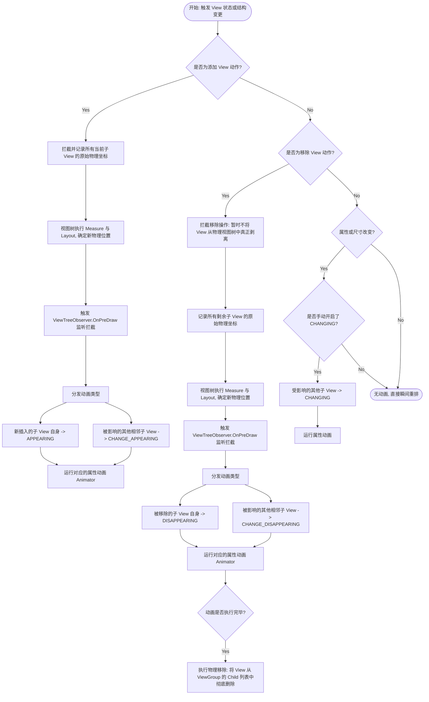
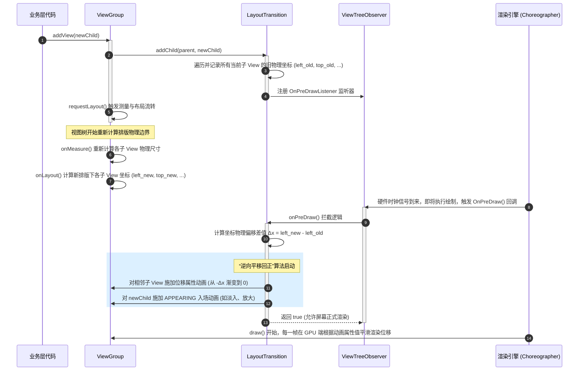

# 5.1.4.3.3 layoutAnimation

## 1. 导言：布局动画在 UI 体系中的角色

在 Android 复杂的 UI 渲染体系中，动画机制不仅用于增强单个 View 的视觉表现力，更用于维系整个视图树（View Tree）在拓扑结构发生改变时的视觉连贯性。ViewGroup 作为容纳子视图的容器，其内部子视图的入场、出场以及因增删视图而导致的相邻视图位置重排，共同构成了**布局动画（Layout Animation）**的研究范畴。

在 Android API 的演进历程中，布局动画主要通过两条不同的技术路径来实现：
1. **静态布局动画（`LayoutAnimationController`）**：这是 Android 早期（API 1）就存在的机制。它专注于控制 ViewGroup 首次加载或进行全局重绘时，所有子视图的“一次性入场”仪式。它采用传统的渐进式延迟策略，使得子视图能够以某种既定顺序（如顺序、倒序或随机）依次播放入场动画。
2. **动态布局过渡动画（`LayoutTransition`）**：在 Android 3.0（API 11）引入属性动画（Property Animator）后诞生。它是一个高动态性的过渡动画引擎，能够实时拦截子视图的添加（`addView`）、移除（`removeView`）或可见性变化，并为自身以及受其影响而发生物理位置改变的邻近子视图，自动计算出物理位移差值，从而挂载平滑的属性动画过渡。有关属性动画与渲染引擎版本演进的详细历史背景，可参阅 [AndroidVersionChangeLog.md](../../../../../../AndroidVersionChangeLog.md)。

---

## 2. 静态布局动画：LayoutAnimationController 机理

### 2.1 XML 配置与核心属性详解
`LayoutAnimationController` 通常可以通过 XML 文件进行静态声明。在宿主布局 XML 中，只需为 ViewGroup 指定 `android:layoutAnimation` 属性即可：

```xml
<!-- res/layout/activity_main.xml -->
<LinearLayout
    xmlns:android="http://schemas.android.com/apk/res/android"
    android:layout_width="match_parent"
    android:layout_height="match_parent"
    android:orientation="vertical"
    android:layoutAnimation="@anim/list_layout_animation">
    <!-- 子视图 -->
</LinearLayout>
```

而对应的 `list_layout_animation.xml` 定义了布局动画控制器的具体参数：

```xml
<!-- res/anim/list_layout_animation.xml -->
<layoutAnimation
    xmlns:android="http://schemas.android.com/apk/res/android"
    android:delay="30%"
    android:animationOrder="normal"
    android:animation="@anim/fade_in_slide_up" />
```

其中三大核心配置属性的物理意义与控制机理如下：
*   **`android:delay`（延迟系数）**：
    该属性定义了子视图之间播放入场动画的时间差。它可以是浮点数（如 `0.3`）或百分比（如 `30%`）。该值的物理基准是**单个子视图动画的持续时间（Duration）**。如果子视图动画耗时为 $T$，延迟系数为 $d$，则相邻子视图动画启动的间隔时间差为 $\Delta t = d \times T$。例如，单个动画持续 500ms，延迟设为 `30%`，则每个子视图较前一个子视图会延迟 150ms 启动。
*   **`android:animationOrder`（动画播放顺序）**：
    决定了子视图分发动画时的时序规则，共有三种常量选择：
    *   `normal`（顺序）：按照子视图在容器中的自然索引（Index）从 `0` 到 `N-1` 依次播放动画。
    *   `reverse`（逆序）：反向播放，索引从 `N-1` 到 `0` 依次触发。
    *   `random`（随机）：利用随机数生成器打乱分发顺序，让界面呈现错落有致的无序入场效果。
*   **`android:animation`（入场动画资源）**：
    指定每一个子视图被分派到的具体补间动画（Tween Animation），通常是一个 `<set>` 集合，包含平移（Translate）、渐变（Alpha）、缩放（Scale）等。

### 2.2 LayoutAnimationController 源码与执行流程剖析
当一个 ViewGroup 被加载并确定物理边界后，静态布局动画的生命周期便开始运转。以下是其底层的关键源码逻辑与调用流程分析。

#### 1. 触发与标记初始化
静态布局动画的触发时机位于 ViewGroup 的布局（Layout）阶段。在 `ViewGroup.layout(l, t, r, b)` 执行过程中，若检测到配置了 `LayoutAnimationController` 且尚未播放过动画，系统会调用 `startLayoutAnimation()` 方法。此时，ViewGroup 内部会设置一个标志位：
```java
// ViewGroup 源码片段示意
public void startLayoutAnimation() {
    mGroupFlags |= FLAG_RUN_ANIMATION; // 激活布局动画播放标志
    requestLayout(); // 请求重新布局以触发绘制流程的拦截
}
```

#### 2. 绘制拦截（`ViewGroup.dispatchDraw()`）
布局动画的核心魔力发生在 ViewGroup 的绘制分发阶段。ViewGroup 重写了 `dispatchDraw(Canvas canvas)` 方法。在此方法内部，系统会拦截子视图的正常绘制，转而为它们分发动画：
```java
// 简化版的 ViewGroup.dispatchDraw 核心控制逻辑
@Override
protected void dispatchDraw(Canvas canvas) {
    // 检查是否需要运行布局动画
    final boolean runAnimation = (mGroupFlags & FLAG_RUN_ANIMATION) != 0;
    if (runAnimation) {
        final int count = getChildCount();
        final long drawingTime = getDrawingTime();
        
        // 遍历所有可见的子视图，为其绑定带有特定延迟的动画
        for (int i = 0; i < count; i++) {
            final View child = getChildAt(i);
            if (child != null && child.getVisibility() == VISIBLE) {
                // 调用控制器，动态为子视图创建/获取动画对象
                Animation a = mLayoutAnimationController.getAnimationForView(child);
                if (a != null) {
                    child.setAnimation(a); // 将计算好延迟的动画挂载到 View 上
                }
            }
        }
        
        // 标记控制器开始启动，并重置 ViewGroup 的动画标志位，防止重复触发
        mLayoutAnimationController.start();
        mGroupFlags &= ~FLAG_RUN_ANIMATION;
    }
    
    // 后续执行正常的子视图绘制流程（drawChild）
    super.dispatchDraw(canvas);
}
```

#### 3. 延迟计算的核心公式
`LayoutAnimationController` 是如何为每个子 View 计算专属延迟的？其核心在于 `getAnimationForView(View view)` 及其内部调用的 `getDelayForView(View view)`。
设子视图总数为 $N$，当前子视图在 ViewGroup 中的索引为 $index$，单个子视图动画的执行周期为 $T$，设定的延迟系数为 $d$，动画实际的延迟启动时间为 $Offset$。
根据 `animationOrder` 的不同，延迟计算公式如下：

*   **顺序（`ORDER_NORMAL`）**：
    $$Offset_{index} = index \times d \times T$$
*   **逆序（`ORDER_REVERSE`）**：
    $$Offset_{index} = (N - 1 - index) \times d \times T$$
*   **随机（`ORDER_RANDOM`）**：
    $$Offset_{index} = \text{random}() \times (N - 1) \times d \times T$$

计算出的 $Offset$ 会通过 `animation.setStartOffset(long startOffset)` 作用于该子视图对应的 `Animation` 对象。当 `drawChild()` 阶段到来时，底层补间动画系统便会在各自的时钟到达 Offset 后才正式启动绘制变换。

#### 静态布局动画的局限性
静态布局动画（`LayoutAnimationController`）的设计是“一次性”的。它仅能应对容器初始化加载时的整体入场，并且其底层完全依赖古老的补间动画（`android.view.animation.Animation`）。这意味着它仅仅是作用于 Canvas 绘制层面的图形变换，并不会改变 View 的物理坐标，也无法对运行时动态的 `addView` / `removeView` 作出合理的响应。

---

## 3. 动态布局过渡：LayoutTransition 深度剖析

为了解决视图树在运行时动态改变（拓扑结构发生增删改）时的动画连贯性问题，Android 在 3.0（API 11）中引入了 `LayoutTransition`。这标志着布局动画全面跨入了**属性动画（Property Animator）**时代。

### 3.1 属性动画级别的过渡类型及其物理意义
`LayoutTransition` 内部维护了五种不同的过渡动画类型，用以针对性地响应各种不同的布局变更场景。

| 常量名称 | 对应方法/触发机制 | 动画作用的目标对象 | 物理意义与视觉逻辑 |
| :--- | :--- | :--- | :--- |
| **`APPEARING`** | `addView()` 或可见性变更为 `VISIBLE` | **被添加/显示** 的新子 View 自身 | 新子视图进入屏幕时播放的入场动画。默认表现为淡入（Alpha 从 0 到 1）和放大。 |
| **`DISAPPEARING`** | `removeView()` 或可见性变更为 `GONE` | **被移除/隐藏** 的旧子 View 自身 | 旧子视图离开屏幕时播放的退场动画。默认表现为淡出（Alpha 从 1 到 0）和缩小。 |
| **`CHANGE_APPEARING`** | 新子 View 移入触发 | **未变动但受波及** 的其他相邻子 View | 当有新视图插入时，由于挤压空间导致其他相邻子视图发生位置偏移。该动画控制这些受波及的相邻视图如何从“旧物理位置”平滑移动到“新物理位置”。 |
| **`CHANGE_DISAPPEARING`** | 旧子 View 移出触发 | **未变动但受波及** 的其他相邻子 View | 当有视图被移除时，由于腾出空间导致其他相邻子视图发生位置重排。该动画控制这些相邻视图平滑滑动填补空缺。 |
| **`CHANGING`** | 非增删引起的 View 尺寸/布局属性改变 | 所有因该变更而发生位置变动的子 View | 用于控制由于子 View 尺寸变化、边距改变等引起的整个布局重排过渡。**该类型默认关闭**，需通过 `enableTransitionType(LayoutTransition.CHANGING)` 显式开启。 |

---

### 3.2 LayoutTransition 在 View 增删时的触发决策时序流图

当 ViewGroup 中发生子视图的动态添加或移除时，`LayoutTransition` 内部的逻辑判断与执行时序如下：



---

### 3.3 底层运作机理：动态拦截与“逆向位移回正”算法

`LayoutTransition` 最核心且精妙的技术设计在于：**它是如何在不破坏 Android 系统固有测量与布局框架的前提下，实现相邻子 View 位置重排的平滑过渡？** 

如果直接去修改 LayoutParams 或者在动画期间频繁调用 `layout()` 方法，会导致排版系统处于极度混乱和死循环的边缘。因此，`LayoutTransition` 采用了一套精妙的**“物理坐标变更拦截与逆向位移回正”**算法。

#### 第一阶段：数据拦截与快照记录（`LayoutTransition.addChild`）
当业务层调用 `ViewGroup.addView(child)` 时：
1. ViewGroup 内部的 `addViewInner()` 首先会被调用。在正式把该 `child` 添加到子视图数组之前，它会检测当前是否挂载了 `LayoutTransition`。
2. 若启用了过渡动画，`LayoutTransition` 就会启动拦截机制。它会立刻深度遍历 ViewGroup 当前所有的直接子视图，读取并缓存它们此刻的物理边界坐标快照：
   $$Coordinate_{old} = \{ left_{old}, top_{old}, right_{old}, bottom_{old} \}$$
3. 接着，它还会自动向整个视图树的 `ViewTreeObserver` 注册一个 `OnPreDrawListener` 监听器，以便在即将渲染的前夕截获控制权。

#### 第二阶段：常规排版与物理越迁（`requestLayout`）
数据记录完毕后，宿主 ViewGroup 正常执行 `requestLayout()` 流程：
1. 视图树开始经历完整的 `onMeasure()` 和 `onLayout()`。
2. 此时，排版引擎会根据新增的 View 重新计算所有子 View 的布局。
3. `onLayout()` 执行完毕后，每个子 View 的物理位置已经瞬移到了新计算出的最终坐标上：
   $$Coordinate_{new} = \{ left_{new}, top_{new}, right_{new}, bottom_{new} \}$$
4. 此时，尚未进行屏幕绘制（像素填充），这为动画系统留出了一个“欺骗肉眼”的黄金时间窗口。

#### 第三阶段：在 OnPreDrawListener 中计算偏移量与逆向位移
在像素被栅格化输出到屏幕前的最后一刻，`ViewTreeObserver` 触发 `OnPreDrawListener.onPreDraw()` 回调。此时，`LayoutTransition` 拦截并接管绘制逻辑：
1. **差值计算**：遍历所有相邻的子视图，对比它们的新旧物理边界坐标，计算出它们在 X 轴和 Y 轴上的物理位移差值 $\Delta x$ 与 $\Delta y$：
   $$\Delta x = left_{new} - left_{old}$$
   $$\Delta y = top_{new} - top_{old}$$
2. **状态评估**：若发现某个子视图的 $\Delta x$ 或 $\Delta y$ 不为 0，则说明该子视图因本次布局变更受到了波及，发生了位置偏移。
3. **“逆向位移”参数装配**：
   如果任由排版系统直接绘制，受波及的相邻 View 会在屏幕上发生瞬间“闪现”到新位置的视觉割裂。为了平滑过渡，`LayoutTransition` 会动态创建一个基于属性动画的 `Animator`（默认是由 `PropertyValuesHolder` 构成的属性动画）。
   *   该属性动画的目的，是在物理上使该 View 在屏幕渲染时，**起始视觉位置被拉回到旧位置 $Coordinate_{old}$**，然后再在设定的时间内，顺滑地向新位置 $Coordinate_{new}$ 进行位移动画。
   *   为了实现这个过程，它并不会去修改已经计算完成的物理 `left`/`top` 参数。相反，它会以**负偏移量**作为动画的起始值，向 `0` 渐变。
   *   例如，在早期实现或特定的平移动画中，它将动画的平移属性（如 `translationX` 和 `translationY`）起始值分别设为：
       $$StartTranslationX = -\Delta x = left_{old} - left_{new}$$
       $$StartTranslationY = -\Delta y = top_{old} - top_{new}$$
       **注意：在默认实现中，LayoutTransition 通过 ObjectAnimator 动态改变边界值属性（"left", "top" 等）而不是 translation 来移动相邻视图**。这一默认做法对性能有深远的影响，我们将在第 4 节进行深度讨论。
       而在动画终止时，相应位置属性的目标值被设定为：
       $$EndTranslationX = 0$$
       $$EndTranslationY = 0$$
4. **渲染回正**：
   在动画播放的每一帧中，View 在屏幕上的实际视觉绘制坐标（Visual Location）为：
   $$VisualX = left_{new} + translationX$$
   $$VisualY = top_{new} + translationY$$
   *   在动画起点（帧 0）：由于 $translation = old - new$，所以 $Visual = new + (old - new) = old$。用户在屏幕上看到的 View 依然呆在老地方。
   *   随着动画时间推移，$translation$ 逐渐趋近于 $0$。
   *   在动画终点：$translation = 0$，所以 $Visual = new$。View 完美平滑地滑到了新物理排版坐标上。

#### 第四阶段：延迟移除与 DISAPPEARING 的退场闭环
当调用 `ViewGroup.removeView(child)` 时：
1. 类似于添加逻辑，但更特殊的是：如果立刻将子 View 从父容器中物理剔除，系统在 `dispatchDraw()` 时就无法再遍历到它，它的退场动画（`DISAPPEARING`）也就无从谈起。
2. 因此，`LayoutTransition` 会在拦截到移除请求时，**推迟该 View 的物理移除动作**。它会将该子 View 的物理剔除逻辑封装进一个过渡监听回调（`TransitionListener`）中。
3. 在 `DISAPPEARING` 属性动画播放期间，该被移除的 View 仍然保留在父容器的子视图列表中参与绘制，但被置于特殊状态。
4. 当且仅当该 View 自身的 `DISAPPEARING` 动画完全执行完毕（触发 `onAnimationEnd`）时，`LayoutTransition` 才会真正调用 ViewGroup 的物理剔除方法，将其彻底剥离视图树。

---

### 3.4 ViewGroup 动态 add 子 View 时相邻子 View 重排计算流转逻辑图

以下序列图刻画了在调用 `addView` 后，系统底层在 `OnPreDrawListener` 的控制下，进行记录、计算差值、执行逆向位移并逐步回正的物理流转过程：



---

## 4. 频繁重排带来的性能隐患与避坑指南

尽管 `LayoutTransition` 通过巧妙的机制实现了极具高级感的过渡动画，但在高频的动态更新场景（如长列表滚动、高频弹幕发射、消息队列动态刷新等）中，如果使用不当，它会成为**“布局抖动（Layout Thrashing）”**与**“主线程掉帧”**的元凶。

### 4.1 布局抖动（Layout Thrashing）与 requestLayout() 性能黑洞
在默认的 `LayoutTransition` 实现中，过渡动画之所以容易引发严重的性能瓶颈，其底层原因主要有两点：

1.  **改变边界参数（`left`/`top`/`right`/`bottom`）导致的重排死循环**：
    在默认的 Change 动画配置中，`LayoutTransition` 为了移动受波及的相邻视图，其内部是通过 `ObjectAnimator` 直接改变子 View 的物理边界参数（例如直接操作 View 的 `left`、`top`、`right`、`bottom` 属性值）。
    在 View 源码中，`setLeft()` 或 `setTop()` 内部流程如下：
    ```java
    // View.java 源码片段示意
    public void setLeft(int left) {
        if (left != mLeft) {
            // ... 改变物理边界
            mLeft = left;
            // 物理位置改变，为了使布局生效，系统会强制触发重绘与排版请求
            invalidate(true);
            if (mParent != null) {
                mParent.invalidateChild(this, ...);
            }
        }
    }
    ```
    当大量的子视图同时运行这种改变物理边界的属性动画时，会导致 ViewGroup 在动画执行的每一帧（即每 16.6ms 或 8.3ms）都在重新评估视图边界。这使得整个视图树被迫频繁触发 `invalidate()` 甚至重新走一遍 Measure 与 Layout 流程，直接打穿了性能底线。
2.  **多层复杂嵌套视图树的测量放大效应**：
    当一个处于深层嵌套布局（如多层嵌套的 `LinearLayout`、使用了 `layout_weight` 的线性布局、或复杂的 `RelativeLayout`）中的 View 触发 `requestLayout()` 时，其调用会沿着 `ViewParent` 一路向上回溯，直到最顶层的 `ViewRootImpl`。然后，系统会自顶向下对整棵树执行深度优先遍历的 Measure。
    由于某些布局容器（如 `RelativeLayout`）会对子视图进行**双重测量**以确定依赖关系，这导致单次重排所需的 CPU 运算时间呈指数级上升。在动画播放期间，如果主线程 CPU 被这些海量的排版计算彻底占满，将直接导致 Choreographer 无法及时发出绘制帧，造成主线程严重卡顿。

---

### 4.2 深度优化建议与最佳实践

#### 优化建议一：启用渲染树硬件加速与 GPU 独立渲染
*   **物理原理**：
    在 Android 3.0 引入硬件加速后，系统的渲染流水线发生了根本性的改变。在硬件加速开启时，CPU 端不再将绘制命令直接栅格化，而是将它们转换为显示列表（DisplayList）。
    如果过渡动画操作的属性是 GPU 能够直接通过矩阵变换处理的**“独立渲染属性”**（如 `translationX`、`translationY`、`alpha`、`scaleX`、`scaleY`、`rotation` 等），GPU 的 `RenderThread` 可以直接在硬件层面调整变换矩阵并渲染，而**不需要重新构建 DisplayList**，即完全避开了 CPU 端的 `measure`、`layout` 以及 `draw` 流程。
*   **落地策略**：
    在自定义过渡动画的 `Animator` 时，**必须使用 `translationX`/`translationY` 来代替 `left`/`top` 等会改动视图边界的属性**。
    ```java
    // 优秀实践：基于 translationY 的 CHANGE 动画配置
    LayoutTransition transition = new LayoutTransition();
    
    // 创建一个只操作 translationY 属性的 Animator
    PropertyValuesHolder pvhY = PropertyValuesHolder.ofFloat("translationY", -100f, 0f);
    ObjectAnimator changeAnimator = ObjectAnimator.ofPropertyValuesHolder((Object) null, pvhY);
    
    // 将该动画配置给 CHANGE_APPEARING 
    transition.setAnimator(LayoutTransition.CHANGE_APPEARING, changeAnimator);
    
    // 挂载至宿主 ViewGroup
    viewGroup.setLayoutTransition(transition);
    ```

#### 优化建议二：根据场景对 LayoutTransition 进行“瘦身”与精简
默认的 `LayoutTransition` 会同时启动所有的过渡类型（除 `CHANGING` 外），这在高频增删子 View 的列表场景下开销过大。
*   **裁剪策略**：
    在对性能要求苛刻的场景中，可以**选择性地关闭相邻子 View 的重排属性动画**（即 `CHANGE_APPEARING` 和 `CHANGE_DISAPPEARING`），仅保留当前变动 View 自身的淡入淡出（`APPEARING` 与 `DISAPPEARING`）。
    由于关闭了 Change 动画，当新增/删除 View 时，相邻的 View 将会“瞬间重拍到位”，不再执行漫长的每一帧位移动画，这能够瞬间释放大量的 CPU 计算资源，完全规避布局抖动。
    ```java
    // 关闭开销最大的相邻重排过渡动画
    transition.setAnimator(LayoutTransition.CHANGE_APPEARING, null);
    transition.setAnimator(LayoutTransition.CHANGE_DISAPPEARING, null);
    ```

#### 优化建议三：控制宿主及邻近视图的硬件加速配置
在配置了 `LayoutTransition` 的视图树中，需要确保整棵树的硬件加速状态没有被意外关闭。
如果某个子视图（例如开启了特殊滤镜或硬件加速不兼容的 Canvas 绘制操作的自定义 View）调用了 `setLayerType(View.LAYER_TYPE_SOFTWARE, null)`，这会导致该子视图所在的局部渲染分支重新退化为软件渲染模式（Software Rendering Mode）。在此分支下的过渡动画，将无法享受到 GPU 矩阵变换的红利，进而引起局部的掉帧。
因此，应当通过检查排查，确保参与动画过渡的 View 容器及其子 View 尽可能运行在硬件加速通道中。

#### 优化建议四：高频场景下的终极替代方案——打平布局与 ViewPropertyAnimator
当遇到极高频的增删变更时（例如直播间的滚动弹幕、聊天界面的快速消息气泡入场），应当放弃使用系统的 `LayoutTransition`。
*   **替代方案 1**：使用底层重绘性能更好的 `RecyclerView` 配合专门定制的 `RecyclerView.ItemAnimator`。RecyclerView 在复用机制和脏区域绘制（Dirty Area Draw）上做了极其深度的底层优化。
*   **替代方案 2**：采用“打平布局”加“自管理属性动画”的方案。即不进行真正的 `addView`/`removeView`，而是利用预先分配好的 View 池（View Pool），仅通过改变 `translation` 属性，并结合 `ViewPropertyAnimator` 进行纯 GPU 端的动画位移，在视觉上达成过渡效果，避开整个布局容器的拓扑结构变动。

通过合理地应用上述优化方案，开发者可以在享受布局动画带来的灵动视觉效果的同时，将视图树重排的 CPU 开销控制在合理范围内，确保主线程交互的流畅性。
