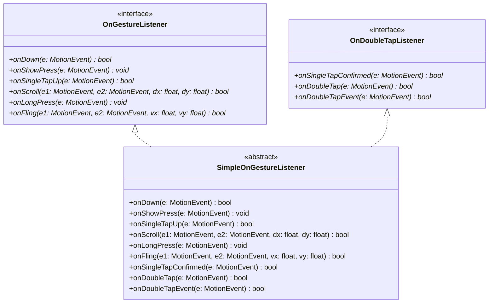
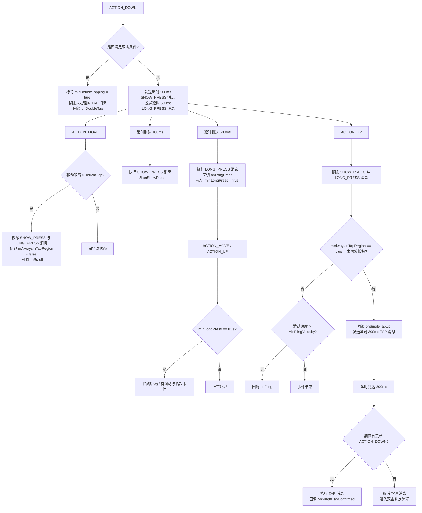
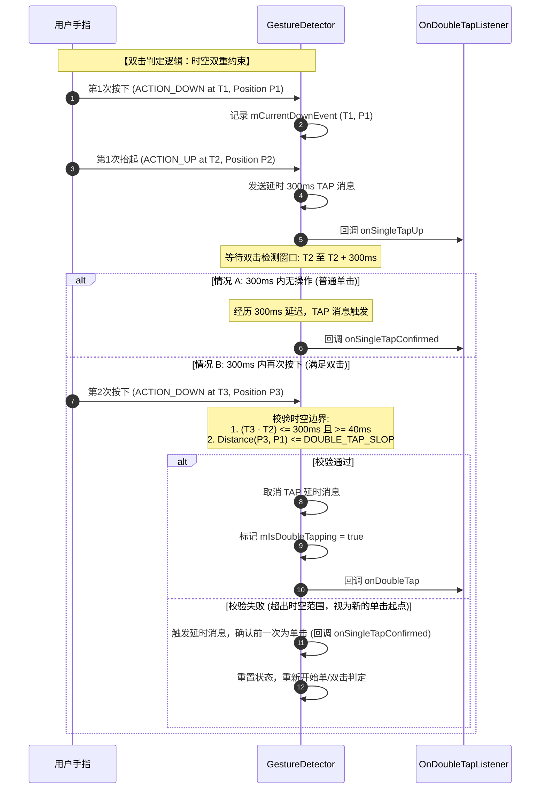

# 5.1.4.3.4 GestureDetector

在 Android 原生应用开发中，触摸事件的处理是构建流畅交互的基石。然而，底层的 `MotionEvent` 仅提供了最基础的物理触控数据（如 Action 类型、屏幕坐标、触控时间戳与压力等）。当我们需要识别“长按”、“双击”、“滑动”或“快速飞掠（Fling）”等具备高级语义的手势时，如果直接在 `onTouchEvent` 中手动维护状态机、计算时间差与空间距离，代码将变得极其臃肿且难以维护。

为此，Android 框架提供了 `GestureDetector`（手势识别器）作为辅助工具类。它通过高度抽象的接口和一套精妙的、由延迟消息驱动的状态机，将底层的原始触控事件序列转化为语义清晰的手势回调。本文将深入探讨 `GestureDetector` 的历史使命、核心接口的职责隔离、延迟消息 Handler 驱动手势判定的源码机制，并结合实战场景探讨手势冲突的解决策略。

---

## 1. GestureDetector 的设计使命与封装意义

在没有手势识别器之前，开发者若想判定一次“长按”操作，通常需要在 `ACTION_DOWN` 时记录时间，并开启一个定时任务，同时在 `ACTION_MOVE` 中不断校验手指是否发生位移；如果发生了超出阈值的位移，或在定时任务到期前抬起了手指，则取消定时任务。同样，双击判定的复杂度更甚，需要记录多次 `ACTION_DOWN` 与 `ACTION_UP` 的时空坐标并进行多重边界判定。

底层 `MotionEvent` 的核心特点是**无状态性**和**高频性**。一个完整的滑动手势会产生数十甚至上百个连续的 `ACTION_MOVE` 信号。直接基于这些低级信号构建复杂的交互，开发者将面临以下挑战：
1. **状态机膨胀**：多指触控、滑动、长按、双击等多种手势混杂时，手势状态的转换极其错综复杂。
2. **硬件差异适配**：不同设备的屏幕像素密度（Density）不同，滑动与双击的容差范围（Slop）不能硬编码，必须根据设备物理参数动态调整。
3. **计算冗余与误差**：速度跟踪器（`VelocityTracker`）的复用与回收、触控抖动（Jitter）的过滤等，均需要大量模板代码。

`GestureDetector` 的核心价值在于**将物理信号映射为语义事件**。它不仅帮开发者处理了屏幕密度适配（例如通过 `ViewConfiguration` 获取各种动作的 Slop 阈值），而且在其内部通过静态 Handler 建立起一套严密的状态判定机制。它就像一个“黑盒适配器”，开发者只需将 `MotionEvent` 灌入 `GestureDetector.onTouchEvent(event)`，并在回调接口中处理具体的业务逻辑即可。

---

## 2. 手势分类与回调职责隔离

为了满足不同层次的手势需求，`GestureDetector` 设计了三个核心接口与一个静态内部适配器类，实现了清晰的职责隔离。



### 2.1 OnGestureListener 基础手势监听器
`OnGestureListener` 负责监听最基本的六大单指手势。这些方法各自承担了独特的物理意义和触发条件：

1. **`onDown(MotionEvent e)`**
   - **触发条件**：手指刚刚接触屏幕，即触发 `ACTION_DOWN` 时立即回调。
   - **物理意义**：这是所有手势流的起点。
   - **关键机制**：此方法**必须返回 `true`**。因为在 Android 的事件分发机制中，如果一个 View（或其 TouchListener）在 `ACTION_DOWN` 时返回 `false`，代表它不消费该事件流，系统将不再把后续的 `ACTION_MOVE` 和 `ACTION_UP` 事件分发给它。因此，如果 `onDown` 返回了 `false`，`GestureDetector` 将无法接收到后续的事件，导致其余所有回调（如 `onScroll`、`onLongPress` 等）全部失效。

2. **`onShowPress(MotionEvent e)`**
   - **触发条件**：手指按下，且在 100ms（系统默认判定阈值 `TAP_TIMEOUT`）内既没有抬起也没有移动。
   - **物理意义**：用于视觉反馈。它告诉开发者“用户已经按下了，且暂时没有滑动，极有可能进行长按或单击”。此时可以改变 View 的背景色或呈现按下态，给用户以即时反馈。

3. **`onSingleTapUp(MotionEvent e)`**
   - **触发条件**：手指轻触屏幕后快速抬起，即在 `ACTION_UP` 时回调。
   - **物理意义**：一次普通的轻触抬起。
   - **与双击的冲突**：需要注意的是，如果在双击的过程中，用户第一次按下并迅速抬起，**也会**触发 `onSingleTapUp`。因此，它无法独立区分“究竟是单击的结束，还是双击的第一步”。

4. **`onScroll(MotionEvent e1, MotionEvent e2, float distanceX, float distanceY)`**
   - **触发条件**：手指在屏幕上拖动，伴随连续的 `ACTION_MOVE` 触发。
   - **物理意义**：拖拽/滚动。
   - **参数解析**：
     - `e1`：最初触发滑动的 `ACTION_DOWN` 事件。
     - `e2`：当前触发回调的 `ACTION_MOVE` 事件。
     - `distanceX` / `distanceY`：**这是上一次回调 `onScroll` 时的坐标减去当前坐标的差值**。即 $distanceX = lastX - currentX$。这意味着，当手指在屏幕上向右滑动时，X 轴坐标增大，计算出的 `distanceX` 是负值。这种设计是为了方便开发者直接配合 `View.scrollBy(dx, dy)` 进行滚动映射（因为手指右滑代表内容向左滚，刚好需要累加负的偏移量）。

5. **`onLongPress(MotionEvent e)`**
   - **触发条件**：手指按下，且在 500ms（由系统的长按超时时间决定）内既未抬起也未发生明显位移。
   - **物理意义**：长按。
   - **独特机制**：一旦触发 `onLongPress`，整个手势识别器将进入长按锁定状态（`mInLongPress = true`），后续的 `ACTION_MOVE` 和 `ACTION_UP` 将被拦截，不再触发任何诸如 `onScroll` 或 `onFling` 的回调。

6. **`onFling(MotionEvent e1, MotionEvent e2, float velocityX, float velocityY)`**
   - **触发条件**：手指在屏幕上快速滑动并迅速抬起（`ACTION_UP` 发生时）。
   - **物理意义**：快速划动/飞掠/抛掷。常用于列表的惯性滚动。
   - **判定条件**：必须同时满足两个条件：滑动在时空上构成了有效位移，且手指离开屏幕瞬间在 X 或 Y 轴上的瞬时速度（通过 `VelocityTracker` 计算）超过了系统的最小飞掠速度限制 `mMinimumFlingVelocity`。

---

### 2.2 OnDoubleTapListener 双击手势监听器
为了排解单击与双击的逻辑冲突，`GestureDetector` 引入了 `OnDoubleTapListener` 接口。

1. **`onSingleTapConfirmed(MotionEvent e)`**
   - **物理意义**：**绝对单击确认**。
   - **解决冲突的核心**：它保证了该单击事件是在用户确实没有进行双击的前提下触发的。当用户抬起手指（触发 `onSingleTapUp`）后，系统不会立刻回调 `onSingleTapConfirmed`，而是启动一个 300ms（双击超时阈值 `DOUBLE_TAP_TIMEOUT`）的等待期。如果在该等待期内用户没有再次按下屏幕，系统便能断定这是一次纯粹的单击，从而安全地回调该方法。如果你的应用需要同时支持单击和双击，请务必在 `onSingleTapConfirmed` 中处理单击逻辑，否则会导致每次双击时都会错误地先执行一次单击响应。

2. **`onDoubleTap(MotionEvent e)`**
   - **触发条件**：在双击的第二次 `ACTION_DOWN` 事件发生时立即回调。
   - **物理意义**：宣告双击行为的成立。

3. **`onDoubleTapEvent(MotionEvent e)`**
   - **触发条件**：在双击行为确立之后，第二次按下期间发生的所有触摸事件（包括第二次按下的 `ACTION_DOWN`、随后的 `ACTION_MOVE` 以及最后的 `ACTION_UP`）均会触发该回调。
   - **物理意义**：允许开发者对双击之后的“双击拖动”等复合手势进行更精细的追踪。

---

### 2.3 SimpleOnGestureListener 适配器
在实际开发中，如果我们直接实现 `OnGestureListener` 或 `OnDoubleTapListener`，必须强制重写其声明的所有方法，从而产生大量返回 `false` 的空方法。
`SimpleOnGestureListener` 是一个静态内部类，它同时实现了上述所有接口，并为每个方法提供了默认的空实现（对于需要返回布尔值的方法，默认返回 `false`）。
**推荐实践**：我们在具体开发中，应当继承 `SimpleOnGestureListener`，只重写那些我们真正关心的手势方法，从而实现代码的极简化。

---

## 3. 源码深度剖析：延时消息驱动的手势识别算法

`GestureDetector` 的核心思想是**基于事件驱动的延时状态判定**。这一机制完全由其内部的私有静态 Handler —— `GestureHandler` 来驱动。下面我们将深入源码，拆解其内部是如何通过 Handler 消息队列配合 `onTouchEvent` 状态机来判定手势的。

### 3.1 核心状态维护与三个关键 Delay 消息

在 `GestureDetector` 内部定义了三个核心的 Handler 消息标识，它们构成了整个手势识别的时间轴驱动力：

```java
private class GestureHandler extends Handler {
    GestureHandler() {
        super();
    }

    GestureHandler(Handler handler) {
        super(handler.getLooper());
    }

    @Override
    public void handleMessage(Message msg) {
        switch (msg.what) {
            case SHOW_PRESS:
                // 100ms 延时到达，回调 onShowPress 提示用户已被按下
                mListener.onShowPress(mCurrentDownEvent);
                break;
                
            case LONG_PRESS:
                // 500ms 延时到达，触发长按判定
                dispatchLongPress();
                break;
                
            case TAP:
                // 300ms 双击等待期结束，确认无第二次点击，回调单击确认
                if (mDoubleTapListener != null) {
                    if (!mStillDown) {
                        mDoubleTapListener.onSingleTapConfirmed(mCurrentDownEvent);
                    } else {
                        // 如果 300ms 到了手指还没抬起，则标记为延时确认，等待 UP 事件时再确认
                        mDeferSingleTapConfirmed = true;
                    }
                }
                break;
            default:
                throw new RuntimeException("Unknown message " + msg);
        }
    }
}
```



---

### 3.2 触摸事件流核心源码拆解与状态转移

我们在解析底层的 `onTouchEvent(MotionEvent ev)` 源码时，可以按四种核心事件类型（DOWN, MOVE, UP, CANCEL）来梳理其状态转化逻辑。

#### 1. ACTION_DOWN 事件：手势的始发与双击的前期校检
当手指接触屏幕时，`GestureDetector` 首先会检查当前按下的时空条件是否与前一次的点击构成双击：

```java
boolean handled = false;
final int action = ev.getAction();
// 引入速度跟踪器
if (mVelocityTracker == null) {
    mVelocityTracker = VelocityTracker.obtain();
}
mVelocityTracker.addMovement(ev);

final boolean pointerUp = (action & MotionEvent.ACTION_MASK) == MotionEvent.ACTION_POINTER_UP;
final int skipIndex = pointerUp ? ev.getActionIndex() : -1;

// 计算多指触控的焦点坐标 (Focus Point)
float sumX = 0, sumY = 0;
final int count = ev.getPointerCount();
for (int i = 0; i < count; i++) {
    if (skipIndex == i) continue;
    sumX += ev.getX(i);
    sumY += ev.getY(i);
}
final int div = pointerUp ? count - 1 : count;
final float focusX = sumX / div;
final float focusY = sumY / div;

switch (action & MotionEvent.ACTION_MASK) {
    case MotionEvent.ACTION_DOWN:
        boolean hadTapMessage = mHandler.hasMessages(TAP);
        if (hadTapMessage) mHandler.removeMessages(TAP); // 移除尚未触发的单击确认延时消息

        // 双击判定：检查前一次抬起事件 mPreviousUpEvent 与当前按下事件 mCurrentDownEvent 是否匹配
        if ((mCurrentDownEvent != null) && (mPreviousUpEvent != null) && hadTapMessage
                && isConsideredDoubleTap(mCurrentDownEvent, mPreviousUpEvent, ev)) {
            // 校验通过，确立双击状态
            mIsDoubleTapping = true;
            // 触发双击的第一段回调
            handled |= mDoubleTapListener.onDoubleTap(mCurrentDownEvent);
            // 触发双击事件流追踪回调
            handled |= mDoubleTapListener.onDoubleTapEvent(ev);
        } else {
            // 不构成双击，则为普通按下。发送延时 SHOW_PRESS (100ms) 与 LONG_PRESS (500ms) 消息
            mHandler.sendEmptyMessageAtTime(SHOW_PRESS, ev.getDownTime() + TAP_TIMEOUT);
            mHandler.sendEmptyMessageAtTime(LONG_PRESS, ev.getDownTime() + mLongpressEnabled ? 
                ev.getDownTime() + ViewConfiguration.getLongPressTimeout() : 0); // 依赖系统长按延迟
        }

        // 保存/更新当前 Down 事件与焦点坐标
        if (mCurrentDownEvent != null) mCurrentDownEvent.recycle();
        mCurrentDownEvent = MotionEvent.obtain(ev);
        
        mAlwaysInTapRegion = true;
        mStillDown = true;
        mInLongPress = false;
        mDeferSingleTapConfirmed = false;
        
        mDownFocusX = focusX;
        mDownFocusY = focusY;
        
        handled |= mListener.onDown(ev);
        break;
```

#### 2. ACTION_MOVE 事件：距离度量、长按拦截与 Scroll 触发
当手指在屏幕上移动时，系统会计算移动的物理距离。如果移动超出了安全滑动阈值，则长按和展示按压判定将被撤销：

```java
    case MotionEvent.ACTION_MOVE:
        if (mInLongPress) {
            // 核心锁拦截：如果长按锁已经生效，则彻底忽略后续所有的 ACTION_MOVE 信号
            break; 
        }
        
        final float scrollX = mLastFocusX - focusX;
        final float scrollY = mLastFocusY - focusY;
        
        if (mIsDoubleTapping) {
            // 双击过程中产生的滑动，路由给 onDoubleTapEvent
            handled |= mDoubleTapListener.onDoubleTapEvent(ev);
        } else if (mAlwaysInTapRegion) {
            // 计算自 DOWN 以来的位移距离
            final int deltaX = (int) (focusX - mDownFocusX);
            final int deltaY = (int) (focusY - mDownFocusY);
            int distance = (deltaX * deltaX) + (deltaY * deltaY);
            
            // 获取系统判断是否发生滑动的最小阈值 mTouchSlopSquare
            if (distance > mTouchSlopSquare) {
                // 发生有效位移，重置 Tap 判定标志，取消未执行的 SHOW_PRESS 和 LONG_PRESS 消息
                mAlwaysInTapRegion = false;
                mHandler.removeMessages(SHOW_PRESS);
                mHandler.removeMessages(LONG_PRESS);
            }
        } else if ((Math.abs(scrollX) >= 1) || (Math.abs(scrollY) >= 1)) {
            // 已脱离 Tap 区域，触发连续的 onScroll 回调
            handled = mListener.onScroll(mCurrentDownEvent, ev, scrollX, scrollY);
            mLastFocusX = focusX;
            mLastFocusY = focusY;
        }
        break;
```

#### 3. ACTION_UP 事件：消息撤销、单击延时确认与 Fling 抛掷计算
当手指离开屏幕，意味着一次手势序列的终结。此时需要清理未完成的延时消息，并根据滑动速度或时空距离触发 `onFling` 或 `onSingleTapUp`：

```java
    case MotionEvent.ACTION_UP:
        mStillDown = false;
        MotionEvent currentUpEvent = MotionEvent.obtain(ev);
        
        if (mIsDoubleTapping) {
            // 双击的最后一步抬起，回调 onDoubleTapEvent
            handled |= mDoubleTapListener.onDoubleTapEvent(ev);
        } else if (mInLongPress) {
            // 长按释放，不做任何处理，直接清除长按标志
            mHandler.removeMessages(TAP);
            mInLongPress = false;
        } else if (mAlwaysInTapRegion) {
            // 抬起时手指依然在 Tap 区域，说明是一次轻触抬起
            handled = mListener.onSingleTapUp(ev);
            
            // 如果在 300ms 的双击超时到来前再次按下，则会撤销该 TAP 消息
            if (mDeferSingleTapConfirmed && mDoubleTapListener != null) {
                mDoubleTapListener.onSingleTapConfirmed(ev);
            } else {
                mHandler.sendEmptyMessageDelayed(TAP, DOUBLE_TAP_TIMEOUT);
            }
        } else {
            // 超出了点击范围，且非长按，计算抬起瞬间的手指速度
            final VelocityTracker velocityTracker = mVelocityTracker;
            velocityTracker.computeCurrentVelocity(1000, mMaximumFlingVelocity);
            final float velocityY = velocityTracker.getYVelocity();
            final float velocityX = velocityTracker.getXVelocity();
            
            // 校验速度是否大于系统规定的最小飞掠速度
            if ((Math.abs(velocityY) > mMinimumFlingVelocity)
                    || (Math.abs(velocityX) > mMinimumFlingVelocity)) {
                handled = mListener.onFling(mCurrentDownEvent, ev, velocityX, velocityY);
            }
        }
        
        // 保存 UP 事件，作为下一次双击判定的基准
        if (mPreviousUpEvent != null) mPreviousUpEvent.recycle();
        mPreviousUpEvent = currentUpEvent;
        
        // 释放速度追踪器
        if (mVelocityTracker != null) {
            mVelocityTracker.recycle();
            mVelocityTracker = null;
        }
        mIsDoubleTapping = false;
        mDeferSingleTapConfirmed = false;
        mHandler.removeMessages(SHOW_PRESS);
        mHandler.removeMessages(LONG_PRESS);
        break;
```

#### 4. ACTION_CANCEL 事件：清理现场
如果在手势未完成时，父布局拦截了事件流，会导致子 View 收到 `ACTION_CANCEL`。此时必须清除所有挂起的延时消息，并重置所有手势状态，避免状态错乱：

```java
    case MotionEvent.ACTION_CANCEL:
        cancel();
        break;
}
return handled;
```

---

### 3.3 双击判定算法的时空时序边界



双击判定不仅有严格的**时间边界**，还有明确的**空间边界**。我们来看核心校验函数 `isConsideredDoubleTap` 的内部逻辑：

```java
private boolean isConsideredDoubleTap(MotionEvent firstDown, MotionEvent firstUp,
        MotionEvent secondDown) {
    if (!mAlwaysInTapRegion) {
        // 第一阶段若有过明显的滑动位移，则判定不构成双击
        return false;
    }

    final long deltaTime = secondDown.getEventTime() - firstUp.getEventTime();
    // 1. 时间阈值校验：两次点击之间的时间差必须在 40ms ~ 300ms 之间
    if (deltaTime > DOUBLE_TAP_TIMEOUT || deltaTime < DOUBLE_TAP_MIN_TIME) {
        return false;
    }

    int deltaX = (int) firstDown.getX() - (int) secondDown.getX();
    int deltaY = (int) firstDown.getY() - (int) secondDown.getY();
    // 2. 空间阈值校验：第二次按下的坐标与第一次按下的坐标物理距离平方，必须小于系统规定的双击位移容限的平方
    return (deltaX * deltaX + deltaY * deltaY < mDoubleTapSlopSquare);
}
```

* **`DOUBLE_TAP_TIMEOUT`**：默认是 `300ms`。这个时间是系统在 `ACTION_UP` 之后挂起 `TAP` 延时消息的等待时长。如果在这个等待时间内用户没有再次按下，该消息执行，回调 `onSingleTapConfirmed`。
* **`DOUBLE_TAP_MIN_TIME`**：默认是 `40ms`。它的目的是过滤硬件防抖以及极高频的多点误触。如果两次按下和抬起的时间间隔小于 40ms，系统会拒绝将其判定为双击。
* **`DOUBLE_TAP_SLOP`**：双击滑动容忍度。用户手指再次落下的位置很难与第一次完全重合，这个值代表系统允许的两次点击坐标的最大像素偏差，在系统内部通过 `ViewConfiguration.getScaledDoubleTapSlop()` 动态获取。

---

### 3.4 长按触发拦截机理与 `mInLongPress` 锁

长按判定与双击有着截然相反的处理逻辑：双击是**在 UP 时延时判定**，而长按则是**在 DOWN 时延时判定**。
1. 在 `ACTION_DOWN` 时，系统发出一个延时 `500ms` 的 `LONG_PRESS` 消息。
2. 如果用户在 500ms 内抬起了手指（触发 `ACTION_UP`）或滑动超出了 `TouchSlop` 范围，该延时消息会立即通过 `mHandler.removeMessages(LONG_PRESS)` 被移除，从而判定长按未发生。
3. 如果 500ms 期间没有任何外部动作打破状态，延迟消息到期，Handler 回调 `dispatchLongPress()` 方法：

```java
private void dispatchLongPress() {
    mHandler.removeMessages(TAP); // 既然已经长按，就绝对不可能再触发单击确认
    mDeferSingleTapConfirmed = false;
    mInLongPress = true; // 开启核心拦截锁
    mListener.onLongPress(mCurrentDownEvent);
}
```

**为什么长按后，手指滑动或抬起不会再产生 Fling 和 Scroll？**
这全赖 `mInLongPress` 这个布尔锁。在 `onTouchEvent` 中：
- 当 `ACTION_MOVE` 到来时，开头第一行校验为 `if (mInLongPress) { break; }`，直接跳出分支。
- 当 `ACTION_UP` 到来时，校验为 `else if (mInLongPress) { mInLongPress = false; }`，仅重置标记，同样直接跳过判定 `onSingleTapUp` 或 `onFling` 的分支。
通过这个精妙的锁机制，一旦触发长按，就彻底锁死了后续事件流的语义转换，维持了交互的确定性。

---

## 4. 开发最佳实践与手势冲突排解

### 4.1 标准 Kotlin 开发模板
为了避免内存泄漏与保障多指焦点计算的准确度，以下提供了一套将 `GestureDetector` 与 `View.OnTouchListener` 结合的最佳实践模板：

```kotlin
import android.content.Context
import android.util.AttributeSet
import android.view.GestureDetector
import android.view.MotionEvent
import android.view.View

class CustomGestureView @JvmOverloads constructor(
    context: Context,
    attrs: AttributeSet? = null,
    defStyleAttr: Int = 0
) : View(context, attrs, defStyleAttr), View.OnTouchListener {

    private val gestureDetector: GestureDetector

    init {
        // 1. 实例化 SimpleOnGestureListener 适配器
        val gestureListener = object : GestureDetector.SimpleOnGestureListener() {
            override fun onDown(e: MotionEvent): Boolean {
                // 必须返回 true 以确保消费 DOWN 事件，从而能够接收后续的 MOVE 和 UP
                return true
            }

            override fun onSingleTapConfirmed(e: MotionEvent): Boolean {
                // 处理绝对单击事件
                performClick() // 遵循 Accessibility 辅助功能规范
                return true
            }

            override fun onDoubleTap(e: MotionEvent): Boolean {
                // 处理双击事件
                return true
            }

            override fun onLongPress(e: MotionEvent) {
                // 处理长按事件
                performLongClick() // 遵循 Accessibility 辅助功能规范
            }

            override fun onScroll(
                e1: MotionEvent?,
                e2: MotionEvent,
                distanceX: Float,
                distanceY: Float
            ): Boolean {
                // 处理滑动事件，此处 distanceX / distanceY 方向与手指运动方向相反
                return true
            }

            override fun onFling(
                e1: MotionEvent?,
                e2: MotionEvent,
                velocityX: Float,
                velocityY: Float
            ): Boolean {
                // 处理飞掠事件，可用于启动惯性动画
                return true
            }
        }

        // 2. 初始化 GestureDetector 传入 Context 与 Listener
        gestureDetector = GestureDetector(context, gestureListener)
        
        // 3. 关联 TouchListener
        setOnTouchListener(this)
    }

    override fun onTouch(v: View, event: MotionEvent): Boolean {
        // 将 MotionEvent 委托给 GestureDetector 识别
        return gestureDetector.onTouchEvent(event)
    }

    override fun performClick(): Boolean {
        super.performClick()
        return true
    }

    override fun performLongClick(): Boolean {
        super.performLongClick()
        return true
    }
}
```

---

### 4.2 常见手势冲突场景与排解原则

当我们在嵌套布局中（例如在 `ScrollView` 或 `ViewPager2` 中使用自定义的手势 View）引入手势识别时，手势冲突在所难免。这主要是因为父容器默认会在其 `onInterceptTouchEvent` 中根据滑动的位移和方向强行拦截事件。

#### 场景一：手势 View 与外层 ScrollView 的垂直滑动冲突
* **现象**：当用户在手势 View 上拖动（`onScroll`）时，外层的 `ScrollView` 开始滚动，导致手势 View 接收到 `ACTION_CANCEL`，手势中断。
* **解决策略**：在手势识别器的 `onDown` 中，或者一旦在 `onScroll`/`onLongPress` 发生时，向父容器发出“禁止拦截”指令：
  ```kotlin
  override fun onScroll(e1: MotionEvent?, e2: MotionEvent, distanceX: Float, distanceY: Float): Boolean {
      // 阻止父布局拦截后续的 MOVE 事件
      parent?.requestDisallowInterceptTouchEvent(true)
      // 处理自身的滚动逻辑
      return true
  }
  ```
  在抬起（`ACTION_UP`）或取消（`ACTION_CANCEL`）时，外层容器会自动重置该标志。

#### 场景二：双击手势与原生 Button 点击事件（performClick）冲突
* **现象**：将 `GestureDetector` 应用于一个配置了 `OnClickListener` 的 View 时，系统会同时响应 `OnClickListener.onClick` 与 `onDoubleTap`，这导致双击时会触发两次 `onClick`。
* **解决策略**：废弃原生的 `setOnClickListener`，完全将其委托给 `GestureDetector`。在 `onSingleTapConfirmed` 中调用 `performClick()`，在 `onDoubleTap` 中执行双击逻辑。这样可以利用 Handler 的 300ms 等待期做时空隔离，避免双击时误触单击逻辑。

---

## 5. 版本兼容性与注意事项

在处理复杂的触控逻辑时，不同 Android 系统版本在输入事件的分发、触控判定微调以及多点触摸支持上存在一定的行为变迁。在涉及多点触控（Multitouch）的手势识别或手势防抖优化时，开发者需要结合特定版本的变更来适配核心手势的回调。例如，从早期的多点触控协议完善到 Android 8.0/9.0+ 对于多窗口、悬浮窗手势以及输入事件分发策略的优化，均可能对自定义手势处理产生微小的影响。

关于 Android 各版本中触摸事件分发、滑动手势机制的优化及相关的 API 兼容性演进，请参阅根目录的 [AndroidVersionChangeLog.md](../../../../../../AndroidVersionChangeLog.md) 了解更详细的历史版本行为变动。
