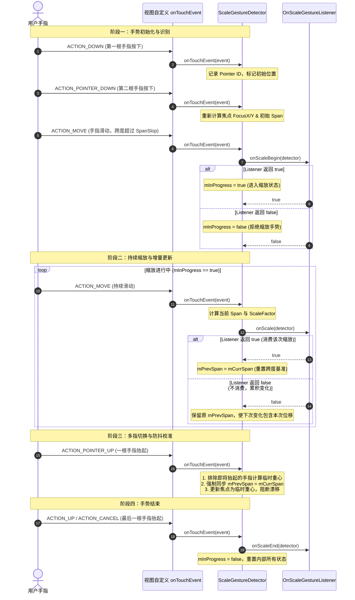

# 5.1.4.3.5 ScaleGestureDetector

在 Android 触控交互体系中，单指手势识别（如点击、滑动、长按）能够满足绝大多数基础的导航与选择操作。然而，随着智能设备屏幕尺寸的扩大以及富媒体应用（如电子地图、高精图片查看器、PDF 阅读器、数据图表及自定义画布）的普及，多点触控（Multi-Touch）交互已成为不可或缺的基石。

`ScaleGestureDetector` 是 Android 框架提供的一个专门用于检测和识别多点触控中“缩放手势”（Pinch & Spread，即双指捏合与张开）的系统级辅助类。它通过拦截和解析原始的 `MotionEvent` 数据流，屏蔽了繁琐的多点触控状态维护工作，将其转化为易于理解的几何属性——如缩放中心焦点、当前跨度、前次跨度以及缩放因子。

本文将从物理与几何模型出发，对 `ScaleGestureDetector` 的数学原理、底层源码逻辑、多点触控状态机、经典焦点跳变瓶颈及其防范技巧进行深度的系统剖析，并在最后提供一套融合常规手势与缩放手势的高质量 Kotlin 实战工程模板。

---

## 一、物理与几何模型：焦点的算术平均与跨度的数学推导

手势缩放交互的核心是精确识别用户手指群的几何重心变化以及它们之间的距离缩放关系。为了在屏幕上模拟出符合物理世界规律的“拉伸”与“捏合”感，`ScaleGestureDetector` 建立了一套严密的数学和几何模型。

### 1. 缩放中心焦点（Focus）的动态算术平均机制

当用户用两根或更多手指触摸屏幕时，进行缩放变换必须依赖一个“锚点”，即缩放中心。如果以视图的左上角 $(0,0)$ 或屏幕几何中心进行缩放，视图在放大时的位移偏离会完全脱离手指的控制，产生严重的视觉违和感。最符合物理直觉的设计是：**缩放中心始终位于所有参与触摸的手指所构成图形的几何质心（重力中心）上**。

在 Android 中，这个质心被称为焦点（Focus）。其 X 轴坐标 `getFocusX()` 与 Y 轴坐标 `getFocusY()` 的计算，基于所有当前活跃触控点（Active Pointers）坐标的**算术平均值**。

设当前屏幕上共有 $N$ 根活跃的手指，每根手指的实时坐标为 $P_i(x_i, y_i)$，其中 $i \in [0, N-1]$。则焦点的数学公式定义为：

$$FocusX = \frac{\sum_{i=0}^{N-1} x_i}{N}$$

$$FocusY = \frac{\sum_{i=0}^{N-1} y_i}{N}$$

在双指触控（$N=2$）的最常见场景中，该公式完美简化为两点连线的中点：

$$FocusX = \frac{x_0 + x_1}{2}$$

$$FocusY = \frac{y_0 + y_1}{2}$$

当第 3 根手指按下或其中一根手指抬起时，$N$ 的值发生改变，`ScaleGestureDetector` 会重新执行算术平均计算。这就需要状态机在极短的事件帧间隔内平滑过渡重心，避免出现由于手指数量改变而导致的焦点剧烈瞬移（后面将详细讨论这一瓶颈）。

### 2. 手势跨度（Span）的代数定义与推导

跨度（Span）是衡量手指间距宽窄的量化指标。许多开发者误以为 Span 仅仅是“最先按下的两根手指之间的直线距离”。实际上，如果用户使用了 3 根甚至更多手指，简单的两点距离公式将无法准确反应多指的整体发散或收拢运动。

为了兼容多指交互的扩展性，Android 源码中将跨度定义为：**所有活跃触控点到几何焦点的绝对距离之算术平均值的 2 倍**。

设焦点为 $F(FocusX, FocusY)$，对于任意活跃点 $P_i(x_i, y_i)$，其到焦点的欧几里得距离为：

$$d_i = \sqrt{(x_i - FocusX)^2 + (y_i - FocusY)^2}$$

那么，整体跨度 $Span$ 的计算公式为：

$$Span = 2 \times \frac{\sum_{i=0}^{N-1} d_i}{N} = \frac{2}{N} \sum_{i=0}^{N-1} \sqrt{(x_i - FocusX)^2 + (y_i - FocusY)^2}$$

下面我们进行代数证明，说明在**双指状态**（$N=2$）下，该公式可以等价退化为双指间的直线距离：

1. 设双指坐标分别为 $P_0(x_0, y_0)$ 与 $P_1(x_1, y_1)$。
2. 此时几何焦点 $F$ 坐标为：
   $$FocusX = \frac{x_0+x_1}{2}, \quad FocusY = \frac{y_0+y_1}{2}$$
3. 计算 $P_0$ 到焦点 $F$ 的距离 $d_0$：
   $$d_0 = \sqrt{\left(x_0 - \frac{x_0+x_1}{2}\right)^2 + \left(y_0 - \frac{y_0+y_1}{2}\right)^2}$$
   $$d_0 = \sqrt{\left(\frac{x_0 - x_1}{2}\right)^2 + \left(\frac{y_0 - y_1}{2}\right)^2} = \frac{1}{2}\sqrt{(x_0 - x_1)^2 + (y_0 - y_1)^2}$$
4. 同理，计算 $P_1$ 到焦点 $F$ 的距离 $d_1$，由对称性易得：
   $$d_1 = \frac{1}{2}\sqrt{(x_0 - x_1)^2 + (y_0 - y_1)^2}$$
5. 将 $d_0$ 和 $d_1$ 代入 $Span$ 公式：
   $$Span = 2 \times \frac{d_0 + d_1}{2} = d_0 + d_1$$
   $$Span = \frac{1}{2}\sqrt{(x_0 - x_1)^2 + (y_0 - y_1)^2} + \frac{1}{2}\sqrt{(x_0 - x_1)^2 + (y_0 - y_1)^2}$$
   $$Span = \sqrt{(x_0 - x_1)^2 + (y_0 - y_1)^2}$$

**证明结论**：在双指场景下，`ScaleGestureDetector` 算出的 $Span$ 恰好等于双指间的几何欧氏距离。当手指数量大于 2 时，该公式则升级为一种鲁棒的、对各个方向运动都敏感的“平均偏离度”度量。

此外，为了应对只在单一方向上进行缩放的场景（如音频编辑软件中波形图的水平拉伸，或股票 K 线图的纵向压缩），`ScaleGestureDetector` 还提供了方向性的跨度分量：

- **水平跨度（SpanX）**：
  $$SpanX = \frac{2}{N} \sum_{i=0}^{N-1} |x_i - FocusX|$$
- **垂直跨度（SpanY）**：
  $$SpanY = \frac{2}{N} \sum_{i=0}^{N-1} |y_i - FocusY|$$

### 3. 缩放比例因子（Scale Factor）的定义与增量计算

缩放比例因子（Scale Factor）是应用直接用来作用于 View 矩阵的物理量。其数学表达式为：

$$ScaleFactor = \frac{CurrentSpan}{PreviousSpan}$$

- **Spread（张开，放大）**：$CurrentSpan > PreviousSpan \implies ScaleFactor > 1.0$。
- **Pinch（捏合，缩小）**：$CurrentSpan < PreviousSpan \implies ScaleFactor < 1.0$。

在多帧的连续触摸事件流中，每一帧都会计算出一个 $ScaleFactor$。开发者需要明确：这个因子是**增量值**（即当前帧相对于前次帧的变化比例），而非**累积值**（相对于手势刚开始时的总比例）。若要实现平滑缩放，每次触发 `onScale` 回调时，应将当前的增量因子与累计缩放变量进行乘积运算：

$$Scale_{total} = Scale_{total} \times ScaleFactor$$

下面的 Mermaid 拓扑图直观展示了双指与三指情况下的坐标映射、焦点重心的物理意义以及 Span 的计算方式：

```mermaid
graph TD
    subgraph Coordinate System
        direction TB
        Origin["原点 (0,0)"] -->|X 轴| XAxis["X 轴 (正向向右)"]
        Origin -->|Y 轴| YAxis["Y 轴 (正向向下)"]
    end

    subgraph Two-Pointer Model
        P0["触摸点 0 (x0, y0)"] --- P1["触摸点 1 (x1, y1)"]
        
        %% 焦点计算
        P0 -->|物理质心贡献| Focus["焦点 Focus (FocusX, FocusY)"]
        P1 -->|物理质心贡献| Focus
        
        noteFocus["FocusX = (x0 + x1) / 2 <br> FocusY = (y0 + y1) / 2"]
        Focus -.-> noteFocus
        
        %% Span 计算
        P0 ===|Span 长度 (等价于双指直线距离)| P1
        noteSpan["Span = √((x0 - x1)² + (y0 - y1)²)"]
        P0 -.-> noteSpan
    end

    subgraph Three-Pointer Extension
        direction LR
        TP0["触控点 0"]
        TP1["触控点 1"]
        TP2["触控点 2"]
        
        TFocus["重心焦点 (TFocusX, TFocusY)"]
        
        TP0 --> TFocus
        TP1 --> TFocus
        TP2 --> TFocus
        
        noteTFocus["TFocus = (∑x_i / 3, ∑y_i / 3)"]
        TFocus -.-> noteTFocus
        
        noteTSpan["Span = 2 * (∑d_i / 3) <br> (其中 d_i 为各点到重心的距离)"]
        TFocus -.-> noteTSpan
    end
```

---

## 二、源码深剖：ScaleGestureDetector 内部多指状态机与事件分流

理解 `ScaleGestureDetector` 的底层原理，离不开对其 `onTouchEvent(MotionEvent)` 源码执行过程与内部状态机的深度解构。

### 1. 核心状态标志与初始化参数

`ScaleGestureDetector` 内部维护了几个关键的成员变量：
- `mInProgress`：布尔值。指示当前是否已建立合法的缩放手势且处于回调进行中。
- `mSpanSlop`：整型像素值。即手势误触的硬性阈值（Touch Slop）。用户两指间距的变化只有突破这一阈值，状态机才被激活。
- `mListener`：`OnScaleGestureListener` 回调接口，由开发者实现。

### 2. 状态机流转时序与回调机制

`ScaleGestureDetector` 并不具备独立的线程，而是依附于 View 的 `onTouchEvent` 驱动。每次事件分发时，它都在内部更新多点触控的物理状态。以下是其内部的多指状态转移及事件派发时序流程图：



### 3. 底层 onTouchEvent(MotionEvent event) 处理流程解密

我们在 Android 源码层级分析 `onTouchEvent` 的处理链路：

#### 阶段 1：活跃指针的筛选与坐标收集
在每次调用 `onTouchEvent` 时，源码首先处理事件类型，如果是 `ACTION_POINTER_UP`（即多点触控中有一根手指离开屏幕），则会获取到这根手指的索引 `skipIndex`：
```java
final int action = event.getActionMasked();
final boolean pointerUp = action == MotionEvent.ACTION_POINTER_UP;
final int skipIndex = pointerUp ? event.getActionIndex() : -1;
```
这一步骤至关重要，它用于在后续的均值计算中排除掉这根即将离屏的手指。

随后，源码会遍历 `MotionEvent` 中的所有触控点，累加它们除 `skipIndex` 之外的 $X$ 和 $Y$ 坐标，用以计算临时焦点：
```java
float sumX = 0, sumY = 0;
final int count = event.getPointerCount();
final int div = pointerUp ? count - 1 : count;

for (int i = 0; i < count; i++) {
    if (skipIndex == i) continue;
    sumX += event.getX(i);
    sumY += event.getY(i);
}
final float focusX = sumX / div;
final float focusY = sumY / div;
```
紧接着，根据算出的焦点坐标，再次遍历所有活跃的触控点，计算各点到焦点的距离，并求得当前的平均 Span、SpanX 和 SpanY：
```java
float devSumX = 0, devSumY = 0;
for (int i = 0; i < count; i++) {
    if (skipIndex == i) continue;
    devSumX += Math.abs(event.getX(i) - focusX);
    devSumY += Math.abs(event.getY(i) - focusY);
}
final float devX = devSumX / div;
final float devY = devSumY / div;

// 这里的 2 倍对应了 Span 定义中的乘数 2
final float spanX = devX * 2;
final float spanY = devY * 2;
final float span = (float) Math.hypot(spanX, spanY); // 或者更严谨的基于多点到焦点偏离度的综合计算
```

#### 阶段 2：状态机的条件触发
在完成物理参数计算后，状态机根据 `mInProgress` 和事件类型进行逻辑分支分流：
- **如果处于非缩放状态（`mInProgress == false`）**：
  在 `ACTION_MOVE` 期间，当跨度 `span` 超过了 `mSpanSlop`，就会尝试调用 `mListener.onScaleBegin(this)`。
  如果开发者覆写的 `onScaleBegin` 返回了 `true`，则标志着手势被采纳，内部变量 `mInProgress` 被设为 `true`，缩放动作正式确立。
- **如果已处于缩放状态（`mInProgress == true`）**：
  在持续的 `ACTION_MOVE` 过程中，会触发高频回调 `mListener.onScale(this)`。

#### 阶段 3：OnScale 回调返回值对跨度基准的影响
`OnScaleGestureListener.onScale(ScaleGestureDetector detector)` 接口返回一个布尔值，其设计极为精妙，控制着 $ScaleFactor$ 的底座：
- **若返回 `true`**：意味着开发者已经在 UI 上消费（处理）了这次缩放变化。源码内部会执行：
  ```java
  mPrevSpanX = mCurrSpanX;
  mPrevSpanY = mCurrSpanY;
  mPrevSpan = mCurrSpan;
  ```
  这样，下一帧计算出来的 `ScaleFactor` 就会以当前这一帧的 Span 作为分母（增量模型）。
- **若返回 `false`**：意味着开发者跳过了这次缩放处理。源码内部**不会**更新 `mPrevSpan`。当下一次事件到来时，所计算的 `ScaleFactor` 分母依然是上一次已被消费的历史 Span。这允许开发者积攒微小的手指滑动距离，直到缩放比例变化累积到一定阈值后才去响应用于缩放，有效地规避了由手部细微颤抖造成的闪烁。

---

## 三、经典瓶颈：缩放焦点的“跳变漂移”物理本质与防范技巧

在多点触控的复杂交互场景中，最容易被用户感知并严重影响交互品质的问题就是**缩放焦点的瞬间跳变（Focus Shift）**，从而造成画布的“抖动”或“瞬移”。

### 1. 焦点漂移的物理本质

设想一个极简的场景：用户使用双指对图片进行缩放，手指 $A$ 位于坐标 $(100, 100)$，手指 $B$ 位于坐标 $(300, 100)$。
此时焦点为中点 $(200, 100)$。
当用户将手指 $A$ 从屏幕抬起时，屏幕上只剩下手指 $B$。在 $A$ 离屏的一瞬间，活跃的手指数量由 2 突变为 1。根据算术平均公式，焦点坐标会瞬间从原来的 $(200, 100)$ 跳变到手指 $B$ 的坐标 $(300, 100)$。

如果开发者的平移矩阵计算逻辑是：
```kotlin
val dx = detector.focusX - mLastFocusX
val dy = detector.focusY - mLastFocusY
matrix.postTranslate(dx, dy)
```
在这个瞬间，图片就会因为焦点突变而发生 $100\text{px}$ 的瞬移。对于用户而言，表现为手指一旦抬起，图片就会突然闪烁着偏移一段距离。

### 2. 源码级预防策略：抬指事件中的 `skipIndex` 与 Span 重置

为了解决这一痛点，Android 源码在底层进行了校准。
In `onTouchEvent` 中，当触发 `ACTION_POINTER_UP`（即有多指之一离开屏幕）时，系统立刻将即将离屏的那个 Finger Index 记为 `skipIndex`。

在求和计算焦点时，它通过 `if (i == skipIndex) continue;` 提前排除了该手指。也就是说，**在手指尚未完全离开屏幕的这一帧，焦点就已经切换到了剩余手指组成的重心上**。

在计算出这个“临时重心”后，为了防止在下一个 Move 事件帧中，因为计算公式的分母突然由 $N$ 变为 $N-1$ 导致 Span 和 ScaleFactor 跳变，源码会执行重置操作：
```java
mInProgress = false; // 暂时挂起或以新焦点校准
// 重新调用初始化，使得 mPrevSpan = mCurrSpan
```
通过在 `ACTION_POINTER_UP` 中强制同步 `mPrevSpan = mCurrSpan`，强行清空了由手指增减带来的增量跨度变化，阻断了突变的比例因子被派发给 `onScale`。

### 3. QuickScale 机制与 Android 版本变化

为了提供极佳的单手操作体验，Android 在 4.4 版本 (KitKat, API 19) 引入了 **QuickScale（单指双击并滑动）** 机制。关于此功能的版本发布记录，可以参见根目录下的 [AndroidVersionChangeLog.md](../../../../../../AndroidVersionChangeLog.md)。

- **物理机制**：用户双击屏幕，但在第二次按下后手指不抬起，而是立即向上或向下拖拽。此时虽然只有一根手指在屏幕上，但 `ScaleGestureDetector` 内部的 `mQuickScaleDetector` 会识别出该特定序列，并虚拟出双指捏合的效果——以双击处作为虚拟焦点，根据手指在 Y 轴方向上的滑动位移来映射 Span 的增减，从而输出 ScaleFactor。
- **配置防范**：若不需要单指双击缩放，可以通过 `setQuickScaleEnabled(false)` 将其关闭，避免由于用户快速点击屏幕触发意外的放大动作。

### 4. 自定义防漂移技巧

虽然系统源码在 `ACTION_POINTER_UP` 时同步了 Span，但在复杂的 Matrix 复合变换（同时进行 `Scale` 和 `Translate`）中，由于事件分发的微秒级时差，`onScale` 在接收到手指数量突变的事件帧时，依然可能会收到微小的焦点偏差。为了保障交互的高品质，我们可以在自定义 View 中采取以下外部限制技巧：

1. **变动帧拦截**：检测当前的 `MotionEvent.getPointerCount()`。当检测到手指数量发生变化（从 1 变 2，或 2 变 1，或 2 变 3）的瞬间，在当次 `onTouchEvent` 中，只更新上一次焦点的记录值（`mLastFocusX = detector.focusX`），而**不应用任何 Matrix 偏移平移量**。
2. **偏差过滤**：如果两帧之间的焦点位移超过了一个非自然的物理极限阈值（例如单帧位移大于 $50\text{px}$，这在正常的拖动中几乎不可能在数毫秒内发生），则判定为异常跳变，丢弃该帧的平移分量。

---

## 四、多手势冲突解决与流畅图片缩放器实战

在一个完整的交互式 View（如大图浏览器）中，通常存在三种手势逻辑的叠加冲突：
1. **单指滑动**：用于平移（Scroll）查看大图的不同区域。
2. **双指捏合**：用于自由缩放（Scale）大图。
3. **双击手势**：用于快速放大到指定比例或还原。

### 1. 手势冲突的根源与解决逻辑

当用户双指按下的一瞬间，系统通常会由于两指按下的细微时间差，优先触发 `GestureDetector.OnGestureListener` 的 `onScroll` 回调，这会导致图片在缩放前产生一次难看的“微抖动”。

而在用户双指缩放完毕抬起手指的一瞬间，因为两根手指不可能在同一毫秒完全离屏，必然会剩下一根手指触碰屏幕，此时如果系统误判为单指的快速拖拽，就会在缩放结束时触发一次意外的滑动（Scroll）甚至惯性飞逝（Fling）。

为了彻底解决这些冲突，我们需要建立一套**互斥的手势状态保护锁**：
- 在 `ScaleGestureDetector.onScaleBegin` 触发时，将全局标志位 `isScaling` 置为 `true`。
- 在 `GestureDetector.onScroll` 中，如果发现 `isScaling == true`，则直接拦截，不执行任何 Matrix 平移。
- 在双指完全离开屏幕（`ACTION_UP` 或 `ACTION_CANCEL`）之前，不能立即解冻 `isScaling`。应当等待整个事件流结束（即在 `onTouchEvent` 的 `ACTION_UP` 分支中）才将其设为 `false`。这为缩放手势提供了“抬指保护期”。

### 2. 完整的 Kotlin 生产级实战模板

下面提供一个实现了双指缩放、平滑双击动画、单指平移、边界回弹与防漂移的高质量自定义 View 代码实现：

```kotlin
package com.example.zoom

import android.animation.Animator
import android.animation.AnimatorListenerAdapter
import android.animation.ValueAnimator
import android.content.Context
import android.graphics.Matrix
import android.graphics.RectF
import android.graphics.drawable.Drawable
import android.util.AttributeSet
import android.view.GestureDetector
import android.view.MotionEvent
import android.view.ScaleGestureDetector
import android.view.ViewTreeObserver
import android.view.animation.DecelerateInterpolator
import androidx.appcompat.widget.AppCompatImageView

/**
 * 支持双击缩放、双指捏合缩放、单指平移及边界越界回弹的交互式 ImageView
 */
class InteractiveZoomImageView @JvmOverloads constructor(
    context: Context,
    attrs: AttributeSet? = null,
    defStyleAttr: Int = 0
) : AppCompatImageView(context, attrs, defStyleAttr),
    ScaleGestureDetector.OnScaleGestureListener,
    GestureDetector.OnDoubleTapListener,
    ViewTreeObserver.OnGlobalLayoutListener {

    private val mScaleMatrix = Matrix()
    private val mMatrixValues = FloatArray(9)

    // 手势识别器
    private val mScaleDetector = ScaleGestureDetector(context, this)
    private val mGestureDetector = GestureDetector(context, GestureDetector.SimpleOnGestureListener().apply {
        setOnDoubleTapListener(this@InteractiveZoomImageView)
    })

    // 缩放边界控制
    private var mMinScale = 1.0f
    private var mMidScale = 2.0f
    private var mMaxScale = 4.0f

    // 状态记录
    private var mIsScaling = false
    private var mIsAnimating = false
    private var mOnce = false

    // 上一次焦点的物理位置，用于计算拖拽平移量
    private var mLastFocusX = 0f
    private var mLastFocusY = 0f
    private var mActivePointerCount = 0

    init {
        super.setScaleType(ScaleType.MATRIX)
    }

    override fun onAttachedToWindow() {
        super.onAttachedToWindow()
        viewTreeObserver.addOnGlobalLayoutListener(this)
    }

    override fun onDetachedFromWindow() {
        super.onDetachedFromWindow()
        viewTreeObserver.removeOnGlobalLayoutListener(this)
    }

    /**
     * 当 View 布局完成，初始化图片的初始缩放比例，使其自适应屏幕并居中
     */
    override fun onGlobalLayout() {
        if (!mOnce) {
            val d: Drawable? = drawable ?: return
            val width = width
            val height = height

            // 获取图片资源的原始宽高
            val dw = d.intrinsicWidth
            val dh = d.intrinsicHeight

            var scale = 1.0f

            // 根据图片宽高比与 View 宽高比，计算自适应的初始缩放比例
            if (dw > width && dh <= height) {
                scale = width.toFloat() / dw
            }
            if (dh > height && dw <= width) {
                scale = height.toFloat() / dh
            }
            if (dw > width && dh > height) {
                scale = Math.min(width.toFloat() / dw, height.toFloat() / dh)
            }
            if (dw <= width && dh <= height) {
                scale = Math.min(width.toFloat() / dw, height.toFloat() / dh)
            }

            mMinScale = scale
            mMidScale = scale * 2.0f
            mMaxScale = scale * 4.0f

            // 将图片平移至 View 中心位置
            val dx = (width - dw) / 2f
            val dy = (height - dh) / 2f

            mScaleMatrix.postTranslate(dx, dy)
            mScaleMatrix.postScale(scale, scale, width / 2f, height / 2f)
            imageMatrix = mScaleMatrix
            mOnce = true
        }
    }

    /**
     * 获取当前的实时缩放比例
     */
    private fun getScale(): Float {
        mScaleMatrix.getValues(mMatrixValues)
        return mMatrixValues[Matrix.MSCALE_X]
    }

    // --- OnScaleGestureListener 回调实现 ---

    override fun onScaleBegin(detector: ScaleGestureDetector): Boolean {
        mIsScaling = true
        // 记录手势开始时的物理焦点坐标，防抖初始化
        mLastFocusX = detector.focusX
        mLastFocusY = detector.focusY
        return true
    }

    override fun onScale(detector: ScaleGestureDetector): Boolean {
        val d: Drawable = drawable ?: return true
        var scaleFactor = detector.scaleFactor
        val scale = getScale()

        // 边界保护控制：防止超出最大和最小缩放因子
        if ((scale < mMaxScale && scaleFactor > 1.0f) || (scale > mMinScale && scaleFactor < 1.0f)) {
            if (scaleFactor * scale < mMinScale) {
                scaleFactor = mMinScale / scale
            }
            if (scaleFactor * scale > mMaxScale) {
                scaleFactor = mMaxScale / scale
            }

            // 以焦点为中心，执行矩阵缩放运算
            mScaleMatrix.postScale(scaleFactor, scaleFactor, detector.focusX, detector.focusY)
            checkBorderAndCenterWhenScale()
            imageMatrix = mScaleMatrix
        }
        return true
    }

    override fun onScaleEnd(detector: ScaleGestureDetector) {
        // 缩放手势物理结束，但为了防抖保护，不在此处立即将 mIsScaling 置为 false
    }

    // --- OnDoubleTapListener 回调实现 ---

    override fun onSingleTapConfirmed(e: MotionEvent): Boolean = false

    override fun onDoubleTap(e: MotionEvent): Boolean {
        if (mIsAnimating) return true

        val x = e.x
        val y = e.y
        val currentScale = getScale()

        // 双击手势：如果在初始大小，则放大到中等比例；如果已经在放大状态，则还原至初始大小
        val targetScale = if (currentScale < mMidScale) {
            mMidScale
        } else {
            mMinScale
        }

        // 使用属性动画实现平滑过渡，避免视觉跳变
        ValueAnimator.ofFloat(currentScale, targetScale).apply {
            duration = 250
            interpolator = DecelerateInterpolator()
            addUpdateListener { animation ->
                val animatedScale = animation.animatedValue as Float
                val fractionScale = animatedScale / getScale()
                mScaleMatrix.postScale(fractionScale, fractionScale, x, y)
                checkBorderAndCenterWhenScale()
                imageMatrix = mScaleMatrix
            }
            addListener(object : AnimatorListenerAdapter() {
                override fun onAnimationStart(animation: Animator) {
                    mIsAnimating = true
                }
                override fun onAnimationEnd(animation: Animator) {
                    mIsAnimating = false
                }
            })
            start()
        }
        return true
    }

    override fun onDoubleTapEvent(e: MotionEvent): Boolean = false

    // --- 触摸事件接管与手势冲突解决 ---

    override fun onTouchEvent(event: MotionEvent): Boolean {
        // 优先将事件派发给缩放检测器和常规双击检测器
        mScaleDetector.onTouchEvent(event)
        mGestureDetector.onTouchEvent(event)

        val count = event.pointerCount
        val action = event.actionMasked

        // 获取当前帧的焦点坐标（排除了即将抬起的手指）
        val pointerUp = action == MotionEvent.ACTION_POINTER_UP
        val skipIndex = pointerUp ? event.actionIndex : -1
        var sumX = 0f
        var sumY = 0f
        var div = if (pointerUp) count - 1 else count
        for (i in 0 until count) {
            if (i == skipIndex) continue
            sumX += event.getX(i)
            sumY += event.getY(i)
        }
        val focusX = sumX / div
        val focusY = sumY / div

        // 检测到手指数量发生变化时（如单双指切换），强制重置上一次坐标锚点，阻断物理位移的瞬间跳变
        if (mActivePointerCount != div) {
            mLastFocusX = focusX
            mLastFocusY = focusY
            mActivePointerCount = div
        }

        when (action) {
            MotionEvent.ACTION_DOWN -> {
                if (mIsAnimating) parent.requestDisallowInterceptTouchEvent(true)
            }
            MotionEvent.ACTION_MOVE -> {
                val dx = focusX - mLastFocusX
                val dy = focusY - mLastFocusY

                // 只有当非缩放状态，且当前缩放比例大于初始比例（即图片已被放大）时，才允许单指拖拽平移
                if (!mIsScaling && getScale() > mMinScale) {
                    val rect = getMatrixRectF()
                    if (drawable != null) {
                        var deltaX = dx
                        var deltaY = dy
                        
                        // 如果图片宽度小于 View 宽度，则禁止水平拖拽
                        if (rect.width() < width) {
                            deltaX = 0f
                        }
                        // 如果图片高度小于 View 高度，则禁止垂直拖拽
                        if (rect.height() < height) {
                            deltaY = 0f
                        }
                        
                        mScaleMatrix.postTranslate(deltaX, deltaY)
                        checkBorderAndCenterWhenTranslate()
                        imageMatrix = mScaleMatrix
                    }
                }
                mLastFocusX = focusX
                mLastFocusY = focusY
            }
            MotionEvent.ACTION_UP, MotionEvent.ACTION_CANCEL -> {
                // 手势流完全终止，释放手势锁定
                mIsScaling = false
                mActivePointerCount = 0
            }
        }
        return true
    }

    /**
     * 根据当前 Matrix 变换矩阵，计算图片在 View 中映射后的 RectF 边界
     */
    private fun getMatrixRectF(): RectF {
        val rect = RectF()
        val d = drawable
        if (d != null) {
            rect.set(0f, 0f, d.intrinsicWidth.toFloat(), d.intrinsicHeight.toFloat())
            mScaleMatrix.mapRect(rect)
        }
        return rect
    }

    /**
     * 缩放时进行边界控制与居中修正，防止缩放后图片越界产生白边，或者小于 View 尺寸时偏离中心
     */
    private fun checkBorderAndCenterWhenScale() {
        val rect = getMatrixRectF()
        var deltaX = 0f
        var deltaY = 0f

        val viewWidth = width
        val viewHeight = height

        // 水平方向修正
        if (rect.width() >= viewWidth) {
            if (rect.left > 0) {
                deltaX = -rect.left
            }
            if (rect.right < viewWidth) {
                deltaX = viewWidth - rect.right
            }
        } else {
            deltaX = viewWidth / 2f - rect.right + rect.width() / 2f
        }

        // 垂直方向修正
        if (rect.height() >= viewHeight) {
            if (rect.top > 0) {
                deltaY = -rect.top
            }
            if (rect.bottom < viewHeight) {
                deltaY = viewHeight - rect.bottom
            }
        } else {
            deltaY = viewHeight / 2f - rect.bottom + rect.height() / 2f
        }

        mScaleMatrix.postTranslate(deltaX, deltaY)
    }

    /**
     * 拖动平移时的越界阻尼边界控制，保证图片边缘与 View 边缘对齐，禁止拉出视界之外
     */
    private fun checkBorderAndCenterWhenTranslate() {
        val rect = getMatrixRectF()
        var deltaX = 0f
        var deltaY = 0f

        val viewWidth = width
        val viewHeight = height

        if (rect.left > 0 && rect.width() >= viewWidth) {
            deltaX = -rect.left
        }
        if (rect.right < viewWidth && rect.width() >= viewWidth) {
            deltaX = viewWidth - rect.right
        }
        if (rect.top > 0 && rect.height() >= viewHeight) {
            deltaY = -rect.top
        }
        if (rect.bottom < viewHeight && rect.height() >= viewHeight) {
            deltaY = viewHeight - rect.bottom
        }

        mScaleMatrix.postTranslate(deltaX, deltaY)
    }
}
```

### 3. 代码的数学与工程精要解析

在上述实战代码中，有几处关键的工程设计值得深入体会：

1. **`ViewTreeObserver` 动态初始化**：
   通过 `onGlobalLayout()` 回调，能够在图片加载完成后获取到真实的 View 宽高和 Drawable 宽高，自动计算出最完美的初始自适应缩放比 `mMinScale`。这避免了直接使用静态值导致在不同分辨率屏幕上显示失真的问题。
2. **多点触控的 `onTouchEvent` 预处理防漂移**：
   在拖拽计算中，我们并没有直接使用 `ScaleGestureDetector.getFocusX/Y` 驱动平移，而是通过原生遍历计算 `focusX` 和 `focusY` 并剔除了 `skipIndex`。当检测到活跃手指数量 `div` 改变时，立即将 `mLastFocusX = focusX`，强制在多指状态切换的那一帧中将位移差值置零，从根本上消除了单双指切换引起的坐标跳变。
3. **`checkBorderAndCenter` 的矩阵逆向修正**：
   当缩放或者平移使图片的边缘偏离了 View 的边缘（如把放大后的图片拖到了视窗之外）时，计算 `deltaX` 和 `deltaY` 进行平移纠正，确保用户既能自由缩放，又能保证画面在视图内不留虚空，体现了极佳的拟真物理限制。
