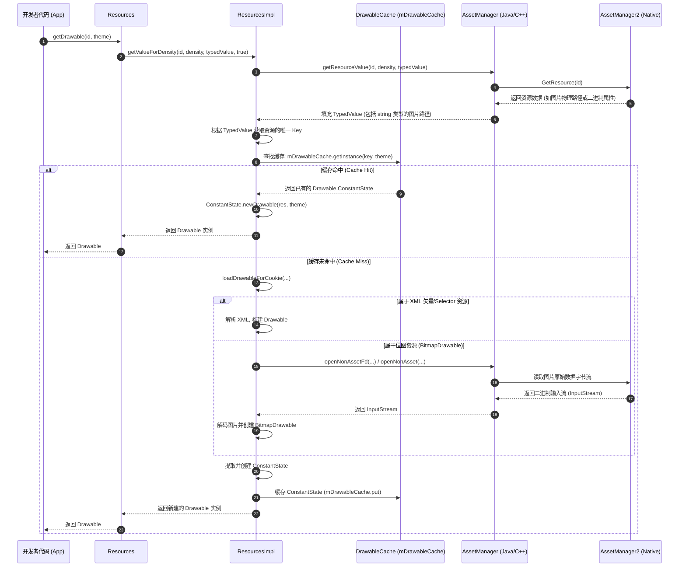
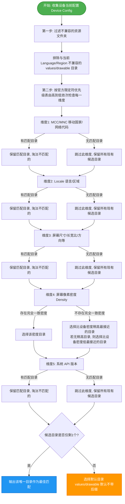

# 5.1.4.4.1 Resource

#### 1. 导言
在 Android 应用的运行过程中，界面适配是一项极为复杂的工程。设备形态从折叠屏、平板到各式各样的手机，屏幕密度从 ldpi 横跨至 xxhdpi 甚至更高，语言环境与用户偏好也千差万别。Android 资源系统（Resources System）是保障应用界面在多分辨率、多语言和多元化设备配置下平滑适配的核心框架。

其高效率并非来自于简单的运行时动态判断，而是源自于精妙的**编译期索引（R.java/resources.arsc）**与**运行时多级缓存与 Native 高效检索机制**的协同工作。本文将从 Resources 的生命源头构建开始，深入剖析其底层的检索、加载、多维限定符匹配及配置变更生命周期细节。

---

#### 2. Resources 的生命源头：构建与初始化流程
当我们调用 `Context.getResources()` 时，通常只拿到一个简单的 `Resources` 对象，但这个对象背后却是一个复杂的、高度解耦的运行时架构体系。

##### 2.1 ResourcesManager 的单例设计与职责定位
在 Android 7.0 (API 24) 之前，`Resources` 对象的内部实现比较直接，而从 Android 7.0 开始（关于 7.0 版本的核心重构变更，可以参见根目录下的 [AndroidVersionChangeLog.md](../../../../../../AndroidVersionChangeLog.md#android-70--71api-24--25)），Google 对资源管理系统进行了深度重构，引入了 `ResourcesImpl` 机制。

在现代 Android 架构中：
- **`Resources`**：仅作为一个面向开发者的“逻辑包装类”（Facade），它并不包含任何核心的资源检索逻辑或缓存表。它所拥有的方法（如 `getString()`、`getDrawable()`）基本上都是转发给其内部的 `mResourcesImpl` 对象来执行。
- **`ResourcesImpl`**：则是真正的“物理实现类”，负责底层的资源读取、缓存池维护、以及与 Native 层的 `AssetManager` 交互。
- **`ResourcesManager`**：扮演着应用进程级的“全局资源协调者”（单例模式）。它负责统一管理和分配所有的 `ResourcesImpl`。在应用进程运行期间，每当需要创建一个新的 `Resources` 时，都会通过 `ResourcesManager` 过滤和分发。

##### 2.2 资源配置的唯一标识：ResourcesKey
`ResourcesImpl` 的重用与缓存，是通过 `ResourcesKey` 来进行精准匹配的。`ResourcesKey` 包含了能够唯一确定一个资源配置环境的所有关键信息，其核心成员变量如下：
- `mResDir`：当前应用主 APK 或者是插件 APK 的物理文件路径。
- `mSplitResDirs`：分包 APK（Split APKs）的路径数组，用于支持动态功能分发机制（Play Feature Delivery 等）。
- `mOverlayDirs`：资源覆盖目录路径（主要用于 Runtime Resource Overlay 机制，即 RRO，以支持厂商定制或主题框架）。
- `mLibDirs`：当前应用依赖的共享库（Shared Libraries）的资源包路径。
- `mDisplayId`：当前 Resources 绑定的显示屏 ID，用以完美适配多屏及折叠屏分屏环境。
- `mOverrideConfiguration`：局部的覆盖配置（例如在某个特定的 Activity 中，开发者可以通过 `applyOverrideConfiguration()` 修改该 Activity 的配置，这就会生成一个特有的 `ResourcesKey`）。
- `mCompatInfo`：屏幕兼容性缩放信息（Compatibility Info）。

只有当以上所有维度完全一致时，生成的 `ResourcesKey` 才会等价。`ResourcesManager` 就是利用 `ResourcesKey` 作为键值，在进程全局缓存池中检索 `ResourcesImpl`。

##### 2.3 核心构建链条源码剖析
当我们启动一个 Activity 时，系统会通过 `ActivityThread` 实例化 `ContextImpl`，并在其内部构建 `Resources` 实例。其源码级精简链路如下：

```java
// ContextImpl.java 
private ContextImpl(...) {
    ...
    Resources resources = packageInfo.getResources();
    if (resources != null) {
        if (displayId == Display.DEFAULT_DISPLAY) {
            mResources = resources;
        } else {
            // 多屏环境，需要通过 ResourcesManager 获取特定 Display 的 Resources
            mResources = resourcesManager.getResources(
                activityToken,
                packageInfo.getResDir(),
                packageInfo.getSplitResDirs(),
                packageInfo.getOverlayDirs(),
                packageInfo.getLibDirs(),
                displayId,
                overrideConfiguration,
                packageInfo.getCompatibilityInfo(),
                classLoader
            );
        }
    }
}
```

`ResourcesManager.getResources()` 方法的底层关键执行逻辑可以概括为以下步骤：
1. **构建 ResourcesKey**：首先利用传入的参数构建一个 `ResourcesKey` 实例。
2. **检索 ResourcesImpl 缓存**：
   在 `ResourcesManager` 内部维护着一个强引用的全局缓存表 `ArrayMap<ResourcesKey, WeakReference<ResourcesImpl>> mResourceImpls`。
   如果在此表中找到了对应 key 且未被 GC 回收的 `ResourcesImpl` 引用，则直接复用该实现类。
3. **未命中时创建 ResourcesImpl**：
   如果缓存中不存在，则调用 `createResourcesImpl(ResourcesKey key)`：
   - 实例化 `AssetManager`。
   - 向 `AssetManager` 中添加 APK 资源路径（调用 `addAssetPath`）。
   - 创建 `ResourcesImpl` 实例，并将 `AssetManager`、当前的 `DisplayMetrics` 和 `Configuration` 传入其中，完成绑定。
4. **包装与返回**：
   通过 `findOrCreateResourcesLocked()` 方法，将该 `ResourcesImpl` 包装在一个新的 `Resources` 对象（或者是重用已有的逻辑包装对象）中，并将此包装对象返回给 `ContextImpl`。

通过这种“多对一”的设计，即使应用中存在成百上千个 Context 实例，只要它们的屏幕配置、APK 路径和语言环境相同，它们底层的 `ResourcesImpl` 都是同一个实例，大大节省了内存空间并提高了资源复用效率。

---

#### 3. 源码深度剖析：资源加载的双重脉络
在 Android 资源系统中，资源的检索和加载可以分为两大脉络：**轻量级数据（如文本、数值、布尔值等）**与**重量级对象（如 Drawable、ColorStateList 等）**。

##### 3.1 字符与值读取的轻量级脉络（getText / getValue）
当我们调用 `resources.getText(int id)` 时，其源码执行路径会直接调用 `ResourcesImpl.getValue()`。

```java
// ResourcesImpl.java
public void getValue(@AnyRes int id, TypedValue outValue, boolean resolveRefs) {
    boolean found = mAssets.getResourceValue(id, 0, outValue, resolveRefs);
    if (found) {
        return;
    }
    throw new NotFoundException("Resource ID #0x" + Integer.toHexString(id));
}
```

在这里，`mAssets` 即为 `AssetManager` 的实例。
- **AssetManager2 的 Native 查找**：`AssetManager.getResourceValue()` 会跨越 JNI 边界，调用 Native 层的 `AssetManager2`（自 Android 8.0 引入的重构，相关历史细节可参考 [AndroidVersionChangeLog.md](../../../../../../AndroidVersionChangeLog.md#android-80--81api-26--27)）。
- **`resources.arsc` 检索**：在 Native 层，`AssetManager2` 会在已经加载并解析的 `resources.arsc` 二进制表结构中进行查找。`resources.arsc` 是一个高度优化的紧凑格式索引表。它通过 `PackageID`、`TypeID` 和 `EntryID` 三级结构进行资源定位。
  - **Package ID**：通常系统资源为 `0x01`，应用资源为 `0x7f`。
  - **Type ID**：对应不同的资源类型（如 `string`、`drawable`、`layout` 等）。
  - **Entry ID**：具体资源在相应类型数组中的索引。
- **TypedValue 值的回填**：一旦检索成功，Native 层会将资源的物理数据类型（如原始 String、布尔值、颜色值、整型数值或图片文件的相对路径）填充到 Java 层的 `TypedValue` 对象中。
- **StringBlock 缓存**：对于 String 类型，所有的文本资源都集中在 `resources.arsc` 的全局字符串池中。Java 层通过 `StringBlock` 数组将 Native 字符串池的内容暴露出来，从而避免了每次读取 String 都在 Native 层与 Java 层之间进行大文本对象的内存复制。

##### 3.2 图片与可绘制物加载的重量级脉络（getDrawable）
与 String 的直接拷贝不同，图片（Drawable）是以独立文件存储的（如 `.png`、`.xml` 等），其加载涉及到 I/O 读写、内存解码和图形对象的实例化。因此，Android 为其设计了高度复杂的两级缓存。

```java
// ResourcesImpl.java 伪代码分析
Drawable loadDrawable(Resources wrapper, TypedValue value, int id, int density, Resources.Theme theme) {
    final boolean isColorDrawable = (value.type >= TypedValue.TYPE_FIRST_COLOR_INT 
                                    && value.type <= TypedValue.TYPE_LAST_COLOR_INT);
    
    // 生成缓存的唯一 Key，基于资源路径的 hash 或者 id
    long key = isColorDrawable ? value.data : (((long) value.assetCookie) << 32) | value.data;
    
    // 1. 尝试从缓存中检索实例
    Drawable cachedDrawable = mDrawableCache.getInstance(key, wrapper, theme);
    if (cachedDrawable != null) {
        return cachedDrawable;
    }
    
    // 2. 缓存未命中，创建或获取已有的 Drawable.ConstantState
    Drawable.ConstantState cs;
    if (isColorDrawable) {
        cs = mColorDrawableCache.get(key);
    } else {
        cs = mDrawableCache.get(key);
    }
    
    Drawable dr = null;
    if (cs != null) {
        dr = cs.newDrawable(wrapper, theme);
    } else {
        // 3. 从物理流中加载
        dr = loadDrawableForCookie(wrapper, value, id, density);
    }
    
    // 4. 将 ConstantState 存入缓存
    if (dr != null) {
        dr.setChangingConfigurations(value.changingConfigurations);
        cacheDrawable(value, isColorDrawable, mDrawableCache, mColorDrawableCache, key, dr);
    }
    return dr;
}
```

其级联缓存检索机制分为以下几步：
1. **第一级缓存（实例级）**：通过 `mDrawableCache.getInstance(key, wrapper, theme)` 尝试获取。这个方法能够返回一个立即可用的 `Drawable` 实例。如果该 `Drawable` 绑定了当前传入的 `Theme`（主题），且配置没有变更，则可以完美复用。
2. **第二级缓存（状态级）**：如果第一级缓存未命中，则去 `mDrawableCache` (实际是 `ConfigurationBoundIndexedCache`) 中获取 `Drawable.ConstantState`。
3. **物理加载与解析**：如果 `ConstantState` 也未命中，则必须调用 `loadDrawableForCookie` 从物理存储中读取资源：
   - 如果 `TypedValue` 中记录的资源路径以 `.xml` 结尾，则调用 `XmlBlock` 将其解析为矢量图（`VectorDrawable`）或状态列表（`StateListDrawable`）等。
   - 如果是 `.png` 或 `.webp` 等图片文件，则通过 `AssetManager` 打开非 Asset 文件输入流（`openNonAsset`），调用 Native 层的解码库将其解码为 `Bitmap`，并用 `BitmapDrawable` 包装。

##### 3.3 ConstantState 的设计哲学与内存优化意义
在资源系统中，`Drawable.ConstantState` 是极具物理内存优化价值的核心设计。
- **什么是 ConstantState**：`ConstantState` 负责存储该 Drawable **不随实例变化而改变的共享静态数据**。比如，对于一个 `BitmapDrawable`，它的 `ConstantState` 中保存着 `Bitmap` 的像素数组数据、原始宽度、高度、默认像素密度（density）和默认的画笔 Paint 状态；对于 `VectorDrawable`，它保存着矢量路径（Path）几何数据和颜色树。
- **什么是 Drawable 实例**：`Drawable` 则是暴露给 View 直接使用的实例，它仅保存**与当前使用场景密切相关的状态**，如绘制边界（`mBounds`）、透明度（`alpha`）、色调过滤（`ColorFilter`）以及可见性状态。
- **内存优化价值**：当应用在不同的 View 中多次显示同一个 Drawable 时，Android 并不需要在内存中重复加载多份 Bitmap 像素数据。这些 View 的 Drawable 实例在底层全部共享同一个 `ConstantState` 的 `Bitmap` 指针。这意味着，在应用内存中，庞大的像素占用始终只有一份，多个 Drawable 实例仅占用极其微弱的逻辑控制字段内存。

  > [!TIP]
  > 在应用内存中，庞大的像素占用始终只有一份，多个 Drawable 实例仅占用极其微弱的逻辑控制字段内存。如果需要对某个 Drawable 的属性进行定制而不影响其他 View 的共享显示，必须调用 `drawable.mutate()` 克隆底层的 ConstantState。

---

##### 3.4 Resources.getDrawable() 级联缓存检索与 Native 映射时序流程图
以下是 `getDrawable()` 加载图片的完整时序流程：



---

#### 4. 核心匹配规则：多限定符最佳匹配算法
Android 资源目录可以通过多种限定符组合（如 `values-zh-rCN-land`、`drawable-xhdpi-v29`）进行命名。当设备处于特定配置下，系统在检索资源 ID 时，会通过 Native 层执行极其严苛的**最佳匹配选择算法**（Best Match Algorithm）。

##### 4.1 最佳匹配判定树的核心过滤与淘汰机制
当我们需要查找某个资源 ID 时，系统会得到一堆候选的目录。寻找最佳目录的计算步骤遵循以下过滤公式和判定树规则：

###### 1. 过滤绝对不兼容的资源（初步筛选）
遍历所有的文件夹目录，首先**排除与设备当前 Configuration 存在冲突的限定符文件夹**。
- **例如**：如果设备当前语言为 `zh-rCN`（中文-中国），那么带有 `en-rUS`、`ja-rJP` 等其他语言限定符的目录会立即被剔除。但是，不带语言限定符的目录（即默认目录 `values` 或 `drawable`）以及仅带有 `zh` 的目录则会被保留，作为备选项。
- **例如**：如果设备屏幕方向为 `port`（竖屏），那么带 `land`（横屏）的文件夹直接被淘汰。

###### 2. 依次比对最高优先级限定符（维度步进）
在保留下来的候选目录列表中，系统会根据 Android 官方定义的**限定符优先级顺序表**（该顺序由 Android 底层源码硬编码确定），从高优先级到低优先级依次进行检查。

以下是部分关键限定符的优先级从高到低的排序（更完整的历史版本演进记录可参阅 [AndroidVersionChangeLog.md](../../../../../../AndroidVersionChangeLog.md)）：
1. **MCC 和 MNC**（移动国家代码/移动网络代码，如 `mcc460`）
2. **Locale**（语言与区域，如 `zh-rCN`）
3. **layoutDirection**（布局方向，如 `ldrtl`）
4. **smallestWidth**（最小宽度，如 `sw600dp`）
5. **Screen size**（屏幕尺寸，如 `layout-large`）
6. **Screen aspect**（屏幕长宽比，如 `notlong`）
7. **Screen round**（圆形或非圆形屏幕，如 `round`）
8. **Screen orientation**（屏幕方向，如 `land`）
9. **UI mode**（夜间/车载模式等，如 `night`）
10. **Screen pixel density**（屏幕像素密度，如 `xxhdpi`）
11. **Platform Version**（系统 API 版本，如 `v29`）

###### 3. 分支筛选策略
对于当前的限定符维度：
- **情况 A**：如果在候选列表中，**有且仅有**一个或多个文件夹声明了与设备当前状态匹配的该限定符。
  - **决策**：保留这些声明了该限定符的文件夹，**淘汰所有未声明该限定符（即默认）的文件夹**。
- **情况 B**：如果在候选列表中，**没有任何**文件夹声明了与设备当前状态匹配的该限定符。
  - **决策**：**跳过此限定符维度**，保留所有当前剩余的候选文件夹，然后进入下一个优先级稍低的维度。

###### 4. 循环终止
重复步骤 2 与 3，直至候选列表中只剩下一个文件夹。该文件夹即为最终加载资源的源头。如果最后没有任何文件夹完全匹配，则直接回退到默认的无后缀文件夹（如 `values/` 或 `drawable/`）。若默认文件夹中亦缺失此资源，则抛出 `Resources$NotFoundException`。

##### 4.2 像素密度（Density）维度的特殊淘汰公式
在上面的多维度比对中，**屏幕像素密度（Density）**是一个特殊的非绝对匹配维度：
1. **优先偏高匹配**：如果设备的像素密度是 `xhdpi`，而候选目录里有 `drawable-xxhdpi` 和 `drawable-mdpi`。系统在没有 `drawable-xhdpi` 的情况下，会**优先选择高像素密度的目录**（即 `xxhdpi`），然后将其通过 Native Canvas 矩阵进行缩小处理。因为将大图缩小显示能够保证图像不失真且边缘清晰。
2. **后退偏低匹配**：如果只有低像素密度的目录（如 `mdpi`），系统才会选择它，并将其拉伸放大。但拉伸会导致图片模糊或像素化。
3. **计算公式**：在过滤完其他绝对限定符后，如果只剩密度限定符需要抉择，系统会根据以下公式为各密度目录打分：
   $$\text{Score} = \text{Candidate Density} - \text{Device Density}$$
   系统会优先选择所有 $\text{Score} \ge 0$ 中绝对值最小的那一个候选者。如果没有 $\text{Score} \ge 0$ 的候选者，才选择 $\text{Score} < 0$ 中绝对值最小的那一个。

##### 4.3 系统多配置维度最佳匹配决策路径树图
我们可以用树状图更清晰地表达这一决策路径：



---

#### 5. 系统配置变更（Configuration Change）的影响与实例生命周期
当设备在运行时发生了 Configuration Change（比如屏幕旋转、系统语言切换、深色模式切换等），Android 资源系统会发起一场自顶向下的“刷新风暴”。

##### 5.1 硬件配置变更的系统响应与分发流程
1. **AMS 监听到硬件事件**：一旦发生物理硬件状态改变或用户设置变更，`WindowManagerService`（WMS）与 `ActivityManagerService`（AMS）会感知到全新的配置，并计算出更新后的系统全局 `Configuration` 对象。
2. **通知应用进程**：AMS 会通过 Binder 通信（通过 `IApplicationThread` 接口）调用应用进程的 `ActivityThread.scheduleConfigurationChanged(config)` 方法。
3. **消息循环分发**：`ActivityThread` 在接收到通知后，会将其封装为一个 Message 发送到主线程 Handler 中执行，最终调用 `ActivityThread.handleConfigurationChanged()`。

##### 5.2 ResourcesImpl 的失效与重建生命周期
在 `handleConfigurationChanged` 的执行链路中，其核心逻辑是在 `ResourcesManager` 中维护资源配置的一致性：

```java
// ResourcesManager.java
public boolean applyConfigurationToResourcesLocked(Configuration config, CompatibilityInfo compat) {
    // 1. 判断全局配置是否发生了实际改变
    int changes = mResConfiguration.updateFrom(config);
    if (changes == 0) {
        return false;
    }
    
    // 2. 遍历所有的 ResourcesImpl，并更新其配置
    final int implCount = mResourceImpls.size();
    for (int i = 0; i < implCount; i++) {
        final ResourcesKey key = mResourceImpls.keyAt(i);
        final ResourcesImpl impl = mResourceImpls.valueAt(i).get();
        if (impl != null) {
            // 根据全局新 config 结合 ResourcesKey 中的 overrideConfig，计算该 ResourcesImpl 应当应用的新配置
            Configuration newConfig = generateConfig(key, config);
            impl.updateConfiguration(newConfig, impl.getDisplayMetrics(), compat);
        }
    }
    return true;
}
```

配置更新会导致 `ResourcesImpl` 内部发生深刻的生命周期演变：
- **缓存失效（Invalidate Caches）**：
  当调用 `impl.updateConfiguration()` 后，`ResourcesImpl` 内部会**清空其内部维护的所有的两级 Drawable 缓存池与 ColorStateList 缓存池**：
  ```java
  mDrawableCache.onConfigurationChange(configChanges);
  mColorDrawableCache.onConfigurationChange(configChanges);
  mAnimatorCache.onConfigurationChange(configChanges);
  mStateListAnimatorCache.onConfigurationChange(configChanges);
  ```
  这是为了保证在配置变更后（比如深色模式启用），应用再次请求同一个图片资源 ID 时，不会拿到之前浅色模式下缓存的旧图片，从而强制走物理加载路径重新去 Native 读取最佳资源。
- **ResourcesKey 的重组**：
  如果 Activity 声明了 `android:configChanges`，那么该 Activity 不会被销毁重建，而是会回调 `onConfigurationChanged` 方法。此时，其内部的 `Context` 和 `Resources` 实例仍然保持原来的对象，但其底层的 `ResourcesImpl` 的 `Configuration` 已经被重新填充，缓存也被全部擦除。
- **实例重建与重新绑定**：
  如果 Activity 没有声明 `android:configChanges`，那么整个 Activity 将走销毁并重建流程。在重建过程中，新的 `ContextImpl` 会重新向 `ResourcesManager` 申请 `Resources`。此时，`ResourcesManager` 会根据新的硬件 `Configuration` 生成全新的 `ResourcesKey`，如果缓存中存在相应 Key 的 `ResourcesImpl` 就进行重用，如果不存在就创建新的，并舍弃原先已无引用的旧 `ResourcesImpl` 实例。

这一连串的缓存失效、重新加载和动态配置绑定，虽然保证了界面的完美适配，但也伴随着大量的 I/O 和 Native 解码开销。因此在高性能要求的复杂界面中，过度频繁地触发配置变更或者不当的 Context 持有，是引发界面卡顿和内存泄露（Memory Leak）的重灾区。

---

#### 6. 总结与实践建议
Android 资源系统通过将资源与代码逻辑物理分离，利用 `resources.arsc` 索引、`AssetManager2` 的 Native 高效检索、`ConstantState` 的实例共享机制以及多维限定符过滤算法，实现了极快的检索速度与优秀的图形内存压缩。

基于底层的运作机理，建议开发者在日常开发中遵循以下实践指南：
- **合理选用 Context 种类**：
  - **Activity Context**：在需要加载与主题（Theme）、窗口环境密切相关的资源（如 Layout 布局、Dialog、带样式的 Drawable）时，必须使用 Activity Context。如果使用 Application Context，将无法应用 Activity 专有的主题覆盖配置，导致 UI 样式回退到系统默认样式。
  - **Application Context**：对于那些生命周期超长、仅需要获取只读数据（如纯 String、基本配置常数）的逻辑，使用 Application Context 可以避免因持有 Activity 实例而造成内存泄漏。
- **警惕 `Drawable.mutate()` 的使用时机**：
  如果需要对某个 Drawable 的属性（如透明度、滤镜）进行个性化定制且不希望污染其他界面的同名资源，务必在修改前调用 `mutate()` 复制 `ConstantState`。同时应注意，频繁调用 `mutate()` 会创建多份 `ConstantState`，从而退化其节省物理内存的优势，应克制使用。
- **精简限定符文件夹目录**：
  限定符目录不宜无限膨胀。候选目录越多，最佳匹配算法在 Native 层的计分与淘汰树计算开销就越大。对于不需要精细适配的多语言和多像素密度的冗余空目录，应当在 Gradle 构建脚本中通过 `resConfigs` 进行剪裁（Shrink），防止无用资源降低整体匹配性能。
