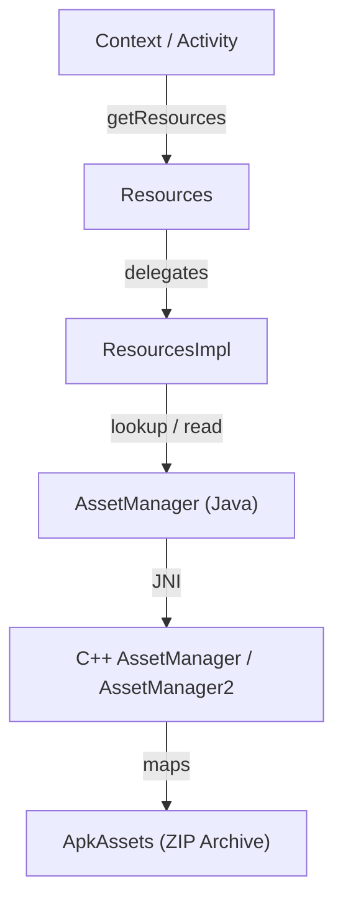
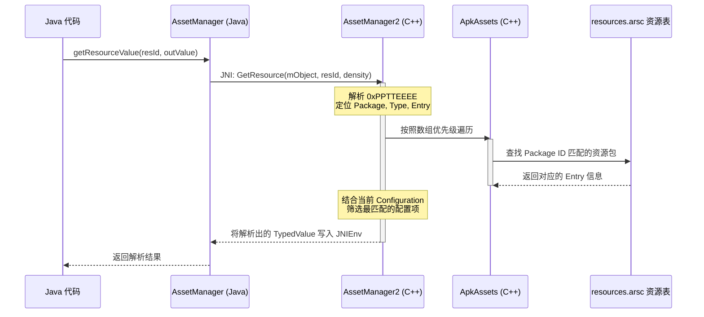

# Android AssetManager 机制

在 Android 资源管理系统中，`AssetManager` 是处于底层的核心引擎。不管是应用开发中通过 `Context.getResources()` 获取的编译后资源（如 Layout XML、Drawable 图片、String 字符串等），还是存放在 `assets` 目录下的原始非编译文件（如字体、音频、游戏材质、预置数据库等），其底层加载链路最终都会汇聚到 `AssetManager`。

本文将从定义职责、设计取舍、底层源码架构演进、插件化/热修复应用以及性能与线程安全等多个维度，对 Android `AssetManager` 机制进行系统、深入的剖析。

---

## 一、核心概念（是什么）

### 1.1 什么是 AssetManager？
`AssetManager` 是 Android 应用程序访问资源资产的物理通道。它在 Java 层提供 API 供应用调用，而在底层则通过 JNI（Java Native Interface）桥接到 Native 层的 `libandroidfw` 系统库，扮演着 C++ 资源管理引擎的“代言人”角色。

在 Android 框架中，资源的获取拓扑结构如下：



如上图所示，当开发者调用 `context.getString(R.string.app_name)` 时，`Resources` 仅作为一个面向开发者的“高层门面”，它将具体查找任务委托给 `ResourcesImpl`。`ResourcesImpl` 内部持有 `AssetManager` 实例，由 `AssetManager` 通过 JNI 调用 Native C++ 层，在 APK 的资源表（`resources.arsc`）或 Assets 压缩包中定位并解析出原始资源数据。

---

## 二、设计取舍：assets 与 res 的对比（为什么）

Android 在设计资源访问时，区分了 `res`（编译资源）与 `assets`（原始资产）两大体系。这两者在构建、索引、访问方式以及设备适配上存在着根本的区别，体现了系统设计在“运行效率”与“灵活性”之间的权衡。

### 2.1 核心区别对比表

| 特征维度 | `res` (编译资源) | `assets` (原始资产) |
| :--- | :--- | :--- |
| **编译行为** | 会被 `aapt` / `aapt2` 编译。XML 会被转为高效的二进制 XML 格式，图片可能被优化。 | 保持原始文件格式，不进行任何形式的编译或压缩优化。 |
| **索引机制** | 会在 `R.java` 中生成唯一的 32 位整型 Resource ID（如 `0x7f080001`）。 | 不生成任何 ID。只能通过相对路径以字符串形式进行寻址。 |
| **读取速度** | **极快**。直接通过 32 位 ID 定位，且资源表加载在内存中。 | **较慢**。需要通过路径字符串在压缩包中查找，并建立文件流。 |
| **目录结构限制** | 必须严格按照系统指定的目录分类（如 `layout/`, `drawable/`, `values/`），不支持自定义子目录。 | 支持完全自定义的深层文件夹结构，不受任何目录命名限制。 |
| **自适应分发** | **天然支持**。系统根据屏幕密度（dpi）、语言、屏幕方向等配置自动映射匹配。 | **不支持**。开发者必须在代码中手动判断设备配置，并自行决定读取哪个路径下的文件。 |
| **文件大小限制** | 早期版本（Android 2.3 之前）有单文件不大于 1MB 的限制，现已解除，但加载大资源仍需注意内存占用。 | 同样受限于设备内存和读取流，但通常用于存放字体、大音频等文件。 |

### 2.2 设计取舍分析
* **`res` 体系追求“极致的加载效率与自动适配”**：对于 UI 界面来说，资源必须能以毫秒级的速度加载完成，且需要支持多语言、多屏幕密度的自动匹配。因此，Google 引入了 `aapt` 编译工具，将所有的 `res` 资源编译并统一打包在 `resources.arsc` 资源索引表中。运行时，系统只需读取一个 32 位的 `int` ID，就能以近乎 $O(1)$ 的时间复杂度快速定位到对应配置下的资源，避免了遍历文件目录的损耗。
* **`assets` 体系追求“结构自由与原始流式读取”**：在很多场景下，比如跨平台的 WebView 应用、游戏引擎（如 Unity、Cocos2dx）或者第三方 C++ 库，它们需要读取自身定义的特定文件结构，而不需要 Android 系统插手进行设备适配。`assets` 保持原始的物理目录结构，允许应用直接通过相对路径（如 `assets/web/index.html`）流式读取，从而为开发者提供了最大的灵活性。

---

## 三、底层实现机制与资源加载流转（怎么做）

### 3.1 Java 层的设计：ResourcesManager、Resources 与 AssetManager 的关联
在应用进程启动后，所有的资源加载请求都通过一个单例管理器来调度：`android.app.ResourcesManager`。

1. **`Resources` 对象的创建与缓存**：
   当 `Activity` 或 `Application` 创建时，系统会向 `ResourcesManager` 请求获取一个 `Resources` 对象。`ResourcesManager` 会根据当前设备的 `Configuration`（如屏幕密度、语言、字体大小等）以及 `DisplayAdjustments`，在内部的缓存 map 中查找是否存在现有的 `ResourcesImpl`。如果不存在，则创建一个新的 `ResourcesImpl` 实例并将其与 `AssetManager` 绑定，最后用它包装成 `Resources` 返回。
2. **`AssetManager` 的构建**：
   在 Java 层，`AssetManager` 的构造函数中会调用底层的 Native 方法：
   ```java
   // 简化后的源码示意
   public AssetManager() {
       synchronized (this) {
           mObject = nativeCreate(); // 返回 Native 层对象的指针地址
           if (mObject == 0) {
               throw new OutOfMemoryError();
           }
       }
   }
   ```
   Java 层的 `AssetManager` 实例本质上只是一个壳，它持有一个 `long mObject` 成员变量，该变量保存了 Native 层对应 C++ 对象的指针地址。后续所有的 API 调用（如读取文件、解析 XML）都是通过将 `mObject` 传入 JNI 进行操作的。

---

### 3.2 Native 层的演进：从 AssetManager 到 AssetManager2
在 Android 8.0 之前，Native 层使用的是第一代 `AssetManager`。而在 Android 8.0 之后，尤其在 Android 9.0（参见 [AndroidVersionChangeLog.md](../../../../../AndroidVersionChangeLog.md)）中，Google 对底层的资源加载引擎进行了彻底的重构，推出了全新的 `AssetManager2`。这一演进主要是为了解决性能瓶颈、多进程共享以及插件化场景下的锁竞争问题。

#### 1. 遗留的第一代 AssetManager 的缺陷
在老版本中，`AssetManager` 在 Native 层持有全局的资源表（`ResTable`）。当应用引入了分包（App Splits）、动态功能模块（Dynamic Feature）或者运行时资源替换（Runtime Resource Overlays, RRO）时，`ResTable` 需要被频繁地销毁与重建。这导致了严重的性能退化，并且因为底层共享的 `ResTable` 不是完全线程安全的，高并发读取资源时经常会发生死锁或崩溃。

#### 2. 现代的 AssetManager2 架构设计
为了解决这些痛点，Google 重新设计了双层架构：
* **`ApkAssets` (C++ 层)**：代表一个具体的物理 APK 包（或 `resources.arsc`），它负责把 ZIP 归档中的文件目录与资源表解析出来。`ApkAssets` 是**只读且不可变的（Immutable）**，它是完全线程安全的。这意味着同一个 `ApkAssets` 实例可以被多个不同的 `AssetManager2` 安全地共享。
* **`AssetManager2` (C++ 层)**：它是一个轻量级的“聚合器”，不再直接持有复杂的 `ResTable`。`AssetManager2` 内部只持有一个按查找优先级排列的 `ApkAssets` 指针数组（`std::vector<std::unique_ptr<const ApkAssets>>`）。每当需要查询资源时，`AssetManager2` 就会按照优先级顺序依次在这些 `ApkAssets` 中查找。

这种设计使得资源的动态增删变得极度廉价：如果想动态加载一个插件资源包，只需要创建一个该插件的 `ApkAssets`，然后将其加入 `AssetManager2` 的数组中即可，不需要重新构建庞大的 `ResTable`。

---

### 3.3 资源定位与解析底层流程

当应用通过资源 ID（如 `0x7f080001`）检索资源时，底层的二进制查找流程如下：

#### 1. 解析 32 位资源 ID（Resource ID）
资源 ID 在 Android 中是一个 32 位的整型数值，其内部被划分为三个部分：`0xPPTTEEEE`。
* **Package ID (`PP`)**：占 8 位。系统资源的 `Package ID` 固定为 `0x01`；应用自身资源的 `Package ID` 默认为 `0x7f`；共享库或动态加载的插件资源可以使用 `0x02` 到 `0x7e` 之间的值。
* **Type ID (`TT`)**：占 8 位。用于标识资源类型（如 `drawable`, `layout`, `string`, `color` 等）。每个类型在 `resources.arsc` 中都有一个对应的条目。
* **Entry ID (`EEEE`)**：占 16 位。代表该资源在其所属类型数组中的具体索引位置。

#### 2. Native 层查找与匹配算法
在 `AssetManager2` 内部，资源查找不仅仅是简单的数组索引定位，还需要结合设备的当前配置环境（`ResTable_config`）进行筛选与打分。具体步骤如下：
1. **动态 Package ID 解析**：如果 Package ID 不是 `0x7f` 或 `0x01`，查找器会使用 `DynamicRefTable`（动态引用表）进行映射，将其转换为运行时加载的实际 Package 索引。
2. **多配置筛选**：根据当前系统的配置参数（如语言设置为 `zh-rCN`、屏幕密度为 `xxhdpi`），`AssetManager2` 遍历每个 `ApkAssets` 中对应的 `Type` 块。
3. **最佳匹配打分（Best Match Algorithm）**：系统在遍历过程中，对每一个匹配上的配置项进行权重打分。例如，若当前设备是 `xxhdpi`，而资源包中同时存在 `xhdpi` 和 `xxxhdpi` 的同名图片，算法将优先计算哪个密度更接近当前设备，并选择缩放代价最小的那个资源。

#### 3. Native 层查找时序



---

### 3.4 关键 API 解析与工作原理

#### 1. `open(String fileName, int accessMode)`
此方法用于流式读取 `assets` 目录下的文件。
* **工作原理**：它在 Native 层会根据文件名，在对应的 `ApkAssets`（本质上是个 ZIP 压缩包）中查找对应的压缩文件节点。如果文件没有被压缩（例如预先在 `aapt` 中设置了不压缩格式，如 `.png`、`.mp3` 等），`AssetManager` 会利用系统的 `mmap` 将文件直接映射到进程的虚拟内存空间中，以实现零拷贝读取。如果是压缩文件，则会构建一个输入流，在 Native 层通过 `zlib` 进行流式实时解压。
* **主要参数 `accessMode`**：
  * `ACCESS_STREAMING`：流式读取。适合从头到尾按顺序读取的大文件，不会将整个文件加载到内存。
  * `ACCESS_RANDOM`：随机读取。允许在文件中定位（seek）到任意位置，适合媒体播放或读取大型包文件。
  * `ACCESS_BUFFER`：缓冲读取。将整个文件一次性读入进程内存，适合大小适中、需要频繁访问的文件。

#### 2. `openXmlResourceParser(int cookie, String fileName)`
此方法用于解析编译后的二进制 XML 文件。
* **工作原理**：`aapt` 将 `res/layout` 等目录下的 XML 编译成了紧凑的二进制结构，剥离了所有的空格、注释，并将重复出现的标签名和属性名提取到了局部的字符串池（String Pool）中。
* `openXmlResourceParser` 在 Native 层创建一个 `ResXMLTree` 对象。该对象在解析文件时，不需要像普通的 DOM/SAX 解析器那样对文本进行逐字扫描和字符串对比，而是直接读取二进制流中的 Tag Type、Token 和数据指针。这使得界面的 inflate 速度得到了极大的提升。

#### 3. `list(String path)`
* **工作原理**：此方法用于列出指定 `assets` 目录下的所有子文件和子目录名。
* **注意点**：该 API 的执行效率极低。因为 `assets` 的文件结构并非真的解压存在于文件系统中，而是以 ZIP 格式压缩在 APK 内部。`list()` 必须去扫描 APK 压缩包的中央目录（Central Directory），对所有文件路径进行前缀匹配。因此，在性能敏感的场景或循环结构中，应尽量避免高频调用 `list()`。

---

## 四、插件化与热修复中的核心应用

在 Android 插件化（如 Shadow、Replugin、VirtualAPK）与资源热修复（如 Tinker、Sophix）技术中，**动态替换或合并 AssetManager** 是实现资源热加载的必由之路。

### 4.1 动态资源加载的基本原理
无论底层如何变迁，Java 层的 `AssetManager` 中都维护着当前应用可访问的资源包路径数组。在早期 Android 系统中，该数组是通过隐藏方法 `addAssetPath` 动态拓展的；在 Android 9.0 以后，则是通过反射或系统隐藏接口修改底层 `ApkAssets` 数组来完成的。

通过向 `AssetManager` 中追加插件包或补丁包的物理路径，系统资源表便能识别并解析插件中的 `R.id`。

### 4.2 反射 `addAssetPath` 的具体实现与版本适配

下面的 Java 代码展示了如何在运行期，通过反射技术兼容不同版本的 Android 系统，将一个外部的 APK 资源路径动态植入当前应用的资源加载链路中。针对 Android 9.0+ 的 `ApkAssets` 数组架构，我们同时给出了进阶的直接注入方案。

```java
package com.demo.loader;

import android.content.Context;
import android.content.res.AssetManager;
import android.content.res.Resources;
import android.os.Build;
import java.lang.reflect.Array;
import java.lang.reflect.Constructor;
import java.lang.reflect.Field;
import java.lang.reflect.Method;

public class AssetLoader {

    /**
     * 向现有的 Context 动态注入新的资源路径
     *
     * @param context 宿主 Context
     * @param pluginApkPath 插件 APK 的绝对路径
     * @return 包含新资源包的 Resources 对象
     */
    public static Resources injectAssetPath(Context context, String pluginApkPath) {
        try {
            AssetManager assetManager;
            
            if (Build.VERSION.SDK_INT >= 28) { // Android 9.0+ 适配 (参见 AndroidVersionChangeLog.md)
                // 方案一：通过反射 ApkAssets.loadFromPath 创建 ApkAssets，并修改 AssetManager 的 mApkAssets 字段
                // 这种方案直接贴合了 Android 9.0+ 底层的 ApkAssets 设计，比直接调用 addAssetPath 更加稳定
                assetManager = AssetManager.class.newInstance();
                
                Class<?> apkAssetsClass = Class.forName("android.content.res.ApkAssets");
                Method loadFromPathMethod = apkAssetsClass.getMethod("loadFromPath", String.class);
                Object pluginApkAssets = loadFromPathMethod.invoke(null, pluginApkPath);
                
                // 同时把宿主本身的系统和应用 ApkAssets 获取到并进行合并
                Field apkAssetsField = AssetManager.class.getDeclaredField("mApkAssets");
                apkAssetsField.setAccessible(true);
                Object[] hostApkAssets = (Object[]) apkAssetsField.get(context.getAssets());
                
                // 拼接数组
                int hostLength = hostApkAssets != null ? hostApkAssets.length : 0;
                Object[] newApkAssets = (Object[]) Array.newInstance(apkAssetsClass, hostLength + 1);
                if (hostLength > 0) {
                    System.arraycopy(hostApkAssets, 0, newApkAssets, 0, hostLength);
                }
                newApkAssets[hostLength] = pluginApkAssets;
                
                // 写回 AssetManager
                apkAssetsField.set(assetManager, newApkAssets);
            } else {
                // Android 5.0 ~ 8.1 适配
                assetManager = AssetManager.class.newInstance();
                Method addAssetPathMethod = AssetManager.class.getDeclaredMethod("addAssetPath", String.class);
                addAssetPathMethod.setAccessible(true);
                addAssetPathMethod.invoke(assetManager, pluginApkPath);
                
                // 把宿主原有的所有路径也同步追加过去
                // 此处为了精简略去 host 路径遍历 add 的逻辑
            }
            
            // 构造新的 Resources 实例
            Resources hostResources = context.getResources();
            Resources newResources = new Resources(assetManager, 
                                                    hostResources.getDisplayMetrics(), 
                                                    hostResources.getConfiguration());
            
            return newResources;
        } catch (Exception e) {
            e.printStackTrace();
            return null;
        }
    }
}
```

> [!IMPORTANT]
> **Android 9.0+ 的非 SDK 接口限制**
> 自 Android 9.0（API 28）起，系统限制了对非公开 API 的反射访问。`AssetManager.addAssetPath` 方法被标记为了黑名单（灰名单）接口。直接反射在 Android 9.0+ 上会抛出 `NoSuchMethodException`。在热修复和插件化的工业级实践中，开发者通常需要利用 **Double Reflection（元反射）** 或通过修改 `free-reflection` 等库的底层 Native 标志位，来突破系统的隐藏 API 限制，以使上述代码在 Android 9.0+ 上继续生效。

### 4.3 资源合并（Merge）与资源隔离（Isolate）的方案权衡

在开发插件化框架时，如何构建插件的 `AssetManager` 是个关键的设计抉择。行业中主要存在两种方案：

```mermaid
graph TD
    subgraph 资源合并方案 (Merge)
        A[宿主 APK 路径] --> C[同一个 AssetManager]
        B[插件 APK 路径] --> C
        C --> D[同一个 Resources 对象]
        C -.-> NoteC["注：宿主与插件可直接互相引用，但存在 ID 冲突风险"]
    end

    subgraph 资源隔离方案 (Isolate)
        E[宿主 APK 路径] --> G[宿主 AssetManager]
        F[插件 APK 路径] --> H[插件 AssetManager]
        G --> I[宿主 Resources]
        H --> J[插件 Resources]
        H -.-> NoteH["注：资源彻底隔离，不冲突，但无法直接共享"]
    end
```

#### 1. 资源合并方案（Merge）
* **做法**：将插件 APK 的路径通过 `addAssetPath` 直接追加到宿主现有的 `AssetManager` 实例中。
* **优点**：宿主与插件处于同一个资源上下文，可以极方便地进行跨 APK 的资源访问与交互。
* **缺点**：非常容易产生 **资源 ID 冲突（ID Collision）**。如果两个 APK 在编译时都使用默认的 `Package ID = 0x7f`，那么在合并后的资源表里，相同的 ID 就会指向不同的实体，导致界面错乱或直接崩溃。

#### 2. 资源隔离方案（Isolate）
* **做法**：为每个插件单独实例化一个 `AssetManager` 和 `Resources` 对象。
* **优点**：各个插件之间以及插件与宿主之间的资源完全独立，哪怕所有的 ID 都是 `0x7f` 也不会产生任何干扰。
* **缺点**：插件无法引用宿主的资源；宿主也无法直接加载插件的视图，传递 `R.id` 会失效。这需要编写大量的代理（Proxy）代码来传递资源或在上下文切换时频繁变换 `Resources` 对象。

### 4.4 资源 ID 冲突的最终解决方案：AAPT2 定制 Package ID
针对**资源合并方案**中的 ID 冲突问题，业内通用的解决手段是修改 AAPT/AAPT2 编译工具。
在构建插件 APK 时，向 AAPT2 传入指定的 `--package-id` 参数（如将插件的 Package ID 指定为 `0x6f` 甚至各个插件按顺序分配 `0x60`, `0x61`, `0x62`...）。

通过这种方式，生成的插件 `R.java` 中所有的资源 ID 都会变成 `0x6fTTEEEE` 的格式，当它们与宿主的 `0x7fTTEEEE` 资源合并到同一个 `AssetManager` 中时，由于 Package ID 前缀天生不同，便在二进制层面上完美规避了资源冲突的问题。

---

## 五、常见误区与最佳实践

### 5.1 OOM 与资源泄露

#### 1. 流式读取 assets 未关闭引发的文件描述符（FD）泄露
通过 `AssetManager.open(...)` 获得的 `InputStream` 底层实际上是由 C++ 层的一个 `Asset` 实例提供支撑的，并且它持有一个 Native 的文件描述符（File Descriptor, FD）。
```java
// 错误示范：没有进行完备的异常处理和关闭操作
InputStream is = context.getAssets().open("large_config.json");
byte[] buffer = new byte[is.available()];
is.read(buffer);
// 如果在上述 read 过程中抛出异常， close() 将永远无法被调用
is.close(); 
```
* **危害**：当进程持有的 FD 达到上限（通常是 1024 或更低，取决于不同厂商定制的系统内核限制）后，应用将无法再打开任何文件，也无法建立任何 Socket 连接，直接导致应用全面瘫痪或报出 `Too many open files` 崩溃。
* **最佳实践**：必须使用 Java 的 `try-with-resources` 语法，确保在发生任何意外情况时，流及其底层的 Native 资源都能得到及时释放。
```java
try (InputStream is = context.getAssets().open("large_config.json")) {
    // 处理流数据
} catch (IOException e) {
    e.printStackTrace();
}
```

#### 2. 生命周期不当持有导致的 Context 内存泄漏
在插件化或动态换肤的框架中，有些开发者为了方便，将通过反射定制后的 `Resources` 或 `AssetManager` 实例保存在一个全局静态变量中。
* **危害**：`AssetManager` 底层往往绑定了当前创建它的 `Context`（或关联了 `Activity` 的配置信息）。如果这些定制的资源对象被静态字段长期持有，将导致关联的整个 `Activity` 及其内部庞大的 View 视图树都无法被垃圾回收器（GC）回收，引发严重的内存泄露。
* **最佳实践**：动态资源的持有生命周期应与宿主 `Activity` 或 `Application` 的生命周期紧密结合，不使用静态变量全局持有定制资源。在 `Activity.onDestroy()` 阶段，应显式切断自定义 `Resources` 的引用，并主动调用 `AssetManager.close()` 释放底层 Native 缓存。

---

### 5.2 多线程并发读取的安全性与锁竞争分析

在涉及大量资源读取的场景下（例如游戏加载、多线程资源预加载），多线程并发使用 `AssetManager` 会暴露出内部的同步锁问题。

#### 1. Native 层锁竞争 bottleneck
在 Java 层，`AssetManager` 的多个关键方法（如 JNI 调用的 Native 入口方法）在早期 SDK 中是使用 `synchronized` 关键字修饰的，或者在 C++ 层的旧 `AssetManager` 实现中包含了一个全局互斥锁（`Mutex mLock`）。
这意味着：
* 如果线程 A 正在从 `assets` 中以 `ACCESS_STREAMING` 方式读取一个 10MB 的音乐文件，那么线程 B 尝试加载一个 1KB 的 String 资源的请求也会被**强制阻塞**在锁等待队列中，直到线程 A完成了 IO 操作并释放锁。
* 这也就是为什么在主线程与子线程并发读取资源时，界面容易出现掉帧甚至卡死（ANR）的隐患。

#### 2. 现代 Android 版本的改进与应对策略
如前文所述，Android 9.0 引入的 `AssetManager2` 通过使用只读的 `ApkAssets` 去除了大部分的 Native 互斥锁，极大地缓解了多线程并发时的阻塞程度。然而，为了确保在所有 Android 历史版本上的稳定性，仍推荐以下方案：
* **关键大文件避免使用 AssetManager 实时加载**：对于体积较大的文件，不建议在需要时才通过 `AssetManager.open` 临时去读取。更好的方案是在应用首次启动或版本更新时，将文件从 `assets` 中一次性拷贝到 App 的私有沙盒目录（如 `context.getFilesDir()`）下，后续访问时直接通过普通的 Java 文件 IO（或 C++ `fread`）进行读取，从而完全绕过 `AssetManager` 的内部锁。
* **使用单线程的预加载队列**：如果必须预加载大量小资源，可以设计一个单线程的资源读取队列（使用单个 Worker 线程或协程通道），避免多个线程并发访问 `AssetManager` 造成无效的线程上下文切换与严重的锁等待。

---

## 六、总结

`AssetManager` 作为 Android 系统中默默无闻的幕后功臣，将复杂的底层 ZIP 文件解压、二进制 XML 极速解析以及基于设备特性的多资源配置过滤适配，封装成了简单易用的 Java API。

从遗留的 `ResTable` 设计演进到今天轻量化、不可变且线程安全的 `ApkAssets` 与 `AssetManager2` 组合，Android 资源引擎的底层重构提升了系统在高动态资源加载场景（如热修复和分包）下的表现。深入理解 `AssetManager` 的底层映射、ID 分布及反射兼容机制，能够帮助开发者在编写插件化框架、解决资源泄漏、消除多线程 IO 锁竞争等深水区任务时，做到游刃语境、迎刃而解。
