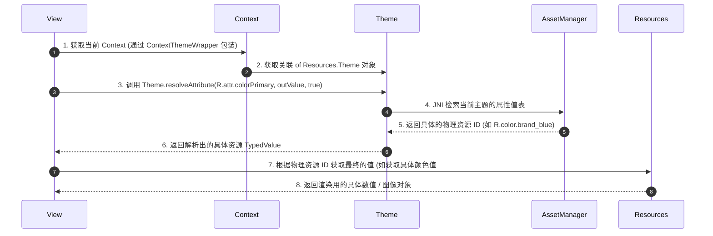

# 5.1.4.4.3 主题样式

在 Android UI 开发中，**主题（Theme）**与**样式（Style）**是实现界面视觉效果复用、解耦以及动态管控的核心机制。虽然它们在 XML 中的声明语法非常相似，但在作用范围、运行时数据结构、属性传递方式以及设计初衷上存在本质的差异。

本文将从核心概念、设计初衷、底层实现机制、属性动态解析、动态主题切换，以及 Design System 的构建等多个维度，对 Android 主题与样式进行系统而深入的剖析。

---

## 1. 核心概念：Theme 与 Style 的本质

### 1.1 概念定义
*   **Style（样式）**：是针对**单个 View 实例**的属性集合。它类似于网页开发中的 CSS 类（Class），将 `android:textSize`、`android:textColor`、`android:background` 等视觉表现属性打包在一起，方便在布局 XML 中通过 `style="@style/MyStyle"` 一键应用。Style 的作用范围是局部的、静态的，且不会自动向下传递给子视图（除非特定 View 组件有特殊处理）。
*   **Theme（主题）**：是针对**窗口（Window）或视图树（Context/View Hierarchy）**的全局属性容器。它类似于编程语言中的“全局配置上下文”或“环境变量”。Theme 中定义了用于整包 UI 风格管控的抽象属性（如 `colorPrimary`、`windowBackground`、`textColorPrimary` 等），并作为 Context 的一部分向下级联传播。Theme 中的属性可以通过属性引用（`?attr/`）被其下属的所有 View 动态消费。

### 1.2 维度对比与区别

为了更清晰地理解两者的差异，我们可以从以下维度进行深度对比：

| 对比维度 | Style (样式) | Theme (主题) |
| :--- | :--- | :--- |
| **作用范围** | 单个 View 节点，局部生效，不具备子 View 级联传播特性。 | 整个 Application、Activity，或者声明了 `android:theme` 的局部 View 树。 |
| **典型属性** | View 级别的具体渲染属性，如 `textSize`、`layout_width`、`padding`。 | 窗口级别属性（如 `windowNoTitle`）或语义化属性（如 `colorSecondary`）。 |
| **运行时数据结构** | 解析为 `AttributeSet` 中的静态键值对。 | 运行时表现为 `Resources.Theme` 对象，支持动态合并与叠加。 |
| **Context 依赖** | 不改变 Context 的状态，仅仅是 View 在实例化时读取的属性集合。 | 通过 `ContextThemeWrapper` 替换 Context 的 Theme 实例，从而影响其内所有 View 的创建。 |
| **属性解析方式** | 静态解析：直接应用具体的资源值（如 `@color/blue`）。 | 动态解析：间接寻址，根据当前 Context 的 Theme 解析属性（如 `?attr/colorPrimary`）。 |

### 1.3 运行时数据结构解析
在 Android Framework 底层，Style 和 Theme 的处理方式大相径庭：
*   **Style 的加载**：当布局填充器（`LayoutInflater`）解析布局 XML 时，如果发现 View 标签上声明了 `style="..."`，它会从资源表中提取出该 Style 对应的 `AttributeSet`。View 的构造函数通过调用 `context.obtainStyledAttributes(attrs, R.styleable.View, defStyleAttr, defStyleRes)` 来获取最终的属性值。此时，Style 里的属性被静态解析并赋予 View。
*   **Theme 的关联**：Theme 本质上是一个运行在 `Resources` 之内的属性映射表。每个 Activity 在启动时都会被分配一个 `Resources.Theme` 实例。这个实例会加载在 AndroidManifest 中或代码中指定的 Theme 资源（如 `Theme.Material3.DayNight`）。它并不直接作用于某个 View，而是作为 `Context` 的一部分。当子 View 在初始化过程中需要解析 `?attr/...` 这种动态属性时，会调用 `context.getTheme().resolveAttribute(...)` 动态在当前 Theme 对象的映射表中进行检索。

---

## 2. 设计取舍：UI 解耦与全局管控的工程思考

在设计 Android UI 架构时，引入 Theme 与 Style 的概念主要为了解决以下三个工程痛点：

### 2.1 界面结构与视觉样式的分离（解耦）
如果在布局 XML 中对每一个 `TextView` 都硬编码 `android:textSize="16sp"`、`android:textColor="#333333"` 和 `android:fontFamily="sans-serif-medium"`，会导致布局文件极度臃肿。更严重的是，当界面结构（如布局嵌套、View 摆放逻辑）与视觉表现（颜色、字体、背景）深度耦合时，任何微小的设计变更都会演变成灾难性的工作量。
通过将视觉属性剥离到 Style 中，布局 XML 重新聚焦于**“界面结构与组织（Structure & Hierarchy）”**，而 Style 负责**“视觉呈现（Visual Styling）”**。

### 2.2 属性复用与继承（降低冗余）
在应用开发中，按钮、输入框、卡片等标准组件会有多种微调版本（例如：主按钮、次按钮、禁用按钮）。如果每个组件都从零配置，会导致大量属性配置的冗余。
Style 机制通过**显式继承（parent 属性）**和**隐式继承（点号命名法）**，允许开发者建立一个清晰的“样式树”。子样式只需声明与父样式的差异部分，从而极大地减少了 XML 代码的维护成本。

### 2.3 集中式管控（深色模式与一键换肤）
对于支持多主题（如日夜间模式切换、多品牌皮肤）的现代应用，若直接在 View 上硬编码颜色值（如 `@color/white`），将导致应用无法在运行时动态适配不同的视觉模式。
Theme 机制的初衷是**引入一层“间接层（Indirection）”**。通过在 Theme 中定义诸如 `colorSurface`、`textColorPrimary` 等语义化属性，并在不同的 Theme 配置下为这些属性赋予不同的物理资源 ID，View 就可以通过 `?attr/colorSurface` 的方式进行声明。这使得应用只需切换当前 Context 的 Theme，整个 View 树的视觉效果便会随之自动更新，实现了集中式的 UI 管控。

---

## 3. 实现机制与源码深度剖析

### 3.1 Style 的继承机制

Android 提供了两种 Style 继承方式，它们在编译期的行为和适用场景上有所不同。

#### 3.1.1 显式继承（`parent` 属性）
显式继承通过在 `<style>` 标签中显式指定 `parent` 属性来实现：
```xml
<!-- 显式继承系统自带的按钮样式 -->
<style name="MyPrimaryButton" parent="android:Widget.DeviceDefault.Button">
    <item name="android:textColor">?attr/colorAccent</item>
    <item name="android:textStyle">bold</item>
</style>
```
*   **适用场景**：必须用于跨包继承（如继承 Android 系统原生样式 `@android:style/...`，或第三方库中的样式如 `Widget.MaterialComponents.Button`），或者当子样式的命名不符合点号命名规则时。
*   **编译期行为**：AAPT（Android Asset Packaging Tool）在编译资源时，会直接将 `parent` 指向的资源 ID 作为当前 Style 的父节点，复制父节点的所有未被覆盖的属性到当前 Style 的解析链中。

#### 3.1.2 隐式继承（点号 `.` 命名）
隐式继承不需要声明 `parent` 属性，而是通过在 Style 的命名中以点号（`.`）连接来实现层级继承：
```xml
<!-- 定义基础样式 -->
<style name="BaseText">
    <item name="android:textSize">14sp</item>
    <item name="android:textColor">#333333</item>
</style>

<!-- 隐式继承 BaseText 并覆盖/新增属性 -->
<style name="BaseText.Headline">
    <item name="android:textSize">20sp</item>
    <item name="android:textStyle">bold</item>
</style>
```
*   **适用场景**：适用于当前模块或应用内部定义的、具有明确前缀从属关系的样式派生。
*   **编译期行为**：AAPT 在处理资源时，会自动识别命名中的点号，并将其前半部分（`BaseText`）解析为后半部分（`BaseText.Headline`）的隐式 `parent`。

#### 3.1.3 继承局限性与避坑指南
1.  **隐式点号继承无法继承系统或第三方库样式**：
    试图通过 `<style name="android:Widget.Button.MyButton">` 隐式继承系统样式是**完全无效的**。因为 AAPT 无法在编译期自动跨越 `android` 命名空间去查找并建立父子关系。**必须显式声明 `parent="android:Widget.Button"`**。
2.  **显式 `parent` 与点号命名的混用冲突**：
    如果同时使用了点号命名并显式指定了 `parent` 属性，**显式 `parent` 具有最高优先级**，点号所暗示的隐式父级将被 AAPT 彻底忽略。例如：
    ```xml
    <!-- 此时 BaseText.Headline 的父样式不是 BaseText，而是 Widget.AppCompat.TextView -->
    <style name="BaseText.Headline" parent="Widget.AppCompat.TextView">
        <item name="android:textStyle">bold</item>
    </style>
    ```
    开发中应避免这种让人产生直觉偏差的混用，除非刻意为之。

---

### 3.2 Theme 与 Style 的应用层次与优先级

当一个 View 处于复杂的渲染上下文中时，它可能同时受到系统默认属性、Application 主题、Activity 主题、父容器主题覆盖、View Style 以及直接在 XML 标签上声明的属性的影响。Android 系统有一套严格的属性合并与覆盖规则。

#### 3.2.1 样式覆盖链条与优先级
属性决定的优先级从高到低排列如下：

```
+-------------------------------------------------------------+
| 1. View 直接属性 (Direct Attributes in XML)                  |  最高优先级
+-------------------------------------------------------------+
                              | (未声明则下探)
                              v
+-------------------------------------------------------------+
| 2. View 级样式 (Style Attribute)                             |
+-------------------------------------------------------------+
                              | (未声明则下探)
                              v
+-------------------------------------------------------------+
| 3. View 构造函数默认样式 (defStyleAttr & defStyleRes)          |
+-------------------------------------------------------------+
                              | (未声明则下探)
                              v
+-------------------------------------------------------------+
| 4. 局部 Theme 覆盖 (android:theme / ContextThemeWrapper)    |
+-------------------------------------------------------------+
                              | (未声明则下探)
                              v
+-------------------------------------------------------------+
| 5. Activity 级别主题 (Activity Theme)                        |
+-------------------------------------------------------------+
                              | (未声明则下探)
                              v
+-------------------------------------------------------------+
| 6. Application 级别主题 (Application Theme)                  |  最低优先级
+-------------------------------------------------------------+
```

#### 3.2.2 源码层面的合并逻辑
当 View 实例化时，会调用 `context.obtainStyledAttributes(AttributeSet set, int[] attrs, int defStyleAttr, int defStyleRes)`。其底层检索和覆盖逻辑遵循如下顺序：
1.  **`set` (直接属性)**：首先检索直接写在 View XML 标签上的属性（如 `android:textColor="..."`）。
2.  **`style` (View级样式)**：如果在 `set` 中没有找到，则去 View 标签上声明的 `style` 资源中查找。
3.  **`defStyleAttr` / `defStyleRes` (构造函数默认样式)**：
    *   `defStyleAttr`：这是一个定义在当前 Theme 中的属性指针（如 `R.attr.buttonStyle`），指向一个默认的 Style。
    *   `defStyleRes`：如果 `defStyleAttr` 未指定（为 0）或者当前 Theme 中未配置该属性，则直接使用此默认 Style 资源 ID。
4.  **`Theme` (上下文主题链)**：如果上述三者都未定义该属性，最终会回退到当前 Context 关联的 Theme 中，根据属性映射进行查找（例如通过当前 Theme 的 `textColorPrimary` 来确定文本颜色）。

---

### 3.3 属性引用机制：`?attr/` 与 `@color/` 的本质区别

在配置颜色、尺寸、背景等资源时，开发者经常混用 `@color/...` 与 `?attr/...`。理解它们的底层差异是掌握 Android 资源系统的关键。

#### 3.3.1 静态引用（`@` 符号）
*   **机制**：`@color/my_color` 是一种**静态寻址（Static Reference）**。
*   **编译期**：AAPT 会将该引用编译为资源表中一个确定的资源 ID（例如 `0x7f060001`）。
*   **运行期**：系统直接从 `Resources` 对象中加载该 ID 对应的物理资源值。这个值是固定的，**与当前界面处于什么主题（Theme）没有任何关系**。如果应用的白天模式和黑夜模式需要不同的颜色，直接使用 `@color` 会导致界面颜色无法随主题自动切换。

#### 3.3.2 属性引用（`?` 符号）
*   **机制**：`?attr/my_attribute` 是一种**运行时动态寻址 / 间接寻址（Dynamic / Indirect Reference）**。它引用的不是具体的资源，而是一个定义在 `<declare-styleable>` 中的“插槽（Attribute）”。
*   **编译期**：AAPT 将其编译为属性的资源 ID（例如 `0x7f040002`）。
*   **运行期解析流程**：
    1. View 在解析该属性时，向当前 Context 请求关联的 `Resources.Theme` 对象。
    2. 调用 Theme 底层的 C++ 代码（通过 JNI 调用 `AssetManager.resolveAttribute()`）。
    3. 系统在当前 Theme 的映射表中检索 `0x7f040002`，查找到当前主题为该属性赋予的具体物理资源 ID（如 `@color/brand_blue` 的 ID `0x7f060002`）。
    4. 再次通过 `Resources` 对象加载该物理资源的值。



这种间接机制是 Android 能够完美支持暗黑模式、多主题切换以及 Material Design 动态颜色（Material You）的基础。通过将界面元素与具体的颜色值解耦，View 只需声明对“语义”（如“主色调”、“背景色”）的依赖，具体的渲染值交由运行时所处的主题上下文决定。

---

### 3.4 动态切换主题的原理与实现方法

在运行时动态切换主题（如夜间模式与白天模式的手动切换）是许多应用的标配功能。要实现这一功能，必须正确理解 Activity 的重建机制与 Theme 的应用时机。

#### 3.4.1 为什么 `setTheme()` 必须在 `setContentView()` 之前调用？
从源码角度看，`setContentView()` 会触发 `LayoutInflater.inflate()` 来解析 XML 布局。
在解析过程中，`LayoutInflater` 会通过反射调用 View 的构造函数：
```java
public View(Context context, AttributeSet attrs, int defStyleAttr) {
    // ...
    // obtainStyledAttributes 底层使用 context.getTheme() 来解析属性
    final TypedArray a = context.obtainStyledAttributes(
            attrs, R.styleable.View, defStyleAttr, 0);
    // ...
}
```
此时，`obtainStyledAttributes()` 已经完成了 View 属性的静态检索与赋值。如果在 `setContentView()` 之后再调用 `setTheme(resId)`，虽然 Context 内部的 `Resources.Theme` 对象被更新了，但**已经实例化完毕并绘制在 Window 上的 View 树不会重新执行构造函数，也不会自动重新解析属性**。这就会导致新主题完全无法应用到现有界面上。

因此，典型的动态切换主题的流程如下：

```java
@Override
protected void onCreate(Bundle savedInstanceState) {
    // 1. 读取保存的主题配置
    int themeResId = getSavedThemePreference();
    // 2. 必须在 super.onCreate() 和 setContentView() 之前应用主题
    setTheme(themeResId);
    
    super.onCreate(savedInstanceState);
    setContentView(R.layout.activity_main);
}
```

#### 3.4.2 动态切换主题的两种主流方案

##### 方案一：Activity 重建法（Recreate）
*   **原理**：调用 `Activity.recreate()` 方法。系统会销毁当前 Activity 实例，并按照标准生命周期重新创建它。在重建过程中，重新走一遍 `onCreate` -> `setTheme` -> `setContentView` 的完整流程。
*   **代码实现**：
    ```java
    // 保存新主题标识并触发重建
    saveThemePreference(R.style.Theme_Custom_Dark);
    activity.recreate();
    ```
*   **优缺点分析**：
    *   **优点**：实现极其简单且彻底。所有 View 及其子组件都会重新实例化，不存在自定义 View 漏更新、内存中旧主题缓存残留的问题。
    *   **缺点**：Activity 重建会导致短暂的界面闪烁；Activity 携带的临时状态（如果未在 `onSaveInstanceState` 中妥善保存）可能会丢失；如果有后台任务（如音频播放、大文件上传）与 Activity 生命周期强绑定，容易被异常中断。

##### 方案二：免重建动态应用主题（Theme Overlay & View 树递归）
*   **原理**：利用 `Theme.applyStyle(int resId, boolean force)` 动态在当前 Context 的 Theme 中合并叠加新的样式，然后通过递归遍历 View 树，手动为每个 View 重新调用属性解析和刷新逻辑。
*   **实现步骤**：
    1.  调用 `getTheme().applyStyle(newThemeOverlayId, true)` 将新主题叠加到当前 Context。
    2.  编写 View 树遍历器，寻找所有依赖动态属性的 View（如 `TextView`、`ImageView`）。
    3.  手动读取当前 Theme 的新属性值，调用如 `setTextColor()`、`setImageTintList()` 等方法进行动态更新，或者强制调用 `invalidate()` / `requestLayout()` 触发重绘。
*   **优缺点分析**：
    *   **优点**：无需销毁 Activity，体验平滑，输入法不会闪烁，Activity 内部状态保持完整。
    *   **缺点**：开发与维护成本极高。对于第三方库的 View 或自定义 View，必须编写定制化的属性重解析代码，极其容易遗漏；由于属性在 View 实例化时多已静态绑定，免重建更新往往需要结合数据绑定（DataBinding）或自行实现一套重绘派发机制。

---

## 4. 常见误区与避坑指南

### 4.1 混淆 `android:theme` 与 `style` 的职责
*   **现象**：在父容器（如 `LinearLayout`）上设置 `style="@style/MyTextStyle"`，指望子容器中的 `TextView` 能够自动继承该 style 中的 `textSize` 或 `textColor`。
*   **结果**：完全失效，子 `TextView` 依然使用默认样式。
*   **原因**：`style` 仅作用于当前声明的 View。如果需要子 View 自动应用某种样式特征，应该在该父容器上使用 `android:theme="@style/MyThemeOverlay"`，或者使用特定组件提供的专用属性（如 `ViewGroup` 的属性，但绝大多数布局属性不具备级联继承性）。

### 4.2 在全局 Theme 中配置 View 的私有属性
*   **现象**：在 `themes.xml` 的 App 主题中直接配置 View 的特有属性，例如：
    ```xml
    <style name="Theme.MyApp" parent="Theme.Material3.DayNight">
        <!-- 错误：Theme 中不应直接配置 View 实例的私有渲染逻辑 -->
        <item name="android:maxLines">2</item>
        <item name="android:gravity">center</item>
    </style>
    ```
*   **结果**：可能导致应用中所有的 `TextView`、`EditText` 甚至 `Button` 都莫名其妙地变成了最多两行且文字居中，导致严重的布局错乱，并且由于问题源自全局主题，排查极其困难。
*   **正确做法**：Theme 应该只配置全局语义属性（颜色、字体规范、背景）。特定组件的默认表现，应通过配置 `defStyleAttr` 对应的样式指针来实现。例如，若想全局定制所有 Button 的样式，应该在 Theme 中将 `android:buttonStyle` 指向一个专属的 Button Style：
    ```xml
    <style name="Theme.MyApp" parent="Theme.Material3.DayNight">
        <!-- 正确：通过属性指针指定 Button 的默认 Style -->
        <item name="android:buttonStyle">@style/Widget.MyApp.Button</item>
    </style>
    ```

### 4.3 隐式点号继承系统样式的严重错误
*   **现象**：编写如下样式：
    ```xml
    <!-- 试图隐式继承系统 Material 主题 -->
    <style name="android:Theme.Material.MyCustomTheme">
        <item name="colorPrimary">@color/my_color</item>
    </style>
    ```
*   **结果**：编译报错，或者该样式完全丢失了系统 Material 主题的所有原有配置（如 Window 属性、各种默认颜色），导致应用崩溃或界面全黑。
*   **原因**：AAPT 不支持跨包（从应用包到 `android` 命名空间系统包）的隐式继承。必须通过 `parent` 显式继承。

---

## 5. 最佳实践：构建可扩展的 Design System 样式树

在大型团队或多模块项目中，零散 of Style 和 Theme 会导致视觉不一致和代码混乱。建立一个基于 **Design System（设计系统）** 概念的样式树是行之有效的最佳实践。

### 5.1 第一步：在 `attrs.xml` 中定义语义化属性
首先，与 UI 设计师对齐，将品牌色、辅助色、间距、字体层级等抽象为无物理取值的主题属性：
```xml
<resources>
    <!-- 品牌色彩体系 -->
    <attr name="colorBrandPrimary" format="color" />
    <attr name="colorBrandSecondary" format="color" />
    <attr name="colorSurfaceElevated" format="color" />
    
    <!-- 排版体系 -->
    <attr name="textAppearanceHeadlineLarge" format="reference" />
    <attr name="textAppearanceBodyMedium" format="reference" />
    
    <!-- 间距与圆角体系 -->
    <attr name="dimenSpacingNormal" format="dimension" />
    <attr name="shapeCornerMedium" format="reference" />
</resources>
```

### 5.2 第二步：在 `themes.xml` 中为属性赋以物理资源
针对不同的视觉模式（白天、黑夜、高对比度），分别创建主题并填充上述插槽：
```xml
<!-- 基础浅色主题 -->
<style name="Theme.MyApp.Light" parent="Theme.Material3.Light.NoActionBar">
    <item name="colorBrandPrimary">@color/blue_500</item>
    <item name="colorBrandSecondary">@color/orange_500</item>
    <item name="colorSurfaceElevated">@color/grey_50</item>
    
    <item name="textAppearanceHeadlineLarge">@style/TextAppearance.MyApp.HeadlineLarge</item>
    <item name="textAppearanceBodyMedium">@style/TextAppearance.MyApp.BodyMedium</item>
    
    <item name="dimenSpacingNormal">@dimen/spacing_16dp</item>
    <item name="shapeCornerMedium">@style/ShapeAppearance.MyApp.CornerMedium</item>
</style>

<!-- 基础深色主题 -->
<style name="Theme.MyApp.Dark" parent="Theme.Material3.Dark.NoActionBar">
    <item name="colorBrandPrimary">@color/blue_200</item>
    <item name="colorBrandSecondary">@color/orange_200</item>
    <item name="colorSurfaceElevated">@color/grey_900</item>
    
    <item name="textAppearanceHeadlineLarge">@style/TextAppearance.MyApp.HeadlineLarge</item>
    <item name="textAppearanceBodyMedium">@style/TextAppearance.MyApp.BodyMedium</item>
    
    <item name="dimenSpacingNormal">@dimen/spacing_16dp</item>
    <item name="shapeCornerMedium">@style/ShapeAppearance.MyApp.CornerMedium</item>
</style>
```

### 5.3 第三步：编写高内聚的组件 Style 并统一引用主题属性
在定义具体 View 的 Style 时，**杜绝直接硬编码物理颜色值**。必须统一引用我们在第一步定义的属性插槽：
```xml
<!-- 按钮基础样式 -->
<style name="Widget.MyApp.Button" parent="Widget.Material3.Button">
    <!-- 引用主题中的品牌色，实现日夜间模式自动适配 -->
    <item name="backgroundTint">?attr/colorBrandPrimary</item>
    <item name="android:padding">?attr/dimenSpacingNormal</item>
</style>

<!-- 卡片基础样式 -->
<style name="Widget.MyApp.Card">
    <item name="cardBackgroundColor">?attr/colorSurfaceElevated</item>
    <item name="cardCornerRadius">?attr/shapeCornerMedium</item>
</style>
```

---

## 6. 版本兼容性与变更历史

随着 Android 系统版本的演进，资源与主题系统经历了几次重大变革。在多版本适配中，需要格外注意兼容性问题。

详细的 Android 各版本变更历史，可参考 [AndroidVersionChangeLog.md](../../../../../AndroidVersionChangeLog.md)。

*   **Android 5.0 (API 21) - Material Design 引入**：
    首次引入了 Tinting（着色）机制与 `android:theme` 局部覆盖功能。在 5.0 之前，在布局 XML 中的 View 上使用 `android:theme` 是无效的（仅支持 Activity 级别）。
*   **Android 10 (API 29) - 系统级深色模式**：
    系统层正式支持 Dark Theme。引入了 `Force Dark` 机制，允许系统在不修改应用代码的情况下动态反转浅色主题应用的颜色。同时，推出了 `AppCompatDelegate.setDefaultNightMode()` API，允许应用在运行期自主控制日夜间模式切换。
*   **Android 12 (API 31) - Material You 动态颜色（Monet 引擎）**：
    引入了基于壁纸主色调动态生成系统配色的 Monet 机制。在 Android 12 及以上设备上，如果应用使用了 Material 3 库，可以通过 `DynamicColors.applyToActivitiesIfAvailable()` 动态提取用户壁纸的色彩并自动注入到 Activity 的 Theme 属性中（如 `colorPrimary`），实现了真正的个性化动态主题。

---

## 7. 延伸阅读与参考资料

*   *Google Material Design Guide* (https://m3.material.io/)
*   *Android Developers: Styles and Themes* (https://developer.android.com/guide/topics/ui/look-and-feel/themes)
*   *Android Source Code: `Resources.java`, `Theme.cpp`, `LayoutInflater.java`*
