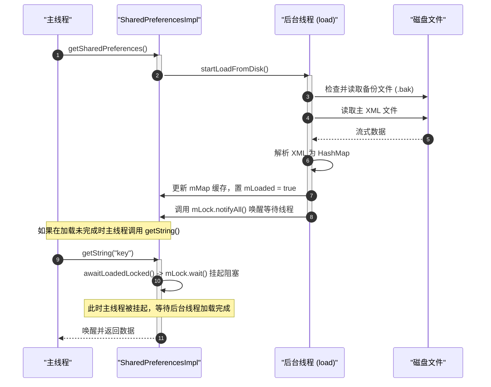
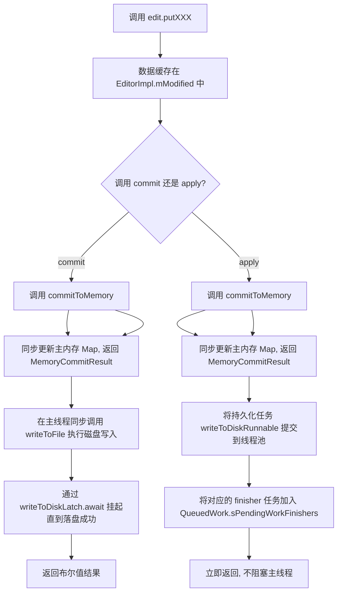
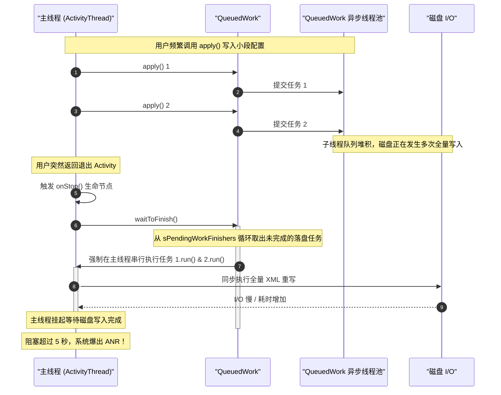

# Android SharedPreferences 深度剖析与性能优化

在 Android 开发中，`SharedPreferences`（简称 SP）是应用最为广泛的轻量级键值对存储组件。然而，由于其简便的 API 设计，开发者往往容易忽视其底层的实现机制与潜在的性能隐患。在实际的商业化项目中，因不当使用 SP 导致的主线程卡顿、ANR（Application Not Responding）以及多进程数据丢失问题频频发生。

本文将从源码维度深入剖析 SharedPreferences 的底层加载、同步/异步写入、`QueuedWork` 机制所引发的 ANR 隐患，以及多进程环境下的局限性，并给出相应的优化建议与现代替代方案。

---

## 目录导航
1. [一、SharedPreferences 核心概念与设计初衷](#一sharedpreferences-核心概念与设计初衷)
2. [二、SharedPreferences 初始化与底层加载机制](#二sharedpreferences-初始化与底层加载机制)
3. [三、数据写入机制：commit() 与 apply() 的根本差异](#三数据写入机制commit-与-apply-的根本差异)
4. [四、深层隐患：apply() 异步写入如何引发主线程 ANR](#四深层隐患apply-异步写入如何引发主线程-anr)
5. [五、内存缓存与多进程安全性分析](#五内存缓存与多进程安全性分析)
6. [六、常见误区与最佳实践](#六常见误区与最佳实践)
7. [七、现代替代方案：DataStore 与 MMKV](#七现代替代方案datastore-与-mmkv)

---

## 一、SharedPreferences 核心概念与设计初衷

SharedPreferences 是 Android 系统提供的一种轻量级的键值对存储机制。其核心特征可以概括为以下三点：

1. **基于 XML 文件存储**：SP 的数据最终持久化在磁盘上的 XML 文件中。文件存放在应用的私有数据目录下：`/data/data/<package_name>/shared_prefs/<filename>.xml`。
2. **全量读写模式**：无论是首次加载还是后续的修改写入，SP 都是以**文件为单位进行全量操作**。在写入时，即使只修改了一个键值对，SP 也必须将内存中所有的键值对重新序列化为 XML 格式，并以全量覆盖的方式写入磁盘文件。这决定了它只适合存储“体积小、结构简单”的配置数据。
3. **双重数据容器（内存 Map 缓存）**：SP 的读取操作之所以极快，是因为它在内存中维护了一个 Map 容器（`mMap`）。在 SP 被加载后，所有的读操作（如 `getString()`、`getInt()`）直接访问内存 Map，时间复杂度为 $O(1)$，完全不依赖磁盘 I/O。而写操作则是“先更新内存 Map，再同步或异步刷入磁盘”。

---

## 二、SharedPreferences 初始化与底层加载机制

### 2.1 实例获取与内存缓存
当我们通过 `Context.getSharedPreferences(String name, int mode)` 获取 SP 实例时，系统底层由 `ContextImpl` 进行具体实现。其核心步骤如下：

1. `ContextImpl` 内部维护了一个多层嵌套的静态缓存：`sSharedPrefsCache`（类型为 `ArrayMap<String, ArrayMap<File, SharedPreferencesImpl>>`），第一层 Key 是包名，第二层 Key 是 SP 对应的 File 对象。
2. 当我们请求特定名称 of SP 时，系统先在缓存中查找对应的 `SharedPreferencesImpl` 实例。如果存在，则直接返回，保证了在同一个进程中同一文件对应的 SP 实例具有**单例性**。
3. 如果缓存未命中，则会创建一个新的 `SharedPreferencesImpl` 实例，并放入缓存。

### 2.2 异步加载 XML 过程
在 `SharedPreferencesImpl` 的构造函数中，会立即触发文件的加载。其构造函数关键源码示意如下：

```java
SharedPreferencesImpl(File file, int mode) {
    mFile = file;
    mBackupFile = makeBackupFile(file);
    mMode = mode;
    mLoaded = false;
    mMap = null;
    mThrowable = null;
    startLoadFromDisk(); // 开启子线程进行异步磁盘加载
}
```

在调用 `startLoadFromDisk()` 后，系统会启动一个名为 `SharedPreferencesImpl-load` 的后台工作线程，执行 `loadFromDisk()`。该过程的时序与逻辑如下：



### 2.3 深入剖析 `loadFromDisk()`
在后台线程中执行的 `loadFromDisk()` 会进行一系列的安全与兼容性处理：

1. **备份文件检查（灾难恢复）**：
   在读取主文件之前，SP 会检查是否存在对应的 `.bak` 备份文件（备份文件的产生机制详见下文写入机制）。如果备份文件存在，说明上一次的磁盘写入过程中途发生异常（例如写入时应用崩溃或设备断电），主 XML 文件已处于损坏或不完整状态。此时，SP 会直接**删除主文件**，并将备份文件 `.bak` 重命名为主文件，实现状态回滚，确保数据的原子性与一致性。
2. **XML 流式解析**：
   使用 `BufferedInputStream` 读取磁盘文件，并通过 `XmlUtils.readMapXml()` 深度遍历 XML 树。解析得到的所有键值对会被存入一个新建的 `HashMap` 中。
3. **锁控制与状态更新**：
   当 XML 解析完毕，程序会获取 `mLock` 监视器锁，将内存变量 `mMap` 指向新构建的 Map，将加载标志位 `mLoaded` 设为 `true`，最后执行 `mLock.notifyAll()`。

### 2.4 首次读取的阻塞风险（`awaitLoadedLocked()`）
为了防止在 XML 尚未完全读入内存时，调用读接口返回错误或空数据，`SharedPreferencesImpl` 在其所有的读取方法（如 `getString()`、`getInt()`、`getAll()` 等）以及获取修改器方法 `edit()` 中，都强制加入了阻塞等待逻辑：

```java
private void awaitLoadedLocked() {
    if (!mLoaded) {
        // 触发 BlockGuard 监控，警告存在磁盘读取
        BlockGuard.getThreadPolicy().onReadFromDisk();
    }
    while (!mLoaded) {
        try {
            mLock.wait(); // 挂起调用者线程，释放 mLock
        } catch (InterruptedException unused) {
        }
    }
}
```

**性能隐患**：
如果在应用启动时（例如在 `Application.onCreate()` 或主 Activity 初始阶段）频繁调用 `getSharedPreferences()` 紧接着调用 `getString()`，一旦该 SP 文件较大（达到数百 KB 甚至数 MB 级别），主线程就会在 `awaitLoadedLocked()` 处的 `mLock.wait()` 上被长时间挂起，导致应用首帧加载延迟，严重时甚至触发首屏卡顿与 ANR。

---

## 三、数据写入机制：commit() 与 apply() 的根本差异

对 SharedPreferences 的修改操作都必须通过 `SharedPreferences.Editor` 接口完成（具体实现为 `EditorImpl`）。其内部使用另一个 `mModified` 变量（也是一个 Map 结构）来存放当前事务所包含的所有变更。

无论调用 `commit()` 还是 `apply()`，写入机制都会分为**同步内存提交**和**磁盘文件持久化**两个阶段：



### 3.1 核心第一阶段：同步提交内存 (`commitToMemory()`)
当开发者调用 `commit()` 或 `apply()` 时，都会首先执行 `commitToMemory()`。这是一个线程安全的同步方法，在调用者线程（通常是主线程）中运行：
- 它会深度拷贝（或者在必要时利用 Copy-On-Write 机制复制）当前的内存 Map，并与 `mModified` 中的改动作出合并，更新 `SharedPreferencesImpl` 中的 `mMap`。
- 构建并返回一个 `MemoryCommitResult`（内存提交结果对象）。该对象包含：
  - `mapToWriteToDisk`：用于磁盘持久化的只读 Map 快照。
  - `writeToDiskLatch`：用于同步控制的 `CountDownLatch(1)`。
  - `keysModified`：本次被修改的 key 集合。
  - `listeners`：注册的监听器集合。

由于完成了内存 Map 的更新，**在调用 `commit()` 或 `apply()` 的下一行代码去读取该 SP 键值对，就已经能获取到最新修改的数据了**。

### 3.2 核心第二阶段：磁盘持久化过程
在得到 `MemoryCommitResult` 后，系统调用 `enqueueDiskWrite()` 写入磁盘文件。此时 `commit()` 与 `apply()` 的分水岭便体现于此：

#### 3.2.1 commit() 的同步阻塞机制
在 `commit()` 的调用链路中：
1. 调用 `enqueueDiskWrite(mcr, null)`，其中第二个参数 `postWriteRunnable` 为 `null`。
2. 在 `enqueueDiskWrite()` 内部，系统判定 `postWriteRunnable == null`，表明这是一次同步持久化请求。
3. 为保障数据的时序与一致性，当前调用线程直接在当前上下文执行 `writeToFile(mcr, true)` 进行实际的物理磁盘写入。
4. 随后，调用 `mcr.writeToDiskLatch.await()` 挂起，直到文件写入完毕、系统返回 true 或 false 结果。
5. **弊端**：这导致磁盘 I/O 操作直接在当前线程（通常为主线程）中同步执行。主线程在此期间无法响应用户的任何交互，是极其常见的卡顿源。

#### 3.2.2 apply() 的异步排队机制
在 `apply()` 的调用链路中：
1. 构建一个 `postWriteRunnable`，其任务是：在磁盘写入成功后，调用 `mcr.setDiskWriteResult(true, true)` 并调用 `QueuedWork.removeFinisher(this)` 将自身从等待任务队列中清除。
2. 调用 `QueuedWork.addFinisher(postWriteRunnable)` 将该等待任务放入全局队列 `sPendingWorkFinishers` 中。
3. 调用 `enqueueDiskWrite(mcr, postWriteRunnable)`。
4. 因为 `postWriteRunnable` 不为 `null`，系统将落盘任务包装为一个 `writeToDiskRunnable`，调用 `QueuedWork.queue(writeToDiskRunnable, false)`，将其派发到后台单线程执行器（`singleThreadExecutor`）的队列中执行。
5. **优势**：`apply()` 无需等待 `writeToDiskLatch.await()` 即可立刻返回。对于调用线程来说，它是非阻塞的，极大地降低了前台 UI 卡顿的几率。

---

## 四、深层隐患：apply() 异步写入如何引发主线程 ANR

在绝大多数官方和第三方的技术文章中，都会建议“用 `apply()` 代替 `commit()`，因为 `apply()` 是异步的，不会引发卡顿”。然而，这其实隐瞒了一个关键的安全机制，导致 `apply()` 在某些特定场景下成了发生频繁且极难排查的 **主线程 ANR 灾难源**。

### 4.1 QueuedWork 的强制同步等待机制
为了防止应用在退出、切换、或者组件销毁时，异步线程中的磁盘写入任务尚未完成，导致用户数据丢失，Android 操作系统在其核心组件（`Activity`、`Service`、`BroadcastReceiver`）的生命周期切换时，引入了**数据强制落盘保护机制**。

当以下系统生命周期发生转变时，主线程通过 `ActivityThread` 最终会调用到 `QueuedWork.waitToFinish()` 方法：
- **Activity** 失去焦点或销毁时（例如 `handlePauseActivity()`、`handleStopActivity()`）。
- **Service** 停止或解除绑定时（例如 `handleStopService()`、`handleUnbindService()`）。

### 4.2 深入剖析 `QueuedWork.waitToFinish()` 源码
在 Android 8.0 之前，`QueuedWork` 内部等待机制的设计非常粗暴，直接在主线程中循环等待子线程完成任务。在 Android 8.0 / 8.1 之后（平台变化详细背景可见 [AndroidVersionChangeLog.md](../../../../../AndroidVersionChangeLog.md#android-80--81-api-26--27)），Google 对其进行了一次重构，但核心的同步等待逻辑依然保留：

```java
public static void waitToFinish() {
    Handler handler = getHandler();
    synchronized (sLock) {
        if (handler != null) {
            // 8.0+ 优化：移除尚未调度的异步写入消息，改为立刻在当前线程串行执行
            handler.removeMessages(QueuedWorkHandler.MSG_RUN);
        }
    }
    try {
        Runnable finisher;
        // 核心循环：不断从 sPendingWorkFinishers 中拉取任务
        while ((finisher = pollFirstPendingWorkFinisher()) != null) {
            finisher.run(); // 直接在主线程调用其 run() 方法！
        }
    } finally {
        ...
    }
}
```

### 4.3 为什么会引发 ANR？



通过时序图可以清晰看到，当主线程发起生命周期切换（例如销毁当前 Activity）时，`QueuedWork.waitToFinish()` 被触发。此时：
1. 它的核心机制是：把所有还在 `sPendingWorkFinishers` 队列中排队、尚未完成落盘的 `postWriteRunnable` 任务全部提取出来。
2. 这些异步任务并没有在后台线程继续慢慢跑，而是**被直接劫持到当前的主线程（UI 线程）上同步串行执行**。
3. 如果此时系统由于内存不足、磁盘碎片化、闪存设备老化或者频繁多次调用 `apply()` 产生了大量的 pending 任务，主线程就会被迫在 `finisher.run()` 的循环中进行高频的磁盘物理写入。
4. 单次全量写盘可能只需要十几毫秒，但几十个文件堆积，在 I/O 阻塞严重的设备上，总耗时极易超过 5 秒（Activity 响应时限）或 20 秒（Service 响应时限），从而彻底拉响 ANR 警报。

这就是为什么许多线上 APM 监控工具监控到主线程大量卡死在 `QueuedWork.waitToFinish` 方法上的本质根源。

---

## 五、内存缓存与多进程安全性分析

很多开发者为了在组件或进程间传递共享配置，将 SP 的打开模式配置为 `Context.MODE_MULTI_PROCESS`。然而，**SharedPreferences 根本不是多进程安全的组件**。

### 5.1 `MODE_MULTI_PROCESS` 的运行原理
在过去，当声明了 `MODE_MULTI_PROCESS` 后，系统在每次获取 SP 实例时，或者在调用读取方法前，会执行 `startReloadIfChangedIfNeeded()`：
- 通过系统调用检查磁盘上对应 XML 文件的 `lastModified`（上次修改时间）和文件大小（size）。
- 如果检测到文件发生变化，便清空内存 `mMap`，重新开线程从磁盘中加载并解析整个 XML。

### 5.2 为什么在多进程环境下极易发生数据异常？
1. **进程级别锁缺失**：
   `SharedPreferencesImpl` 内部的所有同步控制全部由 JVM 内部的锁（`synchronized` 块）来保护。这些锁只在一个 JVM 进程的内存空间内有效。当两个独立的物理进程（即两个独立的虚拟机）并发对同一个物理文件进行写入时，完全不存在跨进程的文件互斥锁（File Lock），这会导致：
   - 进程 A 和进程 B 同时进行全量 XML 覆盖写，导致最终的物理文件内容发生错乱、XML 语法格式损坏。
   - 进程 A 刚刚写入的数据，立刻被进程 B 写入的内容完全覆盖，出现严重的“写丢失”。
2. **数据同步延迟巨大**：
   即便开启了 `MODE_MULTI_PROCESS`，由于没有进程间通信（IPC）的主动通知机制，进程 B 无法在进程 A 发生写入的瞬间感知到。它必须等到自身再次触发 `getSharedPreferences()` 或特定的主动查询行为，依赖时间戳检查机制进行重新加载。在这种时钟周期内，进程 B 读取的极大概率是过期的脏数据。
3. **性能开销高昂**：
   频繁地进行 `lastModified` 系统文件属性查询以及由于时间戳变化导致的频繁 XML 全量解析，会产生极其恐怖的磁盘 I/O 开销，拉低整个系统的流畅度。

因此，Android 官方早已将 `MODE_MULTI_PROCESS` 标记为废弃（`@Deprecated`），并且明确警告不应当在此类场景使用。

---

## 六、常见误区与最佳实践

### 6.1 典型使用误区
* **误区一：存放复杂、巨大的数据结构（如缓存大段 JSON）**：
  由于 SP 底层基于全量 XML 解析与序列化，将长达数 KB 甚至数十 KB 的 JSON 字符串存入 SP，每次调用 `apply()` 都会产生巨大的 CPU 与磁盘吞吐负担。这类操作应交由 SQLite、Room 数据库或纯二进制文件流去处理。
* **误区二：在循环或频繁操作中多次获取 Editor 并写入**：
  ```java
  // 错误示范：产生大量磁盘写入任务堆积在 QueuedWork
  for (int i = 0; i < 1000; i++) {
      SharedPreferences.Editor editor = sp.edit();
      editor.putInt("key_" + i, i);
      editor.apply(); 
  }
  ```
  这样会在一瞬间产生 1000 个独立的落盘任务和 `postWriteRunnable` 挂载到 `QueuedWork` 队列中，极概率导致后续组件切换时直接发生 `waitToFinish` 主线程 ANR。

### 6.2 最佳实践原则
1. **合理进行单例封装**：
   避免每次使用时都调用 `Context.getSharedPreferences()`，应用中应当全局持有一个单例的配置管理类，避免重复读取缓存的开销。
2. **合并批量提交**：
   当有多项数据需要更新时，必须获取同一个 `Editor` 实例，进行多项 `put` 后，进行一次性 `apply()` 提交：
   ```java
   // 正确示范：仅产生一次物理文件写入任务
   SharedPreferences.Editor editor = sp.edit();
   for (int i = 0; i < 1000; i++) {
       editor.putInt("key_" + i, i);
   }
   editor.apply(); 
   ```
3. **根据业务做精细化文件拆分**：
   不要将所有配置一股脑堆在同一个全局 SP 文件中。应按照业务模块进行合理隔离，如 `user_prefs.xml`、`network_config.xml`、`theme_settings.xml`。确保高频更新的文件体积小，低频更新的文件互不影响。
4. **拒绝明文保存敏感信息**：
   SP 底层在磁盘上是明文 XML 格式存放，若设备被 Root 甚至通过简单的文件读取工具，就能直接截获其中的 Token、密码等隐私数据。若要保存此类信息，必须加密后再存入，或采用系统级自带的 `EncryptedSharedPreferences`。

---

## 七、现代替代方案：DataStore 与 MMKV

为了彻底解决 SharedPreferences 在加载阻塞、异步 ANR 以及多进程不安全等方面的硬伤，业界目前主要推荐两种替代方案：**Jetpack DataStore** 和 **腾讯 MMKV**。

### 7.1 Jetpack DataStore
`Jetpack DataStore` 是 Android 官方为了取代 SharedPreferences 而推出的全新数据存储库。它包含了两种具体实现：
- **Preferences DataStore**：使用键值对方式存储数据，无需声明 Schema。
- **Proto DataStore**：使用 Protocol Buffers 存储结构化数据，提供强类型安全。

#### DataStore 针对 SP 硬伤的革新：
* **完全基于协程异步执行**：DataStore 底层读写完全利用 Kotlin 协程与 Flow，所有的 I/O 操作都会明确分发给非 UI 线程（如 `Dispatchers.IO`）。
* **消除 waitToFinish ANR**：它没有像 `QueuedWork` 这样在 Activity/Service 生命周期切换时强行阻塞主线程串行写盘的设计，从而彻底根除了 ANR 的物理机制。
* **数据事务一致性**：通过 `Mutex` 互斥体实现数据更新的原子事务，解决了 SP 修改过程中断电导致数据损坏的问题。

### 7.2 腾讯 MMKV
`MMKV` 是腾讯微信团队开源的轻量级高性能 Key-Value 组件，目前广泛应用于国内绝大多数中大型 App 中。

#### MMKV 核心机制与优势：
1. **基于 `mmap`（内存映射）技术**：
   传统的磁盘写入需要经过“用户空间内存 -> 内核空间缓冲 -> 物理磁盘”的两次拷贝与刷盘流程。而 `mmap` 通过将文件描述符直接映射到进程的虚拟内存空间中，使得程序读写该内存区域就相当于直接操作磁盘文件。数据更新由操作系统在后台通过页缓存（Page Cache）机制异步写回磁盘。即便应用在写入时遭遇系统崩溃或异常断电，映射区内的数据大概率已安全写入内核缓冲中，极大地杜绝了数据丢失。同时，因为没有同步阻塞的磁盘 I/O，**读写性能极高，无限接近直接读写内存 Map**。
2. **基于 Protocol Buffers 的增量协议**：
   MMKV 不像 SP 那样每次写入都进行全量 XML 重构。它采用 Protobuf 格式进行编码，支持增量追加写入。每次有新的修改，直接将数据打包追加在文件尾部，当文件空间不足时再进行整理压缩，磁盘写入量极其轻量。
3. **多进程并发安全**：
   MMKV 在底层使用跨进程文件互斥锁（File Lock）对写入动作进行加锁，并利用共享内存机制实时感知其他进程的数据修改，完美支持多进程高并发场景。

### 7.3 方案对比选型建议

| 比较维度 | SharedPreferences | Jetpack DataStore | 腾讯 MMKV |
| :--- | :--- | :--- | :--- |
| **读性能** | 极快（直接读内存 Map） | 中等（Flow 流式读取） | 极快（mmap 内存映射） |
| **写性能** | 较慢（全量重写磁盘 XML） | 较快（异步落盘） | 极快（直接修改 mmap 内存） |
| **ANR 隐患** | **极高**（初始化阻塞/生命周期同步） | **无**（完全基于协程挂起） | **无**（mmap 无显式磁盘等待） |
| **多进程安全** | 不安全（MODE_MULTI_PROCESS 废弃） | 暂不支持（需要配合 IPC） | **安全**（支持跨进程锁与同步） |
| **数据格式** | XML 键值对 | 二进制 / Protocol Buffers | Protocol Buffers 增量追加 |
| **使用成本** | 极低（原生支持） | 中等（需要引入协程/Flow） | 较低（需要集成 C++ so 库） |

对于现存项目，如果面临线上明显的卡顿或 ANR 问题，应当逐步使用 `DataStore` 进行安全重构；若业务涉及频繁的多进程数据同步，`MMKV` 则是当前技术选型中的不二之选。
