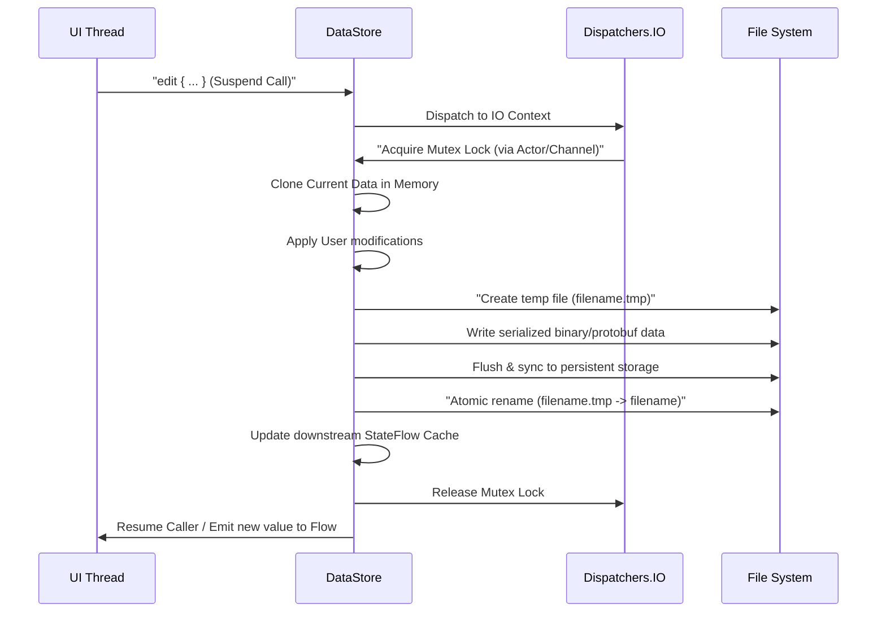

# 5.1.5.2 Jetpack DataStore 机制与设计分析

在 Android 应用程序中，轻量级本地数据存储是一个极其高频的需求。在很长一段时间里，`SharedPreferences`（简称 SP）是官方推荐的唯一轻量级键值存储方案。然而，随着 Android 平台的演进以及现代响应式编程（Reactive Programming）和协程的普及，SP 的诸多底层设计缺陷逐渐暴露，成为导致应用卡顿、ANR 甚至数据损坏的主要技术债务之一。

为了彻底解决这些痛点，Google 在 Jetpack 组件库中推出了 **Jetpack DataStore**。DataStore 是一种全新的、异步的、事务性的数据存储方案，完全基于 Kotlin 协程和 Flow 构建。它不仅解决了 SP 所有的核心痛点，还引入了强类型安全支持（Proto DataStore），是 Android 平台轻量级存储的现代化演进方向。

---

## 1. 核心概念与设计初衷（是什么）

### 1.1 Jetpack DataStore 的定义
**Jetpack DataStore** 是 Google 推出用于替代 `SharedPreferences` 的新一代异步数据存储解决方案。其核心设计思想是**非阻塞（Non-blocking）**与**响应式（Reactive）**。它将所有的文件读取、写入和解析操作完全封装在协程中，通过 Kotlin Flow 向外暴露数据变化，实现了真正意义上的数据流式响应。

### 1.2 为什么需要替代 SharedPreferences
传统的 `SharedPreferences` 本质上是一个运行在主线程内存缓存中的 XML 文件。虽然它使用简单，但在设计上存在以下致命问题：
1. **主线程阻塞风险**：虽然获取 SP 实例是异步的，但读取数据（`getXXX`）在 XML 文件加载完成前会引发同步阻塞；
2. **异步落盘触发主线程 ANR**：`apply()` 虽然是异步写入内存并提交后台落盘，但其在 Activity、Service 等组件生命周期重建或销毁时，系统会强行在主线程同步等待落盘任务完成（`QueuedWork.waitToFinish()`），极其容易触发 ANR；
3. **类型不安全**：键值对只支持基本类型，容易发生强制类型转换异常（`ClassCastException`）；
4. **无异常恢复机制**：解析 XML 失败时，没有任何恢复拦截器，容易造成数据丢失或崩溃。

DataStore 针对这些问题进行了重新设计，并在 Preferences DataStore 与 Proto DataStore 两种实现形态中予以具体落实。

### 1.3 Preferences DataStore 与 Proto DataStore 的核心对比

| 特性 | Preferences DataStore | Proto DataStore |
| :--- | :--- | :--- |
| **存储数据格式** | 键值对（Key-Value pairs） | 结构化对象（Protocol Buffers 协议） |
| **类型安全** | 弱类型安全（运行时需要通过 `Preferences.Key` 约束） | 强类型安全（编译期生成具体 Java/Kotlin 数据模型） |
| **Schema 约束** | 无 | 有（通过 `.proto` 文件严格定义结构） |
| **复杂对象支持** | 较难（通常需要将复杂对象转换为 JSON 字符串存储） | 极其友好（天然支持嵌套、列表等复杂对象结构） |
| **序列化开销** | 中等（XML 替换为二进制的 Preferences 结构） | 极低（Protobuf 具有高效的二进制压缩率和序列化性能） |
| **适用场景** | 简单的配置开关、少量偏好设置 | 复杂的结构化数据存储，有严格版本迭代需求的数据 |

---

## 2. 深入剖析 SharedPreferences 的硬伤与痛点（为什么）

要深刻理解 DataStore 的优秀设计，必须首先从源码层面解构 `SharedPreferences` 的诸多硬伤。

### 2.1 隐患一：加载阻塞主线程与内存开销
当我们在代码中调用 `context.getSharedPreferences("sp_name", Context.MODE_PRIVATE)` 时，Android 系统会开启一个单线程的后台线程去读取 XML 文件并解析为内存中的 `Map`。

```java
// SharedPreferencesImpl.java 源码分析
private final class MemoryCommitResult {
    // 内存中的偏好设置映射
    final Map<String, Object> mapToWriteToDisk;
    // ...
}
```

由于解析是在后台线程进行的，此时如果在主线程中紧接着调用 `sp.getString("key", null)`，而后台线程还没有将 XML 文件解析完毕，就会发生什么？
我们来看 `SharedPreferencesImpl.java` 的读取方法源码：

```java
public String getString(String key, @Nullable String defValue) {
    synchronized (mLock) {
        awaitLoadedLocked(); // 如果未加载完成，主线程会在这里进行 wait()
        String v = (String)mMap.get(key);
        return v != null ? v : defValue;
    }
}
```

在 `awaitLoadedLocked()` 方法中，如果 XML 尚未加载完成，主线程将被迫调用 `mLock.wait()` 进入阻塞状态。
此外，SP 底层是使用内置的 `XmlUtils`（基于 `KXmlParser`）将整个 XML 文件的键值对全部反序列化并加载到内存的一个 `HashMap` 中。由于 XML 标签解析需要实例化大量的 `String` 对象、包装类（如 `Integer`、`Boolean`）以及 `Map.Entry` 节点，这在 XML 文件较大时会产生极大的内存开销和频繁的垃圾回收（GC），甚至引发内存抖动。如果磁盘 I/O 处于繁忙状态，主线程在 `wait()` 处的阻塞时间会进一步拉长，从而引发严重的卡顿甚至 ANR。

### 2.2 隐患二：apply() 触发 QueuedWork 导致 ANR
开发者通常被告知：“不要用 `commit()`，因为它是同步写入磁盘的；要用 `apply()`，因为它是异步写入磁盘的，不会阻塞主线程。” 
然而，这只是表面现象。`apply()` 虽然在调用时立即返回并异步提交落盘任务，但它会向 `QueuedWork` 队列中注册一个等待任务：

```java
// SharedPreferencesImpl.java 源码分析
public void apply() {
    final MemoryCommitResult mcr = commitToMemory();
    final Runnable awaitCommit = new Runnable() {
            public void run() {
                try {
                    mcr.writtenToDiskLatch.await(); // 等待写入磁盘完成
                } catch (InterruptedException ignored) {
                }
            }
        };

    QueuedWork.addFinisher(awaitCommit); // 注册到 QueuedWork 队列中

    Runnable postWriteRunnable = new Runnable() {
            public void run() {
                awaitCommit.run();
                QueuedWork.removeFinisher(awaitCommit);
            }
        };

    SharedPreferencesImpl.this.enqueueDiskWrite(mcr, postWriteRunnable);
}
```

这里注册的 `awaitCommit` 任务，在 Activity 的 `onStop()`、`onDestroy()`，或者 Service 的 `onStop()` 等系统组件生命周期流转时，会被系统底层强制执行同步等待。
我们以 ActivityThread 的 `handleStopActivity` 为例：

```java
// ActivityThread.java 源码分析
@Override
public void handleStopActivity(ActivityClientRecord r, int configChanges,
        PendingTransactionActions pendingActions, boolean finalStateLoop, String reason) {
    // ...
    // 强制将 QueuedWork 中的所有落盘任务在主线程同步执行完毕！
    QueuedWork.waitToFinish(); 
    // ...
}
```

`QueuedWork.waitToFinish()` 会同步等待所有注册在其中的异步写入任务完成。由于磁盘 I/O 的不确定性，如果此时后台写入任务较多或磁盘出现高负载，主线程就会在 `waitToFinish()` 处卡死。由于 Activity 组件的生命周期切换有着严格的超时时间限制（通常为 10 秒，但在前台响应等场景下更短），一旦超时，系统便会判定 ANR。这就是 Android 开发中著名的 **“QueuedWork.waitToFinish ANR”** 问题。

### 2.3 隐患三：备份文件（`.bak`）机制的开销与脆弱性
为了防止文件写入过程中发生断电或崩溃导致原 XML 文件损坏，SharedPreferences 引入了一个简单的备份文件机制：
1. 每次写入前，SP 会检查是否存在原 XML 文件。如果存在，会将其重命名为 `.bak` 后缀的备份文件（如 `sp_name.xml.bak`）；
2. 接着开始写入新的 XML 内容到 `sp_name.xml`；
3. 如果写入成功，则在磁盘落盘完成后删除备份文件 `.bak`；
4. 如果中途崩溃，下次启动时，如果发现有旧的 `.bak` 文件且主 XML 文件不存在或为空，则将 `.bak` 恢复为原文件。

虽然该机制提供了基本的容错保障，但其频繁的文件重命名和删除操作带来了不必要的 I/O 开销。更为脆弱的是，如果 XML 写入时刚好完成了一半而产生不完整的 XML 闭合标签，系统在读取时依然会尝试解析损坏的 XML，从而抛出底层的解析异常（如 `XmlPullParserException`），最终导致读取失败甚至崩溃。

---

## 3. DataStore 实现机制与读写架构（怎么做）

针对上述痛点，Jetpack DataStore 摒弃了 SP 的设计架构，采用了**协程挂起 + 互斥锁控制 + 原子重命名磁盘写入**的现代方案。

### 3.1 Preferences DataStore 的声明与使用
Preferences DataStore 使用类似于 SP 的键值对方式，但读取时返回的是一个 `Flow`，写入时是挂起函数。

```kotlin
// 声明 DataStore
val Context.dataStore: DataStore<Preferences> by preferencesDataStore(name = "user_settings")

// 定义 Key
val USER_NAME_KEY = stringPreferencesKey("user_name")
val AGE_KEY = intPreferencesKey("age")
```

### 3.2 Proto DataStore 的声明与使用
Proto DataStore 是类型安全的，首先需要通过 Protocol Buffers 定义 `.proto` 结构：

```protobuf
// src/main/proto/user_prefs.proto
syntax = "proto3";

option java_package = "com.example.android.datastore";
option java_multiple_files = true;

message UserSettings {
  string user_name = 1;
  int32 age = 2;
}
```

实现 `Serializer` 接口来处理序列化与反序列化：

```kotlin
import androidx.datastore.core.Serializer
import java.io.InputStream
import java.io.OutputStream

object UserSettingsSerializer : Serializer<UserSettings> {
    override val defaultValue: UserSettings = UserSettings.getDefaultInstance()

    override suspend fun readFrom(input: InputStream): UserSettings {
        try {
            return UserSettings.parseFrom(input)
        } catch (exception: Exception) {
            throw CorruptionException("Cannot read proto.", exception)
        }
    }

    override suspend fun writeTo(t: UserSettings, output: OutputStream) = t.writeTo(output)
}

// 声明 DataStore
val Context.protoDataStore: DataStore<UserSettings> by dataStore(
    fileName = "user_settings.pb",
    serializer = UserSettingsSerializer
)
```

---

### 3.3 读写机制剖析

#### 3.3.1 读机制（Cold Flow 与内存缓存）
DataStore 读取数据是通过暴露一个 Kotlin Flow 属性 `dataStore.data` 来实现的。
1. **冷流启动（Cold Flow）**：当外部调用者开始 `collect` 这个 Flow 时，DataStore 才会去触发内部的加载流程；
2. **内存缓存（In-memory Cache）**：首次从磁盘成功读取数据后，DataStore 会在内存中缓存当前最新的值（实际上保存在 `StateFlow` 中）。随后如果文件发生变更，DataStore 会自动发射新值通知订阅者，之后的读取操作可以直接利用内存缓存，避免了重复读盘；
3. **非阻塞主线程**：即使调用者在主线程启动收集，DataStore 也会自动在构建时指定的 IO 调度器（通常是 `Dispatchers.IO`）上读取磁盘，绝不阻塞 UI 主线程。

#### 3.3.2 写机制（异步原子写入与 Mutex 互斥锁）
在 DataStore 中，所有的写入操作都是挂起函数。
对于 Preferences DataStore 使用 `dataStore.edit { ... }`；
对于 Proto DataStore 使用 `dataStore.updateData { ... }`。

我们来看 DataStore 的底层写操作是如何保证多线程并发安全的。
在 `SingleProcessDataStore`（DataStore 的核心实现类）的源码中，写操作在后台是由 **协程互斥锁 `Mutex`** 进行保护的。

实际上，DataStore 底层通过一个 `Actor`（内部基于 Channel 实现的协程协作者模式）来串行化所有的读取和更新请求，从而避免了传统线程同步锁带来的死锁和开销。

在 `handleUpdate` 过程中，会执行真正的磁盘写入：

```kotlin
private suspend fun handleUpdate(update: Message.Update<T>) {
    // 1. 拷贝当前内存缓存，传递给 update.transform 闭包计算新值
    val curData = dataFlow.value.checkDecrypted()
    val newData = update.transform(curData)

    if (newData != curData) {
        // 2. 写入临时文件
        writeData(newData)
        // 3. 将最新值推入内存缓存，触发 Flow 的收集者更新
        dataFlow.value = Data(newData, newData.hashCode())
    }
}
```

#### 3.3.3 原子写入流程与临时文件覆盖
为了防止写入时发生系统崩溃、断电导致文件损坏，DataStore 采用了**原子落盘（Atomic Rename）**机制：
1. 写入时，首先创建一个临时文件（扩展名为 `.tmp`）；
2. 将序列化后的数据完整写入到 `.tmp` 文件中；
3. 强行刷新（`flush()`）和同步（`getFD().sync()`）到物理磁盘介质；
4. 调用文件系统的 `renameTo()` 操作系统级原子接口，用临时文件替换原始的目标数据文件。

这一流程确保了即使落盘时突然断电或被强制终止，系统磁盘中也只会存在“完全写入成功的旧文件”或“完全写入成功的新文件”，绝不会出现写入一半损坏的文件。



---

### 3.4 异常处理与恢复机制

在数据读写过程中，磁盘读取崩溃、解析损坏是无法逃避的问题。DataStore 提供了完善的异常处理器机制。

#### 3.4.1 读取与解析中的 IOException 捕获
在 Flow 的链式调用中，我们可以通过 `catch` 操作符捕获所有的 `IOException` 并进行安全重置（如置为默认配置）：

```kotlin
val userPreferencesFlow: Flow<UserPreferences> = context.dataStore.data
    .catch { exception ->
        if (exception is IOException) {
            // 当磁盘读取遇到 IOException 时，发射默认值以确保应用不发生崩溃
            emit(emptyPreferences())
        } else {
            throw exception
        }
    }
```

#### 3.4.2 拦截损坏数据的 CorruptionHandler 机制
当文件存在但因数据被异常修改导致解析器（如 Protobuf）解析失败并抛出 `CorruptionException` 时，我们可以使用 `CorruptionHandler` 对其进行自动修复与重建。

以下是在 Proto DataStore 初始化时设置 `CorruptionHandler` 的示例：

```kotlin
val Context.userDataStore: DataStore<UserSettings> by dataStore(
    fileName = "user_settings.pb",
    serializer = UserSettingsSerializer,
    corruptionHandler = ReplaceFileCorruptionHandler { exception ->
        // 当文件损坏时，提供默认的备用数据方案，此处将数据恢复到初始默认值
        // 它的底层机制是在处理完毕后，重新把默认值写回磁盘，实现自动修复
        Log.e("DataStore", "Detected corruption, resetting to default.", exception)
        UserSettings.getDefaultInstance()
    }
)
```

---

### 3.5 线程调度机制分析

DataStore 的一大原则是**禁止主线程 I/O**。
其内部主要通过以下设计实现这一保障：

```kotlin
// SingleProcessDataStore.kt 源码实现片段
private suspend fun readDataFromFileOrDefault(): T {
    return try {
        // 所有的磁盘读操作都在指定的工作上下文（协程作用域）中执行
        withContext(scope.coroutineContext) {
            val fileInputStream = FileInputStream(file)
            serializer.readFrom(fileInputStream)
        }
    } catch (e: FileNotFoundException) {
        if (file.exists()) throw e
        serializer.defaultValue
    }
}
```
1. **统一工作协程域（Scope）**：DataStore 的构造函数中需要传入或默认创建一个 `CoroutineScope`。它的上下文一般包含了 `Dispatchers.IO`。
2. **内部线程切换**：无论调用者处于哪个线程（即便是在 UI 主线程上触发了 Flow 的搜集），DataStore 底层读写的核心执行块都使用 `withContext(scope.coroutineContext)` 强行将执行上下文转移到指定的后台 IO 线程上。
3. **非阻塞等待**：因为协程的特性，`withContext` 不会像普通 Java 阻塞那样卡住当前调用者所在的线程，而是让当前协程挂起，等到后台 IO 写入或读取完毕后，再将结果返回恢复执行。对于 UI 线程来说，只是挂起，UI 线程可以继续运行其他的渲染任务，彻底消除了卡顿可能。

---

## 4. 常见误区与最佳实践

虽然 DataStore 性能优秀且设计安全，但若沿用旧的 SharedPreferences 阻塞思维来编写 DataStore 代码，极易引发严重问题。

### 4.1 核心误区：在 UI 主线程中使用 runBlocking 同步等待
在从 SP 迁移到 DataStore 时，由于旧的代码架构是同步返回的，很多开发者不愿意将整个链路重构成 Flow 异步流，于是写出了类似下面的代码：

```kotlin
// ❌ 极度危险的代码示例
val userName = runBlocking {
    context.dataStore.data.first()[USER_NAME_KEY]
}
```

#### 4.1.1 为什么 runBlocking 极易引发主线程死锁（ANR）
1. **主线程被同步挂死**：`runBlocking` 的设计是将当前线程强行阻塞，直到其闭包内部的协程任务全部执行完毕。
2. **Android 主线程消息循环机制挂起**：Android 系统的 UI 渲染、事件触摸分发都是依靠主线程 `Looper` 消息队列（MessageQueue）循环驱动的。`runBlocking` 内部会启动一个私有的事件循环，去阻塞并接管当前线程。
3. **双向阻塞导致 ANR**：当我们在主线程调用 `runBlocking` 时，主线程的消息循环便暂停了。与此同时，DataStore 的 `data.first()` 需要通过 `Dispatchers.IO` 线程池去读取磁盘数据。如果 DataStore 在加载初始化期间，其内部逻辑或关联的生命周期回调中，需要通过主线程的 Handler 或协程的 `Dispatchers.Main` 分发某些配置事件或执行同步通知，这个分发任务便会被投递到主线程的 MessageQueue 中排队。然而，此时主线程正被 `runBlocking` 牢牢锁死，根本无法腾出空闲去处理 MessageQueue 中的新消息。这就形成了：**主线程在阻塞等待 IO 线程返回数据，而 IO 线程在异步等待主线程处理回调分发** 的典型双向死锁。
4. **触发 ANR**：由于死锁，主线程在 5 秒内无法响应任何外界触摸或按键事件，系统随即抛出 ANR 错误窗口。

**正确解法**：全面拥抱响应式编程，使用 Flow 的数据驱动架构，或者在协程中异步调用并挂起：

```kotlin
//   在协程作用域或生命周期感知的协程中异步处理
lifecycleScope.launch {
    context.dataStore.data
        .map { preferences -> preferences[USER_NAME_KEY] }
        .collect { userName ->
            // 更新 UI 界面
            binding.tvUsername.text = userName
        }
}
```

---

### 4.2 最佳实践：从 SharedPreferences 无缝迁移至 DataStore
Google 极其贴心地为 DataStore 提供了内置的 `SharedPreferencesMigration`（SP 迁移）机制。

#### 4.2.1 迁移机制的工作原理
当我们在创建 DataStore 时传入了 `SharedPreferencesMigration` 对象：
1. **触发时机**：迁移是一次性的。只有在 DataStore **首次进行数据访问（Read 或 Write）**时，才会触发迁移过程；
2. **原子迁移流程**：
   - 检查迁移条件（判断是否已经迁移过）；
   - 从旧的 SharedPreferences 文件中读取所有键值对；
   - 调用指定的映射规则将这些键值对写入 DataStore 磁盘；
   - 写入成功后，自动清空并删除对应的旧 SharedPreferences 文件（以及与之相关的 `.bak` 备份文件）；
   - 在整个迁移事务执行完之前，其他的 DataStore 读写请求都会被挂起等待，确保了数据的强一致性；
   - 所有的迁移逻辑都在 DataStore 底层的互斥锁（Mutex）保护之下，防止多次重复运行。

#### 4.2.2 详细迁移代码示例

以下展示了如何将一个现有的名为 `user_sp_info` 的 SharedPreferences 迁移到 Preferences DataStore 的完整实践代码：

```kotlin
import android.content.Context
import androidx.datastore.core.DataStore
import androidx.datastore.preferences.SharedPreferencesMigration
import androidx.datastore.preferences.core.Preferences
import androidx.datastore.preferences.core.edit
import androidx.datastore.preferences.core.preferencesDataStore

// 定义迁移规则
val USER_SP_NAME = "user_sp_info"

val Context.migratedDataStore: DataStore<Preferences> by preferencesDataStore(
    name = "migrated_user_settings",
    produceMigrations = { context ->
        // 使用内置 of SharedPreferencesMigration 构建器
        listOf(
            SharedPreferencesMigration(
                context = context,
                sharedPreferencesName = USER_SP_NAME,
                // 可选参数 keysToMigrate：指定迁移哪些 Key，如果不指定则默认迁移所有 Key
                keysToMigrate = setOf("sp_user_name", "sp_user_age")
            ) { sharedPrefs, currentPreferences ->
                // 这里可以自定义迁移时的逻辑映射（例如重命名 Key）
                val mutablePreferences = currentPreferences.toMutablePreferences()
                
                // 从旧 SP 读值
                val oldName = sharedPrefs.getString("sp_user_name", "") ?: ""
                val oldAge = sharedPrefs.getInt("sp_user_age", 0)
                
                // 存入新的 DataStore Key（支持对键值重新组织命名）
                mutablePreferences[stringPreferencesKey("user_name")] = oldName
                mutablePreferences[intPreferencesKey("user_age")] = oldAge
                
                mutablePreferences
            }
        )
    }
)
```

---

## 5. 源码深度解析（源码导读）

要真正掌握 DataStore 的内部运转机制，我们需要深入探究核心类 `SingleProcessDataStore` 的实现原理。

### 5.1 内存缓存 StateFlow
在类定义中，维护数据状态的最核心变量是 `downstreamFlow`，它是一个热流：

```kotlin
// SingleProcessDataStore.kt 内部代码
private val downstreamFlow = MutableStateFlow<State<T>>(State.Uninitialized)
```
当我们调用 `dataStore.data` 时，其实在底层返回的就是这个流经过过滤和类型封装后的只读 Flow：

```kotlin
override val data: Flow<T> = flow {
    // 1. 先触发一次读取（主要是读取文件更新缓存）
    val current = downstreamFlow.value
    if (current is State.Uninitialized) {
        readAndInit() // 读取并初始化
    }
    // 2. 映射下游数据
    emitAll(downstreamFlow.map { state ->
        when (state) {
            is State.Success -> state.value
            is State.Failure -> throw state.exception
            is State.Uninitialized -> error("Uninitialized")
        }
    })
}
```

### 5.2 串行任务调度器 SimpleActor
为了确保写操作不发生并发冲突，`SingleProcessDataStore` 并没有使用繁重的 Java 互斥同步锁，而是使用了一个自制的轻量级协程 `SimpleActor`（底层通过协程 `Channel` 轮询消息）。

所有针对数据的修改请求（包括初始化、迁移、更新）都会被封装成一个消息推入 `SimpleActor` 队列中：

```kotlin
// SimpleActor 处理读写消息
private val actor = SimpleActor<Message<T>>(
    scope = scope,
    onComplete = { ... },
    onUndeliveredElement = { ... }
) { msg ->
    when (msg) {
        is Message.Read -> handleRead(msg)
        is Message.Update -> handleUpdate(msg)
    }
}
```
因为协程的 `Channel` 天然是线程安全的、非阻塞的且按顺序分发的，这保证了不管有多少个线程同时调用 `edit` 或是 `updateData`，它们都会在 `Actor` 的协程上下文中**排队执行**，彻底杜绝了并发写入导致的数据交错与脏数据。

### 5.3 多进程并发安全性分析与限制
需要明确指出的是，`SingleProcessDataStore`（即我们通常使用的默认 DataStore 实例）是**不支持跨进程并发读写**的。
1. **原因分析**：因为 `SingleProcessDataStore` 的状态主要是缓存在内存中的 `MutableStateFlow`。在多进程环境下，每个进程都有独立的虚拟机（JVM）内存空间。如果进程 A 修改了磁盘文件，DataStore 会通过其原子落盘更新进程 A 的内存缓存，但是进程 B 却完全感知不到磁盘文件的变化，其内存中的 `StateFlow` 仍然维持着旧值。
2. **后果**：如果进程 B 随后发起写操作，它会在旧值的基础之上进行修改并再次写入磁盘，这会直接**覆盖**掉进程 A 刚刚写入的新数据，造成严重的数据不一致与丢失。
3. **多进程解决方案**：如果应用确有跨进程轻量存储需求，官方建议使用支持多进程并发的专用 DataStore 实现（如果可用），或使用支持跨进程的 Room 数据库，亦或是基于底层的 ContentProvider / Messenger 等 IPC 机制进行数据同步。

---

## 6. Jetpack DataStore 与 Room 的选型对比

在项目架构设计中，除了替代 SharedPreferences，我们经常需要权衡是使用 **Jetpack DataStore** 还是 **Room 数据库**。以下是两者的深度对比：

| 维度 | Jetpack DataStore | Room Database |
| :--- | :--- | :--- |
| **底层存储介质** | 本地文件（二进制偏好文件或 Proto 缓存） | SQLite 关系型数据库 |
| **查询能力** | 无关系查询，只能全量读写或依靠 Flow 进行内存键过滤 | 支持强大的 SQL 语句、多表关联（Join）、索引（Index）与聚合查询 |
| **事务支持** | 支持简单的文件级写入事务 | 支持复杂的数据库事务，具有强一致性与回滚机制 |
| **数据规模** | 适用于轻量级偏好设置（几 KB 到几百 KB） | 适用于海量结构化数据（几 MB 到数 GB 级） |
| **多线程支持** | 底层完全协程化，读写由 Mutex 串行化保护 | 结合 SQLite 读写锁，支持并发多通道读写 |
| **开发维护成本** | 极低（Preferences 类型无需任何配置，即开即用） | 中等（需配置 Entity、Dao、Database 及维护 SQL 升级迁移） |

### 选型决策树：
- **优先选择 DataStore**：当需要存储的内容只是用户的登录状态、应用主题模式、简单的偏好开关、少量的键值对，或者不需要进行条件检索和多表级联查询时。
- **优先选择 Room**：当需要存储具有实体关系的大量业务数据（如聊天记录、商品列表、本地缓存的文章）、需要根据特定字段进行 `WHERE` 检索/排序、或者存在高频的复杂多表事务操作时。

---

## 7. 版本兼容与延伸阅读

Jetpack DataStore 的推出使得 Android 的轻量级本地数据存储迎来了真正的现代化转变。在适配高版本 Android 系统及不同的编译平台时，需要注意其版本特性：

- **版本稳定性**：DataStore 从 `1.0.0` 版本起正式投入商用稳定期，API 设计已经基本定型，可以在生产环境放心替代 SharedPreferences。
- **Android 系统适配**：DataStore 能够平稳向下兼容到 **Android 5.0 (API 21)**，由于其使用的是文件系统最基础的文件操作（`File.renameTo` 等），所以在 Android 10、11、12、13 及更新的版本中，DataStore 完全不受分区存储（Scoped Storage）的限制（因为其数据文件存储在应用的私有内部沙盒路径下，即 `/data/data/your_package/files/datastore/`）。
- **多平台发展**：随着 Kotlin Multiplatform (KMP) 的发展，DataStore 在 `1.1.0` 及以后版本中已全面支持多平台适配。这意味着，你可以在 Android、iOS、JVM、Desktop 等多个平台上复用同一套 DataStore 的业务读写逻辑。

具体的 Android 版本兼容变迁及系统优化升级记录，可参考：[Android 核心版本变更日志](../../../../../AndroidVersionChangeLog.md)。
