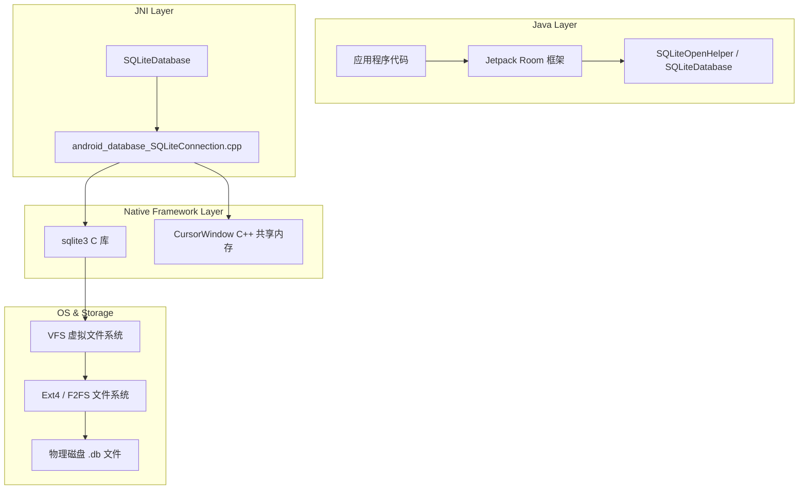
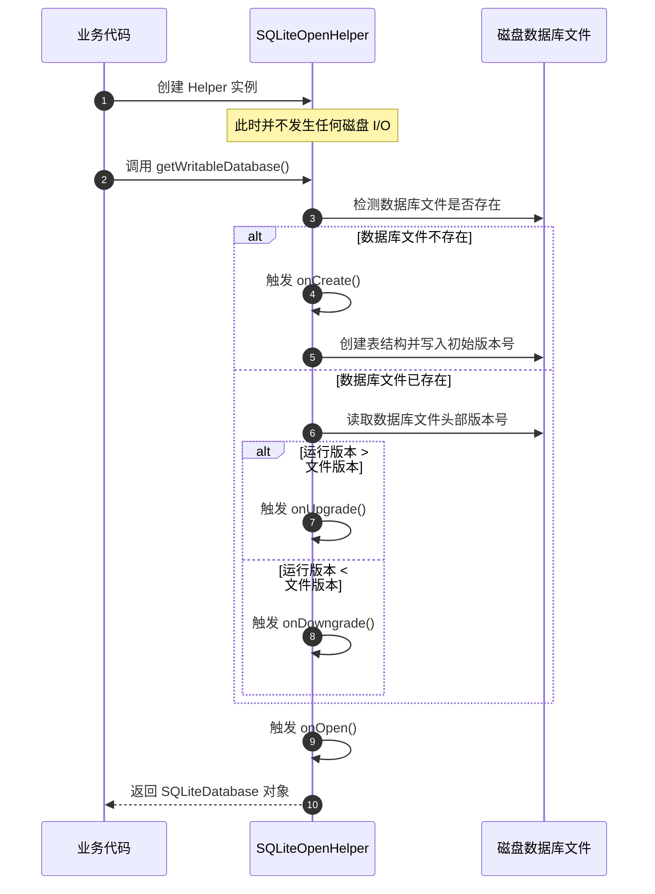
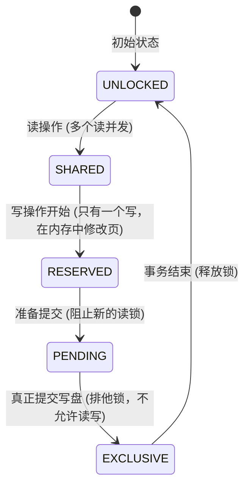
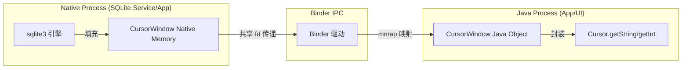
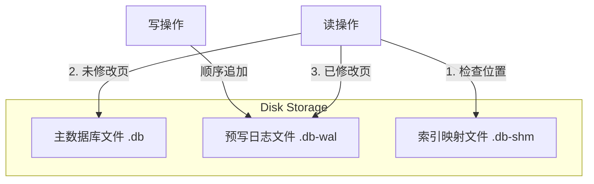
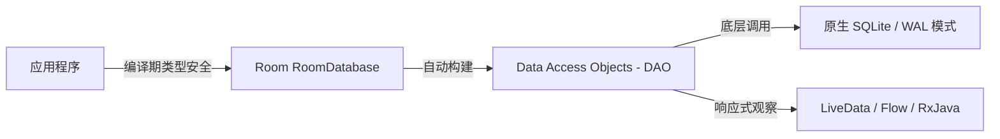

# 5.1.5.3 SQLite 机制与原理解析

SQLite 是 Android 平台核心的嵌入式关系型数据库。在移动开发中，对于结构化、大容量以及有复杂关联查询需求的数据，SQLite 提供了不可替代的持久化支持。本文将从核心概念、设计取舍、生命周期管理、读写与 `CursorWindow` 缓存机制、并发控制与 `WAL` 模式等维度，深度剖析 Android SQLite 的底层原理与最佳实践。

---

## 1. 核心概念与角色定义

SQLite 是一个轻量级、嵌入式、进程内的关系型数据库引擎。与传统的客户端/服务器（C/S）架构数据库（如 MySQL、PostgreSQL）不同，SQLite 不需要独立的数据库服务器进程运行，而是直接嵌入到应用程序的进程中。



### 1.1 Android SQLite 的核心技术特性
- **嵌入式与零配置**：无需安装、配置或启动独立的服务器后台进程。数据库的所有数据（表结构、索引、数据本身）都存储在一个单一的磁盘文件中。
- **自包含与低依赖**：SQLite 库的体积非常小，且只依赖极少数的标准 C 库函数，适合内存和存储空间都受限的移动设备。
- **ACID 事务支持**：完全支持关系型数据库的 ACID 属性，即使在系统崩溃或突然断电的情况下，也能通过日志机制恢复数据，保障数据的一致性。
- **动态类型系统**：SQLite 采用弱类型（Manifest Typing）系统，数据类型是与值相关联，而不是与列定义绑定（除了 `INTEGER PRIMARY KEY` 必须是整型外，可以在任何列存入任何类型的值，但在 Android 实际开发中通常建议保持严格的数据类型匹配）。

---

## 2. 数据存储设计取舍（为什么需要关系型数据库）

在 Android 存储生态中，除了关系型数据库 SQLite，还有 `SharedPreferences`（SP）和新一代的 `Jetpack DataStore`。针对不同类型的数据 and 业务场景，我们需要进行合理的技术选型和架构设计。

### 2.1 存储方案多维对比

| 维度 | SharedPreferences | Jetpack DataStore (Preferences/Proto) | SQLite / Room |
| :--- | :--- | :--- | :--- |
| **数据模型** | Key-Value 键值对 | Key-Value / Protocol Buffers | 关系型结构化数据（表格） |
| **适用规模** | 轻量级配置、KV 标志（建议数十 KB 内） | 中轻量级配置、小规模结构化数据 | 大容量数据、复杂业务实体（数 MB 到数 GB） |
| **读写机制** | 首次全量加载到内存，XML 解析 | 基于 Kotlin 协程与 Flow 的异步 I/O | 基于 SQLite 引擎的 B-Tree 磁盘检索 |
| **事务支持** | 仅支持简单的内存 Commit/Apply | 支持基本原子性更新，无复杂多表事务 | 强 ACID 事务，支持多表关联与回滚 |
| **查询性能** | 内存 Map 查找，I/O 是全量写磁盘 | 异步读写，按需更新，内存开销较小 | 通过 B-Tree 索引快速过滤，支持分页加载 |
| **关联查询** | 不支持 | 不支持 | 支持多表连接（JOIN）、外键、聚合查询 |
| **线程安全** | 线程安全（内部有锁），但存在 ANR 风险 | 原生协程支持，完全非阻塞，避免 ANR | 通过单例连接池或 Room 进行多线程管理 |

### 2.2 为什么在 SP/DataStore 之外需要 SQLite？
1. **结构化大容量数据的高效管理**：当应用需要存储成千上万条记录（例如微信的聊天记录、网易云音乐的歌曲库）时，SP 或 DataStore 必须在首次加载或修改时读取整个文件，导致严重的内存占用与 CPU 抖动。SQLite 基于页（Page）的读取和 B-Tree 索引机制，可以仅从磁盘读取所需的数据页，极大减少了内存占用。
2. **复杂的实体关系与关联查询**：在复杂的业务场景中，实体之间存在“一对多”或“多对多”的关系。如果使用 KV 存储，开发者必须自己在内存中维护这些关系的映射，代码极其繁琐且容易出错。SQLite 提供标准的 SQL 查询语句，允许通过一条带有 `JOIN` 的 SQL 语句，高效地在数据库层完成多表关联计算和数据过滤。
3. **强大的 ACID 事务安全防线**：在涉及金钱、本地同步状态等核心数据时，数据的一致性至关重要。例如，本地插入一条消息的同时需要更新会话列表的未读数，这两个操作必须同时成功或同时失败。SQLite 提供了强事务保障，一旦在执行中途进程被杀或设备断电，数据库在下次启动时会自动通过日志（Journal 或 WAL）进行回滚，杜绝“数据写了一半”的脏数据状态。

---

## 3. SQLiteOpenHelper 生命周期与多线程安全架构

在 Android SDK 中，`SQLiteOpenHelper` 是管理数据库创建和版本控制的辅助类。理解其生命周期的触发机理和多线程环境下的架构，是编写健壮数据库代码的基础。

### 3.1 核心回调的触发机理与执行时机
`SQLiteOpenHelper` 是惰性初始化的。当我们在 Java/Kotlin 代码中创建 `SQLiteOpenHelper` 实例时，系统**不会**去触碰磁盘上的数据库文件。只有当显式调用 `getWritableDatabase()` 或 `getReadableDatabase()` 时，才开始初始化流程。



- **`onCreate(SQLiteDatabase db)`**：
  - **触发时机**：当指定的数据库文件在磁盘上**不存在**时触发。
  - **执行机理**：系统会先在磁盘上创建相应的空白数据库文件，并传入一个刚开启的 `SQLiteDatabase` 实例。在这个回调中，通常应该执行 `CREATE TABLE`、`CREATE INDEX` 以及插入初始数据的操作。整个 `onCreate` 执行完毕后，系统会将当前的代码版本号（`version`）写入数据库文件的 Header 中。
- **`onUpgrade(SQLiteDatabase db, int oldVersion, int newVersion)`**：
  - **触发时机**：磁盘上的数据库文件已存在，但在初始化时传入 `SQLiteOpenHelper` 构造函数的 `newVersion` 大于数据库文件 Header 中记录 of `oldVersion`。
  - **优雅的设计**：
    为了保证用户的数据不丢失，不能简单粗暴地在 `onUpgrade` 中执行 `DROP TABLE`。推荐使用**渐进式升级策略**，避免跨版本升级时漏掉中间步骤：
    ```java
    @Override
    public void onUpgrade(SQLiteDatabase db, int oldVersion, int newVersion) {
        for (int i = oldVersion; i < newVersion; i++) {
            switch (i) {
                case 1:
                    // 版本 1 升级到 2：新增一条列
                    db.execSQL("ALTER TABLE user ADD COLUMN age INTEGER DEFAULT 0");
                    break;
                case 2:
                    // 版本 2 升级到 3：创建新的关联表
                    db.execSQL("CREATE TABLE book (id INTEGER PRIMARY KEY, title TEXT)");
                    break;
            }
        }
    }
    ```
- **`onDowngrade(SQLiteDatabase db, int oldVersion, int newVersion)`**：
  - **触发时机**：设备上已存在的数据库版本大于代码中传入的版本（常见于用户卸载新版本应用，重新安装了旧版本应用）。
  - **处理逻辑**：默认实现是直接抛出 `SQLiteException`。如果需要兼容，应当在这个回调中清除多余的表，或者执行数据降级转换。

### 3.2 多线程环境下的 Helper 复用与安全机制
在单进程多线程的场景下，如何安全地访问数据库是一个经典问题。

#### 3.2.1 错误实践：多 Helper 实例引发的“连接锁”
如果每个线程各自通过 `new MyHelper(context)` 创建自己的 `SQLiteOpenHelper` 实例并进行读写：
- 每个 Helper 实例都会在 Native 层打开一个独立的物理数据库连接。
- 当线程 A 通过 Helper A 开启写事务时，SQLite 会将数据库文件锁住（如 EXCLUSIVE 锁）。
- 此时，线程 B 通过 Helper B 尝试写入，会因为无法获取文件的锁，引发著名的 `android.database.sqlite.SQLiteDatabaseLockedException: database is locked` 异常。

#### 3.2.2 解决方案：全局单例 Helper 与底层协调机制
Android 官方推荐的做法是：**在应用全局使用唯一的 `SQLiteOpenHelper` 单例**。

```java
public class DatabaseManager {
    private static DatabaseManager instance;
    private SQLiteOpenHelper helper;

    private DatabaseManager(Context context) {
        helper = new MyHelper(context.getApplicationContext());
    }

    public static synchronized DatabaseManager getInstance(Context context) {
        if (instance == null) {
            instance = new DatabaseManager(context);
        }
        return instance;
    }

    public synchronized SQLiteDatabase getDatabase() {
        return helper.getWritableDatabase();
    }
}
```

当全局仅存在一个 `SQLiteOpenHelper` 实例时，其底层的安全管理机制如下：
1. **多线程并发控制**：在 Java 层，`SQLiteDatabase` 内部维护了锁机制（在旧版本中使用 Java 的 ReentrantLock，在 Android 11 等现代版本中依靠底层的连接池控制）。当多个线程共享同一个 `SQLiteDatabase` 实例时，它们实际上是在操作同一个物理数据库连接或受管理的连接池。
2. **连接池协调（`SQLiteConnectionPool`）**：
   - 从 [Android 3.0 (API 11)](../../../../../AndroidVersionChangeLog.md) 起，Android 引入了数据库连接池机制。
   - 当不开启 WAL 模式时，连接池中只有**一个**主连接（Primary Connection），所有的读写操作都通过这个主连接序列化执行。因此，即使多线程并发访问，它们也会排队，避免了文件层面的锁冲突。
   - 当开启 WAL 模式时，连接池会配置**一个写连接**和**多个读连接**。写操作使用独占的写连接，读操作使用读连接，实现高并发的读写分离。

### 3.3 多进程环境下的安全屏障
由于进程间内存是完全隔离的，多进程无法通过 JVM 的单例模式共享同一个 `SQLiteOpenHelper` 实例。如果两个独立的进程（如应用的主进程和一个后台推送 Service 进程）各自创建 Helper 实例去读写同一个 `.db` 文件，就会出现物理锁竞争，导致 `database is locked`。

#### 3.3.1 多进程访问的推荐方案
- **ContentProvider（首选方案）**：将所有的数据库操作封装在 `ContentProvider` 中，并将 `ContentProvider` 运行在主进程中。其他进程通过 `ContentResolver` 与 `ContentProvider` 进行通信。由于 Binder 通信会将跨进程的请求自动分发到主进程的 Binder 线程池中，而主进程可以通过单例 Helper 进行线程安全控制，从而消除了物理文件的多进程锁冲突。
- **IPC 通信（如 AIDL / Messenger）**：自定义一个服务运行在主进程，专门负责处理数据库读写，其他进程通过 AIDL 向其发送操作指令。

---

## 4. SQLiteDatabase 读写机制与 CursorWindow 内存缓冲

深入理解数据的读写事务和 `CursorWindow` 缓存，是优化数据库性能、排查内存泄露与崩溃的核心。

### 4.1 事务控制与批量操作的底层威力
在处理大量数据的插入、更新或删除时，显式使用事务是性能的分水岭。

#### 4.1.1 显式事务的优化原理
如果不显式调用 `beginTransaction()`，SQLite 会对每一条独立的 SQL 执行语句开启一个隐式的**自动提交（Autocommit）事务**。
- **隐式事务的代价**：每次执行 `insert()` 都会：
  1. 开启一个磁盘日志记录。
  2. 将数据写入 `.db` 文件。
  3. 执行 `fsync()`，强制将操作系统缓冲区的数据物理刷入磁盘。
- 物理磁盘的 I/O（尤其是 `fsync`）是非常缓慢的。如果连续插入 1000 条数据，会执行 1000 次磁盘写入和 1000 次 `fsync`，这可能需要花费数秒甚至数十秒，引发 ANR。
- **显式事务的拯救**：通过显式开启事务，所有的 1000 条插入操作都在**同一个**事务上下文中执行。SQLite 仅在内存和临时缓存中记录这些变化，只有在最后调用 `endTransaction()` 提交事务时，才进行**一次**物理磁盘写入和 `fsync`。性能能够从 100 毫秒/条提升至 50 毫秒/千条，提升数百倍。

#### 4.1.2 锁状态转换
在事务执行期间，数据库连接的锁状态经历以下演变：



- **UNLOCKED**：未加锁状态，数据库未开启任何事务。
- **SHARED（共享锁）**：当有读操作时，数据库被加共享锁。可以有无限多个线程同时持有共享锁进行并发读，但此时不允许任何写操作。
- **RESERVED（保留锁）**：当某个连接准备执行写操作时申请。此时依然允许其他连接持有 SHARED 锁进行读操作，但在整个数据库中，同一时间只能有一个 RESERVED 锁。
- **PENDING（未决锁）**：写操作准备提交事务，需要将修改写入物理文件。连接会申请从 RESERVED 升级为 EXCLUSIVE。此时，它会先拿到 PENDING 锁。在此状态下，已持有的 SHARED 锁可以继续读，但不允许新来的读操作获取 SHARED 锁（防止写操作被无限期饥饿）。
- **EXCLUSIVE（排他锁）**：所有的 SHARED 锁释放后，PENDING 锁升级为 EXCLUSIVE。此时，写操作独占文件写入权限，不允许任何读操作和写操作，数据完成落盘。

### 4.2 CursorWindow 机制深度剖析
当我们在 Android 中执行 `db.rawQuery(...)` 时，返回的 `Cursor` 并不是直接包含了查询到的所有数据，其底层设计是基于 `CursorWindow` 进行局部缓冲的。

#### 4.2.1 匿名共享内存（Ashmem）与零拷贝优化
Android 中的 `CursorWindow` 是一块底层的共享内存，它基于 OS 层的 `ashmem`（Anonymous Shared Memory）或者在高版本 Android 中使用 `memfd` 机制创建。



1. **共享内存创建**：当执行查询时，底层 C++ 层通过 `ashmem_create_region` 分配一块大小默认为 **2MB** 的匿名共享内存区域。
2. **底层数据填充**：Native 层的 `sqlite3_step` 不断执行，并将查询结果按行写入该共享内存（`CursorWindow`）。
3. **fd 传递与零拷贝映射**：在跨进程读取（例如通过 ContentProvider 传递 Cursor）时，系统不会将 2MB 的数据全量拷贝一遍，而是通过 Binder 驱动传递这块共享内存的文件描述符（File Descriptor, FD）。接收进程在收到 FD 后，通过系统的 `mmap` 系统调用将这块内存映射到自己的虚拟内存空间。这实现了极高效率的“零拷贝”级数据传递。

#### 4.2.2 2MB 限制与局部窗口分页机制
`CursorWindow` 的默认大小在 Android 源码中被硬编码为 2MB。
- **如果查询结果总数据量小于 2MB**：整个结果集会一次性全部被装入共享内存，后续的 `moveToNext()` 和 `getString()` 全程在内存中操作，速度极快。
- **如果查询结果总数据量大于 2MB**：
  - 底层填充共享内存，当写入到第 N 行时，发现空间已满（不足以塞入下一行）。
  - Native 填充过程停止，保留前 N 行，并记录当前的偏移量。
  - 当 Java 层通过 `cursor.moveToPosition(N)` 试图读取第 N 行之后的数据时，由于当前的 `CursorWindow` 找不到这行数据，底层会抛弃当前 `CursorWindow` 中的旧数据，向 SQLite 重新发起查询，从第 N 行开始重新填充 `CursorWindow`。
  - **严重后果**：如果查询一个拥有 10 万行数据的表，每次 `CursorWindow` 只能装 5000 行。当你从头到尾遍历这个 Cursor 时，底层会触发 **20 次物理磁盘 I/O 重新加载和重构共享内存**，严重拖慢遍历性能。

#### 4.2.3 RowTooBigException 崩溃根源
如果在表中存储了很大的 `BLOB`（如原图、大音频文件）或极长的文本，单行数据的总大小超过了 2MB：
- 底层在尝试填充第一行数据时，发现这单行数据的大小已经超过了 `CursorWindow` 的 2MB 上限，连一行都装不下。
- 此时，SQLite 框架会直接抛出 `android.database.CursorWindowAllocationException` 或者 `android.database.sqlite.SQLiteBlobTooBigException`（俗称 `RowTooBigException`），导致应用直接崩溃。

#### 4.2.4 为什么必须显式 close() Cursor？
每个未关闭的 `Cursor` 都至少持有一个 `CursorWindow` 的实例。
1. **共享内存与 FD 泄露**：`CursorWindow` 底层关联着 native C++ 层的内存空间和一个文件描述符 FD（匿名共享内存也是文件描述符）。如果忘记调用 `cursor.close()`，这个 FD 将一直被进程占用。
2. **FD 数量用尽崩溃**：Linux 系统对单个进程能够同时打开的最大文件描述符数量有严格限制（通常是 1024 或 2048）。当累计泄露的 Cursor 数量达到上限时，应用就会抛出 `Too many open files` 异常，此时甚至无法再创建 Socket 或打开任何文件，导致应用彻底瘫痪。
3. **Native 内存泄露**：虽然 Java 层的垃圾回收器（GC）最终会回收 Java Cursor 对象，但 JVM GC 并不感知 Native 层的共享内存压力，且 Native 资源的释放存在滞后性。高并发下，未关闭的 Cursor 会迅速榨干 Native 虚拟内存，导致 OOM 崩溃。
4. **正确释放姿势**：
   在 Java/Kotlin 中，应当始终使用 `try-with-resources` 或 Kotlin 的 `use` 扩展函数来确保安全释放：
   ```kotlin
   db.rawQuery("SELECT * FROM user", null).use { cursor ->
       while (cursor.moveToNext()) {
           val name = cursor.getString(cursor.getColumnIndexOrThrow("name"))
           // 处理数据
       }
   } // 超出作用域后，use 保证自动调用 cursor.close()
   ```

---

## 5. 并发访问与锁机制（WAL 模式）

在高并发场景下，传统的 Journal 回滚日志模式极易成为性能瓶颈，而 WAL 模式是解决读写冲突的终极武器。

### 5.1 Journal 模式下的读写锁冲突
在默认的 `Rollback Journal`（回滚日志）模式下，SQLite 保证事务安全的做法如下：
- 当开启一个写入事务时，SQLite 会将旧数据备份到 `.db-journal` 文件中，然后独占主数据库文件的修改权。
- 此时，写操作必须持有 `EXCLUSIVE` 排他锁。
- 排他锁是不允许任何共享锁（SHARED 锁，即读操作）存在的。如果此时有其他线程执行 `query`，会因为无法获取 SHARED 锁而被阻塞。
- 如果读操作时间较长，写操作同样无法升级为排他锁，导致双向阻塞。超时后，阻塞线程就会抛出 `SQLiteDatabaseLockedException: database is locked`。

### 5.2 WAL (Write-Ahead Logging) 模式工作原理
为了解决读写冲突，SQLite 在 3.7.0 版本（Android 3.0 API 11 引入）中引入了 WAL 模式。



- **工作原理**：
  - **写操作**：不再直接修改主数据库文件 `.db`。写事务的所有修改都会被顺序追加写入到一个独立的预写日志文件（即 `.db-wal` 后缀文件）中。
  - **读操作**：当一个读线程发起查询时，它会首先确定当前主数据库的版本，然后通过内存映射文件（`.db-shm`，Shared Memory，用于建立 WAL 页的快速索引）来决定数据页的来源。如果数据页已经被写入 WAL，就从 `.db-wal` 中读取最新数据；如果没有，就从主 `.db` 文件中读取。
- **Checkpoint 机制**：
  随着写入的增加，`.db-wal` 文件会变得越来越大。因此需要 Checkpoint（检查点）操作，定期将 `.db-wal` 文件中的内容合并回主 `.db` 文件中。Android 系统会在后台自动触发 Checkpoint（通常是在 WAL 文件达到 1000 页，或者数据库连接闲置时）。

### 5.3 WAL 模式的核心优势与代价

#### 优势：
1. **高并发（读写分离）**：读操作与写操作可以完全并发。一个写线程在追加 WAL 日志的同时，多个读线程可以并行读取数据库，互不干扰，彻底解决因读写冲突引起的 `database is locked`。
2. **极佳的写入吞吐量**：向 WAL 文件中顺序追加写入，比在主数据库文件各个不同位置进行随机写入要快得多。同时，它减少了磁盘物理刷盘（`fsync`）的频率。

#### 代价：
1. **多出额外文件**：会在同级目录下生成 `.db-wal` 和 `.db-shm` 文件，占用额外空间。
2. **读操作可能稍微变慢**：如果 WAL 日志累积得非常大，读操作需要在 `.db-shm` 索引中查询多页的映射关系，会导致额外的 CPU 开销和少量的读延迟。因此，保持及时的 Checkpoint 非常关键。
3. **不支持只读文件系统**：因为必须能够写入 WAL 文件，且需要映射 `-shm` 共享内存。

### 5.4 在 Android 中开启 WAL 模式
在原生 SQLite 框架中，可以通过以下两种方式开启 WAL：

1. **在 `SQLiteOpenHelper` 的 `onConfigure` 回调中开启（推荐）**：
   ```java
   public class MyHelper extends SQLiteOpenHelper {
       public MyHelper(Context context) {
           super(context, "app.db", null, 1);
       }

       @Override
       public void onConfigure(SQLiteDatabase db) {
           super.onConfigure(db);
           // 显式开启 WAL 模式
           db.enableWriteAheadLogging();
       }

       @Override
       public void onCreate(SQLiteDatabase db) {
           // 创建表
       }

       @Override
       public void onUpgrade(SQLiteDatabase db, int oldVersion, int newVersion) {
           // 升级
       }
   }
   ```

2. **在获取数据库实例后手动调用**：
   ```java
   SQLiteDatabase db = helper.getWritableDatabase();
   db.enableWriteAheadLogging();
   ```

> [!NOTE]
> 从 [Android 9 (API 28)](../../../../../AndroidVersionChangeLog.md) 开始，系统默认启用 Compatibility WAL 功能，即使应用本身没有调用 `enableWriteAheadLogging()`，系统也会在满足特定条件时隐式为应用配置 WAL。但为了防范平台适配差异，最佳实践依然是由开发者显式在 `onConfigure` 中配置。

---

## 6. 常见误区与最佳实践

在实际开发中，由于对 SQLite 的底层原理不够熟悉，容易写出导致性能低下、内存泄漏甚至崩溃的代码。以下梳理了四个最常见的误区以及行业标配的 Room 解决方案。

### 6.1 典型设计与运行误区

#### 误区一：在多线程中各自创建 Helper 实例导致死锁或锁表
- **现象**：后台同步任务、日志上报任务和 UI 查询线程同时执行数据库写操作，抛出 `SQLiteDatabaseLockedException: database is locked`。
- **根源**：实例化了多个 `SQLiteOpenHelper` 物理连接，在没有 WAL 模式下，多物理连接同时写入触发文件级排他锁冲突。
- **解决**：在 Application 级封装单例 Helper，确保全应用共享同一个连接。同时，开启 WAL 模式以支持读写并发。

#### 误区二：在主线程进行大数据量查询或大事务写入
- **现象**：点击按钮后页面卡死，系统弹出 ANR 弹窗。
- **根源**：SQLite 属于磁盘 I/O。当查询数据过多（触发多次 CursorWindow 分页加载）或执行大事务（包含循环插入）时，主线程被挂起，等待磁盘 I/O 响应。
- **解决**：使用协程 `withContext(Dispatchers.IO)` 或 RxJava 的 `Schedulers.io()` 将所有数据库读写操作调度到后台线程。

#### 误区三：在大事务中夹杂非数据库的耗时操作
- **现象**：数据库执行大事务时，其他所有的简单读取操作全部被卡死。
- **根源**：在 `beginTransaction()` 和 `endTransaction()` 之间夹杂了网络请求、文件解压或复杂的 JSON 解析。这导致数据库在整个耗时期间一直处于 `EXCLUSIVE` 或 `RESERVED` 锁定状态，阻塞了所有其他连接。
- **解决**：事务块必须纯粹、简短。先在内存中完成所有的网络下载、JSON 解析和数据结构组装，最后只将需要落盘的数据段放入事务中快速执行并提交。

#### 误区四：在 SQLite 中直接存储大图或音频 BLOB
- **现象**：应用莫名其妙报 `RowTooBigException` 崩溃，或者加载列表时极度卡顿。
- **根源**：直接把图片二进制数组（BLOB）存入表中。当查询结果行很大时，2MB 的 `CursorWindow` 无法容纳多行，导致频繁触发磁盘加载，甚至直接因单行超过 2MB 而崩溃。
- **解决**：禁止直接将大文件存入 DB。应该将文件保存在沙盒路径下（如 `context.getExternalFilesDir()`），数据库中只存储文件的**绝对路径字符串**。如果必须存储二进制数据，大小不应超过 100KB。

---

### 6.2 最佳实践：使用 Room 框架
手动维护原生 SQLite 极易写出存在隐患的样板代码。Jetpack Room 作为官方推荐的 SQLite 抽象层，提供了极其强大的工程化保护：



1. **编译期 SQL 校验**：在编译期间，Room 会调用注解处理器（APT/KSP）对 `@Query` 中的 SQL 语法进行完整性校验。如果写错列名或表名，在编译时就会报错，杜绝了把 SQL 拼写错误带到线上版本的风险。
2. **免去样板代码**：Room 自动处理了 `Cursor` 的读取、对象映射（ORM）以及极其关键的 `close()` 释放逻辑，从根本上消除了 Cursor 泄露引起的内存和 FD 泄露。
3. **原生支持异步与响应式编程**：Room 完美集成了 Kotlin Coroutines（协程）与 Flow（或者 LiveData/RxJava）。只需在 Dao 中将方法声明为 `suspend` 或返回 `Flow<List<User>>`，Room 就会自动将底层执行调度到专门的 I/O 线程池中，并在数据库数据发生变化时，实时向 UI 发送最新数据流，实现**数据驱动 UI** 的现代化架构。
4. **内置的最佳配置**：Room 默认采用线程池来管理数据库连接，并推荐以安全的方式启用 WAL 模式，帮助开发者天然避开了死锁和锁表的巨坑。
