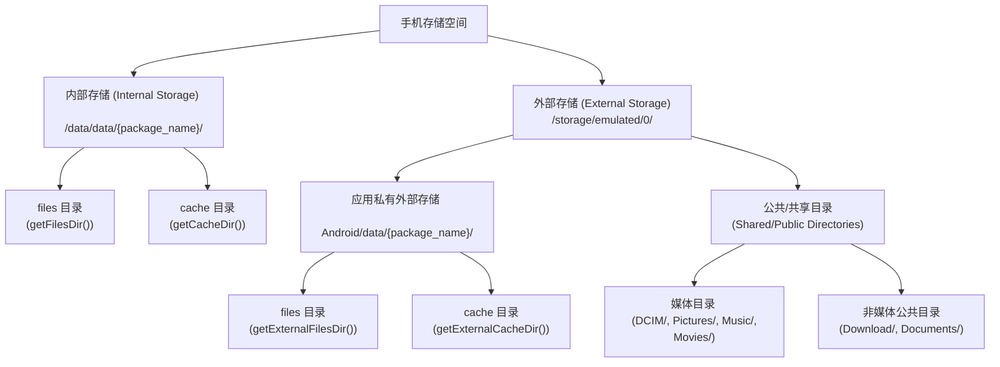
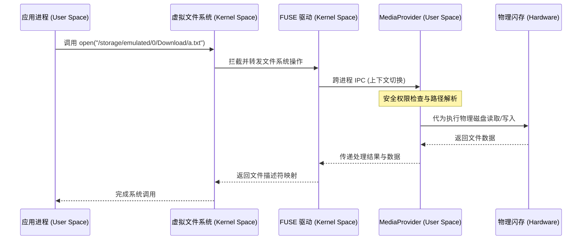
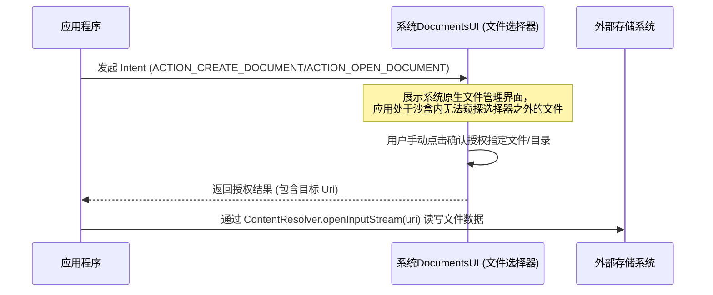

# Android 文件存储机制详解

在 Android 应用程序的开发中，数据存储与管理是核心支柱之一。由于移动设备上保存着大量的用户隐私数据，Android 系统的安全架构在很大程度上是通过“限制文件系统访问权限”来构建的。从早期的全局物理路径随意读写，到 Android 10/11 引入并强制推行的“分区存储（Scoped Storage）”，Android 的文件存储体系经历了一场颠覆性的重构。

本文将从 Android 存储的双轨设计体系出发，深入剖析内部存储与外部存储的底层机制、分区存储的演进动力、核心 API（MediaStore 与 SAF）的实战适配，以及多版本适配中的常见误区与最佳实践。

---

## 一、 Android 双轨存储体系概述

Android 文件存储体系在逻辑上由**内部存储（Internal Storage）**与**外部存储（External Storage）**共同构成，这被称为“双轨存储体系”。

### 1. 核心概念与界定
在深入细节前，必须澄清两个极易混淆的概念误区：
* **“内存（RAM）”与“内部存储（Internal Storage）”的混淆**：内存是临时运行内存，断电即失；内部存储是持久化闪存（ROM）的一部分，用于存放系统和应用数据。
* **“内置闪存”与“外部存储”的混淆**：在早期 Android 设备中，外部存储通常指物理可插拔的 SD 卡。然而，在现代 Android 设备中，外部存储的绝大部分空间是由手机内置闪存芯片（如 UFS/eMMC）中划分出的一个逻辑分区（通常挂载在 `/storage/emulated/0`）来模拟的，只有极少数设备还支持外接 SD 卡。无论物理介质如何变化，**双轨存储的逻辑隔离机制依然被严格保留**。

### 2. 内部存储与外部存储多维度对比
以下是内部存储与外部存储（包含私有目录与公共目录）的系统性对比：

| 对比维度 | 内部存储 (Internal Storage) | 外部存储-应用私有目录 (External Private) | 外部存储-共享/公共目录 (External Public) |
| :--- | :--- | :--- | :--- |
| **物理路径示例** | `/data/user/0/<packagename>/` | `/storage/emulated/0/Android/data/<packagename>/` | `/storage/emulated/0/Pictures/`, `/storage/emulated/0/Download/` 等 |
| **API 获取方法** | `context.getFilesDir()`, `context.getCacheDir()` | `context.getExternalFilesDir()`, `context.getExternalCacheDir()` | `Environment.getExternalStoragePublicDirectory()` (注：高版本已废弃) |
| **读写权限要求** | **无需任何权限** | **无需任何权限** (自 Android 4.4 / API 19 起) | Android 10 之前需声明全局读写权限；Android 10+ 需使用 `MediaStore` / `SAF` |
| **应用卸载行为** | **数据被彻底清除** | **数据被彻底清除** | **数据保留**，不会随应用卸载而丢失 |
| **数据安全性** | **极高**。基于 Linux UID 隔离，其他应用无法直接访问。 | **中等**。其他应用可以通过申请全局读取权限进行扫描（Android 10 之前），或由用户通过文件管理器读取。 | **低**。所有具有权限的应用或用户都可以直接读写。 |
| **最佳适用场景** | 存放敏感的用户隐私数据、App 运行的私有配置文件、数据库等。 | 存放体积较大但不需要跨应用共享的文件（如大图缓存、下载的临时非敏感资源）。 | 存放需要与其他应用共享或暴露给用户的多媒体文件（如拍照保存的相片、导出的 PDF 报表）。 |

### 3. 多用户（Multi-User）机制下的存储隔离与绑定挂载
Android 自 4.2 版本起引入了多用户（Multi-User）支持（如主用户、访客用户、应用分身等）。为了防止不同用户间的数据越界，系统在底层对外部存储路径进行了动态绑定挂载（Bind Mount）。
在物理上，所有外部存储的数据都统一放置在 `/data/media/` 目录下。该目录下通过用户 ID 进行划分子目录：
* 主用户（Owner）的数据存放在 `/data/media/0/`。
* 备用用户（例如 ID 为 10）的数据存放在 `/data/media/10/`。

在系统启动或用户切换时，Android 的 `vold`（Volume Daemon）守护进程会通过 Linux 的 `mount` 命名空间隔离技术，将当前活跃用户的物理数据目录（如 `/data/media/0/`）挂载到公共的 `/storage/emulated/0/`。因此，对于应用来说，虽然访问的都是 `/storage/emulated/0/`，但底层的实际物理指向完全由当前登录的用户决定，从而在系统层面实现了多用户数据的强隔离。

### 4. 存储空间拓扑图
下面的 Mermaid 拓扑图清晰地展示了 Android 设备存储的物理与逻辑划分结构：



---

## 二、 内部存储机制深入解析

内部存储是 Android 沙盒机制的基石。在没有 Root 的设备上，内部存储被系统视为应用专属的绝对私有领地。

### 1. 核心沙盒目录详述
除了常见的 `files` 和 `cache`，内部存储还包含其他关键子目录：
* **`Context.getFilesDir()`**：
  * 返回应用的持久化文件目录，对应物理路径为 `/data/data/<package_name>/files/`。该目录下的文件会被持久保留，除非应用被手动卸载，或用户执行了“清除数据”操作。适合存放配置信息、小规模的序列化对象。
* **`Context.getCacheDir()`**：
  * 返回应用的临时缓存目录，对应物理路径为 `/data/data/<package_name>/cache/`。
  * **底层系统清理机制**：当系统可用存储空间极其匮乏（低于预设的 Low Storage 阈值）时，系统会触发自动清理机制。系统会根据“最近最少使用（LRU）”原则，主动删除部分应用的 `cache/` 目录下的文件。因此，开发者绝不能将核心业务数据存放在此处，且应当在应用内部做好缓存大小控制（如通过 `StorageManager.getCacheQuotaBytes()` 获取系统分配的缓存配额，合理管理缓存生命周期）。
* **`Context.getDatabasePath(String name)`**：
  * 返回应用内部数据库的存放路径，对应物理路径为 `/data/data/<package_name>/databases/`。SQLite 数据库和 Room 框架生成的文件默认全部存放在这里。
* **SharedPreferences 存储路径**：
  * 虽然没有直接的 API 暴露其物理路径，但其默认存储在 `/data/data/<package_name>/shared_prefs/` 目录下，文件格式为普通的 XML。

### 2. SharedPreferences 的 I/O 缺陷与 ANR 隐患
SharedPreferences（简称 SP）在底层读写上存在严重的架构缺陷：
* **全量加载**：当首次调用 `getSharedPreferences` 时，系统会启动一个后台线程将该 XML 文件中的全部键值对一次性反序列化加载到内存的 Map 中。在文件较大且 CPU 繁忙时，主线程调用 `getString()` 等获取操作可能会发生阻塞（由于需要等待 XML 加载锁释放）。
* **全量写入与同步回盘**：无论是调用 `commit()` 还是 `apply()`，SP 在后台持久化时都是将内存中完整的 Map 对象全量重新格式化为 XML 并覆盖写入文件。频繁的写入会导致大量的磁盘 I/O 阻塞。
* **ANR 隐患机制**：虽然 `apply()` 会异步写入磁盘，但它会将写入任务加入到系统全局的 `QueuedWork` 队列中。当 Activity 执行 `onStop`、`onDestroy` 或 Service 执行 `onUnbind` 时，系统为了确保数据不丢失，会在主线程调用 `QueuedWork.waitToFinish()` 强制同步等待该队列中所有的异步写入任务排空。如果此时磁盘写入发生卡顿，主线程将会被直接卡死，抛出致命的 ANR。

> [!TIP]
> **最佳替代方案**：在新项目中，强烈建议使用 Jetpack DataStore 代替 SharedPreferences。DataStore 基于 Kotlin 协程和 Flow 构建，底层采用 Protobuf 二进制协议或 Preferences 序列化存储，保证所有读写操作均在非主线程（Dispatchers.IO）异步执行，并且消除了 `waitToFinish` 阻塞主线程的 ANR 陷阱。

### 3. 底层安全与隔离机制：Linux UID/GID
内部存储的安全特性源自其底层的 **Linux UID/GID 隔离机制**。
Android 系统在安装每个应用时，都会为其分配一个唯一的 Linux 用户标识符（UID，如 `u0_a135`）。文件系统中 `/data/data/<package_name>/` 目录及其所有子文件的所有者均被设为该 UID。
在 Linux 内核层面，由于 POSIX 权限体系的限制，除非拥有 `root` 权限，否则任何 UID 均无法跨越边界去读取或写入另一个 UID 拥有的文件目录。这也是为什么应用在访问自身的内部存储时，**完全不需要向用户申请任何 Android 动态权限**。

### 4. 敏感数据安全存储设计
虽然内部存储在非 Root 设备上安全等级极高，但在已被获取 `root` 权限的设备上，攻击者可以通过切换至超级用户（`su`）直接窥探、提取或篡改 `/data/data/` 下的所有沙盒内容。为了防范此类数据泄露风险，必须在应用层引入加密存储机制。

#### 方案一：使用 Jetpack Security (Crypto) 库
Google 官方提供了 Jetpack Security 库，对底层的 Keystore 密钥管理与加解密流程进行了高度封装，推荐使用 `EncryptedSharedPreferences` 与 `EncryptedFile`。

```kotlin
import androidx.security.crypto.EncryptedSharedPreferences
import androidx.security.crypto.MasterKeys

// 1. 生成或获取主密钥（Master Key），密钥由 Android Keystore 进行硬件级别保护
val masterKeyAlias = MasterKeys.getOrCreate(MasterKeys.AES256_GCM_SPEC)

// 2. 创建加密的 SharedPreferences 实例
val encryptedSharedPreferences = EncryptedSharedPreferences.create(
    "secure_prefs",
    masterKeyAlias,
    context,
    EncryptedSharedPreferences.PrefKeyEncryptionScheme.AES256_SIV,
    EncryptedSharedPreferences.PrefValueEncryptionScheme.AES256_GCM
)

// 3. 像普通 SharedPreferences 一样读写，底层自动完成透明加解密
encryptedSharedPreferences.edit()
    .putString("token", "sensitive_user_token_data")
    .apply()
```

#### 方案二：基于 AES-GCM + Android Keystore 的自定义文件加解密
如果需要存储大体积的敏感文件（如离线病历、离线课件、离线支付凭证），可以通过 Android Keystore 生成硬件隔离保存的对称密钥，使用 AES-GCM 模式对文件流进行加密写入与解密读取：

```kotlin
import java.io.File
import java.io.FileInputStream
import java.io.FileOutputStream
import java.security.KeyStore
import javax.crypto.Cipher
import javax.crypto.KeyGenerator
import javax.crypto.SecretKey
import javax.crypto.spec.GCMParameterSpec

object SecureFileStorage {
    private const val KEY_ALIAS = "MySecureFileKey"
    private const val ANDROID_KEYSTORE = "AndroidKeyStore"
    private const val TRANSFORMATION = "AES/GCM/NoPadding"
    
    // 初始化或获取 SecretKey
    private fun getSecretKey(): SecretKey {
        val keyStore = KeyStore.getInstance(ANDROID_KEYSTORE).apply { load(null) }
        if (!keyStore.containsAlias(KEY_ALIAS)) {
            val keyGenerator = KeyGenerator.getInstance("AES", ANDROID_KEYSTORE)
            val spec = android.security.keystore.KeyGenParameterSpec.Builder(
                KEY_ALIAS,
                android.security.keystore.KeyProperties.PURPOSE_ENCRYPT or 
                        android.security.keystore.KeyProperties.PURPOSE_DECRYPT
            )
                .setBlockModes(android.security.keystore.KeyProperties.BLOCK_MODE_GCM)
                .setEncryptionPaddings(android.security.keystore.KeyProperties.ENCRYPTION_PADDING_NONE)
                .build()
            keyGenerator.init(spec)
            return keyGenerator.generateKey()
        }
        return (keyStore.getEntry(KEY_ALIAS, null) as KeyStore.SecretKeyEntry).secretKey
    }

    // 加密写入文件
    fun encryptWrite(data: ByteArray, targetFile: File) {
        val cipher = Cipher.getInstance(TRANSFORMATION)
        cipher.init(Cipher.ENCRYPT_MODE, getSecretKey())
        
        val encryptedData = cipher.doFinal(data)
        val iv = cipher.iv // 获取 GCM 初始化向量

        FileOutputStream(targetFile).use { fos ->
            fos.write(iv.size) // 先写入 IV 的长度
            fos.write(iv)      // 写入 IV 本身
            fos.write(encryptedData) // 写入加密内容
        }
    }

    // 解密读取文件
    fun decryptRead(sourceFile: File): ByteArray {
        FileInputStream(sourceFile).use { fis ->
            val ivSize = fis.read()
            val iv = ByteArray(ivSize)
            fis.read(iv)
            
            val encryptedData = fis.readBytes()
            
            val cipher = Cipher.getInstance(TRANSFORMATION)
            val spec = GCMParameterSpec(128, iv)
            cipher.init(Cipher.DECRYPT_MODE, getSecretKey(), spec)
            
            return cipher.doFinal(encryptedData)
        }
    }
}
```

---

## 三、 外部存储的演进与分区存储（Scoped Storage）革命

外部存储区域在 Android 系统的演进中，经历了从“公共共享”到“分区管控”的深刻变革。这一演进的核心目标是**重塑用户隐私保护**与**规范混乱的文件存储环境**。

### 1. 传统外部存储（Android 10 之前）的弊端
在 Android 10 (API 29) 之前，外部存储被设计为一个高度开放的物理空间。应用只需要在 `AndroidManifest.xml` 中声明 `READ_EXTERNAL_STORAGE` 和 `WRITE_EXTERNAL_STORAGE` 权限，并在运行时引导用户授权，即可直接使用标准的 Java `File` API 读写 `/sdcard/` 根目录下的任意文件。

这种野蛮生长的数据存储模式暴露出三大不可忽视的硬伤：
1. **垃圾文件堆积，破坏系统整洁度**：大量应用为了确保数据在卸载后留存，或者由于开发不规范，直接在 `/sdcard/` 根目录下疯狂新建自定义文件夹（如 `/sdcard/Alipay/`, `/sdcard/Tencent/`）。当用户卸载这些应用后，残留的垃圾文件夹永远地遗留在外置存储中，导致存储空间迅速被蚕食，系统运行日益迟缓。
2. **严重的隐私泄露隐患**：一旦用户向某款应用（哪怕只是一个简单的手电筒工具）授权了全局读取外部存储权限，该应用就能够随意扫描并上传用户存储在公共相册（`/sdcard/DCIM/`）、文档目录（`/sdcard/Download/`）下的所有敏感文件。这种“全有或全无”的权限模式，催生了严重的隐私安全漏洞。
3. **敏感数据易被恶意修改与替换**：多款应用如果将数据存放在外部公共区域，它们之间可以互相覆盖或静默修改对方的文件，这也给应用带来了被篡改劫持的安全风险。

### 2. 分区存储（Scoped Storage）的设计哲学
针对上述痛点，Google 从 [Android 10 (API 29)](../../../../AndroidVersionChangeLog.md#android-10-api-29) 开始引入分区存储，并从 [Android 11 (API 30)](../../../../AndroidVersionChangeLog.md#android-11-api-30) 开始成为强制规范。

分区存储的核心思想可以总结为：**将外部存储空间“沙盒化”和“规范化”**。它将外部存储重新划分为两个主要控制区：
* **专属私有目录**：即 `context.getExternalFilesDir()` 和 `context.getExternalCacheDir()`。这里的访问**不需要申请任何权限**。当应用卸载时，该目录下的所有文件会被自动同步清除。
* **公共媒体与共享目录**：对于需要在应用外持久保留的多媒体资产（图片、视频、音频）以及普通文档，禁止使用 `File` 路径直接写入，而是必须通过系统专门提供的标准化接口（`MediaStore` API 或 `SAF` 存储访问框架）进行受限操作。

### 3. 底层实现技术的重构与性能剖析：FUSE 拦截机制
在分区存储的底层，Android 放弃了以往缺乏细粒度控制权限的 `sdcardfs` 挂载方案，重新设计并引入了 **FUSE (Filesystem in Userspace) 拦截机制**。

#### FUSE 的拦截工作流：
当应用试图使用传统的 Java `File` API 或 native 层 C/C++ 的 `open`/`fopen` 对外部存储物理路径（如 `/storage/emulated/0/`）进行读写时，执行逻辑如下：
1. 操作系统内核的虚拟文件系统（VFS）拦截到该 I/O 请求，并将其转发给底层的 FUSE 驱动。
2. FUSE 驱动挂起该调用，并通过用户态守护进程（即系统的 `MediaProvider` 进程）的通信管道将请求打包上报。
3. `MediaProvider` 进行强力的安全性和权限检查：
   * 如果检测到应用试图访问自身的专属目录，则直接放行。
   * 如果检测到应用试图直接向公共空间写入，则会抛出 `Permission Denied` 异常。
4. 获得许可后，`MediaProvider` 代为执行磁盘底层读写，并将结果原路传回内核态，最后唤醒应用进程的调用线程。



#### FUSE 的性能开销与 Native 优化
通过上述时序图可以看出，每一次传统的物理路径访问，都会在**内核态与用户态之间进行多次跨进程上下文切换（Context Switch）**。这在进行高频小文件读写（如数据库写入、解压大量碎片文件）或 Native 层音频/视频实时帧渲染渲染时，会导致严重的性能断崖（CPU 消耗骤增，I/O 吞吐率下降 30%-50%）。

**Android 11+ 对直接文件路径访问的优化**：
为了解决这一性能痛点，在 [Android 11 (API 30)](../../../../AndroidVersionChangeLog.md#android-11-api-30) 中，系统底层的 FUSE 驱动引入了基于虚拟文件描述符映射的旁路优化（Bypass）。当应用使用 File 路径打开非私有但已授权的文件时，`MediaProvider` 在第一次权限验证通过后，会将直接物理底层的文件描述符（File Descriptor, FD）直接共享给应用进程，后续的 `read`/`write` 操作将直接由内核的 VFS 与物理介质交互，避免了后续重复跨进程通信的开销，从而恢复了 Native 读写的大部分性能。

---

## 四、 分区存储适配实战与 API 切换

在分区存储规范下，开发者的文件操作方式必须发生彻底转变。以下是多媒体资产读写与非媒体大文件读写的适配方案。

### 1. 多媒体文件读写：使用 MediaStore API
`MediaStore` 是系统维护的多媒体元数据库，用于索引外部存储上的多媒体文件。

#### 场景 A：向系统公共媒体库插入一张图片（写入）
在 Android 10+ 上，将图片存入系统相册（Pictures 文件夹）不能再使用 File 路径，而是应该向 `MediaStore.Images.Media.EXTERNAL_CONTENT_URI` 插入一条记录，并获取其 `Uri` 写入流：

```kotlin
import android.content.ContentValues
import android.content.Context
import android.graphics.Bitmap
import android.net.Uri
import android.os.Build
import android.provider.MediaStore
import java.io.OutputStream

fun saveBitmapToSharedPictures(context: Context, bitmap: Bitmap, fileName: String): Uri? {
    val resolver = context.contentResolver
    val contentValues = ContentValues().apply {
        put(MediaStore.Images.Media.DISPLAY_NAME, "$fileName.jpg")
        put(MediaStore.Images.Media.MIME_TYPE, "image/jpeg")
        
        if (Build.VERSION.SDK_INT >= Build.VERSION_CODES.Q) {
            // Android 10+ 需指定相对公共目录路径
            put(MediaStore.Images.Media.RELATIVE_PATH, "Pictures/MyApp")
            // IS_PENDING 设为 1，代表该文件尚未写入完成。此时其他应用无法查询到此图片。
            put(MediaStore.Images.Media.IS_PENDING, 1)
        }
    }

    val imageUri = resolver.insert(MediaStore.Images.Media.EXTERNAL_CONTENT_URI, contentValues)
    
    imageUri?.let { uri ->
        var outputStream: OutputStream? = null
        try {
            outputStream = resolver.openOutputStream(uri)
            if (outputStream != null) {
                bitmap.compress(Bitmap.CompressFormat.JPEG, 100, outputStream)
            }
            
            if (Build.VERSION.SDK_INT >= Build.VERSION_CODES.Q) {
                // 写入完毕后，将 IS_PENDING 恢复为 0，释放文件可见性
                contentValues.clear()
                contentValues.put(MediaStore.Images.Media.IS_PENDING, 0)
                resolver.update(uri, contentValues, null, null)
            }
        } catch (e: Exception) {
            e.printStackTrace()
            resolver.delete(uri, null, null)
            return null
        } finally {
            outputStream?.close()
        }
    }
    return imageUri
}
```

#### 场景 B：查询公共媒体库中的视频文件（读取）
读取媒体文件必须使用 `ContentResolver` 查询元数据，并根据获取到的 ID 拼接出其 `content://` 格式的 Uri 供播放组件消费，绝对不能直接访问物理路径：

```kotlin
import android.content.ContentUris
import android.content.Context
import android.net.Uri
import android.provider.MediaStore

data class VideoItem(val uri: Uri, val name: String, val duration: Int)

fun querySharedVideos(context: Context): List<VideoItem> {
    val videoList = mutableListOf<VideoItem>()
    val projection = arrayOf(
        MediaStore.Video.Media._ID,
        MediaStore.Video.Media.DISPLAY_NAME,
        MediaStore.Video.Media.DURATION
    )
    
    val query = context.contentResolver.query(
        MediaStore.Video.Media.EXTERNAL_CONTENT_URI,
        projection,
        null,
        null,
        "${MediaStore.Video.Media.DATE_ADDED} DESC"
    )

    query?.use { cursor ->
        val idColumn = cursor.getColumnIndexOrThrow(MediaStore.Video.Media._ID)
        val nameColumn = cursor.getColumnIndexOrThrow(MediaStore.Video.Media.DISPLAY_NAME)
        val durationColumn = cursor.getColumnIndexOrThrow(MediaStore.Video.Media.DURATION)

        while (cursor.moveToNext()) {
            val id = cursor.getLong(idColumn)
            val name = cursor.getString(nameColumn)
            val duration = cursor.getInt(durationColumn)
            
            val contentUri = ContentUris.withAppendedId(
                MediaStore.Video.Media.EXTERNAL_CONTENT_URI,
                id
            )
            videoList.add(VideoItem(contentUri, name, duration))
        }
    }
    return videoList
}
```

#### 场景 C：修改或删除其他应用创建的媒体文件
* **自己创建的文件**：应用修改或删除由自身创建的媒体文件，不需要任何特别权限。
* **他人创建的文件**：若要修改或删除其他应用存入共享库的文件，出于安全保护，系统会直接抛出 `RecoverableSecurityException`。应用必须捕获此异常，并向用户拉起授权对话框：

```kotlin
import android.app.Activity
import android.app.RecoverableSecurityException
import android.content.Context
import android.net.Uri
import android.os.Build

fun deleteMediaFile(context: Context, activity: Activity, uri: Uri) {
    try {
        context.contentResolver.delete(uri, null, null)
    } catch (securityException: SecurityException) {
        if (Build.VERSION.SDK_INT >= Build.VERSION_CODES.Q) {
            val recoverableSecurityException = securityException as? RecoverableSecurityException
                ?: throw securityException
            
            // 提取系统提供的 IntentSender，拉起弹窗向用户请求对此文件的授权
            val intentSender = recoverableSecurityException.userAction.actionIntent.intentSender
            activity.startIntentSenderForResult(
                intentSender,
                1001,
                null,
                0,
                0,
                0
            )
        } else {
            throw securityException
        }
    }
}
```

### 2. 非媒体文件的跨应用读写：存储访问框架 (SAF)
在分区存储模式下，对于非多媒体类型的普通文件（如 `.pdf`、`.zip`、`.epub` 等），如果应用需要将它们存储在外部公共目录且不随卸载清除，或者希望读取用户自己存放的其他非媒体文档，必须强制使用 **存储访问框架 (SAF，Storage Access Framework)**。
SAF 的运行流程完全跳过了物理路径访问，采用基于 Binder 的跨进程机制。由系统组件（DocumentsUI）弹出标准的文件夹管理器供用户做选择，用户选中并确认授权后，应用便获得系统分发的临时或持久化 Uri 权限。

#### 流程与跳转授权：


#### 实战：使用 SAF 创建并写入一个非媒体文件 (例如 PDF)
```kotlin
import android.app.Activity
import android.content.Intent
import android.net.Uri

// 1. 发起创建文件的 Intent
fun createPdfDocument(activity: Activity, fileName: String) {
    val intent = Intent(Intent.ACTION_CREATE_DOCUMENT).apply {
        addCategory(Intent.CATEGORY_OPENABLE)
        type = "application/pdf"
        putExtra(Intent.EXTRA_TITLE, "$fileName.pdf")
    }
    activity.startActivityForResult(intent, 2001)
}

// 2. 在 onActivityResult 中接收授权 of Uri 并写入数据
fun handleCreateResult(activity: Activity, requestCode: Int, resultCode: Int, data: Intent?) {
    if (requestCode == 2001 && resultCode == Activity.RESULT_OK) {
        data?.data?.let { uri ->
            activity.contentResolver.openOutputStream(uri)?.use { outputStream ->
                // 将数据流写入用户选择的位置
                outputStream.write("PDF Content Data".toByteArray())
                outputStream.flush()
            }
        }
    }
}
```

#### SAF 目录树遍历的性能陷阱与优化策略
当应用通过 `ACTION_OPEN_DOCUMENT_TREE` 获取到整个文件夹的授权 Uri 后，开发者通常会使用 Jetpack 提供的工具类 `DocumentFile` 进行文件遍历或搜索：

```kotlin
// 性能低效的代码示例
val rootDir = DocumentFile.fromTreeUri(context, treeUri)
val files = rootDir.listFiles() // 极其缓慢！
```

* **性能问题根源**：`DocumentFile.listFiles()` 底层的工作原理是针对每一个被遍历的文件，都通过 `ContentProviderClient` 进行一次跨进程的数据库查询 IPC。如果授权的文件夹下包含数百甚至上千个文件，会造成极高频的 IPC 跨进程调用，导致主线程瞬间卡死数秒甚至数十秒。
* **高效率优化方案**：不应使用 `DocumentFile` 封装类，而是直接解析系统的 Tree Uri。通过拼接出底层的 Documents Provider 查询 Uri，并使用 `contentResolver.query` 进行单次批量查询，将多次跨进程 IPC 压缩为一次：

```kotlin
import android.content.Context
import android.database.Cursor
import android.net.Uri
import android.provider.DocumentsContract

fun queryDirectoryFilesFast(context: Context, treeUri: Uri): List<Uri> {
    val fileUris = mutableListOf<Uri>()
    val documentId = DocumentsContract.getTreeDocumentId(treeUri)
    val childrenUri = DocumentsContract.buildChildDocumentsUriUsingTree(treeUri, documentId)

    val projection = arrayOf(
        DocumentsContract.Document.COLUMN_DOCUMENT_ID,
        DocumentsContract.Document.COLUMN_DISPLAY_NAME
    )

    // 单次 IPC 直接拉取目录下所有文件的基本信息
    context.contentResolver.query(childrenUri, projection, null, null, null)?.use { cursor ->
        val idColumn = cursor.getColumnIndexOrThrow(DocumentsContract.Document.COLUMN_DOCUMENT_ID)
        while (cursor.moveToNext()) {
            val childId = cursor.getString(idColumn)
            val fileUri = DocumentsContract.buildDocumentUriUsingTree(treeUri, childId)
            fileUris.add(fileUri)
        }
    }
    return fileUris
}
```

---

## 五、 常见误区与最佳实践

### 常见误区一：混淆内部与外部私有目录，冗余申请读写权限
很多开发者对于私有目录的定义不够清晰，常编写以下不合规范的代码：
* 在外部私有目录（`context.getExternalFilesDir()`）读写文件时，依然在 `AndroidManifest` 中声明或在运行时动态申请 `WRITE_EXTERNAL_STORAGE` 权限。
* **纠正**：自 [Android 4.4 (API 19)](../../../../AndroidVersionChangeLog.md#android-4-4-api-19) 起，读写应用的外部私有目录**完全不需要任何权限**，可以直接读写。多余的权限申请只会增加用户的戒备心理。

### 常见误区二：在代码中硬编码全局物理路径导致崩溃
有些应用中仍残留有早期逻辑，比如硬编码 `/sdcard/my_app/config.json` 或 `Environment.getExternalStorageDirectory().absolutePath + "/data"` 作为持久化存储物理路径。
* **纠正**：在 Android 11+ 上，尝试在此类物理路径下调用 `file.createNewFile()` 会直接抛出 `IOException: Permission Denied`。应彻底摒弃物理路径拼接，改用 `context.getExternalFilesDir(null)`。

---

### 最佳实践一：过渡时期的临时降级配置
对于庞大的历史存量应用，如果在更新 `targetSdkVersion` 到 29（Android 10）时，还没来得及对全量业务代码进行 MediaStore/SAF 重构，可以在 `AndroidManifest.xml` 中配置临时过渡标志：

```xml
<manifest ...>
    <application
        android:requestLegacyExternalStorage="true"
        ... >
        <!-- 临时退回旧版存储模式，仅在 targetSdkVersion 为 29 (Android 10) 上生效 -->
    </application>
</manifest>
```

> [!WARNING]
> 该降级属性在 **Android 11 (API 30)** 且应用的 `targetSdkVersion >= 30` 时，系统将彻底忽略此配置。应用将面临强行的分区存储机制拦截。因此，任何依靠降级配置的行为都是临时的，必须尽快进行 API 重构适配。

---

### 最佳实践二：大文件管理与超级权限：`MANAGE_EXTERNAL_STORAGE`
某些特定的工具类应用（如文件管理器、本地备份助手、终端模拟器或反病毒杀毒软件）确实需要管理和扫描手机上除沙盒外的全盘文件。对于这些极少数业务形态，Android 11 引入了高级别的“所有文件访问权限”（All Files Access）：

* **使用方式**：
  1. 在 `AndroidManifest.xml` 中声明特殊权限：
     ```xml
     <uses-permission android:name="android.permission.MANAGE_EXTERNAL_STORAGE" />
     ```
  2. 由于该权限属于高级敏感特权，无法通过常规运行时动态弹窗获取，应用必须引导用户跳转到系统特设的设置页面进行手动授权：
     ```kotlin
     import android.content.Intent
     import android.os.Environment
     import android.provider.Settings

     fun requestAllFilesAccess(activity: Activity) {
         if (Build.VERSION.SDK_INT >= Build.VERSION_CODES.R) {
             if (!Environment.isExternalStorageManager()) {
                 val intent = Intent(Settings.ACTION_MANAGE_APP_ALL_FILES_ACCESS_PERMISSION).apply {
                     data = Uri.parse("package:${activity.packageName}")
                 }
                 activity.startActivity(intent)
             }
         }
     }
     ```

> [!IMPORTANT]
> **Google Play 审核红线**：Google Play 对声明此权限的应用有极其严苛的机审与人审政策。非文件管理器或核心依赖全盘扫描的安全应用一旦滥用此权限，将会直接面临下架或被拒风险。非特殊工具类应用切忌申请此权限。

---

### 最佳实践三：Android 11+ 非媒体大文件（如 APK 升级包）的下载与安装
在分区存储时代，若应用具有“版本内更新”功能，需要下载最新的 APK 升级包并拉起系统安装器，如何设计适配？

* **错误做法**：下载至物理路径 `/sdcard/Download/`，随后直接构建 `Uri.fromFile(file)` 传递给安装器，这在 Android 11+ 下由于沙盒文件系统限制，外部安装器（系统 SystemUI）无法越界读取应用私有物理文件，且由于物理路径直接暴露安全隐患，会直接抛出 `FileUriExposedException` 崩溃。
* **正确做法**：将 APK 文件下载至应用的外部私有缓存路径或公共下载路径，随后使用 `FileProvider` 生成安全的 `content://` 格式共享 URI，并显式为安装 Intent 赋予临时读取权限。

#### 步骤 1：在 `AndroidManifest.xml` 中声明 `FileProvider`
```xml
<manifest ...>
    <application ...>
        <provider
            android:name="androidx.core.content.FileProvider"
            android:authorities="${applicationId}.fileprovider"
            android:exported="false"
            android:grantUriPermissions="true">
            <meta-data
                android:name="android.support.FILE_PROVIDER_PATHS"
                android:resource="@xml/file_paths" />
        </provider>
    </application>
</manifest>
```

#### 步骤 2：在 `res/xml/file_paths.xml` 中配置允许共享的私有目录映射
```xml
<?xml version="1.0" encoding="utf-8"?>
<paths xmlns:android="http://schemas.android.com/apk/res/android">
    <!-- 对应 context.getExternalFilesDir(Environment.DIRECTORY_DOWNLOADS) 路径 -->
    <external-files-path 
        name="apk_download_path" 
        path="Download" />
</paths>
```

#### 步骤 3：编写 Kotlin 代码下载、共享并拉起安装
```kotlin
import android.content.Context
import android.content.Intent
import android.net.Uri
import android.os.Build
import android.os.Environment
import androidx.core.content.FileProvider
import java.io.File

fun downloadAndInstallApk(context: Context, apkFileName: String) {
    // 1. 获取专属的外部下载目录路径，卸载时此处的 APK 也会自动清理，保持系统整洁
    val downloadFolder = context.getExternalFilesDir(Environment.DIRECTORY_DOWNLOADS)
    val apkFile = File(downloadFolder, apkFileName)
    
    // 模拟下载逻辑... (假定此时 APK 已成功下载并落盘在 apkFile 中)
    
    // 2. 构造安装 Intent
    val intent = Intent(Intent.ACTION_VIEW).apply {
        flags = Intent.FLAG_ACTIVITY_NEW_TASK
    }

    if (Build.VERSION.SDK_INT >= Build.VERSION_CODES.N) {
        // Android 7.0+ 必须使用 FileProvider 生成共享 content Uri，规避 FileUriExposedException
        val apkUri: Uri = FileProvider.getUriForFile(
            context,
            "${context.packageName}.fileprovider",
            apkFile
        )
        // 3. 授予安装包读取权限，关键步骤！
        intent.addFlags(Intent.FLAG_GRANT_READ_URI_PERMISSION)
        intent.setDataAndType(apkUri, "application/vnd.android.package-archive")
    } else {
        intent.setDataAndType(Uri.fromFile(apkFile), "application/vnd.android.package-archive")
    }

    context.startActivity(intent)
}
```

通过这一套标准规范，应用不仅能够完全规避 Android 11 分区存储对文件路径的限制，而且最大化地遵循了 Android 系统的权限最小化和安全隔离原则。
