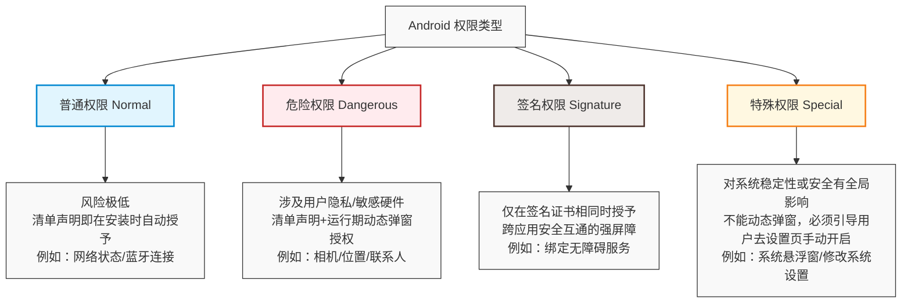
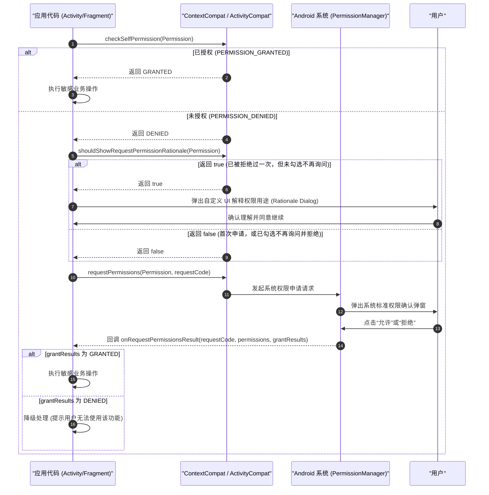
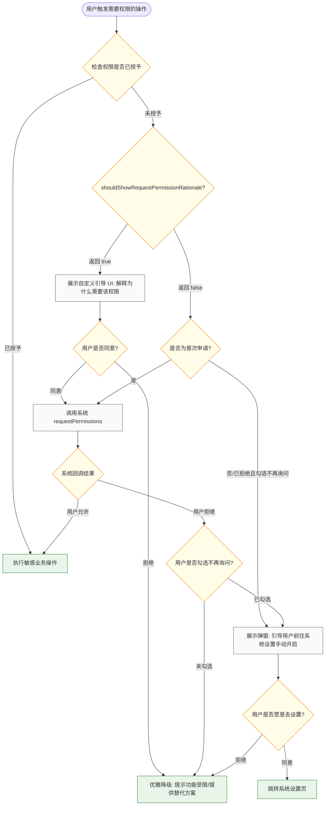

# 5.1.5.5 权限

Android 权限系统是保护系统稳定、保护用户隐私以及防止恶意软件危害的核心安全机制。本文将从底层 Linux 沙箱的设计初衷出发，系统剖析 Android 权限的分级分类、动态权限的底层设计时序与现代 API 实现，并深入探讨历代 Android 系统（特别是 Android 6.0、10、11、13、14）的权限演进与开发者适配细节。

---

## 1. 核心概念：Android 安全防御体系

Android 权限系统并非空中楼阁，它是建立在底层的操作系统内核安全机制与上层的应用通信控制框架之上的两层防御体系。

### 1.1 底层：Linux UID/GID 多用户安全沙箱

在 Linux 操作系统中，“多用户”的设计是为了防止不同的物理用户互相读取文件、干扰进程。Android 创造性地将这一概念移植到了“多应用”的隔离上，这被称为**应用沙箱（Application Sandbox）**。

1. **唯一 UID 的分配**：
   在应用安装时，Android 的包管理器（`PackageManagerService`）会为每个 APK 分配一个专属的 Linux 用户 ID（UID，例如 `u0_a123`）。
   每个应用都运行在独立的 Dalvik/ART 虚拟机进程中，拥有独立的内存空间。
2. **私有数据目录隔离**：
   应用的文件会被存储在私有目录中（如 `/data/data/package_name`）。在底层文件系统中，该目录的拥有者（Owner）被严格限制为该应用被分配的 UID，文件访问权限通常为 `700` 或 `711`（即只有该 UID 的进程可以读写和执行，其他 UID 进程无法访问）。
3. **硬件与系统服务保护（GID 映射）**：
   底层硬件设备（如 `/dev/binder`、`/dev/video0` 相机设备、网卡等）在 Linux 节点上被赋予了特定的用户组权限。
   当应用进程启动时，系统会查询该应用被授予的权限列表。如果应用声明了某种硬件访问权限，系统就会在 fork 进程后，将对应的 Linux 组 ID（GID）添加到该进程的附属组列表中。例如，声明了 `INTERNET` 权限的应用，其进程会被加入 `inet` 用户组，从而获得操作底层 Socket 节点的权限。

### 1.2 应用层：声明与授予体系

虽然底层沙箱保证了进程级别的强隔离，但应用在日常使用中需要互通有无，也需要请求高层系统服务（如获取地理位置、读取系统日历等）。由于这些敏感操作通常是由驻留在系统进程（`SystemServer`）中的系统服务来完成的，因此 Android 在沙箱之上构建了**应用层权限声明与授予体系**：

- **声明（Declaration）**：应用在清单文件 `AndroidManifest.xml` 中通过 `<uses-permission>` 声明其需要使用的权限，向系统坦白其行为意图。
- **授予（Granting）**：系统在安装时或运行期间，根据系统版本、应用声明、用户许可情况，决定是否将该权限标志位写入系统的权限管理数据库中。
- **校验（Validation）**：当应用发起 IPC 调用（例如通过 Binder 调用 `LocationManagerService` 的方法获取当前位置）时，服务侧会在 Binder 驱动的协助下，调用 `Binder.getCallingUid()` 获取调用方的 UID。随后，系统服务向 `PermissionManagerService` (PMS) 发起查询，校验该 UID 是否已被授予对应的权限。如果未授权，系统服务会直接拒绝提供服务并抛出 `SecurityException` 异常。

---

## 2. 设计取舍与权限分类

在早期的 Android 版本中，权限的授予采用的是“一刀切”的安装时授权机制（Install-time Permission）。用户在下载安装应用时，系统会列出该应用申请的所有权限。用户只有两种选择：要么接受所有权限并安装应用，要么放弃安装。这种设计导致了严重的隐私泄漏与强制捆绑问题。
为了在“保障用户隐私安全”与“减少开发/用户交互负担”之间取得最佳平衡，Android 权限系统将权限划分为了四大核心等级。



### 2.1 普通权限 (Normal Permissions)
- **定义**：对用户隐私或设备安全威胁极低的权限。
- **特点**：应用只需在 `AndroidManifest.xml` 中声明，系统就会在安装时自动授予，且用户在运行期间无法撤销这些权限。
- **典型示例**：`android.permission.INTERNET`（访问网络）、`android.permission.ACCESS_NETWORK_STATE`（获取网络状态）、`android.permission.BLUETOOTH`（连接蓝牙设备）、`android.permission.SET_WALLPAPER`（设置壁纸）。
- **取舍逻辑**：虽然网络访问是绝大多数应用的基础需求，若对此频繁弹窗会引发“权限疲劳（Permission Fatigue）”，导致用户对所有弹窗失去警惕性，因此系统选择默认信任。

### 2.2 危险权限 (Dangerous Permissions)
- **定义**：涉及用户个人隐私数据或直接控制设备硬件（可能产生资费或危害系统安全）的权限。
- **特点**：不仅需要在清单中声明，还必须在应用运行期间，当需要使用对应功能时，动态弹窗向用户请求授权。用户可以随时在系统设置中撤销这些权限。
- **典型示例**：`READ_CONTACTS`（读取联系人）、`CAMERA`（相机访问）、`RECORD_AUDIO`（麦克风录音）、`ACCESS_FINE_LOCATION`（精准定位）。
- **权限组（Permission Groups）**：
  为了降低用户的决策成本，危险权限被组织成了权限组。
  * 例如，`CONTACTS` 权限组包含了 `READ_CONTACTS`、`WRITE_CONTACTS` 和 `GET_ACCOUNTS`。
  * **经典的权限组逻辑**：如果应用已被授予了某个权限组中的任意一个权限，那么当它再次请求该组内的其他权限时，系统会自动授予，而不会再次弹窗提示用户。
  * **注意**：尽管有此设计，应用在编码时仍**不应**假设该行为在未来版本中总是一致。始终应当在使用特定权限前进行 `checkSelfPermission` 校验。

### 2.3 签名权限 (Signature Permissions)
- **定义**：只有当请求权限的应用与声明权限的应用使用相同的签名证书签署时，系统才会授予的权限。
- **特点**：安装时自动授予。这是一种极强的安全屏障，非常适合在同一开发者旗下的多应用生态（App Group）之间共享敏感数据，或者系统级组件与预装应用之间的安全互通。
- **典型示例**：`BIND_ACCESSIBILITY_SERVICE`（绑定无障碍服务）、`BIND_INPUT_METHOD`（绑定输入法服务）。

### 2.4 特殊权限 (Special Permissions)
- **定义**：危害程度甚至大于危险权限，对系统整体稳定性、交互流程或用户安全具有全局影响的特权操作。
- **特点**：它们不属于标准的“运行时弹窗权限”。应用无法通过常规的动态授权弹窗直接请求，必须通过发送特定的 `Intent` 引导用户跳转到系统设置的专用页面，由用户手动找到该应用并开启开关。
- **典型示例与底层逻辑**：
  1. **`SYSTEM_ALERT_WINDOW`（显示系统级悬浮窗）**：
     * **危害**：悬浮窗可以覆盖在其他任何应用之上，极易被恶意应用利用进行“点击劫持（Clickjacking）”或钓鱼攻击（遮挡真实界面夺取用户点击流）。
     * **校验 API**：使用 `Settings.canDrawOverlays(context)` 进行检查。
     * **申请 Intent**：
       ```kotlin
       val intent = Intent(Settings.ACTION_MANAGE_OVERLAY_PERMISSION).apply {
           data = Uri.parse("package:${packageName}")
       }
       startActivity(intent)
       ```
  2. **`WRITE_SETTINGS`（修改系统设置）**：
     * **危害**：允许应用读写系统级设置（如修改屏幕亮度、休眠时间、系统铃声等），这可能破坏系统配置的统一性并加速电量消耗。
     * **校验 API**：使用 `Settings.System.canWrite(context)` 进行检查。
     * **申请 Intent**：
       ```kotlin
       val intent = Intent(Settings.ACTION_MANAGE_WRITE_SETTINGS).apply {
           data = Uri.parse("package:${packageName}")
       }
       startActivity(intent)
       ```

---

## 3. 动态权限请求机制实现

### 3.1 经典三步走请求时序

在 Android 6.0 引入动态权限初期，权限的请求通常按照“检查 -> 解释 -> 申请 -> 回调”的闭环流程进行。



### 3.2 现代 Activity Result API 最佳实践

传统的 `onRequestPermissionsResult` 回调方式存在严重的弊端：代码高度碎片化、大量的 `requestCode` 难以维护、在 Activity 重建（如屏幕旋转、内存不足回收）时极易丢失状态。

Jetpack 引入了 Activity Result API，通过解耦和类型安全的方式重构了权限申请逻辑。以下是生产环境推荐的 Kotlin 实现模板：

```kotlin
import android.Manifest
import android.content.Context
import android.content.Intent
import android.content.pm.PackageManager
import android.net.Uri
import android.os.Bundle
import android.provider.Settings
import android.widget.Toast
import androidx.activity.result.contract.ActivityResultContracts
import androidx.appcompat.app.AlertDialog
import androidx.appcompat.app.AppCompatActivity
import androidx.core.content.ContextCompat

class PermissionActivity : AppCompatActivity() {

    // 1. 注册权限请求契约 (必须在 Lifecycle.State.INITIALIZED 之前注册，通常作为类成员变量)
    private val requestCameraLauncher = registerForActivityResult(
        ActivityResultContracts.RequestPermission()
    ) { isGranted: Boolean ->
        if (isGranted) {
            // 权限被授予，执行相机操作
            startCameraPreview()
        } else {
            // 权限被拒绝，检查是否被永久拒绝 (即 shouldShowRequestPermissionRationale 返回 false)
            if (!shouldShowRequestPermissionRationale(Manifest.permission.CAMERA)) {
                // 用户勾选了“不再询问”并拒绝，引导至设置页
                showGoToSettingsDialog()
            } else {
                // 用户单纯拒绝，进行功能降级提示
                Toast.makeText(this, "相机权限被拒绝，无法使用扫码功能", Toast.LENGTH_SHORT).show()
            }
        }
    }

    override fun onCreate(savedInstanceState: Bundle?) {
        super.onCreate(savedInstanceState)
        setContentView(R.layout.activity_permission)
        
        // 触发权限检查与申请流程
        checkAndRequestCameraPermission()
    }

    private fun checkAndRequestCameraPermission() {
        when {
            // 情况 A: 已经拥有权限
            ContextCompat.checkSelfPermission(
                this,
                Manifest.permission.CAMERA
            ) == PackageManager.PERMISSION_GRANTED -> {
                startCameraPreview()
            }
            // 情况 B: 用户之前拒绝过，需要显示解释框 (Rationale Dialog)
            shouldShowRequestPermissionRationale(Manifest.permission.CAMERA) -> {
                showRationaleDialog {
                    // 用户在解释框中同意后，发起真实请求
                    requestCameraLauncher.launch(Manifest.permission.CAMERA)
                }
            }
            // 情况 C: 首次请求权限
            else -> {
                requestCameraLauncher.launch(Manifest.permission.CAMERA)
            }
        }
    }

    private fun startCameraPreview() {
        // 启动相机预览的真实业务逻辑
        Toast.makeText(this, "成功启动相机", Toast.LENGTH_SHORT).show()
    }

    private fun showRationaleDialog(onConfirm: () -> Unit) {
        AlertDialog.Builder(this)
            .setTitle("需要相机权限")
            .setMessage("我们需要使用相机权限来扫描二维码，以帮您快速识别商品信息。")
            .setPositiveButton("同意") { _, _ -> onConfirm() }
            .setNegativeButton("取消", null)
            .show()
    }

    private fun showGoToSettingsDialog() {
        AlertDialog.Builder(this)
            .setTitle("权限已禁用")
            .setMessage("您已永久禁用了相机权限，请前往系统设置手动开启，否则无法使用扫码功能。")
            .setPositiveButton("去设置") { _, _ ->
                val intent = Intent(Settings.ACTION_APPLICATION_DETAILS_SETTINGS).apply {
                    data = Uri.fromParts("package", packageName, null)
                }
                startActivity(intent)
            }
            .setNegativeButton("取消", null)
            .show()
    }
}
```

### 3.3 源码视角下的权限校验底层机制

当应用调用 `ContextCompat.checkSelfPermission(context, permission)` 时，底层的调用链如下：

1. **入口校验**：
   最终会调用到 `ContextImpl.checkPermission(String permission, int pid, int uid)`。
2. **跨进程 IPC**：
   `ContextImpl` 会通过 Binder 接口 `IPermissionManager` 跨进程调用运行在 `SystemServer` 进程中的 `PermissionManagerService` (PMS)。
3. **TargetSDK 兼容性修正**：
   如果应用的 `targetSdkVersion` 小于 23（即 Android 6.0 之前），即使在 Android 6.0+ 设备上运行，系统为了向后兼容，在底层校验时依然会返回 `PERMISSION_GRANTED`。
   但是，如果用户在系统设置中关闭了该权限，系统会通过 **`AppOpsManager`**（应用操作管理器）进行拦截。系统不会让 API 直接奔溃，而是截获 API 调用，返回空数据（如空 Cursor、空的联系人列表、空的定位结果），这被称为“伪授权”。
4. **运行时数据库查询**：
   如果 `targetSdkVersion >= 23`，PMS 会查询系统的运行时权限数据库（通常序列化在 `/data/system/users/0/runtime-permissions.xml` 配置文件中）。
   系统通过检查应用的 UID 以及权限授予标志（Granted Flag）来做出最终的裁决。

---

## 4. 各版本权限系统的重大升级与适配

随着移动互联网对隐私安全要求的全面升级，Android 系统的权限机制经历了一场深刻的“从粗放到精细”的变革。涉及系统版本变化，详情请参考 [AndroidVersionChangeLog.md](../../../../../AndroidVersionChangeLog.md)。

| Android 版本 | API 级别 | 权限机制核心变更 | 开发者适配重点与最佳实践 |
| :--- | :--- | :--- | :--- |
| **Android 6.0** | 23 | **动态权限机制分水岭**：废除安装时一刀切授权，引入运行时动态弹窗授权。 | 必须适配 `checkSelfPermission` 与 `requestPermissions`。处理 TargetSDK < 23 的旧应用在 6.0+ 设备上运行被撤销权限时的空数据/空指针防崩保护。 |
| **Android 10** | 29 | **细化定位权限**：将定位拆分为前台定位与后台定位（`ACCESS_BACKGROUND_LOCATION`）。<br>**存储权限沙盒化**（Scoped Storage）：限制对公共存储空间的访问。 | 1. 应用在后台获取位置时，必须申请 `ACCESS_BACKGROUND_LOCATION`。后台定位权限必须在用户被充分告知后，显式引导至设置页“始终允许”中开启。<br>2. 适配分区存储，弃用 `WRITE_EXTERNAL_STORAGE`。 |
| **Android 11** | 30 | **一次性权限（One-time permissions）**：临时授权，应用杀进程或退后台一段时间后收回。<br>**长期未使用应用自动重置权限**。 | 1. 每次进入敏感页面都要检查权限，绝不能用全局变量缓存权限状态。<br>2. 长期未使用的应用权限会被撤销，应用再次启动时需重新走动态申请流程。提供 `Intent(Intent.ACTION_AUTO_REVOKE_PERMISSIONS)` 引导用户关闭自动重置。 |
| **Android 13** | 33 | **媒体权限细粒度拆分**：废弃 `READ_EXTERNAL_STORAGE`，拆分为图片、视频、音频三个独立权限。<br>**引入通知运行时权限** `POST_NOTIFICATIONS`。 | 1. TargetSDK >= 33 时，若读取图片需申请 `READ_MEDIA_IMAGES`；视频需 `READ_MEDIA_VIDEO`；音频需 `READ_MEDIA_AUDIO`。旧的 `READ_EXTERNAL_STORAGE` 在 Android 13+ 上会直接失效（返回 DENIED）。<br>2. 发送推送通知前必须动态请求通知权限，否则通知会被静默拦截。 |
| **Android 14** | 34 | **部分照片和视频访问权限**（`READ_MEDIA_VISUAL_USER_SELECTED`）。 | 引入“选择部分照片”模式。应用必须适配当用户仅授权部分媒体文件时的生命周期。详见下文解析。 |

### 4.1 Android 6.0 (API 23)：动态权限分水岭

在 6.0 之前，应用在安装时一次性打包获取所有声明的权限。这导致恶意软件在清单中声明大量敏感权限后，用户在安装时由于无法选择性拒绝而被迫同意。
6.0 引入了运行时权限（Runtime Permissions）机制。
* **开发策略**：如果 `targetSdkVersion >= 23`，必须在运行时对危险权限进行动态申请。
* **兼容保障**：如果 `targetSdkVersion < 23`，在 6.0+ 系统上，系统在安装时依然自动授予权限。但用户随后可以在设置中撤销权限。为了避免旧应用直接崩溃，系统对敏感操作采用了 `AppOps` 拦截，使其返回空值。

### 4.2 Android 10 (API 29)：细化定位与存储

1. **三态位置权限**：
   定位权限细分为前台定位（在前台 Activity 运行或启动了前台服务 Foreground Service 时使用）与后台定位（`ACCESS_BACKGROUND_LOCATION`）。
   如果应用在后台无感知地获取位置，用户会受到系统警告。
   * **适配建议**：尽量避免申请后台定位。若必须申请，必须引导用户进入系统设置页手动选择“始终允许”。
2. **分区存储（Scoped Storage）**：
   引入沙盒化的媒体和非媒体文件存储方式。应用无法再直接通过 `File` 路径读写 `/sdcard` 的公共空间，存储权限的功能开始被实质性削弱。

### 4.3 Android 11 (API 30)：一次性权限与自动重置

1. **一次性权限（One-time permissions）**：
   对于位置、相机和麦克风，系统弹窗中新增了“仅限这一次”（Only this time）选项。
   * **生命周期**：用户点击后，只要应用处于前台，权限就有效。应用进入后台或被杀死后，权限会在短时间内被系统撤销。
   * **适配重点**：**不能在内存中长期缓存“已获取权限”的布尔状态值**，每次启动敏感业务前都必须调用 `checkSelfPermission` 重新检查。
2. **权限自动重置（Permissions Auto-Reset）**：
   如果用户数月未启动某应用，系统会自动撤销其所有已授予的危险权限。
   * **适配方法**：对于需要长期在后台运行的应用，可以引导用户到系统设置页关闭对该应用的自动重置开关，或使用 `Intent(Intent.ACTION_AUTO_REVOKE_PERMISSIONS)` 发起申请。

### 4.4 Android 13 (API 33)：细粒度媒体权限与通知权限

1. **细粒度媒体权限**：
   废弃了 `READ_EXTERNAL_STORAGE` 权限。当应用的 `targetSdkVersion >= 33` 且运行在 Android 13 及以上设备时，如果继续请求该权限，系统会直接返回 `PERMISSION_DENIED`。
   * **新权限替代**：
     * 读取图片：`Manifest.permission.READ_MEDIA_IMAGES`
     * 读取视频：`Manifest.permission.READ_MEDIA_VIDEO`
     * 读取音频：`Manifest.permission.READ_MEDIA_AUDIO`
2. **运行时通知权限**：
   引入 `Manifest.permission.POST_NOTIFICATIONS`。应用要发送通知，必须在运行时动态请求此权限，否则通知将被系统静默拦截。

### 4.5 Android 14 (API 34) 部分媒体访问权限深度解析

在 Android 14 之前，当应用获得 `READ_MEDIA_IMAGES` 或 `READ_MEDIA_VIDEO` 权限时，意味着应用可以读取设备上的**所有**图片或视频。这给用户的相册隐私带来了巨大威胁。
Android 14 引入了 `READ_MEDIA_VISUAL_USER_SELECTED` 权限，允许用户授予应用“仅访问选定的照片和视频”的权限。

#### 4.5.1 权限申请与用户授权路径
当应用在 TargetSDK >= 34 时，如果同时声明并请求了：
`READ_MEDIA_IMAGES` 和/或 `READ_MEDIA_VIDEO`，并且声明了 `READ_MEDIA_VISUAL_USER_SELECTED`。
系统弹出的权限申请弹窗将包含三个选项：
- **“选择照片和视频”（Select photos and videos）**：用户选择部分媒体。此时，系统授予应用 `READ_MEDIA_VISUAL_USER_SELECTED` 权限，但**拒绝** `READ_MEDIA_IMAGES` 和 `READ_MEDIA_VIDEO` 的完全授权（即处于“部分授权”状态）。
- **“全部允许”（Allow all）**：授予完整的 `READ_MEDIA_IMAGES` / `READ_MEDIA_VIDEO` 权限。
- **“不允许”（Don't allow）**：全部拒绝。

#### 4.5.2 状态组合与 API 结果对照表

当用户在 Android 14 设备上操作不同的授权选项时，API 状态返回如下：

| 用户选择的选项 | `checkSelfPermission(READ_MEDIA_IMAGES)` 结果 | `checkSelfPermission(READ_MEDIA_VISUAL_USER_SELECTED)` 结果 | 应用最终拥有的媒体访问范围 |
| :--- | :--- | :--- | :--- |
| **全部允许** | `PERMISSION_GRANTED` | `PERMISSION_DENIED` (或已无关紧要) | 可以访问相册中的**所有**图片和视频。 |
| **选择照片和视频** | `PERMISSION_DENIED` | `PERMISSION_GRANTED` | **只能**访问用户在系统选择器中勾选的那些特定媒体文件。 |
| **不允许** | `PERMISSION_DENIED` | `PERMISSION_DENIED` | 无法访问任何媒体文件。 |

#### 4.5.3 部分授权模式下的生命周期与适配深度细节

1. **数据更新延迟与 ContentObserver 行为**：
   当应用处于“部分授权”状态（拥有 `READ_MEDIA_VISUAL_USER_SELECTED`）时，通过 `ContentResolver` 查询 `MediaStore.Images.Media.EXTERNAL_CONTENT_URI`，系统会在驱动层动态过滤数据，只返回用户当前选中的那几张图片的 Uri。
   如果用户在应用运行期间，通过系统弹窗追加了选中的图片，系统会更新底层过滤表，并向注册在对应 URI 上的 `ContentObserver` 发送 `onChange` 通知，应用需要重新查询 `MediaStore` 以刷新列表。
2. **再次申请权限的系统行为**：
   当应用处于“部分授权”状态，如果下一次启动应用或者再次触发需要访问相册的操作时，应用应当**再次发起**相同的权限请求组合。
   此时系统的表现与以往不同：系统**不会**弹出一个完整的权限申请弹窗，而是会弹出一个专用的“媒体选择编辑框”，询问用户是“保持当前选择”还是“选择更多照片”。
   如果应用需要强行要求“全部允许”的完整权限，应当在多次被拒绝后，引导用户前往系统设置页将“照片和视频”访问权限由“限制访问”修改为“允许访问所有照片”。
3. **向前兼容（TargetSDK < 34 运行在 Android 14 上）**：
   如果应用的 TargetSDK < 34，但运行在 Android 14 设备上：
   当用户选择“选择照片和视频”时，系统会在底层临时将应用标记为已获得 `READ_MEDIA_IMAGES` 权限（为了防止旧应用因未适配而直接崩溃），但实际上 MediaStore 依然只会向应用返回用户选中的照片。此时应用虽然检测到 `checkSelfPermission` 返回 `GRANTED`，但它读取的数据其实是受限的。这就要求应用在逻辑上必须兼容“虽然返回 GRANTED，但媒体库实际只返回了零星几张照片”的情况，而不能假设获得了完整相册。
4. **终极解决方案：拥抱 Photo Picker**：
   如果应用仅仅需要让用户选择头像、发送单张/多张图片，**最推荐的做法是直接使用系统 Photo Picker**（照片选择器）。
   Photo Picker 运行在单独的系统进程中，完全**不需要**声明或申请任何存储权限或媒体权限。应用通过 `ActivityResultContracts.PickVisualMedia` 启动照片选择器，用户选择后，应用只能拿到被选中媒体的临时只读 URI。这种“零权限、强隐私”的设计是 Android 官方力推的未来趋势。

---

## 5. 常见误区与最佳实践

### 5.1 常见误区剖析

1. **误区一：未进行运行时检测，依赖“理所当然”的授权**。
   * **现象**：开发者认为在闪屏页（SplashActivity）已经一次性申请了所有权限，因此在后面的子 Activity 中直接调用敏感 API（如获取定位、录音）。
   * **危害**：用户随时可以在系统设置中手动撤销已授予的危险权限。如果应用在调用 API 前没有进行 `checkSelfPermission` 检查，会导致应用直接抛出 `SecurityException` 崩溃。
   * **规避策略**：**每次使用前，必须 check**。绝不缓存权限状态，把权限检查作为敏感操作的入口屏障。
2. **误区二：在 `shouldShowRequestPermissionRationale` 返回 `false` 时强行退出或死循环弹窗**。
   * **现象**：当用户勾选了“不再询问”并拒绝权限后，应用在每次启动时依然强行发起请求，或者弹窗阻断用户操作，甚至直接闪退应用。
   * **危害**：这严重违反了 Google Play 的应用上架政策，且极度伤害用户体验。
   * **规避策略**：优雅降级。如果核心功能确实无法在无权限下运行（如相机类应用的相机权限），则应当弹出一个友好的说明对话框，解释为什么没有此权限应用无法运行，并提供“去设置”和“退出应用”的清晰选项；如果是辅助功能（如聊天应用发送定位），则只禁用发送定位功能，其余聊天功能应当保持完全可用。

### 5.2 最佳实践：构建流式申请设计

为了给用户提供无缝且尊重的权限获取体验，推荐在应用中建立**“流式申请（Flow-based Permission Requests）”**架构设计。



1. **按需申请 (Just-in-Time Request)**：
   不要在应用首次启动时“打包一次性申请”所有的危险权限（如通讯录、位置、相机、麦克风等）。
   正确的做法是：**只有当用户主动触发了某个具体功能时，才去申请对应的权限**。例如，用户点击“语音输入”按钮时，才去申请麦克风权限。这样用户能够清晰理解权限与功能的因果关系，授权率将大大提升。

2. **先引导，后申请 (Explain First, Ask Later)**：
   在发起系统权限弹窗之前，尤其是对于一些高危或难以直观理解的权限（如后台定位），先弹出一个应用自定义的、设计精美的引导对话框。用图文并茂的方式说明该权限能为用户带来什么价值。当用户点击“我知道了/同意”后，再触发系统真正的权限弹窗。这不仅能缓冲系统弹窗的突兀感，还能在系统判定“不再询问”之前，给应用争取解释的机会。

3. **优雅的异常处理与防护机制**：
   在所有调用敏感 API 的底层包装方法中，使用 `try-catch` 捕获 `SecurityException`。尽管我们在调用前做了权限检查，但在多线程并发、系统权限数据库损坏、或者某些魔改 ROM 的极端情况下，依然可能发生检查通过但调用时抛出异常的诡异现象。主动捕获异常并上报日志，同时向用户友好提示，能极大地提升应用的線上稳定性。
