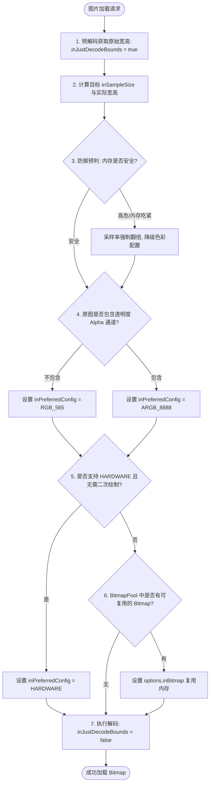

# Bitmap 压缩策略详细机制

在 Android 应用程序的开发中，图片（`Bitmap`）通常是引发内存溢出（OOM, Out Of Memory）和界面卡顿（Jank）的头号元凶。由于移动设备物理内存受限，而高分辨率相机的普及使得图片尺寸越来越大，如何进行高效、安全的 Bitmap 压缩是每个 Android 开发者必须攻克的难题。

本文将从 Bitmap 内存占用的底层计算机制出发，系统拆解三大核心压缩策略（采样率压缩、质量压缩、色彩格式转换），深入剖析硬件模式（`HARDWARE`）以及底层的内存复用机制，并提供防范 OOM 的工程化最佳实践。

---

## 1. 核心概念：Bitmap 内存占用机制

要想科学地压缩 Bitmap，首先必须精确掌握 Bitmap 在内存中占用的空间是如何计算的。

### 1.1 经典内存计算公式

#### 1.1.1 基础计算公式
在一般情况下，Bitmap 在内存中占用的字节数可以用以下经典公式表示：
$$\text{Memory} = \text{Width} \times \text{Height} \times \text{BytesPerPixel}$$
*   **Width**: 图片像素宽度。
*   **Height**: 图片像素高度。
*   **BytesPerPixel**: 单个像素所占用的字节数（取决于色彩编码格式 `Bitmap.Config`）。

#### 1.1.2 资源文件加载的密度缩放公式
当图片通过 `BitmapFactory.decodeResource()` 从项目的资源目录（如 `res/drawable-xxxx/`）中加载时，Android 系统为了保证图片在不同像素密度的屏幕上看起来大小一致，会在解码时对图片进行自动缩放。此时，实际载入内存的宽高计算公式为：
$$\text{Width}_{\text{actual}} = \lfloor \text{Width}_{\text{origin}} \times \frac{\text{TargetDensity}}{\text{InDensity}} + 0.5 \rfloor$$
$$\text{Height}_{\text{actual}} = \lfloor \text{Height}_{\text{origin}} \times \frac{\text{TargetDensity}}{\text{InDensity}} + 0.5 \rfloor$$
*   **Width_origin / Height_origin**: 图片的原始物理分辨率。
*   **TargetDensity**: 当前设备的屏幕密度（通过 `DisplayMetrics.densityDpi` 获取）。
*   **InDensity**: 图片所在的 `drawable` 资源目录所代表的密度。例如：
    *   `drawable-mdpi` 代表 $160\text{ dpi}$
    *   `drawable-hdpi` 代表 $240\text{ dpi}$
    *   `drawable-xhdpi` 代表 $320\text{ dpi}$
    *   `drawable-xxhdpi` 代表 $480\text{ dpi}$
    *   `drawable-xxxhdpi` 代表 $640\text{ dpi}$

**【案例分析】**
假设有一张原始分辨率为 $1000 \times 1000$ 像素的 PNG 图片，我们误将其放入了 `res/drawable-mdpi` 目录中。当在一台屏幕密度为 `xxhdpi`（即 $480\text{ dpi}$）的手机上加载它，且色彩配置为默认的 `ARGB_8888` 时，其内存占用计算如下：
$$\text{TargetDensity} = 480,\quad \text{InDensity} = 160,\quad \text{缩放倍数} = 480 / 160 = 3$$
$$\text{Width}_{\text{actual}} = 1000 \times 3 = 3000\text{ 像素}$$
$$\text{Height}_{\text{actual}} = 1000 \times 3 = 3000\text{ 像素}$$
$$\text{Memory} = 3000 \times 3000 \times 4\text{ Bytes} = 36,000,000\text{ Bytes} \approx 34.33\text{ MB}$$
如果直接把该图片放入对应的 `drawable-xxhdpi` 目录，则缩放倍数为 1，内存占用仅为 $1000 \times 1000 \times 4\text{ Bytes} \approx 3.81\text{ MB}$。
由此可见，**资源目录放置不当会在高端机型上引起可怕的内存膨胀**，这是导致很多应用在启动时或者切换页面时发生 OOM 的隐蔽根源。

#### 1.1.3 `inScaled` 控制机制
另外，`BitmapFactory.Options` 提供了 `inScaled` 属性。当其设置为 `false` 时，系统在解码 `res/drawable` 目录下的图片时，将**禁止一切自动密度缩放行为**，强行以图片物理原尺寸进行解码。这在需要像素精准控制的图形引擎（如游戏引擎中的贴图、瓦片图 TileMap）中极为有用。但是，如果 `inScaled` 保持默认的 `true`，系统会自动依据密度进行缩放，开发者在处理高清UI资产时需谨防这一缩放机制导致图片资源在内存中意外膨胀。

---

### 1.2 内存分配位置的历史演进

在不同的 Android 版本中，Bitmap 像素数据（Pixel Data）分配的内存区域发生过多次重大演进，这对我们的内存优化策略有重要指导作用（具体版本演进历史可参见 [AndroidVersionChangeLog.md](../../../../../AndroidVersionChangeLog.md)）：

1.  **Android 3.0 (API 11) 之前**：
    *   **分配位置**：Bitmap 像素数据分配在 **Native 内存**（C/C++ 堆）中，而 Java 堆中仅保存了一个轻量级的 `android.graphics.Bitmap` 实例壳以及指向 Native 数据的指针。
    *   **劣势**：Native 内存的回收极度依赖 Java 壳对象的垃圾回收（GC）及其 `finalize()` 机制。如果 Java 对象没有及时释放，Native 内存就会不断累积。由于底层堆空间不受 JVM `-Xmx` 限制，开发者往往难以监控其压力，极易导致 Native OOM。因此，在这一时期，开发者必须在不使用图片时手动调用 `bitmap.recycle()` 来强制释放 Native 内存。
2.  **Android 3.0 (API 11) 至 Android 7.1.1 (API 25)**：
    *   **分配位置**：为了解决 Native 内存难以受控的问题，Google 将像素数据与 Java `Bitmap` 对象一起放到了 **Java 堆内存**中。
    *   **劣势**：虽然像素数据能随着 Java GC 自动、及时地被回收，但巨大的图片像素极易将本就局限的 Java 堆空间迅速填满。这会导致系统频繁触发 GC 动作，引发严重的 JVM 垃圾回收暂停（Stop-the-world），造成界面卡顿、丢帧，并且频繁抛出 Java 层的 `OutOfMemoryError`。
3.  **Android 8.0 (API 26) 及更高版本**：
    *   **分配位置**：Google 再次进行重构，将像素数据重新放回 **Native 内存**。
    *   **回收机制**：引入了 `NativeAllocationRegistry` 机制。当 Native 层分配了内存，该机制会注册到 JVM。垃圾回收器在评估内存压力时，会将 Native 占用的空间合并计算。一旦发现总体（Java 堆 + Native 堆）内存吃紧，GC 会更积极地被触发，从而回收 Java 壳对象，并在 native 析构函数中安全释放 Native 像素数据。这一演进极大地减轻了 Java 堆的压力，也为引入 `HARDWARE` 硬件模式奠定了架构基础。

---

### 1.3 `Bitmap.Config` 像素格式深度剖析

`Bitmap.Config` 决定了单个像素所占用的内存字节数（色深和通道数），Android 目前主要支持以下几种配置：

*   **`ALPHA_8`**：
    *   每个像素仅占用 **$1\text{ 字节}$**。
    *   它只保留 Alpha 通道（透明度信息），不记录 RGB 颜色。适用于绘制遮罩、阴影或者不需要色彩的单色渐变图。
*   **`ARGB_4444`**：
    *   每个像素占用 **$2\text{ 字节}$**（A、R、G、B 通道各占 $4\text{ 位}$）。
    *   色深仅为 12 位（外加 4 位透明度），色彩范围极窄，在显示细腻图片时会产生严重的色彩断层（Banding）。由于成像质量过差，自 **Android 4.4 (API 19)** 起已被废弃。在现代系统上强行指定此格式，系统通常会自动 fallback 到默认的 `ARGB_8888`。
*   **`ARGB_8888`**：
    *   每个像素占用 **$4\text{ 字节}$**（A、R、G、B 通道各占 $8\text{ 位}$，即 $256\text{ 阶}$）。
    *   色深为 24 位真彩色加上 8 位透明度，画面细腻真实，是 Android 系统的默认加载格式。
*   **`RGB_565`**：
    *   每个像素占用 **$2\text{ 字节}$**（R 占 $5\text{ 位}$，G 占 $6\text{ 位}$，B 占 $5\text{ 位}$）。
    *   **无 Alpha 透明度通道**。对于不需要透明度的图片（如系统背景、普通相机照片、缩略图），采用此格式可以在肉眼几乎无法分辨细节差异的前提下，**将内存占用直接减半（50%）**。
*   **`RGBA_F16`**：
    *   每个像素占用 **$8\text{ 字节}$**（每个通道采用 16 位半精度浮点数 `Float16`）。
    *   这是自 **Android 8.0 (API 26)** 引入的新色彩配置。主要用于支持 **HDR (高动态范围)** 图像。浮点数的高精度能够表现出宽广的色域（如 BT.2020）和极端的明暗对比，但其内存消耗是默认配置的双倍。
*   **`HARDWARE`**：
    *   这是 Android 8.0 (API 26) 引入的革命性硬件加速配置。
    *   **底层机理**：当指定为 `HARDWARE` 模式时，解码器在 Native 层通过 `GraphicBuffer` 直接把像素数据存储在 **GPU 的显存**中。而在 Java 堆和 Native 堆中，仅分配一个极轻量级的 `Bitmap` 壳对象以及一个显存地址指针，其占用的系统 RAM 几乎为零。
    *   **性能优势**：在执行 GPU 渲染绘制时，GPU 能够以“零拷贝（Zero-Copy）”的形式直接读取显存中的数据进行栅格化和图层混合，免去了从系统主内存（RAM）上传纹理数据到 GPU（Texture Upload）的硬件总线拷贝损耗，大幅降低了绘制延迟和 CPU/GPU 功耗。
    *   **NDK 交互与跨引擎零拷贝共享**：
        硬件 Bitmap 底层依托的 `GraphicBuffer`/`AHardwareBuffer` 是 Android 系统中跨进程、跨渲染管线共享像素缓冲区的基石。在 NDK 层，开发者可以直接通过 `AHardwareBuffer_fromHardwareBuffer()` 接口将其导出，并直接与 OpenGL ES 纹理或 Vulkan 的 `VkImage` 进行绑定。这在混合了 Unity、Flutter 渲染或多进程相机流传输的应用中极具价值，能实现真正的多引擎、多进程间零拷贝图像共享与加速渲染。
    *   **致命缺陷与适用边界**：
        1.  **绝对只读性**：显存中的数据是只读的。一旦加载为 `HARDWARE` Bitmap，无法基于该 Bitmap 创建 Canvas 对象进行二次绘制（例如打水印、裁剪、旋转、圆角处理等）。若强行操作，Canvas 会抛出异常 `IllegalArgumentException: Cannot draw to a hardware bitmap`。
        2.  **获取像素点极其昂贵**：无法直接调用 `bitmap.getPixel(x, y)` 或 `bitmap.getPixels()` 来提取颜色值。若确实需要获取，必须使用 Android 8.0 引入的 `PixelCopy` 异步读取接口。由于这涉及从显存同步回读至 RAM 的操作，会强制清空（Flush）GPU 渲染流水线并进行 CPU/GPU 同步，极其耗时，频繁调用可能直接导致应用主线程卡死。
        3.  **兼容性与 Fallback**：若底层硬件（如部分老旧 GPU 驱动）或解码器不支持硬解，系统会自动 fallback 回普通的软件解码（即退回到 `ARGB_8888`），需要注意内存突增。
        4.  **为何必须退回到普通 Bitmap 的典型场景**：
            *   *滤镜处理与像素编辑*：若应用需要实现类似“高斯模糊（Gaussian Blur）”或者冷暖色调调节的滤镜效果，通常需要读取像素进行矩阵卷积计算。硬件 Bitmap 无法提供像素的高效读取，此时必须将其退回到传统的 `ARGB_8888`。
            *   *动态水印或合成*：若需要将用户的名字以文字（Text）形式动态绘制在图片上，必须利用 `Canvas(bitmap)` 对其进行改写。由于硬件 Bitmap 是只读的，这种场景必须使用 `inMutable = true` 的常规 Bitmap。
            *   *局部裁剪与长图切割*：在类似漫画阅读器等需要裁剪、拼接或切割巨型长图的场景中，Canvas 的离屏缓冲绘制无法在硬件 Bitmap 上生效，也必须将其转换为常规的 Native 像素缓存。
        5.  **适用场景**：只适用于仅展示、无需在客户端做任何二次加工、且生命周期较短的纯展示性 ImageView 图片。

---

## 2. 三大压缩策略深度拆解

为了在各种场景下降低内存压力或传输带宽，Android 提供了三大核心压缩策略。

### 2.1 策略一：采样率压缩（inSampleSize）

#### 2.1.1 核心目的
采样率压缩主要用于**降低图片的物理分辨率（宽高）**，从而在解码阶段就显著减小其分配在内存中的字节数。这主要针对的是原始分辨率远大于目标 ImageView 控件尺寸的大图。

#### 2.1.2 机制与实现流程
要在不耗费额外内存的前提下完成缩放解码，必须利用 `BitmapFactory.Options` 提供的属性，采用“两阶段解码”机制：

1.  **第一阶段：预解码（只读 Header 信息）**
    *   将 `options.inJustDecodeBounds` 设置为 `true`。
    *   调用 `BitmapFactory.decodeXXX` 进行解码。
    *   **底层细节**：在 Native 层的 Skia 引擎中，当检测到 `inJustDecodeBounds` 为 `true` 时，解码器会执行轻量级解析，仅提取图像文件头中的关键元数据（如原始宽度 `outWidth`、原始高度 `outHeight` 以及 MIME类型 `outMimeType`），而**不为像素矩阵分配任何物理内存**。此步骤执行速度极快，内存开销几乎为零。
2.  **第二阶段：计算比例与实际解码**
    *   根据目标 ImageView 的物理尺寸，动态计算出合理的缩放比 `inSampleSize`。
    *   将 `options.inJustDecodeBounds` 重置为 `false`。
    *   传入计算好的 `inSampleSize`，再次调用 `BitmapFactory.decodeXXX`。此时，系统会分配缩放后的内存并完成像素解码。

```
[ 图像文件 ] ──( 开启 inJustDecodeBounds=true )──> [ 快速读取宽高元数据, 不占内存 ]
                                                           │
                                                           ▼
[ 实际分配内存并渲染 ] <──( 传入 inSampleSize, 设为false )── [ 计算缩放比例 inSampleSize ]
```

#### 2.1.3 计算细节：为什么必须为 2 的幂次方？
`BitmapFactory.Options.inSampleSize` 属性的值必须是 **2 的幂次方**（例如 1, 2, 4, 8, 16...）。
*   **底层行为**：如果传入的值不是 2 的幂次方，Skia 底层引擎在实际执行时会**向下取整到最接近的 2 的幂次方**。例如：
    *   传入 `3`，实际生效的值是 `2`；
    *   传入 `5`，实际生效的值是 `4`；
    *   传入 `12`，实际生效的值是 `8`。
*   **计算公式设计**：虽然底层有向下兼容，但为了避免不同硬件厂商或定制系统底层的 Skia 版本表现不一致，我们应该在上层代码中主动完成 2 的幂次方转换。标准的算法是在宽高都大于目标宽高时，以 2 的倍数递增 `inSampleSize`。

#### 2.1.4 Kotlin 最佳实践模板
以下是工程中标准的动态计算采样率并加载图片的 Kotlin 封装：

```kotlin
import android.content.res.Resources
import android.graphics.Bitmap
import android.graphics.BitmapFactory
import androidx.annotation.DrawableRes
import java.io.InputStream

object BitmapResizer {

    /**
     * 计算最合适的 inSampleSize (2 的幂次方)
     */
    fun calculateInSampleSize(
        options: BitmapFactory.Options,
        reqWidth: Int,
        reqHeight: Int
    ): Int {
        // 原始图片的宽高
        val height = options.outHeight
        val width = options.outWidth
        var inSampleSize = 1

        if (reqWidth <= 0 || reqHeight <= 0) {
            return inSampleSize
        }

        if (height > reqHeight || width > reqWidth) {
            val halfHeight = height / 2
            val halfWidth = width / 2

            // 循环计算 2 的幂次方，直到宽高有一方小于等于目标值
            while ((halfHeight / inSampleSize) >= reqHeight && (halfWidth / inSampleSize) >= reqWidth) {
                inSampleSize *= 2
            }
        }
        return inSampleSize
    }

    /**
     * 从资源文件中安全、按需缩放解码出 Bitmap
     */
    fun decodeSampledBitmapFromResource(
        res: Resources,
        @DrawableRes resId: Int,
        reqWidth: Int,
        reqHeight: Int,
        preferredConfig: Bitmap.Config = Bitmap.Config.ARGB_8888
    ): Bitmap? {
        return try {
            val options = BitmapFactory.Options().apply {
                // 1. 设置仅解析边界信息
                inJustDecodeBounds = true
            }
            BitmapFactory.decodeResource(res, resId, options)

            // 2. 计算采样率
            options.inSampleSize = calculateInSampleSize(options, reqWidth, reqHeight)

            // 3. 配置实际色彩和解码状态
            options.inPreferredConfig = preferredConfig
            options.inJustDecodeBounds = false

            BitmapFactory.decodeResource(res, resId, options)
        } catch (e: OutOfMemoryError) {
            e.printStackTrace()
            null
        } catch (e: Exception) {
            e.printStackTrace()
            null
        }
    }
}
```

---

### 2.2 策略二：质量压缩（Quality）

#### 2.2.1 核心原理
质量压缩主要通过修改图像的压缩算法细节（如 JPEG 离散余弦变换 DCT 的量化系数表），剔除图像中高频的冗余信息，从而**减小图片存储在磁盘上的文件字节大小，或者在网络传输中的文件体积**。
其调用 API 为：
`bitmap.compress(Bitmap.CompressFormat format, int quality, OutputStream stream)`
*   `quality` 取值为 $0 \sim 100$，数值越小，压缩率越高，图像失真越严重，文件大小越小。

#### 2.2.2 开发者核心误区澄清
> [!IMPORTANT]
> **质量压缩绝对不能改变图片加载到内存中后占用的 Bitmap 内存大小！**
> 这是开发者中最普遍的误区之一。很多开发者认为，既然我用 `bitmap.compress` 将一张原本 $3\text{ MB}$ 的图片质量压缩到了 $150\text{ KB}$，那当用 `BitmapFactory.decodeStream` 重新将这 $150\text{ KB}$ 的流加载回 RAM 时，内存占用也应该是原本的 1/20。
> **事实上并非如此**。虽然文件在磁盘上的物理尺寸变小了，但是只要图片的物理分辨率（宽高）以及色彩通道格式（`Bitmap.Config`）在重新解码时保持不变，重新解压后铺开在内存中的像素矩阵仍然是同样的宽高。根据内存计算公式：$\text{Memory} = Width \times Height \times BytesPerPixel$，它占用的物理 RAM 字节数完全没有发生改变。
> *   **质量压缩改变的是**：磁盘上的文件体积（减少了非易失性存储的负担和网络传输时间）。
> *   **质量压缩未改变的是**：图片一旦被还原为位图（点阵）在 RAM 中的分配大小。

#### 2.2.3 格式差异对质量压缩的影响
*   **`CompressFormat.JPEG`**：
    *   属于**有损压缩**。质量压缩对其非常有效，`quality` 的降低会大幅压缩文件体积，合理设置在 75~85 可以在体积和肉眼画质间取得完美平衡。
*   **`CompressFormat.PNG`**：
    *   属于**无损压缩**。PNG 底层主要采用 DEFLATE 算法压缩。因为是无损格式，所以**传入的 `quality` 参数是无效的（会被直接忽略）**。无论传入 100 还是 10，生成的文件大小和画面精度都不会发生变化。
*   **`CompressFormat.WEBP` / `WEBP_LOSSY` / `WEBP_LOSSLESS`**：
    *   WebP 同时支持有损和无损模式。
    *   在 Android 10 (API 29) 及更高版本中，Google 推荐使用细分格式：
        *   `WEBP_LOSSY`：有损压缩，`quality` 作用显著，同等画质下体积优于 JPEG。
        *   `WEBP_LOSSLESS`：无损压缩，此时 `quality` **不控制像素画质损失**，而是用作控制“压缩算法的努力程度（耗时）”；值越高，算法计算越精细，生成的文件体积越小，但压缩过程消耗的 CPU 时间越长。

---

### 2.3 策略三：色彩格式转换（Preferred Config）

#### 2.3.1 核心原理
色彩格式转换是通过主动降低每个像素占用的字节数（`BytesPerPixel`）来直接缩减 Bitmap 占用的内存空间。
在解码图片时，我们通过配置 `BitmapFactory.Options.inPreferredConfig` 来强制指定期望的色彩配置。例如，在很多展示流中，我们需要加载全屏背景图或大量的缩略图。在能够接受轻微色偏的前提下，强行由默认的 `ARGB_8888` (4字节/像素) 降低为 `RGB_565` (2字节/像素)，**能够直接将内存占用缩减 50%**。

#### 2.3.2 实践细节与天坑
1.  **透明通道的处理**：
    *   `RGB_565` 格式**不支持透明通道**（Alpha 通道会被丢弃）。
    *   如果对一张带有渐变透明度的 PNG 格式图片强制进行 `RGB_565` 转换，解码出来的图片中原本透明的区域将会丢失透明度，表现为**大片的黑色**或者带有严重的噪点。因此，只有确定图片不含有透明通道时，才能使用此策略。
2.  **系统的 Fallback 兼容策略**：
    *   在 Android 底层 Skia 解码时，`inPreferredConfig` 仅是一个**建议配置**，并非强制指令。
    *   如果在 API 级别较低的系统上，对包含透明通道的 PNG 图片设置了 `RGB_565`，或者设置了系统不支持的新配置（如在 Android 8.0 以下设置 `HARDWARE`），系统解码器在检测到冲突后，会**默默退回到系统默认的默认加载配置（通常为 `ARGB_8888`）**以防止画面彻底损坏。
    *   **开发建议**：在执行完解码后，务必通过 `bitmap.config` 确认其最终得到的格式，不能想当然地认为设置了 `inPreferredConfig` 后，生成的格式就一定是它。

---

## 3. 系统层级与工程化优化补充

在现代 Android 工程实践中，除了上述三大底层策略，我们还需要了解打包优化和内存复用技术。

### 3.1 WebP 的工程化演进

WebP 作为 Google 推出的现代网络图片格式，相比传统的 PNG 与 JPEG 具有极高的压缩效率。

#### 3.1.1 AAPT 自动转换
在构建打包阶段，Android 编译工具链中的 **AAPT2** 会对图片进行自动优化。通过配置 Android Gradle 插件（AGP），开发者也可以方便地通过 Android Studio 提供的右键菜单将项目中所有的 `.png` / `.jpg` 一键批量转换为 `.webp`，从源头减小 APK 的包体积。

**AAPT2 的转换局限性与避坑**：
需要特别注意的是，AAPT2 在打包时并不会无差别地将所有 PNG/JPEG 图片自动转换为 WebP：
1.  **.9.png（9-Patch 图片）**：AAPT2 **绝对不会**将 9-Patch 图片转换为 WebP。因为 9-Patch 图片的拉伸边缘控制信息（黑线边界）是直接编码在 PNG 图片像素最外边缘的特殊像素点上的。若强转为 WebP，由于 WebP 的压缩特性，可能会导致这些像素边缘发生有损失真或信息丢失，使得系统在运行时无法精确识别其拉伸规则，从而导致界面拉伸失效甚至崩溃。
2.  **小图开销问题**：对于非常小的图片（例如 $16 \times 16$ 像素的小图标），将其转换为 WebP 后，其复杂的文件头信息（Header）占总体积的比重反而会变高，导致其体积可能不降反升。AAPT2 内部有预估机制，若发现转换后文件体积没有明显缩减，则会主动放弃转换，保留原 PNG 格式。
3.  **minSdkVersion 限制**：如前文所述，若项目设置的 `minSdkVersion` 小于 17，出于对透明 WebP 兼容性的防范，AAPT2 在打包时也会拒绝自动转换带 Alpha 通道的 PNG。

#### 3.1.2 兼容性限制与天坑
在使用 WebP 时，必须注意 Android 版本兼容性（关于各版本对 WebP 支持的历史详情见 [AndroidVersionChangeLog.md](../../../../../AndroidVersionChangeLog.md)）：
*   **Android 4.0 (API 14)**：Android 开始支持基本的 WebP 格式（不透明的有损 WebP）。
*   **Android 4.2.1 (API 17)**：系统才正式支持**带 Alpha 透明通道**以及**无损压缩**的 WebP 格式。
*   **兼容天坑**：若应用将 `minSdkVersion` 设为低于 17（例如 16），而你在 `res/drawable/` 目录中放置了带透明通道的 `.webp` 图片，该应用在 API 16 的设备上启动时会因为解码失败直接抛出资源找不到或解码崩溃。因此，对于多版本兼容的项目，必须结合 `minSdkVersion` 谨慎设计。

---

### 3.2 内存复用机制：`inBitmap` 与 `BitmapPool`

为了避免频繁创建和销毁 Bitmap 造成内存剧烈抖动（Memory Churn）并引发频繁 GC，Android 引入了内存复用机制。

#### 3.2.1 `inBitmap` 的历史限制演进
`BitmapFactory.Options.inBitmap` 属性允许我们传入一个已经存在的 `Bitmap` 对象来承载新解码的图片。
*   **在 Android 3.0 (API 11) 到 Android 4.3 (API 18) 之间**：
    *   复用条件非常严苛：用于复用的 `inBitmap` 的尺寸（Width/Height）必须与新解码出的 Bitmap **完全相同**，且 `inSampleSize` 必须为 1，色彩配置也必须完全一致。
*   **在 Android 4.4 (API 19) 及更高版本**：
    *   复用条件放宽：只要复用 Bitmap 的 **`getAllocationByteCount()` 大于等于** 新解码图片所需的 `byteCount` 即可。即使新图的宽高比原图小，也可以共用这块内存，多余的字节会被解码器自动忽略。

```
[ 废弃的旧 Bitmap 内存块 (大小: 4MB) ]
               │
               ▼ (传入 options.inBitmap)
[ 解码新图片 (大小: 3.5MB) ] ──> 直接覆盖在旧内存上, 零内存申请开销
```

#### 3.2.2 Skia 底层的复用机制
在 Native 层（Skia 引擎），当设置了 `inBitmap` 后，解码器不会再去向操作系统调用 `malloc` 申请新的像素缓冲区，而是直接重用 `inBitmap` 底层持有的像素内存指针（Pixel Buffer Pointer），并将新解压出的像素位图数据覆盖写入到该地址。这从根本上省去了分配堆内存的系统开销，也减轻了垃圾回收的负担。

#### 3.2.3 inBitmap 复用时的重要陷阱（并发与状态污染）
在使用 `inBitmap` 进行优化时，必须严格规避以下三个高危陷阱：
1.  **图片并发污染与花屏**：被复用的 `Bitmap` 必须是**处于完全闲置状态、且当前没有被任何 ImageView 或其他渲染单元持有的**。如果在界面上一个正在显示的 ImageView 依然持有 `Bitmap A`，而此时你把 `Bitmap A` 赋值给 `options.inBitmap` 去解码新图，底层的 Skia 会直接强行覆盖 `Bitmap A` 的像素缓冲区。这会导致界面上的图片瞬间发生撕裂、花屏，甚至因为渲染线程与解码线程同时读写同一个像素指针而导致 Native 层的 `Segmentation fault` 内存崩溃。
2.  **宽高属性混淆与不一致**：在 Android 4.4 之后，当复用一块 $4\text{ MB}$ 的大 Bitmap 内存去解码一张 $2\text{ MB}$ 的新图片时，解码完成后，该 `Bitmap` 的 `getWidth()` 和 `getHeight()` 会被重置为新解码图片的尺寸，但其 `getAllocationByteCount()` 仍将保持原有的 $4\text{ MB}$ 大小。这在编写自定义的缓存逻辑时需要高度警惕：判断内存是否足够时应当使用 `getAllocationByteCount()`，而决定绘制或排版布局时必须使用 `getWidth()` / `getHeight()`。
3.  **Mutable（可变性）强制要求**：被复用的 `Bitmap` 其 `isMutable()` 必须返回 `true`。通过 `BitmapFactory.decodeResource` 解码出来的 Bitmap 默认是 **Immutable（不可变的）**，是绝对无法直接作为 `inBitmap` 被复用的。我们必须在第一次解码时，将 `options.inMutable` 设置为 `true`，这样生成的旧 Bitmap 才能在后续被循环复用。

#### 3.2.4 现代图片加载框架中的 `BitmapPool`
在知名的图片加载库（如 Glide、Fresco）中，内部都维护了一个强引用的、基于 LRU（最近最少使用）算法的 **`BitmapPool`**。
*   当一个 ImageView 离开屏幕被滑出时，Glide 不会调用 `bitmap.recycle()`，而是将这个暂时不用的 Bitmap 送入 `BitmapPool` 中暂存。
*   当有新图片需要加载时，Glide 会计算新图所需的字节数，从 `BitmapPool` 中筛选出一个尺寸足够大且目前闲置的旧 Bitmap，将其配置到 `options.inBitmap` 中，传递给 `BitmapFactory` 进行解码，极大地平滑了列表滑动的性能体验。

---

## 4. 常见误区、OOM 根源与最佳实践

### 4.1 OOM 的根源分析

在 Android 中，发生 OOM 的本质是**进程向系统申请分配连续内存块时，由于可用空间不足而导致分配失败**。具体分为以下几类根源：

1.  **JVM 堆溢出**：
    虽然 Android 8.0 之后像素数据在 Native 内存分配，但 Java 堆中依然保留了 Bitmap 对象的引用、其他各种大型业务对象和内存泄露对象。当 Java 堆使用的总内存触及系统分配给该应用的上限（`-Xmx` 限制）时，同样会抛出 JVM 的 OOM。
2.  **32 位虚拟内存地址空间耗尽**：
    在 32 位的 Android 系统上，每个进程能够使用的最大虚拟内存地址空间仅为 $4\text{ GB}$，扣除内核空间后，用户空间通常只剩 $3\text{ GB}$。
    *   如果我们在 Native 层高频地分配和释放大块内存（如大量未经过采样缩放的 Bitmap），即使此时手机的物理 RAM 还剩 $6\text{ GB}$，进程也会因为**无法在 3GB 虚拟地址空间中找到一块足够大的连续空闲地址**来映射新的 Native 内存，从而直接抛出 Native 层的 OOM。
3.  **软引用与弱引用的历史局限性（反模式）**：
    在过去的很多教程中，开发者习惯使用 `SoftReference` 或 `WeakReference` 来包裹 Bitmap 以期防范 OOM。
    *   **局限与危害**：这在现代开发中是**极不推荐的**。
        *   JVM 垃圾回收器对 Native 内存强度的感知具有滞后性。即使 Native 已经处于崩溃边缘，只要 JVM 还没有触发强力 GC，软引用就不会被回收。
        *   依赖 GC 自动清理软引用会导致内存使用率长期处于阈值边缘，引起极度频繁的 GC 抖动，使得主线程卡顿现象更加严重。
        *   **现代解法**：使用强引用，配合基于 LRU 策略的缓存（如 `LruCache`），主动统计并严格控制驻留内存的 Bitmap 总大小，超出界限时立即主动调用 `recycle()` 回收。

---

### 4.2 捕获与防范 OOM 的工程化方案

*   **捕获 Throwable / OutOfMemoryError 的局限性**：
    有些开发者尝试通过 `try-catch` 捕获 `OutOfMemoryError`。但这只是临终关怀。因为一旦发生 OOM，虚拟机及系统内核的运行状态已经极其脆弱且充满碎片，接下来的任何内存分配操作（哪怕只是创建一个小对象）都可能直接导致整个应用闪退。因此，**捕获 OOM 仅用于记录日志和安全销毁应用，而不能当作防灾策略**。
*   **预判机制：在解码前防御 OOM**：
    最稳健的工程化防灾方案是“主动评估与防御”。在实际分配大内存之前，我们可以利用 `Runtime` 预先算出一笔账：

```kotlin
import android.graphics.Bitmap
import android.graphics.BitmapFactory

object MemoryGuard {

    /**
     * 判断是否可以在安全范围内解码此图片
     * @param bytesPerPixel 色彩通道格式对应的单像素字节数 (如 ARGB_8888 是 4)
     */
    fun isSafeToDecode(
        options: BitmapFactory.Options,
        reqWidth: Int,
        reqHeight: Int,
        bytesPerPixel: Int = 4
    ): Boolean {
        val runtime = Runtime.getRuntime()
        // 当前系统分配的最大内存 (JVM -Xmx)
        val maxMemory = runtime.maxMemory()
        // 当前已经占用的内存
        val allocatedMemory = runtime.totalMemory() - runtime.freeMemory()
        // 还能使用的剩余 Java 内存
        val freeMemory = maxMemory - allocatedMemory

        // 计算预解码所需要的 sampleSize 
        val sampleSize = BitmapResizer.calculateInSampleSize(options, reqWidth, reqHeight)
        
        // 预估解码成 Bitmap 后的实际宽高
        val finalWidth = options.outWidth / sampleSize
        val finalHeight = options.outHeight / sampleSize
        
        // 预估将要分配的内存大小
        val requiredMemory = finalWidth * finalHeight * bytesPerPixel

        // 防御策略：若所需内存占到了当前剩余可用内存的 60% 以上，则判定为高危操作
        return requiredMemory < (freeMemory * 0.6)
    }
}
```
如果在解码前 `isSafeToDecode` 返回了 `false`，应用应当采取强制防御降级策略：例如强制增大 `inSampleSize` 使得分辨率进一步折半，或者将色彩配置强制退化为 `RGB_565`（甚至不予加载），以防止内存直接崩溃。

---

## 5. 综合决策与处理流程图

下图展示了一张图片加载请求到达后，如何结合三大压缩策略、内存复用机制及硬件配置进行安全解码的完整决策流程：



通过上述完备的内存分析、三大策略的针对性整合以及严密的工程防御，能够使 Android 应用在面对海量多媒体图片加载时，保持极佳的系统响应速度和极其稳健的运行状态。
