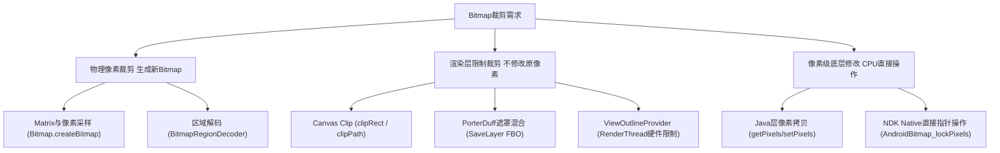

# 5.1.6.1.2 Bitmap裁剪

在 Android 图像处理与界面开发中，Bitmap 裁剪是一项极为核心且频繁使用的技术。无论是社交应用中的圆形异形头像、数据图表的切块渲染，还是屏幕截图的局部裁切，都离不开对图像像素的截取与处理。然而，Bitmap 极其消耗内存，若裁剪机制选择不当或底层原理理解不够透彻，极易导致应用出现严重的卡顿（Jank）、过度绘制（Overdraw）甚至内存溢出（OOM）崩溃。

本文将从底层逻辑出发，系统阐述 Android 中 Bitmap 裁剪的物理本质与常见应用场景，深入剖析三种核心裁剪机制（Matrix 像素采样、Canvas 渲染层限制、CPU 像素级修改）的运作原理与底层源码实现，并结合 Android 硬件加速机制提供详尽的性能优化与避坑指南。

---

## 1. 核心概念与应用场景

### 1.1 Bitmap 裁剪的本质
在 Android 系统中，一个 `Bitmap` 对象在逻辑上是一个由像素点组成的二维矩阵。每一个像素点根据其色彩模式（如 `ARGB_8888`、`RGB_565`、`RGBA_F16`）占用不同的字节数。Bitmap 裁剪的本质就是**在特定的空间坐标系下，根据特定的几何边界，从源像素矩阵中筛选、提取或映射出一个子像素矩阵，并将其封装为可供渲染或保存的新图像数据**。

根据裁剪是否改变了底层的像素数组，Android 中的裁剪可以分为两大类：
- **物理裁剪**：在内存中创建了一个新的 `Bitmap` 对象，并分配了独立的像素存储空间（或在特定条件下共享底层 `PixelRef` 内存），裁剪后的图像可以脱离原图独立存在、修改或落盘保存。
- **渲染层裁剪**：并不修改或拷贝原 `Bitmap` 的任何像素数据，而是在 Canvas 绘制图像时，通过修改几何裁剪栈（Clip Stack）或 GPU 的测试状态，限制像素输出到屏幕 Framebuffer 的可见区域。

### 1.2 常见应用场景深度解析
- **异形头像与复杂遮罩**：例如社交 App 中的圆形、圆角矩形、多边形或任意不规则矢量路径（Path）的头像。此类裁剪通常需要在保持高性能的前提下，实现平滑的抗锯齿边缘。
- **图表切块与瓦片地图（Tile Rendering）**：在展示超大图表或高精度地图（如瓦片式地图）时，系统不可能一次性将整张大图加载并渲染，而是需要根据当前视口（Viewport）的坐标，动态裁剪出对应区域的像素块进行局部更新，从而节省内存与 GPU 带宽。
- **View 局部截图与长图拼接**：例如将当前界面的某一个特定子 View（如商品卡片）生成分享海报。这需要获取 View 的绘图缓冲（Drawing Cache）或通过 `PixelCopy` 捕获其所在 Window 的像素，并裁剪掉不相关的状态栏、导航栏或父布局边缘，最后进行拼接。

---

## 2. 三种核心裁剪机制与底层原理

为了应对不同的业务需求和性能约束，Android 提供了三种完全不同的裁剪实现路径。下面我们将从底层原理、源码行为和内存开销三个维度对它们进行深度剖析。



### 2.1 机制一：Matrix 与像素采样裁剪（物理裁剪）

使用 `Bitmap.createBitmap(Bitmap source, int x, int y, int width, int height, Matrix m, boolean filter)` 是最通用的物理裁剪方式。它不仅能截取子区域，还能在裁剪的同时应用复杂的几何变换。

#### 2.1.1 Matrix 内部机制与几何变换
`Matrix` 在底层是一个 3x3 的仿射变换矩阵，其在齐次坐标系下的数学表达如下：

$$
\begin{bmatrix}
x' \\
y' \\
1
\end{bmatrix}
=
\begin{bmatrix}
MSCALE\_X & MSKEW\_X & MTRANS\_X \\
MSKEW\_Y & MSCALE\_Y & MTRANS\_Y \\
MPERSP\_0 & MPERSP\_1 & MPERSP\_2
\end{bmatrix}
\times
\begin{bmatrix}
x \\
y \\
1
\end{bmatrix}
$$

其中：
- `MTRANS_X` 和 `MTRANS_Y` 控制平移（Translate）。
- `MSCALE_X` 和 `MSCALE_Y` 控制缩放（Scale）。
- `MSKEW_X` 和 `MSKEW_Y` 控制错切（Skew）。
- 旋转（Rotate）则是缩放与错切的三角函数组合。

当我们在 `createBitmap` 中传入一个包含缩放、旋转或错切的 Matrix 时，Android 底层的 Skia 图形库会执行以下步骤：
1. **实例化新图形容器**：Android 会在 Java 层实例化一个全新的 `Bitmap` 对象，并在 C++ 层通过 `SkBitmap` 分配相应的物理内存。
2. **边界计算**：将源 Bitmap 的裁剪区域（由 `x, y, width, height` 定义的矩形）的四个顶点通过 Matrix 矩阵相乘，计算出变换后的最小外接矩形（Bounding Box），作为新 Bitmap 的物理尺寸。
3. **建立 Skia Canvas**：构造一个 `SkCanvas` 指向新创建的像素内存缓冲区。随后通过 `SkPaint` 设置采样模式，并调用 `SkCanvas::drawBitmapRect`，将源 `SkBitmap` 绘制到新画布上。在这个过程中，`SkMatrix` 被应用为当前画布的变换矩阵，图形学引擎在像素着色（Pixel Shading） or 纹理采样（Texture Sampling）阶段通过逆向坐标映射进行取样。即遍历新 Bitmap 的每个像素坐标 $(x', y')$，通过 Matrix 的逆矩阵（Inverse Matrix）反向寻找其在源 Bitmap 中对应的原始坐标 $(x, y)$，并读取该处的像素色值填入新 Bitmap 中。

#### 2.1.2 像素采样与插值算法
当反向映射计算出的原始坐标 $(x, y)$ 不是整数时，就需要通过插值算法来决定该点的最终颜色。参数 `filter` 直接决定了选择哪种插值算法：
- **最近邻插值（Nearest Neighbor Interpolation）**（`filter = false`）：
  - **原理**：直接取距离该非整数坐标最近的那个整数像素点的颜色值。
  - **公式**：$f(x, y) = g(\lfloor x + 0.5 \rfloor, \lfloor y + 0.5 \rfloor)$。
  - **特点**：计算极其简单，仅需一次内存寻址，速度极快。但是在图像放大或旋转时，会导致严重的锯齿（Aliasing）和马赛克现象，边缘过渡非常生硬，影响视觉观感。
- **双线性插值（Bilinear Interpolation）**（`filter = true`）：
  - **原理**：寻找非整数坐标周围最近的 4 个整数像素点，根据距离远近进行双向线性加权平均。
  - **数学公式**：设待求点为 $(x, y)$，其周围四个整数点为 $Q_{11}(i, j)$、$Q_{12}(i, j+1)$、$Q_{21}(i+1, j)$、$Q_{22}(i+1, j+1)$，其中 $u = x - i$，$v = y - j$。双线性插值的计算公式为：
    $$f(x, y) = (1-u)(1-v)f(i, j) + u(1-v)f(i+1, j) + (1-u)vf(i, j+1) + uvf(i+1, j+1)$$
  - **特点**：通过平滑过滤消除了大部分锯齿，边缘过渡自然，适合需要缩放或旋转后的图片裁剪。但其计算量是最近邻插值的数倍，且需要同时读取四个通道的色彩进行乘加计算，在超大图裁剪时会带来明显的 CPU 性能开销。

#### 2.1.3 内存共享与写时拷贝（Copy-on-Write）
在 `Bitmap.createBitmap` 的源码实现中，存在一个非常关键的内存优化机制：
- **共享内存条件**：如果传入的 Matrix `m` 为空（或仅包含平移变换 `Identity Matrix`），并且裁剪的区域恰好是原图的完整区域（即 `x = 0, y = 0, width = source.getWidth(), height = source.getHeight()`），Android 不会为新 Bitmap 分配任何新的像素内存。相反，它会直接让新 Bitmap 共享源 Bitmap 在 Native 堆中的像素指针（`SkPixelRef`）。
- **非共享内存分配**：只要裁剪区域是局部子块，或者 Matrix 中包含了缩放、旋转等非平凡变换，Skia 就会调用 `Canvas` 绘制，在内存中重新分配一块大小为 $Width \times Height \times BytesPerPixel$ 的物理空间，进行像素拷贝与重采样。
- **潜在风险**：对于共享底层像素的 Bitmap，如果调用了 `recycle()` 释放其中一个，可能会导致另一个 Bitmap 在后续绘制时抛出 `Canvas: trying to use a recycled bitmap` 异常。

---

### 2.2 机制二：Canvas 的 Clip 裁剪与 PorterDuff 遮罩（渲染层限制）

与物理裁剪不同，Canvas 限制裁剪是目前 UI 实时渲染中最主流的手段。它通过控制 GPU 的绘制视口和片元丢弃规则，达到异形呈现的目的。

#### 2.2.1 Canvas Clip 机制的底层逻辑
当我们调用 `canvas.clipRect(Rect)` 或 `canvas.clipPath(Path)` 时，原 Bitmap 在内存中的像素数据没有发生任何改变。其底层原理是通过设置 Canvas 的渲染状态栈（Clip Stack），在 GPU 绘制流水线中对绘制区域进行硬件级的几何过滤。
- **硬件加速录制过程**：
  在开启硬件加速时，Java 层的 `Canvas` 实际上是 `RecordingCanvas`。调用 `clipRect` 或 `clipPath` 不会立即触发任何绘制动作，而是向一个称为 `RenderNode` 的结构中写入一条 `ClipRectOp` 或 `ClipPathOp` 渲染指令。当绘制帧到达时，`RenderThread`（渲染线程）会遍历整个 View 树的 `RenderNode` 节点，将其翻译为具体的绘制指令列表并发送给底层的 `HWUI` 渲染器。
- **GPU 渲染执行阶段**：
  - **clipRect**：底层直接映射为 GPU 的**剪切测试（Scissor Test）**。Scissor Test 是 OpenGL/Vulkan 管线中非常靠前的固定管线阶段。GPU 直接在视口空间中定义一个矩形框，任何落在这个框外的像素片元（Fragment）都会在光栅化阶段被直接丢弃，不执行后续的片元着色器计算。因此，`clipRect` 的执行效率极高，几乎没有额外开销。
  - **clipPath**：由于 Path 可以是任意复杂的非矩形几何体，Scissor Test 无法支持。此时 GPU 通常需要启用**模板测试（Stencil Test）**或生成一张临时的**软件栅格化遮罩（A8 Mask）**。硬件渲染器会首先通过 CPU 进行三角剖分（Tessellation）生成多边形网格，或者使用 `Skia` 将其栅格化为一个 8 位的 Alpha 遮罩（A8 Mask）缓存在 GPU 中，再通过片元着色器采样此遮罩进行透明度剪裁。这个过程叫着色器遮罩路径绘制（Shader Mask Path Rendering）。一旦 Path 动态改变，这个 Mask 纹理缓存就会失效，导致 GPU 每帧都要重新生成 Mask 并上传，这便是卡顿的根本原因。

#### 2.2.2 PorterDuff 遮罩与不规则裁剪
当我们需要裁剪高精度的圆角、五角星或任意自定义矢量图形时，单纯使用 `clipPath` 往往会因为抗锯齿效果差（模板测试的边缘是二值的，不进行半透明平滑）而影响视觉质量。此时，通常使用 `PorterDuff.Mode`（主要是 `SRC_IN` 或 `DST_IN`）配合遮罩（Mask）图层来实现。

`PorterDuff.Mode.SRC_IN` 的数学混合公式如下：

$$
\begin{aligned}
C_{out} &= C_{src} \times A_{dst} \\
A_{out} &= A_{src} \times A_{dst}
\end{aligned}
$$

其中：
- `src` 表示源图（要裁剪的 Bitmap）。
- `dst` 表示目标图（遮罩 Mask 图层，其几何边缘带有平滑的 Alpha 渐变通道）。
- 混合结果的 Alpha 通道 $A_{out}$ 是源图与目标图 Alpha 通道的乘积。这意味着：当 Mask 中某个像素的 Alpha 为 1.0 时，源图对应的像素以 100% 透明度完整呈现；当 Mask 中像素 Alpha 为 0 时，该处完全透明；在边缘处（如 0.0 到 1.0 之间的半透明过渡区），像素值被等比例衰减，从而实现了完美的抗锯齿裁剪。

#### 2.2.3 离屏缓冲 SaveLayer 的代价
在实现 PorterDuff 混合裁剪时，必须通过 `canvas.saveLayer()` 显式开启离屏缓冲（Offscreen Buffer）。如果直接在默认的 Canvas 上进行混合绘制，会产生意想不到的透出 Bug：
- **原因**：没有 `saveLayer` 时，Canvas 上的混合操作会直接与当前 Window 已有的背景色（例如 Activity 的白色背景）进行物理计算。此时，背景色会作为 `DST` 参与到 `SRC_IN` 的公式中，导致背景色区域直接将图片裁剪掉，或者图片边缘混入了背景色的杂质。
- **saveLayer 的硬件原理**：调用 `saveLayer` 后，Skia 会在显存中创建一个全新的帧缓冲对象（FBO，Frame Buffer Object）以及关联的临时纹理（Render Texture）。后续所有的绘制都会重定向输出到这块纯清空的、全透明的离屏缓冲上。绘制完成后，再将这块临时纹理与底层的真正 framebuffer 进行一次纹理贴图混合（Blit），最后销毁临时 FBO。
- **性能开销痛点**：
  1. **上下文切换开销**：GPU 必须清空当前的渲染管道（Pipeline Flush），将渲染状态切换到临时 FBO，绘制完毕后再切换回来。这会造成严重的指令等待延迟。
  2. **显存与带宽消耗**：离屏缓冲需要额外分配显存。在 Blit 阶段，像素数据需要从临时纹理读出并写入到主屏幕缓冲区，双倍的内存读写带宽极易引发 GPU 降频或帧率抖动。

---

### 2.3 机制三：像素级 CPU 裁剪（算法物理裁剪）

在进行图像滤镜开发、计算机视觉处理（如二维码定位、人脸区域提取）时，我们需要对 Bitmap 进行像素级的精确读取与裁剪。

#### 2.3.1 getPixels 与 setPixels 机制
通过 Java 层的 API，我们可以直接将 Bitmap 的像素数据流式提取到一个整型数组中进行操作：
```java
int[] pixels = new int[width * height];
bitmap.getPixels(pixels, offset, stride, x, y, width, height);
```

在这里，必须深刻理解 **`stride`（步长 / 跨距）** 的含义：
- **定义**：`stride` 表示在目标 `pixels` 数组中，保存裁剪后图像相邻两行中相同列像素之间的物理索引偏移量。
- **数学关系**：设裁剪图像在第 $r$ 行、第 $c$ 列的像素在数组中的索引为 $Index$，则其公式为：
  $$Index = offset + r \times stride + c$$
- **步长的作用**：如果我们需要在一个超大的一维数组 `pixels` 的特定子区域中直接填入裁剪数据，`stride` 必须大于等于裁剪宽度 `width`。如果 `stride` 设置错误，像素在数组中的排列会发生错位，导致恢复成 Bitmap 时出现严重的图像扭曲、斜切甚至数组越界崩溃。

#### 2.3.2 适用场景与性能局限性
- **适用场景**：
  - 图像非线性扭曲、自定义局部马赛克、边缘检测算子（Canny、Sobel）等 Canvas 无法轻易实现的数学像素变换。
  - 将裁剪后的像素数组直接送入 JNI 层的 OpenCV 库进行特征点提取。
- **性能局限性（为什么极其缓慢？）**：
  1. **JNI 边界拷贝成本**：在 Android 8.0 之后（见 [AndroidVersionChangeLog.md](../../../../../../AndroidVersionChangeLog.md) 关于 OREO 版本的内存管理变更），Bitmap 的像素数据被强制存放在 Native 堆中。调用 `getPixels` 会导致像素数据跨越 JNI 边界，从 Native 内存一次性拷贝到 JVM 堆的 `int[]` 中。执行完毕后，`setPixels` 又需要将数据重新拷贝回 Native 堆，造成双倍的内存搬运延迟。
  2. **GC 压力**：创建巨大的 `int[]` 会在 JVM 堆中瞬间产生大量的临时大对象，频繁触发 ART 的并发垃圾回收，引发垃圾回收带来的线程暂停（GC Pause）。
  3. **CPU 串行计算**：Java 层的 `for` 循环完全由 CPU 单线程串行执行，无法利用 GPU 的并行计算能力，处理一张 1080P 图片 of 裁剪和像素处理耗时通常在几十毫秒以上，完全无法满足 60fps（16.6ms）或 90fps（11.1ms）的流畅绘制要求。

*注：若必须进行像素级 CPU 裁剪，应使用 NDK 提供的 `<android/bitmap.h>` 库，通过 `AndroidBitmap_lockPixels(Env, bitmap, &addr)` 直接锁定 Native 像素指针进行原地修改，规避 JVM 内存拷贝，或者使用 OpenGL ES Render 写入 FBO。*

---

## 3. 常见误区与避坑指南

### 3.1 避坑一：大图裁剪未做亚采样导致 createBitmap OOM

当用户从相册选择一张超高分辨率的照片（例如 4800 万像素的相机照片，分辨率约为 $8000 \times 6000$，在内存中以 `ARGB_8888` 格式展开会占用高达 180MB 的 Native 内存）时，若直接使用 `Bitmap.createBitmap` 进行物理裁剪，极易发生 OOM 崩溃。

#### 3.1.1 崩溃防范方案：双重优化策略
1. **基于 `inSampleSize` 的前置解码缩放**：
   在首次加载大图时，绝不能将整图加载进内存。应利用 `BitmapFactory.Options`仅解码边界，计算出合理的采样率后再加载。
   ```java
   BitmapFactory.Options options = new BitmapFactory.Options();
   options.inJustDecodeBounds = true;
   BitmapFactory.decodeFile(filePath, options);
   // 根据裁剪框的目标尺寸计算 inSampleSize
   options.inSampleSize = calculateInSampleSize(options, targetWidth, targetHeight);
   options.inJustDecodeBounds = false;
   Bitmap source = BitmapFactory.decodeFile(filePath, options);
   ```
2. **利用 `BitmapRegionDecoder` 实现局部分区解码（终极方案）**：
   如果裁剪区域占原图的比例极小，甚至不需要加载原图的其他部分，应该使用 `BitmapRegionDecoder`。
   - **底层机制**：Skia 的 `SkImageDecoder` 或 `SkCodec` 支持渐进式解码。它不会解析全部的压缩数据块（如 JPEG 的 MCU 块），而是利用 JPEG 的 DCT 变换特征或者 PNG 的 IDAT 数据块指针定位，跳过不相干的数据段，仅读取和解码目标矩形框内的像素数据。
   - **效果**：这不仅节省了内存空间，还由于大幅减少了文件读取和 Huffman 解码的运算量，使加载时间缩短了数倍，内存开销直接与裁剪尺寸挂钩，彻底防范 OOM。
   ```java
   // 创建区域解码器
   BitmapRegionDecoder decoder = BitmapRegionDecoder.newInstance(inputStream, false);
   Rect rect = new Rect(x, y, x + width, y + height);
   BitmapFactory.Options options = new BitmapFactory.Options();
   options.inPreferredConfig = Bitmap.Config.ARGB_8888;
   // 仅解码指定的 rect 区域像素
   Bitmap croppedBitmap = decoder.decodeRegion(rect, options);
   ```

### 3.2 避坑二：在 onDraw 中频繁创建 Path/ClipPath 导致硬件加速失效与卡顿

自定义 View 绘制时，在 `onDraw(Canvas canvas)` 中执行不规则裁剪是初学者最容易犯的性能错误。

```java
// 错误示范！绝对禁止在 onDraw 中执行此类操作
@Override
protected void onDraw(Canvas canvas) {
    Path path = new Path(); // 频繁触发内存分配与GC
    path.addCircle(getWidth()/2, getHeight()/2, mRadius, Path.Direction.CW);
    canvas.clipPath(path); // 导致严重的硬件加速渲染管线重构
    canvas.drawBitmap(mBitmap, 0, 0, mPaint);
}
```

#### 3.2.1 性能损耗深度分析
1. **垃圾回收（GC）抖动**：`onDraw` 在屏幕刷新时每秒被调用 60 到 120 次。每次都 `new Path()` 会迅速占满 JVM 堆的年轻代，导致系统频繁进行局部垃圾收集，UI 出现微卡顿。
2. **硬件渲染管线性能悬崖（Performance Cliff）**：
   在 Android 3.0 (API 11) 引入硬件加速后，Canvas 的绘制指令会被录制到显示列表（DisplayList）中，随后由 `RenderThread` 提交给 GPU。当在 `onDraw` 中使用 `canvas.clipPath(path)`时，因为 Path 的几何形状在每帧都可能发生变化，GPU 无法提前对其进行网格化（Tessellation）缓存。硬件渲染器不得不退化到**软件绘制路径**（通过 CPU 将 Path 栅格化为一张位图 Mask，上传给显存作为纹理，然后再进行混合），或者在 GPU 侧频繁重建模板缓存（Stencil Cache）。这会导致原本流畅的硬件绘制管线出现严重的停顿。

#### 3.2.2 优化手段
- **对象复用与重置**：将 `Path` 声明为类成员变量，并在初始化或大小改变（`onSizeChanged`）时计算好形状。如果需要动态修改，使用 `path.rewind()` 或 `path.reset()` 重新组装，避免内存分配。
- **避免使用 clipPath 进行高频异形裁剪**：对于静态的圆角、圆形等图形，优先选用下文介绍的 `ViewOutlineProvider` 或利用带有圆角的自定义 Shader（`BitmapShader`）进行绘制，其性能较 `clipPath` 有数量级的提升。

---

## 4. 最佳实践：基于 ViewOutlineProvider 的极致性能裁剪

从 Android 5.0 (API 21) 开始，Android 引入了全新的 `ViewOutlineProvider` 机制。这是目前在 UI 层面对 View 及其内容进行圆角、圆形或特定多角矩形裁剪时**最推荐、性能最高**的方案。

### 4.1 机制解析与实现
```java
// 1. 设置 View 的轮廓提供者
view.setOutlineProvider(new ViewOutlineProvider() {
    @Override
    public void getOutline(View view, Outline outline) {
        // 定义一个圆角矩形的轮廓，支持传入边界和圆角半径
        outline.setRoundRect(0, 0, view.getWidth(), view.getHeight(), mCornerRadius);
    }
});
// 2. 开启裁剪开关
view.setClipToOutline(true);
```

### 4.2 为什么 Outline 裁剪性能极其优异？

#### 4.2.1 零离屏缓冲（No Offscreen Buffer）
与 PorterDuff 混合模式和传统的 `saveLayer` 机制不同，`ViewOutlineProvider` 的裁剪是在硬件渲染层级（RenderNode）由 `RenderThread` 直接实现的。
在绘制该 View 时，GPU 不需要开辟任何临时的 FBO 显存空间。`RenderNode` 自 Android 5.0 起就引入了 `Outline` 属性。这个 Outline 被直接储存在 `RenderNode` 的属性结构中。在 `RenderThread` 渲染 View 时，它会调用 OpenGL 的混合命令或者 Vulkan 的剪裁命令。如果是矩形或圆角矩形，在主流的 GPU 硬件上，渲染管线可以利用“硬件裁剪矩形”结合“圆角片元着色器”在光栅化阶段对每个像素片元进行距离场（Distance Field）计算，不满足圆角边界内的像素直接丢弃。这样既实现了抗锯齿的圆角效果，又完全避免了开辟显存离屏缓冲区的内存和带宽消耗，没有任何上下文切换的开销。

#### 4.2.2 硬件级阴影计算（Hardware Shadows）
Outline 的另一个独特优势是支持 3D 空间阴影。在 Android 5.0+ 中，阴影是通过 View 的 `translationZ` 或 `elevation` 属性，结合光源位置，由 GPU 的顶点着色器实时计算拉伸顶点生成的物理阴影。
- **Canvas 裁剪的痛点**：通过 `canvas.clipPath` 剪裁出的 View，其四周的物理阴影依然会呈现出原始矩形框的轮廓，非常违和。
- **Outline 的优势**：系统能够识别 `Outline` 定义的圆角或圆形轮廓，并以此几何边界为投影面，生成完美贴合异形边缘的 3D 阴影，如下图所示：

```
视图与阴影渲染层次：
[ 物理光源 (Virtual Light) ]
      \
       \ (光线投射)
        v
  [ View (带 Outline 裁剪边界) ]  <-- 硬件直接进行边缘裁剪
   |    |
   |    | (三维阴影计算)
   v    v
[ 投影平面 (下层视图或Activity背景) ] <-- 生成完美贴合 Outline 边缘的阴影贴图
```

### 4.3 ViewOutlineProvider 的局限性
尽管性能优异，但 Outline 裁剪并非万能，开发者在使用时必须注意其能力边界：
- **形状限制**：目前 `Outline` 仅支持矩形、圆角矩形和圆形（通过 `setRoundRect()`, `setOval()`）。
- **不支持任意 Path 裁剪**：虽然 Outline 提供了 `setConvexPath(Path)` 方法允许设置凸多边形 Path，但在 Android 系统源码中，**不支持对非矩形/非圆形/非圆角矩形的复杂 Path 开启 `setClipToOutline(true)`**。如果强行开启，在某些版本上会失效，或者在运行时直接抛出不支持的异常。因此，对于五角星、云朵、不规则涂鸦等异形裁剪，仍必须退回到 `PorterDuffShader` 或 `clipPath` 方案。

---

## 5. 三种裁剪方案全方位对比

在进行架构设计或技术选型时，应根据具体的维度要求，合理选择裁剪方案：

| 维度 / 指标 | Matrix 像素采样裁剪 (`createBitmap`) | Canvas Clip 与 PorterDuff 混合 | 像素级 CPU 裁剪 (`getPixels`) | ViewOutlineProvider (Outline) |
| :--- | :--- | :--- | :--- | :--- |
| **内存占用** | 较高（需分配裁剪后新 Bitmap 空间，除了极少数共享内存场景） | 极低（不分配像素内存，仅可能占用极小临时帧缓冲显存） | 极高（JVM中需开辟大整型数组，且产生大量GC碎片） | 零额外开销（直接作用于现有渲染节点属性） |
| **CPU 负载** | 中等（在创建阶段进行一次性采样计算，绘制阶段无消耗） | 低（绘制时由GPU承载，若无频繁 saveLayer 几乎不占用CPU） | 极高（由CPU进行多重循环串行处理，极易导致主线程卡顿） | 极低（RenderThread 瞬间录制，无 CPU 瓶颈） |
| **GPU 负载** | 低（仅进行常规纹理贴图绘制） | 中到高（若使用复杂 Path 或 saveLayer，会导致 FBO 频繁切换） | 低（GPU 仅负责最终渲染） | 极低（GPU 在管线中硬件级光栅化阶段处理） |
| **抗锯齿效果**| 优秀（开启双线性过滤 `filter=true` 时边缘平滑） | 极佳（使用 PorterDuff 配合 Alpha 通道遮罩时边缘完美过渡） | 取决于自定义插值算法（若无算法处理会有严重锯齿） | 极佳（由硬件直接进行多重采样抗锯齿 MSAA 过滤） |
| **异形支持度**| 仅支持矩形及常规矩阵变换 | 完美支持（支持任意矢量 Path 路径与任意 Mask 混合） | 完美支持（支持任意数学几何映射） | 仅支持矩形、圆角矩形和圆形 |
| **适用场景** | 适用于需要将裁剪后的图片**保存、网络传输或持久化**的场景。 | 适用于界面**交互渲染、动态异形头像、复杂的实时图形特效**。 | 适用于**图像滤镜开发、二维码扫描定位、计算机视觉局部特征分析**。 | 适用于 Android 5.0+ 下**常规 View 组件、图片容器的圆角和圆形化裁剪**。 |

---

## 6. 版本变更与兼容性说明

在 Android 版本的演进中，针对图形系统 and 内存管理的改变直接影响了 Bitmap 裁剪的实现方式与稳定性。以下是关键的版本变更节点说明，具体版本日志记录可参见根目录的 [AndroidVersionChangeLog.md](../../../../../../AndroidVersionChangeLog.md)。

- **Android 3.0 (API 11) - 开启硬件加速**：
  - 开始支持硬件加速，但早期的 OpenGL ES 渲染器对 `canvas.clipPath(path)` 等部分几何 Clip 行为支持不全，强行使用会导致抛出不支持的操作异常，或被迫在 Manifest 中将该 View 的渲染模式改为 `software`。
- **Android 4.4 (API 19) - 硬件加速鲁棒性增强**：
  - 底层渲染器全面支持复杂的 Path 剪裁。但频繁剪裁仍会带来软件栅格化瓶颈。
- **Android 5.0 (API 21) - Outline 时代到来**：
  - 引入了 `ViewOutlineProvider` 和 `Outline`。View 正式获得了基于底层硬件渲染器的非破坏性高效裁剪能力，完美支持实时 3D 阴影。
- **Android 8.0 (API 26) - 像素内存迁移（Oreo 变革）**：
  - 改变了自 Android 3.0 以来将 Bitmap 像素字节数组存储在 Java 堆的机制，重新将像素分配在 **Native 堆**中。这一重大改变使得大图裁剪和 `getPixels` 操作时的 JNI 边界跨越耗时显著增加。但同时，极大地缓解了 JVM 的内存压力，OOM 崩溃的监测和调试手段也从 Java 堆 Dump 转为了 Native 内存分析。
- **Android 10.0 (API 29) 及以上 - RenderScript 废弃与硬加速收敛**：
  - Android 10+ 废弃了原用于 CPU/GPU 异构像素处理的 `RenderScript`，官方推荐对于像素级的裁剪与滤镜全面转向 `NDK Vulkan` / `OpenGL Compute Shader` 或是通过 `AndroidBitmap_lockPixels` 实现零拷贝 Native 级物理处理。

通过合理地在不同版本上组合使用 `ViewOutlineProvider` 进行实时渲染裁剪，使用 `BitmapRegionDecoder` 进行大图物理裁切防 OOM，并在必须进行像素操作时通过 NDK 优化，开发者可以在 Android 应用中构建出既视觉精美又运行丝滑的图像裁剪体验。
