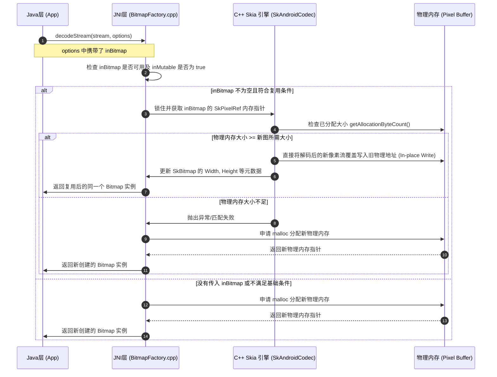
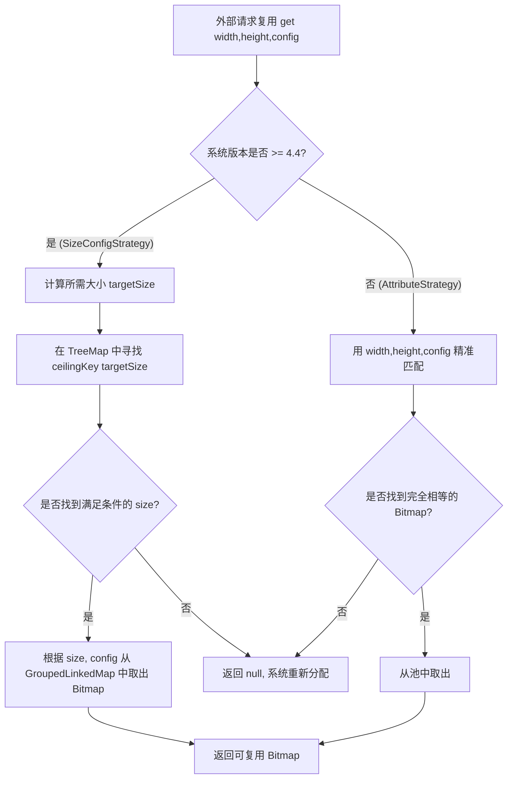

# 5.1.6.1.3 Bitmap复用

在 Android 系统的性能优化与内存控制中，图片（Bitmap）的内存管理始终是重中之重。在绝大多数包含丰富图文信息的应用中，Bitmap 往往占据了堆内存的 70% 以上，是导致内存溢出（OOM, Out Of Memory）的头号推手。在传统的图片加载流程中，每当需要展示一张新图片时，系统都会通过解码器在内存中分配一块全新的像素区域；当图片不再被使用时，再由垃圾回收器（GC）或是手动释放将其回收。这种“即用即建，不用即毁”的粗暴模式在实际应用中（如快速滑动的列表）会带来严重的副作用。

为了解决这一核心痛点，Android 从 3.0 版本开始引入了 **Bitmap 内存复用（Bitmap Reuse）** 机制。本文将围绕 Bitmap 内存复用的定义、底层实现机理、Android 版本演进（尤其是 3.0 与 4.4 差异），以及以 Glide `LruBitmapPool` 为代表的工程化实践进行系统阐述，并结合常见误区与避坑指南进行深入分析。

---

## 1. 核心概念：什么是 Bitmap 内存复用

在深入理解复用机制前，必须厘清 Bitmap 在底层的对象结构。在 Android 系统的设计中，一个 `Bitmap` 对象实际上由两部分组成：
1. **Java 层面的 `android.graphics.Bitmap` 对象**：这只是一个轻量级的 Java 外壳，主要保存了图片的属性元数据，例如像素宽度（Width）、高度（Height）、色彩通道配置（`Bitmap.Config`，如 `ARGB_8888`）、是否可变（Mutable）等。
2. **Native 层的物理像素缓冲区（Pixel Buffer）**：用于存储图片每个像素的具体颜色数值。这块区域是图片内存占用的主体（例如，一张 $1080 \times 1920$ 的 `ARGB_8888` 图片，在内存中需要占用 $1080 \times 1920 \times 4 \text{ bytes} \approx 8.29 \text{ MB}$ 的物理空间）。

### 1.1 Bitmap 内存复用的定义
Bitmap 内存复用，其本质是**复用已分配内存的 Native 物理像素缓冲区**，而非仅仅是复用 Java 层面的 Bitmap 壳对象。

当我们在解码一张新图片时，如果能提供一个已经废弃但依然存活的旧 Bitmap，系统在解码时会直接将新图片的像素流写入到这个旧 Bitmap 占有的物理像素缓冲区指针（PixelRef）对应的内存地址中。整个解码过程完全省去了底层的物理内存分配（`malloc` 或类似系统调用）和后续的物理内存回收（`free`），使堆内存的波动曲线变得平滑。

### 1.2 内存复用与常规对象复用的区别
常规的对象复用（例如 `Message.obtain()` 或各种自定义的 Java 对象池）主要针对的是 Java 虚拟机（JVM/ART）堆中的小对象，目的在于减少 Java 对象的创建，从而降低 GC 标记和清除阶段的 CPU 耗时。

然而，Bitmap 内存复用有着根本的不同：
- **目标不同**：它不仅复用 Java 层面的小对象，更核心的目标是重用底层的、巨大的 Native 物理内存块（Pixel Buffer）。
- **开销不同**：由于物理内存块的分配涉及操作系统底层的虚拟内存映射、物理内存页分配等繁琐过程，其开销远远大于普通 Java 对象的创建。因此，Bitmap 内存复用所带来的性能收益（避免卡顿、防止内存抖动）是指数级的。

---

## 2. 复用底层机理与 Android 版本演进

为了满足不同 Android 系统版本的开发需求，我们需要深入了解 Bitmap 内存复用规则的演进。关于内存存放位置的更多演变细节，可参考 [AndroidVersionChangeLog.md](../../../../../AndroidVersionChangeLog.md)。

- **Android 2.3 及以前**：Bitmap 的像素数据存放在 Native 内存中。虽然不占用 Java 堆，但是释放时机不可控，极易导致 OOM。
- **Android 3.0 到 Android 7.0**：像素数据被挪到了 Java 堆中。这使像素内存可以跟随 JVM 垃圾回收机制自动回收，但同时也给 Java 堆带来了极大的 GC 压力。
- **Android 8.0 及以后**：像素数据重新回到了 Native 内存（通过 `SharedMemory` / `GraphicBuffer` 相关的机制），并通过 `Cleaner` 机制由 Java 对象垃圾回收时联动释放 Native 内存。

在 Android 3.0 中，`BitmapFactory.Options` 引入了 `inBitmap` 属性。如果设置了此属性，解码方法在加载内容时会尝试重用此 Bitmap。然而，在不同的 Android 版本中，这一机制的物理匹配约束大相径庭。

### 2.1 Android 3.0 至 4.4 之前的物理复用规则
在 Android 3.0 (API 11) 到 Android 4.3 (API 18) 之间，`inBitmap` 的匹配规则极其严格：
1. **尺寸必须完全一致**：被复用的旧 Bitmap 尺寸（Width 和 Height）必须与即将解码的新图片**完全一致**。
2. **缩放系数必须为 1**：即 `inSampleSize` 必须为 1，不支持在解码的同时进行缩放复用。
3. **色彩配置必须相同**：例如，被复用的 Bitmap配置是 `ARGB_8888`，新解码的图片也必须要求 `ARGB_8888`。
4. **必须是可变的（Mutable）**：即 `inMutable` 属性必须在创建该 Bitmap 时设置为 `true`。

这种“物理像素级别完全对齐”的约束限制了其在实际场景中的应用。在面对千变万化的网络图片尺寸时，几乎无法做到“精准匹配”，这使得早期的 Bitmap 复用技术实用性大打折扣。

### 2.2 Android 4.4 之后的优化规则
从 Android 4.4 (API 19) 开始，系统对 `inBitmap` 的匹配逻辑进行了重大改进，引入了 `getAllocationByteCount()` API。新的匹配规则极大放宽了限制：
- **内存大小大于等于即可**：只要被复用的旧 Bitmap 占用的物理内存字节数（可通过 `bitmap.getAllocationByteCount()` 获取）**大于等于**即将解码的新图片所需的内存大小即可进行复用。
- **支持缩放（inSampleSize > 1）**：允许在缩放解码时进行内存复用。
- **支持不同的配置**：甚至可以在不同的 Config 之间进行复用（例如用 `ARGB_8888` 的 Bitmap 内存复用给 `RGB_565` 解码新图片），只要最终所需总字节数不超过旧 Bitmap 的分配字节数。

> [!NOTE]
> 在复用发生后，新解码得到的 Bitmap 对象的 `getWidth()` 和 `getHeight()` 会如实反映新图片的实际尺寸，但其 `getAllocationByteCount()` 依然保留被复用旧 Bitmap 的原始物理内存分配大小。而其 `getByteCount()` 则返回新图片实际像素所占用的字节数。这就解释了为什么在 Android 4.4+ 中，一个 Bitmap 的 `getAllocationByteCount()` 可能会大于 `getByteCount()`。

### 2.3 底层 C++ Skia 引擎的覆盖原理
为什么通过 `inBitmap` 可以省去 `malloc` 分配？这需要从 Android 底层的 2D 图形渲染引擎 Skia 及其 JNI 调用链进行深入剖析。

在 Java 层调用 `BitmapFactory.decodeStream()` 等方法时，会通过 JNI 调用进入 Native 层的 `BitmapFactory.cpp`。其核心解码函数的内部流程如下：
1. **解析 `Options` 参数**：Native 层获取 Java 传入的 `options` 对象，并读取 `inBitmap` 的指针。
2. **提取底层的像素指针（PixelRef）**：如果 `inBitmap` 不为空，Native 代码会通过 JNI 获取 Java 中 Bitmap 对象对应的 C++ `SkBitmap` 实例，并进一步获取其内部持有的 `SkPixelRef`（指向物理像素缓冲区的指针）。
3. **大小与状态校验**：
   - 检查该 Bitmap 是否为 Mutable（可变，即被复用 Bitmap 的 `inMutable = true` 属性如何标记底层内存为可变）。
   - 检查其底层的物理内存空间是否大于等于即将解码的新图像所需的大小。
4. **就地覆盖（In-place Write）**：
   - 如果校验通过，Skia 引擎将**不会**向系统请求分配新的物理内存（跳过 `malloc` 或 `jemalloc` 调用）。
   - Skia 会将 `SkPixelRef` 锁住，锁定当前内存地址，并让相应的解码器（如 JPEG、PNG、WebP 解码器）在解码的同时，直接把像素的色彩数据写入到这块已分配的内存中。
   - 写入完成后，Native 层会更新该 `SkBitmap` 对象的元数据（如宽度、高度、RowBytes 等），从而实现“用新图片覆盖旧图片”的目的。

以下用 Mermaid 序列图展示其底层调用与覆盖匹配逻辑：



---

## 3. 大厂工程实践：LruBitmapPool 的设计与实现

在实际工程项目中，开发者不可能手动去管理一大堆 Bitmap 的复用逻辑。因为图片解码是随机发生的，尺寸、色彩配置也各不相同。如果不依靠自动化的缓存池，代码中将会充斥着大量的边界判断 and 内存计算。这就需要引入以 Glide 的 `LruBitmapPool` 为代表的工业级 Bitmap 缓存池。

### 3.1 Glide `BitmapPool` 的工作机制
Glide 定义了 `BitmapPool` 接口，主要包含以下核心 API：
- `void put(Bitmap bitmap)`：当一个 Bitmap 退出显示（如 ImageView 被滑出屏幕）且生命周期结束时，Glide 会尝试将其回收到池中，而非直接销毁。
- `Bitmap get(int width, int height, Bitmap.Config config)`：在解码新图片时，优先向池中申请可复用的 Bitmap。如果池中没有，则返回 `null`，Glide 会在 Native 层重新分配内存。
- `Bitmap getDirty(int width, int height, Bitmap.Config config)`：与 `get` 类似，但它不会在返回前对 Bitmap 进行 `eraseColor(0)` 清零操作。

### 3.2 LRU 双层匹配策略的设计
在 `LruBitmapPool` 内部，Glide 会根据当前的 Android 系统版本，采用不同的匹配策略（`LruPoolStrategy`）：
1. **在 Android 4.4 以下版本**：使用 `AttributeStrategy`。因为 4.4 以下要求复用尺寸必须完全一致，所以它的 Key 设计为 `[width, height, config]`。只有当这三个属性完全一致时，才能成功复用。
2. **在 Android 4.4 及以上版本**：使用 `SizeConfigStrategy`。它的 Key 只关注 `[size, config]`（即物理占用字节数和色彩通道）。这使得只要大小大于等于所需大小，即可成功复用。

### 3.3 `SizeConfigStrategy` 范围匹配算法与数据结构
`SizeConfigStrategy` 是如何实现“寻找大于等于所需 size 的最接近 Bitmap”的？它利用了以下核心数据结构：
- **`GroupedLinkedMap`**：这是一个专为 Pool 优化的双向链表+哈希表结构。与 `LinkedHashMap` 类似，它支持 LRU 淘汰机制。在 `GroupedLinkedMap` 中，Key 为 `SizeConfig`。每个 Key 关联着一个 `List<Bitmap>`，因为可能会有多个大小、配置相同的 Bitmap 缓存在池中。
- **`TreeMap<Integer, Integer>`**：针对每一种 `Bitmap.Config`，Glide 内部都维护了一个 `TreeMap`。TreeMap 的 `Key` 是 Bitmap 的物理字节数（size），`Value` 是该 size 的 Bitmap 在当前缓存池中存在的数量。

**查找算法步骤：**
当 Glide 调用 `get(width, height, config)` 申请 Bitmap 时：
1. **计算所需大小**：计算出目标图片解码所需的字节数 `targetSize`。
2. **范围查找**：在对应 `config` 的 `TreeMap` 中，利用 `TreeMap.ceilingKey(targetSize)` 方法，寻找大于等于 `targetSize` 的最小 key（即最贴近目标大小的可用内存块）。
3. **精准提取**：如果找到了合适的 `actualSize`，就用 `[actualSize, config]` 构建出的 Key，去 `GroupedLinkedMap` 中获取具体的 Bitmap 对象，并从池中移除。
4. **降级与兼容**：如果在当前 Config（如 `ARGB_8888`）下没有找到，Glide 还会尝试通过配置兼容规则（例如用 `ARGB_8888` 去兼容 `RGB_565` 等）进行查找。
5. **重平衡**：由于取出了 Bitmap，需在 `TreeMap` 中将对应 size 的计数减 1。

以下展示 `LruBitmapPool` 匹配与回收的逻辑架构：



### 3.4 `get` 与 `getDirty` 的差异化处理
这是 Glide 中非常体现工程匠心的一个优化点：
- **`get`**：从缓存池取出 Bitmap 后，会调用 `bitmap.eraseColor(0)`。这行代码的目的是将 Bitmap 像素区域全部涂抹为透明的 0（即清零内存）。这样做是为了保证安全性，防止新图在部分解码或者渲染异常时，在屏幕上残留旧图片的视觉残骸。
- **`getDirty`**：直接把取出来的 Bitmap 返回给调用者，跳过 `eraseColor(0)`。因为当 Glide 的解码器通过 Skia 将新图片完全覆盖写入时，新像素会 100% 覆盖旧内存。如果在这种情况下依然先调用 `eraseColor`，无异于对这块内存进行了两次写入操作，这会造成极大的 CPU 与内存带宽浪费。在大图复用时，`getDirty` 能节省数十毫秒的 CPU 耗时，从而显著提升滑动流畅度。

---

## 4. 常见误区与避坑指南

虽然 Bitmap 内存复用能极大地优化性能，但由于其涉及到 Native 内存就地覆盖，一旦使用不当，就会引发非常难排查的 bug 甚至 Native Crash。

### 避坑一：多线程并发读取时复用同一个 inBitmap 导致画面污染与状态冲突
在并发加载图片的场景中，如果没有做好独占管理，很容易把同一个处于缓存池中的 Bitmap 同时分配给两个并行的解码任务（即两个 `options.inBitmap` 引用了同一个对象）。

- **现象**：两张图片解码任务在不同的工作线程中并发运行，Skia 底层会对同一个 `PixelRef` 地址空间进行交叉写入。这会导致最终解码出的图片画面被污染（画面撕裂、出现马赛克般的杂色块），甚至可能因为并发操作 Native 内存指针而触发底层 Segfault（段错误）导致应用直接 Crash。
- **原理剖析**：由于 Skia 解码直接写入同一段内存地址，在缺少同步机制保护的情况下，竞态条件会导致像素流数据交织在一起。即使解码最终成功完成，UI 线程在进行 Canvas 绘制时也会因为数据冲突而出现画面交错污染。
- **排查与解决**：
  - **绝不能**在全局维护一个单例的 Bitmap 用作 `inBitmap`。
  - 必须采用严格的池化管理。从池中获取（`get`）一个 Bitmap 后，该实例必须被标记为独占，直到其被放回池中。
  - 在自定义图片加载框架时，可引入引用计数（Reference Count）来管理其生命周期。

### 避坑二：当复用大小不匹配（如新图所需内存超出了旧图）时，Skia 解码抛出 `IllegalArgumentException`
如果将一个物理内存不足的旧 Bitmap 强行作为 `inBitmap` 传入，在解码时会直接发生崩溃或失败。

- **错误日志**：
  ```
  java.lang.IllegalArgumentException: Problem decoding into existing bitmap
  ```
- **机理分析**：
  Skia 在 Native 层检测到即将解码的新图所需内存大于 `inBitmap.getAllocationByteCount()` 时，为了防止缓冲区溢出（Buffer Overflow）而采取的安全保护机制。
- **计算公式与防御手段**：
  在将 Bitmap 放入 `inBitmap` 之前，必须在 Java 层计算新图解码所需的大小，并确保：
  $$\text{inBitmap.getAllocationByteCount()} \ge \text{targetWidth} \times \text{targetHeight} \times \text{bytesPerPixel}$$
  其中 `targetWidth` 和 `targetHeight` 是考虑了 `inSampleSize` 之后的图片尺寸：
  $$\text{targetWidth} = \left\lceil \frac{\text{originalWidth}}{\text{inSampleSize}} \right\rceil$$
  $$\text{targetHeight} = \left\lceil \frac{\text{originalHeight}}{\text{inSampleSize}} \right\rceil$$
  `bytesPerPixel` 根据 `Bitmap.Config` 决定（`ARGB_8888` 为 4 字节，`RGB_565` 和 `ARGB_4444` 为 2 字节，`ALPHA_8` 为 1 字节，`RGBA_F16` 为 8 字节）。
  
  为了保证安全，在自研框架中可以采用如下的探测写法：
  ```java
  BitmapFactory.Options options = new BitmapFactory.Options();
  // 仅获取尺寸，不分配内存
  options.inJustDecodeBounds = true;
  BitmapFactory.decodeStream(inputStream, null, options);
  
  // 计算最终尺寸
  int targetWidth = options.outWidth / options.inSampleSize;
  int targetHeight = options.outHeight / options.inSampleSize;
  int neededBytes = targetWidth * targetHeight * getBytesPerPixel(options.inPreferredConfig);
  
  // 从池中匹配复用对象
  Bitmap candidate = bitmapPool.getClosestForSize(neededBytes);
  if (candidate != null && canUseForInBitmap(candidate, options)) {
      options.inBitmap = candidate;
  }
  options.inJustDecodeBounds = false;
  // 进行实际解码
  Bitmap decoded = BitmapFactory.decodeStream(inputStream, null, options);
  ```

### 避坑三：被复用的 Bitmap 必须处于激活状态（不能已调用 `recycle()`）
如果传入了一个已经调用过 `recycle()` 的 Bitmap 到 `inBitmap` 中，系统会立即抛出 `IllegalArgumentException: Cannot reuse a recycled bitmap`。

- **机理分析**：当调用 `bitmap.recycle()` 后，该 Bitmap 底层的 `SkPixelRef` 所指向的 Native 内存已经被释放并归还给了系统堆。此时它的内存地址已经失效，强行写入会导致内存越界访问错误。
- **解决办法**：在将 Bitmap 作为复用对象传入或者放入 Pool 前，必须调用 `bitmap.isRecycled()` 进行状态检查。如果为 `true`，应当直接丢弃并从缓存池中剔除。

### 避坑四：九宫格（NinePatch）等特殊 Bitmap 限制与色彩空间约束
并非所有 Bitmap 都可以被无脑复用。
- **九宫格（NinePatch）图片**：解码包含九宫格分割信息的 PNG 图片时，不能使用 `inBitmap` 机制。因为九宫格图片除了像素缓冲区外，还包含额外的拉伸区域块元数据（`mNinePatchChunk`），这些元数据在复用解码时无法被 Skia 妥善重建，这会导致绘制异常甚至 Crash。
- **ColorSpace 限制**：在 Android 8.0 引入了色彩空间（`ColorSpace`）管理。如果被复用的 Bitmap 色彩空间与即将解码的图片色彩空间不兼容，某些设备上的 Skia 引擎可能会拒绝复用，或者导致解码出来的色彩发生严重偏差（如色偏、饱和度失真）。
- **Hardware Bitmap**：即 `Bitmap.Config.HARDWARE`。这种 Bitmap 的像素数据直接存储在显存（Graphic Buffer）中，由 GPU 渲染使用。由于 Java 层和 CPU 无法直接访问这块内存空间，因此绝对不能将其作为 `inBitmap` 传入。

---

## 5. 总结

Bitmap 内存复用是 Android 性能优化中极具性价比的技术手段。它通过打通 Java 层属性与 Native 层的 `PixelRef` 指针，利用“就地覆盖”的底层设计，巧妙地解决了频繁创建和销毁大块内存导致的内存抖动和 GC 卡顿。在工程开发中，推荐利用如 Glide 这样成熟的图片库来托管这一流程。如果需要自己实现，务必牢记对 `inBitmap` 的独占控制、大小精准核算以及状态活性检查，避免陷入多线程污染和 `IllegalArgumentException` 的泥潭中。
