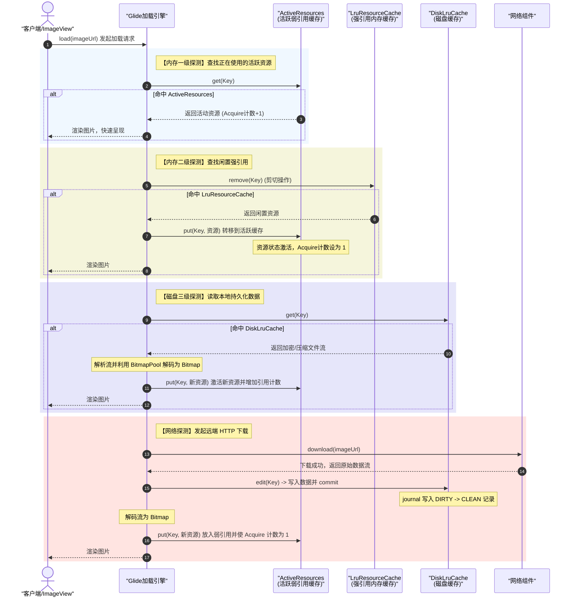

# Android 图片缓存详细机制

在移动互联网应用中，图片加载是内存占用、网络带宽消耗和界面卡顿（Jank）的重灾区。为了保障应用的流畅度、节省用户流量并彻底杜绝因大图加载导致的内存溢出（Out of Memory, OOM），Android 业界经过长期的探索与演进，形成了一套成熟的图片缓存机制。

本文将从图片三级缓存架构的设计初衷出发，深入剖析内存缓存 `LruCache` 的底层实现原理机制与 Bitmap 复用链条、分析磁盘缓存 `DiskLruCache` 的日志操作流与保障防损坏策略，并着重探讨以大厂主流图片框架 Glide 为代表的“活动资源（ActiveResources）与 LRU 内存双重缓存”的优化架构和完整的数据请求时序。

---

## 1. 核心概念：图片三级缓存拓扑架构

图片三级缓存（Memory Cache, Disk Cache, Network/Source Resource）是典型的“空间换时间”与“多层防线”相结合的优化方案。它们按照数据读取延迟、介质读写速度以及网络开销划分，构成了一个阶梯式的层级防线：

1. **内存缓存（一级防线，Memory Cache）**：
   * **特点**：速度极快（纳秒级），无 I/O 延迟，直接驻留在应用的虚拟机堆内存或 Native 内存中。
   * **作用**：用于缓存当前页面及最近浏览的图片，保障界面快速滑动时，图片可以瞬时呈现。
   * **局限性**：生命周期与应用进程相同，进程退出后被销毁；且容量极度受限（受制于应用最大堆内存配额 Heap Size），容易引发 OOM。
2. **磁盘缓存（二级防线，Disk Cache）**：
   * **特点**：速度较快（毫秒级），受限于闪存（Flash Storage）的 I/O 读写速度。数据持久化保存在设备的存储卡中。
   * **作用**：当内存缓存被释放或应用冷启动时，直接从本地磁盘读取图片，无需重新发起网络请求，节省用户流量并实现离线可用。
   * **局限性**：由于需要解析文件系统，频繁的磁盘 I/O 可能会带来明显的卡顿，且同样需要设定最大容量上限（LRU 淘汰）。
3. **网络/原始资源（三级底盘，Network/Source Resource）**：
   * **特点**：延迟最高（数百毫秒至数秒），依赖于网络环境，消耗用户移动数据流量。
   * **作用**：作为图片数据的最终源头，从远端服务器拉取原始图片。
   * **局限性**：高延迟、高功耗、不稳定。

### 三级缓存物理拓扑示意

```
  [ 客户端发起图片加载请求 ]
             │
             ▼
     ┌───────────────┐        Y
     │ 内存缓存命中? ├─────────────────────────┐
     └───────┬───────┘                         │
             │ N                               │
             ▼                                 │
     ┌───────────────┐        Y                │
     │ 磁盘缓存命中? ├─────────────────┐       │
     └───────┬───────┘                 │       │
             │ N                       │       │
             ▼                         │       │
     ┌───────────────┐                 │       │
     │ 网络下载并解码 │                 │       │
     └───────┬───────┘                 │       │
             │                         │       │
             ▼                         ▼       ▼
       [ 写入磁盘缓存 ] ────────► [ 写入内存缓存 ] ───► [ 渲染并展示给用户 ]
```

在三级缓存的协作机制中，数据流是双向流动的：读取时由上至下（内存 -> 磁盘 -> 网络），写入时则由下至上（网络下载后写入磁盘缓存，解码成 Bitmap 后存入内存缓存，最后呈现到 View 上）。

---

## 2. 内存缓存（LruCache）机制剖析

内存缓存是保障滑屏流畅度（不掉帧）的最核心策略。下面我们将分析其技术演进历程和底层运行逻辑。

### 2.1 为什么废弃传统的“软引用 / 弱引用”内存图片缓存？

在 Android 发展早期（Android 2.3 之前），许多开源库和开发者倾向于使用 `SoftReference`（软引用）或 `WeakReference`（弱引用）来包裹 Bitmap 对象作为内存缓存。其设计初衷是：
* 软引用对象在内存充足时可以长期保留；
* 当系统内存吃紧、即将发生 OOM 之前，垃圾回收器（GC）会自动回收这些软引用对象，从而安全地释放内存。

然而，这一设计方案在 Android 系统演进中被逐渐证明是失败的，并在官方文档中被明确废弃。其核心原因有以下两点：

1. **GC 行为与回收强度的改变**：
   从 [Android 2.3 (API 9)](../../../../../AndroidVersionChangeLog.md#android-23api-910) 开始，Android 系统的垃圾回收机制引入了并发 GC 等多项重构。为了提升内存回收的吞吐量和效率，系统的垃圾回收器变得更加倾向于在 GC 时直接回收软引用和弱引用指向的对象。即使当前系统可用堆内存依然很充裕，软引用的生命周期也变得极其短暂，极易被 GC 自动清理。这导致软/弱引用图片缓存的命中率近乎降到零，频繁触发磁盘或网络重新加载，使得缓存机制形同虚设。
2. **Bitmap 内存分配机制的历史演进**：
   * **Android 3.0 (API 11) 之前**：Bitmap 的像素数据（Pixel Data）实际上分配在 Native 内存（C++ 堆）中，而 Java 堆中仅保留了一个极小的 Bitmap 对象实例。Native 内存的释放时机是由 Java 对象的 finalize 机制决定的，GC 往往无法感知 Native 内存的实时压力。这导致即便 Java 堆内存充足，Native 堆也可能早已因为 Bitmap 像素数据的大量积压而发生 OOM。当时依赖软引用去保护 Java 堆对象，根本无法有效约束和清理 Native 像素空间。
   * **Android 3.0 (API 11) 至 Android 7.1 (API 25)**：为了解决 Native 内存不可控的问题，Android 将 Bitmap 像素数据搬回到了 Java 虚拟机的托管堆（Java Heap）中。这意味着所有的 Bitmap 内存申请和回收都由虚拟机统一管理，这虽然使内存分析变得直观，但也大幅加剧了 JVM 堆内存的压力，频繁的 Bitmap 分配引发严重的内存抖动，进而导致 GC 停顿频繁。
   * **Android 8.0 (API 26) 及之后**：为了优化堆内存占用，Bitmap 的像素数据又被重新移回了 Native 堆（使用硬件 Bitmap 或 Native 分配器分配），并通过 JVM 垃圾回收钩子进行精准释放。详细的版本演进和硬件配置变动，可以参阅 [AndroidVersionChangeLog.md](../../../../../AndroidVersionChangeLog.md)。

由于软/弱引用的失效以及内存配额的收紧，Google 自 API 12 起引入了 `android.util.LruCache`。它采用强引用管理对象，并使用 LRU 淘汰算法在内存额度超限时主动移除最久未使用的对象，从而提供可预期、高命中率的缓存行为。

### 2.2 `LruCache` 的底层 LinkedHashMap 实现原理

`LruCache` 的底层核心是 Java 集合框架中的 `LinkedHashMap`。它的 LRU（Least Recently Used，最近最少使用）淘汰逻辑完全基于 `LinkedHashMap` 内部的双向链表特性实现。

在 `LruCache` 初始化时，会通过以下构造方法创建 `LinkedHashMap`：

```java
this.map = new LinkedHashMap<K, V>(0, 0.75f, true);
```

第三个参数 `accessOrder` 设置为 `true` 是实现 LRU 算法的绝对关键。
* 当 `accessOrder = false` 时，`LinkedHashMap` 链表按照元素的**插入顺序**排序。
* 当 `accessOrder = true` 时，`LinkedHashMap` 链表按照元素的**访问顺序**排序。

#### 链表重排机制：`afterNodeAccess()` 钩子

在 `LinkedHashMap` 的实现中，无论是调用 `get(key)` 读取元素，还是调用 `put(key, value)` 写入/更新元素，底层都会触发内部的回调钩子 `afterNodeAccess(Node<K,V> e)`。其源码逻辑如下（以标准 JDK 实现为例）：

```java
void afterNodeAccess(Node<K,V> e) { // e 代表当前被访问的节点
    LinkedHashMapEntry<K,V> last;
    // 如果配置了 accessOrder 为 true，且当前被访问节点不是尾节点
    if (accessOrder && (last = tail) != e) {
        LinkedHashMapEntry<K,V> p = (LinkedHashMapEntry<K,V>)e;
        LinkedHashMapEntry<K,V> b = p.before, a = p.after;
        p.after = null; // 将当前节点的后续节点断开
        if (b == null)
            head = a; // 说明 p 是头节点，断开后将头节点指向 a
        else
            b.after = a; // 否则将前驱节点的 after 指向后继节点
        if (a != null)
            a.before = b; // 将后继节点的前驱指向 b
        else
            last = b;
        if (last == null)
            head = p;
        else {
            p.before = last; // 将当前节点挂在旧的尾节点后面
            last.after = p;
        }
        tail = p; // 将当前节点置为最新的尾节点
        ++modCount;
    }
}
```

通过这一巧妙的双向链表重组机制：
1. **热点移动**：最近刚刚被读取或最新写入的节点，都会被源源不断地移动到双向链表的**尾部（tail）**。
2. **冷落保留**：最久没有被访问过的元素，则会随着其他元素的后移，自然而然地沉积在双向链表的**头部（head）**。

#### 淘汰机制与多线程同步

当 `LruCache` 执行 `put` 写入操作时，会累加新元素的大小，并调用核心的 `trimToSize(int maxSize)` 方法检查是否超出阈值：

```java
public void trimToSize(int maxSize) {
    while (true) {
        K key;
        V value;
        synchronized (this) {
            if (size < 0 || (map.isEmpty() && size != 0)) {
                throw new IllegalStateException(getClass().getName()
                        + ".sizeOf() is reporting inconsistent results!");
            }

            if (size <= maxSize || map.isEmpty()) {
                break;
            }

            // 获取双向链表中最久未访问的头节点
            Map.Entry<K, V> toEvict = map.entrySet().iterator().next();
            key = toEvict.getKey();
            value = toEvict.getValue();
            map.remove(key);
            size -= safeSizeOf(key, value);
            evictionCount++;
        }

        entryRemoved(true, key, value, null);
    }
}
```

**线程安全保障**：由于图片加载通常发生在后台线程池中，而图片的渲染又在 UI 主线程进行，这就涉及多线程并发访问。从 `trimToSize` 的源码可以看出，`LruCache` 内部所有的 `get`、`put`、`remove` 以及检查大小逻辑均在 `synchronized (this)` 同步块中执行，保证了多线程环境下 Map 结构和 size 计数器的绝对一致性。

### 2.3 精确重写 `sizeOf()` 以防内存计算偏小导致 OOM

在默认情况下，`LruCache` 源码中的 `sizeOf(K key, V value)` 方法返回值为 `1`。这代表如果直接实例化并使用 `LruCache`，它所统计的容量是“缓存对象的总个数（Count）”。

对于高内存消耗的 Bitmap 而言，两张图片的尺寸差异可能达到数十倍。如果以“个数”为单位设置阈值，一旦存入多张极高分辨率的图片，极易在缓存数量还未达标时，堆内存就已经被消耗殆尽导致 OOM。因此，在缓存 Bitmap 时，必须以**占用的实际字节数**作为度量单位。

#### 重写示例与 API 演进

我们需要重写 `sizeOf()`，并进行系统兼容性处理：

```java
@Override
protected int sizeOf(String key, Bitmap value) {
    if (Build.VERSION.SDK_INT >= Build.VERSION_CODES.KITKAT) {
        // API 19 及以上优先使用 getAllocationByteCount()
        return value.getAllocationByteCount();
    } else {
        // API 12 至 API 18 使用 getByteCount()
        return value.getByteCount();
    }
}
```

#### `getByteCount()` 与 `getAllocationByteCount()` 的原理对比

这是面试中关于 Bitmap 缓存的超高频考点。它们的区别源于 **Bitmap 内存复用机制**：

* **`getByteCount()`**：
  * **含义**：根据 Bitmap 当前显示的宽、高、以及像素格式（Config，例如 `ARGB_8888` 占 4 字节，`RGB_565` 占 2 字节）计算出的最小所需内存空间。
  * **公式**：$\text{Width} \times \text{Height} \times \text{BytesPerPixel}$。
* **`getAllocationByteCount()`**：
  * **含义**：代表系统为当前 Bitmap 实例底层实际分配的物理内存大小（在 Native 堆或 Java 堆中占用的字节数）。
* **核心区别场景（inBitmap 复用）**：
  在 Android 4.4 之后，为了避免频繁解码图片带来的内存抖动，我们通常会配置 `BitmapFactory.Options.inBitmap`。例如，我们在内存中预先创建/保留了一个占 1000 KB 内存的 Bitmap 实例 A。当我们解码一张较小的新图片时，系统会重用 A 的这块 1000 KB 内存空间，并把解码后的图像显示在该内存中。
  此时对于这个 Bitmap 实例：
  * 它的 `getByteCount()` 仅返回当前新图实际像素所需的空间，比如 400 KB。
  * 它的 `getAllocationByteCount()` 返回的依然是最初分配的这块连续物理内存的大小，即 1000 KB。
  
  若我们在 LruCache 中仅仅通过 `getByteCount()` 计算大小，就会少计入这块内存中的 600 KB 冗余空间。一旦大量发生复用，LruCache 内部统计的 `size` 会远低于实际消耗物理堆内存，缓存也就失去了控制内存安全的功能，最终可能因堆内存爆满抛出 OOM。因此，**在 API 19 及以上，必须调用 `getAllocationByteCount()`。**

### 2.4 在 `entryRemoved()` 中释放的 Bitmap，如何联动 Bitmap 复用池进行二次复用

当 `LruCache` 的容量溢出，调用 `trimToSize` 淘汰某个 Bitmap，或者调用者主动 `remove` 时，会触发 `entryRemoved` 回调。

```java
@Override
protected void entryRemoved(boolean evicted, String key, Bitmap oldValue, Bitmap newValue) {
    if (evicted) {
        // oldValue 就是被淘汰出来的 Bitmap
        // 不应直接丢弃，而是送往 BitmapPool 进行复用
        BitmapPool.getInstance().put(oldValue);
    }
}
```

#### `BitmapPool` 底层复用链条

BitmapPool 是内存优化的终极利器。它的本质是一个专门用于临时存放并匹配闲置 Bitmap 内存块的容器。

```
[ LruCache 淘汰 Bitmap ] ──► [ 放入 BitmapPool (由 Lru 策略管理) ]
                                            │
   ┌────────────────────────────────────────┘
   ▼
[ 解码新图片需求 ] ──► [ 从 BitmapPool 寻找大小规格匹配的闲置 Bitmap ]
                                │
                                ├──► (找到匹配) ──► 设置 options.inBitmap ──► 复用内存解码
                                │
                                └──► (未找到) ──► 重新在堆上申请新内存解码
```

1. **缓存回炉**：当有 Bitmap 从强引用的 `LruCache` 中移出时，它不再被页面使用，如果直接任由 GC 处理会造成内存垃圾。我们在 `entryRemoved` 回调中将其扔进 `BitmapPool`。
2. **复用检索**：当需要解码一张新图片时，通过 `BitmapFactory.Options` 传入待复用的 Bitmap：
   ```java
   BitmapFactory.Options options = new BitmapFactory.Options();
   // 从复用池检索出规格相符（大小满足）的 Bitmap
   Bitmap inBitmap = BitmapPool.getInstance().get(width, height, config);
   if (inBitmap != null) {
       options.inBitmap = inBitmap;
       options.inMutable = true; // 复用要求必须为 mutable
   }
   BitmapFactory.decodeStream(stream, null, options);
   ```
3. **版本适配条件**：
   * **Android 3.0 (API 11) ~ Android 4.3 (API 18)**：要求非常严苛，要求被复用的 Bitmap 的大小必须与新解码的图片**完全一致**（宽高相等），且 `inSampleSize` 必须为 1。
   * **Android 4.4 (API 19) 及以上**：条件大幅度放宽，只要被复用 Bitmap 的 `getAllocationByteCount()` **大于或等于**新图解码后所需的字节数，即可成功实现重用。
   
   通过此种链条联动，大图片内存空间得以无限循环使用，这在快速滑动的瀑布流列表里，能大幅减少 CPU 发生 GC 停顿的几率。

---

## 3. 磁盘缓存（DiskLruCache）机制剖析

虽然磁盘缓存的数据获取速度慢于内存缓存，但它是持久化数据、保障进程重启后能快速加载的核心。

### 3.1 核心工作原理与日志文件 `journal` 的设计

`DiskLruCache` 的核心在于**无锁下的高性能文件读写记录**，它通过一个特殊的纯文本索引日志文件 `journal` 来实现自我校验与最近最少使用淘汰。

当我们在磁盘目录中初始化 `DiskLruCache` 时，会生成一个名为 `journal` 的文本文件。它的内容格式示例如下：

```text
libcore.io.DiskLruCache
1
100
1

DIRTY 335499f3929420077e890250d4d8c850
CLEAN 335499f3929420077e890250d4d8c850 46008
READ 335499f3929420077e890250d4d8c850
DIRTY 1ab96a17d5a56b2a4540026857f44d86
REMOVE 1ab96a17d5a56b2a4540026857f44d86
DIRTY 2c1972bda349646b9df225b290947702
```

#### `journal` 头部元数据
* **第 1 行**：魔法字串，固定为 `libcore.io.DiskLruCache`。
* **第 2 行**：DiskLruCache 库版本号。
* **第 3 行**：应用程序的应用版本号。
* **第 4 行**：每个 Key 关联的文件个数（常为 1）。
* **第 5 行**：预留空行。

#### 四大操作流前缀（DIRTY、CLEAN、REMOVE、READ）
自第 6 行起，为客户端对缓存执行操作时，系统写入的流水日志记录。每一行的状态都有严格的作用：

1. **`DIRTY`**：
   当调用者调用 `edit(key)` 尝试写入或更新缓存时，日志中会立即追加写入一条 `DIRTY key`。此时，DiskLruCache 会在磁盘目录中创建一个临时文件，格式为 `key.tmp`（用于暂存数据，防中途崩溃）。
2. **`CLEAN`**：
   当数据顺利写入临时文件，调用者执行了 `editor.commit()` 提交操作时，系统会把临时文件 `key.tmp` 重命名为正式的缓存文件 `key`，并向日志中写入 `CLEAN key size`（例如上面示例中的 `46008` 字节）。只有带有 `CLEAN` 标记的 key 才能被后续的读取所命中。
3. **`REMOVE`**：
   当调用 `remove(key)` 或者发生缓存额度超限触发 LRU 自动清理时，会删除对应的磁盘文件并向日志写入 `REMOVE key`。
4. **`READ`**：
   每次调用 `get(key)` 成功读取缓存时，向日志追加一条 `READ key`。DiskLruCache 会将此 key 在内存中的节点移到双向链表尾部，以此实现 LRU。

### 3.2 机制保障：文件防损坏与 LRU 磁盘淘汰

#### 1. 初始化校验与脏文件自动恢复机制
当应用启动并初始化 `DiskLruCache.open()` 时，会启动一个重要的校验子系统：
* 解析 `journal` 文件的每一行，在内存中维护一个映射图。
* **孤立的 DIRTY 处理**：如果在读取 journal 时，发现某条记录只有 `DIRTY` 这一行，而其后没有跟随对应的 `CLEAN` 或 `REMOVE` 行。系统会判断该图片文件在写入的中途发生了应用崩溃、断电、内存被强杀等异常。
* **物理清除**：为了防止这块损坏的数据残留甚至被错误加载，`DiskLruCache` 会遍历磁盘目录，主动将此 key 对应的临时脏文件（`key.tmp`）彻底物理清除，从而确保磁盘缓存的绝对健康和完好。

#### 2. 日志压缩机制（Rebuild Journal）
伴随应用频繁的使用，`journal` 的体积会飞速增大，严重拖慢冷启动时的加载解析效率。
为解决此问题，`DiskLruCache` 内部会记录无效日志行数的累加计数器。当操作记录数超标（通常是有效缓存数两倍以上）时，会启动后台线程执行 `rebuildJournal()`：
* 新建一个临时的 `journal.tmp` 文件。
* 写入头部五行元数据。
* 遍历内存中当前正常的、拥有 `CLEAN` 状态的所有缓存对象，并为每一条数据逐一输出一条简化的 `CLEAN key size` 日志。
* 重建完毕后，通过系统的 `renameTo` 文件原子级操作覆盖老日志文件。
这样就洗掉了中间产生的海量 `READ`、`REMOVE` 及无效 `DIRTY` 行，使得日志文件保持极致精简。

#### 3. 磁盘淘汰机制
当客户端不断提交新图片，使得磁盘整体占用字节数超过设定的 `maxSize` 时，会在线程中发起淘汰算法。逻辑与内存淘汰类似，遍历其内存中 LinkedHashMap 的 Entry 迭代器（对应 journal 中最久未被 `READ` 或 `CLEAN` 的数据），调用物理删除方法移除对应的磁盘缓存文件，并写入 `REMOVE` 记录，直到整体容量回落安全值以下。

---

## 4. 双重内存缓存（以 Glide 为例）

以主流图片库 Glide 为例，它设计了一套更完善的双重内存缓存系统：**活跃资源（ActiveResources）与 LRU 内存（LruResourceCache）双轨协作机制**。

### 4.1 核心角色定义

```
┌────────────────────────────────────────────────────────┐
│                        Glide 内存缓存                  │
│                                                        │
│   ┌─────────────────────┐       ┌──────────────────┐   │
│   │   ActiveResources   │       │ LruResourceCache │   │
│   │   (活动资源缓存)    │       │ (强引用LRU缓存)  │   │
│   │                     │       │                  │   │
│   │   Map<Key,          │       │ 基于标准LRU强引用│   │
│   │   WeakReference>    │       │ 暂存不使用的图片 │   │
│   └──────────┬──────────┘       └────────┬─────────┘   │
└──────────────┼───────────────────────────┼─────────────┘
               │                           ▲
               │ 引用计数归0               │
               │ (资源闲置)                │ 命中加载剪切
               └───────────────────────────┘
```

1. **`ActiveResources`（活跃资源缓存）**：
   * **实现形式**：`Map<Key, ResourceWeakReference>`。底层是一个包装了弱引用的 Map，其内部还关联了一个 `ReferenceQueue` 用于监听弱引用的回收。
   * **存储内容**：**当前页面上正处于展示状态、正在被 View 或其他地方持有的图片资源**。
   * **关键指标**：每一个包裹的资源都有一个非负的**引用计数（Acquire Counter）**。
2. **`LruResourceCache`（Lru强引用缓存）**：
   * **实现形式**：基于标准 `LruCache`。
   * **存储内容**：**当前已经没有被任何页面/View使用、但未被销毁的闲置图片资源**。

### 4.2 为什么设计双轨制？（彻底解决 LRU 误淘汰痛点）

如果在内存中只设计一层全局的 `LruCache`：
* 当用户正在滑屏时，界面上的一些 Item 依然处于可见状态（比如还在屏幕顶端没有移出视图）；
* 此时如果因为大量的新图请求涌入，导致 `LruCache` 达到了最大容量，触发了 LRU 淘汰逻辑；
* 那么那些正在被屏幕上显示的图片对象就很可能被强行移出缓存，甚至其底层的 Bitmap 内存被直接执行了 `recycle()`。
* 这会在界面绘制时引发严重的崩溃（如 `Canvas: trying to use a recycled bitmap`），或是导致滑屏时正在显示的图片发生不可接受的闪烁、白图现象。

**双轨制的妙处在于“状态隔离与分流”**：
通过引用计数判定，只要有一处 View 正在使用图片，该图片就被圈在 `ActiveResources`（弱引用）保护圈中，绝不会进入 `LruResourceCache`。因此，LRU 算法淘汰的永远只有那些“已经不被使用的闲置图片”，这完美保障了展示中图片的绝对安全。

### 4.3 双重缓存数据流转逻辑（剪切机制）

Glide 在运行过程中，资源在两层缓存之间的转移不是“复制”，而是**“剪切”（即此消彼长）**，这样可以最大化压榨内存效率。

#### 1. 从 Lru 缓存到活动缓存（剪切激活）
当 Glide 加载一张图片时：
* 优先查找 `ActiveResources`。如果命中，直接使用，并将图片的引用计数（Acquire）加 1。
* 如果未命中，继续检索 `LruResourceCache`。如果在 Lru 缓存中命中该图片：
  1. **移出 Lru**：Glide 会立即执行 `LruResourceCache.remove(key)`，将该资源从 Lru 强引用缓存中**彻底移除**。
  2. **移入 Active**：将其**放入** `ActiveResources` 弱引用缓存中。
  3. **增加计数**：将该图片的引用计数初始化为 1。

#### 2. 从活动缓存到 Lru 缓存（去活回退）
当页面的 Activity/Fragment 销毁，或者 View 被复用从而不再需要展示当前图片时：
* Glide 会将该图片的引用计数减 1。
* 当图片的引用计数（Acquire）**归 0** 时，说明该图片已经处于闲置状态：
  1. **移出 Active**：Glide 将其从 `ActiveResources` 弱引用 Map 中**移除**。
  2. **移回 Lru**：重新 `put` 回 `LruResourceCache` 强引用缓存中。
  3. **LRU 检验**：在 `put` 的同时，Lru 缓存会检查总体大小。如果发现容量超限，则淘汰掉最久未被使用的闲置图片，将其送去 BitmapPool 甚至直接释放。

---

## 5. 三级缓存请求流与时序图

下面我们通过 Mermaid 时序图，完整展示一个从客户端发起图片请求，到双重内存缓存检索、磁盘检索、网络下载及多级回写的完整请求时序流程。



### 核心时序节点详解

1. **第 1~4 步（ActiveResources 探测）**：如果图片正处于屏幕上的某个 Activity 中展示，则命中 Active 缓存，此时几乎是零开销，直接引用计数加 1 并返回。
2. **第 5~8 步（LruResourceCache 探测）**：如果 Active 没命中，则在 Lru 强引用中查找。这里注意执行的是 `remove` 剪切操作，这是因为如果只做普通读取而不移出 Lru，后续高密度的滑屏淘汰依然会威胁到它。将它移入 Active 之后，安全得以保障。
3. **第 9~12 步（DiskLruCache 探测）**：磁盘命中后，从磁盘读取字节流。此时由于将字节流转为图片会发生大量的内存开销，所以在解码时 Glide 会强依赖 `BitmapPool` 复用池。一旦解码成 Bitmap，同样将其放入 Active 缓存中锁定。
4. **第 13~18 步（网络下载与回写）**：网络下载完成后，第一优先级是写入本地磁盘（`DiskLruCache`），这能保障即使之后应用闪退，下次重新打开时也不用重复下载。写入成功后，解码出 Bitmap 并存入活跃缓存，交付客户端展示。

---

## 6. 核心总结与最佳实践

在开发 Android 图片缓存系统或适配图片加载库时，我们需要关注以下关键原则：

1. **大小感知度量**：对内存缓存的度量，一定要重写 `sizeOf` 获取 `getAllocationByteCount()`，严格防止因 `inBitmap` 复用导致内存泄露与 OOM。
2. **内存分流机制**：借鉴 Glide 的“双重内存”设计。强引用缓存最久未用（LRU 淘汰），弱引用缓存正在使用（锁定安全），从而在彻底防爆内存的同时保障渲染的一致性。
3. **磁盘原子提交**：磁盘缓存必须通过类似 `journal` 的 `DIRTY` -> `CLEAN` 操作流水日志保障文件的一致性，防止因写中途断电引发坏图和逻辑错乱。
4. **内存池化降抖动**：不论三级缓存怎么设计，最终解码出来的 Bitmap 都应该和 `BitmapPool` 挂钩。通过 `inBitmap` 重用内存，能将内存抖动和 GC 停顿次数降到最低，让应用滑屏如丝般顺滑。
