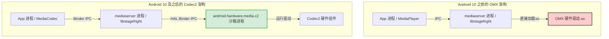
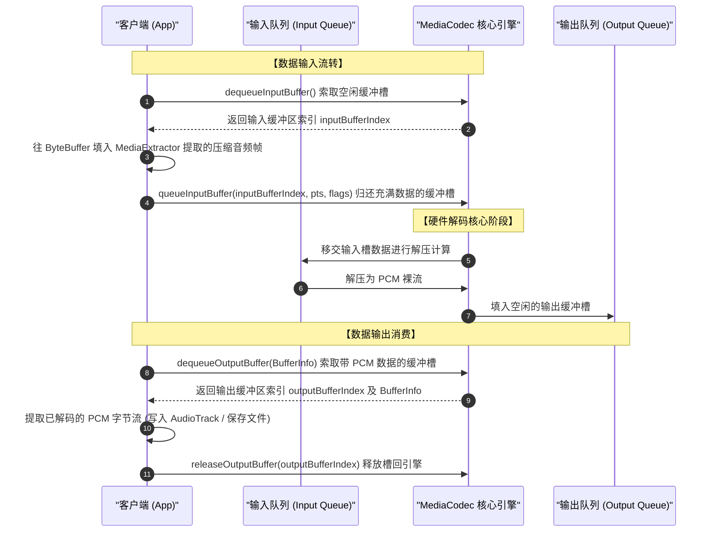

# 5.1.6.2.1 音频编解码

音频编解码是 Android 多媒体架构的核心基石，它扮演着连接真实物理世界（模拟连续声波）与计算机世界（离散数字信号）的桥梁角色。在 Android 平台上，无论是实现基础的高保真音乐播放、低延迟的实时语音通话，还是复杂的音视频剪辑与特效处理，都离不开底层高性能音频编解码组件的支持。

本文将从音频数字信号化的基本物理原理出发，深入探讨软解与硬解的系统设计权衡、Android 底层编解码框架的演进脉络，并重点剖析 `MediaExtractor` 与 `MediaCodec` 组合的流式处理模型，最后提供健壮的 Kotlin 开发模板与生产环境避坑指南。

---

## 一、 核心概念：模拟音频的数字信号化与压缩格式（是什么）

### 1.1 模拟音频向 PCM 数字信号的转换（ADC 过程）

自然界的声音是一种连续的模拟声波，它在时间和幅度上都是无限连续的。要在计算机系统中存储、传输和处理声音，必须通过模拟数字转换器（Analog-to-Digital Converter, ADC）将其转换为离散的数字信号。这个转换过程主要包括三个步骤：**采样**、**量化**和**编码**。最终生成的无损原始数字音频通常以 **PCM（Pulse Code Modulation，脉冲编码调制）** 格式存在。

#### 1. 采样（Sampling）与奈奎斯特采样定理
采样是指在时间轴上以固定的时间间隔对连续的模拟信号进行幅值提取。
* **奈奎斯特-香农采样定理（Nyquist-Shannon Sampling Theorem）**：为了能够无失真地重建原始模拟信号，采样频率 $f_s$ 必须大于信号中最高频率成分 $f_{max}$ 的两倍，即：
  $$f_s > 2 \cdot f_{max}$$
* **人耳听觉范围**：人类听觉的极限频率范围大约是 $20\text{ Hz} \sim 20\text{ kHz}$。因此，为了完美保留人类能听到的所有声音细节，采样率必须大于 $40\text{ kHz}$。
* **常见采样率标准**：
  * **$44.1\text{ kHz}$**：CD 级的标准采样率。这个数值源于早期电视制式（PAL/NTSC）的兼容性设计，并且满足奈奎斯特采样定理（$44.1 > 2 \times 20$），能够提供高品质的音频重建。
  * **$48\text{ kHz}$**：专业数字视频 and 音频领域的标准采样率（如 DVD、电视广播、现代电影音轨）。它的整数倍特性（相对于 $96\text{ kHz}$ / $192\text{ kHz}$）更适合专业级的混音和重采样处理。
  * **$8\text{ kHz}$ / $16\text{ kHz}$**：传统语音通话（电话）的采样率。人声的能量主要集中在 $4\text{ kHz}$ 以下，因此低采样率可以在极窄的带宽下保障基本的可懂度。

#### 2. 量化（Quantization）与信噪比
量化是指在幅度轴上将采样的连续电压值离散化到最接近的有限个数值上。量化精度由**量化位宽（Bit Depth）**决定，常见的有 8-bit、16-bit 和 24-bit。
* **量化误差与量化噪声**：由于量化将无限连续的值映射到有限的离散区间，这必然会带来微小的误差。这种误差在宏观上表现为高频的白噪声，称为**量化噪声**。
* **信噪比（Signal-to-Noise Ratio, SNR）**：量化位宽对信噪比有直接影响。对于均匀量化系统，其理论最大信噪比估算公式为：
  $$\text{SNR} \approx 6.02 \times N + 1.76\text{ dB}$$
  *(其中 $N$ 为量化位宽)*
  * **16-bit**：可以提供约 $98.08\text{ dB}$ 的动态范围，远远超出了普通物理播放环境的背景噪音，是高保真音频的基准。
  * **24-bit**：可提供约 $146.24\text{ dB}$ 的动态范围，常用于录音室音频母带制作，为音频后期处理留出巨大的防溢出裕量。

#### 3. 声道数（Channels）
声道数是指同时录制或播放的独立音频信号源的数量。
* **单声道（Mono）**：单一信号源，缺乏空间方向感。
* **双声道立体声（Stereo）**：包含左、右两个独立通道，利用人耳双耳效应（时间差、相位差、声强差）还原声源的空间方位。
* **多声道环绕声**（如 5.1、7.1）：通过前置、中置、环绕及超重低音音箱，营造出极强临场感的全方位声场。

#### 4. PCM 数据比特率计算
PCM 是不经过任何压缩的裸音频数据。其比特率（Bitrate，即每秒产生的数据位数）计算公式如下：
$$\text{Bitrate (bps)} = \text{采样率 (Hz)} \times \text{量化位宽 (bit)} \times \text{声道数}$$
* **示例**：标准的 CD 级音频（$44.1\text{ kHz}$、16-bit、双声道）：
  $$\text{Bitrate} = 44100 \times 16 \times 2 = 1,411,200\text{ bps} \approx 1411.2\text{ kbps}$$
  一分钟的未压缩 CD 级音频文件大小约为：
  $$\text{Size} = \frac{1411.2 \times 1000 \times 60}{8 \times 1024 \times 1024} \approx 10.09\text{ MB}$$
  这表明直接存储或在网络上传输 PCM 原始数据会消耗极其庞大的带宽与磁盘空间，必须采用音频压缩编码技术。

---

### 1.2 常见音频压缩格式的技术定位

为了解决 PCM 数据量过大的问题，音频压缩算法应运而生。根据压缩后能否完全无损还原，主要分为**有损压缩**和**无损压缩**两大阵营。

```
音频压缩格式
├── 无损压缩 (完全还原 PCM)
│   └── FLAC / ALAC (高保真播放、母带存储)
└── 有损压缩 (利用心理声学消除冗余)
    ├── AAC (现代通用、高质量、高压缩比)
    ├── MP3 (历史兼容、低带宽播放)
    └── AMR (蜂窝语音通话、超低比特率人声)
```

#### 1.2.1 有损压缩格式（Lossy Compression）
有损压缩通过舍弃人耳不易察觉的音频成分（主要是高频或被强音遮蔽的弱音）来换取极高的压缩比。其底层理论依据是**心理声学模型（Psychoacoustic Model）**，包括听觉绝对阈值、频域遮蔽效应（强音会掩盖邻近频段的弱音）和时域遮蔽效应（强音发生前后的一小段时间内，人耳无法感知弱音）。

* **AAC（Advanced Audio Coding）**
  * **技术定位**：目前移动端、流媒体最广泛采用的高级音频编码标准，是 MP3 的继任者。
  * **核心变体（Profiles）**：
    * **LC-AAC（Low Complexity）**：低复杂度配置。适合中高码率（$96\text{ kbps} \sim 256\text{ kbps}$）场景，计算开销低，音质表现优异，是大多数 App 的默认选择。
    * **HE-AAC（High Efficiency）**：高效配置。结合了 **SBR（Spectral Band Replication，频段复制）** 技术。SBR 仅保存低频信号，高频部分则在解码时根据低频信号以及辅助参数重建。在极低码率（$32\text{ kbps} \sim 64\text{ kbps}$）下，音质显著优于传统格式，常用于在线直播和窄带流媒体。
    * **HE-AAC v2**：在 HE-AAC 的基础上引入了 **PS（Parametric Stereo，参数立体声）** 技术。它只编码单声道信号，并用极少量的空间参数来描述立体声特性，在极低码率（如 $16\text{ kbps} \sim 32\text{ kbps}$）下仍能提供较好的立体声体验。
  * **选型建议**：移动 App 的音乐播放、短视频伴音、语音通话的首选编码格式。

* **MP3（MPEG-1 Audio Layer III）**
  * **技术定位**：曾经风密全球的经典音频格式。
  * **劣势**：由于设计时间较早，其滤波器组（Subband Filterbank）的设计存在相位失真，且心理声学模型相对粗糙。在同等码率下，其音质显著逊于 AAC。例如，在 $96\text{ kbps}$ 下，AAC 已经能达到接近 CD 级的听感，而 MP3 则会有明显的金属杂音。
  * **选型建议**：仅用于向下兼容老旧设备或遗留网络资源的播放，新项目中不建议作为音频采集或存储的编码。

* **AMR（Adaptive Multi-Rate）**
  * **技术定位**：专为移动通信语音优化的有损压缩格式。
  * **核心分类**：
    * **AMR-NB（Narrowband）**：窄带语音。采样率为 $8\text{ kHz}$，比特率范围 $4.75\text{ kbps} \sim 12.2\text{ kbps}$。主要优化 $300\text{ Hz} \sim 3400\text{ Hz}$ 之间的人声频段。
    * **AMR-WB（Wideband）**：宽带语音（即“高清通话”标准）。采样率为 $16\text{ kHz}$，比特率范围 $6.6\text{ kbps} \sim 23.85\text{ kbps}$。频段扩展到 $50\text{ Hz} \sim 7000\text{ Hz}$，人声还原度大幅度提升。
  * **选型建议**：由于其编码算法针对人类声道发生模型（Linear Predictive Coding）进行了高度简化，极其不适合音乐编码。在纯人声对讲机、客服电话录音、即时通讯语音消息中，由于其带宽高鲁棒性和极低带宽占用，依然扮演重要角色。

#### 1.2.2 无损压缩格式（Lossless Compression）
无损压缩类似 ZIP 压缩，它不丢弃任何原始音频数据。

* **FLAC（Free Lossless Audio Codec）**
  * **技术定位**：开源的无损音频压缩标准。它使用线性预测编码（LPC）预测当前采样，并对预测误差进行哈夫曼（Huffman）或哥伦布（Golomb-Rice）熵编码。
  * **压缩比**：一般可将 PCM 原始数据体积压缩至 $50\% \sim 60\%$。
  * **选型建议**：适用于 Hi-Fi（高保真）无损音乐播放器开发，或者作为高质量音频素材的归档存储。

---

## 二、 设计取舍：软解与硬解的物理权衡及系统架构演进（为什么）

在 Android 系统的工程实践中，开发者和系统工程师必须在“软件编解码（软解）”与“硬件加速编解码（硬解）”之间做出物理设计上的权衡。

### 2.1 软解与硬解的物理与系统权衡

| 维度 | 软解（Software Decoding） | 硬解（Hardware Decoding） |
| :--- | :--- | :--- |
| **工作原理** | 通过通用 CPU 核心执行软件算法库（如 FFmpeg、libstagefright 软解内核） | 通过 SoC 中的专用硬件电路（如 DSP、NPU、专属音视频解码硬核）进行硬件加速 |
| **功耗与发热** | **高**。CPU 需要高频工作，浮点运算吞吐大，电池消耗极快，设备容易发热。 | **极低**。专用电路经过定制和能效优化，功耗通常仅为 CPU 软解的几分之一到几十分之一。 |
| **灵活性与扩展性** | **极强**。可通过 App 内置 dynamic link library（`.so`）轻松支持任何新型、定制或非标准的音频格式，升级极其方便。 | **极差**。解码逻辑固化在芯片硬件中，不支持的格式（如最新研发的私有协议）无法通过常规软件更新获得硬解能力。 |
| **设备兼容性** | **极佳**。只要 CPU 指令集兼容（如 ARM64-v8a），不同厂商、不同型号的设备均能表现出高度一致的解码行为。 | **存在碎片化风险**。不同芯片厂商（Qualcomm、MediaTek、Unisoc 等）的硬件驱动实现质量参差不齐，可能存在死锁、底噪或特定格式崩溃问题。 |
| **并发通道数限制** | **仅受 CPU 性能限制**。只要 CPU 算力允许，可以并发开启数十路软解，适合音轨密集的专业剪辑软件或大型 3D 游戏。 | **受硬件资源硬限制**。SoC 分配给编解码的硬件资源（如 DMA 内存通道、硬件上下文缓冲区）是有限的，并发通道数有上限，超限会直接抛出 Codec 实例化异常。 |
| **调试友好度** | **高**。发生崩溃时可直接产生 native crash stack trace，便于 App crash 监控系统捕获。 | **低**。如果硬解驱动内部发生死锁或内核崩溃，通常表现为 `MediaCodec` 接口无限阻塞或发生未捕获的 HAL 进程异常。 |

---

### 2.2 Android 编解码组件架构演进：从 OMX 到 Codec2

为了规范硬件厂商的驱动对接，并解决系统安全性与性能的冲突，Android 底层编解码架构经历了一次重大的重构。



#### 2.2.1 OMX (OpenMAX Integration Layer) 时代的局限性
在 [Android 8.0（API 26）](../../../../../AndroidVersionChangeLog.md#android-80--81api-26--27) 引入 Project Treble 以及 [Android 10（API 29）](../../../../../AndroidVersionChangeLog.md#android-10api-29) 正式引入 Codec2 之前，Android 编解码底层是基于 `OpenMAX IL` 标准的。
* **安全性隐患（Stagefright 漏洞）**：在旧版 OMX 架构中，多媒体硬件驱动程序往往需要直接加载到具有较高权限的 `mediaserver` 进程或者 `mediacodec` 进程中。硬件厂商编写的 C/C++ 驱动中，若在处理复杂的畸形音频帧时发生堆栈缓冲区溢出，攻击者可以通过特定的多媒体流直接劫持 `mediaserver` 进程，从而控制摄像头、麦克风等系统核心硬件。
* **共享内存与跨进程通信低效**：由于 OMX 标准并没有对跨进程内存（Shared Memory）的生命周期和传递机制做出极度严苛的强类型抽象，导致经常需要进行不必要的内存拷贝。
* **接口臃肿、状态同步困难**：OMX 组件的状态机极为复杂，包含数十种端口配置和复杂的握手协议，硬件厂商适配成本极高，极易产生碎片化 Bug。

#### 2.2.2 Codec2 底层服务的演进与沙箱化安全设计
为了彻底解决安全漏洞和架构缺陷，谷歌在 [Android 10（API 29）](../../../../../AndroidVersionChangeLog.md#android-10api-29) 中引入了全新的 **Codec2（Codec 2.0）** 框架。
1. **进程隔离与沙箱化（Process Sandbox）**：
   * Codec2 将硬件编解码器的运行环境彻底移出了系统核心服务进程。所有的硬件编解码驱动全部运行在各自独立的隔离进程中（例如 `android.hardware.media.c2@1.0-service` 进程，通常具备极窄的 SEAndroid 权限）。
   * 即使厂商的解码驱动在解析异常音频流时发生了越界访问或段错误（Segmentation Fault）而崩溃，也仅仅是该沙箱进程死掉。Android 系统的守护进程（init）会自动重启该沙箱服务，而 `mediaserver` 进程以及运行 App 的前台进程只会在 Binder 链路上收到一个中断异常错误（`INFO_DISCONNECT` 或 `CodecException`），从而大大增强了系统的整体抗灾难和防提权能力。
2. **BufferPool 共享内存设计**：
   * Codec2 引入了统一的高性能内存分配器接口。在跨 Binder 进程边界传输音频/视频帧时，通过 `C2Buffer` 对象进行包装，底层基于 `Gralloc` 或 `ashmem`（匿名共享内存）分配物理缓冲区。
   * 它实现了一套高效的**零拷贝（Zero-Copy）**机制。音频解码出来的 PCM 帧可以直接从硬件驱动的物理地址，通过 Binder 描述符传递给系统的音频渲染组件（如 `AudioTrack` 或音效链），极大减少了用户空间与内核空间之间的内存拷贝频率。
3. **统一的 HAL 规范**：
   * 摒弃了过时的 OMX 复杂设计，提供更简洁的 C2Component/ComponentInterface 结构。它在 Android 10-13 阶段基于 HIDL 构建，从 [Android 14 (API 34)](../../../../../AndroidVersionChangeLog.md#android-14api-34) 起进一步向标准的 AIDL 迁移，实现了与硬件层解耦的底层接口标准化。

---

## 三、 核心实现与流式框架：解封装与双队列流式框架（怎么做）

在 Android 开发中，实现音频播放或转码的核心链路通常由解封装器（`MediaExtractor`）与编解码器（`MediaCodec`）协作完成。

### 3.1 MediaExtractor 的作用与解封装工作流

音频文件通常是以某种容器格式（如 `.mp4`、`.m4a`、`.aac`）存储在磁盘上。容器格式里除了音频编码帧之外，还包含文件头、时长信息、元数据（ID3 标签）、音视频同步索引表等。
**解封装（Demuxing）** 就是将这些复杂的容器外壳拆解，过滤掉不相关的辅助信息，从中准确分离提取出纯音频数据基本流（Elementary Stream, ES）的过程。

`MediaExtractor` 的工作流如下：
1. **初始化源**：调用 `setDataSource`，传入本地文件路径、文件描述符（`FileDescriptor`）或网络 URL。
2. **检索轨道**：调用 `getTrackCount()` 获取容器内所有音视频轨道，并通过读取每个轨道的 `MediaFormat`（调用 `getTrackFormat(index)`）的 `MediaFormat.KEY_MIME` 属性来筛选出音频轨道（例如 `audio/` 前缀的 MIME）。
3. **选定轨道**：调用 `selectTrack(index)` 激活特定的音频轨。
4. **提取流数据**：
   * 在主循环中分配一个 `ByteBuffer`，通过 `readSampleData(buffer, offset)` 将一帧压缩的音频帧（如 AAC ADTS 帧）载入到该 Buffer 中。
   * 通过 `getSampleTime()` 取得该帧的演示时间戳（Presentation Time Stamp, PTS，单位微秒）。
   * 通过 `getSampleFlags()` 取得该帧的特质（例如是否是关键帧 `BUFFER_FLAG_KEY_FRAME`）。
5. **位置递进**：调用 `advance()`，使 Extractor 内部的文件指针跳向下一帧，为下一次读取做准备。如果不调用 `advance()`，则会重复读取当前帧。

---

### 3.2 MediaCodec 核心机制：双缓冲区队列状态机模型

`MediaCodec` 是 Android 多媒体框架中进行音频编解码的核心类。其内部实现了一个严密的生产者-消费者设计模式，由**输入缓冲区队列（Input Buffer Queue）**和**输出缓冲区队列（Output Buffer Queue）**这两个环形队列组成。



#### 3.2.1 编解码器流式流转状态机
在 `MediaCodec` 的生命周期中，存在如下状态跃迁：

* **Uninitialized（未初始化）**：编解码器刚创建时的状态。可以通过 `createDecoderByType()` 等静态方法实例化。
* **Configured（已配置）**：调用 `configure()` 传入 `MediaFormat` 和渲染 Surface（音频解码传入 null）后的状态。
* **Executing（执行中）**：调用 `start()` 后的状态，此时双缓冲区队列正式开启。其子状态包含：
  * **Flushed（已刷新）**：刚启动或调用了 `flush()` 时的状态。此时队列中没有任何数据。
  * **Running（运行中）**：客户端和 MediaCodec 开始活跃交换数据。
  * **End-of-Stream（流结束，EOS）**：当把带 `BUFFER_FLAG_END_OF_STREAM` 标记的 Buffer 塞入输入队列后，编解码器会处理完残留数据，最终在输出端也吐出带 EOS 标记的 Buffer。此时停止解码。
* **Released（已释放）**：调用 `release()` 回收所有物理资源后的状态，通常在 finally 块中确保该状态发生。

#### 3.2.2 双队列数据流转四步法
在 `Executing` 状态下，数据流转遵循以下四个步骤的闭环：
1. **`dequeueInputBuffer(timeoutUs)`**：App 询问 MediaCodec：“请给我一个空的输入缓冲区。” 如果有可用空闲 Buffer，它会返回一个大于或等于 0 的缓冲区索引（`index`）。如果暂时没有，则会依据 `timeoutUs` 超时策略等待。
2. **`queueInputBuffer(index, offset, size, pts, flags)`**：App 拿到输入 Buffer 索引后，通过 `getInputBuffer(index)` 获取真实的 `ByteBuffer`，将由 `MediaExtractor` 提取的压缩帧写入其中，接着调用此方法将该 Buffer 重新归还给 MediaCodec 引擎。
3. **`dequeueOutputBuffer(info, timeoutUs)`**：App 询问 MediaCodec：“有没有解码好的原始 PCM 数据？” 如果有，它会返回输出缓冲区的索引（`index`），同时将这一帧 PCM 的大小、偏移量、PTS 和标志位填入 `MediaCodec.BufferInfo` 结构体中。
4. **`releaseOutputBuffer(index, render)`**：App 拿到输出 Buffer 索引，通过 `getOutputBuffer(index)` 读出原始的 PCM 数据进行处理（如通过 `AudioTrack` 播放或保存），一旦使用完毕，**必须**调用此方法，将缓冲区所有权归还给 MediaCodec 内部，否则该输出通道将被永久占用，最终导致解码管道停摆。

---

### 3.3 音频解码为 PCM 的 Kotlin 完整代码模板

下面提供两种完整的音频解码工程模板。所有代码基于 Kotlin 编写，包含严谨的资源回收机制和边界处理。

#### 3.3.1 方案一：同步 API 模式（适合在独立的后台工作线程中使用）

同步模式是最经典的实现方式。虽然直观，但其获取缓冲区的方法是同步阻塞的，因此必须放在独立的子线程中执行。

```kotlin
package com.example.audiocodec

import android.media.MediaCodec
import android.media.MediaExtractor
import android.media.MediaFormat
import android.util.Log
import java.io.File
import java.io.FileOutputStream
import java.io.IOException
import java.nio.ByteBuffer

/**
 * 同步音频解码器
 * 负责将任意系统支持的有损/无损压缩音频解码为原始的 PCM 裸数据
 */
class SyncAudioDecoder {

    companion object {
        private const val TAG = "SyncAudioDecoder"
        private const val TIMEOUT_US = 10000L // 10毫秒超时
    }

    /**
     * 同步解码音频文件到指定的 PCM 输出路径
     * @param inputPath 输入音频路径（如 MP3, M4A 等）
     * @param outputPath 输出 PCM 文件路径
     */
    fun decode(inputPath: String, outputPath: String) {
        val extractor = MediaExtractor()
        var codec: MediaCodec? = null
        var fileOutputStream: FileOutputStream? = null

        try {
            // 1. 初始化 Extractor 并选定音频轨
            extractor.setDataSource(inputPath)
            val trackIndex = selectAudioTrack(extractor)
            if (trackIndex < 0) {
                throw IOException("在输入文件中未找到任何有效的音频轨: $inputPath")
            }
            extractor.selectTrack(trackIndex)
            val mediaFormat = extractor.getTrackFormat(trackIndex)

            // 获取 MIME 类型以实例化对应的解码器
            val mime = mediaFormat.getString(MediaFormat.KEY_MIME) ?: throw IOException("音频轨缺少 MIME 属性")
            Log.d(TAG, "检测到音频 MIME 类型: $mime")

            // 2. 创建并配置 MediaCodec
            codec = MediaCodec.createDecoderByType(mime)
            codec.configure(mediaFormat, null, null, 0)
            codec.start()

            // 3. 初始化输出文件流
            val pcmFile = File(outputPath)
            fileOutputStream = FileOutputStream(pcmFile)

            val bufferInfo = MediaCodec.BufferInfo()
            var isInputEOS = false
            var isOutputEOS = false

            // 4. 双队列循环流转
            while (!isOutputEOS) {
                // 4.1 处理输入缓冲队列 (将压缩数据送入解码器)
                if (!isInputEOS) {
                    val inputBufferIndex = codec.dequeueInputBuffer(TIMEOUT_US)
                    if (inputBufferIndex >= 0) {
                        val inputBuffer = codec.getInputBuffer(inputBufferIndex)
                        if (inputBuffer != null) {
                            inputBuffer.clear()
                            val sampleSize = extractor.readSampleData(inputBuffer, 0)
                            if (sampleSize < 0) {
                                // 读到文件末尾，发送 EOS 标记
                                Log.d(TAG, "已到达音频输入流末尾，发送 EOS 信号")
                                codec.queueInputBuffer(
                                    inputBufferIndex,
                                    0,
                                    0,
                                    0L,
                                    MediaCodec.BUFFER_FLAG_END_OF_STREAM
                                )
                                isInputEOS = true
                            } else {
                                val sampleTime = extractor.getSampleTime()
                                codec.queueInputBuffer(
                                    inputBufferIndex,
                                    0,
                                    sampleSize,
                                    sampleTime,
                                    0
                                )
                                extractor.advance() // Extractor 前进到下一帧
                            }
                        }
                    }
                }

                // 4.2 处理输出缓冲队列 (从解码器取出 PCM 原始数据)
                val outputBufferIndex = codec.dequeueOutputBuffer(bufferInfo, TIMEOUT_US)
                when {
                    outputBufferIndex >= 0 -> {
                        val outputBuffer = codec.getOutputBuffer(outputBufferIndex)
                        if (outputBuffer != null && bufferInfo.size > 0) {
                            outputBuffer.position(bufferInfo.offset)
                            outputBuffer.limit(bufferInfo.offset + bufferInfo.size)

                            // 从 Direct ByteBuffer 中读取字节数组并写入文件
                            val chunk = ByteArray(bufferInfo.size)
                            outputBuffer.get(chunk)
                            fileOutputStream.write(chunk)
                        }

                        // 核心：无条件释放输出缓冲区，归还给 Codec 内部
                        codec.releaseOutputBuffer(outputBufferIndex, false)

                        // 判断输出端是否收到结束标记
                        if ((bufferInfo.flags and MediaCodec.BUFFER_FLAG_END_OF_STREAM) != 0) {
                            Log.d(TAG, "已收到解码器输出流的 EOS 信号，解码正常结束")
                            isOutputEOS = true
                        }
                    }
                    outputBufferIndex == MediaCodec.INFO_OUTPUT_FORMAT_CHANGED -> {
                        // 解码器输出格式发生变化（例如多路复用时，采样率或声道数可能有变化）
                        val newFormat = codec.outputFormat
                        Log.d(TAG, "音频输出格式发生变化: $newFormat")
                    }
                    outputBufferIndex == MediaCodec.INFO_TRY_AGAIN_LATER -> {
                        // 队列暂时没有解码好的数据，无特殊处理，继续循环
                    }
                }
            }
        } catch (e: Exception) {
            Log.e(TAG, "解码过程中发生致命异常", e)
            throw e
        } finally {
            // 5. 严格释放所有多媒体与 IO 资源，防止 Native 内存泄露
            try {
                codec?.stop()
            } catch (e: Exception) {
                Log.e(TAG, "停止 Codec 异常", e)
            } finally {
                codec?.release()
            }
            extractor.release()
            try {
                fileOutputStream?.flush()
                fileOutputStream?.close()
            } catch (e: IOException) {
                Log.e(TAG, "关闭输出流异常", e)
            }
            Log.d(TAG, "所有资源已安全释放")
        }
    }

    /**
     * 辅助方法：检索音频轨道索引
     */
    private fun selectAudioTrack(extractor: MediaExtractor): Int {
        val trackCount = extractor.getTrackCount()
        for (i in 0 until trackCount) {
            val format = extractor.getTrackFormat(i)
            val mime = format.getString(MediaFormat.KEY_MIME)
            if (mime != null && mime.startsWith("audio/")) {
                return i
            }
        }
        return -1
    }
}
```

---

#### 3.3.2 方案二：异步 API 模式（通过 `setCallback` 实现，推荐在后台线程池/协程中协同）

异步回调模式避免了在循环中轮询缓冲区的超时开销。它在驱动层就绪时，通过系统回调主动通知应用。这对于高并发或后台服务解码更加友好。

```kotlin
package com.example.audiocodec

import android.media.MediaCodec
import android.media.MediaExtractor
import android.media.MediaFormat
import android.os.Handler
import android.os.HandlerThread
import android.util.Log
import java.io.File
import java.io.FileOutputStream
import java.io.IOException
import java.util.concurrent.CountDownLatch

/**
 * 基于 Callback 异步回调的音频解码器
 * 适合配合后台线程池或事件队列，提供无阻塞的平滑性能
 */
class AsyncAudioDecoder {

    companion object {
        private const val TAG = "AsyncAudioDecoder"
    }

    private var extractor = MediaExtractor()
    private var codec: MediaCodec? = null
    private var fileOutputStream: FileOutputStream? = null
    private var handlerThread: HandlerThread? = null
    private var isInputEOS = false
    private val finishLatch = CountDownLatch(1) // 跨线程状态同步锁

    fun decodeAsync(inputPath: String, outputPath: String) {
        // 创建独立的 HandlerThread，用于接收底层编解码器的回调，避免抢占主线程 Looper
        handlerThread = HandlerThread("AudioDecoder-CallbackThread")
        handlerThread?.start()
        val callbackHandler = Handler(handlerThread!!.looper)

        try {
            extractor.setDataSource(inputPath)
            val trackIndex = selectAudioTrack(extractor)
            if (trackIndex < 0) {
                throw IOException("未找到有效的音频轨: $inputPath")
            }
            extractor.selectTrack(trackIndex)
            val mediaFormat = extractor.getTrackFormat(trackIndex)
            val mime = mediaFormat.getString(MediaFormat.KEY_MIME) ?: throw IOException("MIME 为空")

            fileOutputStream = FileOutputStream(File(outputPath))

            codec = MediaCodec.createDecoderByType(mime)

            // 核心：在 configure 之前必须设置 Callback，并且指定回调运行的线程句柄 Handler
            codec?.setCallback(object : MediaCodec.Callback() {
                
                override fun onInputBufferAvailable(codec: MediaCodec, index: Int) {
                    if (isInputEOS) return

                    val inputBuffer = codec.getInputBuffer(index) ?: return
                    inputBuffer.clear()
                    
                    val sampleSize = extractor.readSampleData(inputBuffer, 0)
                    if (sampleSize < 0) {
                        Log.d(TAG, "异步：到达流末尾，发送 EOS")
                        codec.queueInputBuffer(
                            index,
                            0,
                            0,
                            0L,
                            MediaCodec.BUFFER_FLAG_END_OF_STREAM
                        )
                        isInputEOS = true
                    } else {
                        val pts = extractor.getSampleTime()
                        codec.queueInputBuffer(index, 0, sampleSize, pts, 0)
                        extractor.advance()
                    }
                }

                override fun onOutputBufferAvailable(
                    codec: MediaCodec,
                    index: Int,
                    info: MediaCodec.BufferInfo
                ) {
                    val outputBuffer = codec.getOutputBuffer(index)
                    if (outputBuffer != null && info.size > 0) {
                        outputBuffer.position(info.offset)
                        outputBuffer.limit(info.offset + info.size)

                        val data = ByteArray(info.size)
                        outputBuffer.get(data)
                        try {
                            fileOutputStream?.write(data)
                        } catch (e: IOException) {
                            Log.e(TAG, "写入文件错误", e)
                        }
                    }

                    // 必须立即释放
                    codec.releaseOutputBuffer(index, false)

                    // 判断解码是否完成
                    if ((info.flags and MediaCodec.BUFFER_FLAG_END_OF_STREAM) != 0) {
                        Log.d(TAG, "异步：已收到输出端 EOS 信号，解码结束")
                        finishLatch.countDown()
                    }
                }

                override fun onError(codec: MediaCodec, e: MediaCodec.CodecException) {
                    Log.e(TAG, "MediaCodec 底层运行发生错误: ${e.diagnosticInfo}", e)
                    finishLatch.countDown() // 异常情况也需要释放线程等待
                }

                override fun onOutputFormatChanged(codec: MediaCodec, format: MediaFormat) {
                    Log.d(TAG, "异步：输出格式变化: $format")
                }
            }, callbackHandler)

            // 配置并启动
            codec?.configure(mediaFormat, null, null, 0)
            codec?.start()

            // 阻塞调用者线程，等待异步解码流程结束
            finishLatch.await()

        } catch (e: Exception) {
            Log.e(TAG, "初始化或启动过程中抛出异常", e)
        } finally {
            cleanup()
        }
    }

    private fun cleanup() {
        try {
            codec?.stop()
        } catch (e: Exception) {
            Log.e(TAG, "停止 Codec 失败", e)
        } finally {
            codec?.release()
            codec = null
        }
        extractor.release()
        try {
            fileOutputStream?.flush()
            fileOutputStream?.close()
        } catch (e: IOException) {
            Log.e(TAG, "关闭文件流失败", e)
        }
        handlerThread?.quitSafely()
        Log.d(TAG, "异步解码器资源清理完毕")
    }

    private fun selectAudioTrack(extractor: MediaExtractor): Int {
        for (i in 0 until extractor.getTrackCount()) {
            val format = extractor.getTrackFormat(i)
            val mime = format.getString(MediaFormat.KEY_MIME)
            if (mime != null && mime.startsWith("audio/")) {
                return i
            }
        }
        return -1
    }
}
```

---

## 四、 常见误区与最佳实践（避坑指南）

### 4.1 避坑：不要在 UI 主线程执行 MediaCodec 同步阻塞操作

#### 1. 为什么会导致卡顿与 ANR？
在同步模式下，`dequeueInputBuffer(timeoutUs)` 和 `dequeueOutputBuffer(info, timeoutUs)` 会使调用线程挂起，等待底层硬件编解码器腾出空闲缓冲槽。
* 如果超时参数 `timeoutUs` 设置为 `-1`，则代表无限期阻塞等待，直到硬件端响应。
* 即使 `timeoutUs` 设置为几十毫秒，由于音频解码的流式处理是每秒循环成百上千次的，如果在 UI 主线程中执行，累计的等待时间极易打破 UI 渲染 $16.6\text{ ms}$（$60\text{ fps}$）的限制，直接造成画面帧率暴跌。
* 当系统高负载或解码器驱动死锁时，无限等待主线程会造成无响应，最终引发 **ANR（Application Not Responding）**。

#### 2. 最佳实践设计
* **后台线程（HandlerThread / ThreadPool）**：同步解码必须放在独立的后台工作线程中进行。
* **Kotlin 协程**：在协程中，不要直接在 `Dispatchers.Main` 中进行解码，应利用 `withContext(Dispatchers.IO)` 切换上下文，但更推荐直接采用 Callback 模式或将整个类封装。
* **合理超时**：不要传入 `-1` 作为 `timeoutUs`，建议使用 `10000Us`（$10\text{ ms}$）作为单次等待超时的上限，并配合合理的自旋控制。

---

### 4.2 内存泄漏与 OOM：Direct ByteBuffer 释放不当导致的 Direct Memory OOM

音频编解码的性能瓶颈之一在于庞大的数据传输量。为避免不必要的内存拷贝，`MediaCodec` 采用了底层的 Direct Buffer 映射。

#### 1. Direct ByteBuffer 的内存回收脱节本质
`MediaCodec.getInputBuffer(index)` 和 `getOutputBuffer(index)` 返回的并不是普通的 Java 堆内存，而是 **Direct ByteBuffer（直接缓冲区）**。

```
     【JVM 堆内存】                     【C++ 物理内存 / Native 堆】
┌───────────────────────┐            ┌──────────────────────────┐
│                       │            │                          │
│  [DirectByteBuffer]  ───(指针指向)───> [ 真实解码 PCM 缓存物理空间 ]  │
│  (非常小的 Java 对象)    │            │     (通常为几百 KB ~ MB)   │
│                       │            │                          │
└───────────────────────┘            └──────────────────────────┘
           ▲                                      ▲
     只受 JVM 堆压力的                        不受 JVM GC 直接监控，
     GC 判定控制（滞后）                     依赖底层驱动和主动释放
```

* **物理内存分配在 Native 堆**：Direct ByteBuffer 底层是通过操作系统 `malloc()` 等函数直接在 Native 硬件内存中分配出来的，并不占用 JVM 堆空间。Java 层持有的仅仅是一个微小的引用包装对象。
* **GC 机制的滞后性**：JVM 的垃圾收集器（如 G1, CMS）在决定是否触发 GC 时，主要观察 **Java 堆** 的剩余空间。由于 DirectByteBuffer 在 Java 堆内的对象头部极小（只有几十个字节），即使在 Native 堆中已经分配了数百兆的音频解码缓冲区，Java 虚拟机的堆空间看起来依然空荡荡的，因此 JVM 不会触发垃圾回收。
* **内存泄漏现象**：如果客户端代码没有主动、及时地释放这些 Native 缓冲区，当 Java 对象迟迟没有被 GC 回收时，底层真实的物理内存就无法返还。这会造成 Native 内存急剧膨胀，进而抛出：
  `java.lang.OutOfMemoryError: Direct buffer memory`
  或者因占用整机物理内存超标，被 Linux Kernel 的 **OOM Killer** 强行杀死进程（常表现为 App 无征兆闪退，但在 Java 日志中没有任何 Exception）。

#### 2. 避免内存溢出的防护策略
1. **立即且强制调用 `releaseOutputBuffer`**
   一旦通过 `getOutputBuffer(index)` 提取并处理完毕 PCM 数据后，必须在第一时间调用 `codec.releaseOutputBuffer(index, false)`。该调用会向底层 C++ 驱动发送归还信号，立即释放或重置 Native 段的数据块，而不依赖于任何 Java GC。
2. **规范的 try-finally 块保护**
   多媒体处理极易因为数据源损坏（损坏的 AAC 帧）而在解码中途抛出 `CodecException`。一旦发生异常，如果直接退出方法而没有执行 `codec.stop()` and `codec.release()`，则编解码器持有的所有输入输出 Direct Buffer 以及底层驱动上下文将发生**永久性 Native 内存泄漏**。因此，必须将释放逻辑放在 `finally` 块中。
3. **防止强引用持有**
   不要将 `getInputBuffer` 或 `getOutputBuffer` 返回的 `ByteBuffer` 保存为全局变量或存入长期存在的 List/Map 集合中。如果确实需要在跨线程传递数据，应当分配一个普通 Java 字节数组（`ByteArray`），用 `get(byteArray)` 方法将数据复制出来后，立即 release 对应的输出缓冲区。

---

## 延伸阅读与版本兼容

* 涉及 Android 编解码器版本变化以及内存限制演进，请参阅 [AndroidVersionChangeLog.md](../../../../../AndroidVersionChangeLog.md)。
* 特别是 [Android 10（API 29）](../../../../../AndroidVersionChangeLog.md#android-10api-29) 中关于 Codec2 安全沙箱化的行为变更，以及 [Android 15（API 35）](../../../../../AndroidVersionChangeLog.md#android-15api-35) 中新引入的音频响度控制 `LoudnessCodecController` 的应用，适配不同 target 版本的兼容细节。
