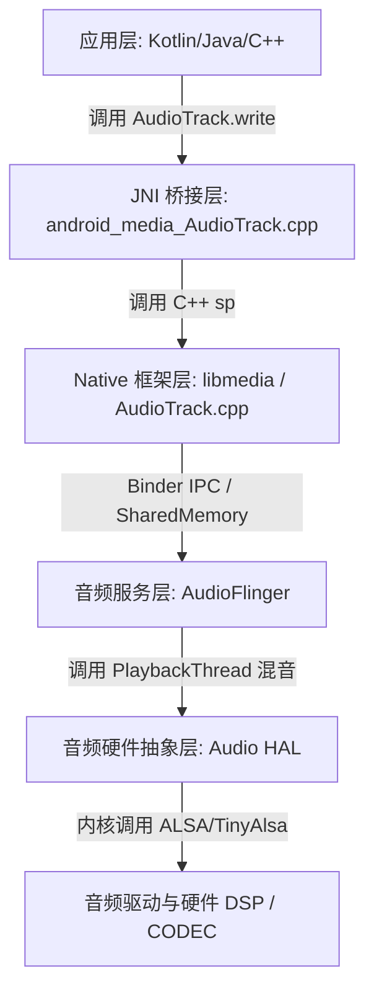
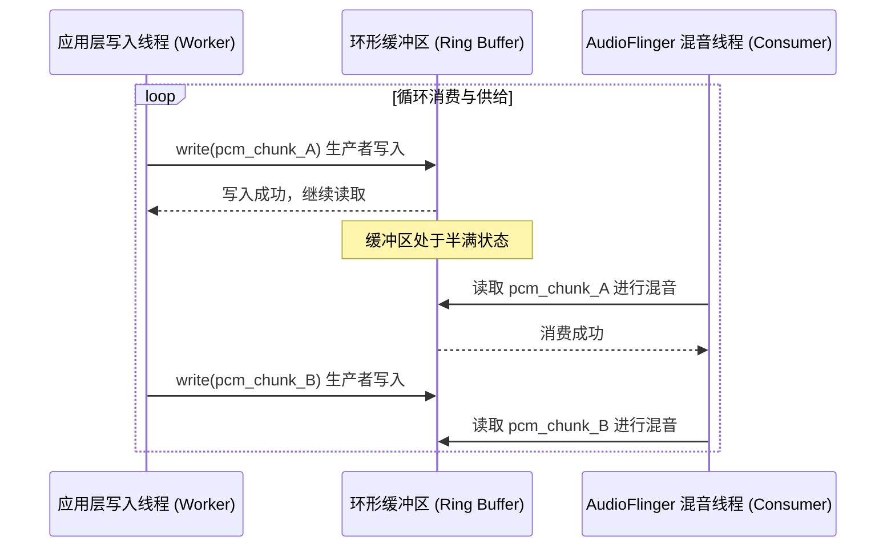
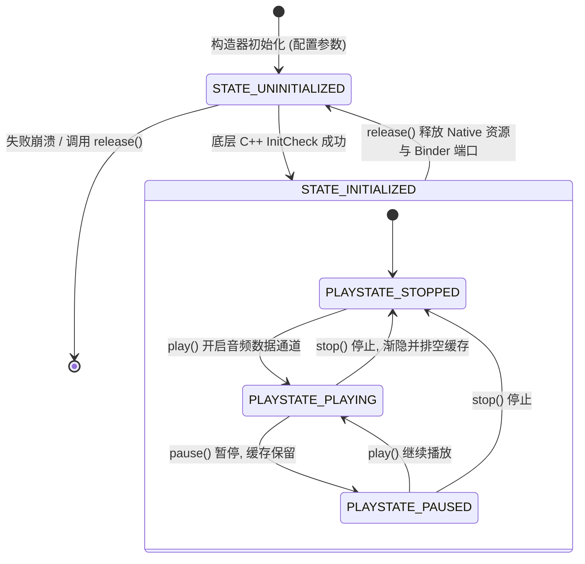
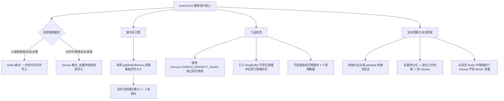

# Android AudioTrack 播放机制详解

在 Android 音频开发领域，[AudioTrack](https://developer.android.com/reference/android/media/AudioTrack) 是进行原始音频流（PCM）渲染的核心组件。不同于封装好的媒体播放器，[AudioTrack](https://developer.android.com/reference/android/media/AudioTrack) 允许开发者直接控制音频数据的写入，从而为低延迟音频播放、实时通信（VoIP）、游戏音频引擎以及自定义音频播放器内核（例如 ExoPlayer 中的音频输出端）提供了硬件级的数据交付通道。

本文将从 Android 软硬件音频架构出发，系统解剖 [AudioTrack](https://developer.android.com/reference/android/media/AudioTrack) 的定义、选型对比、内存运行模式、缓冲区计算、底层混音逻辑、下溢（Underrun）防范，以及状态机控制与内存泄漏防范。

---

## 1. 核心概念：什么是 AudioTrack？

[AudioTrack](https://developer.android.com/reference/android/media/AudioTrack) 是 Android SDK 提供的用于直接将原始脉冲编码调制（PCM）音频数据流写入音频硬件接收器（如扬声器、耳机或蓝牙音频终端）的最低层 Java API。在整个 Android 系统的音频架构中，[AudioTrack](https://developer.android.com/reference/android/media/AudioTrack) 扮演着“数据交付者”的角色。

### 1.1 音频播放的软件层级定位

为了深入理解 [AudioTrack](https://developer.android.com/reference/android/media/AudioTrack) 的底层运行机制，必须了解它在 Android 系统音频框架中的位置。当应用层调用 [AudioTrack](https://developer.android.com/reference/android/media/AudioTrack) 的 `write()` 方法时，数据会跨越多个软件层级最终送达物理硬件：



1. **应用层**：开发者通过 Java/Kotlin 或 NDK (C++) 代码操作 [AudioTrack](https://developer.android.com/reference/android/media/AudioTrack)。
2. **JNI 层**：完成 Java 代码与 Native C++ 核心库之间的映射与类型转换。
3. **Native 框架层**：主要的逻辑实现存在于 Native 层的 `AudioTrack.cpp` 中。在这里，系统会建立客户端缓冲区，并通过 Binder IPC 机制与系统的音频服务进程（Audioserver）建立通信。
4. **AudioFlinger**：这是 Android 系统的音频核心混音与渲染引擎。它接收来自不同进程或相同进程的多个音频流，将它们放入对应的 `PlaybackThread` 中进行混音（Mixer），并应用音效（AudioEffects）。
5. **Audio HAL（硬件抽象层）**：由设备厂商实现的接口层，将 AudioFlinger 输出的统一音频数据转换成特定硬件能理解的控制指令与流数据。
6. **内核与硬件**：基于 ALSA 或 TinyAlsa 框架的音频驱动程序，控制数字信号处理器（DSP）和音频编解码器（Codec）最终输出模拟信号。

因此，[AudioTrack](https://developer.android.com/reference/android/media/AudioTrack) 的本质是**一个面向硬件混音进程（AudioFlinger）的共享内存管理通道**，它不对音频做任何诸如 MP3、AAC 的解码工作，只接受已经解码完成的、立即可播放的 PCM 原始数据。

---

## 2. 选型对比：为什么选择 AudioTrack？

在 Android 平台中，音频播放组件主要有三种：[MediaPlayer](https://developer.android.com/reference/android/media/MediaPlayer)、[SoundPool](https://developer.android.com/reference/android/media/SoundPool) 和 [AudioTrack](https://developer.android.com/reference/android/media/AudioTrack)。理解三者的横向技术指标和使用边界，是架构音频应用的第一步。

### 2.1 播放组件多维度横向对比

| 对比维度 | MediaPlayer | SoundPool | AudioTrack |
| :--- | :--- | :--- | :--- |
| **数据接收类型** | 压缩格式文件（MP3, AAC, OGG 等）或媒体流 | 压缩格式文件或原始 PCM 资源 | 原始裸 PCM 字节/字符数组或 ByteBuffer |
| **内置解码器** | 是（调用 MediaCodec） | 是（在加载资源时在 Native 层预解码） | 否（需要应用层自行提供解码数据） |
| **数据源大小限制**| 几乎无限制，支持超长文件或网络长连接流 | 限制大文件，推荐单文件 < 1MB 且时常较短 | 仅取决于运行模式。大文件推荐 Stream 模式 |
| **播放延迟** | 较高（通常在几百毫秒级别） | 较低（毫秒级，因为数据已预解码在内存中）| 极低（可配置为低延迟通路，直接交付底层） |
| **内存开销** | 较低（流式解码，随播随解） | 极高（所有音频全量以 PCM 形式驻留内存） | 视模式而定：Static 模式高，Stream 模式低且恒定 |
| **控制细粒度** | 粗粒度（只能控制播放、暂停、进度跳转） | 中粒度（支持音量、循环、速率、音效通道等）| 细粒度（支持采样点级修改、混音、底层缓冲区调度） |
| **主要适用场景** | 音乐播放器、视频伴音、常规背景音乐播放 | 游戏音效、按键音、短促的系统提示音 | 实时通话（VoIP）、自定义解码器输出、自研混音引擎 |

### 2.2 选型决策背后的原理分析

* **为什么 MediaPlayer 延迟高？**
  [MediaPlayer](https://developer.android.com/reference/android/media/MediaPlayer) 封装了从“文件读取 -> 协议解析 -> 音视频解复用（Demux） -> 硬件硬解/软解 -> 帧同步 -> 渲染输出”的极长链路。每一个环节都伴随着复杂的线程切换与数据搬运。特别是在网络播放时，[MediaPlayer](https://developer.android.com/reference/android/media/MediaPlayer) 为了防止网络抖动，会设置较大的前置缓冲区（Buffer），这导致其不适合做任何对“触控到发声”响应时间敏感的场景。
* **为什么 SoundPool 适合游戏音效？**
  [SoundPool](https://developer.android.com/reference/android/media/SoundPool) 的底层实质上是基于多个 [AudioTrack](https://developer.android.com/reference/android/media/AudioTrack) 进行的管理。为了获得极低的播放延迟，它在调用 `load()` 方法时，就在 C++ 层开启了解码线程，把 MP3/OGG 等文件全部解码为未经压缩的 PCM 原始数据并加载进物理内存。当调用 `play()` 时，由于数据已经在内存中，系统可以直接向 HAL 抛出，完全避开了磁盘 I/O 和实时解码开销。但这也意味着它绝对不适合播放整首的音乐，因为一首 4 分钟的无损音乐解码成 PCM 会占用约 40MB 以上的宝贵系统内存。
* **为什么 AudioTrack 是自研播放器与 VoIP 的唯一基石？**
  在实时通话（VoIP，如微信视频通话）中，音频数据是通过网络协议（如 RTP）源源不断拉取的，并且需要在播放前进行回声消除（AEC）、降噪（ANS）、增益控制（AGC）以及抖动缓冲区（Jitter Buffer）的平滑处理。这一系列定制化的数字信号处理（DSP）算法必须直接应用在 PCM 数据上。只有 [AudioTrack](https://developer.android.com/reference/android/media/AudioTrack) 提供了可以直接将处理后的 PCM 内存块实时交付硬件的能力。

---

## 3. 实现机制与播放模式：Static 与 Stream

[AudioTrack](https://developer.android.com/reference/android/media/AudioTrack) 提供了两种工作模式：**Static（静态模式）** 与 **Stream（流式模式）**。这两种模式在底层的数据传输通道、内存分配机制和适用范围上有本质的区别。

### 3.1 Static 静态模式的内存与传输机制

在 **Static 模式**下，[AudioTrack](https://developer.android.com/reference/android/media/AudioTrack) 会在初始化时向系统音频服务申请一块固定大小的共享内存空间。开发者必须在播放开始之前，一次性将所有的 PCM 音频数据全部通过 `write()` 拷贝到这块内存中。

```
[应用进程客户端内存] ──(一次性 write 写入)──> [系统共享内存 SharedMemory (物理内存驻留)] ──(直接拉取混音)──> [AudioFlinger 播放线程]
```

* **低延迟优势**：播放过程中，由于数据已经完整存在于共享内存中，系统直接在混音线程中拉取数据，避免了应用层进程与 Audioserver 进程之间的多次上下文切换和 Binder 跨进程数据传递，因而能实现最低的启动延迟。
* **资源消耗与限制**：
  * **内存开销严重**：在 Static 模式下，整段音频数据会一直常驻在内存中，直到 [AudioTrack](https://developer.android.com/reference/android/media/AudioTrack) 被显式释放。
  * **Binder 传输限制**：如果一次性写入的数据量过大，可能会超过 Binder 共享内存分配的物理上限（通常受设备 RAM 及系统堆栈限制），从而引发内存分配失败（Out of Memory）或 Native 初始化崩溃。
* **主要适用场景**：游戏中的按键音效、短促警报声、反复循环的超短音频片段（如 1~3 秒以内的音频）。

### 3.2 Stream 流式模式的双缓冲模型

在 **Stream 模式**下，[AudioTrack](https://developer.android.com/reference/android/media/AudioTrack) 采用类似于双缓冲区或环形队列的循环消费机制。应用层需要建立一个独立的写入工作线程（Worker Thread），源源不断地从数据源（如本地文件或网络套接字）读取 PCM 块，然后通过阻塞或非阻塞的 `write()` 调用送入 [AudioTrack](https://developer.android.com/reference/android/media/AudioTrack) 的缓冲区。



* **低内存占用**：即使播放长度为数小时的音频流，[AudioTrack](https://developer.android.com/reference/android/media/AudioTrack) 也只需要维持一个几千或几万字节的小型环形缓冲区，内存开销恒定。
* **对系统调度的高度敏感性**：如果应用层的 Worker Thread 受到系统 GC、CPU 抢占或磁盘 I/O 阻塞的影响，导致无法及时往环形缓冲区中写入新的 PCM 块，而底层的混音线程却在严格按照时钟周期持续消费数据，就会导致缓冲区数据枯竭。这种情况称为**下溢（Underrun）**。
* **主要适用场景**：音乐播放器、网络收音机、实时网络通话、长视频播放的伴音。

---

## 4. 初始化参数与硬件对齐计算

初始化一个 [AudioTrack](https://developer.android.com/reference/android/media/AudioTrack) 实例看似简单，但其底层的参数校验和硬件兼容逻辑极其严格。

在 Android 5.0（API 21）及以后，官方引入了 [AudioAttributes](https://developer.android.com/reference/android/media/AudioAttributes) 与 [AudioFormat](https://developer.android.com/reference/android/media/AudioFormat) 来更规范地描述音频的播放属性，取代了原本的数值常量。关于 Android 5.0 (API 21) 对音频框架的这一重要演进设计，可以参考底层的适配规范：[AndroidVersionChangeLog.md](../../../../../AndroidVersionChangeLog.md#android-50--51api-21--22)。

### 4.1 关键初始化参数解析

在使用 [AudioTrack.Builder](https://developer.android.com/reference/android/media/AudioTrack.Builder) 初始化时，需要指定以下核心物理参数：

```kotlin
val audioTrack = AudioTrack.Builder()
    .setAudioAttributes(
        AudioAttributes.Builder()
            .setUsage(AudioAttributes.USAGE_MEDIA) // 播放场景：多媒体媒体播放
            .setContentType(AudioAttributes.CONTENT_TYPE_MUSIC) // 数据类型：音乐
            .build()
    )
    .setAudioFormat(
        AudioFormat.Builder()
            .setSampleRate(44100) // 采样率：44.1kHz
            .setChannelMask(AudioFormat.CHANNEL_OUT_STEREO) // 声道：立体声双声道
            .setEncoding(AudioFormat.ENCODING_PCM_16BIT) // 格式：PCM 16位 (2字节)
            .build()
    )
    .setBufferSizeInBytes(minBufferSize) // 物理缓冲区大小
    .setTransferMode(AudioTrack.MODE_STREAM) // 播放模式：流式
    .build()
```

1. **Usage & ContentType**：指示系统该音频流使用意图，系统会根据它分发到不同的物理音频通路，并适用不同的混音路由策略（例如，`USAGE_ALARM` 会输出至闹钟声道，即使插上耳机，也会同时从外放发声）。
2. **SampleRate（采样率）**：每秒对声音信号的采样次数。常见采样率有 `44100Hz`（CD音质）和 `48000Hz`（影视级）。如果传入了硬件不支持的采样率，Android 的 `AudioResampler` 会在 Native 层进行重采样转换，但这会消耗 CPU 资源并可能带来微弱的音质损耗。
3. **ChannelMask（声道掩码）**：如 `CHANNEL_OUT_MONO`（单声道）、`CHANNEL_OUT_STEREO`（双声道立体声）。它决定了底层声道映射寄存器的通道分布。
4. **Encoding（数据精度/位深）**：
   * `ENCODING_PCM_16BIT`：最通用的位深，每个采样点占 2 字节（16位短整型）。
   * `ENCODING_PCM_8BIT`：每个采样点占 1 字节（无符号 8位，音质较差，有明显的量化噪声）。
   * `ENCODING_PCM_FLOAT`：（Android 5.0+ 引入）每个采样点占 4 字节单精度浮点数。这在处理高动态范围音频和音效合成算法时能有效避免精度截断带来的数字失真。

### 4.2 为什么必须使用 getMinBufferSize()？

在设置 `bufferSizeInBytes` 时，**绝对不能随意填写任意字节数**。系统对这块缓冲区有极强的硬件级对齐限制。

Android 设备的音频硬件芯片是通过 DMA（直接内存访问）在特定的中断周期（Interrupt Period）内批量搬运数据的。如果应用层创建的缓冲区大小不符合硬件搬运的要求，例如缓冲区比硬件一个搬运周期还要小，或者无法整除硬件的帧大小，会导致音频播放立刻失败，在 Java 层抛出 `IllegalArgumentException` 或 `Initialization failed`。

为了保证兼容性，必须调用 `AudioTrack.getMinBufferSize(int sampleRateInHz, int channelConfig, int audioFormat)`：

* **底层实现原理**：
  在 C++ 层的 `AudioTrack.cpp` 中，该方法会通过 Binder 跨进程向 `AudioFlinger` 发起查询，询问当前音频路由通路（如耳机、扬声器）所归属的 HAL 驱动模块的最小周期缓冲区帧数（`FrameCount`）。
  
  一个音频帧（Frame）的字节数计算公式为：
  
  $$\text{FrameSize} = \text{ChannelCount} \times \text{BytesPerSample}$$
  
  系统会将 HAL 建议的最小帧数乘以 `FrameSize`，再结合双缓冲区（Double Buffering）或三缓冲区（Triple Buffering）的安全系数，换算成应用层可以使用的物理字节数。

* **开发最佳实践**：
  `getMinBufferSize()` 获取的是硬件维持正常播放的**绝对最小值下限**。如果在实际开发中，直接将该返回值作为 [AudioTrack](https://developer.android.com/reference/android/media/AudioTrack) 的缓冲区大小，只要应用层线程稍微出现一两毫秒的调度延迟，就会发生 Underrun（下溢）爆音。
  
  **因此，在实践中，通常建议将最小缓冲区扩大 2 倍或 4 倍**：
  
  ```kotlin
  val minBufferSize = AudioTrack.getMinBufferSize(sampleRate, channelConfig, audioFormat)
  if (minBufferSize == AudioTrack.ERROR || minBufferSize == AudioTrack.ERROR_BAD_VALUE) {
      // 硬件参数不支持，回退或报错
  } else {
      val actualBufferSize = minBufferSize * 2 // 扩大一倍提供容错裕量
  }
  ```

---

## 5. 底层混音缓冲与下溢（Underrun）防范机制

在流式音频播放过程中，音频断断续续、出现“滋啦”的电流杂音或高频“爆裂”声是多媒体开发者面临的最常见痛点。这些现象在底层往往指向同一个问题：**音频下溢（Audio Underrun）**。

### 5.1 音频下溢（Underrun）的本质成因

为了理解下溢，我们需要俯瞰 `AudioFlinger` 硬件输出线程的工作模型。

硬件音频 CODEC（编解码器）类似于一条每隔特定毫秒（例如 5ms~20ms，称为一个 Period）就必须“吃”一次数据的传送带。它直接向 DMA 物理缓冲区索要音频帧。

```
                    [ 共享内存环形缓冲区 (Shared Memory Buffer) ]
                             │                      ▲
                             │ 消费 (以固定周期)      │ 写入 (异步、受系统调度影响)
                             ▼                      │
             [ AudioFlinger PlaybackThread ]   [ 应用端 Worker 线程 ]
                             │                      │
                             ▼                      └─ 遇到 GC / CPU 抢占 / I/O 卡顿 (导致超时)
                       [ 硬件 DMA ]
                             │
                             ▼
                        ( 输出物理音频 )
```

1. **正常状态**：应用端的 Worker 线程快速写入，共享内存缓冲区一直保持有数据富余（如 60% 填充度）。`AudioFlinger` 每次读取都能顺利取到对应的 PCM 数据并送往 DMA，播放声音流畅。
2. **下溢状态**：若应用进程突然遇到垃圾回收（GC Garbage Collection）、主线程阻碍、磁盘 I/O 卡顿，或者因为网络丢包导致解压出来的 PCM 临时中断。导致写入线程在整整一个消费周期内，都没能调用 `AudioTrack.write()` 写入新数据。
3. **硬件的表现**：共享内存中的可读数据瞬间降为零。`AudioFlinger` 的混音线程在读取时拿不到数据。为了保护硬件寄存器不发生突变，底层音频驱动别无选择，只能采用以下两种处理方案：
   * **静音填补（Zero-fill）**：向硬件输出零电平数据。
   * **帧复制（Frame Repeat）**：直接重复播放上一个周期中的最后一帧。
4. **听觉现象**：波形在瞬间由于数据断裂发生阶跃或强行归零，这会导致扬声器纸盆发生不自然的剧烈位移，在声学上表现为**高频爆裂音（Pop-click）**，也就是用户抱怨的“电流杂音”或“卡顿滋啦声”。

### 5.2 如何监控与诊断下溢

* **看 Logcat 日志**：
  当设备发生下溢时，Android 系统的底层音频引擎会在系统的 `logcat` 日志中高频抛出类似如下的系统警告：
  ```log
  W/AudioFlinger: RecordThread: underrun on fast track 0x7f0e3400
  W/AudioTrack: write() returned 0, underrun?
  ```
* **使用 API 29 诊断工具**：
  从 Android 10 (API 29) 开始，[AudioTrack](https://developer.android.com/reference/android/media/AudioTrack) 引入了更多性能度量指标。开发者可以通过统计监听器获取下溢次数，便于线上做性能监控。更多关于 Android 10 (API 29) 演进的变化可以查阅 [AndroidVersionChangeLog.md](../../../../../AndroidVersionChangeLog.md#android-10api-29)。
  
  通过 [AudioTrack.getUnderrunCount()](https://developer.android.com/reference/android/media/AudioTrack#getUnderrunCount()) 我们可以直接查询当前生命周期中发生下溢的累计次数：
  
  ```kotlin
  if (Build.VERSION.SDK_INT >= Build.VERSION_CODES.N) {
      val underruns = audioTrack.underrunCount
      if (underruns > 0) {
          Log.w("AudioTrack", "检测到音频数据下溢次数: $underruns. 硬件已经发生卡顿或电流声!")
      }
  }
  ```

### 5.3 防御式架构设计：如何杜绝下溢爆音？

防范音频下溢，需要保证“生产者进程”的绝对稳定与高效。以下是主流音视频引擎（如 WebRTC、ExoPlayer）所采用的标准规避方案：

#### 方案一：独立的、高优先级的 Native 写入线程
千万不要在应用的主线程、甚至普通的 Java 线程池中进行音频写入。建议使用自定义的 [HandlerThread](https://developer.android.com/reference/android/os/HandlerThread)，并在初始化时将其设为音频级高优先级：

```kotlin
val audioThread = HandlerThread("AudioPlaybackThread").apply {
    // 设置线程优先级为 AUDIO，让内核调度器优先给予 CPU 时间片
    priority = Process.THREAD_PRIORITY_AUDIO 
}
audioThread.start()
val audioHandler = Handler(audioThread.looper)
```
如果是在 Native（C++）层，应通过 `pthread_setschedparam` 将线程设置为实时调度策略（`SCHED_FIFO`），让音频渲染获得与系统界面刷新同等甚至更高的响应特权。

#### 方案二：引入平滑环形缓冲区（Ring Buffer）与双缓冲策略
在数据源（如网络 Socket）与 [AudioTrack](https://developer.android.com/reference/android/media/AudioTrack) 之间建立一个线程安全的环形无锁 FIFO 缓冲区。
* 写入线程只管往 FIFO 写入网络拉取并解码好的 PCM。
* 播放线程（`AudioPlaybackThread`）以恒定频率（如每 20ms 一次）从 FIFO 读取固定大小的数据块写入 [AudioTrack](https://developer.android.com/reference/android/media/AudioTrack)。
* 这样即使网络有短暂的抖动，只要 FIFO 缓冲区内还有富余数据，播放端就不会感知，有效平滑了网络时延产生的下溢。

#### 方案三：动态水位线与预缓存策略
类似于视频播放的“加载中”机制。在刚启动播放或发生下溢后，不要立刻调用 `audioTrack.play()`，而是先保持在暂停或静默状态，允许写入线程往缓冲区里“预存” 3 个 `minBufferSize` 以上的数据（相当于设置一条安全起跑线），然后再开启播放。

---

## 6. 常见误区与最佳实践

[AudioTrack](https://developer.android.com/reference/android/media/AudioTrack) 内部的状态转换和底层资源管理非常敏感，使用不当极易导致系统级崩溃或严重的内存泄漏。

### 6.1 AudioTrack 状态机流转

[AudioTrack](https://developer.android.com/reference/android/media/AudioTrack) 有两套状态机制：**初始化状态（State）** 与 **播放状态（PlayState）**。

* **初始化状态（State）**：
  * `STATE_UNINITIALIZED`：对象创建中，或者参数非法导致 Native 实例化失败。
  * `STATE_INITIALIZED`：构造成功，底层 Binder 共享内存建立就绪。
* **播放状态（PlayState）**：
  * `PLAYSTATE_STOPPED`：停止状态，不播放。
  * `PLAYSTATE_PLAYING`：正在向混音线程泵入数据。
  * `PLAYSTATE_PAUSED`：暂停状态。

下图详细展示了 [AudioTrack](https://developer.android.com/reference/android/media/AudioTrack) 的状态流转图：



#### 常见状态机调用崩溃分析
* **未初始化状态下直接 write 崩溃**：
  如果传入的参数（例如声道数、位深格式）不被当前硬件支持，构造函数并不会直接抛出异常，而是让对象处于 `STATE_UNINITIALIZED` 状态。如果紧接着调用 `play()` 或 `write()`，Java 虚拟机会立刻抛出 `IllegalStateException: play() called on uninitialized AudioTrack`。
  
  **最佳实践：在创建完实例后，必须显式调用 `getState()` 进行防御性校验：**
  ```kotlin
  if (audioTrack.state != AudioTrack.STATE_INITIALIZED) {
      throw IllegalStateException("AudioTrack 初始化失败，请检查采样率、位深和缓冲区参数")
  }
  ```

* **stop() 与 pause() 的底层差异**：
  * 调用 `pause()` 时，[AudioTrack](https://developer.android.com/reference/android/media/AudioTrack) 立即切断与 `AudioFlinger` 混音线程的信号连接，缓冲区内未播放的数据保留在内存中。当再次调用 `play()` 时，会无缝接着上次的断点播放。
  * 调用 `stop()` 时，[AudioTrack](https://developer.android.com/reference/android/media/AudioTrack) **不会立刻停止发声**，而是处于一个渐出的排空状态。底层混音线程会继续消费缓冲区中残存的 PCM 数据，直到全部播完，才会彻底置播放状态为 `PLAYSTATE_STOPPED`。如果在 stop 后想要立即释放，应该在确认缓冲区排空后再处理。

---

## 7. 资源释放与内存泄漏防范（避坑重灾区）

与普通的 Java 对象不同，[AudioTrack](https://developer.android.com/reference/android/media/AudioTrack) 底层依赖着极其繁重的 Native 资源，包括：
1. C++ 层 `sp<AudioTrack>` 的强引用实例。
2. 跨进程 Binder 通信链路中的各个端点（`Track` 控制块）。
3. 专门开辟用于进程通信的 `SharedMemory` 物理共享内存块。

### 7.1 Native 端端口泄露的灾难性后果

在系统的 `Audioserver` 进程中，能够同时开启的 AudioTrack 实例数量是**有物理上限的**（在较老或定制的 Android 驱动层，最多只允许 32 到 256 个并发活动通道）。

如果开发者每次需要播放音频都去 `new AudioTrack`，而在播放结束后，**只将其 Java 变量置为 `null`，或者仅仅调用 `stop()` 而没有显式调用 `release()`**，就会发生严重的 **Native 端口泄露**。

* **泄露的后果**：
  Java GC 只能回收 JVM 堆内存中的壳对象（Java AudioTrack），却无法强行回收 Native C++ 层的强指针引用以及 AudioFlinger 端已经分配的共享内存和通道端口。
  
  随着运行时间推移，当应用再次尝试播放音频时，系统便会报如下的底层错误，并直接导致新创建的 [AudioTrack](https://developer.android.com/reference/android/media/AudioTrack) 无法初始化：
  ```log
  E/AudioTrack: AudioFlinger could not create track, status: -22
  E/AudioTrack: InitCheck() failed, status: -12
  ```
  严重时，泄露的 Binder 引用累积过多会导致系统的 Audioserver 进程因为系统级 Out-Of-Memory 或 Binder 文件描述符枯竭而发生异常重启（系统表现为瞬间无声，所有正在播放音频的应用闪退）。

### 7.2 安全销毁释放范式

为了绝对避免端口泄漏与 Native 内存常驻，音频释放操作必须遵循一套完整的、健壮的“先停、后排、再释、防抖”逻辑。以下是商业级音频应用中通用的安全释放模板：

```kotlin
class SafeAudioPlayer {
    private var mAudioTrack: AudioTrack? = null
    private var mPlayThread: Thread? = null
    @Volatile
    private var mIsPlaying = false // 线程可见的停止标志位

    fun stopAndRelease() {
        mIsPlaying = false // 1. 立刻阻断写入线程的循环逻辑，防止向已被释放的 Track 写入数据
        
        // 2. 中断并等待写入工作线程安全退出
        mPlayThread?.interrupt()
        try {
            mPlayThread?.join(500) // 等待主工作线程退出，超时时间为500ms
        } catch (e: InterruptedException) {
            Log.e("AudioPlayer", "等待写入线程退出中断: ${e.message}")
        }
        mPlayThread = null

        // 3. 释放 AudioTrack 的底层 Native 资源
        mAudioTrack?.let { track ->
            try {
                // 如果当前处于播放中，先将其停止
                if (track.playState == AudioTrack.PLAYSTATE_PLAYING) {
                    track.stop() 
                }
            } catch (e: IllegalStateException) {
                Log.e("AudioPlayer", "停止播放状态异常: ${e.message}")
            } finally {
                // 必须在 finally 块中确保执行 release() 释放 Native 句柄
                track.release()
                mAudioTrack = null
                Log.d("AudioPlayer", "AudioTrack Native 端口与共享内存已彻底释放。")
            }
        }
    }
}
```

* **为什么要先置 `mIsPlaying = false` 并 join 写入线程？**
  如果直接在主线程调用 `audioTrack.release()`，而此时工作线程可能刚好执行到 `audioTrack.write()` 语句。由于底层 C++ 内存空间已经被销毁回收，`write` 方法会写入一块已经被释放的无效物理地址，这会触发系统的 `SIGSEGV`（段错误），导致应用进程闪退（Native crash）。
* **为什么必须在 finally 中调用 release()？**
  为了防止在停止过程中由于音频底层状态机异常（例如在被拉起前就调用了 stop）抛出 `IllegalStateException`，导致执行流程中断而跳过了 `release()`，造成 Native 内存和 Binder 资源彻底泄露。

---

## 8. 总结：AudioTrack 实战设计思维导图

为了帮助开发者在架构音频系统时能有清晰的认知，我们将 [AudioTrack](https://developer.android.com/reference/android/media/AudioTrack) 的关键选型与避坑策略整理成如下导图：



通过合理计算缓冲区大小、严格规范工作线程调度、结合无锁环形队列平滑网络抖动、并在释放阶段周密保障线程同步与 native 端口回收，开发者即可充分发掘 [AudioTrack](https://developer.android.com/reference/android/media/AudioTrack) 带来的超低时延与强悍的定制化播放性能，构建稳定、高效的 Android 专业音频渲染引擎。
