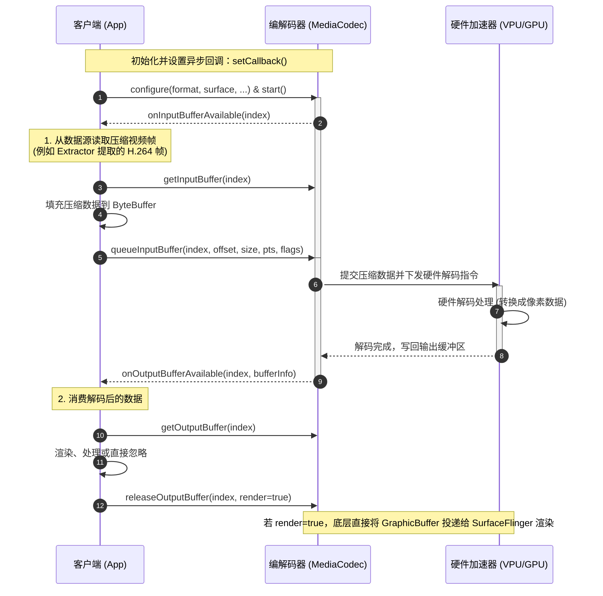

# 5.1.6.2.3 视频编解码

视频编解码是 Android 多媒体架构中最为核心、复杂的模块之一。它不仅涉及到计算机视觉、信息论等算法层面的图像压缩技术，还深深植根于 Android 底层的图形系统、内核驱动（如 ION / DMA-BUF）以及硬件抽象层（HAL）。在日常的视频播放器开发、实时音视频通信（RTC）、短视频录制与剪辑等业务场景中，开发者需要面对软硬件解码选择、多路解码器资源竞争、视频渲染零拷贝优化、码率波动控制以及机型适配等诸多工程挑战。

本篇文档将从视频压缩的基础概念出发，深入剖析软硬解的物理设计取舍，详细推导 MediaCodec 的视频缓冲区工作流与基于 Gralloc / BufferQueue 的 Surface 硬件零拷贝机制，并给出编码参数优化策略与常见误区避坑指南。

---

## 1. 核心概念（是什么）

### 1.1 视频压缩的必要性与 YUV 带宽计算
人类对高清视频的追求带来了极大的网络带宽与存储压力。如果直接传输或存储未经压缩的原始视频数据（裸流），其体量是现代网络基础设施无法承受的。

以常见的 **1080p 60fps 8-bit YUV420 格式** 视频为例，其每秒的原始数据量（码率）计算如下：
* **分辨率**：$1920 \times 1080$ 像素
* **帧率**：$60$ 帧/秒
* **像素格式**：YUV420。在 YUV420 采样中，每个像素平均占用 $1.5$ 字节（每个像素有 1 字节的 Y 分量，每 $2 \times 2$ 的 4 个像素共享一对 U 和 V 分量，即 $4 \text{ Bytes Y} + 1 \text{ Byte U} + 1 \text{ Byte V} = 6 \text{ Bytes}$，平摊到每个像素为 $6 \div 4 = 1.5 \text{ 字节}$）。
* **量化步长**：$8$-bit（1 字节）

$$\text{码率 (Bitrate)} = 1920 \times 1080 \times 1.5 \text{ 字节} \times 60 \text{ 帧/秒} \times 8 \text{ bits/字节} \approx 1,492,992,000 \text{ bps} \approx 1.49 \text{ Gbps}$$

一个仅 10 秒的 1080p 60fps 原始视频，其体积将达到约 **1.86 GB**。而在经过 H.264 或 H.265 标准压缩后，相同画质的视频码率通常仅需 **4 Mbps - 8 Mbps**，压缩比高达 **200:1** 甚至更低。这便是视频编解码存在的核心物理意义：**通过消除数据冗余，实现海量图像信息的高效传输与存储**。

### 1.2 空间冗余与时间冗余的消除原理
视频本质上是由一连串在时间上连续的图像帧组成的。要对其进行高达数百倍的压缩，主要依赖于消除以下两类冗余：

1. **空间冗余（Spatial Redundancy）与帧内预测（Intra-frame Prediction）**：
   * **原理**：单张图像内部，相邻像素之间的颜色和亮度往往具有高度相关性（例如一片蓝天、一堵白墙）。
   * **消除方式**：采用**帧内预测**。编码器根据当前块周围已编码像素的数值，预测当前块的像素值，仅对预测值与真实值之间的差值（残差，Residual）进行变换、量化和熵编码，从而极大地减少了空间冗余信息。

2. **时间冗余（Temporal Redundancy）与帧间预测（Inter-frame Prediction）**：
   * **原理**：相邻的图像帧之间，除了运动物体的微小位移外，背景等大部分区域几乎是完全一致的。
   * **消除方式**：采用**帧间预测**。通过**运动估计（Motion Estimation）**在先前已编码的参考帧中寻找与当前块最相似的匹配块，计算出指向该块的**运动矢量（Motion Vector）**，并仅对运动矢量和残差进行编码。这使得多张画面的信息可以被浓缩为少量的位移指针与极小的微调残差。

```
  帧 1 (I 帧)          帧 2 (P 帧)          帧 3 (P 帧)
+------------+       +------------+       +------------+
|   [背景]   |       |   [背景]   |       |   [背景]   |
|            | ----> |            | ----> |            |
|   [球 A]   |  运动 |     [球 A] |  运动 |       [球 A]
+------------+       +------------+       +------------+
  (完全编码)           (仅编码运动            (仅编码运动
                       矢量和残差)            矢量和残差)
```

### 1.3 I 帧、P 帧、B 帧的物理定义与 GOP
根据消除冗余手段的不同，视频编码标准将图像帧分为以下三类：

* **I 帧（Intra-coded picture，关键帧/帧内编码帧）**：
  * **特点**：不依赖任何其他帧，仅利用单张画面内部的空间相关性进行独立压缩。
  * **作用**：I 帧相当于一张高质量的静态图片，是解码的起点。任何视频流的随机寻道（Seek）、快进或网络流首帧渲染，都必须从 I 帧开始解码。
* **P 帧（Predictive-coded picture，前向预测帧）**：
  * **特点**：依赖于时间轴上位于其**先前**的某个 I 帧或 P 帧进行差值预测编码。
  * **压缩比**：中等，显著高于 I 帧。
* **B 帧（Bi-directionally predictive-coded picture，双向预测帧）**：
  * **特点**：同时依赖于时间轴上位于其**先前**和**后续**的 I 帧或 P 帧进行双向插值预测。
  * **压缩比**：最高，是三种帧中占用空间最小的。
  * **局限性与设计取舍**：因为 B 帧解码需要用到“未来的帧”，所以编码输出和解码输入的顺序（DTS，Decoding Time Stamp）会与实际播放渲染的顺序（PTS，Presentation Time Stamp）不一致。这引入了**额外的解码重排延迟（Reordering Delay）**。在 RTC 实时音视频会议、低延迟直播（如赛事直播推流）等对时延极其敏感的场景中，**通常必须禁用 B 帧**，以换取极低的物理延迟。

**GOP（Group of Pictures，画面组）**：
GOP 是指两张相邻 I 帧之间的图像序列（包含这中间所有的 P 帧和 B 帧）。GOP 的大小（GOP Size，通常用帧数表示，如 30 或 60 帧）直接决定了视频的寻道粒度与压缩效率。GOP 越大，B/P 帧比例越高，视频压缩率越高，但在 Seek 时需要向前寻找 I 帧并逐帧解码的开销也越大。

### 1.4 主流视频编码标准定位
* **H.264 / AVC**：
  * **状态**：目前普及率最高、兼容性最完美的视频编码标准。
  * **定位**：几乎所有 Android 设备都内置了 H.264 的硬件编解码器。在需要考虑旧设备兼容性、低端机覆盖的业务中，H.264 依然是绝对的首选。
* **H.265 / HEVC**：
  * **状态**：H.264 的继承者。
  * **定位**：在相同的视觉质量下，比 H.264 节省约 30% - 50% 的带宽。然而，H.265 饱受专利授权费争议的困扰，导致 Android 生态中的硬件解码支持存在一定的碎片化（尤其是在低端山寨平板或极老机型上）。
* **AV1**：
  * **状态**：由 AOMedia（开放媒体联盟）主导的开源、免版税的下一代视频编码标准。
  * **定位**：压缩效率甚至优于 H.265。由于开源特性，它受到了 Google 的大力推广。自 Android 14 开启（详细适配及版本变迁参见 [AndroidVersionChangeLog.md](../../../../../AndroidVersionChangeLog.md)），Google 开始要求满足特定硬件规格的新发布设备必须内置 AV1 硬件解码器。目前正处于从软件解码向硬件加速过渡的红利期。

---

## 2. 物理设计取舍（为什么）

在 Android 多媒体开发中，视频编解码器的实现分为 **软件解码（软解）** 与 **硬件解码（硬解）** 两种物理路径。这两者在计算资源消耗、功耗发热、兼容性边界等维度上表现出完全相反的物理特性。

### 2.1 软解与硬解的全方位物理对比

| 物理维度 | 软件解码 (Software Decoding) | 硬件解码 (Hardware Decoding) |
| :--- | :--- | :--- |
| **执行载体** | CPU 通用计算核心（运行 C/C++ 优化的解码库如 FFmpeg / libopenh264） | SoC（系统级芯片）上的专用媒体加速协处理器（VPU） |
| **CPU 占用率** | **极高**。需要大量的算术运算进行反量化、反变换和运动补偿。 | **极低**。CPU 仅负责数据调度、控制信令发送与状态回调，占比通常在 5% 以下。 |
| **能耗与发热** | **高能效比极差**。CPU 长时间高负载运转，电池消耗极快，手机温度迅速升高，易导致系统限频和整机卡顿。 | **极佳的能效比**。专用电路针对编解码算法进行了定制化硬件固化，功耗比 CPU Low 10 - 20 倍，几乎不发热。 |
| **并发多路限制** | 理论上不受通道数限制，仅受 CPU 总算力和内存带宽约束。 | **物理受限**。SoC 内部的硬件解码器实例数量（Instance Limit）是固定的，超出物理上限会直接崩溃或分配失败。 |
| **格式与配置支持** | **近乎完美**。只要有对应的解码库源码并编译，即可支持任何格式（如非标分辨率、10-bit Profile 等）。 | **严格受限**。硬解支持的格式在芯片出厂时已固化，无法通过升级软件来支持全新的或不符合规范的视频编码。 |
| **启动延迟** | **较低**。只需初始化 CPU 内存和解码库上下文，初始化过程快速平稳。 | **较高且不稳定**。由于涉及与底层的 HAL 进程（如 MediaCodecService）及硬件驱动进行 Binder 通信和显存申请，首帧耗时较长。 |

### 2.2 工程设计中的 Fallback（降级）策略
由于上述物理特性的差异，在商业级的音视频客户端（如短视频播放器、直播 SDK）中，**绝对不能盲目信任单一解码通路**。必须建立一套完善的硬解优先、软解兜底的 **Fallback 降级设计机制**：

```
                +-----------------------+
                |     开始播放视频      |
                +-----------------------+
                            |
                            v
                +-----------------------+
                |   探测硬件解码能力    |
                |  (动态 Profile/Level) |
                +-----------------------+
                            |
                   +--------+--------+
                   |                 |
                   | 支持            | 不支持 / 超出限制
                   v                 v
        +--------------------+     +--------------------+
        |   初始化硬件解码器  |     |   直接进入软件解码  |
        +--------------------+     +--------------------+
                   |                         |
          +--------+--------+                |
          |                 |                |
          | 成功            | 抛出异常/失败   |
          v                 v                |
   +------------+   +--------------------+   |
   | 硬件解码器 |   | 释放硬解, Fallback |   |
   | 持续渲染   |   | 到软件解码器       | <+
   +------------+   +--------------------+
                            |
                            v
                     +------------+
                     | 软件解码器 |
                     | 持续渲染   |
                     +------------+
```

1. **静态能力探测**：
   在初始化解码器前，通过 `MediaCodecList` 查询当前 SoC 对目标视频格式（MimeType、Profile、Level、分辨率、帧率）的硬解支持情况。如果不满足，提前主动选择软解，避免触发底层驱动崩溃。
2. **动态启动监控**：
   当硬解初始化（`MediaCodec.configure()`）或启动（`MediaCodec.start()`）抛出 `CodecException`、`NullPointerException`（部分奇葩 ROM 驱动实现不规范），或者在首帧解码超时（例如超过 500ms 未输出数据）时，捕获异常并记录日志，同时**立刻销毁硬件解码器，平滑切换至软件解码器（FFmpeg）进行重新拉流**。
3. **运行时异常兜底**：
   硬件解码在运行过程中可能由于系统内存不足、GPU 挂起或多路并发挤占硬件通道而突然报错退出（例如在滑动播放短视频信息流时）。此时必须保持播放器内核状态机的完整，利用已缓存的未解码分片，动态无缝重建软件解码器。

---

## 3. 实现机制与 Surface 零拷贝渲染（怎么做）

在 Android 平台上，视频编解码器的实现是 `MediaCodec`。深入理解其内部缓冲区状态机，以及 Surface 输入/输出模式的硬件零拷贝（Zero-Copy）机制，是实现高性能、低延迟视频处理的基石。

### 3.1 MediaCodec 视频工作流与缓冲区时序流
`MediaCodec` 采用了经典的**双队列（双端缓冲区）异步/同步模型**。它维护了一组 **Input Buffers（输入缓冲区）** 和一组 **Output Buffers（输出缓冲区）**。

* **输入端**：客户端向输入队列申请一个空缓冲区，填充压缩后的视频数据（如 H.264 HAL NAL Unit），然后将其返还给编解码器。
* **输出端**：编解码器处理完毕后，将解码后的原始像素数据（或编码后的压缩包）放入输出队列，向客户端发送可用通知。客户端消费数据后，将缓冲区释放回编解码器。

#### MediaCodec 缓冲区时序流（基于异步 `setCallback`）

以下时序图展示了异步模式下（Android 5.0 引入的 `setCallback`，详细参考 [AndroidVersionChangeLog.md](../../../../../AndroidVersionChangeLog.md)）MediaCodec 的数据流转与客户端的协作过程：



---

### 3.2 Surface 零拷贝渲染机制（硬核深度剖析）
在处理视频编解码时，Android 官方文档极力推荐使用 **Surface 模式**（即编码时使用 `createInputSurface()` 获得输入 Surface，解码时在 `configure()` 中传入目标 Surface），而非传统的 **ByteBuffer 字节数组模式**。这是因为 ByteBuffer 模式存在致命的内存拷贝开销，而 Surface 模式能够实现真正意义上的 **GPU/硬件零拷贝（Zero-Copy）**。

#### 3.2.1 ByteBuffer 模式的致命痛点
在传统的 `ByteBuffer` 模式下，当解码器输出一帧画面时，数据流向需要经历多次内存跨界拷贝与格式转换：

```
+---------------------------------------------------------------------------------------------------+
|                                       ByteBuffer 模式数据通路                                     |
|                                                                                                   |
| [硬件解码芯片(VPU)]                                                                               |
|        |                                                                                          |
|        | (写回显存/物理内存)                                                                      |
|        v                                                                                          |
| [Native 驱动内存 (SoC 独占)]                                                                      |
|        |                                                                                          |
|        | (由 MediaCodec 底层通过 CPU 拷贝到共享内存)                                              |
|        v                                                                                          |
| [Native 共享内存]                                                                                 |
|        |                                                                                          |
|        | (映射/拷贝到 JVM 堆空间)                                                                 |
|        v                                                                                          |
| [Java 虚拟机堆 (byte[])]  <--- 进行复杂的 YUV 格式对齐转换 (如 Stride / Align 对齐像素处理)        |
|        |                                                                                          |
|        | (通过 OpenGL ES Texture 上传，CPU 拷贝)                                                   |
|        v                                                                                          |
| [GPU 纹理内存 (显存)]                                                                             |
+---------------------------------------------------------------------------------------------------+
```

1. **多次 CPU 拷贝**：数据在 VPU 硬件内存、Native 共享内存、JVM 堆内存和 GPU 显存之间来回搬运，导致 CPU 占用率暴增，总线带宽被严重挤占。
2. **像素对齐与格式碎片化（Stride & SliceHeight）**：
   不同 SoC 厂商（如高通、联发科、三星）硬件解码输出的 YUV420 像素排列格式各不相同。有的为了硬件效率，要求每行像素必须以 16、32 甚至 64 字节对齐。这就导致了 `YUV_ColorFormat` 的多样性（如 `COLOR_FormatYUV420SemiPlanar`、`COLOR_QCOM_FormatYUV420SemiPlanar32m` 等）。
   如果使用 `ByteBuffer` 模式，开发者必须在 Java/Native 层手动解析并处理这些“Stride（步长）”与“SliceHeight（切片高度）”的差异。一旦计算错误，画面就会出现绿屏、斜体错位或花屏。

#### 3.2.2 Surface 模式硬件零拷贝原理
在 Surface 模式下，整个系统的底层图形架构是围绕 **BufferQueue（缓冲区队列）** 运作的。其零拷贝的本质是：**传递指针（内存描述符句柄），而非传递像素数据实体。**

```
+---------------------------------------------------------------------------------------------------+
|                                        Surface 零拷贝物理通路                                      |
|                                                                                                   |
|                               +------------------------+                                          |
|                               |   Gralloc 物理内存分配 |                                          |
|                               +------------------------+                                          |
|                                           |                                                       |
|                                           | (分配底层 GraphicBuffer 物理内存)                     |
|                                           v                                                       |
|                           +--------------------------------+                                      |
|                           |      共享的 GraphicBuffer      | <---+                                |
|                           +--------------------------------+     |                                |
|                                   /                  \           |                                |
|  (硬件解码器直接写入像素值，共享指针)  /                    \ (共享指针)  | 硬件同步屏障                    |
|                             v                        v           | (Hardware Fence)               |
|                    +------------------+    +------------------+  | 确保读写安全                   |
|                    | 硬件解码器 (VPU) |    | GPU /渲染器 (SF) |  |                                |
|                    +------------------+    +------------------+  |                                |
|                             |                        |           |                                |
|                             +------------------------+-----------+                                |
|                                                                                                   |
+---------------------------------------------------------------------------------------------------+
```

##### 底层实现细节与核心概念：

1. **BufferQueue 生产者与消费者模型**：
   * **解码场景下**：`MediaCodec` 底层作为**生产者（Producer）**，它持有了 Surface 对应的 `IGraphicBufferProducer` 接口。而系统的图形渲染组件 `SurfaceFlinger`（或者应用进程内的 `GLConsumer`，如 `SurfaceTexture`）则作为**消费者（Consumer）**。
   * **编码场景下**：通过 `createInputSurface()`，`MediaCodec` 作为**消费者**，外界的渲染器（如 OpenGL ES 的 EGLSurface）作为**生产者**直接向其投递画面。

2. **GraphicBuffer 的创建与 Gralloc 分配**：
   当 `MediaCodec` 配置了 Surface 后，它并不自己分配普通的 JVM 字节数组，而是通过 Android 的 **Gralloc（Graphics Allocator）系统服务** 向 Linux 内核驱动申请分配一组 **`GraphicBuffer`**。
   `GraphicBuffer` 指向的是一块可以跨进程共享的物理内存（通常利用 Linux 的 **ION** 或 **DMA-BUF** 内存管理器进行分配）。这块内存可以同时被 CPU 访问、被 VPU（解码芯片）写入、被 GPU 作为纹理采样、以及被显卡显示控制器读取。

3. **Binder 传递的文件描述符（File Descriptor）**：
   当 VPU 解码完毕后，它直接将原始的 YUV/RGB 像素数据写入分配好的 `GraphicBuffer`。随后，`MediaCodec` 底层不会拷贝这块数据，而是将该 `GraphicBuffer` 对应的底层文件描述符（FD）或者物理内存句柄包装进 Binder 调用，投递给 `BufferQueue`。消费者（如 `SurfaceFlinger`）在收到通知后，通过内核驱动直接映射相同的这块物理内存进行读取和合成渲染。
   **整个流转链路没有发生过任何的像素内存拷贝，这就是“零拷贝”的物理本质。**

4. **硬件同步屏障（Hardware Fence）**：
   为了在无拷贝的情况下保证读写安全（防止 VPU 正在写入时 GPU 已经在读取而导致画面撕裂），Android 引入了 **Fence 机制**。
   Fence 是一种轻量级的内核同步对象。当生产者将 `GraphicBuffer` 入队时，会附带一个 `acquireFence`，告知消费者：“只有当这个 Fence 被触发（Signal）时，代表硬件解码写操作真正完成，你才可以开始读取”。当消费者使用完毕后，出队返回缓冲区时，也会附带一个 `releaseFence`，告知生产者：“只有当这个 Fence 触发时，代表 GPU 渲染读操作已结束，你才可以重新写入新的一帧”。

通过这套软硬件协同的底层系统，Surface 模式完美绕过了 JVM 堆内存与 Native 内存之间的屏障，以极佳的效率和近乎零的 CPU 开销完成了高吞吐量的视频渲染。

---

## 4. 编码性能调优（参数优化）

在视频编码（录制、RTC、直播）场景下，如何配置合理的编码器参数，直接决定了输出视频的清晰度、网络传输的流畅度以及编解码器的稳定性。

### 4.1 码率控制模式（Bitrate Control Mode）详解
在配置 `MediaFormat` 时，码率控制模式是一个非常关键的参数。Android 的 `MediaCodecInfo.EncoderCapabilities` 定义了三种主要的控制模式：

```java
// 设置码率控制模式的示例代码
mediaFormat.setInteger(MediaFormat.KEY_COLOR_FORMAT, MediaCodecInfo.CodecCapabilities.COLOR_FormatSurface);
mediaFormat.setInteger(MediaFormat.KEY_BITRATE_MODE, MediaCodec.EncoderCapabilities.BITRATE_MODE_CBR);
```

#### ① CBR (Constant Bitrate) — 固定码率
* **原理**：编码器通过动态调整量化参数（QP），强制输出视频的码率在一个固定的时间窗口内保持相对恒定。
* **物理表现**：
  * 画面简单时（如静态PPT、单色背景）：编码器会强行填充无效数据或使用极小的 QP，造成带宽浪费。
  * 画面极度复杂或剧烈运动时：为了不超出码率上限，编码器只能被迫增大 QP 增大压缩力度，导致画面出现马赛克、模糊。
* **适用场景**：**直播推流、实时音视频（RTC）**。在网络带宽受限且波动敏感的场景下，恒定的码率能保证发送缓冲区的稳定，避免因码率瞬间暴涨导致网络拥塞、丢包和卡顿。

#### ② VBR (Variable Bitrate) — 可变码率
* **原理**：编码器根据画面的复杂度自动调整码率。
  * 画面静止或简单时，降低码率以节省空间。
  * 画面剧烈运动或细节丰富时，瞬间拉高码率以保证画质。
* **物理表现**：整体平均码率维持在设定值附近，但瞬时码率波动极大。画质分配非常合理，人眼感官画质高且平滑。
* **适用场景**：**本地视频录制（如系统相机录像）、短视频剪辑与导出、点播视频压制**。在存储介质足够快的情况下，能以最合理的体积换取最优的画质。

#### ③ CQ (Constant Quality) — 固定质量
* **原理**：编码器完全不限制码率，而是将量化步长（QP）固定在一个特定的高质量参数上。
* **物理表现**：无论画面多么复杂，都保持极高且恒定的画质。当画面极度复杂时，码率会爆发性地飙升到非常恐怖的数值。
* **适用场景**：**高质量视频离线压制**，或者对存储和网络完全不敏感但对画面细节有极致追求的专业视频录制场景。

---

### 4.2 关键帧间隔（I-Frame Interval）的参数计算与调优
关键帧间隔（GOP 长度）决定了视频中 I 帧的密度。在 Android 中通过 `MediaFormat.KEY_I_FRAME_INTERVAL` 设置，单位为秒。

```java
// 设置每 2 秒一个 I 帧
mediaFormat.setInteger(MediaFormat.KEY_I_FRAME_INTERVAL, 2);
```

#### 参数设置策略：
1. **短 GOP（1 - 2 秒）**：
   * **优势**：
     * **快速首帧渲染**：新进入直播间或视频会议的观众，可以快速接收到最新的 I 帧并立即开始解码显示，首帧耗时（FFP）短。
     * **快速 Seek**：在播放器拉动进度条时，能够更精准地定位到用户想要的时间点，避免长时间的画面卡顿或黑屏。
     * **抗丢包性强**：在弱网 RTC 环境下，一旦后续的 P 帧丢失，可以通过下一个快速到来的 I 帧进行图像重构恢复。
   * **劣势**：由于 I 帧的压缩率远低于 P/B 帧，短 GOP 会显著增加整体视频的平均体积。
2. **长 GOP（5 - 10 秒）**：
   * **优势**：极大提升压缩效率，特别适合静态背景比例高的点播视频、电影。
   * **劣势**：Seek 耗时增加，且网络丢包后画面花屏持续时间长。

#### 动态关键帧请求机制：
在实时音视频（RTC）场景中，若网络发生丢包导致接收端画面花屏，接收端会通过 RTCP 反向通道发送 **PLI（Picture Loss Indication，图片丢失指示）** 请求。此时，发送端的编码器需要立刻在当前帧生成一个 I 帧，而不需要等待原定的 `KEY_I_FRAME_INTERVAL` 周期。

从 Android 7.0 (API 24) 开始（详细版本变更参见 [AndroidVersionChangeLog.md](../../../../../AndroidVersionChangeLog.md)），MediaCodec 支持在运行过程中动态请求生成关键帧，其实现代码如下：

```java
// 动态请求编码器立即输出一个关键帧 (Sync Frame)
Bundle params = new Bundle();
params.putInt(MediaCodec.PARAMETER_KEY_REQUEST_SYNC_FRAME, 0);
mEncoder.setParameters(params);
```

---

## 5. 常见误区与避坑指南

### 5.1 硬件解码通道上限（CodecInstance Limit）与崩溃规避
在一些需要同时播放多路视频的场景（如视频监控墙、短视频多图层剪辑轨道、视频会议多画面平铺）中，开发者最容易踩到的硬伤是：**超出 GPU 硬件解码器物理通道上限，导致创建解码器时抛出 `CodecException` 异常。**

#### 崩溃原委：
每颗 SoC（如 Snapdragon 8 Gen2 等）硬件内部能够并行运行的硬解硬件实例（Hardware Decoders）在物理晶圆设计上是有上限的。例如，某些中低端芯片可能仅支持同时解码 **4 路 1080p 30fps** 的视频，或者 **1 路 4K 60fps**。一旦当前系统中已占用的硬件解码实例总数（包括其他应用进程占用的）超出了芯片负载，底层就会抛出如下异常：

```
java.lang.IllegalStateException: MediaCodec.configure() failed
    at android.media.MediaCodec.native_configure(Native Method)
    ...
Caused by: android.media.MediaCodec$CodecException: Error 0xfffffc0e (Insufficient Resource)
```

#### 工程最佳实践：
1. **解码器连接数控制与池化复用（Decoder Pooling）**：
   建立统一的解码器管理中心。在多路播放时，限制最大硬件解码实例数（例如上限设为 4）。当超出上限时，新起的播放实例必须**降级使用软件解码（FFmpeg/vlc）**，或者**暂停处于不可见状态的后台播放器并释放其 MediaCodec 实例**。
2. **异步平滑释放，规避主线程卡死**：
   `MediaCodec.release()` 会涉及到与底层 HAL / 驱动的 Binder 通信并释放物理显存。在某些性能较差的 Android 设备上，这个操作可能会**耗时高达数百毫秒甚至秒级**。
   **切勿在 UI 线程直接调用 `release()`**。应将其包装在专有的后台线程（如 HandlerThread）中异步执行，防止引发主线程 ANR。
3. **彻底释放资源**：
   在组件生命周期处于 `onStop()` 或 `onDestroy()` 时，必须显式调用 `MediaCodec.stop()` 与 `MediaCodec.release()`。仅将引用置为 `null` 是无法让底层 Native 硬件资源立刻回收的，极易引起系统级内存泄漏和后续解码失败。

---

### 5.2 最佳实践：MediaCodecList 动态适配与 Profile/Level 校验
很多初学者在创建编解码器时，习惯使用硬编码名称或通用创建方式：

```java
// 不推荐的写法：可能会创建出低效的软件解码器，或者在某些 ROM 上直接抛出错误
MediaCodec codec = MediaCodec.createDecoderByType("video/avc");
```

这样做存在严重的适配隐患：
* 系统可能会返回一个名为 `OMX.google.h264.decoder` 的**系统软件解码器**。它的性能和功耗表现非常差，无法利用 GPU/VPU 硬件加速。
* 对特定视频的分辨率、Profile 级别超出了当前硬件能力时，调用 `configure()` 会发生崩溃。

#### 优雅适配的完整方案：

通过 `MediaCodecList` 匹配系统最适合的**纯硬件解码器**，并动态校验 Profile / Level 是否支持：

```java
import android.media.MediaCodecInfo;
import android.media.MediaCodecList;
import android.media.MediaFormat;
import android.os.Build;

public class CodecHelper {

    /**
     * 寻找系统中最适合的目标格式硬件解码器名称
     * @param mimeType 视频 MIME（例如 MediaFormat.MIMETYPE_VIDEO_AVC）
     * @return 适合的硬解名称，找不到则返回 null
     */
    public static String findHardwareDecoderName(String mimeType) {
        // 使用 REGULAR_CODECS 过滤出系统标称 of 可用编解码器（Android 5.0+ 支持）
        MediaCodecList codecList = new MediaCodecList(MediaCodecList.REGULAR_CODECS);
        MediaCodecInfo[] codecInfos = codecList.getCodecInfos();

        for (MediaCodecInfo info : codecInfos) {
            // 我们寻找的是解码器 (Decoder)
            if (info.isEncoder()) {
                continue;
            }

            // 过滤掉系统自带的软解（以 OMX.google. 或 c2.android. 开头的大多为软解）
            String name = info.getName();
            if (name.startsWith("OMX.google.") || 
                name.startsWith("c2.android.") || 
                name.toLowerCase().contains("sw") || 
                name.toLowerCase().contains("google")) {
                continue; // 忽略软件解码器
            }

            String[] supportedTypes = info.getSupportedTypes();
            for (String type : supportedTypes) {
                if (type.equalsIgnoreCase(mimeType)) {
                    return name; // 找到了匹配的硬件解码器
                }
            }
        }
        return null;
    }

    /**
     * 动态验证当前硬件解码器是否支持指定的格式规格
     * @param decoderName 解码器名称
     * @param format 目标视频的 MediaFormat
     * @return 是否支持
     */
    public static boolean isFormatSupported(String decoderName, MediaFormat format) {
        try {
            MediaCodecList codecList = new MediaCodecList(MediaCodecList.REGULAR_CODECS);
            for (MediaCodecInfo info : codecList.getCodecInfos()) {
                if (info.getName().equalsIgnoreCase(decoderName)) {
                    String mime = format.getString(MediaFormat.KEY_MIME);
                    MediaCodecInfo.CodecCapabilities caps = info.getCapabilitiesForType(mime);
                    if (caps != null) {
                        // 动态验证 Profile, Level 以及分辨率、帧率
                        return caps.isFormatSupported(format);
                    }
                }
            }
        } catch (Exception e) {
            e.printStackTrace();
        }
        return false;
    }
}
```

通过这一套完整的动态探测与精确创建逻辑，客户端能够在最大程度上榨干设备的硬件解码效能，同时保证了应用在海量碎片化 Android 设备上的运行稳定性。
