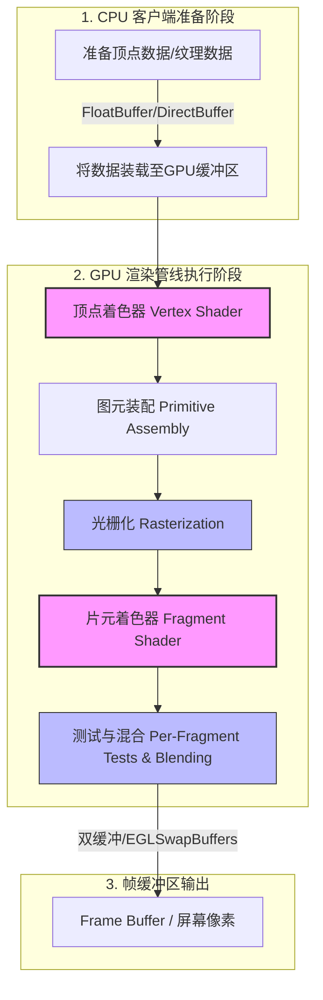

# Android OpenGL 绘制详细机制文档

在 Android 多媒体与图形图像开发中，基于硬件加速的图形绘制是支撑高性能游戏、相机滤镜、音视频特效以及系统流畅 UI 的底层基石。本文将围绕 OpenGL ES 在 Android 中的核心角色、GPU 渲染管线、EGL 桥接机制、GLSL 着色器开发实战、以及多线程与显存优化等维度，对 Android 平台下的 OpenGL 绘制进行全方位、深度的解构与阐述。

---

## 1. 核心概念：什么是 OpenGL ES？

**OpenGL ES (OpenGL for Embedded Systems)** 是 OpenGL 三维图形 API 的子集，专门针对移动端、车载系统、嵌入式设备等资源受限的硬件环境而设计。它由 Khronos Group 联盟定义并维护，是一个**跨语言、跨平台**的免版税硬件加速图形渲染引擎 API 规范。

在 Android 系统中，OpenGL ES 的核心定位如下：
*   **硬件加速的底层支撑**：Android 系统自 Android 3.0 开始引入硬件加速，并在 Android 4.0 之后默认开启。系统渲染引擎 HWUI 内部就是将 Canvas 的 2D 绘制指令转化为 OpenGL ES（在较新 Android 版本中部分演进为 Vulkan）指令，最终递交给 GPU 进行渲染。
*   **客户端-服务端架构**：OpenGL ES 采用典型的客户端-服务端（Client-Server）架构。应用层编写的代码（运行在 CPU 上的 Java/Kotlin/Native 逻辑）作为客户端，通过 OpenGL API 发送渲染状态 and 指令；GPU 硬件及其驱动程序作为服务端，负责接收指令并执行高度并发的几何计算与像素渲染。
*   **状态机设计**：OpenGL 本质上是一个巨大的状态机（State Machine）。在特定上下文（Context）中，所有的参数（如当前绑定的纹理、启用的混合模式、清屏颜色、着色器程序等）都会一直保持，直到被显式地更改。这意味着大部分 API 都是在配置状态机的属性，而实际的绘制操作（如 `glDrawArrays`）则是让状态机根据当前配置去消费缓冲区中的顶点数据。

---

## 2. 设计取舍：为什么要将图形渲染委托给 GPU？

为了满足现代移动设备高刷新率、低延迟的显示要求，Android 系统的图形渲染必须依赖专用的硬件——GPU（Graphics Processing Unit）。这背后是基于 CPU 与 GPU 截然不同的硬件架构设计和计算特性的考量。

### 2.1 CPU 与 GPU 的架构差异

如下图所示，CPU 与 GPU 的微架构（Microarchitecture）存在本质差异，导致它们擅长的计算类型完全不同：

*   **CPU（中央处理器）—— SISD/MIMD 架构，擅长复杂逻辑控制**
    *   **架构特征**：CPU 的设计目标是处理各种复杂的通用计算。它的芯片面积中，很大一部分分配给了复杂的**控制单元（Control Unit，包含分支预测、乱序执行逻辑）**、**大容量的缓存（L1/L2/L3 Cache）**，而用于实际数值计算的**算术逻辑单元（ALU）**数量相对较少。
    *   **核心优势**：极高的时钟频率和强大的分支预测能力，能够以极低的时延处理具有严格前后因果关系、复杂分支判定（if-else）的顺序逻辑代码。
*   **GPU（图形处理器）—— SIMD/SPMD 架构，擅长大规模并发浮点计算**
    *   **架构特征**：GPU 专为高度并行的计算任务而设计。它的芯片面积中，绝大多数都分配给了**成百上千个轻量级的计算核心（ALU）**，而控制单元和缓存被极度压缩，仅保留非常简单的指令分发和局部共享存储。
    *   **核心优势**：通过超高密度的计算核心，在同一时间并行处理成千上万个相同性质的计算任务。GPU 不依赖大缓存和复杂控制来降低单次延迟，而是通过**超高并发（Latency Hiding，延迟隐藏）**来换取极高的吞吐量。

### 2.2 图形渲染任务的物理本质

屏幕显示是一个天然的“像素级并行”问题。我们可以通过以下数据模型直观推导为什么必须将图形渲染委托给 GPU：

假设一台现代 Android 手机的屏幕分辨率为 $1080 \times 1920$（约 207 万像素），当屏幕以 $60\text{Hz}$ 的刷新率工作时：
$$\text{每秒所需计算的像素次数} = 1080 \times 1920 \times 60 \approx 1.24 \times 10^8 \text{ 次 (1.24亿次/秒)}$$

如果面对如今主流的 $120\text{Hz}$ 高刷屏，这个数值将翻倍至 **2.48亿次/秒**。在进行三维游戏、相机滤镜或视频特效时，每个像素的渲染不仅是简单的填色，还需要经过三维坐标变换、纹理采样（Texture Sampling）、多光源光照计算、多图层混合（Blending）等复杂的浮点数运算。

*   **如果使用 CPU 进行渲染**：
    CPU 需要用多层 `for` 循环串行遍历这 200 万个像素。即便在 3.0GHz 且拥有 8 核心的现代 CPU 上，由于频繁的内存访问、低并发能力以及计算指令与控制流的切换，单帧计算时间也将远超系统留给我们的 $16.6\text{ms}$（$60\text{FPS}$）或 $8.3\text{ms}$（$120\text{FPS}$）的时间窗口，导致 CPU 瞬间过载、发热严重、系统界面剧烈卡顿。
*   **如果使用 GPU 进行渲染**：
    由于每个像素的颜色计算是完全独立的（像素 A 的滤镜计算并不依赖像素 B 的计算结果），GPU 能够将 200 万个像素的计算任务分发给成千上万个 ALU 核心并行执行。每个核心只负责极小一部分像素的运算，利用硬件级别的流水线，以极高的效率和能效比在一瞬间完成整张屏幕的像素输出，完美保障了渲染的实时性与流畅度。

---

## 3. OpenGL ES 渲染管线深度解构

OpenGL ES 的渲染管线（Graphics Pipeline）是指**将输入的 3D 顶点数据、纹理数据转换到屏幕上 2D 像素的完整处理流水线**。在现代 OpenGL ES（2.0 及以上版本）中，这条管线是**可编程（Programmable Pipeline）**的，允许开发者编写着色器（Shader）来自定义关键阶段的渲染行为。

下面是 OpenGL ES 渲染管线的核心执行步骤及其时序流程：



### 3.1 管线步骤详解

#### 1. 顶点着色器（Vertex Shader）- **可编程阶段**
*   **物理职责**：对输入的每个顶点（Vertex）执行一次运算。其核心任务是处理顶点的空间位置变换，并可以向管线后续阶段传递纹理坐标、法向量等数据。
*   **数学变换**：顶点着色器最主要的操作是将物体在局部坐标系（Local Space）下的 3D 坐标，乘以 **MVP 变换矩阵**（模型矩阵 Model、观察矩阵 View、投影矩阵 Projection），最终投影变换为裁剪空间（Clip Space）的齐次坐标。
*   **输出**：写入内置变量 `gl_Position`，它表示该顶点在裁剪空间下的 4 维坐标 $(x, y, z, w)$。

#### 2. 图元装配（Primitive Assembly）- **固定功能阶段**
*   **物理职责**：将顶点着色器输出的各个独立顶点，根据指定的绘制模式（如 `GL_POINTS`（点）、`GL_LINES`（线）、`GL_TRIANGLES`（三角形）），组装成一个个基础的几何图元。
*   **裁剪与透视除法**：系统会自动裁剪掉视锥体（View Frustum）外部的几何体。随后进行透视除法（Perspective Division，即将 $x, y, z$ 分量除以 $w$），将坐标转换为归一化设备坐标（NDC，范围为 $[-1.0, 1.0]$）。最后，将 NDC 坐标映射到通过 `glViewport` 指定的 2D 屏幕视口坐标上。

#### 3. 光栅化（Rasterization）- **固定功能阶段**
*   **物理职责**：光栅化是将连续的几何图元（如一个三角形）离散化为由一个个“片元（Fragment）”组成的二维网格的过程。
*   **插值生成**：在此阶段，网格上的每个片元都会根据顶点的属性（如颜色、纹理坐标），通过双线性插值（Bilinear Interpolation）计算出自己位置所对应的属性值。片元包含了当前像素位置、深度值、插值后的属性等信息，是等待被计算最终颜色的“候选像素”。

#### 4. 片元着色器（Fragment Shader）- **可编程阶段**
*   **物理职责**：针对光栅化产生的每一个片元执行一次运算。它的核心目标是计算出当前片元的最终颜色值（RGBA）。
*   **核心计算**：通过纹理采样器（Sampler）对绑定的图片纹理进行采样，结合光照数学模型、半透明混合等，处理像素特效（如模糊、饱和度调整、美颜算法等）。
*   **输出**：写入内置变量 `gl_FragColor`（或自定义的输出变量），作为当前片元的初始颜色。

#### 5. 逐片段操作（Per-Fragment Operations / 测试与混合）- **配置功能阶段**
在将颜色真正写入帧缓冲区之前，必须通过一系列的测试与处理筛选，这些阶段可以通过 OpenGL API 进行配置（开启/关闭或更改公式）：
*   **裁剪测试（Scissor Test）**：判断当前片元是否位于开发者设定的剪裁区域内，若在区域外则丢弃。
*   **模板测试（Stencil Test）**：利用模板缓冲区（Stencil Buffer）对片元进行过滤，常用于实现非规则形状的遮罩与裁剪。
*   **深度测试（Depth Test）**：将当前片元的 $z$ 值（深度）与深度缓冲区（Depth Buffer）中已存在的深度值进行对比。若当前片元被已有物体遮挡（距离相机更远），则该片元被丢弃。这是三维空间渲染中解决物体前后遮挡关系的基石。
*   **混合（Blending）**：如果片元具有半透明度（Alpha 通道小于 1.0），且开启了混合模式（`GL_BLEND`），系统将根据混合方程（如源因子与目标因子的线性相加），将当前片元的颜色与帧缓冲区中已有的像素颜色进行融合。
*   **最终输出**：通过测试与混合的片元，其最终颜色将被写入帧缓冲区（Frame Buffer），待帧交换后呈现在屏幕上。

---

## 4. Android EGL 与环境搭建

### 4.1 EGL 的桥接角色与物理意义

**EGL** 是 OpenGL ES API 与本地窗口系统（Window System）之间的**桥梁与适配层**。

由于 OpenGL ES 被设计为高度跨平台、硬件无关的规范，它本身并没有包含任何关于“如何创建渲染窗口”、“如何与操作系统底层的显示驱动交互”、“如何申请图形缓冲区”的定义。为了实现这一点，必须借助 EGL。在 Android 平台上，EGL 的核心职责包含：
1.  **查询与配置显示连接**：获取 Android 系统的默认显示屏幕（通常是 `ANativeWindow`）。
2.  **创建渲染上下文（`EGLContext`）**：`EGLContext` 存储了 OpenGL ES 的状态机数据。包括着色器程序、绑定的纹理、当前的各种混合配置等。
3.  **创建渲染表面（`EGLSurface`）**：`EGLSurface` 是图形缓冲区（Buffer）的抽象，它与 Android 底层的 `Surface`（由 SurfaceFlinger 分配并管理的绘图队列）相映射。OpenGL 绘制的像素最终会源源不断地写入 `EGLSurface` 指向的 Buffer 中。
4.  **管理双缓冲与帧同步**：在渲染完成后，通过调用 `eglSwapBuffers`，通知底层的 SurfaceFlinger 进行前后台缓冲区的交换（Front Buffer & Back Buffer），将绘制好的图像呈现在屏幕上。

### 4.2 底层手动搭建 EGL 的六大步骤

在 Android 平台中，如果不使用 SDK 提供的包装类，使用 C++ Native 代码或 Java 底层 API 手动搭建一个 EGL 环境，通常需要遵循以下六个步骤：

```java
// 1. 获取默认的显示设备 (Display)
EGLDisplay eglDisplay = EGL14.eglGetDisplay(EGL14.EGL_DEFAULT_DISPLAY);
if (eglDisplay == EGL14.EGL_NO_DISPLAY) {
    throw new RuntimeException("Unable to get EGL14 display");
}

// 2. 初始化 EGL
int[] version = new int[2];
if (!EGL14.eglInitialize(eglDisplay, version, 0, version, 1)) {
    throw new RuntimeException("Unable to initialize EGL14");
}

// 3. 确定配置参数 (EGLConfig)，定义像素格式（RGBA、深度、模板等）
int[] attribList = {
    EGL14.EGL_RED_SIZE, 8,
    EGL14.EGL_GREEN_SIZE, 8,
    EGL14.EGL_BLUE_SIZE, 8,
    EGL14.EGL_ALPHA_SIZE, 8,
    EGL14.EGL_RENDERABLE_TYPE, EGL14.EGL_OPENGL_ES2_BIT, // 声明支持 OpenGL ES 2.0
    EGL14.EGL_NONE
};
EGLConfig[] configs = new EGLConfig[1];
int[] numConfigs = new int[1];
EGL14.eglChooseConfig(eglDisplay, attribList, 0, configs, 0, configs.length, numConfigs, 0);
EGLConfig eglConfig = configs[0];

// 4. 创建渲染上下文 (EGLContext)
int[] ctxAttribList = {
    EGL14.EGL_CONTEXT_CLIENT_VERSION, 2, // 指定使用 2.0 状态机
    EGL14.EGL_NONE
};
EGLContext eglContext = EGL14.eglCreateContext(eglDisplay, eglConfig, EGL14.EGL_NO_CONTEXT, ctxAttribList, 0);

// 5. 创建渲染表面 (EGLSurface) - 关联本地的 ANativeWindow/Surface
// 此处的 nativeWindow 可以是 SurfaceView、TextureView 或 SurfaceTexture
EGLSurface eglSurface = EGL14.eglCreateWindowSurface(eglDisplay, eglConfig, nativeWindow, new int[]{EGL14.EGL_NONE}, 0);

// 6. 绑定上下文到当前调用线程 (MakeCurrent)
// 只有执行了这一步，后续调用的 glDrawArrays、glBindTexture 等 OpenGL API 才会对该 Context 生效
if (!EGL14.eglMakeCurrent(eglDisplay, eglSurface, eglSurface, eglContext)) {
    throw new RuntimeException("eglMakeCurrent failed");
}
```

---

### 4.3 GLSurfaceView 的封装与自定义 Renderer 三要素

为了简化 EGL 初始化以及繁琐的渲染线程管理，Android SDK 提供了 `GLSurfaceView`。它继承自 `SurfaceView`，并在内部封装了 EGL 的生命周期和一个专用的后台线程 `GLThread`。

`GLSurfaceView` 提供了两种渲染模式：
1.  `RENDERMODE_CONTINUOUSLY`（主动渲染）：渲染线程会以屏幕刷新率为基准，进入死循环，不断地回调 `onDrawFrame` 并自动调用 `eglSwapBuffers`。常用于游戏或实时视频播放。
2.  `RENDERMODE_WHEN_DIRTY`（脏区/被动渲染）：只有在主动调用 `glSurfaceView.requestRender()` 时，才会触发单次渲染。常用于图片滤镜等非高频连续更新的界面，能显著降低 CPU 和 GPU 的能耗。

要使用 `GLSurfaceView`，我们必须实现并注册 `GLSurfaceView.Renderer` 接口，它定义了以下渲染生命周期的核心三要素：

#### 1. `onSurfaceCreated(GL10 gl, EGLConfig config)`
*   **触发时机**：在 `Surface` 第一次创建或系统重新初始化渲染环境（例如 Activity 从后台返回，EGL 上下文重建）时调用。
*   **职责**：执行一次性且耗时的初始化操作。例如：
    *   通过编译与链接 GLSL 着色器来创建 `Program`。
    *   通过 `glGenTextures` 生成纹理 ID。
    *   使用 `glClearColor` 设置背景清理颜色。
    *   开启深度测试或混合模式等全局状态。

#### 2. `onSurfaceChanged(GL10 gl, int width, int height)`
*   **触发时机**：在 Surface 创建后且其尺寸首次确定时，或者由于屏幕旋转导致 Surface 尺寸发生改变时调用。
*   **职责**：更新与视口大小及宽高比相关的矩阵。
    *   必须调用 GLES20.glViewport(0, 0, width, height)，通知 OpenGL ES 渲染视口的实际像素物理宽度与高度。
    *   在此计算并更新投影矩阵，以防止渲染画面因屏幕拉伸而导致失真。

#### 3. `onDrawFrame(GL10 gl)`
*   **触发时机**：根据渲染模式，在每一帧开始绘制时由 `GLThread` 回调。
*   **职责**：编写具体的帧渲染绘制逻辑。
    *   调用 `glClear(GLES20.GL_COLOR_BUFFER_BIT | GLES20.GL_DEPTH_BUFFER_BIT)` 清空前一帧的颜色和深度缓冲。
    *   使用 `glUseProgram` 激活着色器程序。
    *   绑定并传递最新的一帧数据（顶点属性、矩阵数据、纹理数据等）。
    *   调用 `glDrawArrays` 或 `glDrawElements` 执行渲染绘制指令。

---

## 5. GLSL 着色器开发实战

OpenGL 着色语言 **GLSL (OpenGL Shading Language)** 是一种高层次的、基于 C 语言风格的着色器编写语言。在 OpenGL ES 中，顶点着色器和片元着色器的具体渲染逻辑都是通过 GLSL 代码实现的。

### 5.1 着色器变量三大限定符：attribute、uniform、varying

GLSL 定义了独特的变量限定符（修饰符）来代表不同性质的数据。理解它们在 GPU 硬件中的物理作用是编写着色器的关键。

| 限定符 | 物理作用与定义 | 适用范围 | 常见应用场景 |
| :--- | :--- | :--- | :--- |
| **`attribute`**<br>(GLES 3.0+ 使用 `in`) | **顶点属性变量**：表示每个顶点都**不相同**的输入数据。只读。GPU 会以顶点缓冲区为单位，并为每个顶点并行送入不同的值。 | 仅限**顶点着色器** | 顶点的 3D 空间坐标、纹理坐标、法向量、顶点颜色。 |
| **`uniform`** | **统一变量**：表示在一次绘制（Draw Call）中，对所有顶点与片元都**完全相同**的全局恒定变量。只读。 | 顶点与片元着色器**均可**使用 | 变换矩阵（MVP 矩阵）、光照参数、纹理采样器（`sampler2D`）、全局色彩调节系数。 |
| **`varying`**<br>(GLES 3.0+ 使用 `out` / `in`) | **易变变量/插值变量**：用于将顶点着色器计算出的数据**传递**给片元着色器。顶点着色器写入后，经过光栅化硬件的**线性插值**，片元着色器读取到的是该像素点对应的插值结果。 | 顶点与片元着色器**必须成对声明** | 插值后的像素级纹理坐标、渐变颜色。 |

---

### 5.2 经典 GLSL 示例代码分析

下面是一个最基础的、用于在屏幕上绘制一个具有渐变色三角形的着色器代码：

#### 1. 顶点着色器 (Vertex Shader)
```glsl
// 输入：每个顶点的 3D 坐标
attribute vec4 aPosition;
// 输入：每个顶点的初始颜色
attribute vec4 aColor;

// 全局：变换矩阵
uniform mat4 uMVPMatrix;

// 输出：用于向片元着色器传递的颜色变量
varying vec4 vColor;

void main() {
    // 1. 将输入的 3D 坐标通过 MVP 矩阵转换，并输出给内置变量
    gl_Position = uMVPMatrix * aPosition;
    // 2. 将顶点颜色无修改地传递给 varying 变量，等待光栅化插值
    vColor = aColor;
}
```

#### 2. 片元着色器 (Fragment Shader)
```glsl
// 指定浮点数的默认精度
precision mediump float;

// 输入：由顶点着色器传入、并经过光栅化硬件双线性插值后的颜色
varying vec4 vColor;

void main() {
    // 将最终计算得出的插值颜色输出给内置变量，决定当前像素的颜色
    gl_FragColor = vColor;
}
```

---

### 5.3 Native 绑定与顶点缓冲区（Direct Buffer）物理流转

编写完着色器代码后，需要在 Android 的 Java/Kotlin 代码中执行编译、链接、数据传递等 Native 绑定操作。

#### 5.3.1 为什么必须使用 `FloatBuffer` 的直接内存分配？

在 Android 的 Java 虚拟机中，普通的数组（如 `float[]`）存储在 JVM 堆内存中。JVM 垃圾回收器（GC）在执行垃圾清理时，为了消除内存碎片，会经常采用“标记-整理”或“复制”算法，频繁在物理内存中**移动 Java 对象的位置**。

然而，OpenGL ES 是一套基于底层 Native 驱动的 C/C++ API。当我们将顶点数组的内存指针告知 GPU 驱动时，GPU 是通过 **DMA (Direct Memory Access，直接内存存取)** 异步地从该地址读取顶点数据的。如果在这个过程中，Java GC 移动了该数组在物理内存中的位置，就会导致：
1.  GPU 读取了错误的脏数据，导致画面扭曲乱码。
2.  读取到非法的未分配内存，直接引发 Native 级别的**段错误（Segmentation Fault / 内存越界）**导致应用崩溃。

为了解决这个问题，我们需要使用 **Direct Byte Buffer（直接字节缓冲区）**。它申请的是 JVM 堆外的 Native 物理内存，**并且在内存中是常驻、不随 GC 发生移动的**。

申请并配置顶点缓冲区的标准步骤如下：
```java
float[] vertexData = {
     0.0f,  0.5f, 0.0f, // 顶点 1
    -0.5f, -0.5f, 0.0f, // 顶点 2
     0.5f, -0.5f, 0.0f  // 顶点 3
};

// 1. 每个 float 占 4 字节，分配 Native 堆外直接内存
ByteBuffer byteBuffer = ByteBuffer.allocateDirect(vertexData.length * 4);
// 2. 必须设置字节序为当前硬件平台的原生字节序（大端/小端），保证 GPU 读取正确
byteBuffer.order(ByteOrder.nativeOrder());
// 3. 转换为 FloatBuffer 方便读写 float 类型数据
FloatBuffer vertexBuffer = byteBuffer.asFloatBuffer();
// 4. 将 JVM 数组中的数据拷贝到堆外内存中
vertexBuffer.put(vertexData);
// 5. 将缓冲区指针复位到起始位置 0，以便 OpenGL 从头读取
vertexBuffer.position(0);
```

#### 5.3.2 编译、链接与渲染绑定流程

下面是加载 GLSL 文本、创建着色器程序并将顶点数据绑定到 attributes 属性上的完整实战流程：

```java
// 编译着色器的封装函数
public int loadShader(int type, String shaderCode) {
    // 1. 创建指定类型的着色器对象 (GL_VERTEX_SHADER 或 GL_FRAGMENT_SHADER)
    int shader = GLES20.glCreateShader(type);
    // 2. 加载着色器源代码
    GLES20.glShaderSource(shader, shaderCode);
    // 3. 编译着色器
    GLES20.glCompileShader(shader);
    
    // 4. 检查编译状态，防止 GLSL 语法错误导致编译失败
    int[] compileStatus = new int[1];
    GLES20.glGetShaderiv(shader, GLES20.GL_COMPILE_STATUS, compileStatus, 0);
    if (compileStatus[0] == 0) {
        String log = GLES20.glGetShaderInfoLog(shader);
        GLES20.glDeleteShader(shader);
        throw new RuntimeException("Shader compilation failed: " + log);
    }
    return shader;
}

// 链接着色器程序的封装函数
public int createProgram(String vertexCode, String fragmentCode) {
    int vertexShader = loadShader(GLES20.GL_VERTEX_SHADER, vertexCode);
    int fragmentShader = loadShader(GLES20.GL_FRAGMENT_SHADER, fragmentCode);

    // 1. 创建一个新的着色器程序对象 (Program)
    int program = GLES20.glCreateProgram();
    // 2. 将编译好的顶点和片元着色器附着到程序上
    GLES20.glAttachShader(program, vertexShader);
    GLES20.glAttachShader(program, fragmentShader);
    // 3. 链接程序
    GLES20.glLinkProgram(program);

    // 4. 检查链接状态
    int[] linkStatus = new int[1];
    GLES20.glGetProgramiv(program, GLES20.GL_LINK_STATUS, linkStatus, 0);
    if (linkStatus[0] == 0) {
        GLES20.glDeleteProgram(program);
        throw new RuntimeException("Program linking failed!");
    }
    return program;
}

// 在 onDrawFrame 中渲染绘制的逻辑
public void draw(int programId, FloatBuffer vertexBuffer) {
    // 1. 激活并使用当前的 Program
    GLES20.glUseProgram(programId);

    // 2. 获取着色器中 aPosition 变量的索引句柄
    int positionHandle = GLES20.glGetAttribLocation(programId, "aPosition");

    // 3. 启用该顶点属性数组
    GLES20.glEnableVertexAttribArray(positionHandle);

    // 4. 将 Native 缓冲区关联绑定到对应句柄上
    // GLES20.glVertexAttribPointer 各个参数的深入物理含义：
    // - index: 属性句柄 (positionHandle)
    // - size: 每个顶点属性包含的分量数 (这里是 3D 坐标，即 3 分量: X, Y, Z)
    // - type: 数据格式 (GL_FLOAT)
    // - normalized: 是否自动归一化到 [-1, 1] 范围 (这里是 false)
    // - stride: 步长 (Stride)，即相邻两个顶点数据之间的字节跨度。
    //   若顶点缓冲区只存储紧密排列的坐标，设为 0。如果交错存储（坐标+颜色），则必须显式声明跨步字节数。
    // - ptr: 数据缓冲区指针 (vertexBuffer)
    GLES20.glVertexAttribPointer(
        positionHandle, 
        3, 
        GLES20.GL_FLOAT, 
        false, 
        0, 
        vertexBuffer
    );

    // 5. 执行具体的绘制指令（图元类型为三角形，从第 0 个顶点开始，绘制 3 个顶点）
    GLES20.glDrawArrays(GLES20.GL_TRIANGLES, 0, 3);

    // 6. 绘制完毕后，禁用该顶点属性数组以防状态污染
    GLES20.glDisableVertexAttribArray(positionHandle);
}
```

---

## 6. 常见误区与最佳实践

### 6.1 避坑：非 GL 线程调用 OpenGL API 导致 Context 缺失崩溃

在开发中，最常遇到的 Crash 或静默无响应问题是：**在主线程（UI 线程）或普通的后台线程直接调用 `glGenTextures`、`glBindTexture` 等函数。**

#### 6.1.1 物理原理：EGL 线程局部存储（TLS）机制
OpenGL ES 的状态机设计与特定的 `EGLContext` 强绑定。在底层，EGL 使用了操作系统底层的**线程局部存储（TLS, Thread Local Storage）**技术。
当通过 `eglMakeCurrent(display, draw, read, context)` 激活上下文时，当前的 `EGLContext` 指针就会被存入**当前调用线程**的 TLS 变量中。

任何后续的 `glXXX` 状态设置或绘制函数，其底层的 Native 实现都是**先读取当前调用线程的 TLS 变量以获取上下文指针**。如果我们在非绑定线程（如没有配置过 EGL 的子线程，或主线程）直接调用 OpenGL 函数，将导致：
*   **静默失败**：由于读取到的 Context 指针为空，所有 OpenGL 函数内部直接返回报错（通常产生 `GL_INVALID_OPERATION` 错误状态），渲染无任何效果，甚至纹理 ID 为 0。
*   **应用崩溃**：部分底层 GPU 驱动实现没有对空指针进行完善判空，直接发生段错误导致进程 Crash。

#### 6.1.2 最佳实践解决方案
1.  **利用 `GLSurfaceView` 的事件队列**：
    `GLSurfaceView` 内部的 `GLThread` 是唯一绑定了当前 EGLContext 的线程。如果需要在其他线程（例如网络请求回调、UI 按钮点击）触发 OpenGL API 调用，必须通过 `queueEvent(Runnable)` 将绘制指令或配置任务分发到 `GLThread` 中异步执行：
    ```java
    glSurfaceView.queueEvent(new Runnable() {
        @Override
        public void run() {
            // 此处代码在 GLThread 中执行，能安全调用 glXXX 函数
            GLES20.glDeleteTextures(1, textureIds, 0);
        }
    });
    ```
2.  **如果是自定义 EGL 场景（例如多线程离屏渲染）**：
    在新线程启动时，必须使用同一个 `EGLDisplay` 和配置，显式调用一次 `eglMakeCurrent`。需要特别注意的是，**同一个 `EGLContext` 在同一时刻只能被 MakeCurrent 绑定到一个线程中**，若要转移线程，必须在原线程先调用 `eglMakeCurrent(..., EGL_NO_CONTEXT)` 释放绑定，新线程方可绑定成功。

---

### 6.2 避坑：大纹理（Texture）未做复用或未释放导致 GPU 显存泄漏

在音视频处理与相机开发中，图片纹理（Texture）是占用显存（VRAM）的绝对大户。

#### 6.2.1 定量计算：大纹理的显存开销
很多人容易产生误解，认为图片的显存占用等于文件在磁盘上压缩后的体积（如几百 KB 的 JPEG）。实际上，当图片被加载到显存中进行渲染时，它会被 GPU 驱动解压为未经压缩的像素矩阵。

假设我们在相册中加载一张手机拍照得到的 4K 大图纹理（分辨率 $3840 \times 2160$），使用常见的 RGBA_8888 格式渲染：
$$\text{单张纹理占用显存} = 3840 \times 2160 \times 4\text{ 字节} = 33,177,600\text{ 字节} \approx 31.64\text{ MB}$$

如果在一个视频特效渲染场景下，由于逻辑不规范，在 `onDrawFrame` 的每帧渲染循环中都去使用 `glGenTextures` 创建新的纹理，并且没有及时删除旧纹理。由于 GPU 显存通常没有垃圾回收机制（GC），仅在 OpenGL 上下文彻底销毁时才统一释放，这将导致显存占用在几秒钟之内攀升至数百 MB 甚至上 GB。

*   **后果**：系统因显存耗尽抛出 `GL_OUT_OF_MEMORY (0x0505)` 异常，导致渲染黑屏。更严重时，Android 系统由于 GPU 内存严重不足，触发 lowmemorykiller，直接强杀进程。

#### 6.2.2 最佳实践解决方案
1.  **严格遵循纹理复用（Texture Pooling）原则**：
    在视频播放或相机连续预览帧的场景中，**严禁在帧循环中动态创建纹理**。应当在 `onSurfaceCreated` 初始化时，一次性生成固定数量的纹理 ID（例如双缓冲纹理、三缓冲纹理）。在后续的每帧渲染中，通过 `glBindTexture` 绑定同一个纹理 ID，并使用 `glTexSubImage2D`（或通过 OES 外部纹理映射）直接更新已分配好内存的纹理数据，避免重复分配显存空间。
2.  **显式、及时地销毁（glDeleteTextures）**：
    一旦某个图片纹理不再被使用，必须在绑定的 GL 线程中主动调用 `glDeleteTextures` 释放其在显存中的内存空间：
    ```java
    // 销毁单个纹理
    GLES20.glDeleteTextures(1, new int[]{ textureId }, 0);
    ```
3.  **合理管理 Lifecycle 生命周期**：
    在 Activity/Fragment 的 `onDestroy` 回调中，必须显式调用 `glSurfaceView.onDestroy()`。对于自定义的 EGL 渲染框架，在销毁时必须严格按逆序销毁 `EGLSurface` $\to$ 销毁 `EGLContext` $\to$ 终止 `EGLDisplay` 连接，彻底清空 GPU 中的相关图形缓存。

---

## 7. Android 平台下 OpenGL 的版本兼容与演进

OpenGL ES 在 Android 系统的发展史中经历了数次重大更新。在编写业务代码或兼容老旧机型时，开发者需要结合 Android 的 API 版本选择合适的规范：

*   **OpenGL ES 1.x（基于 Android 1.0 引入）**：
    *   **架构特性**：**固定渲染管线（Fixed-Function Pipeline）**。不支持着色器编程，开发者只能通过各种开关和预定义的状态函数来控制灯光、雾化、颜色等。
    *   **现状**：目前已属于淘汰的技术，仅在一些古董级设备或简单的 2D 小游戏中有遗留。
*   **OpenGL ES 2.0（基于 Android 2.2 引入，API 8）**：
    *   **架构特性**：**可编程渲染管线（Programmable Pipeline）**。全面引入 GLSL 顶点与片元着色器。它是目前 Android 生态中兼容性最高、最为通用和基础的渲染规范。
*   **OpenGL ES 3.0（基于 Android 4.3 引入，API 18）**：
    *   **架构特性**：向前兼容 2.0。引入了更为现代和强大的功能，例如：**多渲染目标（MRT，Multiple Render Targets）**、遮挡查询（Occlusion Query）、支持更多的纹理格式（如 ETC2 压缩纹理格式）及统一的缓冲对象（UBO 等）。
*   **OpenGL ES 3.1 & 3.2（基于 Android 5.0/6.0 引入）**：
    *   **架构特性**：最大亮点是引入了**计算着色器（Compute Shader）**，允许开发者将 GPU 强大的并行计算能力运用于非图形渲染任务（如物理粒子模拟、复杂的图像处理算法）。
*   **下一代高性能 API——Vulkan（基于 Android 7.0 引入，API 24）**：
    *   为了彻底解决 OpenGL 状态机臃肿、CPU 端驱动开销过大、无法高效支持多线程等局限性，Khronos 推出 Vulkan 作为替代方案。Vulkan 提供了极低级别的 CPU 开销和极致的多线程渲染支持。关于 Android 版本与图形 API 的演进日志，请参考：[AndroidVersionChangeLog.md](../../../../../../AndroidVersionChangeLog.md)。

对于普通的相机滤镜、音视频特效开发，**OpenGL ES 2.0 / 3.0** 依然是当前市场上普适度最高、能效比最均衡的首选方案。开发者应依据渲染特效的复杂程度和机型覆盖比例，进行合理的架构设计与版本取舍。
