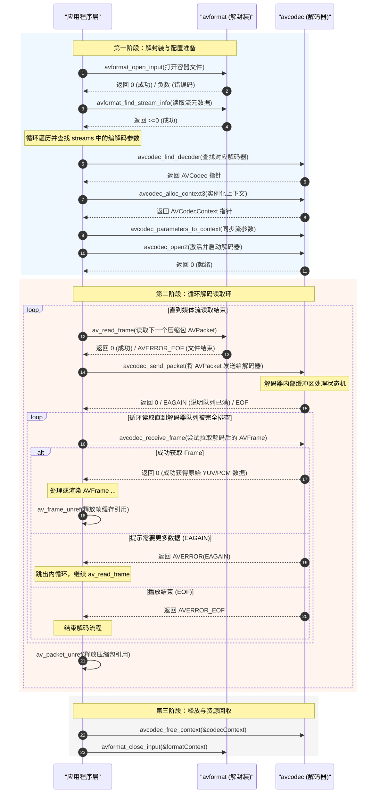

# Android FFmpeg 详细机制与底层原理

在 Android 多媒体开发中，音视频的处理一直是非常核心且高门槛的领域。FFmpeg 作为开源界与音视频工业界的客观标准库，为跨平台多媒体处理提供了极其强大的支持。本文将围绕 FFmpeg 的核心架构、Android 端与硬解 MediaCodec 的设计取舍、NDK 交叉编译与 JNI 高性能桥接机制、音视频解码 API 底层全流程以及内存与体积优化最佳实践进行系统阐述。

---

## 1. 核心概念与多媒体背景

### 1.1 什么是 FFmpeg
FFmpeg（Fast Forward MPEG）是一个极其强大且高度模块化的跨平台音视频处理工业级标准方案。它不仅包含了领先的音视频解码、编码、转码、封装、解封装、流化、滤镜以及播放等底层库，还附带了 `ffmpeg`（命令行转码工具）、`ffplay`（简易播放器）和 `ffprobe`（多媒体流分析工具）等工具。对于 Android 开发者而言，FFmpeg 是在原生系统自带的多媒体框架无法满足复杂格式、高度定制或跨平台统一策略时的终极解决方案。

### 1.2 FFmpeg 的多媒体处理核心地位
在计算机多媒体科学中，音视频的传输与存储必须经过高比例的压缩。这是因为一秒钟未压缩的原始视频数据（如 1080P 60fps, RGB24 格式）的大小为：
$$\text{Size} = 1920 \times 1080 \times 3 \text{ bytes} \times 60 \approx 373 \text{ MB}$$
如此庞大的数据量是网络传输与终端存储所无法承受的。因此，需要通过编解码器（Codec）消除空间冗余与时间冗余。

在音视频处理的整个链路中，FFmpeg 占据了绝对的核心地位。其架构设计完全契合多媒体数据流的生命周期：

```
+-----------------------------------------------------------+
|                    多媒体数据流核心处理链路                    |
+-----------------------------------------------------------+
|                                                           |
|  [输入媒体文件/流]                                         |
|         │                                                 |
|         ▼ (解封装/Demuxing)                                |
|  +--------------+   读取压缩的 AVPacket   +---------------+  |
|  |  avformat    | ─────────────────────> |   avcodec     |  |
|  +--------------+                        +---------------+  |
|                                                  │        |
|                                                  │ 解码    |
|                                                  ▼ (Decoding)
|  +--------------+   原始 YUV/PCM 帧       +---------------+  |
|  |  swscale /   | <───────────────────── |   AVFrame     |  |
|  | swresample   |                        +---------------+  |
|  +--------------+                                         |
|         │                                                 |
|         ▼ (色彩转换/重采样)                                |
|  [渲染输出 (OpenGL/OpenSL ES)]                             |
|                                                           |
+-----------------------------------------------------------+
```

1. **解封装（Demuxing）**：将多媒体容器格式（如 MP4、MKV、FLV、TS）拆解，分离出音频轨道、视频轨道以及字幕轨道的压缩数据流。
2. **解码（Decoding）**：将压缩的媒体数据包（如 H.264/H.265 编码的视频 NAL 单元，或 AAC/MP3 编码的音频帧）还原为未压缩的原始信号帧（如视频的 YUV/RGB 像素数据，音频的 PCM 采样数据）。
3. **图像转换与重采样（Scaling & Resampling）**：由于硬件限制或渲染管道要求，常常需要将 YUV420P 像素格式转换为 RGBA 才能被 GPU（OpenGL ES/Vulkan）渲染，或者需要将音频采样率由 48000Hz 转换为 44100Hz 以适配特定音频设备。
4. **渲染播放（Rendering）**：将转换后的像素数据提交给 Android 的 Surface，将 PCM 数据提交给 AudioTrack 或 OpenSL ES/AAudio。

---

## 2. 深度选型对比：Android MediaCodec 与 FFmpeg

在 Android 平台上，实现音视频解码主要有两种技术路线：利用 Android 原生的硬解框架 `MediaCodec`，或者集成 FFmpeg 进行软件解码（简称“软解”）。两者在底层机制、性能表现、功耗以及设备兼容性上存在显著的差异。

### 2.1 MediaCodec 硬件解码与 FFmpeg 软件解码深度对比

#### MediaCodec 硬件解码原理
`MediaCodec` 是 Android 从 4.1（API 16）版本开始引入的原生媒体编解码接口。它直接调用底层硬件芯片（如高通 Snapdragon、联发科 Dimensity、三星 Exynos 或海思 Kirin 上的专用 ASIC 编解码硬件单元）来处理数据。
由于解码过程直接在片上硬件（ASIC）中通过硬线逻辑或微码完成，CPU 只需负责调度与数据的搬运，几乎不参与复杂的代数运算。因此，硬解的核心特征是**极低的 CPU 占用率、极低的发热量与极高的能效比**。同时，MediaCodec 支持零拷贝（Zero-Copy）渲染——可以直接将解码后的硬件缓冲区句柄传递给 Surface，由 GPU 的显示控制器直接读取并显示，完全避免了像素数据从内核空间到用户空间、再到图形缓冲区的多次拷贝。

然而，硬件解码的硬伤在于**硬件厂商的碎片化与格式支持的局限性**。芯片设计时其支持的解码格式就已经固化（例如老旧芯片无法解码 H.265/HEVC 或最新的 AV1 格式）。此外，由于不同 SoC 厂商对 Android MediaCodec HAL 层的实现标准不一，导致在不同机型上常常出现花屏、绿屏、不支持非标分辨率、或者初始化耗时极长等兼容性深坑。

#### FFmpeg 软件解码原理
FFmpeg 软解则是利用 CPU 来执行通用算法，逐个像素、逐个宏块地计算出图像。由于 CPU 是通用处理器，只要有相应的 C/C++ 解码源码，理论上 FFmpeg **可以解码任何已知的多媒体容器与编码格式**（如 H.264, H.265, AV1, VP9, VP8, MPEG4, AAC, FLAC, MP3 等），且在不同机型上的解码表现是高度一致的，极其适合进行深度定制。

然而，软件解码需要消耗大量的 CPU 算术逻辑单元（ALU）资源。尤其在解码 4K 60fps 或高码率 H.265 视频时，CPU 往往需要满负荷运行，导致手机严重发热、电池电量迅速消耗。此外，FFmpeg 软解后的 YUV/RGB 数据位于 C 层的堆内存中，必须通过 JNI 传递到 Java 层或通过 `ANativeWindow` 渲染，这不可避免地带来了内存拷贝与 CPU 缓存抖动的问题。由于软解需要携带庞大的解码算法库，编译出来的 `.so` 文件体积通常有数兆甚至十数兆，直接增大了 App 的打包体积。

### 2.2 详细对比矩阵

| 对比维度 | Android 原生 MediaCodec (硬解) | 软件集成 FFmpeg (软解) |
| :--- | :--- | :--- |
| **底层硬件依赖** | 依赖特定 SoC 上的专用 ASIC 硬件加速单元 | 完全由通用 CPU 运算实现，不依赖特定芯片 |
| **格式与容器支持** | 仅支持主流商业格式（H.264/AAC，新版系统支持 H.265/AV1），对 MKV、FLV 等容器支持差 | 支持几乎任意封装格式与所有主流编解码器，定制性极强 |
| **运行功耗与发热** | 极低。功耗小，发热微弱，能效比高 | 极高。在高分辨率/高码率解码时 CPU 负荷高，发热大，耗电明显 |
| **解码性能与上限** | 极高。可轻松实现 4K 60fps/120fps 解码 | 受限于设备 CPU 的单核与多核运算能力，低端机型容易卡顿丢帧 |
| **内存拷贝开销** | 支持零拷贝，直接将硬件 Buffer 送至 GPU 显示 | YUV 帧位于 CPU 堆内存，必须经过多次拷贝才能渲染，开销较大 |
| **系统兼容性与碎片化** | 碎片化严重。各厂商底层驱动实现不一，低端机存在各种黑屏、绿屏、 crash 兼容问题 | 极好。行为高度可控，且不受 Android 系统版本演进的限制 |
| **包体积影响** | 0 增量（调用系统 `/system/lib` 下的系统库） | 增加 App 体积，arm64-v8a 单架构动态库通常需要数 MB 空间 |

### 2.3 软硬解双轨降级策略设计与 Android 版本兼容性

在企业级短视频（如抖音、快手）或长视频（如腾讯视频、Bilibili）应用中，为了兼顾“低功耗”与“高成功率”，通常不会孤立地只使用 MediaCodec 或 FFmpeg，而是会设计一套**双轨降级播放引擎架构**：

```
                     +---------------------------+
                     |        播放器初始化        |
                     +---------------------------+
                                   │
                                   ▼
                     +---------------------------+
                     |  探测视频编码格式与分辨率  |
                     +---------------------------+
                                   │
                                   ▼
                 /───────────────────────────────\
                <  设备是否支持 MediaCodec 该格式？ >
                 \───────────────────────────────/
                               /   \
                         是  /       \ 否
                           /           \
                          ▼             ▼
             +--------------------+   +--------------------+
             |  初始化 MediaCodec |   |   切换 FFmpeg 软解  |
             +--------------------+   +--------------------+
                       │                        │
                       ▼                        ▼
               /───────────────\          [ 正常软解播放 ]
              <  是否出现解码异常？ >
               \───────────────/
                     /   \
               是  /       \ 否
                 /           \
                ▼             ▼
     +--------------------+  [ 正常硬解播放 ]
     | 释放 MediaCodec 并  |
     |  降级切换至 FFmpeg  |
     +--------------------+
```

1. **首选硬解**：启动播放时，优先尝试使用 `MediaCodec` 进行硬解码。
2. **安全防护与拦截**：在 MediaCodec 初始化、配置（`configure`）或启动（`start`）阶段，捕获可能抛出的 `CodecException` 或 `IllegalArgumentException`，并拦截不同系统版本上的黑名单设备。
3. **软解降级**：一旦硬解遇到不可逆的错误、频繁丢帧或渲染异常，播放引擎立即无缝切换到 `FFmpeg` 软件解码，以牺牲功耗为代价换取播放的成功率。

同时，MediaCodec 的 API 和底层架构设计也随着 Android 系统版本发生着重要的演进（关于系统版本在权限、媒体 API 和底层限制的变化，可进一步参考 [AndroidVersionChangeLog.md](../../../../../AndroidVersionChangeLog.md)）：
- **Android 5.0 (API 21)**：引入了异步回调接口 `MediaCodec.Callback`（`onInputBufferAvailable`、`onOutputBufferAvailable` 等），使得开发者不需要自己在子线程中进行阻塞式轮询，大大提高了事件驱动型播放器的响应速度，并降低了线程切换带来的上下文损耗。
- **Android 10 (API 29)**：Google 引入了 Codec2 框架来逐步替代老旧的 MediaCodec HAL。这一变化规范了设备制造商的编解码器命名，例如硬解码器必须以 `c2.android.` 或 `c2.vendor.` 开头，方便播放引擎在 C 层或 Java 层更准确地识别软硬解码器类别，提升了硬解白名单匹配的精准度。

---

## 3. FFmpeg 核心架构设计与七大模块

FFmpeg 强大的生命力源于其高度内聚且松耦合的模块化架构设计。它由七大核心库组成，各个库分工明确，通过统一 C 语言接口进行相互协作。

```
+-----------------------------------------------------------------------------+
|                                FFmpeg 核心模块                              |
+-----------------------------------------------------------------------------+
|                                                                             |
|  +------------------+  +------------------+  +------------------+           |
|  |     avformat     |  |     avcodec      |  |     avfilter     |           |
|  |  (Mux & Demux)   |  |  (Encode/Decode) |  |   (Video/Audio)  |           |
|  +------------------+  +------------------+  +------------------+           |
|           │                      │                     │                    |
|           │                      │                     │                    |
|           ▼                      ▼                     ▼                    |
|  +------------------+  +------------------+  +------------------+           |
|  |     swscale      |  |   swresample     |  |     avdevice     |           |
|  | (Colorspace/Size)|  |   (Resample)     |  | (Devices I/O)    |           |
|  +------------------+  +------------------+  +------------------+           |
|                                                                             |
|                          +------------------+                               |
|                          |      avutil      |                               |
|                          |   (Utilities)    |                               |
|                          +------------------+                               |
+-----------------------------------------------------------------------------+
```

### 3.1 avcodec (编解码模块)
`libavcodec` 是 FFmpeg 的核心模块，也是体积最大的部分。它包含了几乎所有主流音频、视频、字幕的编码器（Encoder）与解码器（Decoder）。该库设计了高度抽象的接口，使得不同的编解码算法可以实现为多态的结构体，并在运行时根据传入的 Codec ID 动态绑定。其关键数据结构包括：
- `AVCodec`：编解码器对象，描述了编解码器的类型、名称、支持的像素格式及相关的操作函数指针。
- `AVCodecContext`：编解码上下文，保存了编解码所需的一切参数（如分辨率、比特率、声道数、采样率、时间基等），同时维护着解码器的内部状态信息。

### 3.2 avformat (解封装/封装模块)
`libavformat` 用于处理各种多媒体容器格式，负责协议解析和媒体文件的解封装（Demuxing）与封装（Muxing）。它可以解析本地文件、HTTP 渐进式流、RTMP 流、RTSP 流、HLS 等。其关键数据结构包括：
- `AVFormatContext`：整个容器格式的上下文，是解封装器或封装器的根结构体。
- `AVStream`：媒体流，代表容器中的一条音频轨、视频轨或字幕轨。
- `AVInputFormat` / `AVOutputFormat`：解封装/封装器的配置模板。

### 3.3 avfilter (音视频滤镜模块)
`libavfilter` 提供了丰富的视音频特效处理功能。例如，视频裁剪（crop）、缩放（scale）、水印叠加（overlay）、字符绘制（drawtext）、视频去噪、音频混音（amix）、音量调整（volume）等。滤镜可以通过有向无环图（DAG）式的“滤镜图”（FilterGraph）链式组合，这极极大地简化了多媒体编辑功能在 Native 层的实现。

### 3.4 avutil (公共工具库)
`libavutil` 包含了一些公共的工具函数，为其他六大模块提供基础支撑。包括数学函数、内存分配器（`av_malloc`、`av_free`）、数据结构（如字典 `AVDictionary`、FIFO 环形缓冲区）、像素格式映射（`AVPixelFormat`）以及采样格式映射（`AVSampleFormat`）等。

### 3.5 swscale (图像缩放与色深转换)
`libswscale` 主要处理视频像素数据。其功能可概括为三个方面：
1. **缩放（Rescaling）**：改变视频的分辨率（宽高）。
2. **色彩空间转换（Colorspace Conversion）**：在 YUV420P、YUV422P、RGB24、RGBA、BGR24 等格式之间进行高精度的相互转换。
3. **色深转换（Pixel Format Conversion）**：转换数据的打包排列格式。它通过汇编指令集（如 ARM 架构下的 NEON 指令集）进行了深度优化，在 CPU 上拥有极高的执行效率。

### 3.6 swresample (音频重采样)
`libswresample` 负责处理音频采样数据。其主要功能包括：
1. **重采样（Resampling）**：改变音频的采样率（如从 48000Hz 转换为 44100Hz）。
2. **通道格式转换（Channel Layout Conversion）**：改变通道数，如将 5.1 声道转换为立体双声道。
3. **样本格式转换（Sample Format Conversion）**：改变音频样本的存储格式（如从 16 位有符号整型 `AV_SAMPLE_FMT_S16` 转换为 32 位浮点型平面存储 `AV_SAMPLE_FMT_FLTP`）。

### 3.7 avdevice (硬件设备输入输出)
`libavdevice` 用于访问系统中的输入输出物理设备。例如，捕获 Linux 下的 V4L2 摄像头、ALSA 音频设备。在 Android 端，虽然极少直接使用此模块来直接调用物理硬件（因为 Android 原生提供了 CameraX 和 AudioRecord），但在某些特定嵌入式或 Native 系统定制中，它依然提供了标准化的 Native 访问通道。

### 3.8 核心数据结构及其生命周期管理
在进行 FFmpeg 编程时，最核心的任务就是管理好以下两个生命周期频繁且数据量巨大的结构体：
1. **`AVPacket`（压缩数据包）**：
   - 概念：它保存了未解码的压缩音视频数据（如 H.264 中的 NALU，AAC 中的音频帧）以及相关的控制信息（如显示时间戳 PTS、解码时间戳 DTS、流索引 index、包时长 duration）。
   - 生命周期管理：`AVPacket` 的控制结构体通常分配在栈上或通过 `av_packet_alloc()` 在堆上分配，但其内部指向的数据 Buffer 则是动态分配的。每当处理完一个数据包后，必须调用 `av_packet_unref(packet)` 来递减缓冲区的引用计数，直到最终调用 `av_packet_free(&packet)` 释放结构体本身，以防严重的内存泄露。
2. **`AVFrame`（原始信号帧）**：
   - 概念：它保存了解码后的原始像素数据（如 YUV420P 中的 Y/U/V 分量数据指针及 `linesize` 步长，或 PCM 音频数据），是音视频渲染、滤镜特效以及再次编码的直接输入源。
   - 生命周期管理：通过 `av_frame_alloc()` 实例化，利用引用计数管理数据缓冲区。当 Frame 不再需要时，必须调用 `av_frame_unref(frame)` 归还缓存区，最后调用 `av_frame_free(&frame)` 彻底销毁。

---

## 4. Android NDK 编译与 JNI 桥接集成

为了将 FFmpeg 引入 Android 项目中，我们必须将其源码编译为符合 ARM 架构指令集的二进制动态链接库（`.so` 文件），并通过 Java Native Interface（JNI）与 Android 层的 Java/Kotlin 代码进行高性能的数据通信。

### 4.1 交叉编译原理与 arm64-v8a 适配
编译 Android 库的过程被称为“交叉编译”（Cross-Compilation）。我们在 PC 电脑（通常是 x86_64 架构的 macOS/Linux 系统）上运行编译器，生成的却是运行在 ARM64（arm64-v8a）架构芯片上的二进制目标代码。
交叉编译的核心在于指定 NDK（Native Development Kit）提供的工具链（包含对应目标 CPU 架构的编译器 `clang`、链接器 `ld` 等）以及系统根路径（`SYSROOT`，提供 Android 特有的系统头文件与 Bionic C 库）。当前，Android 设备绝大部分已采用 64 位 ARM 处理器，因此编译输出 `arm64-v8a`（aarch64 架构）是目前绝对的主流。

### 4.2 实战交叉编译脚本 `build.sh` 详解
以下是一个编译 FFmpeg 生成 Android `arm64-v8a` 架构动态链接库的 shell 脚本示例。为了确保脚本能够顺利执行，我们需要声明并配置交叉编译所需的各项环境变量：

```bash
#!/bin/bash
# -------------------------------------------------------------
# FFmpeg 交叉编译脚本 - 适配 Android arm64-v8a 架构
# -------------------------------------------------------------

# 1. 配置 NDK 路径与交叉编译工具链根路径
NDK=/Users/lizhiyang/Library/Android/sdk/ndk/25.1.8937393 # 替换为你实际的 NDK 路径
TOOLCHAIN=$NDK/toolchains/llvm/prebuilt/darwin-x86_64
API=21

# 2. 声明目标 CPU 架构参数
ARCH=arm64
CPU=armv8-a
CC=$TOOLCHAIN/bin/aarch64-linux-android$API-clang
CXX=$TOOLCHAIN/bin/aarch64-linux-android$API-clang++
SYSROOT=$TOOLCHAIN/sysroot
PREFIX=./android/$ARCH

# 3. 执行编译配置配置函数
function build_ffmpeg {
  ./configure \
    --prefix=$PREFIX \
    --target-os=android \
    --arch=$ARCH \
    --cpu=$CPU \
    --cc=$CC \
    --cxx=$CXX \
    --sysroot=$SYSROOT \
    --enable-shared \
    --disable-static \
    --disable-doc \
    --disable-ffmpeg \
    --disable-ffplay \
    --disable-ffprobe \
    --disable-avdevice \
    --disable-symver \
    --cross-prefix=$TOOLCHAIN/bin/llvm- \
    --enable-cross-compile \
    --enable-neon \
    --enable-hwaccels \
    --disable-asm \
    $ADDITIONAL_FLAGS

  make clean
  make -j8
  make install
}

build_ffmpeg
```

#### 关键编译参数剖析：
- `--target-os=android`：明确告知 FFmpeg 我们是在为 Android 操作系统进行编译，这会启用特定的 Android 补丁和系统头文件映射。
- `--sysroot`：设定编译时的系统调用根目录，NDK 提供的此目录下含有 Android 特有的 `libc.so`、`libm.so`、`liblog.so` 以及系统的硬件渲染依赖库。
- `--enable-shared` / `--disable-static`：由于 Android 的 APK 安装包在运行时是通过 `System.loadLibrary` 加载外部库，因此必须编译出动态共享库 `.so`，而不是静态库 `.a`。
- `--cross-prefix`：交叉编译工具链的前缀，如 `llvm-ar`、`llvm-as`、`llvm-strip` 等均会加上此前缀，使 FFmpeg 构建系统调用正确的二进制优化工具。

### 4.3 JNI 桥接设计与内存传递优化 (Direct ByteBuffer vs byte[])
在多媒体处理中，每秒都有巨大的数据量（例如 1080P 视频中单帧 YUV 像素数据就高达约 3MB，44.1kHz 音频每秒几百 KB 的 PCM 数据）需要在 Java 层（JVM 内存）和 Native 层（C++ 堆内存）之间高速传递。如果桥接设计不合理，就会产生严重的 CPU 性能瓶颈。

#### 使用 `byte[]` 的常规做法及缺点
在 Java 中直接定义 `native` 方法传递 `byte[]` 数组，JNI 层通过 `GetByteArrayElements` 取得 C 语言指针：
```c
JNIEXPORT void JNICALL Java_com_example_Player_writeFrame(JNIEnv *env, jobject thiz, jbyteArray data) {
    jbyte *c_data = (*env)->GetByteArrayElements(env, data, NULL);
    // 使用 c_data 进行解码或处理...
    (*env)->ReleaseByteArrayElements(env, data, c_data, 0);
}
```
**致命缺点**：在绝大多数 JVM 实现中，由于 Java 堆内存会被垃圾回收器（GC）进行整理和搬移，`GetByteArrayElements` 往往会在 Native 堆内存中开辟一块同等大小的缓冲区，并将 Java `byte[]` 中的所有字节**硬拷贝**过去；处理完成后，在 `ReleaseByteArrayElements` 处又会再次拷贝回来。这在视频高帧率播放时，会造成极高频的内存复制和严重的 GC 停顿（GC Pause）。

#### 使用 Direct ByteBuffer 的高性能零拷贝（Zero-Copy）做法
为了彻底消除拷贝，应使用 `ByteBuffer.allocateDirect(int capacity)` 或在 Native 层利用 `(*env)->NewDirectByteBuffer(env, void* address, jlong capacity)` 构造一个**直接字节缓冲区（Direct ByteBuffer）**。
- **内存本质**：这块内存直接在 Native 堆（C 语言堆，不受 JVM GC 直接回收影响）上分配。
- **桥接机制**：在 Java 侧，它表现为 `java.nio.ByteBuffer` 对象；在 JNI 侧，C++ 可以直接通过系统调用取得该缓冲区的起始内存地址指针，实现对同一块内存的无摩擦共同读写。
```c
JNIEXPORT void JNICALL Java_com_example_Player_writeDirectFrame(JNIEnv *env, jobject thiz, jobject byteBuffer) {
    // 1. 直接获取 Native 内存块的实际地址指针，此过程完全零拷贝
    uint8_t *native_buffer = (*env)->GetDirectBufferAddress(env, byteBuffer);
    jlong capacity = (*env)->GetDirectBufferCapacity(env, byteBuffer);
    
    if (native_buffer != NULL) {
        // 2. 此时 native_buffer 可以直接作为 FFmpeg 解码/色彩转换函数的入参，性能极高
        // process_data(native_buffer, capacity);
    }
}
```
此外，由于 JNI 在运行期间有局部引用表（Local Reference Table）的大小限制（默认为 512 个），在高频解码循环中，若不断产生临时的引用而未及时释放，就会抛出 `JNI Local Reference Table Overflow` 崩溃。因此，在循环内部，务必手动调用 `DeleteLocalRef` 销毁 Java 对象引用，或者在入口处使用 `(*env)->EnsureLocalCapacity(env, capacity)` 扩充局部引用容量。

### 4.4 静态注册与动态注册的选择及 JNI 代码示范
JNI 桥接方法的注册有静态注册（按照特定类名和方法名规范命名）和动态注册（在 `JNI_OnLoad` 中通过 `RegisterNatives` 进行显式关联）两种形式。
由于动态注册不需要繁琐的、极长的方法命名，且在应用启动、so 库加载时就会注册，运行时的寻址效率比静态注册更高，还能隐式地提供一定程度的方法名混淆保护，因此在大型 NDK 项目中，**通常选用动态注册**。

以下是实现动态注册的完整 C 语言 JNI 代码示范：

```c
#include <jni.h>
#include <android/log.h>
#include <libavcodec/avcodec.h>

#define TAG "FFmpegJNI"
#define LOGI(...) __android_log_print(ANDROID_LOG_INFO, TAG, __VA_ARGS__)

// Native 函数的具体 C 实现
JNIEXPORT jstring JNICALL getFFmpegVersion(JNIEnv *env, jobject thiz) {
    const char* version = av_version_info();
    return (*env)->NewStringUTF(env, version);
}

// Java 方法与 Native C 函数映射结构体数组
static JNINativeMethod gMethods[] = {
    {"nativeGetFFmpegVersion", "()Ljava/lang/String;", (void*)getFFmpegVersion}
};

// JVM 在加载 so 库（System.loadLibrary）时，会自动回调 JNI_OnLoad
JNIEXPORT jint JNICALL JNI_OnLoad(JavaVM *vm, void *reserved) {
    JNIEnv *env = NULL;
    if ((*vm)->GetEnv(vm, (void**)&env, JNI_VERSION_1_6) != JNI_OK) {
        return JNI_ERR;
    }
    
    // 寻找 Java 端映射的 Class 类对象
    jclass clazz = (*env)->FindClass(env, "com/example/media/FFmpegPlayer");
    if (clazz == NULL) {
        return JNI_ERR;
    }
    
    // 动态注册 Native 方法到 JVM
    if ((*env)->RegisterNatives(env, clazz, gMethods, sizeof(gMethods)/sizeof(gMethods[0])) < 0) {
        return JNI_ERR;
    }
    
    LOGI("JNI_OnLoad: RegisterNatives success!");
    return JNI_VERSION_1_6;
}
```

在 Java 端，我们只需要通过静态代码块加载 so 库，即可直接调用此方法：
```java
package com.example.media;

public class FFmpegPlayer {
    static {
        System.loadLibrary("ffmpeg_jni");
    }
    
    public native String nativeGetFFmpegVersion();
}
```

---

## 5. 音视频解封装与解码 API 全流程解析

音视频的解码过程是一个状态严密、多步骤嵌套的数据流转过程。下面我们将深入到 C 语言底层，剖析从读取媒体源文件到输出原始 PCM/YUV 图像信号帧的全套核心 API 工作流。

### 5.1 底层 API 流转详细剖析

1. **`avformat_open_input`（打开媒体文件）**：
   - 职责：这是播放的起点。根据传入的文件路径或网络流 URL，分配 `AVFormatContext` 并在底层执行文件协议的探测与 I/O 挂接。它通过读取媒体文件的头部数据（例如 MP4 容器的 `moov` 盒子或 TS 容器的头部），识别出媒体的封装格式信息。
2. **`avformat_find_stream_info`（获取流信息）**：
   - 职责：有些多媒体容器的头部不包含完整的元数据信息（例如 TS 裸流或某些网络流）。此时必须调用该函数，该函数会在底层读取一小段视频或音频的压缩包（Packets），通过解码探测出精确的帧率、宽高、时长、像素格式及编解码参数。
3. **寻找音视频流与初始化解码器**：
   - 流程：遍历 `AVFormatContext` 下的 `streams` 数组，通过 `AVCodecParameters` 判断轨道的媒体类型（`AVMEDIA_TYPE_VIDEO` 或 `AVMEDIA_TYPE_AUDIO`）。
   - **`avcodec_find_decoder`**：根据获取的编解码器 ID（`codec_id`）从 FFmpeg 全局列表中查找匹配的解码器对象 `AVCodec`。
   - **`avcodec_alloc_context3`**：创建对应解码器的上下文结构体 `AVCodecContext`。
   - **`avcodec_parameters_to_context`**：将从解封装器中提取到的视频/音频物理参数（如宽高、通道布局、色彩域等）复制同步到解码器上下文中，确保解码器知道如何分配内部解码缓冲区。
4. **`avcodec_open2`（激活解码器）**：
   - 职责：正式初始化解码器。它会分配编解码器内部运行所需的各种状态缓冲区，加载算法所需的权重表格，若返回 0 代表解码器就绪，可以接收数据输入。
5. **循环调用 `av_read_frame`（读取压缩包）**：
   - 职责：从容器上下文 `AVFormatContext` 中，顺序读取下一个数据包并存入传入的 `AVPacket` 结构体中。需要强调的是，这里的 `Frame` 在解封装层指的是“封装包”（Packet）。一个 `AVPacket` 在视频中通常包含一个完整的 NAL 单元（如一帧压缩视频），在音频中包含一个或数个音频包。
6. **音视频解耦解码（核心状态机）**：
   - 机制：在 FFmpeg 3.x 以后，为了解耦输入与输出（因为视频的 B 帧需要前后双向参考，输入一个 Packet 不一定能产出一个 Frame，或者输入一个 Packet 会产生多个 Frame），解码器引入了经典的 `send_packet` / `receive_frame` 异步管道架构：
     - **`avcodec_send_packet`**：将获取的 `AVPacket` 发送给解码器的输入队列。
     - **`avcodec_receive_frame`**：从解码器的输出队列中接收解码后的原始 `AVFrame`（YUV/PCM 数据）。

### 5.2 Mermaid 时序图：音视频解码 API 流转核心状态机



### 5.3 核心状态机与返回值处理（EAGAIN, EOF）
在解码循环中，正确处理 `avcodec_send_packet` 和 `avcodec_receive_frame` 的返回值是保证解码器不发生死锁或崩溃的关键：
- **`AVERROR(EAGAIN)`**：
  - 在 `avcodec_receive_frame` 返回它时：表示当前解码器内部已经处理完了输入的数据，但还不足以合成一个完整的输出帧（这在视频中尤为常见，因为双向预测 B 帧需要未来的 I/P 帧作为参考才能解码）。此时，**必须立即跳出当前的 `receive` 循环**，去读取下一个 `AVPacket` 并通过 `send_packet` 送入解码器。
  - 在 `avcodec_send_packet` 返回它时：表示解码器的输入缓冲区已满，无法接收新的 Packet，开发者必须**优先去调用 `receive_frame` 把已解码好的帧拉取出来**，排空解码器的输出队列后，才能重新发送这个 Packet。
- **`AVERROR_EOF`**：
  - 在 `avcodec_send_packet` 输入一个 NULL 的 Packet（称为冲刷 Flush）后，解码器会进入 Drain 模式，排空内部所有残留的帧。此时后续的 `avcodec_receive_frame` 会返回 `AVERROR_EOF`，标志着文件已经彻底解码完毕，可以安全关闭解码器。

---

## 6. 常见误区、避坑指南与最佳实践

### 6.1 Native 层堆内存泄漏与野指针崩溃剖析
在 JVM 平台下，开发者习惯了垃圾回收器（GC）的自动内存管理。然而，一旦进入 FFmpeg 的 C 语言世界，**所有的内存管理都必须由开发者手动且绝对精确地控制**。Native 内存泄漏（Leak）是导致 Android 音视频 App 运行一段时间后由于 Out Of Memory 被系统强杀（`OOM-Killed`）的第一杀手。

#### 避坑指南：
1. **引用计数未递减导致的内存泄漏**：
   - 典型错误：频繁调用 `av_read_frame`，然后直接释放 `AVPacket` 结构体：
     ```c
     AVPacket *packet = av_packet_alloc();
     while(av_read_frame(fmt_ctx, packet) >= 0) {
         // ... 解码处理 ...
         // 错误做法：直接 free(packet) 或仅 av_packet_free(&packet)
     }
     ```
   - 致命原因：`AVPacket`（以及 `AVFrame`）的底层设计采用的是类似于 C++ `shared_ptr` 的引用计数机制。结构体内部的 `buf` 成员指向一个独立的、巨大的数据缓冲区。仅仅释放结构体指针，而**没有调用 `av_packet_unref(packet)`**，会导致这个底层数据缓冲区无法释放，造成内存的灾难性泄漏。
   - 正确姿势：每次处理完毕，执行 `av_packet_unref(packet)` 将缓冲区的引用计数减 1。在整个播放结束、销毁播放器时，执行 `av_packet_free(&packet)` 彻底关闭引用并释放结构体内存。
2. **多线程并发访问安全问题**：
   - 避坑：FFmpeg 的大部分结构体（如 `AVCodecContext`、`AVFormatContext`）**均不是线程安全的**。严禁在 Java 层使用多个线程并发调用同一个 Native 播放器指针的解码或关闭方法。必须在 Native 层通过互斥锁（如 `pthread_mutex_t`）进行多线程排他保护，或者将所有的读取、解码、渲染操作严格约束在同一个 Native 工作线程（如 Loop 线程）中完成。

### 6.2 极致瘦身：FFmpeg 编译期裁剪与包体积优化
默认配置下，FFmpeg 包含了成百上千种编解码格式、协议与滤镜。如果直接全部编译，生成的 arm64-v8a 动态库大小将达到十几 MB 以上，这对于对 APK 体积极其敏感的移动端应用来说是难以承受的。
为了追求包体积的极致优化，必须在交叉编译配置期（即执行 `./configure` 时），采用**白名单策略**进行深度的动态裁剪。

#### 最佳实践步骤：

1. **一键全禁用，建立极简基线**：
   - 加上 `--disable-everything` 参数。这会直接关闭所有的解码器、编码器、封装格式解析器、解封装器、网络协议和硬件加速模块。
   - 加上其他体积优化开关，如：
     - `--disable-doc`（禁止生成文本文档）
     - `--disable-programs`（不编译 ffmpeg 等可执行命令行工具）
     - `--disable-avdevice`（禁用硬件输入捕获模块）
2. **按需开启，白名单定制**：
   - 根据 App 实际要播放的视频格式进行精准开启。例如，如果你的 App 是一个只播放 MP4 容器、视频为 H.264、音频为 AAC 的短视频客户端，可以在 configure 脚本中配置：
     ```bash
     ADDITIONAL_FLAGS=" \
       --enable-decoder=h264 \
       --enable-decoder=aac \
       --enable-demuxer=mov \
       --enable-parser=h264 \
       --enable-parser=aac \
       --enable-protocol=file \
       --enable-protocol=http \
       --enable-protocol=tcp \
     "
     ```
     - `--enable-decoder`：指定开启 H.264/AAC 解码功能。
     - `--enable-demuxer=mov`：在 FFmpeg 中，MP4 容器的解封装器名称是 `mov`，开启它才能解析 MP4。
     - `--enable-protocol`：开启本地文件读取（`file`）与网络流读取（`http`, `tcp`）协议。
3. **移除调试符号与符号裁剪（Strip）**：
   - 在编译完成后，使用 NDK 提供的 `llvm-strip` 工具对生成的 `.so` 文件进行符号表剥离：
     ```bash
     $TOOLCHAIN/bin/llvm-strip --strip-unneeded android/arm64/libavcodec.so
     ```
     这一步能够直接移除动态链接库中调试信息和绝大部分未导出的内部符号，通常可将 `.so` 的体积直接**压缩 50% 到 70%**。
4. **精简架构支持**：
   - 在 `build.gradle` 中，通过 `ndk.abiFilters` 指定只打包 `arm64-v8a` 架构。因为自 2019 年 8 月起，Google Play 政策就强制要求上架应用必须提供 64 位支持，而当下的绝大部分 Android 真机都运行在 64 位系统上。放弃支持过时的 32 位 `armeabi-v7a` 和 PC 模拟器用的 `x86` 架构，能够让包体积成倍减少。
