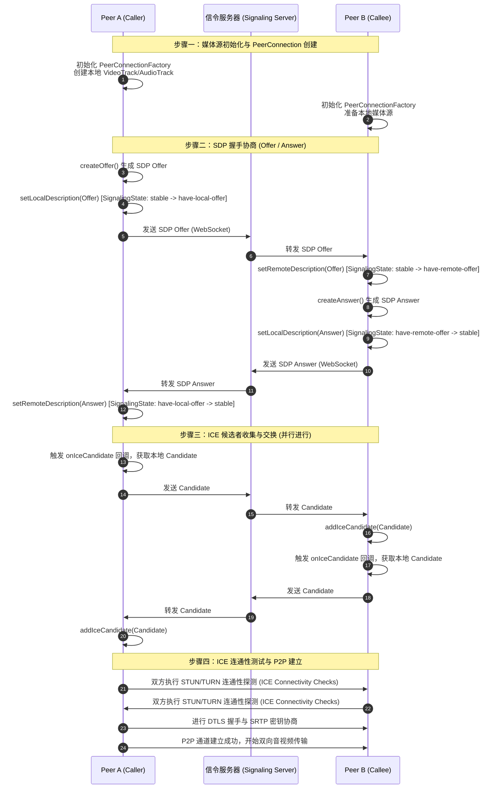

# 5.1.6.2.6 WebRTC 实时通信深度解析与 Android SDK 实践

WebRTC（Web Real-Time Communication）是一项支持移动端、桌面端以及 Web 端进行超低延迟点对点（P2P）实时音视频和数据传输的开放标准。与传统的流媒体技术不同，WebRTC 并非单一协议，而是由一套极其精密的音视频引擎、网络打洞技术、安全加密算法以及网络拥塞控制算法组合而成的闭环系统。在 Android 平台上，WebRTC 通过将底层的 C++ 核心库进行 JNI 封装，为开发者提供了一整套高性能的音视频处理与网络通信 SDK。

---

## 1. 传输技术选型剖析（为什么）

在实时音视频通话场景中，传统的流媒体传输方案（如 HTTP/HLS、RTMP 等）完全无法满足低延迟互动（通常要求端到端延迟低于 200ms）的需求。我们需要从底层传输协议和应用层缓存设计深度剖析其中的技术痛点。

### 1.1 传统流媒体协议的延迟硬伤

传统流媒体协议大多建立在 TCP 协议之上，并且在应用层设计了较深的缓冲区：

1. **TCP 的重传与阻塞机制（队头阻塞 Head-of-Line Blocking）**：
   - TCP 是一个保证“绝对可靠”和“严格有序”的传输层协议。如果在传输过程中发生丢包，即使后续的包已经安全到达接收端协议栈，接收端也无法将这些数据提交给应用层，必须将其放入接收缓冲区中挂起，等待发送端通过超时重传（RTO）或快速重传将丢失的包补齐。
   - 在实时音视频通话中，音视频帧是具有极强时效性的。如果第 1 帧丢失，第 2 帧和第 3 帧已经到达，为了重传第 1 帧而卡住后续帧的解码渲染，会导致整个视频画面产生卡顿。重传回来的第 1 帧通常已经错过了最佳播放时间，在应用层失去了使用价值，却白白浪费了带宽并累积了延迟。
2. **TCP 的拥塞控制限制**：
   - TCP 的慢启动（Slow Start）和拥塞避免机制会导致在建立连接之初，或者在网络出现短暂抖动恢复后，发送窗口被剧烈压缩。这使得突发的大数据量（如视频的关键帧 I 帧）无法及时发送出去，从而在发送端产生排队堆积，导致秒级的延迟。
3. **HTTP/HLS 的分片与应用层缓存**：
   - **HLS (HTTP Live Streaming)**：将持续的视频流切分为多个 TS 或 MP4 媒体分片，播放器必须下载完一个完整的切片并至少缓存 2 到 3 个切片（通常每个切片 2s - 6s）后才开始解码播放。这导致 HLS 的延迟通常在 5 秒到 30 秒之间。
   - **RTMP (Real-Time Messaging Protocol)**：虽然采用持久的 TCP 长连接，省去了分片下载时间，能将延迟控制在 1s - 3s。但是在网络质量变差时，TCP 的退避机制会导致应用层缓冲区不断堆积，画面逐渐落后于实时进度，无法用于实时双向通话。

### 1.2 WebRTC 的极低延迟技术考量

为了实现 200ms 以内的端到端延迟，WebRTC 从传输层到应用层进行了彻底重构：

| 技术维度 | 传统流媒体（如 HLS / RTMP） | WebRTC 实时通信 |
| :--- | :--- | :--- |
| **传输层协议** | TCP（保证可靠、有序） | UDP（无状态、不可靠，高度灵活） |
| **应用层协议** | HTTP / RTMP 自定义帧 | RTP / RTCP（专为实时多媒体设计） |
| **丢包处理** | TCP 自动超时重传（导致队头阻塞） | 选择性重传（NACK）、前向纠错（FEC） |
| **延迟表现** | 2s ~ 30s（受制于 TCP 与应用层 Buffer） | 50ms ~ 200ms（极低延迟） |
| **拥塞控制** | TCP 慢启动、BBR/CUBIC（通用的吞吐量导向） | GCC 算法（丢包+延迟双维度，时延敏感导向） |

WebRTC 弃用 TCP 转向 UDP 的核心逻辑在于：**在实时音视频领域，局部的丢包是可容忍的（可以通过插帧、降噪、弱网补偿等手段掩盖），但时延的累积是无法接受的。** 
通过在不可靠的 UDP 之上构建应用层控制协议，WebRTC 既保留了 UDP 无握手开销、无重传等待的超高性能，又通过应用层的拥塞控制和弱网对抗算法，保障了恶劣网络环境下的通话可用性。

---

## 2. 三大协议支柱深度解析（怎么做）

WebRTC 能够突破复杂的内网环境并安全地实现 P2P 传输，依赖于其底层的三大技术支柱：**NAT 穿透（ICE 框架）**、**网络安全传输（SRTP/SCTP）** 以及 **信令与会话协商（SDP）**。

### 2.1 NAT 穿透与 ICE 框架

绝大多数 Android 移动设备和家用路由器都处于内网环境，通过网络地址转换（NAT）技术共享有限的公网 IP。两个处于不同内网的 Peer 节点要建立直接的 P2P 通道，必须先解决“如何发现对方的公网反射地址”以及“如何穿透防火墙打洞”的问题。

#### 2.1.1 NAT 的四种基本类型与穿透可行性

NAT 的映射和过滤规则决定了 P2P 打洞的成功率：

1. **全锥型（Full Cone NAT）**：
   - 映射规则：本地内网 `IP:Port` 映射为公网 `IP_A:Port_A` 后，任何外部主机向 `IP_A:Port_A` 发送数据，都会被转发到该内网设备。
   - 穿透难度：极易，只需通过 STUN 探测一次即可。
2. **受限锥型（Address Restricted Cone NAT）**：
   - 过滤规则：只有内网设备曾经主动发送过数据的外部公网 IP，才能向该内网设备发送数据。
   - 穿透难度：中等，需要双方协同向对方的公网反射地址发送探测包以“激活”通道。
3. **端口受限锥型（Port Restricted Cone NAT）**：
   - 过滤规则：在受限锥型的基础上，限制了外部主机的端口。只有内网设备向公网 `IP_X:Port_X` 发送过数据，`IP_X:Port_X` 才能发回数据。
   - 穿透难度：较难，需要对 IP 和端口进行严格的配对打洞。
4. **对称型（Symmetric NAT）**：
   - 映射规则：内网设备每次向不同的外部目的 `IP:Port` 发起连接时，NAT 都会分配一个全新的公网映射 `IP:Port`。
   - 穿透难度：**极难**。如果双方都是对称型 NAT，或者一端是对称型且另一端是端口受限锥型，P2P 直连打洞将会彻底失效。因为 STUN 探测出来的端口只对 STUN 服务器有效，当转向连接 Peer 时，对称 NAT 已经更换了新端口，导致打洞失败。此时必须降级使用 TURN 服务器进行中继。

#### 2.1.2 STUN 与 TURN 协议的作用

- **STUN (Session Traversal Utilities for NAT)**：
  - 充当一面“镜子”。内网客户端向公网的 STUN 服务器发送 Binding Request，STUN 服务器将接收到该请求的源公网 IP 和 Port 放入响应体中返回。客户端由此得知自己在公网中的“影子”地址，即 **Server Reflexive Candidate**。
- **TURN (Traversal Using Relays around NAT)**：
  - 充当“中继站”。当 ICE 打洞失败，或者双方的 NAT 类型组合不支持 P2P 直连时，客户端向 TURN 服务器申请分配中继端口（Relayed Candidate）。Peer 双方的所有音视频数据都通过 TURN 服务器在公网进行高带宽转发。这是保证 WebRTC 呼叫接通率达到 99% 以上的兜底手段。

#### 2.1.3 ICE 候选者收集与测试流程

**ICE (Interactive Connectivity Establishment)** 并不是一种新的传输协议，而是一个整合了 STUN 和 TURN 的连接建立框架。

1. **Candidate（候选地址）收集**：
   WebRTC 启动后，会并发收集以下三种候选地址：
   - **Host Candidate**：设备本地网卡的物理 IP 和端口（通常为内网私网地址）。
   - **Server Reflexive Candidate (srflx)**：通过 STUN 服务器探测出来的公网反射 IP 和端口。
   - **Relayed Candidate (relay)**：向 TURN 服务器申请并分配的中继 IP 和端口。
2. **Candidate 交换**：
   双方通过信令通道（Signaling Channel）将各自收集到的 Candidates 发送给对方。
3. **连通性检查（Connectivity Checks）**：
   双方将本地的 Candidate 与对方的 Candidate 组合成 **Candidate Pairs**。按照优先级从高到低（Host -> srflx -> relay）的顺序进行双向 STUN Binding 请求探测。一旦某个通道收到合法的响应，表明该通路已打通，并将其提名为活跃通道（Active Connection Pair）。

---

### 2.2 网络安全传输协议栈

WebRTC 对通信的安全性有极高要求，强制要求在传输媒体和控制数据时进行加密。

```
+------------------------------------+
|            Application             |
+------------------+-----------------+
|   Audio/Video    |   DataChannel   |
+------------------+-----------------+
|      SRTP        |      SCTP       |
+------------------+-----------------+
|               DTLS                 |
+------------------------------------+
|                UDP                 |
+------------------------------------+
```

#### 2.2.1 SRTP (Secure Real-time Transport Protocol)
音视频媒体数据（RTP 包）的安全性由 SRTP 保障：
- **加密与防窃听**：SRTP 对 RTP 的 Payload（音视频原始编码数据）进行加密（通常采用 AES-ICM 或 AES-GCM 算法）。
- **防篡改与完整性校验**：通过 HMAC-SHA1 算法生成认证标签（Authentication Tag）附加在包尾，接收端据此验证包是否被中间人篡改。
- **防重放攻击**：SRTP 头部包含递增的序列号（Sequence Number）和索引值，接收端会维护一个滑动窗口，丢弃所有已经被消费过的重复数据包。
- **密钥协商（DTLS）**：在 ICE 通路建立之后，Peer 双方立即通过 UDP 启动 **DTLS (Datagram Transport Layer Security)** 握手。通过交换证书指纹并进行非对称加密协商，生成 SRTP 传输所需的对称密钥，从而实现“一次一密”的安全保证。

#### 2.2.2 SCTP (Stream Control Transmission Protocol) over DTLS
WebRTC 的 **DataChannel**（用于传输文本、文件、游戏指令等非音视频数据）由 SCTP 协议负责：
- **安全沙箱封装**：与传统的 SCTP 直接运行在 IP 层不同，WebRTC 为了穿透防火墙并保证安全，将 SCTP 协议栈“塞入”了 DTLS 隧道中，即运行在 **SCTP over DTLS over UDP** 之上。
- **灵活的传输策略**：
  - **可靠有序**：类似于 TCP，数据包会保证送达并按发送顺序提交给应用层（适用于文件传输）。
  - **不可靠无序**：类似于 UDP，丢包不重传，数据到达即提交（适用于多人在线游戏中的位置同步）。
  - **半可靠（限制重传/生命周期）**：可以设置最大重传次数或超时生存时间（TTL），如果超时未送达则放弃，保证了数据通道的高效性。

---

### 2.3 信令服务器的作用与 SDP 协商

WebRTC 规范中故意排除了对“信令（Signaling）”协议和架构的统一定义。信令的传递需要开发者借助 WebSocket、HTTP Polling、MQTT 或 gRPC 自行实现。

#### 2.3.1 信令的核心作用
1. 交换 **SDP (Session Description Protocol)** 媒体协商元数据。
2. 交换 **ICE Candidates** 网络地址信息。
3. 控制通话状态：呼叫、接受、拒绝、挂断、网络切换引起的重连等。

#### 2.3.2 SDP 协商（Offer/Answer 模式）
SDP 是一种基于文本的协议，用于描述会话的媒体配置信息。它声明了设备支持的编解码器（如 VP8、H.264、Opus）、媒体流的方向（仅发送、仅接收、双向）、加密指纹以及 ICE 属性。

下图详细展示了 Peer A（呼叫端）与 Peer B（被呼叫端）之间，通过信令服务器进行 SDP 交换以及 ICE 候选者传递的完整时序流程：



---

## 3. Android 客户端 SDK 架构与开发（怎么做）

在 Android 平台上集成 WebRTC 时，开发者必须深刻理解其底层的三线程模型，以及本地摄像头数据的采集、硬件编码和投递机制。

### 3.1 PeerConnectionFactory 与底层三线程模型

`PeerConnectionFactory` 是 Android WebRTC SDK 的引擎核心。为了保障高强度的实时计算不阻塞 Android UI 主线程，WebRTC 底层采用 C++ 构建了极其严格的**三线程异步调度架构**。

```
                                  +-----------------------+
                                  |     Java UI Thread    |
                                  +-----------+-----------+
                                              |
                                     (JNI API Calls)
                                              v
+-----------------------------------------------------------------------------------+
|  libwebrtc (C++ Engine)                                                           |
|                                                                                   |
|  +---------------------------+  +----------------------+  +--------------------+  |
|  |     Signaling Thread      |  |    Worker Thread     |  |   Network Thread   |  |
|  +---------------------------+  +----------------------+  +--------------------+  |
|  | - JNI 边界转换与回调       |  | - 音视频采集与预处理 |  | - Socket I/O 发包  |  |
|  | - PeerConnection 状态机     |  | - 软/硬件编解码调用  |  | - ICE 连通性测试   |  |
|  | - SDP 状态切换控制        |  | - 媒体数据流管道控制 |  | - 网络拥塞估算反馈 |  |
|  +---------------------------+  +----------------------+  +--------------------+  |
+-----------------------------------------------------------------------------------+
```

#### 3.1.1 Signaling Thread（信令线程）
- **主要职责**：负责管理 `PeerConnection` 的生命周期和状态机变化（如处理 `SignalingState` 的流转）。所有从 Java UI 线程发起的 API 调用（如 `createOffer`, `setLocalDescription` 等）都会首先被派发到该线程，经过 JNI 边界转换后，交给底层的 C++ 对象处理。同时，底层的事件回调（如 `onIceCandidate`）也是在该线程中触发并派发回 Java 层的。
- **开发者注意**：绝对不要在 `PeerConnection.Observer` 回调（运行在 Signaling 线程）中执行任何耗时操作（如网络请求、数据库读写、复杂 UI 更新）。任何阻塞都会导致 WebRTC 底层状态机挂起，引发连接超时。

#### 3.1.2 Worker Thread（工作线程）
- **主要职责**：负责媒体数据处理的中央处理器。包括调用硬件或软件采集模块，获取音频原始 PCM 数据和视频 YUV/纹理数据；进行音视频的预处理（如 WebRTC 内置的降噪 AEC/ANS 模块）；调度编码器（如 `MediaCodec`）对音视频帧进行压缩；在接收端调度解码器对数据包进行解码。
- **跨线程同步**：C++ 层通过 `rtc::Thread` 提供的 `Invoke` 机制，在工作线程和信令线程之间做同步通信。

#### 3.1.3 Network Thread（网络线程）
- **主要职责**：专注于高并发的网络 I/O。负责底层 UDP 套接字的读写；发送 and 接收 STUN/TURN 的探测包以维持 ICE 通道存活；计算数据包往返时延（RTT）；执行拥塞控制算法（GCC）的数据统计。
- **性能优势**：将网络 I/O 与媒体编解码（Worker Thread）彻底解耦，能极大地提升网络包到达时间计算的精确度，使 WebRTC 能够极其灵敏地感知网络的微小抖动，避免音视频卡顿。

---

### 3.2 Android 本地媒体采集与投递通路

在 Android 客户端，将物理摄像头拍摄的画面，通过硬件加速编码并发送到网络，是一个多模块协作的流水线。

```
+------------------+     +----------------------+     +------------------+     +-------------------+
| Camera2Capturer  | --> | SurfaceTextureHelper | --> |   VideoSource    | --> |    VideoTrack     |
| (物理摄像头数据采集) |     |  (OpenGL 纹理转换)   |     | (分辨率/帧率缩放)  |     |  (媒体轨道绑定)   |
+------------------+     +----------------------+     +------------------+     +-------------------+
                                                                                         |
                                                                                         v
+------------------+     +----------------------+     +------------------+     +-------------------+
|   Socket 发送    | <-- |     RTP 打包模块     | <-- | MediaCodecEncoder| <-- |  PeerConnection   |
| (Network Thread) |     |   (SRTP 加密处理)    |     | (EGL 纹理硬编码)  |     |   (数据流投递)    |
+------------------+     +----------------------+     +------------------+     +-------------------+
```

#### 3.2.1 核心组件与接口职责
1. **`VideoCapturer` 接口**：
   - 负责与 Android 系统底层的图像采集 API 对接。WebRTC SDK 提供了 `Camera1Capturer`、`Camera2Capturer` 及屏幕录制 `ScreenCapturerAndroid`。目前主流使用基于 Camera2 API 的 `Camera2Capturer`。
2. **`SurfaceTextureHelper` 类**：
   - 它是优化 Android 视频传输性能的关键。它内部创建了一个独立的 OpenGL 线程和 `SurfaceTexture`。摄像头采集的原始 OES 纹理（Texture）直接输出到这个 Surface 上，避免了将图像数据拷贝到 CPU 内存（YUV 格式）的性能开销，实现零拷贝。
3. **`VideoSource` 类**：
   - 接受 `VideoCapturer` 传递的视频帧，根据网络状况动态对视频的分辨率进行裁剪（Scale）或进行帧率抛弃（Frame Dropping），使得进入编码器的帧能完美适应当前的带宽限制。
4. **`VideoTrack` 类**：
   - 逻辑上的视频流轨道。可以添加多个 `VideoSink`（接收端）。例如，我们可以将本地渲染组件 `SurfaceViewRenderer` 作为一个 Sink 挂载到本地 VideoTrack 上以实现本地预览，同时将该 Track 添加到 `PeerConnection` 中发送给对端。

#### 3.2.2 摄像头纹理零拷贝与硬编码流程
为了实现极高的运行效率并降低功耗，WebRTC 完美适配了 Android 的硬件加速：

1. **OpenGL 纹理获取**：`Camera2Capturer` 将采集到的摄像头数据直接写入 `SurfaceTextureHelper` 提供的 OES 纹理。
2. **纹理帧封装**：`SurfaceTextureHelper` 将该纹理封装为 WebRTC 的 `VideoFrame` 对象（其内部的 `VideoFrame.Buffer` 是一个 `TextureBuffer`，仅持有 OpenGL 纹理 ID 和变换矩阵）。
3. **硬件编码消费**：视频帧经由 `VideoTrack` 传递至底层的 `VideoEncoder`（在 Android 上是由 `DefaultVideoEncoderFactory` 创建的 `HardwareVideoEncoder`）。
4. **`MediaCodec` 零拷贝编码**：
   - `HardwareVideoEncoder` 内部配置了系统的 `MediaCodec`。
   - 它并不使用传统的 `queueInputBuffer` 传入 YUV 字节数组，而是利用 `MediaCodec.createInputSurface()` 创建一个输入 Surface，并将 WebRTC 内部的 EGLContext 共享给该 Surface。
   - 编码时，直接在 OpenGL 线程中将 `TextureBuffer` 持有的纹理渲染到 `MediaCodec` 的输入 Surface 上。系统底层的硬件编码器（如芯片厂商实现的硬编模块）直接在 GPU 显存中消费该纹理并输出压缩编码后的 H.264/VP8 码流。这一链路实现了从**采集 -> 渲染 -> 编码**全流程的显存零拷贝（Zero-Copy），大幅降低了 CPU 占用和功耗。

---

## 4. 网络拥塞控制算法 (Congestion Control)

拥塞控制是 WebRTC 的核心技术之一。在移动网络（如 4G/5G、Wi-Fi）下，可用带宽会因物理位置移动、信号干扰、基站负载等因素剧烈波动。WebRTC 使用 **GCC (Google Congestion Control)** 算法来动态调整发送码率，实现“既不撑爆网络导致卡顿，也不浪费带宽导致画质模糊”。

GCC 算法分为**基于延迟（Delay-based）**和**基于丢包（Loss-based）**两个评估支柱，双管协下。

```
              +--------------------------+
              | 丢包率 (Fraction Lost)   |
              +------------+-------------+
                           |
                           v
              +--------------------------+
              | 基于丢包的码率估算        |
              |     Loss-based BWE       |
              +------------+-------------+
                           |
                           | (取最小值)
                           +-------------> [ 最终发送码率 Target Rate ]
                           |
              +------------+-------------+
              | 基于延迟的码率估算        |
              |     Delay-based BWE      |
              +------------+-------------+
                           ^
                           |
              +------------+-------------+
              |  卡尔曼滤波器 (Kalman)    |
              | 估算网络抖动与排队时延趋势  |
              +------------+-------------+
                           ^
                           | (单向时延差)
              +------------+-------------+
              |   RTP 数据包到达时间差     |
              +--------------------------+
```

### 4.1 基于延迟的估计（Delay-based BWE）

基于延迟的估算核心思想是：**在数据包发生实质性丢包之前，路由器缓冲区（Queue）的堆积会导致数据包的到达延迟逐渐增大。通过检测这个延迟的变化趋势，可以提前预知拥塞并做出主动避让。**

1. **单向时延变化（One-way Delay Variation）**：
   发送端发送两个数据包，发送时间戳分别为 $T_1$ 和 $T_2$，接收端接收时间戳分别为 $t_1$ 和 $t_2$。
   - 发送时间差：$\Delta T = T_2 - T_1$
   - 接收时间差：$\Delta t = t_2 - t_1$
   - 排队时延差值：$d(i) = \Delta t - \Delta T$
   如果 $d(i) > 0$，说明两个包的传输时间变长了，网络队列开始积压；如果 $d(i) < 0$，说明积压在逐渐消散。
2. **卡尔曼滤波器（Kalman Filter）估算抖动斜率**：
   原始的 $d(i)$ 包含大量随机的网络噪声。GCC 使用卡尔曼滤波器（在较新版本中采用 Trendline 滤波器）对连续的 $d(i)$ 进行平滑，估算出排队延迟的上升或下降斜率 $m(i)$。
3. **动态阈值检测与状态机**：
   将估算的斜率 $m(i)$ 与一个动态自适应的阈值 $\gamma(i)$ 进行对比：
   - **Overuse（过载）**：当 $m(i) > \gamma(i)$ 持续一段时间，说明网络处于拥塞状态。状态机切换为 Overuse 状态。
   - **Underuse（空闲）**：当 $m(i) < -\gamma(i)$，说明网络排队完全被清空，状态机切换为 Underuse 状态。
   - **Normal（正常）**：斜率在上下阈值之间，状态机保持 Normal。
4. **码率调整策略（AIMD 机制）**：
   - 处于 Overuse 时：立即降低码率，采用**相乘递减**策略。新码率设置为当前估计码率的 85% 到 90%：
     $$A_d(t) = A_d(t-1) \times 0.85$$
   - 处于 Normal 时：且前一状态为 Underuse，说明网络状况好转，可以探索更高带宽，采用**相加递增**（每次增加几 kbps）或**相乘递增**策略，逐渐逼近物理带宽上限。

### 4.2 基于丢包的估计（Loss-based BWE）

基于延迟的估计能够对排队敏感，但在某些特定网络（如浅缓冲区的交换机网络）中，拥塞会以直接丢包的形式表现出来。此时必须引入基于丢包的计算。
发送端通过解析接收端发回的 **RTCP Receiver Report (RR)** 报告，获取当前的周期内丢包率 $f_{lost}$：

- **当 $f_{lost} < 2\%$ 时（极低丢包）**：
  表明网络链路非常通畅，发送端可以继续尝试调高码率上限，公式通常为：
  $$A_l(t) = A_l(t-1) \times 1.08$$
- **当 $2\% \le f_{lost} \le 10\%$ 时（轻微丢包）**：
  认为当前处于网络的临界点，保持当前发送码率不变，不对其进行增减：
  $$A_l(t) = A_l(t-1)$$
- **当 $f_{lost} > 10\%$ 时（高丢包）**：
  判定发生了拥塞，必须立即执行码率退避策略，根据丢包率按比例缩减码率：
  $$A_l(t) = A_l(t-1) \times (1 - 0.5 \times f_{lost})$$

### 4.3 双端结合

最终，WebRTC 发送端将这两个维度计算出来的码率进行取小操作，作为最终的发送端评估带宽：
$$\text{Target Rate} = \min(A_d(t), A_l(t))$$
这个机制使得 WebRTC 既能通过延迟预警防患于未然，又能通过丢包率做实时刹车，实现了超强的抗弱网韧性。

---

## 5. 常见误区与最佳实践

在 Android 工程开发中，由于平台的多样性和复杂的生命周期，开发者极易踩中 WebRTC 内部状态机崩溃或内存泄漏的坑。

### 5.1 避坑：信令交互状态机顺序错乱

#### 5.1.1 痛点表现
在弱网呼叫或者进行 ICE 重连（ICE Restart）时，连接频繁卡在 `Unconnected` 状态，或者在 Logcat 中看到底层抛出类似以下的致命异常：
```text
java.lang.IllegalStateException: Failed to set remote/local description: Failed to set local offer sdp: Called in wrong state STATE_INIT
```

#### 5.1.2 根源剖析
WebRTC 底层 C++ 的 `PeerConnection` 内部的状态机极其严苛。在调用 `setLocalDescription()` 或 `setRemoteDescription()` 之后，底层的 SDP 解析和状态转换是**异步执行**的。 
许多开发者通过 WebSocket 收到信令后，没有做好本地状态的排队保护。例如：
- 1. 本地生成 Offer 后，未等待 `setLocalDescription()` 的 `SdpObserver.onSetSuccess()` 回调触发，就直接通过 WebSocket 发送给对方，同时对端收到后又立刻回传 Answer，导致本地在 `SignalingState` 尚未转换到 `have-local-offer` 的情况下，强行执行了 `setRemoteDescription(Answer)`。
- 2. 对方发过来的 `IceCandidate` 比 SDP 的 Offer 还要早到达。如果此时本地还没执行过 `setRemoteDescription(Offer)`，直接调用 `addIceCandidate()` 会由于底层找不到对应的媒体描述（m= 行）而直接报错，或者默默被底层的端口管理器丢弃，导致打洞通道无法建立，最终卡在 `Unconnected`。

#### 5.1.3 正确的最佳实践规范
- **SDP 操作串行队列化**：使用单线程池（如 Kotlin 协程的串行 Dispatcher，或者 Java 的单线程 Executor）来包装所有的 `setLocal` / `setRemote` 操作。确保前一次的 `SdpObserver` 成功回调执行完毕后，再允许下一次的描述设置。
- **Candidate 暂存机制**：在 `PeerConnection` 的 `SignalingState` 处于 `STABLE`（即尚未完成 SDP 协商）时，若收到来自信令服务器的 remote ICE Candidate，**严禁直接调用 `addIceCandidate()`**。必须将它们丢进一个 Pending 队列中暂存。只有当 `setRemoteDescription()` 的 `onSetSuccess()` 触发、状态流转成功后，再遍历 Pending 队列，依次将 Candidate 塞入底层。

```kotlin
// 伪代码示例：安全的 Remote Candidate 添加
class SafePeerConnection(private val peerConnection: PeerConnection) {
    private val pendingCandidates = mutableListOf<IceCandidate>()
    private var isRemoteDescriptionSet = false

    fun onRemoteDescriptionSetSuccess() {
        isRemoteDescriptionSet = true
        // 只有在 setRemoteDescription 成功后，才批量导入暂存的候选者
        synchronized(pendingCandidates) {
            pendingCandidates.forEach { candidate ->
                peerConnection.addIceCandidate(candidate)
            }
            pendingCandidates.clear()
        }
    }

    fun addRemoteIceCandidate(candidate: IceCandidate) {
        synchronized(pendingCandidates) {
            if (isRemoteDescriptionSet) {
                peerConnection.addIceCandidate(candidate)
            } else {
                pendingCandidates.add(candidate) // 暂存
            }
        }
    }
}
```

---

### 5.2 资源释放与内存泄漏防范

WebRTC 底层依靠 C++ 引擎管理了庞大的内存块（如采集队列、编码缓冲区、JNI 映射表等）。在 Android Java 层中，以下类本质上只是一个包含 C++ 对象内存指针（`nativePointer`）的薄壳封装：
- `PeerConnectionFactory`
- `PeerConnection`
- `VideoSource` / `VideoTrack` / `AudioTrack`
- `SurfaceViewRenderer`

#### 5.2.1 销毁顺序准则
Java 层的垃圾回收器（GC）根本无法感知 C++ 层的 Native 内存占用。如果不显式释放，会导致极高的 Native 内存泄漏，最终引发 OOM 或直接由于 Native Out-of-Memory 导致进程被系统杀掉。 
销毁时必须遵循**“后创建的先释放，先创建的后释放”**的洋葱模型原则：

1. 停止摄像头采集：调用 `VideoCapturer.stopCapture()` 并等待其完成。
2. 移除并释放渲染器：从 `VideoTrack` 中 removeSink，并调用 `SurfaceViewRenderer.release()`。
3. 销毁媒体轨道：调用 `VideoTrack.dispose()`、`AudioTrack.dispose()`。
4. 销毁媒体源：调用 `VideoSource.dispose()`、`AudioSource.dispose()`。
5. 销毁连接器：调用 `PeerConnection.dispose()`。
6. 销毁引擎工厂：调用 `PeerConnectionFactory.dispose()`。

---

### 5.3 硬件加速编解码白名单与兜底机制

在复杂的 Android 设备生态下，部分国产低端芯片（如某些早期的联发科 MTK 芯片或展讯 Spreadtrum 芯片）虽然声明支持 H.264/VP8 的硬件编解码（`MediaCodec`），但它们的硬件驱动实现不规范，容易在 WebRTC 初始化或分辨率突变（由于拥塞控制算法触发的视频缩放）时，引发底层的 `MediaCodec` 抛出 `CodecException`，或者出现视频画面变绿、花屏以及死锁等致命问题。

**最佳实践**：
在构建 `PeerConnectionFactory` 时，自定义一个 `VideoEncoderFactory` 包裹 `DefaultVideoEncoderFactory`：
- 在运行时通过 `Build.HARDWARE`、`Build.BOARD` 以及 `Build.MANUFACTURER` 读取当前设备信息。
- 如果设备命中预先定义的黑名单（例如低端展讯方案），则主动在 Java 层拦截硬件编码器的构建请求，转而返回 `SoftwareVideoEncoderFactory`（使用 C++ 层的 libvpx/openh264 软件编码），以稳定的 CPU 损耗换取业务通话的绝对稳定。

---

### 5.4 Android 系统版本兼容性与隐私合规

1. **Android 6.0+ (API 23) 运行时权限**：
   在发起音视频通话前，必须动态申请 `Manifest.permission.CAMERA` 和 `Manifest.permission.RECORD_AUDIO` 权限，否则在初始化 `VideoCapturer` 或 `AudioRecord` 时会遭遇 SecurityException。
2. **Android 10.0+ (API 29) 后台摄像头限制**：
   从 Android 10 开始，出于隐私合规考虑，如果应用退到后台运行（例如用户按 Home 键切回桌面，或进入了其他应用），即便应用已经获取了摄像头或麦克风权限，系统也会**强制拦截**后台录制。
   - **解决方案**：如果业务需要在后台继续视频/音频通话，必须在通话开始前启动一个**前台服务 (Foreground Service)**，并在 `AndroidManifest.xml` 中将该服务的 `foregroundServiceType` 属性显式声明为 `camera|microphone`：
     ```xml
     <service
         android:name=".services.CallService"
         android:foregroundServiceType="camera|microphone"
         android:exported="false" />
     ```
     如果漏掉此声明，一旦通话切入后台，摄像头画面将瞬间变黑（被系统发送黑帧屏蔽），麦克风被静音，并且底层的 `PeerConnection` 很快会因为没有数据包发送或接收而导致拥塞控制算法误判，导致连接断开。关于这一行为变化的详细记录，可参考根目录的 [AndroidVersionChangeLog.md](../../../../../AndroidVersionChangeLog.md)。
