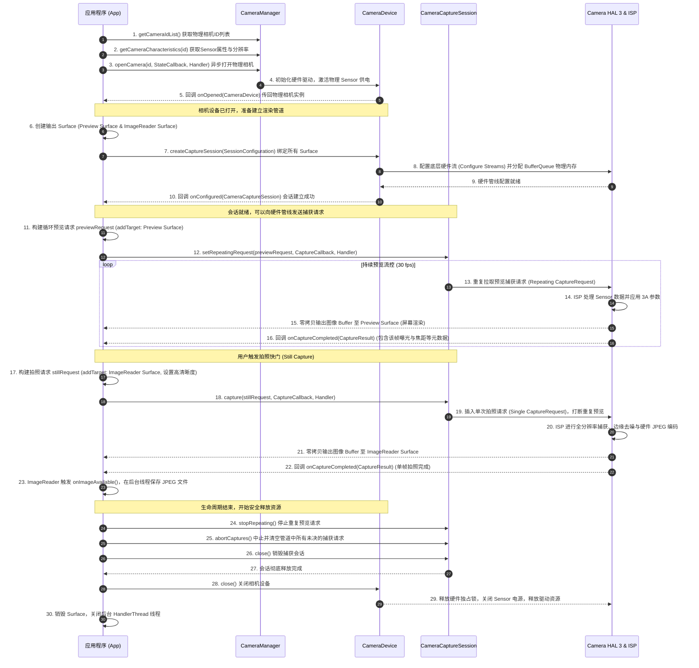

# 5.1.6.3.1 相机

## 1. 核心概念与系统架构（是什么）

Android 相机系统是一个跨越了多个进程空间、涉及软硬件深度协同的复杂体系。为了在保障系统安全与稳定性的同时，为上层应用提供高效的图像捕获能力，Android 设计了一套分层的相机架构体系。

### 1.1 系统架构网络拓扑

相机数据的流动从物理传感器（Sensor）开始，经过底层的硬件驱动、系统服务进程，最终到达应用层的消费者。其完整的技术架构如下：

```
+-------------------------------------------------------------+
|                     Application Layer                       |
|          (App 使用 CameraX 库 或 Camera2 Java API)           |
+-------------------------------------------------------------+
                               | (Java API / Binder Client)
                               v
+-------------------------------------------------------------+
|                    Framework API Layer                      |
|       (android.hardware.camera2 & android.hardware.Camera)  |
+-------------------------------------------------------------+
                               | (Binder IPC)
                               v
+-------------------------------------------------------------+
|                    Camera Service Layer                     |
|           (cameraserver 进程中的 CameraService C++)          |
+-------------------------------------------------------------+
                               | (AIDL / HIDL Binder IPC)
                               v
+-------------------------------------------------------------+
|                  Hardware Abstraction (HAL)                 |
|      (android.hardware.camera.provider@2.x/3.x 独立进程)     |
+-------------------------------------------------------------+
                               | (V4L2 驱动 / I2C / MIPI-CSI)
                               v
+-------------------------------------------------------------+
|                   Kernel & Hardware Layer                   |
|       (ISP 图像信号处理器 & Image Sensor 物理传感器)        |
+-------------------------------------------------------------+
```

### 1.2 各层核心职能与交互机制

1. **应用层（Application）**：
   运行在独立的 App 进程中。开发者可以通过 Jetpack CameraX 库或底层的 Camera2 API 发起相机控制请求。应用层持有数据的接收端，如 `SurfaceView`、`TextureView` 或 `ImageReader`，这些组件本质上是图像缓冲区的消费者。

2. **框架层（Framework API）**：
   位于 `android.hardware.camera2` 包下，提供 Java 语言的相机控制接口。这一层主要是对 C++ 层的 Binder 客户端代理（如 `ICameraDeviceUser`）进行封装，使得 Java 代码能够透明地进行跨进程调用。

3. **系统服务层（Camera Service）**：
   运行在独立的 `cameraserver` 系统进程中，主要组件为 C++ 实现的 `CameraService`。
   - **独占性与优先级管理**：系统相机资源是稀缺且独占的。`CameraService` 维护了一个客户端优先级评估矩阵（基于 App 的 OOM Score、前后台状态等）。当高优先级应用（如系统电话、微信视频通话）请求相机时，`CameraService` 会执行“抢占与驱逐（Eviction）”策略，向当前持有相机的低优先级客户端发送断开连接的回调（`onError(ERROR_CAMERA_IN_USE)`），并强行收回相机硬件控制权。
   - **权限拦截**：在打开相机、开始录音或读取元数据时，`CameraService` 会通过 `AppOpsManager` 和 `PermissionController` 实时校验客户端进程是否持有 `android.permission.CAMERA` 权限，特别是在 Android 10 以后，严格限制了后台进程对相机的访问。

4. **硬件抽象层（Camera HAL）**：
   为了防止硬件驱动的崩溃导致整个 `cameraserver` 乃至系统的崩溃，Android 引入了 Project Treble 架构。相机 HAL 运行在独立的 Provider 进程中（例如 `android.hardware.camera.provider@2.4-service`）。
   - HAL 定义了标准的 C++ 接口，SoC 厂商（如高通、联发科）必须实现这些接口（即 HAL1 或最新的 HAL3 规范）来对接其特定的芯片组与 ISP。
   - **流（Stream）与缓冲区队列（BufferQueue）**：HAL3 的核心是基于流的模型。一个相机流在底层表现为一个 `BufferQueue`。应用层传入的 `Surface` 对应这个队列的消费者，而底层的 ISP/GPU 则是生产者。通过 Gralloc 共享物理内存技术，ISP 处理好的图像数据直接写入物理内存 Buffer，并将其投递到队列中，实现零拷贝的数据传输。

5. **内核与硬件层（Kernel & Hardware）**：
   物理 Sensor（如 Sony IMX 系列）通过 MIPI-CSI 接口将原始的光信号数据（Bayer 格式的 Raw 数据）传输给 ISP（图像信号处理器）。ISP 芯片负责执行去噪、色彩校正、镜头阴影补偿、3A 算法（自动曝光 AE、自动对焦 AF、自动白平衡 AWB）等硬件加速处理，最终将处理后的图像输出为 YUV（如 YUV_420_888）或 JPEG 格式。

---

## 2. 架构演进与设计取舍（为什么）

从 Android 诞生至今，相机 API 历经了三次重大变革，每一次演进都是在性能、控制粒度、兼容性以及开发效率之间做出的深刻取舍。

| 维度 | Camera (Camera1) | Camera2 | CameraX |
| :--- | :--- | :--- | :--- |
| **设计架构** | 同步、单线程、扁平化 | 异步、管道化、面向流、状态机 | 基于 Lifecycle 的 UseCase 声明式架构 |
| **执行模式** | 阻塞式同步调用，主线程极易 ANR | 完全异步回调，一帧一参控制 | 自动绑定生命周期，内部托管异步逻辑 |
| **数据分发** | 单路输出为主，多路分流效率极低 | 硬件级多路流式分发（BufferQueue） | 自动配置多路流，屏蔽底层 Surface 细节 |
| **参数修改** | `Camera.Parameters` 序列化字典 | `CaptureRequest` 逐帧精细化 Key-Value | 场景化用例配置，支持厂商扩展 (Extensions) |
| **兼容性** | 较差（厂商底层实现差异大） | 极差（硬件级别碎片化，底层 Bug 频出）| 极佳（内部提供兼容性垫片库） |

### 2.1 Camera1（已弃用）：同步单线程架构与多路输出硬伤

Camera1 设计于 Android 早期，当时移动设备的传感器性能孱弱，处理场景单一（主要是简单的取景和单张拍照）。其架构设计存在以下致命硬伤：

1. **同步阻塞与 ANR 隐患**：
   Camera1 许多关键的硬件操作（如 `Camera.open()`、`startPreview()`、`takePicture()`）都是同步阻塞的。硬件初始化、ISP 预热、Sensor 寄存器写入等操作往往耗时数百毫秒甚至数秒。如果开发者在 UI 主线程中直接调用，会直接造成主线程卡死从而引发 ANR。即使将它们放入后台线程，由于 Camera1 缺乏细粒度的状态回调，多线程并发控制下极易产生死锁。

2. **多路输出（Multi-stream）的物理缺陷**：
   在 Camera1 中，数据流的通路是极其单一的。通常只能通过一个 `SurfaceHolder` 将预览帧直接投递到屏幕，或者通过 `setPreviewCallback` 将每一帧图像的 YUV 字节数组（`byte[]`）回调给 Java 层。
   - **拷贝与功耗灾难**：如果应用需要同时实现三个功能：**本地屏幕预览**、**MediaRecorder 录制 H.264 视频**、**OpenCV 实时人脸分析**。
   - 在 Camera1 下，应用无法建立独立的高效硬件通路。开发者只能使用 `PreviewCallback` 把 YUV 图像数据读入 Java 堆内存，然后再开辟多个线程进行手动的内存拷贝、裁剪、缩放，最后再将数据拷贝回 C++ 层的编码器或算法引擎。这导致 CPU 和内存带宽被大量无谓的拷贝操作占满，引起设备发热、掉帧和功耗飙升。

3. **扁平化参数的序列化瓶颈**：
   Camera1 的所有控制参数都存放在一个扁平的 `Camera.Parameters` 字典中。每次修改参数（如打开闪光灯 `parameters.setFlashMode(...)`），都需要执行 `Camera.setParameters(parameters)`。该方法在底层会将整个字典序列化为一个巨大的 Key-Value 字符串，通过 Binder 发送给 HAL。HAL 解析完这串长字符串后，重新配置所有硬件寄存器。这种“牵一发而动全身”的臃肿设计，导致相机无法支持在连拍时“一帧一参”（例如高动态范围 HDR 拍摄时，快速交替捕获不同曝光时间的三帧图像）。

### 2.2 Camera2：基于管道（Pipeline）的多路异步机制

为了彻底解决 Camera1 的痛点，Android 5.0 (API 21) 引入了全新的 [Camera2 API](../../../../../AndroidVersionChangeLog.md#android-50-api-21)。它完全重构了底层的 HAL 规范，推出了基于管道（Pipeline）的高性能异步架构。

1. **管道工作流（Pipeline Flow）**：
   Camera2 把相机硬件抽象为一个单向的流处理管道。其运行机制类似于图形渲染管线：
   - 应用向管道发送捕获请求（`CaptureRequest`）。
   - 管道中的硬件实体（Sensor, 3A 处理器, ISP, Scaler）按照 Request 的参数进行曝光和处理。
   - 管道输出捕获结果（`CaptureResult`，包含实际曝光参数等元数据）和图像数据流（`CameraMetadata` 与 `Buffer`）。

2. **硬件级多路流式分发（Multi-stream Delivery）**：
   这是 Camera2 最强大的特性。HAL3 允许应用在创建 `CameraCaptureSession` 时，一次性向底层注册多个不同的 Target `Surface`（例如预览 Surface、录制 Surface、大图拍照 Surface、实时分析 Surface）。
   - **BufferQueue 零拷贝分发**：当底层的 ISP 芯片处理好一帧图像后，底层的 Scaler 硬件模块会在硬件层面对这一帧进行尺寸缩放和格式裁剪。然后，利用 Android 的 Gralloc 共享物理内存机制，将图像缓冲区（Buffer）的所有权，分别直接分发给注册的各个 Target Surface 对应的 `BufferQueue`。
   - 这一分发完全发生在 Native 层及硬件驱动中，不经过 Java 堆内存，也不存在任何像素拷贝。因此，应用可以无缝、高效地同时进行高帧率预览、高画质录像以及算法分析。

3. **一帧一参（Frame-by-frame control）**：
   每一个 `CaptureRequest` 都是独立的，它只作用于当前那一帧图像的处理。例如，开发者可以在发送 `CaptureRequest` 时，明确指定这一帧的曝光时间为 1/100s、ISO 为 400，下一帧的曝光时间为 1/400s、ISO 为 100。这种机制让 App 能够完美控制硬件实现连拍合成、多帧降噪等复杂的计算摄影算法。

### 2.3 CameraX：基于生命周期感知的 Jetpack 组件

Camera2 虽强，但由于它暴露的控制参数极多、回调逻辑非常碎片化，且国内不同厂商对 Camera2 HAL 的实现存在隐蔽的 Bug（如在特定分辨率下预览拉伸、特定机型对焦卡死等），导致开发者需要编写极其庞大且脆弱的适配代码。
为此，Google 推出了 Jetpack 库 CameraX。

1. **用例（UseCase）设计**：
   CameraX 不要求开发者直接操作复杂的 Surface、Session 和 Pipeline，而是将相机的核心功能抽象为具体的“用例”：
   - `Preview`：负责输出用于屏幕取景的流。
   - `ImageCapture`：负责拍摄高质量的照片并自动保存到文件。
   - `ImageAnalysis`：提供一个可编程的缓冲区（如 YUV_420_888 格式的 `ImageProxy`），供 CPU/GPU 进行实时 CV 算法分析。
   - `VideoCapture`：负责视屏录制。
   开发者只需声明并绑定所需的 UseCase，CameraX 就会在底层自动计算并组装最佳的 Surface 分发逻辑。

2. **生命周期自动托管（Lifecycle-Aware）**：
   Camera2 极其容易因为生命周期管理不当而发生 ANR 或崩溃。CameraX 通过绑定 `ProcessCameraProvider` 与 Activity/Fragment 的 `LifecycleOwner`，将相机的生命周期完全托管。当 Activity 处于 `ON_START` 时，自动打开相机并构建 Session；在 `ON_STOP` 时，自动销毁 Session 并断开物理连接，彻底杜绝了相机泄露和独占资源被抢占时的 crash 风险。

3. **厂商扩展支持（Vendor Extensions）**：
   各大手机厂商为了提升相机的竞争力，往往会在底层 HAL 中集成其独家的夜景、人像、美颜、HDR 等图像算法。CameraX 提供了统一的 Extension API（`ExtensionsManager`），只需几行代码，即可唤醒这些以往只有系统自带相机才能享用的底层加速能力。

---

## 3. Camera2 核心工作流与时序（怎么做）

在使用 Camera2 进行相机开发时，我们需要深度理解四个最核心的类，并遵循严密的时序进行状态流转。

### 3.1 核心 API 角色分析

*   **`CameraManager`**：
    相机系统的总管。通过 `context.getSystemService(Context.CAMERA_SERVICE)` 获取。它负责枚举物理摄像头（`getCameraIdList()`）、查询摄像头硬参数（`getCameraCharacteristics(id)`）以及调用 `openCamera()` 打开设备。
*   **`CameraDevice`**：
    物理摄像头的抽象代理。它的生命周期通过 `CameraDevice.StateCallback` 进行监听。当 `onOpened()` 回调被触发时，代表我们成功拿到了 `CameraDevice` 实例。它负责创建 `CaptureRequest.Builder` 和 `CameraCaptureSession`。
*   **`CameraCaptureSession`**：
    捕获会话。是应用和底层 HAL 交互的唯一纽带。通过 `CameraDevice.createCaptureSession()` 创建，创建时需要传入所有的 Target Surface。当回调 `onConfigured()` 触发时，会话正式建立。
*   **`CaptureRequest`**：
    捕获请求。通过 `CameraDevice.createCaptureRequest(templateType)` 构建。`templateType` 可以指定预览（`TEMPLATE_PREVIEW`）、拍照（`TEMPLATE_STILL_CAPTURE`）或录像（`TEMPLATE_RECORD`）等模板。

### 3.2 Camera2 完整工作时序图

以下是 Camera2 从初始化、开启、会话配置、重复预览、单次拍照直至最后释放资源的完整 Mermaid 时序图：



---

## 4. 常见误区与最佳实践（重难点避坑）

在相机开发中，最核心的难点并非跑通时序，而是在各种复杂的业务场景与设备硬件适配中如何防范画面拉伸变形与崩溃。

### 4.1 避坑一：画面拉伸与旋转（Matrix 计算与自适应）

**现象描述**：
应用在某些手机上竖屏预览时，画面被严重压扁或拉长；横竖屏切换时，画面发生了 90 度或 270 度的偏移。

#### 4.1.1 物理传感器方向（Sensor Orientation）与屏幕显示方向（Display Orientation）

1.  **物理 Sensor 方向**：
    手机内部的摄像头 Sensor 在出厂安装时，它的长边通常是与手机的长边垂直的。大多数 Android 设备后置摄像头的 `Sensor Orientation` 为 **90°**（即 Sensor 的顶部朝向手机的右侧）。
2.  **屏幕显示方向**：
    用户在持握手机时，屏幕的旋转方向。通常可以通过 `windowManager.defaultDisplay.rotation` 获取，它返回 `ROTATION_0`（竖屏）、`ROTATION_90`（顺时针横屏）、`ROTATION_180`（反向竖屏）或 `ROTATION_270`（逆时针横屏）。

#### 4.1.2 画面旋转补偿角计算公式

为了让 Sensor 采集到的图像正立地显示在屏幕上，我们需要计算出一个“旋转补偿角度”。计算公式如下：

*   **后置摄像头**（顺时针旋转补偿）：
    $$\text{rotation} = (\text{sensorOrientation} - \text{displayOrientationDegrees} + 360) \pmod{360}$$
*   **前置摄像头**（因存在水平镜像，且扫描方向相反，需做镜像和反向旋转）：
    $$\text{rotation} = (\text{sensorOrientation} + \text{displayOrientationDegrees}) \pmod{360}$$
    $$\text{rotation} = (360 - \text{rotation}) \pmod{360}$$

#### 4.1.3 使用 Matrix 纠正预览拉伸的代码实现

当 `TextureView` 的物理宽高比例（如竖屏下的 $1080 \times 1920$）与相机预览输出的分辨率比例（如 $1080 \times 1440$，即 3:4）不一致时，如果不进行 Matrix 变换，系统会默认拉伸 Buffer 以填充整个 `TextureView`，从而造成形变。

最佳实践是保持比例一致，在 `TextureView` 宽高大于预览宽高时进行缩放剪裁（`CENTER_CROP`）或等比自适应（`FIT_CENTER`）。以下是利用仿射变换 Matrix 纠正预览画面拉伸的具体 Kotlin 代码实现：

```kotlin
import android.graphics.Matrix
import android.graphics.RectF
import android.view.Surface
import android.view.TextureView

/**
 * 纠正 TextureView 预览画面的拉伸与旋转
 *
 * @param textureView 用于预览的 TextureView 控件
 * @param previewWidth 相机输出的预览宽度 (Sensor 坐标系下的宽度，即长边)
 * @param previewHeight 相机输出的预览高度 (Sensor 坐标系下的高度，即短边)
 * @param displayRotation 屏幕显示方向，如 Surface.ROTATION_0
 * @param sensorOrientation 相机物理传感器的方向，通常为 90 或 270
 */
fun configureTransform(
    textureView: TextureView,
    previewWidth: Int,
    previewHeight: Int,
    displayRotation: Int,
    sensorOrientation: Int
) {
    val viewWidth = textureView.width
    val viewHeight = textureView.height
    if (viewWidth == 0 || viewHeight == 0) return

    val matrix = Matrix()
    
    // 1. 获取屏幕旋转的角度值
    val rotationDegrees = when (displayRotation) {
        Surface.ROTATION_0 -> 0
        Surface.ROTATION_90 -> 90
        Surface.ROTATION_180 -> 180
        Surface.ROTATION_270 -> 270
        else -> 0
    }

    // 2. 定义当前视图和相机输出的边界矩形
    val viewRect = RectF(0f, 0f, viewWidth.toFloat(), viewHeight.toFloat())
    // 注意：相机输出的分辨率是基于 Sensor 坐标系的，此处 previewWidth 通常是长边 (如 1920)，previewHeight 是短边 (如 1080)
    val bufferRect = RectF(0f, 0f, previewHeight.toFloat(), previewWidth.toFloat())
    
    val centerX = viewRect.centerX()
    val centerY = viewRect.centerY()

    // 3. 计算旋转方向并进行对齐
    if (Surface.ROTATION_90 == displayRotation || Surface.ROTATION_270 == displayRotation) {
        bufferRect.offset(centerX - bufferRect.centerX(), centerY - bufferRect.centerY())
        
        // 手机横屏时，将相机 Buffer 的边界矩形通过 FIT_START 等比缩放到视图矩形内
        matrix.setRectToRect(viewRect, bufferRect, Matrix.ScaleToFit.FILL)
        
        // 计算缩放比，防止横屏下的图像被拉伸
        val scale = maxOf(
            viewHeight.toFloat() / previewHeight,
            viewWidth.toFloat() / previewWidth
        )
        matrix.postScale(scale, scale, centerX, centerY)
        
        // 旋转画面以补偿屏幕旋转
        matrix.postRotate((90 * (displayRotation - 2)).toFloat(), centerX, centerY)
    } else if (Surface.ROTATION_180 == displayRotation) {
        matrix.postRotate(180f, centerX, centerY)
    } else {
        // Surface.ROTATION_0 竖屏状态下的拉伸处理
        // 计算能够将预览 Buffer 完全 CenterCrop 填充 TextureView 的最小缩放比
        val scaleX = viewWidth.toFloat() / previewHeight // 竖屏下，Sensor 的高度 (短边) 对应屏幕宽度
        val scaleY = viewHeight.toFloat() / previewWidth  // 竖屏下，Sensor 的宽度 (长边) 对应屏幕高度
        
        val scale = maxOf(scaleX, scaleY)
        
        // 以中心点为基准进行等比缩放，避免拉伸
        matrix.postScale(scaleX / scale, scaleY / scale, centerX, centerY)
        
        // 如果物理 Sensor 的朝向是 90 度，且屏幕是正向竖屏，我们需要通过旋转使画面立起来
        if (sensorOrientation == 90 || sensorOrientation == 270) {
            val degreeOffset = if (sensorOrientation == 90) 90f else 270f
            matrix.postRotate(degreeOffset, centerX, centerY)
        }
    }

    // 4. 将计算好的 Matrix 应用 to TextureView
    textureView.setTransform(matrix)
}
```

### 4.2 避坑二：释放顺序引发崩溃（Memory Leak & Deadlock）

**崩溃成因**：
当用户快速退出 Activity，或者切出应用时，如果直接粗暴地调用 `CameraDevice.close()` 或直接销毁 Activity 容器，底层会频繁爆出 `SIGSEGV`（Segmentation Fault）空指针异常，或者导致下一次打开相机时出现 `CameraAccessException: CAMERA_DISCONNECTED`，且该状态会一直持续直到系统重启。
- **底层原理**：
  HAL3 本质上是一个高吞吐的异步 `BufferQueue` 管道。当我们向 Session 提交了多个 `CaptureRequest` 后，即使我们在上层调用了 `CameraDevice.close()`，底层的 ISP 与 GPU 可能仍然在异步地向已经注册的 Surface 中写入图像帧。
  如果应用在物理相机 `CameraDevice` 彻底关闭前，就销毁了 `Surface` 或者是释放了 `ImageReader`，那么底层的 HAL 硬件线程在向已被释放的 `ANativeWindow`（Surface 的底层 Native 载体）投递 Buffer 时，就会发生内存越界访问而直接 Crash。同时，未释放的底层会话会一直锁死物理相机的硬件独占锁（Exclusive Lock），导致其他任何应用无法再打开相机。

#### 4.2.1 最佳实践：黄金销毁流

为了保障 native 内存与物理相机的安全退出，在关闭相机资源时，必须遵循以下“逆序释放”的最佳实践：

```
[开始释放] 
   │
   ▼
1. 停止 RepeatingRequest ────────► 阻止 HAL 继续拉取和生产新的预览 Buffer
   │
   ▼
2. 调用 abortCaptures() ──────────► 抛弃和清空 Pipeline 队列中所有 Pending 的 Request
   │
   ▼
3. 关闭 CameraCaptureSession ────► 显式宣告销毁交互通道
   │
   ▼
4. 等待 Session 销毁回调/同步阻塞 ─► 确认无任何异步 Buffer 写入动作
   │
   ▼
5. 关闭 CameraDevice ────────────► 断开物理连接，断电并释放硬件独占锁
   │
   ▼
6. 释放 ImageReader/Surface ─────► 安全释放 Consumer 内存，避免 Segment Fault
   │
   ▼
7. 退出 HandlerThread ───────────► 结束相机的异步循环 MessageQueue 机制
```

#### 4.2.2 资源释放的严密 Kotlin 代码实现

```kotlin
import android.hardware.camera2.CameraCaptureSession
import android.hardware.camera2.CameraDevice
import android.media.ImageReader
import android.os.HandlerThread
import android.util.Log

class CameraReleaseManager {
    private val TAG = "CameraReleaseManager"

    private var mCameraDevice: CameraDevice? = null
    private var mCaptureSession: CameraCaptureSession? = null
    private var mImageReader: ImageReader? = null
    private var mBackgroundThread: HandlerThread? = null
    
    // 用于确保释放操作同步进行、互斥的锁
    private val mReleaseLock = Any()

    /**
     * 安全且同步地释放相机所有关联资源
     */
    fun safeReleaseCamera() {
        synchronized(mReleaseLock) {
            Log.d(TAG, "开始执行相机黄金销毁流...")

            // 1. 首先关闭捕获会话，切断上层与 HAL3 的控制流
            if (mCaptureSession != null) {
                try {
                    // 停止重复预览请求，阻止新 Buffer 产生
                    mCaptureSession?.stopRepeating()
                    // 中止所有未决请求，清空硬件 Pipeline
                    mCaptureSession?.abortCaptures()
                } catch (e: Exception) {
                    Log.e(TAG, "停止 Session 请求失败: ${e.message}")
                } finally {
                    mCaptureSession?.close()
                    mCaptureSession = null
                    Log.d(TAG, "1. CameraCaptureSession 已关闭")
                }
            }

            // 2. 关闭物理相机代理，断开物理通路并释放物理锁
            if (mCameraDevice != null) {
                mCameraDevice?.close()
                mCameraDevice = null
                Log.d(TAG, "2. CameraDevice 已关闭")
            }

            // 3. 在确认物理连接彻底断开后，释放消费者数据通道 (ImageReader)
            // 此时已无底层硬件线程向此 Surface 投递 Buffer，安全无 Crash 隐患
            if (mImageReader != null) {
                mImageReader?.close()
                mImageReader = null
                Log.d(TAG, "3. ImageReader 已销毁")
            }

            // 4. 最后退出专门负责接收相机回调的后台 HandlerThread 线程
            if (mBackgroundThread != null) {
                mBackgroundThread?.quitSafely()
                try {
                    mBackgroundThread?.join(500) // 等待后台线程安全退出
                } catch (e: InterruptedException) {
                    Log.e(TAG, "后台线程 Join 被中断: ${e.message}")
                }
                mBackgroundThread = null
                Log.d(TAG, "4. 后台 HandlerThread 已退出")
            }

            Log.d(TAG, "相机黄金销毁流执行完毕，所有资源安全释放。")
        }
    }
}
```

---

## 5. 性能优化与版本兼容性

随着 Android 版本的不断迭代，Google 在相机底层的图形缓冲区管理、高分辨率控制、以及多摄像头协作方面做了大量的优化。涉及版本演进的变更日志可以参考 [AndroidVersionChangeLog.md](../../../../../AndroidVersionChangeLog.md)。

### 5.1 图像缓冲区优化最佳实践

1.  **复用 ImageReader 的 Image 对象**：
    在 `ImageReader.OnImageAvailableListener` 回调中，必须及时调用 `image.close()`。如果不显式释放，`BufferQueue` 中的缓冲区会被一直占满，导致底层的 HAL 无法获取空闲的 GraphicBuffer，从而引发卡顿和掉帧。
2.  **设置合适的 maxImages 数量**：
    创建 `ImageReader.newInstance(width, height, format, maxImages)` 时，`maxImages` 代表队列中允许缓存的最大图像帧数。
    - 如果用于连拍或多帧合成，建议设置为 `3` 到 `5`。
    - 如果仅用于单张拍照，设置为 `2` 即可。设置过大不仅会额外消耗几百兆的物理运存（因为高分辨率物理 Gralloc Buffer 空间极大），还会导致明显的内存瞬时飙升。

### 5.2 版本兼容关键演进

*   **Android 5.0 (API 21)**：
    首度引入了 [Camera2 API](../../../../../AndroidVersionChangeLog.md#android-50-api-21)，废弃了 Camera1。但是许多低端设备在底层只实现了 `LEGACY`（即用 Camera1 驱动桥接）或 `LIMITED` 级别的 Camera2 支持，只有 `FULL` 或 `LEVEL_3` 级别的设备才支持完整的一帧一参和 RAW 格式捕获。
*   **Android 9.0 (API 28)**：
    引入了 [多摄像头物理流控制（Logical Multi-Camera）](../../../../../AndroidVersionChangeLog.md#android-90-api-28)。支持通过一个逻辑 ID（如相机 ID 0）控制多个物理摄像头（如一个超广角、一个主摄、一个长焦），应用可以利用 `characteristics.physicalCameraIds` 属性获取其包含的物理摄像头 ID，并向每个物理摄像头发送独立的 `CaptureRequest`，获取不同视角的图像 Buffer。
*   **Android 10.0 (API 29)**：
    [限制了后台相机访问权限](../../../../../AndroidVersionChangeLog.md#android-100-api-29)。当 App 进入后台失去焦点时，即使其持有着前台服务（Foreground Service），其相机连接也会被强行断开并释放。同时，该版本正式加强了对 CameraX 厂商扩展（HDR、美颜、夜间模式）的官方 HAL3 适配标准。
*   **Android 11/12 (API 30/31)**：
    引入了在拍摄视频时关闭物理振动器与扬声器（以防录像杂音）、缩放比例平滑过渡插值器、以及支持相机并发（如前置和后置摄像头同时开启捕获预览）等新能力。
