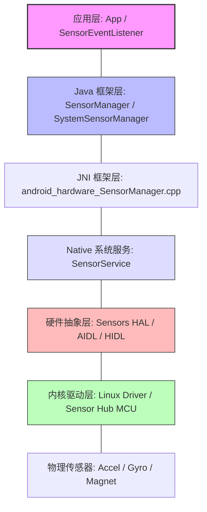
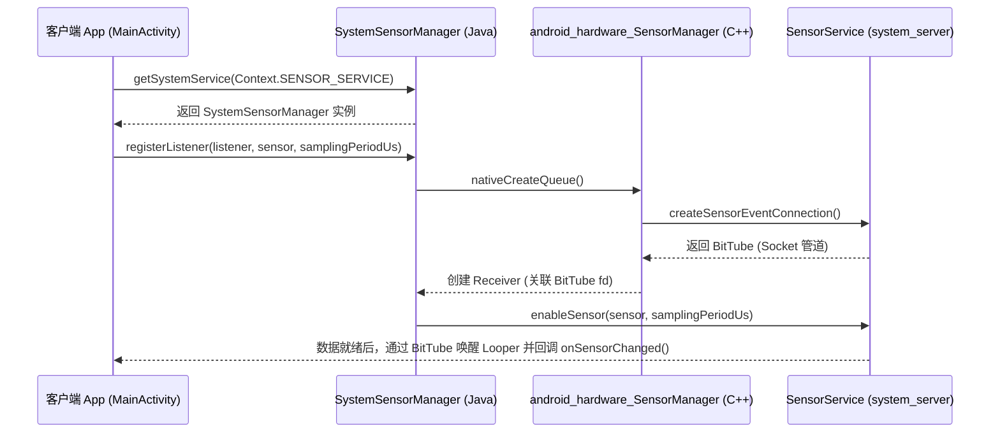

# 传感器

在 Android 移动开发与智能设备生态中，传感器（Sensors）是设备感知物理世界、实现人机交互的核心媒介。无论是屏幕自动旋转、步数追踪、VR/AR 姿态估算，还是商业应用中常见的“摇一摇”功能，都离不开传感器子系统的支持。

然而，传感器的硬件特性（如噪声、零点漂移）以及高频采样带来的电量雪崩，给开发者带来了极大的技术挑战。本文将从 Android 传感器框架（Sensor Framework）的底座架构出发，深入剖析其工作机制，推导“互补滤波”及“摇一摇”等核心数据融合算法的物理与数学原理，并针对后台功耗优化给出工程级的最佳实践。

---

## 1. Android 传感器框架与架构设计

Android 传感器系统采用典型的分层架构，从底层的物理芯片一直延伸到应用层的 Java API。为了在低功耗状态下持续收集传感器数据，现代 Android 设备普遍引入了 **Sensor Hub**。

### 1.1 传感器系统五层架构



1. **物理传感器层（Hardware）**：集成在主板上的 MEMS（微机电系统）芯片，如加速度计、陀螺仪、磁力计、气压计等。
2. **内核驱动与 Sensor Hub 层（Kernel & MCU）**：
   - **Linux Driver**：负责控制 I2C/SPI 总线，将硬件寄存器中的原始 ADC 数值读出，暴露为内核设备节点（如 `/dev/input/` 或 `sysfs`）。
   - **Sensor Hub（微控制器）**：现代智能手机通常配有一颗独立的、超低功耗的协处理器（如 ARM Cortex-M 系列）。它运行轻量级实时操作系统（RTOS），在应用处理器（AP，如骁龙、天玑）处于休眠状态时，不间断地读取物理传感器数据，进行底层的步数检测、抬腕亮屏等手势识别。只有当需要通知 AP 或缓冲区满时，才通过硬件中断唤醒 AP。
3. **硬件抽象层（HAL）**：定义了 Native 服务与内核驱动之间的标准接口。在较新的 Android 版本中，Sensors HAL 已逐步从 HIDL 迁移到 AIDL 接口。它屏蔽了具体硬件厂商的驱动差异，向系统服务提供统一的 `sensors_event_t` 结构体数据。
4. **Native 系统服务层（SensorService）**：运行在 `system_server` 进程中。它负责控制传感器的开关、调整采样率、管理传感器事件队列，并将数据多路复用（Multiplexing）分发给不同的客户端进程。
5. **Java 框架层（Framework）**：封装了 `SensorManager`、`Sensor` 以及事件回调接口。通过 JNI 与底层的 `SensorService` 进行高效的跨进程通信。

### 1.2 传感器分类体系与数据表征

Android 传感器主要分为三大类：

| 传感器大类 | 常见传感器类型 | 物理量与单位 | 常见物理/合成属性 | 典型应用场景 |
| :--- | :--- | :--- | :--- | :--- |
| **动作传感器 (Motion)** | 加速度计 (`Sensor.TYPE_ACCELEROMETER`) | 加速度 ($m/s^2$) | 物理传感器 | 步数检测、摇一摇、碰撞检测 |
| | 陀螺仪 (`Sensor.TYPE_GYROSCOPE`) | 角速度 ($rad/s$) | 物理传感器 | 3D 游戏视角控制、VR 头部追踪 |
| | 重力传感器 (`Sensor.TYPE_GRAVITY`) | 重力加速度 ($m/s^2$) | 合成传感器 | 屏幕旋转、静态姿态识别 |
| | 线性加速度计 (`Sensor.TYPE_LINEAR_ACCELERATION`) | 排除重力后的加速度 ($m/s^2$) | 合成传感器 | 运动轨迹推算、手势识别 |
| **位置传感器 (Position)** | 磁力计 (`Sensor.TYPE_MAGNETIC_FIELD`) | 地磁场强度 ($\mu T$) | 物理传感器 | 指南针、金属探测器 |
| | 接近传感器 (`Sensor.TYPE_PROXIMITY`) | 距离 ($cm$ 或 远/近状态) | 物理传感器 | 通话贴耳灭屏 |
| | 旋转矢量 (`Sensor.TYPE_ROTATION_VECTOR`) | 四元数/旋转矩阵 (无单位) | 合成传感器 | 3D 空间姿态高精度定位 |
| **环境传感器 (Environmental)** | 光线传感器 (`Sensor.TYPE_LIGHT`) | 光照强度 ($lx$) | 物理传感器 | 屏幕亮度自动调节 |
| | 气压计 (`Sensor.TYPE_PRESSURE`) | 大气压强 ($hPa$) | 物理传感器 | 海拔高度估算、室内楼层定位 |

> [!NOTE]
> **物理传感器 vs 合成（虚拟）传感器**：
> 物理传感器直接对应硬件芯片的数据输出。而合成传感器（如 `TYPE_GRAVITY` 和 `TYPE_LINEAR_ACCELERATION`）并不存在对应的实体芯片，它们是由 Android HAL 层或 Sensor Hub 通过算法（如低通滤波、卡尔曼滤波）将物理加速度计的数据与陀螺仪的数据进行融合计算，拆分出的虚拟数据。

---

## 2. Android 传感器核心工作机制

在应用开发中，传感器框架的使用依赖于“三要素”：`SensorManager`、`Sensor` 和 `SensorEventListener`。本节将深度剖析这三要素在底层的协作模型以及高频数据分发的性能优化机制。

### 2.1 框架三要素及其底层模型



1. **SensorManager（服务管理器）**：
   - 开发者通过 `Context.getSystemService(Context.SENSOR_SERVICE)` 获取的实际是 `SystemSensorManager`（`SensorManager` 的具体子类）。
   - 它在构造时会通过 JNI 初始化 Native 层的 `SensorManager` 客户端代理，并建立与 `SensorService` 的 Binder 通信通道。
2. **Sensor（传感器元数据）**：
   - 该类是一个单纯的 Java 实体类，承载了该硬件的名称、厂商、版本、最大量程、分辨率、瞬时功耗（mA）、最小采样延迟（`getMinDelay()`）以及硬件 FIFO 缓冲区大小（`getFifoMaxEventCount()`）。
   - `isWakeUpSensor()` 属性非常关键，它决定了当 AP 进入休眠状态时，该传感器是否能够产生硬件中断来强制唤醒 AP。
3. **SensorEventListener（事件监听器）**：
   - 提供两个核心回调：`onSensorChanged(SensorEvent event)` 和 `onAccuracyChanged(Sensor sensor, int accuracy)`。
   - `SensorEvent` 包含 `values` 浮点数数组（数据载荷）、`timestamp`（时间戳，单位纳秒，**基于系统启动时间 `SystemClock.elapsedRealtimeNanos()`**）以及精度 `accuracy`。

### 2.2 零 Binder 调用高频分发机制：BitTube

在传感器高频采样（如 100Hz 以上）的场景下，如果每次数据回调都通过标准的 Binder 跨进程调用（IPC）将数据从 `system_server` 传输到 App 进程，会产生灾难性的 CPU 上下文切换开销。

为了解决这一痛点，Android 设计了 **BitTube** 机制：
- **管道建立**：当 App 注册监听器时，Native 层的 JNI 代码会请求 `SensorService` 创建一个数据传输通道。`SensorService` 在 C++ 层分配一对 Unix Domain Socket（`socketpair`），这一对 Socket 被封装成 `BitTube` 对象。
- **文件描述符传递**：`SensorService` 将其中一个 Socket 的文件描述符（fd）通过 Binder 跨进程传递给 App 进程。
- **Looper 异步监听**：App 进程的 `SystemSensorManager` 会在 Native 层将接收到的 fd 注册到当前线程（通常是主线程或用户指定的 HandlerThread）的 `Looper` 中，利用 Linux 的 `epoll` 机制进行非阻塞的异步 I/O 监听。
- **数据分发**：当物理传感器产生新数据时，HAL 层回调 `SensorService`，服务直接向 Socket 的写入端写入 `sensors_event_t` 结构体。App 进程的 `Looper` 监听到该 fd 可读，立刻被唤醒，在 Native 层读取数据反序列化为 Java 的 `SensorEvent`，并直接回调 `onSensorChanged`。

整个高频数据流传输完全避开了 Binder 调用的开销，仅依赖于高效的内存 Socket 管道与 Linux I/O 复用机制，保证了极低的时延和系统损耗。

---

## 3. 传感器数据融合与滤波算法

物理传感器由于其半导体微机电（MEMS）材料的物理局限性，单体输出往往存在严重的缺陷。这就需要利用数学与物理算法对多种传感器的数据进行交织融合，以获取精确、平滑的系统状态。

### 3.1 互补滤波算法（Complementary Filter）

在姿态估计（如估算手机的倾斜角度 $\theta$）中，我们通常需要融合**加速度计**与**陀螺仪**的数据。

#### 3.1.1 传感器物理局限性分析

- **加速度计（Accelerometer）**：
  - **物理特性**：测量手机在各个轴向上的总加速度（包含重力加速度）。在静态或匀速状态下，通过重力分量可以利用三角函数（如 $a_{acc} = \arctan(y/z)$）精确计算出手机的绝对倾斜角度。
  - **局限性**：高频噪声大。当手机发生瞬时晃动、手震或用户走路时，动态运动加速度会混入其中。如果直接使用加速度计数据，角度值会产生严重的剧烈抖动。即：**加速度计低频稳定（指示重力方向），但高频成分充满了非重力噪声。**
- **陀螺仪（Gyroscope）**：
  - **物理特性**：测量手机绕各个轴旋转的角速度 $\omega$。将角速度对时间进行积分：$\theta_{gyro}(t) = \theta_{gyro}(t-\Delta t) + \omega \times \Delta t$，即可得到当前的动态旋转角度。它对瞬时的快速旋转极为灵敏，完全不受平移震动的干扰。
  - **局限性**：零点漂移（Zero-drift）。受温度、制造工艺微小偏差的影响，即使陀螺仪处于绝对静止状态，其角速度输出也不为零（存在一个微小的偏置误差 $b$）。这个误差在时间积分的累积下会线性增长，导致角度值随时间无限漂移（Drift）。即：**陀螺仪高频响应敏锐（捕捉快速转动），但低频成分极差（由于零漂导致静态积分漂移）。**

#### 3.1.2 互补滤波数学原理

为了结合两者的优势，互补滤波算法通过**低通滤波器**滤除加速度计的高频动态干扰，通过**高通滤波器**滤除陀螺仪的低频零点漂移。

在频域中，我们设计两个传递函数 $G_{acc}(s)$ 和 $G_{gyro}(s)$。为了保证信号不失真，它们的代数和必须为 1：

$$G_{acc}(s) + G_{gyro}(s) = 1$$

最简单的一阶互补滤波器设计如下：

- 对加速度计使用一阶低通滤波器：
  $$G_{acc}(s) = \frac{1}{1 + \tau s}$$
- 对陀螺仪使用一阶高通滤波器：
  $$G_{gyro}(s) = \frac{\tau s}{1 + \tau s}$$

其中，$\tau$ 是滤波器的时间常数。将这两个频域滤波器通过一阶后向差分法（Backward Euler Method）进行离散化，可以得到在离散时间域（即代码实现中）的递推公式：

$$\theta_{new} = \alpha \times (\theta_{prev} + \omega \times \Delta t) + (1 - \alpha) \times a_{acc}$$

- **$\theta_{new}$**：当前融合后的姿态角度估算值。
- **$\theta_{prev}$**：上一次融合后的角度估算值。
- **$\omega$**：陀螺仪本次测得的角速度（单位：$rad/s$）。
- **$\Delta t$**：两次采样之间的时间差（单位：$s$），由 `SensorEvent.timestamp` 的差值求出。
- **$a_{acc}$**：基于当前加速度计三轴数据计算得出的绝对倾角（单位：$rad$ 或 角度）。
- **$\alpha$**：滤波系数（权重系数），其取值范围为 $0 < \alpha < 1$，通常在 $0.95 \sim 0.98$ 之间。

#### 3.1.3 滤波系数 $\alpha$ 与截止频率的物理映射

滤波系数 $\alpha$ 并不是凭空捏造的，它与系统的时间常数 $\tau$ 以及采样周期 $\Delta t$ 满足以下数学关系：

$$\alpha = \frac{\tau}{\tau + \Delta t}$$

由此可以推导系统的截止频率（Cut-off Frequency） $f_c$：

$$f_c = \frac{1}{2\pi \tau} = \frac{1 - \alpha}{2\pi \cdot \alpha \cdot \Delta t}$$

> **物理意义推导**：
> 假设我们的采样频率为 100Hz ($\Delta t = 0.01s$)，若我们设定 $\alpha = 0.98$，则：
> $$\tau = \frac{\alpha \cdot \Delta t}{1 - \alpha} = \frac{0.98 \times 0.01}{0.02} = 0.49 \text{ 秒}$$
> 对应的截止频率：
> $$f_c = \frac{1}{2\pi \times 0.49} \approx 0.325 \text{ Hz}$$
> 这意味着，对于持续时间小于 $0.49$ 秒（频率高于 $0.325\text{Hz}$）的快速姿态变化，算法主要信任**陀螺仪的积分值**；而对于持续时间大于 $0.49$ 秒（频率低于 $0.325\text{Hz}$）的慢速或静态姿态，算法主要信任**加速度计的重力投影**。这在物理上完美实现了优势互补。

#### 3.1.4 算法性能对比：互补滤波 vs 卡尔曼滤波

| 维度 | 互补滤波 (Complementary Filter) | 卡尔曼滤波 (Kalman Filter) |
| :--- | :--- | :--- |
| **计算复杂度** | 极低（仅需几步基本的浮点加乘运算） | 较高（涉及矩阵转置、求逆以及多次迭代计算） |
| **内存占用** | 极小（仅需保存上一次的角度状态） | 较大（需要保存状态协方差矩阵、噪声矩阵等） |
| **系统开销** | 极低，适合在 App 应用层高频实时运行 | 较高，在 Java 层高频运行易造成轻微的 CPU 抖动 |
| **物理效果** | 在高频噪声和静态漂移确定时效果极佳 | 能够动态适应随机白噪声，在时变系统下精度极高 |
| **工程推荐** | 适合应用层姿态平滑、轻量级 3D 渲染控制 | 适合底层 HAL 固件、惯性导航、高精度轨迹算法 |

---

### 3.2 商业级“摇一摇”检测算法

许多应用（如社交、电商活动）中的“摇一摇”功能极易发生误触发，例如用户只是起身放下手机、或者轻微晃动，也会被误判定为“摇一摇”。一个商业级的“摇一摇”检测需要使用**加速度向量模长**并结合**高通滤波器**和**状态机判定**。

#### 3.2.1 物理量提纯与高通滤波

若仅判断单一轴向的加速度，当手机翻转时会因为重力分量的漂移导致误判。因此，我们必须计算三轴合成的加速度向量模长 $A_{raw}$：

$$A_{raw} = \sqrt{x^2 + y^2 + z^2}$$

在绝对静止状态下，手机受重力加速度影响，$A_{raw} \approx g \approx 9.8 m/s^2$。
为了提取用户摇晃手机产生的真正**动态加速度**，需要消除重力的常值干扰。我们采用一阶高通滤波器（High-pass Filter）来过滤低频重力分量：

$$A_{low}(n) = \gamma \times A_{low}(n-1) + (1 - \gamma) \times A_{raw}(n)$$

$$A_{dynamic}(n) = A_{raw}(n) - A_{low}(n)$$

- $A_{low}(n)$ 是估算出的平缓重力分量（低通滤波结果）。
- $A_{dynamic}(n)$ 是去除重力后的动态冲击加速度。
- 滤波系数 $\gamma$ 通常取 $0.8 \sim 0.9$。

#### 3.2.2 状态机与滑动窗口过滤机制

仅仅判断 $A_{dynamic}$ 大于某一阈值是不够的，因为单次的快速甩动（如用力放下手机）也会突破该阈值。真正的“摇晃”是一个**往复运动**。

因此，我们设计一个基于**方向反转次数**的状态机：
1. **滑动时间窗口**：设定一个时间范围（如 $500ms$）。
2. **峰值阈值判定**：当 $A_{dynamic}$ 超过阈值（如 $14.0 m/s^2$）时，判定为一次有效的物理冲击。
3. **方向反转检测**：摇晃通常伴随着加速度方向的改变（从正向最大值迅速变为负向最小值）。通过检测相邻的波峰和波谷，若在 $500ms$ 内连续发生了多次（例如 3 次以上）波形方向的交替反转，才判定为一次合法的“摇一摇”动作。

#### 3.2.3 商业级“摇一摇”核心检测代码实现

以下是基于上述物理原理实现的、运行在独立 `HandlerThread` 上的 Lifecycle-aware 摇一摇传感器监听器：

```kotlin
import android.content.Context
import android.hardware.Sensor
import android.hardware.SensorEvent
import android.hardware.SensorEventListener
import android.hardware.SensorManager
import android.os.Handler
import android.os.HandlerThread
import androidx.lifecycle.DefaultLifecycleObserver
import androidx.lifecycle.LifecycleOwner
import kotlin.math.sqrt

class CommercialShakeDetector(
    context: Context,
    private val onShakeTriggered: () -> Unit
) : SensorEventListener, DefaultLifecycleObserver {

    private val sensorManager = context.getSystemService(Context.SENSOR_SERVICE) as SensorManager
    private var accelerometer: Sensor? = sensorManager.getDefaultSensor(Sensor.TYPE_ACCELEROMETER)

    private var sensorThread: HandlerThread? = null
    private var sensorHandler: Handler? = null

    // 滤波与状态机算法参数
    private val lowPassAlpha = 0.9f      // 重力低通滤波器系数 (1-gamma)
    private var gravityEstimate = 9.8f   // 初始重力估算值
    private val shakeThreshold = 13.0f   // 动态加速度阈值 (m/s^2)
    private val windowDurationMs = 600L  // 摇动统计时间窗口 (ms)
    private val minDirectionChanges = 3  // 触发摇一摇的最少反转次数

    // 状态机运行时变量
    private val shakeTimestamps = mutableListOf<Long>()
    private var lastDirection = 0        // -1 代表负向冲击，1 代表正向冲击，0 代表静止
    private var lastDirectionChangeTime = 0L

    override fun onResume(owner: LifecycleOwner) {
        super.onResume(owner)
        if (accelerometer == null) return

        // 1. 创建独立子线程，避免阻塞 UI 线程
        sensorThread = HandlerThread("SensorShakeThread").apply { start() }
        sensorHandler = Handler(sensorThread!!.looper)

        // 2. 在子线程中注册传感器监听，采用 SENSOR_DELAY_GAME 兼顾实时性与功耗
        sensorManager.registerListener(
            this,
            accelerometer,
            SensorManager.SENSOR_DELAY_GAME,
            sensorHandler
        )
    }

    override fun onPause(owner: LifecycleOwner) {
        super.onPause(owner)
        // 3. 及时注销，防止电量泄露
        sensorManager.unregisterListener(this)
        sensorThread?.quitSafely()
        sensorThread = null
        sensorHandler = null
        clearState()
    }

    override fun onSensorChanged(event: SensorEvent?) {
        if (event == null || event.sensor.type != Sensor.TYPE_ACCELEROMETER) return

        val x = event.values[0]
        val y = event.values[1]
        val z = event.values[2]

        // 1. 计算三轴加速度的模长
        val rawMagnitude = sqrt((x * x + y * y + z * z).toDouble()).toFloat()

        // 2. 一阶低通滤波器提取重力成分 (等价于高通滤波前的重力基准估算)
        gravityEstimate = lowPassAlpha * gravityEstimate + (1 - lowPassAlpha) * rawMagnitude

        // 3. 提取滤除重力后的纯动态加速度
        val dynamicAcceleration = rawMagnitude - gravityEstimate

        // 4. 获取当前时间戳
        val currentTime = System.currentTimeMillis()

        // 5. 过滤掉时间窗口外的陈旧记录
        shakeTimestamps.removeAll { currentTime - it > windowDurationMs }

        // 6. 状态机方向反转判定
        if (dynamicAcceleration > shakeThreshold) {
            // 正向加速度冲击
            if (lastDirection != 1 && (currentTime - lastDirectionChangeTime > 100)) {
                lastDirection = 1
                lastDirectionChangeTime = currentTime
                shakeTimestamps.add(currentTime)
            }
        } else if (dynamicAcceleration < -shakeThreshold) {
            // 负向加速度冲击（反方向晃动）
            if (lastDirection != -1 && (currentTime - lastDirectionChangeTime > 100)) {
                lastDirection = -1
                lastDirectionChangeTime = currentTime
                shakeTimestamps.add(currentTime)
            }
        }

        // 7. 若在时间窗口内的有效反转次数达到设定值，触发回调
        if (shakeTimestamps.size >= minDirectionChanges) {
            clearState()
            // 切换回主线程触发业务回调
            android.os.Handler(android.os.Looper.getMainLooper()).post {
                onShakeTriggered()
            }
        }
    }

    override fun onAccuracyChanged(sensor: Sensor?, accuracy: Int) {
        // 忽略精度变化
    }

    private fun clearState() {
        shakeTimestamps.clear()
        lastDirection = 0
        lastDirectionChangeTime = 0L
    }
}
```

---

## 4. 后台功耗控制与优化最佳实践

传感器是典型的“隐藏耗电杀手”。一旦监听器生命周期失控，或者采样参数配置不合理，很容易引发**电量雪崩**。

### 4.1 避坑指南：未及时注销监听导致的后台高功耗

#### 4.1.1 灾难性耗电根源：WakeLock 持续持有

在 Android 系统中，`SensorService` 运行在 `system_server` 进程中。为了将传感器数据派发到应用进程，底层会持有一个名为 `SensorService` 的系统级内核 **WakeLock（唤醒锁）**。

当应用进入后台（如用户按了 Home 键回到桌面），如果开发者未在 `onPause()` 或 `onStop()` 中显式调用 `sensorManager.unregisterListener(listener)`：
1. **AP 无法深睡**：即使手机屏幕关闭，系统内核也会因为应用仍然对传感器保持着活跃监听，而使得主 CPU 无法进入 Deep Sleep 状态。
2. **进程被持续唤醒**：底层的 BitTube 数据通道依然在高频发送数据。由于 Socket 中持续有数据写入，Linux 内核的 `epoll` 机制会不断唤醒被注册了该 fd 的 App 主线程 Looper。
3. **电量雪崩**：根据 Google 官方测试，在屏幕关闭的情况下，一个未注销的加速度计高频监听会导致系统电流从普通的 $2 \sim 3\text{mA}$ 暴增至 $100\text{mA}$ 以上。电池电量会在短短数小时内彻底耗光。

#### 4.1.2 自动防泄漏范式：Lifecycle-Bound Observer

为了彻底规避由于疏忽忘写注销代码导致的内存泄露和功耗泄漏，推荐在 Activity/Fragment 中使用 Jetpack Lifecycle 自动绑定生命周期。

```kotlin
class MyActivity : AppCompatActivity() {

    private lateinit var shakeDetector: CommercialShakeDetector

    override fun onCreate(savedInstanceState: Bundle?) {
        super.onCreate(savedInstanceState)
        setContentView(R.layout.activity_main)

        // 初始化传感器探测器并自动注册为生命周期观察者
        shakeDetector = CommercialShakeDetector(this) {
            // 摇一摇业务处理
            showToast("检测到摇一摇！")
        }

        // 将观察者与 Lifecycle 绑定，无需在 Activity 的 onResume/onPause 中手动写注册注销逻辑
        lifecycle.addObserver(shakeDetector)
    }
}
```

---

### 4.2 采样延迟配置与功耗权衡

`SensorManager` 提供了四种预设的采样速率。开发者应根据实际的业务场景，进行精准的功耗权衡，**切忌一味追求高频采样**。

```mermaid
gantt
    title 传感器采样率延迟对比与功耗趋势
    dateFormat  X
    axisFormat %s
    
    section SENSOR_DELAY_FASTEST
    高频采样 0-10ms : active, 0, 10
    
    section SENSOR_DELAY_GAME
    中高频采样 20ms : active, 0, 20
    
    section SENSOR_DELAY_UI
    中低频采样 60ms : active, 0, 60
    
    section SENSOR_DELAY_NORMAL
    低频采样 200ms : active, 0, 200
```



1. **`SensorManager.SENSOR_DELAY_FASTEST` (0 ms 左右延迟)**：
   - **特点**：以硬件所能达到的极限速率推送数据（视硬件不同，通常在 2ms ~ 10ms 之间）。
   - **功耗**：极高。CPU 会因为高频中断而被完全占满。
   - **适用场景**：仅在开发专业的物理参数测量仪、高精尖短时碰撞实验时使用。
2. **`SensorManager.SENSOR_DELAY_GAME` (20 ms 左右延迟)**：
   - **特点**：适合高速渲染的游戏画面（50 FPS 帧率匹配）。
   - **功耗**：较高。
   - **适用场景**：3D 游戏视角晃动、高精度姿态卡尔曼滤波数据融合。
3. **`SensorManager.SENSOR_DELAY_UI` (60 ms 左右延迟)**：
   - **特点**：适合普通人眼感知的 UI 动画更新（约 16 FPS）。
   - **功耗**：中等。
   - **适用场景**：屏幕自动旋转判定、常规仪表盘动画。
4. **`SensorManager.SENSOR_DELAY_NORMAL` (200 ms 左右延迟)**：
   - **特点**：最低频的推送速度。
   - **功耗**：极低。
   - **适用场景**：指南针方向锁定、天气应用中的环境气压/温度监测、非实时性手势判定。

---

### 4.3 终极节能：硬件批处理机制（Sensor Batching）

为了在后台收集数据时将功耗降到最低，自 Android 4.4 起，系统引入了传感器硬件批处理机制（Sensor Batching）。

#### 4.3.1 工作原理

若设备硬件支持（可通过 `Sensor.getFifoReservedEventCount() > 0` 确认），传感器数据在采集后不会立即发送给 CPU，而是先暂存在 Sensor Hub 的硬件 FIFO（先进先出）缓冲区中。

在此期间，主 CPU 可以完全进入低功耗挂起状态。直到达到开发者设置的**最大上报延迟（Maximum Report Latency）**，或者硬件 FIFO 缓冲区快满时，Sensor Hub 才会发送硬件中断唤醒 CPU，将暂存的数据打包一次性通过 BitTube 分发。

```
常规模式 (不带批处理)：
Sensor 数据产生:  ●-----●-----●-----●-----●-----●
AP (CPU) 状态:   唤醒--唤醒--唤醒--唤醒--唤醒--唤醒  <-- 极度耗电

批处理模式 (Batching)：
Sensor 数据产生:  ●-----●-----●-----●-----●-----●
FIFO 缓存队列:    [●]   [●●]  [●●●] [●●●●] (上报唤醒)
AP (CPU) 状态:   休眠------------------------唤醒  <-- 节省 90%+ 功耗
```

#### 4.3.2 批处理接口调用范式

通过使用重载的 `registerListener` 方法，并传入参数 `maxReportLatencyUs`（单位：微秒），来启用批处理功能：

```kotlin
val sensorManager = getSystemService(Context.SENSOR_SERVICE) as SensorManager
val stepCounter = sensorManager.getDefaultSensor(Sensor.TYPE_STEP_COUNTER)

if (stepCounter != null) {
    // 允许数据在硬件 FIFO 中缓存最长 10 秒钟 (10,000,000 微秒) 再一次性上报
    // 在这 10 秒内，主 AP 可以保持完全休眠，而硬件仍在后台精准计步
    val maxReportLatencyUs = 10 * 1000 * 1000 
    
    sensorManager.registerListener(
        sensorListener,
        stepCounter,
        SensorManager.SENSOR_DELAY_NORMAL,
        maxReportLatencyUs
    )
}
```

---

## 5. Android 版本兼容性与权限规范

随着 Android 对用户隐私和系统功耗控制的日益收紧，传感器 API 在高版本中引入了许多关键变更。在开发中，必须做好向后兼容：

1. **身体活动识别运行时权限 (Android 10 - API 29)**：
   - 针对计步器（`Sensor.TYPE_STEP_COUNTER`）和步数检测器（`Sensor.TYPE_STEP_DETECTOR`），系统引入了安全控制。
   - 应用必须在 `AndroidManifest.xml` 中声明并动态申请 `android.permission.ACTIVITY_RECOGNITION` 权限。
   - 具体变更细节和系统权限变迁请参阅 [AndroidVersionChangeLog.md](../../../../../../AndroidVersionChangeLog.md#android-10-api-29)。
2. **高采样率传感器频率限制 (Android 12 - API 31)**：
   - 为了防止恶意软件通过超高频传感器读取进行声学旁路监听（如通过陀螺仪微小振动逆向窃听键盘打字声音），系统默认对无权限应用限制了采样率。
   - 若要使传感器数据采集速率快于 200Hz（即采样间隔小于 5ms，对应 `SENSOR_DELAY_FASTEST` 或 `SENSOR_DELAY_GAME` 在部分强力硬件上的输出），应用必须在清单文件中显式声明 `android.permission.HIGH_SAMPLING_RATE_SENSORS` 权限。若未声明，采样率将被系统强制限制在 200Hz 以下。
   - 详情可对照 [AndroidVersionChangeLog.md](../../../../../../AndroidVersionChangeLog.md#android-12-api-31) 中的安全变动部分。

通过遵循上述生命周期绑定、算法融合、批处理省电策略以及完善的版本兼容适配，开发者才能在 Android 生态中交付兼顾高性能、高精准度与超低功耗的优秀设备交互体验。
